# 서·논술형 / IB 기출문항 자료 지도 (Question Bank Map)

> 작성일: 2026-09-20 · 목적: **서·논술형 평가 문항**과 **IB 시험 문항**을 학년·과목·국내/해외 축으로 정리한 출처 지도

---

## 0. 전체 구조 한눈에 보기

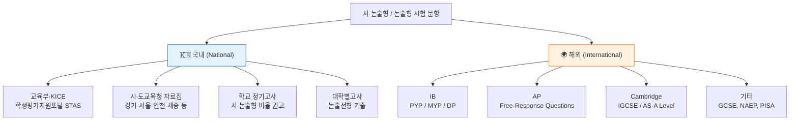

---

## 1. 국내(Domestic) — 서·논술형 평가 문항

### 1-1. 학년·과목별 자료 매트릭스

| 학교급 / 학년 | 국어 | 수학 | 사회 | 과학 | 영어 | 대표 출처 |
|---|:--:|:--:|:--:|:--:|:--:|---|
| **초 3~4** | ○ | ○ | △ | △ | △ | 경기도교육청 초등 논술형 예시자료 |
| **초 5~6** | ◎ | ◎ | ◎ | ◎ | △ | 서울교육연구정보원 현장연구(문항+루브릭) |
| **중 1~3** | ◎ | ◎ | ◎ | ◎ | ○ | 경기도교육청 중등 자료집 / 중학교 교과별 가이드북 |
| **고 1~3** | ◎ | ◎ | ◎ | ◎ | ○ | 경기도교육청 교과별 평가 문항 예시 / 시·도 자료집 |

`◎ 문항+채점기준 풍부 · ○ 일부 공개 · △ 산발적`

### 1-2. 핵심 출처 목록

| # | 자료명 | 대상 | 특징 | 링크 |
|---|---|---|---|---|
| 1 | **KICE 학생평가지원포털(STAS)** | 초·중·고 전 과목 | 국가 공식 허브. 예시문항·채점기준·평가도구 통합 | [stas.moe.go.kr](https://stas.moe.go.kr/) |
| 2 | 경기도교육청 **중등 논술형 평가 자료집** | 중·고 | 2022 개정 교육과정 반영, 핵심교원 개발 | [PDF](https://www.goe.go.kr/resource/old/BBSMSTR_000000030136/BBS_202502250541481233.pdf) |
| 3 | 경기도교육청 **교과별 평가 문항 예시** | 중·고 전 교과 | 과목별 문항 + 채점 기준표 | [PDF](https://www.goe.go.kr/resource/old/BBSMSTR_000000030136/BBS_202502250546492150.pdf) |
| 4 | 경기도교육청 **초등 논술형 평가 예시자료** | 초 | 초등 눈높이 논술형 문항 | [PDF](https://www.goe.go.kr/resource/old/BBSMSTR_000000030136/BBS_202502201054226670.pdf) |
| 5 | 경기도교육청 **서·논술형(2025)** | 중·고 | 최신 개정판 | [PDF](https://www.goe.go.kr/resource/goe/na/bbs_2675/2025/09/0b74a0d9-16a7-48fe-81f1-d0058c77ffe8.pdf) |
| 6 | 인천시교육청 **서·논술형 평가 자료** | 중·고 | 교과별 문항 개발 사례 | [PDF](https://www.ice.go.kr/upload/board/529/2019/12/1576232377002.pdf) |
| 7 | 세종시교육청 **서·논술형 평가 문항 개발** | 중·고 | 문항 개발 절차 중심 | [자료](https://edu.sje.go.kr/edu/board/download.do?menukey=5912&fno=2467&bid=00000012&did=157555) |
| 8 | 서울시교육청 **2025 중등 학생평가 내실화 계획** | 중·고 | 서·논술형 비율 권고 등 정책 문서 | [PDF](https://buseo.sen.go.kr/component/file/ND_fileDownload.do?q_fileSn=2184804&q_fileId=f30b26c5-6658-4e3f-8d0f-7a1a426d2021) |
| 9 | 서울시교육청 **학생역량·혁신교육과 자료실** | 초·중·고 | 2025.1 게시 서·논술형 자료집 | [게시판](https://buseo.sen.go.kr/buseo/bu28/user/bbs/BD_selectBbs.do?q_bbsSn=1454&q_bbsDocNo=20250127174950993) |
| 10 | 서울교육연구정보원 **초 5·6 서술·논술 문항+루브릭** | 초 5~6 | 국어·수학·사회·과학 | [현장연구](https://www.serii.re.kr/fus/MI000000000000000488/board/BO00000363/ctgynone/view0010v.do?board_seq=4765) |
| 11 | **중학교 교과별 서논술형 평가 도구 가이드북** | 중 | 성취기준→평가요소→채점→피드백 전 과정 | [티처빌](https://ssam.teacherville.co.kr/aabb/contents/15196.edu) |
| 12 | 과학과 서술형평가 문항 자료집(중학교) | 중 | 과학 단일 교과 집중 | [문서](https://www.scribd.com/document/867386231/) |
| 13 | 한·미(워싱턴주) 사회과 서·논술형 문항 비교 분석 | 중·고 | 국내외 비교 연구 | [논문](https://www.sungshin.ac.kr/bbs/edure/3950/67154/download.do) |
| 14 | 서·논술형 평가 지침 활용 연구 | 교사용 | 정책→현장 적용 | [JCE](https://www.ejce.org/archive/view_article?pid=jce-24-3-27) |

### 1-3. 국내 논술형 문항의 두 가지 형태

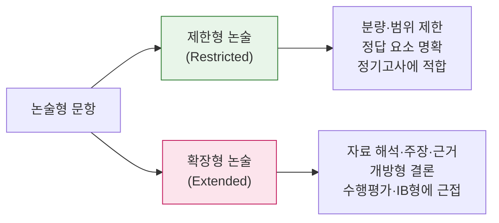

---

## 2. 해외(International) — IB 중심

### 2-1. IB 프로그램 × 학년 대응표

| IB 프로그램 | 대상 학년 | 한국 학제 | 평가 형태 | 공개 문항 |
|---|---|---|---|---|
| **PYP** | 3~12세 | 초 1~6 | 전시회(Exhibition), 교사 개발 과제 | 외부 시험 없음 |
| **MYP** | 11~16세 | 중1~고1 | eAssessment(on-screen), Personal Project | 일부 샘플 |
| **DP** | 16~19세 | 고2~3 | Paper 1/2/3 + IA + EE + TOK | **Specimen Paper 공개** |

### 2-2. DP 과목군(6 Groups) × 문항 형태

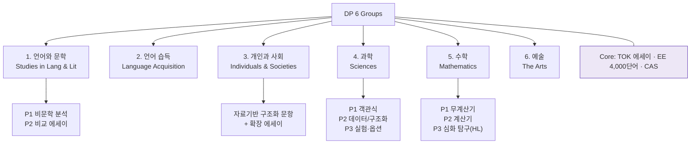

### 2-3. IB 문항 입수 경로

| 경로 | 범위 | 비용 | 비고 |
|---|---|---|---|
| **IB 공식 Sample exam papers** | 과목별 specimen | 무료 일부 | [ibo.org 샘플](https://ibo.org/programmes/diploma-programme/assessment-and-exams/sample-exam-papers/) |
| **Follett IB Store** | 실제 기출 + 마크스킴 | 유료(편당 수 달러) | IB 공식 판매처 |
| **학교 IB Coordinator** | 전 과목 specimen 세트 | 무료 | IB 월드스쿨은 라이선스 보유 |
| **Save My Exams** | 과목별 기출·마크스킴 | 부분 무료 | [DP 기출](https://www.savemyexams.com/dp/boards/ib/past-papers/) |
| **Nail IB / TutorChase** | 문항 검색 툴 | 부분 무료 | [Nail IB](https://nailib.com/ib-past-papers) · [TutorChase](https://www.tutorchase.com/past-papers/ib) |

> ⚠️ IB는 타 시험위원회와 달리 **과거 기출을 웹에 무료 전면 공개하지 않습니다.** 공식 경로는 Follett 스토어와 학교 라이선스입니다.

### 2-4. 국내 IB(한국어 DP) 현황

- 2019년 **제주·대구교육청 ↔ IBO** MOC 체결 → 한국어 DP 과목 개설
- 경북대사대부고: 2021.9 전국 공교육 최초 **IB 월드스쿨 인증**
- 한국형 DP: **한국어 4과목 + 영어 2과목** 이수 구조
- 참고: [국내 IB 학교 총정리](https://www.ibmaster.net/blog/korean-IB-schools) · [대구 IB DP 구성](https://www.edpl.co.kr/news/articleView.html?idxno=16145)

---

## 3. 해외 기타 — AP · Cambridge

### 3-1. AP (미국, College Board)

| 항목 | 내용 |
|---|---|
| 문항 유형 | **FRQ (Free-Response Questions)** = 서·논술형 |
| 공개 범위 | 전 과목 FRQ + 채점기준 + **학생 실제 답안 샘플** + 점수 분포 |
| 무료 여부 | **완전 무료 공개** (국내외 통틀어 가장 개방적) |
| 허브 | [AP Central 기출 모음](https://apcentral.collegeboard.org/courses/past-exam-questions) |
| 과목별 예시 | [Biology](https://apcentral.collegeboard.org/courses/ap-biology/exam/past-exam-questions) · [Chemistry](https://apcentral.collegeboard.org/courses/ap-chemistry/exam/past-exam-questions) · [US History](https://apcentral.collegeboard.org/courses/ap-united-states-history/exam/past-exam-questions) · [Eng Lit](https://apcentral.collegeboard.org/courses/ap-english-literature-and-composition/exam/past-exam-questions) · [Eng Lang](https://apcentral.collegeboard.org/courses/ap-english-language-and-composition/exam/past-exam-questions) · [Psychology](https://apcentral.collegeboard.org/courses/ap-psychology/exam/past-exam-questions) · [Seminar](https://apcentral.collegeboard.org/courses/ap-seminar/exam/past-exam-questions) |
| 변경 예고 | **2027년부터** 과목별 시험 2일 후 공개 방식 폐지 → 6월 초 일괄 공개 ([공지](https://apcentral.collegeboard.org/courses/past-exam-questions/release-update)) |

### 3-2. Cambridge (IGCSE / AS·A Level)

| 사이트 | 특징 | 링크 |
|---|---|---|
| PapaCambridge | 연도별 전 과목 아카이브 | [바로가기](https://pastpapers.papacambridge.com/) |
| Past Papers Academy | 로그인 없이 즉시 PDF, 마크스킴 포함 | [바로가기](https://pastpapersacademy.com/past-papers/) |
| PapersDaddy | 문제+마크스킴+examiner report 전부 무료 | [바로가기](https://www.papersdaddy.com/cambridge) |
| CIE Past Papers | IGCSE·A Level 집중 | [바로가기](https://www.ciepastpapers.com/) |
| Tutopiya Finder | IGCSE/GCSE/A Level 통합 검색 | [바로가기](https://www.tutopiya.com/tools/pastpaper-finder/) |

---

## 4. 국내 vs 해외 비교 도식

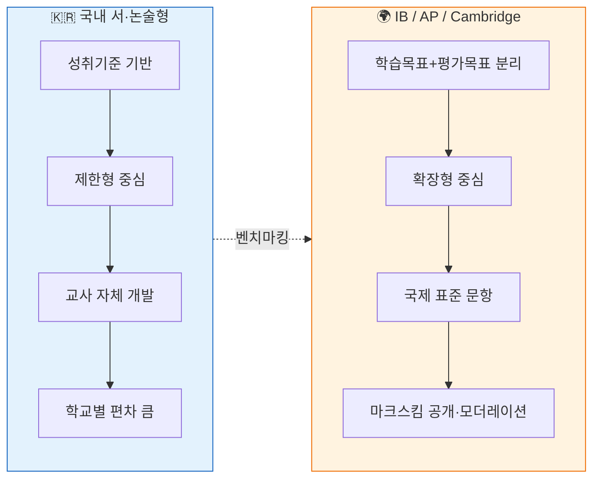

| 비교 축 | 국내 서·논술형 | IB DP | AP FRQ | Cambridge |
|---|---|---|---|---|
| 문항 공개 | 교육청 예시 자료집 | 제한적(유료/학교) | **전면 무료** | 사실상 전면 공개 |
| 채점기준 | 교사 개발 루브릭 | 공식 Markbands | 공식 Scoring Guidelines | 공식 Mark Scheme |
| 학생 답안 샘플 | 일부 자료집 | 학교 내부 | **공식 공개** | 일부 |
| 과목 범위 | 전 교과 | 6 그룹 + Core | 40여 과목 | 70여 과목 |
| 난이도 축 | 학년 | SL / HL | 단일 | Core / Extended, AS / A2 |

---

## 5. 목적별 추천 동선

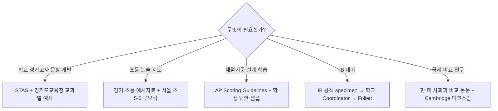

---

## 6. 과목별 실제 문항 예시

> ⚠️ **표기 원칙** — IB·AP·Cambridge 기출 원문은 저작권 보호 대상이므로 **원문 전재 대신 문항의 형식·구조·배점·지시동사를 그대로 재현한 예시**로 제시합니다. 원문은 각 항목의 〔원문〕 링크에서 확인하세요. 국내 자료집 문항은 공공 자료이나 마찬가지로 형식 재현본입니다.

### 6-0. 문항 해부도 (모든 예시의 공통 구조)

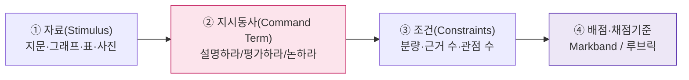

**지시동사 난이도 사다리** — 국내·해외 공통으로 이 축이 문항 수준을 결정합니다.

| 수준 | 지시동사 | 요구 사고 | 주 사용처 |
|---|---|---|---|
| 1 · 재생 | 서술하라, State, Outline | 기억·확인 | 국내 제한형 / IB SL 저배점 |
| 2 · 이해·적용 | 설명하라, Explain, Describe | 인과 연결 | 국내 중등 정기고사 |
| 3 · 분석 | 분석하라, Analyse, Compare | 요소 분해·비교 | AP FRQ / IB P2 |
| 4 · 종합·평가 | 논하라, 평가하라, Evaluate, Discuss, To what extent | 논증·반론·판단 | IB HL / TOK / 대학 논술 |

---

### 6-1. 국어 · Language and Literature

**［국내 · 중2 · 제한형 서술형 (8점)］**
> 다음은 같은 사건을 다룬 두 신문 기사 (가), (나)이다.
> (가)와 (나)가 **동일한 사실을 서로 다르게 보이게 만든 언어적 장치 두 가지**를 각각 찾아 쓰고, 그 장치가 독자의 인식에 미치는 영향을 **한 문장씩** 설명하시오. (총 4문장 이내)
>
> *채점 요소: 장치 식별(4) + 효과 설명(4) / 루브릭 3단계*

**［국내 · 고2 · 확장형 논술형 (20점)］**
> 제시문 (가)는 기술 발전이 노동의 가치를 높인다고 보고, (나)는 오히려 인간을 도구화한다고 본다.
> 두 관점을 비교한 뒤, **자신의 입장을 정하고 제시문 밖의 사례 1개를 근거로** 논술하시오. (800자 내외)

**［IB DP · Language A: Language and Literature · Paper 1 (HL, 2시간 15분)］**
> 제시된 **비문학 텍스트 2편** 각각에 대해, 안내 질문(guiding question)을 참고하여 **분석적 에세이**를 작성하시오.
> *안내 질문 예: "이 텍스트에서 시각적 배치와 언어 선택은 목표 독자를 어떻게 구성하는가?"*
> *채점: Markband 4개 축 — 이해·해석 / 분석·평가 / 초점·구성 / 언어 (각 5점, 총 20점 ×2편)*
> 〔원문〕 [IB 공식 샘플 시험지](https://ibo.org/programmes/diploma-programme/assessment-and-exams/sample-exam-papers/)

**［AP English Literature · FRQ Q3 (Literary Argument, 40분)］**
> 문학 작품 중 **인물이 자신의 신념과 충돌하는 선택을 하는 작품**을 하나 골라, 그 선택이 작품 전체의 의미에 어떻게 기여하는지 분석하는 에세이를 쓰시오.
> *채점: Row A 논제(1) + Row B 근거·논평(4) + Row C 정교성(1) = 6점*
> 〔원문〕 [AP English Literature 기출](https://apcentral.collegeboard.org/courses/ap-english-literature-and-composition/exam/past-exam-questions)

---

### 6-2. 수학 · Mathematics

**［국내 · 중3 · 서술형 (10점)］**
> 이차함수 `y = x² - 4x + k` 의 그래프가 x축과 서로 다른 두 점에서 만난다.
> (1) k의 값의 범위를 **판별식을 이용하여 풀이 과정과 함께** 구하시오. (5점)
> (2) k = 3일 때, 두 교점과 꼭짓점을 이은 삼각형의 넓이를 구하는 과정을 서술하시오. (5점)
>
> *채점: 과정 점수 분할 — 식 세움(2) · 계산(2) · 결론 서술(1)*

**［국내 · 고1 · 논술형 (문제해결 설명형)］**
> 어떤 학생이 `a² = b²` 이므로 `a = b` 라고 결론지었다.
> 이 추론이 **왜 옳지 않은지**를 반례를 들어 설명하고, 올바른 결론이 되도록 조건을 수정하여 다시 서술하시오.

**［IB DP · Mathematics: Analysis and Approaches · Paper 2 (계산기 허용)］**
> 어떤 개체군의 크기가 `P(t) = 1200 / (1 + 5e^(-0.4t))` 로 모형화된다.
> (a) 초기 개체 수를 구하시오. **[2]**
> (b) 개체 수가 1000을 넘는 최소 정수 t를 구하시오. **[3]**
> (c) `P'(t)` 가 최대가 되는 시점을 구하고, 그 시점이 이 모형에서 갖는 **의미를 설명하시오**. **[5]**
>
> *배점이 문항 끝 대괄호로 명시되고, method mark(M)/answer mark(A)로 분할 채점되는 것이 IB·Cambridge 공통 형식입니다.*

**［Cambridge A Level Mathematics · Paper 3 형식］**
> `f(x) = 2x³ - 9x² + 12x` 에 대하여
> (i) 극값을 구하고 그 성질을 판정하시오. **[4]**
> (ii) 곡선 `y = f(x)` 의 개형을 그리시오. **[2]**
> (iii) `f(x) = k` 가 서로 다른 세 실근을 갖도록 하는 k의 범위를 구하시오. **[3]**
> 〔원문〕 [PapaCambridge](https://pastpapers.papacambridge.com/)

---

### 6-3. 사회 · Individuals and Societies

**［국내 · 중1 · 자료해석 서술형 (8점)］**
> 자료 (가)는 A국의 연령별 인구 구조 변화, (나)는 같은 기간 복지 지출 비중을 나타낸다.
> (1) (가)에서 읽을 수 있는 인구 구조의 변화를 **한 문장으로** 쓰시오. (2점)
> (2) 그 변화가 (나)의 추세에 어떤 영향을 주었는지 **인과 관계가 드러나게** 서술하시오. (6점)

**［국내 · 고2 · 확장형 논술형 (20점)］**
> 재난 상황에서 정부가 개인의 이동을 제한하는 조치에 대해, 자료 (가)~(다)를 근거로 **찬성·반대 두 입장을 각각 제시**한 뒤, 자신의 견해를 정당화하시오. (1,000자)
> 〔유사 문항 자료〕 [경기도교육청 교과별 평가 문항 예시](https://www.goe.go.kr/resource/old/BBSMSTR_000000030136/BBS_202502250546492150.pdf)

**［IB DP · History · Paper 2 (비교 에세이, 45분/편)］**
> **두 개의 서로 다른 지역**에서 일어난 권위주의 국가의 성립을 예로 들어, **경제적 요인이 그 성립에 얼마나 중요했는지 평가하시오(To what extent).**
> *채점 15점 Markband: 초점·구조(0-3) / 지식·이해(0-6) / 비판적 분석(0-6)*
> *핵심: "두 지역"이라는 조건을 어기면 상한 점수가 강제로 내려갑니다.*

**［IB DP · History · Paper 1 (자료 기반, 60분)］**
> 자료 A~D를 보고
> (a) 자료 A에서 필자가 주장하는 바 두 가지를 쓰시오. **[3]**
> (b) 자료 C에 담긴 **메시지를 해석하시오**(정치 만평). **[2]**
> (c) 자료 B와 D의 **출처·목적·내용의 가치와 한계(OPVL)** 를 분석하시오. **[4]**
> (d) 자료와 **자신의 지식**을 모두 사용하여 "…" 주장을 평가하시오. **[9]**

**［AP U.S. History · DBQ (60분)］**
> 1865~1900년 사이 산업화가 미국 사회 구조를 변화시킨 정도를 **7개 문서를 근거로** 평가하시오.
> *채점 7점: 논제(1) · 맥락화(1) · 문서 근거(2) · 외부 증거(1) · 문서 활용 분석(1) · 논증의 정교성(1)*
> 〔원문〕 [AP US History 기출](https://apcentral.collegeboard.org/courses/ap-united-states-history/exam/past-exam-questions)

---

### 6-4. 과학 · Sciences

**［국내 · 중2 · 실험 설계 서술형 (10점)］**
> 식물의 광합성량이 빛의 세기에 따라 달라지는지 확인하려 한다.
> (1) 이 실험의 **독립변인·종속변인·통제변인**을 각각 쓰시오. (3점)
> (2) 실험 과정을 3단계로 서술하고, **예상 결과를 그래프 개형으로** 그리시오. (7점)

**［국내 · 고1 · 통합과학 논술형］**
> 동일한 질량의 물과 모래를 같은 열원으로 가열했을 때 온도 변화 그래프가 아래와 같았다.
> 두 물질의 **비열 차이**로 이 결과를 설명하고, 이를 이용해 **해안 지역의 해륙풍 발생**을 서술하시오.

**［IB DP · Biology · Paper 2 (데이터 기반 + 확장 응답)］**
> 그래프는 서로 다른 pH에서 효소 X의 반응 속도를 나타낸다.
> (a) 최적 pH를 추정하시오. **[1]**
> (b) pH 9에서 반응 속도가 감소한 이유를 **분자 수준에서 설명하시오**. **[3]**
> (c) 이 실험만으로 "효소 X는 위(胃)에서 작용하지 않는다"고 결론 내릴 수 **없는 이유를 논하시오**. **[4]**
> (d) **확장 응답(Section B):** 세포막을 통한 물질 이동 방식을 능동수송과 수동수송으로 나누어 설명하시오. **[9]**

**［IB DP · Physics · Paper 3 (실험·데이터 분석)］**
> 학생이 진자의 주기 T와 길이 L을 측정했다.
> (a) `T²` 대 `L` 그래프를 그렸을 때 기울기가 나타내는 물리량을 쓰시오. **[2]**
> (b) 오차 막대를 고려하여 **최대·최소 기울기로 불확도를 계산**하시오. **[3]**
> (c) 계통 오차의 원인 하나를 제시하고 **개선 방안을 설명하시오**. **[2]**

**［AP Chemistry · FRQ Q1 (Long, 20분)］**
> 약산 HA 0.10 M 용액 25.0 mL를 0.10 M NaOH로 적정하였다.
> (a) 당량점에서의 pH가 7보다 큰 이유를 설명하시오.
> (b) 반당량점에서 pH = pKa 임을 **화학 평형식을 이용해 정당화**하시오.
> (c) 지시약 선택이 타당한지 판단하고 근거를 제시하시오.
> 〔원문〕 [AP Chemistry 기출](https://apcentral.collegeboard.org/courses/ap-chemistry/exam/past-exam-questions)

---

### 6-5. 영어 · Language Acquisition

**［국내 · 중3 · 영어 서술형 (8점)］**
> 다음 글을 읽고, 글쓴이가 제안한 해결책의 **한계를 한 가지 지적**하고 **대안을 영어 두 문장으로** 쓰시오.
> *채점: 내용 적절성(4) + 어법 정확성(2) + 어휘·응집성(2)*

**［IB DP · Language B (English B) · Paper 2 Writing (HL)］**
> 세 가지 과제 중 하나를 골라 **450~600단어**로 작성하시오. 텍스트 유형(블로그/연설문/공식 서한)을 명시하고 그 형식적 특징을 지킬 것.
> *예: 학교 신문 사설 — "교내 스마트폰 전면 금지"에 대한 자신의 입장을 논하시오.*
> *채점: 언어(12) + 메시지(12) + 개념적 이해(장르·독자·목적, 6)*

**［Cambridge IGCSE First Language English · Paper 2］**
> 제시문을 읽고, 등장인물 중 한 사람의 관점에서 **일기 형식으로** 사건을 다시 서술하시오. (250~350단어)
> *채점: 읽기 15점(내용 선택·전개) + 쓰기 10점(문체·구조·정확성)*

---

### 6-6. IB Core — TOK / EE

**［TOK Essay · 규정 제목 형식 (1,600단어)］**
> "지식 생산에서 **합의(consensus)** 는 언제 신뢰의 근거가 되고 언제 방해가 되는가?" **두 개의 지식 영역(AOK)** 을 참조하여 논하시오.
> *채점 단일 10점 Markband: 지식 질문에 대한 지속적·집중적·설득력 있는 논의 여부*

**［EE · Extended Essay 연구질문 형식 (4,000단어)］**
> 좋은 RQ 예: "20세기 후반 한국의 산업 정책은 중소기업 혁신 역량에 **어느 정도로** 기여했는가?"
> 나쁜 RQ 예: "한국 경제는 어떻게 성장했는가?" *(범위 과다·평가 축 부재)*

---

### 6-7. 같은 주제, 문항 형태 비교 — "기후 변화"

이 표 하나로 국내/해외 문항 설계 철학 차이가 드러납니다.

| 출처 | 문항 형태 | 요구 산출물 | 배점 구조 |
|---|---|---|---|
| **국내 중3 과학 서술형** | 온실기체 그래프 제시 → 원인 서술 | 3~4문장 | 요소별 배점(2+3+3) |
| **국내 고2 사회 논술형** | 찬반 자료 3개 → 입장 정당화 | 1,000자 | 루브릭 3~4단계 |
| **IB DP Geography P2** | "완화(mitigation) 전략이 적응(adaptation)보다 효과적이라는 주장을 평가하시오" | 에세이 | Markband 10점 |
| **IB DP ESS P2** | 시스템 다이어그램 해석 + 정책 평가 | 구조화 + 확장 | [2][4][9] 분할 |
| **AP Environmental Science FRQ** | 데이터 표 → 계산 + 설계 + 제안 | 계산 과정 + 단문 | 10점 항목별 |
| **Cambridge A Level Geography** | 자료 해석 + 사례 기반 논술 | 에세이 20점 | Level 1~4 |

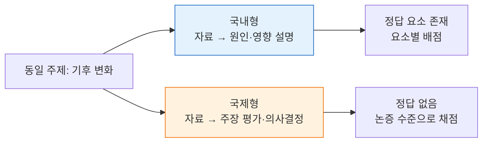

---

## 7. 채점 루브릭 전문 (Marking Criteria)

> ⚠️ **표기 원칙** — IB Markband·AP Scoring Guidelines의 **공식 문구는 저작권 대상**이므로, 각 등급의 **판정 기준·배점 구조·등급 경계**를 우리말로 재구성한 실무용 루브릭으로 제시합니다. 채점 실무에 그대로 쓸 수 있는 수준으로 상세화했고, 공식 원문 위치는 각 절 끝에 링크했습니다.

### 7-0. 루브릭의 두 종류

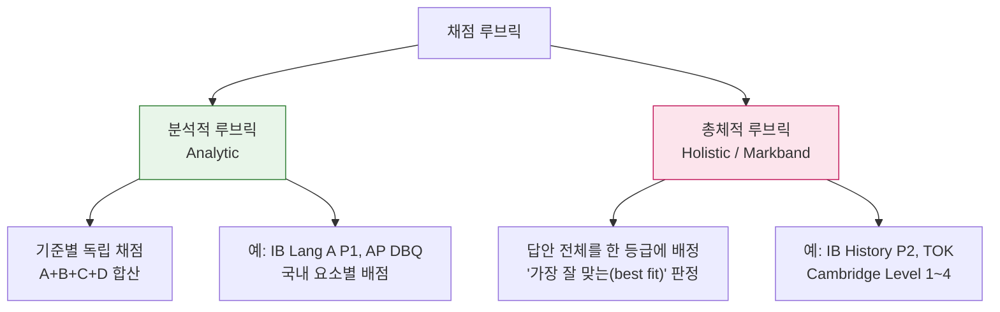

| 구분 | 분석적 | 총체적 |
|---|---|---|
| 채점 신뢰도 | 높음(기준 분리) | 낮음(채점자 훈련 필수) |
| 피드백 유용성 | 높음(약한 기준 지목 가능) | 낮음(총평 위주) |
| 채점 속도 | 느림 | 빠름 |
| 적합 문항 | 요소가 분명한 서술형 | 논증·창작 등 개방형 |
| 국내 권장 | **정기고사 서술형** | 수행평가 확장형 논술 |

---

### 7-1. IB Language A · Paper 1 (4기준 × 5점 = 20점)

SL은 1편(20점), HL은 2편을 각각 독립 채점(총 40점). **SL·HL 기준은 동일**하며, 안내 질문(guiding question)은 그 자체로 채점 대상이 아닙니다 — 안내 질문만 성실히 따라가며 **설명(describe)** 에 그친 답안은 상위 등급에 오르지 못하고, 다른 실마리를 잡았더라도 **분석(analyse)** 이 강하면 만점권이 가능합니다.

**Criterion A — 지식·이해·해석 (5점)**

| 점수 | 판정 기준 |
|:--:|---|
| 5 | 텍스트를 통찰력 있게 이해. 해석이 일관되게 설득력 있고, 근거 인용이 정밀하며 해석을 실제로 뒷받침함 |
| 4 | good 수준의 이해. 해석이 대체로 타당하고 근거가 적절히 뒷받침 |
| 3 | 적절한 이해. 해석이 있으나 부분적으로만 뒷받침됨 |
| 2 | 제한적 이해. 해석보다 내용 요약(paraphrase)에 가까움 |
| 1 | 피상적 이해. 근거가 거의 없거나 부적절 |
| 0 | 위 기준에 미달 |

**Criterion B — 분석·평가 (5점)**

| 점수 | 판정 기준 |
|:--:|---|
| 5 | 언어·구성·문체 선택이 **의미를 어떻게 만들어내는지**를 통찰력 있게 분석·평가 |
| 4 | 선택과 효과의 관계를 대체로 잘 분석 |
| 3 | 기법을 **식별**하고 효과를 일부 설명(식별에서 효과로 넘어가는 힘이 약함) |
| 2 | 기법 나열 위주. 효과 설명 거의 없음 |
| 1 | 기법 언급이 산발적이거나 부정확 |

> 💡 **3점 벽**: 대부분의 답안이 여기서 막힙니다. `"은유가 쓰였다"`(2) → `"은유가 X를 강조한다"`(3) → `"이 은유가 독자를 Y의 위치에 놓아 Z를 자연스럽게 받아들이게 만든다"`(5).

**Criterion C — 초점·구성·전개 (5점)**

| 점수 | 판정 기준 |
|:--:|---|
| 5 | 초점이 일관되고 명확. 논지가 **균형 있게 전개**되며 문단 간 연결이 효과적 |
| 4 | 대체로 초점이 유지되고 구성이 명확 |
| 3 | 초점이 있으나 흔들림. 구성이 다소 기계적 |
| 2 | 초점이 약하고 구성이 산만 |
| 1 | 구성이라 보기 어려움 |

**Criterion D — 언어 (5점)**

| 점수 | 판정 기준 |
|:--:|---|
| 5 | 명확·정확·다양. 어휘와 문체가 **학술적 분석에 적합** |
| 4 | 대체로 명확·정확. 오류가 의미를 방해하지 않음 |
| 3 | 적절하나 오류가 눈에 띔. 문체가 단조로움 |
| 2 | 오류가 잦아 이해에 지장 |
| 1 | 소통이 어려움 |

〔공식 원문〕 [IB Lang & Lit 평가 기준 정리(West Sound Academy LibGuides)](https://libguides.westsoundacademy.org/ib-language-and-literature-hl-2026/assessment-decriptions-and-criteria) · [Save My Exams 채점 가이드](https://www.savemyexams.com/dp/english-language-and-literature/ib/english-a-language-and-literature/19/hl/revision-notes/4-paper-1-guided-textual-analysis/how-to-approach-paper-1-guided-textual-analysis/guided-textual-analysis-model-answers/)

---

### 7-2. IB History · Paper 2 (총체적 Markband 15점)

**단일 총체적 기준**입니다. 네 축(지식 / 사례 / 분석 / 구조)을 종합해 **하나의 등급대**에 배정합니다.

| 등급대 | 지식·이해 | 사례 활용 | 비판적 분석 | 구조·초점 |
|:--:|---|---|---|---|
| **13–15** | 정확하고 상세하며 **맥락화**됨 | 적확한 사례가 논지에 통합됨 | 논증이 **일관되게 지속**되고 반론까지 다룸 | 명료·설계된 구조. 질문에 처음부터 끝까지 집중 |
| **10–12** | 정확하고 상세함 | 적절한 사례가 뒷받침 | 분석이 명확하나 일부 서술로 흐름 | 구조가 명확, 초점 대체로 유지 |
| **7–9** | 대체로 정확하나 깊이 부족 | 사례가 있으나 일반적 | **분석과 서술이 혼재** | 구조는 있으나 논지 전개가 약함 |
| **4–6** | 부분적·일반적 지식 | 사례가 빈약하거나 부정확 | 거의 서술 위주 | 조직이 느슨, 질문과 부분적으로만 연결 |
| **1–3** | 지식이 매우 제한적 | 사례 없음 | 주장 나열 | 구조 없음 |
| **0** | 관련성 없음 | | | |

**등급을 강제로 낮추는 조건(Question Requirements)**
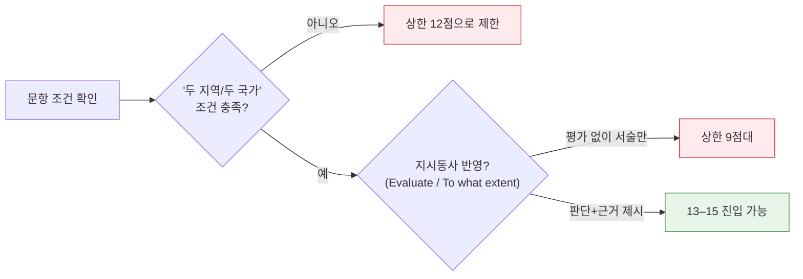

〔공식 원문〕 [Paper 2 Markbands 정리본](https://www.scribd.com/document/680941343/Paper-2-Markbands) · [Paper 2 가이드](https://www.ts-tutoring.com/blog/ib-history-paper-2)

---

### 7-3. IB 수학 · 문항별 분할 채점 (M / A / R 마크)

IB·Cambridge 수학은 **답이 틀려도 과정 점수를 줍니다.** 국내 수학 서술형 채점 설계에 그대로 이식할 수 있는 구조입니다.

| 마크 | 의미 | 부여 조건 |
|:--:|---|---|
| **M** | Method | 올바른 방법·전략을 사용. **계산 실수와 무관하게 부여** |
| **A** | Accuracy | 정확한 결과. 단 **선행 M 마크가 있어야 부여 가능** |
| **R** | Reasoning | 논리적 정당화·설명 |
| **AG** | Answer Given | 답이 문제에 주어진 경우, **과정만** 채점 |
| **FT** | Follow Through | 앞 소문항의 틀린 답을 **일관되게 사용**했다면 이후 점수 인정 |

**적용 예 — 앞 6-2절 IB 수학 (c) [5점] 채점표**

| 단계 | 마크 | 점수 |
|---|:--:|:--:|
| `P'(t)` 미분식 세움 | M1 | 1 |
| `P''(t) = 0` 조건 설정 | M1 | 1 |
| `t` 값 정확히 산출 | A1 | 1 |
| 변곡점 = 증가율 최대 시점임을 진술 | R1 | 1 |
| 개체군 맥락에서의 의미 해석 | R1 | 1 |

> 💡 **국내 적용 팁**: "풀이 과정 3점 / 답 2점"처럼 뭉뚱그리지 말고 위처럼 **행동 단위로 분할**하면 채점자 간 편차가 급감합니다.

---

### 7-4. AP DBQ 루브릭 (7점 분석적) — US History 기준

국내 사회과 논술형 루브릭 설계에 가장 참고할 만한 모델입니다. **각 점수가 독립적으로 획득**됩니다.

| 항목 | 배점 | 획득 조건 | 흔한 실패 |
|---|:--:|---|---|
| **A. 논제 (Thesis)** | 1 | 역사적으로 **방어 가능한 주장**을 제시하고, 추론 노선을 담을 것. 서론 또는 결론에 위치 | 질문을 다시 쓴 것에 불과 |
| **B. 맥락화 (Contextualization)** | 1 | 주제를 **더 넓은 역사적 맥락** 속에 배치(앞뒤 시기·다른 지역 연결) | 한 문장짜리 배경 언급 |
| **C. 문서 근거** | 2 | **3개 문서** 활용 시 1점 → **6개 이상** 문서를 논증 뒷받침에 사용 시 2점 | 문서를 인용만 하고 주장과 연결 안 함 |
| **D. 외부 증거** | 1 | 문서에 없는 **구체적 역사 사실 1개**를 논증에 사용 | 막연한 일반론 |
| **E. 문서 분석 (HAPP)** | 1 | **2개 이상** 문서에 대해 출처·목적·청중·시각 중 하나가 **왜 논증에 중요한지** 설명 | "이 문서는 편향적이다"로 끝냄 |
| **F. 정교성 (Complexity)** | 1 | 반증·다양한 관점·모순의 인정 등 **주제의 복잡성을 입증** | 가장 낮은 획득률(상위권도 자주 실패) |

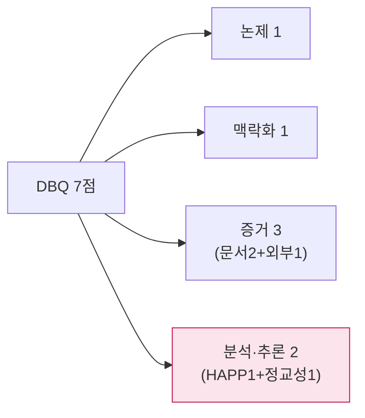

〔공식 원문〕 [AP US History 채점기준·학생 답안 샘플](https://apcentral.collegeboard.org/courses/ap-united-states-history/exam/past-exam-questions)

---

### 7-5. AP English 에세이 루브릭 (6점 분석적)

| 항목 | 배점 | 기준 |
|---|:--:|---|
| **Row A · 논제** | 0–1 | 해석 가능한 주장이 있는가 (요약·자명한 진술은 0) |
| **Row B · 근거와 논평** | 0–4 | 0: 근거 없음 / 1: 일반적 요약 / 2: 구체적 근거는 있으나 논평 부족 / 3: 근거+논평이 논제를 뒷받침 / **4: 근거가 일관되게 선별되고 논평이 각 근거가 논증에 기여하는 바를 설명** |
| **Row C · 정교성** | 0–1 | 복잡성·긴장·대안적 해석을 다루거나, **문체가 일관되게 설득력** 있음 |

---

### 7-6. IB TOK 에세이 루브릭 (총체적 10점)

단일 평가 질문: **"제시된 제목에 대해 지속적이고 집중적이며 설득력 있는 논의를 했는가?"**

| 등급대 | 판정 |
|:--:|---|
| **9–10 Excellent** | 제목에 대한 논의가 **지속적·집중적·설득력** 있음. 지식 주장이 명확히 연결되고, **효과적인 반론(counterclaim)** 과 함께 관점의 함의까지 탐구 |
| **7–8 Good** | 논의가 대체로 집중적이고 근거가 있음. 다른 관점을 인식하나 탐구 깊이는 제한적 |
| **5–6 Satisfactory** | 제목과 연결되나 논의가 서술적·일반적. 지식 질문이 암시적 수준 |
| **3–4 Basic** | 제목과의 연결이 표면적. 주장 나열, 근거 빈약 |
| **1–2 Rudimentary** | 제목에 대한 이해가 거의 드러나지 않음 |

**TOK 가점 요소 체크리스트**
- [ ] **두 개 이상의 지식 영역(AOK)** 을 실질적으로 비교했는가
- [ ] 각 AOK마다 **구체적 실례(real-life example)** 가 있는가
- [ ] **반론을 세우고 응답**했는가 (단순 언급 ✗)
- [ ] 지식 **생산자·방법·맥락**의 차이를 짚었는가

---

### 7-7. Cambridge Level-based 루브릭 (A Level 인문·사회 20점형)

| Level | 점수 | 기준 |
|:--:|:--:|---|
| **4** | 16–20 | 질문에 **직접** 답하는 지속적 논증. 사례가 정확하고 통합적. 판단에 근거가 있음 |
| **3** | 11–15 | 분석이 있으나 일부 서술적. 사례 적절. 판단이 일반적 |
| **2** | 6–10 | 주로 서술. 관련성은 있으나 논증 구조 약함 |
| **1** | 1–5 | 단편적·부정확. 질문과 연결 희박 |

〔원문〕 [PapaCambridge 마크스킴](https://pastpapers.papacambridge.com/)

---

### 7-8. 국내 서·논술형 루브릭 표준 양식 (바로 사용 가능)

**① 제한형 서술형 — 요소별 배점표 (8점 예시)**

| 평가 요소 | 배점 | 상 (만점) | 중 (부분) | 하 (0~1) |
|---|:--:|---|---|---|
| 개념의 정확성 | 3 | 핵심 용어를 정확히 사용하여 진술 | 용어는 맞으나 진술이 불완전 | 용어 오류 또는 무응답 |
| 자료 해석 | 3 | 자료에서 근거를 정확히 추출해 연결 | 근거는 찾았으나 연결이 약함 | 자료와 무관한 진술 |
| 진술의 완결성 | 2 | 조건(문장 수·형식)을 모두 충족 | 일부 미충족 | 형식 미준수 |

**② 확장형 논술형 — 4기준 × 5단계 (20점 예시)**

| 기준 | 5 (탁월) | 4 (우수) | 3 (보통) | 2 (미흡) | 1 (부족) |
|---|---|---|---|---|---|
| **내용 이해** | 제시문의 핵심 논점을 정확히 파악하고 상호 관계까지 해석 | 핵심 논점을 정확히 파악 | 논점 파악이 부분적 | 표면적 요약 수준 | 오독 |
| **논증 구성** | 주장–근거–반론–재반박이 유기적 | 주장과 근거가 타당하게 연결 | 주장은 있으나 근거가 빈약 | 주장이 불명확 | 논증이라 보기 어려움 |
| **자료 활용** | 제시문 + 외부 사례를 논지에 통합 | 제시문을 적절히 인용 | 인용은 있으나 논지와 느슨 | 단순 베껴 쓰기 | 활용 없음 |
| **표현** | 문단 구성이 명료하고 어법이 정확 | 대체로 명료·정확 | 오류가 있으나 소통 가능 | 오류가 잦아 이해 지장 | 소통 곤란 |

**③ 채점 신뢰도 확보 절차**

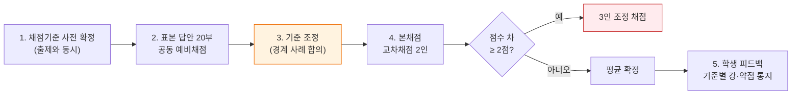

> 💡 IB의 **moderation**(표본을 IB 본부가 재채점해 학교 점수를 보정)에 해당하는 국내 장치가 3~4단계입니다. 이 절차 없이는 어떤 정교한 루브릭도 신뢰도를 담보하지 못합니다.

---

### 7-9. 루브릭 비교 한눈에

| | IB Lang A P1 | IB History P2 | IB TOK | AP DBQ | AP English | Cambridge | 국내 확장형 |
|---|:--:|:--:|:--:|:--:|:--:|:--:|:--:|
| 유형 | 분석적 | 총체적 | 총체적 | 분석적 | 분석적 | 총체적 | 분석적 |
| 총점 | 20 | 15 | 10 | 7 | 6 | 20 | 20 |
| 기준 수 | 4 | 1(4축) | 1 | 6 | 3 | 1 | 4 |
| 언어 표현 별도 채점 | **○** | ✗ | ✗ | ✗ | 부분 | ✗ | ○ |
| 반론 요구 | △ | ○ | **◎** | ◎(정교성) | ○ | ○ | 설계에 따라 |
| 외부 지식 요구 | ✗ | ◎ | ◎ | ○ | ✗ | ◎ | 설계에 따라 |

---

## 8. 6개 교과 심화 — 국어 · 영어 · 수학 · 역사 · 사회 · 철학

각 교과를 **① 문항 유형 지도 → ② 학년별 문항 예시 → ③ 채점 포인트** 3단으로 확장합니다.
(문항은 모두 형식 재현본이며, 원문 위치는 1·2장 링크 참조)

---

### 8-1. 국어 (Korean / Language A)

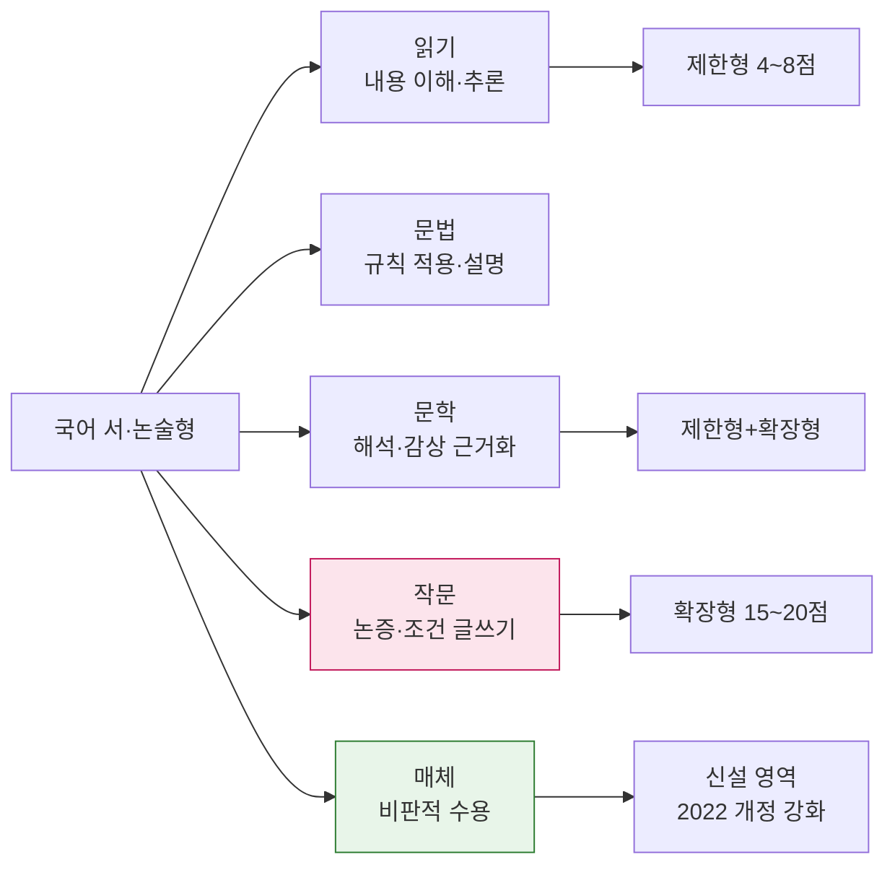

| 학년 | 문항 예시 | 배점 |
|---|---|:--:|
| **중1** | 설명문 (가)에서 글쓴이가 사용한 **설명 방법 두 가지**를 찾아 쓰고, 그 방법이 독자의 이해를 돕는 이유를 각각 한 문장으로 서술하시오. | 6 |
| **중2** | 시 (가)의 화자가 처한 상황을 **시어 두 개를 근거로** 설명하고, 마지막 행의 어조 변화가 주제에 미치는 효과를 서술하시오. | 8 |
| **중3** | 토론 자료 (가)(나)를 읽고, 반대 측 주장의 **논리적 허점 한 가지**를 지적한 뒤 이를 보완할 근거를 제시하시오. | 10 |
| **고1** | 동일 사건을 보도한 기사 (가)와 SNS 게시물 (나)를 비교하여, **매체의 특성이 정보의 신뢰도에 미치는 영향**을 논하시오. (600자) | 15 |
| **고2** | 제시문 (가)는 '공정'을 기회의 평등으로, (나)는 결과의 보정으로 본다. 두 관점을 비교하고 **구체적 정책 사례 하나**를 들어 자신의 입장을 논술하시오. (900자) | 20 |
| **고3** | (가)~(라)를 활용하여 '기술 중립성' 주장을 **비판적으로 검토**하고, 대안적 관점을 제시하시오. (1,200자) | 25 |

**［IB DP Language A 대응］**
- *Literature* **Paper 2**: 학습한 **두 작품**을 사용해 제시된 질문에 답하는 비교 에세이 (4기준 30점)
- *Language & Literature* **HL Essay**: 수업에서 다룬 텍스트에 대한 **1,200~1,500단어 연구 에세이**
- **IO (Individual Oral)**: 전 지구적 이슈(global issue)를 문학 작품 + 비문학 텍스트 발췌로 15분간 구술

**채점 포인트**
| 자주 깎이는 지점 | 처방 |
|---|---|
| "근거를 들어"인데 제시문 **인용 없이** 자기 생각만 | 인용 문장 수를 조건에 명시 |
| 비교 문항인데 한 쪽만 서술 | **양쪽 각각 배점 분리** |
| 조건(자수·문단 수) 미준수 | 형식 점수 2점을 별도 항목화 |
| 요약으로 끝남 | "그래서 무엇을 의미하는가" 1문장을 필수 요소로 |

---

### 8-2. 영어 (English / Language B)

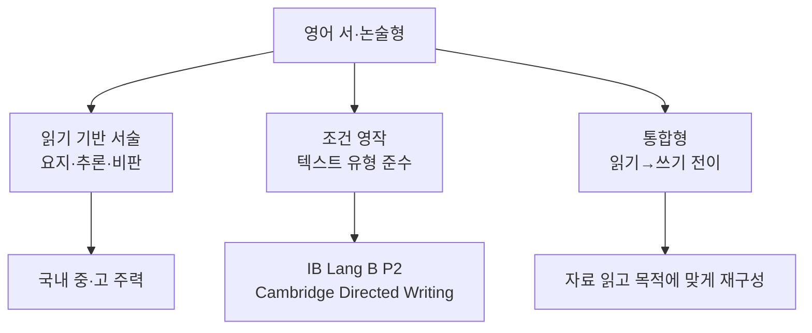

| 학년 | 문항 예시 | 배점 |
|---|---|:--:|
| **중2** | 글을 읽고 주인공의 감정 변화를 **before / after 구조로** 영어 두 문장으로 쓰시오. (`felt ~ because ~` 포함) | 6 |
| **중3** | 글쓴이의 해결책에 대한 **한계 한 가지**를 지적하고 대안을 영어 2~3문장으로 제시하시오. | 8 |
| **고1** | 도표를 보고 두드러진 경향 **두 가지**를 영어로 기술하고, 그 원인에 대한 자신의 가설을 한 문장으로 쓰시오. | 10 |
| **고2** | 교내 신문 **사설(editorial)** 형식으로 "AI 사용의 교내 규정"에 대한 입장을 150단어로 작성하시오. 제목·리드·주장·근거·결론 포함. | 15 |

**［IB DP Language B · Paper 2 Writing 텍스트 유형］** — 형식 준수 자체가 **개념적 이해(6점)** 항목입니다.

| 유형 | 필수 형식 요소 |
|---|---|
| Blog post | 제목, 작성일, 구어적 어조, 독자 호명, 댓글 유도 |
| Speech | 청중 호칭, 수사 의문·반복, 맺음 구호 |
| Formal letter | 발신·수신 주소, 격식 인사, 목적 문단, 정중한 맺음 |
| Article | 헤드라인, 부제, 인용, 중립적 어조 |
| Brochure | 소제목, 불릿, 행동 유도 문구 |

**채점 배분 (Language B Paper 2 HL)** — 언어 12 + 메시지 12 + 개념적 이해 6 = **30점**

| 기준 | 상위 등급 조건 |
|---|---|
| 언어 | 어휘가 다양하고 목적에 맞음. 오류가 있어도 소통 방해 없음 |
| 메시지 | 과제 요구를 **모두** 충족, 아이디어가 전개·뒷받침됨 |
| 개념적 이해 | 장르·독자·목적·의미가 **일관되게 정렬**됨 |

---

### 8-3. 수학 (Mathematics)

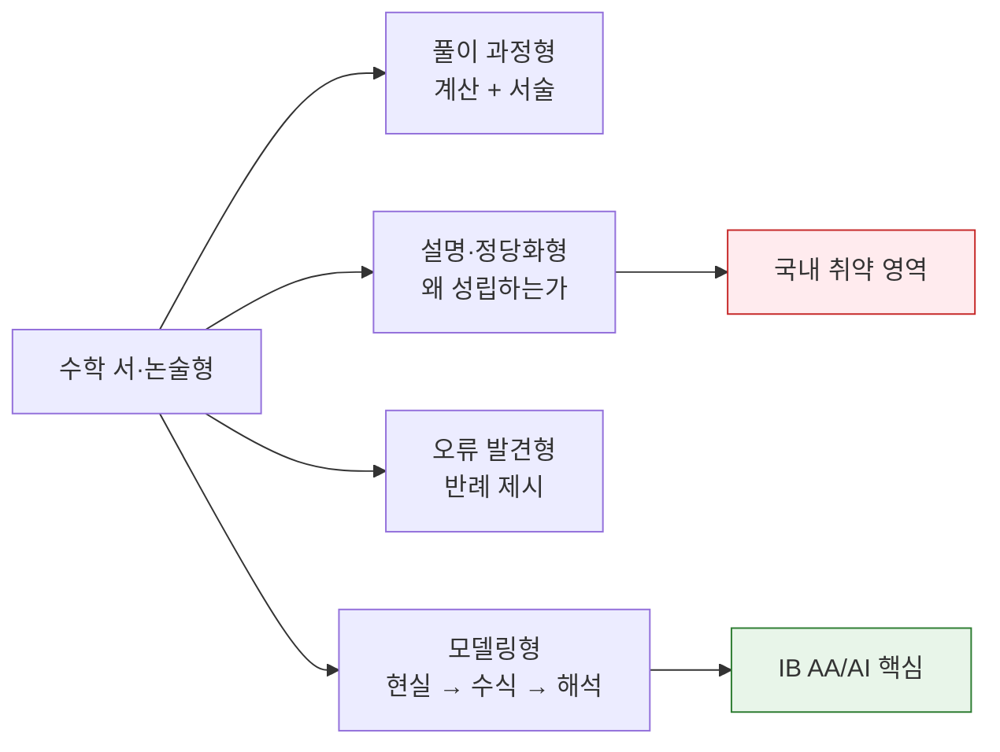

| 학년 | 문항 예시 | 유형 |
|---|---|---|
| **중1** | 두 수의 최대공약수가 12, 최소공배수가 72인 자연수 쌍을 **모두** 구하고, 빠짐없이 찾았음을 설명하시오. | 정당화 |
| **중2** | 일차함수 그래프가 두 점을 지날 때 식을 구하는 과정을 서술하고, 기울기의 **실생활 의미**를 쓰시오. | 과정+해석 |
| **중3** | 어떤 학생이 `√(a²) = a` 라고 했다. 옳지 않은 이유를 **반례**로 보이고 올바른 식으로 고치시오. | 오류 발견 |
| **고1** | 이차부등식 `x² - (k+1)x + k < 0` 의 해가 존재하지 않을 조건을 **판별식과 그래프 두 방법으로** 각각 설명하시오. | 다중 표현 |
| **고2** | 어떤 약물의 혈중 농도가 지수적으로 감소한다. 반감기 데이터를 이용해 모형을 세우고, **6시간 후 농도와 그 한계**를 논하시오. | 모델링 |
| **고3** | `f(x)`가 미분가능할 때 `f'(c)=0` 이면 `x=c`가 극값이라는 명제의 **참·거짓을 판정**하고 근거를 제시하시오. | 명제 검증 |

**［IB Mathematics 두 갈래］**

| | **AA** (Analysis & Approaches) | **AI** (Applications & Interpretation) |
|---|---|---|
| 초점 | 대수적 조작·증명 | 실데이터·모델링·기술 활용 |
| Paper 1 | **무계산기** | 계산기 허용 |
| HL 전용 | Paper 3 심화 탐구 | Paper 3 실세계 문제 |
| 한국 학생 적합 | 이과 계열 | 사회·경영 계열 |

**채점 포인트** — 7-3절 M/A/R 구조를 그대로 적용하되, 국내 서술형은 다음 3개를 명시하세요.
1. **부분점수 부여 기준**: "식을 세웠으면 정답과 무관하게 M1"
2. **FT(이월) 인정 범위**: 앞 소문항 오답이 뒤에 미치는 영향
3. **서술 요구 명시**: "구하시오"(답만) vs "**과정을 서술하시오**"(과정 배점 존재)

---

### 8-4. 역사 (History)

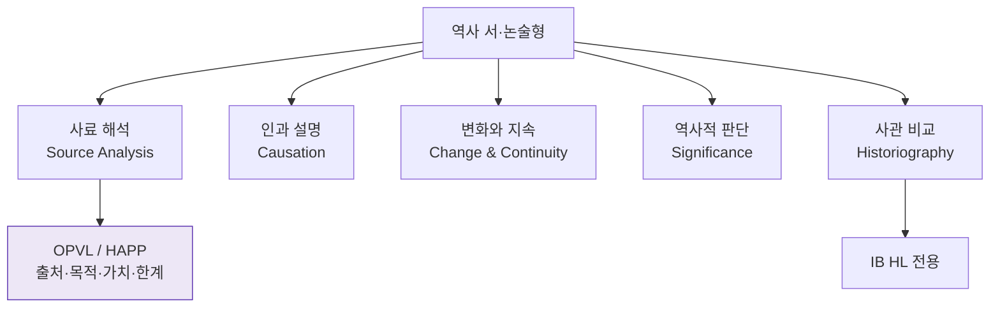

| 학년 | 문항 예시 | 핵심 역량 |
|---|---|---|
| **중2** | 자료 (가)는 조선 후기 상품화폐경제 관련 기록이다. 이 자료로 알 수 있는 사회 변화 **두 가지**를 쓰시오. | 사료 독해 |
| **중3** | 같은 사건을 다룬 A·B 두 기록이 다르게 서술한 이유를 **기록자의 입장**과 연결해 설명하시오. | 관점 인식 |
| **고1** | 근대 국가 형성 과정에서 **가장 결정적이었던 요인**을 하나 선택하고, 다른 요인과 비교하여 정당화하시오. (800자) | 인과 판단 |
| **고2** | 자료 (가)~(다)를 근거로 특정 개혁의 **성과와 한계**를 균형 있게 평가하시오. | 평가·균형 |
| **고3** | "역사 서술은 현재의 관심에서 자유로울 수 없다"는 주장을 구체적 사례로 **검토**하시오. | 사학사 |

**［사료 분석 4단계 — OPVL / HAPP 템플릿］**

| 축 | 질문 | 답안 문장 틀 |
|---|---|---|
| **O**rigin / **H**istorical situation | 누가·언제·어디서 | "1919년 상하이에서 망명 지식인이 작성한 선언문으로…" |
| **P**urpose | 무엇을 위해 | "국제 여론에 독립 의지를 알리려는 목적이므로…" |
| **V**alue | 왜 유용한가 | "당시 운동 주체의 자기 인식을 직접 보여준다는 점에서 가치가 있다" |
| **L**imitation | 무엇을 놓치는가 | "선전 목적상 내부 이견이 드러나지 않아 운동 전체상을 보기엔 한계가 있다" |

> 💡 **국내 적용**: `가치/한계` 두 칸만 루브릭에 넣어도 사료 문항의 변별력이 크게 올라갑니다. "편향적이다"로 끝내면 0점, **"그 편향이 이 질문에 대해 무엇을 의미하는가"** 까지 가야 득점.

**［IB History Paper 1 배점 구조］** (7-2절 P2 루브릭과 별개)

| 소문항 | 배점 | 요구 |
|---|:--:|---|
| 1(a) | 3 | 자료에서 요지 3개 추출 |
| 1(b) | 2 | 시각 자료 메시지 해석 |
| 2 | 4 | **OPVL** 분석 |
| 3 | 6 | 두 자료 **비교·대조** |
| 4 | 9 | 자료 + 자기 지식으로 **평가** |

---

### 8-5. 사회 (Individuals & Societies · 경제 · 지리 · 정치)

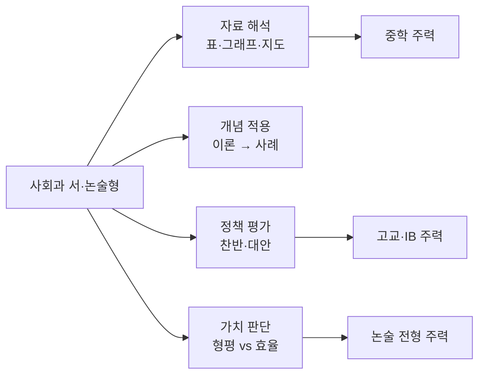

| 과목 | 학년 | 문항 예시 |
|---|---|---|
| **일반사회** | 중2 | 자료의 지니계수 변화를 읽고, 그 변화가 사회에 미칠 영향을 **긍정·부정 각각 한 가지씩** 서술하시오. |
| **경제** | 고1 | 최저임금 인상이 고용에 미치는 영향을 **수요·공급 그래프로 설명**하고, 현실에서 예측과 다를 수 있는 이유 두 가지를 제시하시오. |
| **경제(IB)** | DP | *"가격 상한제는 소비자를 보호하는 효과적 정책이다." 이 주장을 **평가(Evaluate)** 하시오.* **[15]** — 다이어그램 필수, 실제 사례 필수 |
| **지리** | 고1 | 도시 확산(urban sprawl)의 원인을 **자연적·사회경제적** 요인으로 나누어 설명하고, 한 가지 완화 정책의 효과를 검토하시오. |
| **정치** | 고2 | 선거제도 (가)비례대표제와 (나)소선거구제의 장단점을 비교하고, 한국 상황에 더 적합한 제도를 **근거 두 가지**로 논하시오. (1,000자) |
| **통합사회** | 고1 | '정의'를 보는 세 관점(공리주의·자유지상주의·공동체주의)을 특정 정책에 각각 적용했을 때의 결론 차이를 서술하시오. |

**［IB Economics 15점 문항 루브릭］** — 국내 경제 논술 설계에 직접 이식 가능

| 기준 | 배점 | 조건 |
|---|:--:|---|
| 용어 정의 | 2 | 핵심 경제 용어를 정확히 정의 |
| 이론 설명 | 4 | 메커니즘을 논리적으로 전개 |
| **다이어그램** | 4 | 정확히 그리고 **축·곡선 라벨** + 본문에서 참조·설명 |
| 실제 사례 | 2 | 구체적 국가·시기·수치 |
| **평가(Evaluation)** | 3 | 단·장기, 이해관계자별, 가정의 한계, 대안 비교 중 **둘 이상** |

> 💡 다이어그램을 그려만 두고 본문에서 언급하지 않으면 4점 중 1~2점만 받습니다. **"그림을 말로 다시 설명하라"** 가 핵심 지도 포인트.

---

### 8-6. 철학 · 윤리 (Philosophy · TOK)

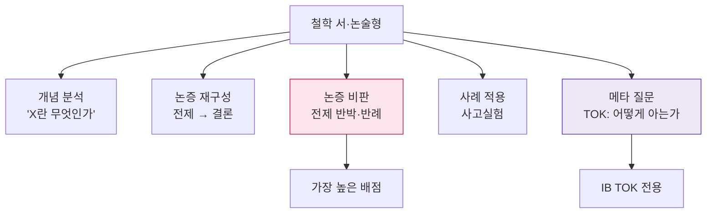

| 수준 | 문항 예시 |
|---|---|
| **고1 윤리** | 제시문의 공리주의적 판단을 **의무론의 관점에서 비판**하고, 그 비판이 갖는 한계도 함께 서술하시오. (600자) |
| **고2 윤리** | '트롤리 문제'와 '육교 문제'에서 사람들의 직관이 갈리는 이유를 두 윤리 이론으로 각각 설명하고, 어느 설명이 더 설득력 있는지 판단하시오. |
| **고3 논술** | "자유로운 선택이라면 그 결과도 정당한가?" 제시문 (가)~(다)를 활용해 논하시오. (1,200자) |
| **IB Philosophy P1** | *"인격 동일성은 심리적 연속성으로 충분히 설명되는가?"* 핵심 주제와 관련지어 논하시오. **[25]** |
| **IB Philosophy P2** | 제시된 **철학 원전 발췌문**에 대해 저자의 논증을 재구성하고 비판적으로 평가하시오. **[25]** |
| **IB TOK** | "지식의 생산에서 **방법의 엄밀성**과 **상상력** 중 무엇이 더 중요한가?" 두 AOK를 참조해 논하시오. (1,600단어) |

**［철학 논술 논증 구조 템플릿］**

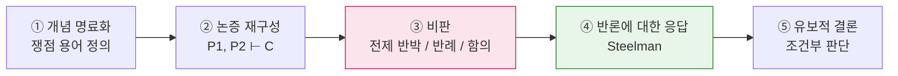

**［IB Philosophy 루브릭 4기준 (25점)］**

| 기준 | 배점 | 조건 |
|---|:--:|---|
| A. 쟁점의 식별·설명 | 5 | 질문이 내포한 철학적 문제를 정확히 포착 |
| B. 지식·이해 | 5 | 철학자·개념·이론을 정확히 사용 |
| C. **논증의 전개·평가** | 10 | 논증을 세우고 **반론을 다루며** 일관되게 전개 |
| D. 명료성·구성 | 5 | 구조와 표현이 논지를 지탱 |

**채점 포인트**
| 흔한 실패 | 교정 |
|---|---|
| 철학자 **이름 나열**만 하고 논증은 없음 | "그가 무엇을 전제로 무엇을 결론 지었는가"를 문장으로 |
| 비판이 "동의하지 않는다"로 끝남 | **어느 전제가 왜 거짓인지** 지목 |
| 양비론으로 마무리 | 조건부라도 **자신의 판단**을 명시 |
| 사고실험만 소개하고 분석 없음 | 실험이 드러내는 **직관의 충돌**을 서술 |

---

### 8-7. 6개 교과 난이도·형식 대조표

| 교과 | 핵심 지시동사 | 국내 주력 형태 | IB 대응 | 가장 잘 깎이는 지점 |
|---|---|---|---|---|
| **국어** | 설명하라·비교하라·논하라 | 제시문 기반 논술 | Lang A P1/P2, HL Essay | 인용 없이 자기 생각만 |
| **영어** | 요약하라·작성하라 | 조건 영작 | Lang B P2 | 텍스트 유형 형식 미준수 |
| **수학** | 구하라·설명하라·판정하라 | 풀이 과정 서술 | AA/AI P1~P3 | 정당화 생략 |
| **역사** | 평가하라·비교하라 | 사료 해석 | History P1/P2/P3 | 가치·한계 분석 부재 |
| **사회** | 분석하라·평가하라 | 자료 해석 + 정책 판단 | Econ/Geo/GloPo | 다이어그램 미연결 |
| **철학** | 논하라·비판하라 | 제시문 논술 | Philosophy P1/P2, TOK | 반론 응답 없음 |

---

## 9. 탐구 주제 · 소논문 예시 (제목 + 요약)

> 아래는 **저작권 없는 창작 예시**입니다. 실제 제출용이 아니라 **좋은 연구질문(RQ)의 형태를 익히기 위한 모델**로 사용하세요.

### 9-0. 좋은 탐구 주제의 4요건

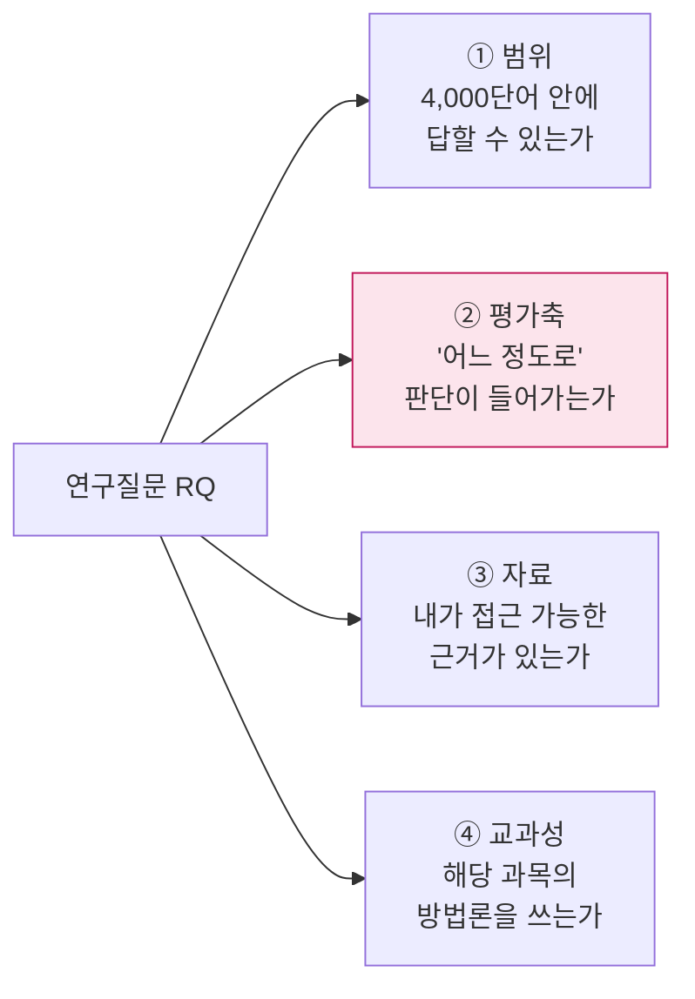

**RQ 변환 훈련** — 같은 관심사를 단계적으로 좁히는 과정

| 단계 | 문장 | 진단 |
|---|---|---|
| ❌ 주제 | "K-POP과 문화" | 질문이 아님 |
| ❌ 질문 | "K-POP은 왜 인기가 많은가?" | 범위 무한, 평가축 없음 |
| △ 좁힘 | "K-POP 팬덤의 소비 행동은 어떠한가?" | 서술로 끝남 |
| ✅ RQ | "**플랫폼 기반 팬덤 활동이 신인 그룹의 초동 음반 판매량에 미친 영향은 어느 정도인가 — 2020~2024년 국내 데뷔 그룹 30팀 분석**" | 범위·평가축·자료·교과(경제/사회) 충족 |

**제목 공식**
> `[대상·범위] + [변수 관계] + [방법/자료] + [어느 정도로 / 어떻게]`

---

### 9-1. IB 확장에세이 (EE) 예시 — 과목별 6편

#### ① 국어 (Korean A: Literature) — Category 1
**제목**: 「침묵으로 말하기 — 1970년대 한국 단편소설에서 생략과 여백이 검열 환경 속 서사 전략으로 기능하는 방식」
**요약**: 동시대 단편 3편을 대상으로, 서술자가 핵심 사건을 직접 진술하지 않고 생략·암시로 처리하는 지점을 유형화한다. 생략이 단순한 미학적 기법이 아니라 검열 회피와 독자 참여 유도라는 **이중 기능**을 수행했음을 텍스트 근거로 논증하고, 그 전략이 독자의 해석 부담을 어떻게 재배치하는지 평가한다.
**방법**: 텍스트 근접 분석(close reading) + 서사학 개념(초점화, 시간 생략)
**주의**: 역사적 배경 서술이 절반을 넘으면 문학 EE가 아니라 역사 EE가 되어 감점.

#### ② 영어 (English B) — 언어 습득
**제목**: 「같은 제품, 다른 설득 — 한국과 미국 스마트폰 광고 영어 카피의 수사 전략 비교(2019–2024)」
**요약**: 동일 브랜드가 두 시장에 내놓은 영어 광고 카피 40편을 수집해, 인칭 사용·명령문 비율·집단주의/개인주의 어휘를 코딩한다. 한국 시장 카피가 **관계·소속 어휘**에, 미국 시장 카피가 **개인 성취·통제 어휘**에 더 의존한다는 경향을 수치로 제시하고, 이 차이가 문화적 맥락 적응인지 브랜드 전략의 산물인지 검토한다.
**방법**: 소규모 코퍼스 구축 + 담화 분석

#### ③ 수학 (Mathematics)
**제목**: 「두 개의 감염병 모형, 하나의 데이터 — SIR 모형과 로지스틱 모형이 실제 확산 곡선을 설명하는 정확도 비교」
**요약**: 공개 방역 데이터에 SIR 미분방정식 모형과 로지스틱 성장 모형을 각각 적합시키고, 잔차제곱합과 예측 구간으로 성능을 비교한다. 초기 국면에서는 두 모형이 유사하나 **정점 이후 감소 국면에서 로지스틱 모형의 체계적 편향**이 발생함을 보이고, 그 원인을 모형의 가정(회복자 재감염 배제 등)에서 찾는다.
**방법**: 수치해석(오일러/룽게-쿠타), 최소제곱 적합, 민감도 분석
**주의**: 수학 EE는 **수학적 전개가 본문의 중심**이어야 함. 코드나 그래프만 나열하면 낮은 등급.

#### ④ 역사 (History) — 10년 이전 사건 필수
**제목**: 「누가 '근대화'를 말했는가 — 1960~70년대 한국 교과서의 경제개발 서술 변화와 그 정치적 기능」
**요약**: 세 시기 교과서의 관련 단원을 비교해, 경제개발 서술에서 **주체(국가/국민/기업)의 배치**가 어떻게 이동했는지 추적한다. 서술 변화가 단순한 사실 갱신이 아니라 정당성 담론의 재구성이었음을 사료로 논증하고, 교과서를 **사료로 읽을 때의 가치와 한계**를 명시한다.
**방법**: 1차 사료(교과서 원문) 비교 + 2차 문헌 사학사 검토 + OPVL

#### ⑤ 사회/경제 (Economics)
**제목**: 「보조금은 어디로 갔는가 — 전기차 구매 보조금 축소가 국내 준중형 전기차 수요에 미친 영향의 가격탄력성 추정」
**요약**: 보조금 정책 변경 전후의 월별 등록 대수와 실구매가를 이용해 수요의 가격탄력성을 추정한다. 수요·공급 다이어그램으로 보조금의 후생 효과를 설명한 뒤, 추정 결과가 **소비자잉여 이전과 재정 지출의 효율성**에 대해 시사하는 바를 평가한다. 대체재(하이브리드) 가격 변동이라는 교란 요인의 한계도 논한다.
**방법**: 공개 통계 + 단순 회귀 + 경제 이론 다이어그램

#### ⑥ 철학 (Philosophy)
**제목**: 「알고리즘은 책임의 주체가 될 수 있는가 — 자율주행 사고에서 도덕적 책임 귀속의 조건 검토」
**요약**: 책임 귀속의 전통적 조건(통제 가능성, 인식 가능성)을 정식화한 뒤, 자율주행 시스템이 이 조건을 충족하는지 검토한다. '책임 공백(responsibility gap)' 주장을 재구성하고, 분산 책임 모델과 설계자 책임 모델을 각각 반박·옹호한 다음, **조건부 결론**(예측 가능성이 확보되는 범위에서만 설계자 책임이 성립)에 도달한다.
**방법**: 개념 분석 + 논증 재구성 + 사고실험

---

### 9-2. IB 내부평가(IA) · TOK 예시

| 과목 | 과제 형태 | 예시 제목 | 요약 |
|---|---|---|---|
| **Math AA/AI IA** | 개인 탐구 12~20쪽 | 「카페 대기열의 수학 — 대기행렬 모형으로 본 피크타임 인력 배치의 최적화」 | 실제 관측한 도착·서비스 시간 데이터로 M/M/1 모형을 적합시키고, 직원 1명 추가가 평균 대기시간을 줄이는 정도를 계산해 비용과 비교 |
| **Economics IA** | 뉴스 기사 논평 800단어 ×3 | 「탄소세 도입 기사에 대한 논평」 | 기사에 등장한 정책을 외부효과 다이어그램으로 분석하고 단·장기 효과와 이해관계자별 영향을 평가 |
| **History IA** | 사료 탐구 2,200단어 | 「1948년 특정 사건에 대한 두 신문 보도의 신뢰성 평가」 | Section 1에서 사료 2편의 OPVL, Section 2에서 탐구, Section 3에서 역사가로서의 방법론 성찰 |
| **Biology IA** | 실험 보고서 | 「염분 농도가 무 조직의 삼투 변화율에 미치는 영향」 | 독립·종속·통제변인 설계, 5수준 ×5반복, 불확도와 t-검정까지 |
| **English B IA** | 개인 구술 | 「광고 이미지로 본 성역할 재현」 | 수업에서 다룬 텍스트를 바탕으로 15분 구술 |
| **TOK 전시(Exhibition)** | 대상 3점 + 950단어 | 「"지식은 언제 폐기되는가?" — 폐간된 백과사전, 수정된 교과서 페이지, 철회된 논문」 | 실제 대상 3점이 프롬프트를 어떻게 구현하는지 각각 서술 |
| **TOK 에세이** | 1,600단어 | 「불확실성을 인정하는 것은 지식 주장을 약화시키는가, 강화시키는가 — 자연과학과 역사학을 중심으로」 | 두 AOK에서 불확실성 표기 관행을 비교하고, 반론(불확실성의 정치적 악용)에 응답 |

---

### 9-3. 국내 탐구보고서 · R&E · 수행평가 소논문 예시

교과 세특(세부능력 및 특기사항) 연계를 염두에 둔 **학년별 난이도 배치**입니다.

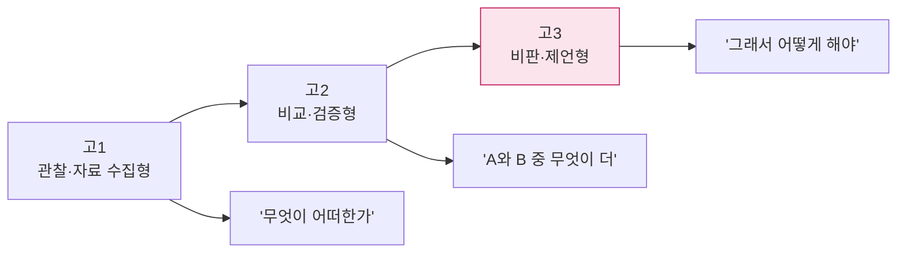

#### 고1 — 관찰·자료 수집형

| 교과 | 제목 | 요약 |
|---|---|---|
| 국어 | 「급식 공지문은 왜 안 읽히는가 — 교내 안내문 30편의 가독성 분석과 개선안」 | 문장 길이·피동 표현·전문 용어 빈도를 측정해 가독성 지표를 만들고, 학생 설문과 대조한 뒤 개선 문안을 제시 |
| 수학 | 「교실 소음의 수학 — 데시벨 측정값의 분포와 대표값 선택의 문제」 | 시간대별 측정 데이터에서 평균과 중앙값이 갈리는 이유를 분포의 치우침으로 설명 |
| 사회 | 「우리 동네 버스 노선은 공평한가 — 정류장 접근성의 지역 간 격차 측정」 | 반경 500m 내 정류장 수를 구역별로 비교하고 인구 밀도와 교차 분석 |

#### 고2 — 비교·검증형

| 교과 | 제목 | 요약 |
|---|---|---|
| 영어 | 「번역기는 관용구에서 무엇을 놓치는가 — 영한 기계번역의 오류 유형 분류」 | 관용구 50개를 세 번역 엔진에 입력해 오류를 직역/의미왜곡/누락으로 코딩하고 유형별 빈도를 비교 |
| 역사 | 「같은 날, 다른 지면 — 한 사건에 대한 두 신문 1면 구성의 비교 분석」 | 헤드라인 어휘·사진 배치·기사 면적을 수치화하고, 차이가 독자 인식에 미칠 영향을 사료 비판 관점에서 평가 |
| 수학 | 「평균의 함정 — 학급 성적 자료에서 산술평균·중앙값·최빈값이 주는 서로 다른 결론」 | 실제 분포에 세 대표값을 적용해 정책적 판단(보충수업 대상 선정)이 어떻게 달라지는지 시뮬레이션 |
| 사회 | 「최저임금 논쟁의 근거는 어떻게 선택되는가 — 찬반 칼럼 20편의 인용 통계 비교」 | 양측이 인용하는 통계의 출처·기간·지표를 표로 정리해, 같은 현상에 대한 상반된 결론이 가능한 이유를 분석 |

#### 고3 — 비판·제언형

| 교과 | 제목 | 요약 |
|---|---|---|
| 철학/윤리 | 「추천 알고리즘은 자율성을 침해하는가 — 선택 아키텍처와 조작의 경계」 | 넛지 이론의 '조작' 기준을 정식화하고, 개인화 추천이 그 기준을 넘는 조건을 제시한 뒤 설계 원칙 3가지를 제언 |
| 국어 | 「혐오 표현 규제는 표현의 자유와 양립 가능한가 — 국내 판결문 담론 분석」 | 판결문에서 반복되는 논증 구조를 추출하고, 그 논증이 전제하는 '공적 해악' 개념의 모호성을 비판 |
| 사회 | 「지역 소멸 대응 정책은 무엇을 측정하지 않는가 — 성과지표의 사각지대」 | 현행 정책 지표를 유형화하고, 인구 유입 중심 지표가 놓치는 정주 만족도·서비스 접근성을 보완 지표로 제안 |
| 역사 | 「기념은 무엇을 기억하게 하는가 — 지역 기념물 비문 15건의 서술 분석」 | 비문의 주체·동사·수식어를 코딩해 기억의 선택성을 드러내고, 공공 역사 서술의 원칙을 제언 |

---

### 9-4. 소논문 표준 구조 (국내 탐구보고서 / EE 공통)

```mermaid
flowchart TB
    T["① 제목 + 연구질문"] --> I["② 서론<br/>배경 · RQ · 중요성 · 범위 한정"]
    I --> M["③ 방법<br/>자료 출처 · 수집 절차 · 분석 틀 · 한계"]
    M --> B["④ 본론<br/>분석 1 → 2 → 3 (각 절이 RQ의 한 조각)"]
    B --> D["⑤ 논의<br/>반대 해석 · 교란 변인 · 대안 설명"]
    D --> C["⑥ 결론<br/>RQ에 대한 직접 답 + 확신의 정도"]
    C --> R["⑦ 참고문헌 + 부록"]

    style D fill:#fce4ec,stroke:#c2185b
    style C fill:#e8f5e9,stroke:#2e7d32
```

**분량 배분 권장 (4,000단어 EE 기준)**

| 절 | 비중 | 단어 |
|---|:--:|:--:|
| 서론 | 10% | ~400 |
| 방법 | 10% | ~400 |
| 본론(분석) | 55% | ~2,200 |
| 논의 | 15% | ~600 |
| 결론 | 10% | ~400 |

> 💡 **가장 흔한 실패**: 배경 설명이 서론에서 1,000단어를 넘어가고 정작 분석이 얇아지는 경우. **"이 문단이 RQ에 답하는 데 기여하는가"** 를 문단마다 자문하세요.

### 9-5. EE 채점 기준 (5기준 34점)

| 기준 | 배점 | 핵심 |
|---|:--:|---|
| **A. 초점과 방법** | 6 | 주제·RQ·방법이 서로 정렬되어 있는가 |
| **B. 지식과 이해** | 6 | 교과의 개념·용어·맥락을 적절히 사용했는가 |
| **C. 비판적 사고** | 12 | **분석·논의·평가의 질** (배점 최대) |
| **D. 형식** | 4 | 구조·인용·표제 등 학술적 형식 |
| **E. 성찰(RPPF)** | 6 | 연구 과정에서의 의사결정과 배움을 성찰했는가 |

> 기준 C가 **전체의 35%** 입니다. 자료를 많이 모으는 것보다 **모은 자료를 의심하고 대안 해석을 검토하는 분량**이 점수를 만듭니다.

---

# 10. 문항 은행 — 과목별 × 유형별 10문항

> 형식 재현 창작 문항입니다. 각 문항 뒤 `〔학년/배점〕` 표기. **★** = IB·AP형 확장 문항.
> 유형 코드: `읽기 R · 문법 G · 문학 L · 작문 W · 매체 M · 과정 P · 정당화 J · 오류 E · 모델링 D · 사료 S · 인과 C · 변화 T · 판단 V · 사관 H · 개념 K · 정책 Po · 가치 Va · 분석 An · 재구성 Re · 비판 Cr · 적용 Ap · 메타 Me`

```mermaid
flowchart LR
    B["문항 은행 270제"]
    B --> K["국어 50<br/>R·G·L·W·M"]
    B --> E["영어 40<br/>R·W·통합·매체"]
    B --> M["수학 40<br/>P·J·E·D"]
    B --> H["역사 50<br/>S·C·T·V·H"]
    B --> S["사회 40<br/>An·K·Po·Va"]
    B --> P["철학 50<br/>K·Re·Cr·Ap·Me"]
```

---

## 10-1. 국어 (50문항)

### 유형 R · 읽기 — 이해·추론·비판

1. 설명문 (가)에서 글쓴이가 사용한 **설명 방법 두 가지**를 찾아 쓰고, 각 방법이 독자의 이해를 돕는 이유를 한 문장씩 서술하시오. 〔중1 / 6〕
2. (가)의 3문단이 글 전체에서 수행하는 **기능**을 앞뒤 문단과의 관계로 설명하시오. 〔중1 / 4〕
3. 글쓴이가 명시하지 않았지만 **전제하고 있는 것**을 한 가지 찾아 쓰고, 그 전제가 타당한지 판단하시오. 〔중3 / 8〕
4. (가)와 (나)가 같은 현상을 설명하면서 **다른 결론**에 도달한 까닭을, 두 글이 주목한 근거의 차이로 설명하시오. 〔중3 / 8〕
5. 밑줄 친 주장을 뒷받침하기 위해 **추가로 필요한 자료**가 무엇인지 쓰고, 그 이유를 서술하시오. 〔고1 / 6〕
6. (가)의 논증에서 **인과관계와 상관관계가 혼동된 지점**을 지적하고 근거를 쓰시오. 〔고1 / 8〕
7. 글의 제목을 새로 붙이고, 그 제목이 본문의 핵심 논지를 어떻게 반영하는지 설명하시오. 〔중2 / 6〕
8. (가)~(다) 중 필자의 주장과 **가장 거리가 먼 자료**를 고르고, 왜 뒷받침이 되지 못하는지 서술하시오. 〔고1 / 8〕
9. 글쓴이가 예상 반론을 다루는 방식을 분석하고, 그 대응이 충분한지 평가하시오. 〔고2 / 10〕
10. ★ 제시문 (가)~(라)를 읽고, 네 글이 공유하는 **암묵적 합의점**과 **결정적 분기점**을 각각 하나씩 밝히시오. 〔고3 / 12〕

### 유형 G · 문법 — 규칙 적용·설명

1. 다음 문장에서 **주어와 서술어의 호응이 어긋난 부분**을 찾아 고치고, 어긋난 이유를 설명하시오. 〔중1 / 4〕
2. `읽히다`의 피동·사동 구분이 문맥에 따라 어떻게 달라지는지 예문을 들어 서술하시오. 〔중2 / 6〕
3. 다음 두 문장의 **중의성**을 지적하고, 뜻이 하나로 정해지도록 각각 고쳐 쓰시오. 〔중2 / 6〕
4. 높임 표현이 잘못 쓰인 곳을 모두 찾아 바르게 고치고, 오류 유형을 분류하시오. 〔중3 / 8〕
5. `-겠-`이 나타내는 의미 세 가지를 예문과 함께 구별하여 설명하시오. 〔고1 / 6〕
6. 다음 문장을 **안은문장 → 이어진문장**으로 바꾸고, 의미 차이가 생기는지 판단하시오. 〔중3 / 6〕
7. 사이시옷 표기 원칙을 정리하고, 제시된 5개 단어의 표기 여부를 각각 판정하시오. 〔고1 / 8〕
8. 다음 글의 **피동 표현 과다** 문제를 지적하고, 능동으로 고쳤을 때 문장이 어떻게 달라지는지 서술하시오. 〔고1 / 8〕
9. 국어의 어문 규범이 **언어 현실과 충돌하는 사례**를 하나 들고, 규범을 유지해야 하는지 논하시오. 〔고2 / 10〕
10. ★ 제시된 SNS 게시물의 비표준 표기를 유형화하고, 이를 '오류'로 볼지 '변이'로 볼지 근거를 들어 논하시오. 〔고3 / 12〕

### 유형 L · 문학 — 해석·감상의 근거화

1. 시 (가)의 화자가 처한 상황을 **시어 두 개를 근거로** 설명하시오. 〔중2 / 6〕
2. 마지막 행의 어조 변화가 주제 전달에 미치는 효과를 서술하시오. 〔중2 / 6〕
3. 소설 (가)에서 **서술자의 시점**이 독자의 인물 이해에 미치는 영향을 설명하시오. 〔중3 / 8〕
4. 작품에 반복적으로 등장하는 소재 하나를 골라 그 **상징적 의미의 변화**를 추적하시오. 〔고1 / 8〕
5. 갈등의 종류를 구분하고, 그 갈등이 해소되는 방식이 주제와 어떻게 연결되는지 쓰시오. 〔중3 / 8〕
6. 동일 소재를 다룬 (가)시와 (나)수필의 **정서 처리 방식**을 비교하시오. 〔고1 / 10〕
7. 작품의 결말을 다르게 바꾼다면 주제가 어떻게 달라지는지, 근거를 들어 서술하시오. 〔고1 / 8〕
8. 인물 A의 선택을 **옹호하는 해석**과 **비판하는 해석**을 각각 텍스트 근거와 함께 제시하시오. 〔고2 / 12〕
9. 작품의 공간 배경이 인물의 심리를 드러내는 장치로 기능하는 방식을 분석하시오. 〔고2 / 10〕
10. ★ (가)와 (나) 두 작품을 비교하여, **같은 주제 의식이 서로 다른 형식으로 구현된 양상**을 논하시오. (IB Lit Paper 2형) 〔고3 / 20〕

### 유형 W · 작문 — 논증·조건 글쓰기

1. 주어진 개요를 보완하여 **빠진 논거 하나**를 추가하고, 그 위치를 정한 이유를 쓰시오. 〔중2 / 6〕
2. 학급 규칙 제정을 제안하는 건의문을 **문제–원인–대안–기대효과** 순으로 400자 작성하시오. 〔중3 / 10〕
3. 반대 측 주장의 **논리적 허점**을 지적하고 보완 근거를 제시하시오. 〔중3 / 10〕
4. 동일 사건을 다룬 기사 (가)와 SNS (나)를 비교해 **매체 특성이 신뢰도에 미치는 영향**을 논하시오. (600자) 〔고1 / 15〕
5. 제시문 (가)의 주장에 대해 **조건부 찬성** 입장을 취하고, 그 조건을 명시해 논술하시오. (600자) 〔고1 / 15〕
6. '공정'을 기회의 평등으로 보는 (가)와 결과 보정으로 보는 (나)를 비교하고, 정책 사례 하나로 자신의 입장을 논술하시오. (900자) 〔고2 / 20〕
7. 통계 자료 (다)를 **자신의 주장과 반대 주장 양쪽에서** 각각 어떻게 활용할 수 있는지 쓰고, 이 사실이 시사하는 바를 논하시오. 〔고2 / 15〕
8. 제시문 (가)~(라)를 활용해 '기술 중립성' 주장을 **비판적으로 검토**하고 대안적 관점을 제시하시오. (1,200자) 〔고3 / 25〕
9. 자신의 논술문에서 **가장 약한 근거**를 스스로 지목하고, 왜 약한지와 어떻게 보강할지 서술하시오. 〔고3 / 10〕
10. ★ 세 편의 제시문 중 **두 편만 선택**해 논지를 세우고, 나머지 한 편을 배제한 이유를 논증에 포함하시오. (1,000자) 〔고3 / 25〕

### 유형 M · 매체 — 비판적 수용과 생산

1. 뉴스 영상의 **자막과 음성이 전달하는 정보의 차이**를 찾아 서술하시오. 〔중2 / 6〕
2. 광고에서 사용된 설득 전략 두 가지를 찾고 그 효과를 설명하시오. 〔중2 / 6〕
3. 같은 사진이 두 매체에서 **다른 캡션**과 함께 쓰였다. 캡션이 의미를 어떻게 바꾸는지 서술하시오. 〔중3 / 8〕
4. 댓글 10개를 읽고 **의견의 양극화 양상**을 정리한 뒤, 그 원인을 매체 구조로 설명하시오. 〔고1 / 10〕
5. 인포그래픽의 **시각적 왜곡**(축 절단·면적 과장 등)을 지적하고 정확한 표현으로 수정하시오. 〔고1 / 10〕
6. 알고리즘 추천이 정보 편식에 미치는 영향을 자료를 근거로 논하시오. (600자) 〔고2 / 15〕
7. 동일 주제의 유튜브 영상과 신문 기사를 비교해 **정보 신뢰성 평가 기준**을 세우시오. 〔고2 / 12〕
8. 딥페이크 영상의 진위 판별을 위해 확인해야 할 **점검 항목 5가지**를 만들고 각각의 근거를 쓰시오. 〔고2 / 12〕
9. 자신이 생산자가 되어, 주어진 정보를 **카드뉴스 5장** 구성안으로 재구성하고 각 장의 의도를 쓰시오. 〔고1 / 12〕
10. ★ 제시된 비문학 텍스트 2편을 **시각적 배치와 언어 선택이 목표 독자를 어떻게 구성하는지** 중심으로 분석하시오. (IB Lang&Lit P1형) 〔고3 / 20〕

---

## 10-2. 영어 (40문항)

### 유형 R · 읽기 기반 서술

1. Write **one sentence** describing the main change in the character's feelings, using `felt ~ because ~`. 〔중2 / 4〕
2. State the writer's purpose and quote **one phrase** that supports your answer. 〔중2 / 6〕
3. Identify **one limitation** of the writer's solution and suggest an alternative in 2–3 sentences. 〔중3 / 8〕
4. Explain in English why the author uses a question in the opening line. 〔중3 / 6〕
5. Summarise the passage in **three sentences**: situation, problem, response. 〔고1 / 8〕
6. Describe **two notable trends** in the chart and give one possible cause for each. 〔고1 / 10〕
7. The writer claims X. Find **one piece of evidence that weakens** this claim and explain why. 〔고1 / 8〕
8. Compare the tone of paragraph 2 and paragraph 5, and explain what causes the shift. 〔고2 / 10〕
9. Explain how the writer uses statistics to persuade, and evaluate whether the use is fair. 〔고2 / 12〕
10. ★ Analyse how language and structure position the reader in the two texts. (IB Lang B / Paper 1형) 〔고3 / 15〕

### 유형 W · 조건 영작

1. Write an email to a teacher asking to reschedule a test. Include reason, alternative date, polite closing. (60 words) 〔중2 / 8〕
2. Write a short **review** of a book you read: recommendation + one reason + one reservation. (80 words) 〔중3 / 8〕
3. Write a **blog post** about a school event. Must include a title, a date, and a question to readers. (100 words) 〔중3 / 10〕
4. Write a **speech** opening for a school assembly on environmental action: address the audience, use one rhetorical question, one repetition. (100 words) 〔고1 / 12〕
5. Write an **editorial** on school AI-use rules: headline, lead, claim, two reasons, conclusion. (150 words) 〔고2 / 15〕
6. Write a **formal letter** to the city council proposing a bike lane. Include purpose, evidence, request. (180 words) 〔고2 / 15〕
7. Write a **brochure** section for a school club: subheadings, bullet points, one call to action. (120 words) 〔고1 / 12〕
8. Rewrite the informal message below as a **formal report** paragraph, and explain one change you made. 〔고1 / 10〕
9. Write a **set of instructions** for a science procedure, using imperatives and sequence markers. (100 words) 〔중3 / 10〕
10. ★ Choose **one of three tasks** and write 450–600 words in the stated text type, observing its conventions. (IB Lang B HL P2형) 〔고3 / 30〕

### 유형 I · 통합형 (읽기 → 쓰기 전이)

1. Read the notice and write a reply asking **two clarifying questions**. 〔중2 / 6〕
2. Read two short opinions and write **one sentence** stating where they agree. 〔중3 / 6〕
3. Turn the data table into a **short paragraph** for a newsletter. 〔고1 / 10〕
4. Read the article and write a **social media post** (40 words) that keeps the main claim but changes the audience. 〔고1 / 10〕
5. Read the complaint letter and draft a **response** that acknowledges, explains, and offers a remedy. 〔고2 / 12〕
6. Summarise the two sources and write your **own position** in one paragraph. 〔고2 / 15〕
7. Read the interview transcript and write a **news lead** (30 words) plus one supporting quote. 〔고1 / 10〕
8. Convert the argumentative passage into a **pros-and-cons table**, then write a one-sentence verdict. 〔고1 / 10〕
9. Read the graph and the article; explain **one contradiction** between them in English. 〔고2 / 12〕
10. ★ Using both texts, write a 300-word response evaluating whether the proposed policy will work. 〔고3 / 20〕

### 유형 M · 매체·문화 비교

1. Compare the two advertisements: which audience is each targeting? Give one clue for each. 〔중3 / 8〕
2. Explain why the English slogan was **not translated literally** into Korean. 〔고1 / 8〕
3. Identify one **cultural assumption** in the text and explain how it shapes the message. 〔고1 / 10〕
4. Compare headlines from two countries on the same event and describe the difference in framing. 〔고2 / 12〕
5. Explain how emoji use changes the tone of the same message in three contexts. 〔중3 / 8〕
6. Evaluate whether the English used in the K-pop lyric functions as communication or as style. 〔고2 / 12〕
7. Analyse the use of imperatives in public safety posters from two countries. 〔고2 / 12〕
8. Describe how the same product is marketed to collectivist and individualist audiences. 〔고2 / 12〕
9. Discuss one risk of relying on machine translation for public announcements. 〔고2 / 10〕
10. ★ To what extent does the global spread of English narrow linguistic diversity? Argue with two examples. (300 words) 〔고3 / 20〕

---

## 10-3. 수학 (40문항)

### 유형 P · 풀이 과정 서술형

1. 두 수의 최대공약수 12, 최소공배수 72인 자연수 쌍을 모두 구하는 과정을 서술하시오. 〔중1 / 8〕
2. 일차방정식 문장제를 미지수 설정부터 검산까지 단계별로 서술하시오. 〔중1 / 8〕
3. 두 점을 지나는 일차함수의 식을 구하는 과정을 쓰고, 기울기의 실생활 의미를 서술하시오. 〔중2 / 10〕
4. 삼각형의 합동 조건을 이용해 두 도형이 합동임을 **근거를 들어** 증명하시오. 〔중2 / 10〕
5. 이차방정식의 근과 계수의 관계를 이용해 문제를 푸는 과정을 서술하시오. 〔중3 / 10〕
6. `y = x² - 4x + k` 가 x축과 두 점에서 만날 k의 범위를 판별식으로 구하고, k=3일 때 삼각형 넓이를 구하시오. 〔중3 / 10〕
7. 삼각비를 이용해 건물 높이를 구하는 과정을 그림·식·결론 순으로 서술하시오. 〔고1 / 10〕
8. 수열의 일반항을 추론하고, 그 추론이 옳음을 **수학적 귀납법**으로 증명하시오. 〔고2 / 12〕
9. 정적분을 이용해 두 곡선 사이 넓이를 구하는 과정을 교점 산출부터 서술하시오. 〔고2 / 12〕
10. ★ `P(t) = 1200/(1+5e^(-0.4t))` 에서 (a) 초기값 **[2]** (b) P>1000 최소 정수 t **[3]** (c) P'(t) 최대 시점과 그 **의미** **[5]** 〔고3 / 10〕

### 유형 J · 정당화·설명형

1. 0으로 나눌 수 없는 이유를 **정의에 근거해** 설명하시오. 〔중1 / 6〕
2. 음수 × 음수 = 양수인 이유를 규칙의 일관성으로 설명하시오. 〔중1 / 8〕
3. 평행사변형의 두 대각선이 서로를 이등분함을 증명하시오. 〔중2 / 10〕
4. 확률에서 '경우의 수를 빠짐없이 중복 없이' 세었음을 **어떻게 보장하는지** 설명하시오. 〔중2 / 8〕
5. 무리수가 존재함을 `√2`가 유리수가 아님을 보여 정당화하시오. 〔중3 / 10〕
6. 이차함수의 최댓값을 완전제곱식과 미분 **두 방법으로** 각각 설명하시오. 〔고1 / 12〕
7. `x² - (k+1)x + k < 0` 의 해가 없을 조건을 판별식과 그래프 두 관점에서 설명하시오. 〔고1 / 12〕
8. 표본평균의 분포가 정규분포에 가까워지는 이유를 **직관적으로** 설명하시오. 〔고2 / 10〕
9. 미분계수의 정의가 접선의 기울기와 같은 이유를 극한 개념으로 서술하시오. 〔고2 / 10〕
10. ★ `f'(c)=0 ⇒ x=c가 극값` 명제의 참·거짓을 판정하고 근거를 제시하시오. 〔고3 / 12〕

### 유형 E · 오류 발견·반례형

1. `2 + 3 × 4 = 20` 이라 한 풀이의 오류를 지적하고 바르게 고치시오. 〔중1 / 4〕
2. `(a+b)² = a² + b²` 라 한 학생에게 **반례**를 제시하고 올바른 전개를 쓰시오. 〔중2 / 6〕
3. `√(a²) = a` 가 항상 참이 아님을 반례로 보이고 올바른 식으로 고치시오. 〔중3 / 8〕
4. `a² = b² ⇒ a = b` 추론의 오류를 반례로 설명하고 조건을 수정하시오. 〔중3 / 8〕
5. 부등식 양변을 음수로 나누며 부호를 유지한 풀이의 오류를 설명하시오. 〔고1 / 8〕
6. "평균이 올랐으니 모든 학생 성적이 올랐다"는 결론의 오류를 반례로 보이시오. 〔고1 / 8〕
7. 확률에서 '독립'과 '배반'을 혼동한 풀이를 찾아 바로잡으시오. 〔고2 / 10〕
8. 극한을 각 항에 따로 적용해 잘못 계산한 풀이의 문제를 설명하시오. 〔고2 / 10〕
9. 표본이 편향된 설문으로 모집단을 추론한 결론의 한계를 지적하시오. 〔고2 / 10〕
10. ★ 제시된 '증명'에서 **순환 논증**이 발생한 지점을 찾아 설명하고, 올바른 증명 경로를 제시하시오. 〔고3 / 12〕

### 유형 D · 모델링·해석형

1. 택시 요금을 거리의 함수로 나타내고, 그래프가 계단 모양인 이유를 설명하시오. 〔중2 / 8〕
2. 교실 소음 데이터의 평균과 중앙값이 다른 이유를 분포로 설명하시오. 〔중3 / 8〕
3. 휴대폰 요금제 두 가지를 함수로 세우고 **어느 쪽이 유리한 구간**을 구하시오. 〔중3 / 10〕
4. 인구 데이터를 지수모형에 적합시키고, 모형의 **가정과 한계**를 쓰시오. 〔고1 / 12〕
5. 약물 혈중 농도의 반감기 모형을 세우고 6시간 후 농도와 그 한계를 논하시오. 〔고2 / 15〕
6. 카페 대기열 데이터를 이용해 평균 대기시간을 추정하고 인력 1명 추가 효과를 계산하시오. 〔고2 / 15〕
7. 두 회귀직선 중 어느 쪽이 더 적합한지 **잔차**를 근거로 판단하시오. 〔고2 / 12〕
8. 최저임금과 고용 데이터의 상관계수를 구하고, 인과로 해석할 수 없는 이유를 쓰시오. 〔고2 / 12〕
9. 코로나 확산 데이터를 SIR·로지스틱 두 모형으로 적합시키고 정확도를 비교하시오. 〔고3 / 15〕
10. ★ 제시된 실세계 문제를 **스스로 수학적으로 정식화**하고, 모형 선택의 근거와 검증 방법을 서술하시오. (IB AI HL P3형) 〔고3 / 20〕

---

## 10-4. 역사 (50문항)

### 유형 S · 사료 해석

1. 자료 (가)로 알 수 있는 사회 변화 **두 가지**를 쓰시오. 〔중2 / 6〕
2. 자료의 작성자가 **누구를 독자로** 상정했는지 근거를 들어 추정하시오. 〔중3 / 6〕
3. 그림 사료에서 확인되는 생활 모습 세 가지를 찾아 서술하시오. 〔중2 / 6〕
4. 통계 사료의 수치 변화를 읽고, 그 배경으로 추정되는 요인을 쓰시오. 〔중3 / 8〕
5. 같은 사건을 다룬 A·B 기록이 다른 이유를 **기록자의 입장**과 연결해 설명하시오. 〔중3 / 10〕
6. 자료 (가)의 **가치와 한계**를 출처·목적 측면에서 각각 서술하시오. 〔고1 / 10〕
7. 정치 만평에 담긴 **메시지를 해석**하고, 그 근거가 되는 시각 요소를 지목하시오. 〔고1 / 8〕
8. 자료 (나)와 (다)를 **비교·대조**하여 공통점 둘, 차이점 둘을 서술하시오. 〔고2 / 12〕
9. 회고록을 사료로 쓸 때 주의할 점을 시점·기억·목적 측면에서 논하시오. 〔고2 / 10〕
10. ★ 자료 A~D와 자신의 지식을 모두 사용하여 제시된 주장을 평가하시오. (IB History P1형) 〔고3 / 15〕

### 유형 C · 인과 설명

1. 이 사건이 일어난 직접적 원인과 배경적 원인을 구분하여 쓰시오. 〔중2 / 8〕
2. 제도 도입이 백성의 생활에 미친 영향을 두 가지 서술하시오. 〔중2 / 8〕
3. 전쟁 이후 사회 구조가 바뀐 과정을 **연쇄적 인과**로 설명하시오. 〔중3 / 10〕
4. 외부 요인과 내부 요인 중 **어느 쪽이 더 결정적**이었는지 근거를 들어 판단하시오. 〔고1 / 12〕
5. 같은 원인이 두 지역에서 다른 결과를 낳은 까닭을 설명하시오. 〔고1 / 12〕
6. 근대 국가 형성에서 가장 결정적 요인을 택하고 다른 요인과 비교해 정당화하시오. (800자) 〔고1 / 15〕
7. 개혁 실패의 원인을 구조적 요인과 우연적 요인으로 나누어 논하시오. 〔고2 / 15〕
8. 경제적 요인만으로 이 변화를 설명할 때 **놓치게 되는 것**을 지적하시오. 〔고2 / 12〕
9. 특정 인물의 역할이 없었다면 결과가 달라졌을지 **반사실적으로** 검토하시오. 〔고2 / 12〕
10. ★ 서로 다른 두 지역의 권위주의 체제 성립에서 경제적 요인이 **어느 정도로** 중요했는지 평가하시오. (IB History P2형) 〔고3 / 15〕

### 유형 T · 변화와 지속

1. 두 시기의 생활 모습에서 **바뀐 것과 그대로인 것**을 각각 하나씩 쓰시오. 〔중1 / 6〕
2. 신분 제도의 변화 과정을 세 단계로 정리하시오. 〔중2 / 8〕
3. 100년에 걸친 도시 지도 두 장을 비교해 변화의 방향을 서술하시오. 〔중3 / 8〕
4. 제도는 폐지되었으나 **관행은 지속된** 사례를 들어 설명하시오. 〔고1 / 10〕
5. 변화의 속도가 지역별로 달랐던 이유를 분석하시오. 〔고1 / 12〕
6. '근대'의 시작 시점을 정하는 기준이 연구자마다 다른 이유를 논하시오. 〔고2 / 12〕
7. 기술 변화가 노동 형태에 미친 영향을 장기적 관점에서 서술하시오. 〔고2 / 12〕
8. 연속성을 강조하는 해석과 단절을 강조하는 해석을 비교하시오. 〔고2 / 15〕
9. 제시된 연표에서 **전환점**을 하나 고르고 선정 근거를 논하시오. 〔고3 / 12〕
10. ★ 특정 100년간 사회·경제 구조의 변화와 지속을 **두 영역에 걸쳐** 평가하시오. 〔고3 / 15〕

### 유형 V · 역사적 판단·중요성

1. 이 사건이 오늘날에도 기억되는 이유를 한 가지 쓰시오. 〔중1 / 4〕
2. 두 인물 중 더 큰 영향을 남긴 쪽을 고르고 근거를 쓰시오. 〔중3 / 8〕
3. '중요한 사건'을 판단하는 **기준 세 가지**를 세우고 적용하시오. 〔고1 / 12〕
4. 자료 (가)~(다)를 근거로 특정 개혁의 **성과와 한계**를 균형 있게 평가하시오. 〔고2 / 15〕
5. 이 정책을 당대 기준과 현재 기준으로 각각 평가하고 차이를 설명하시오. 〔고2 / 15〕
6. 역사적 인물을 도덕적으로 평가하는 것이 정당한지 논하시오. 〔고2 / 12〕
7. 기념물의 존치·철거 논쟁에 대해 근거를 들어 입장을 밝히시오. 〔고3 / 15〕
8. 교과서에서 이 사건에 배정된 분량이 적절한지 판단하시오. 〔고3 / 12〕
9. '실패한 개혁'이라는 평가를 재검토하고 대안적 평가를 제시하시오. 〔고3 / 15〕
10. ★ 특정 사건의 장기적 중요성을 **단기·중기·장기** 세 시간 척도로 나누어 평가하시오. 〔고3 / 15〕

### 유형 H · 사관·사학사 (IB HL형)

1. 같은 사건에 대한 두 역사가의 해석 차이를 요약하시오. 〔고1 / 8〕
2. 해석 차이가 생긴 원인을 **사료 접근성**과 **문제의식** 측면에서 설명하시오. 〔고2 / 12〕
3. 민족주의적 해석과 사회경제적 해석의 강점·약점을 비교하시오. 〔고2 / 15〕
4. '아래로부터의 역사'가 기존 서술을 어떻게 바꾸었는지 사례로 설명하시오. 〔고2 / 12〕
5. 구술사의 방법론적 가치와 한계를 논하시오. 〔고3 / 12〕
6. 수정주의 해석이 등장한 시대적 배경을 분석하시오. 〔고3 / 15〕
7. 교과서 서술의 변화를 사학사적 맥락에서 설명하시오. 〔고3 / 15〕
8. 디지털 자료가 역사 연구 방법을 바꾸는 방식을 검토하시오. 〔고3 / 12〕
9. 국가별로 같은 전쟁을 다르게 서술하는 현상을 분석하고 대안을 제안하시오. 〔고3 / 15〕
10. ★ "역사 서술은 현재의 관심에서 자유로울 수 없다"는 주장을 구체적 사례로 검토하시오. 〔고3 / 20〕

---

## 10-5. 사회 (40문항)

### 유형 An · 자료 해석

1. 인구 피라미드의 변화를 읽고 특징을 한 문장으로 쓰시오. 〔중1 / 4〕
2. 지니계수 변화가 사회에 미칠 영향을 **긍정·부정 각각 하나씩** 서술하시오. 〔중2 / 8〕
3. 두 그래프의 상관 추세를 기술하고, 인과로 볼 수 없는 이유를 쓰시오. 〔중3 / 10〕
4. 지도에서 읽히는 공간적 불균형을 지표로 기술하시오. 〔중3 / 8〕
5. 표의 수치가 동일해도 **기준 연도를 바꾸면** 결론이 달라짐을 보이시오. 〔고1 / 10〕
6. 설문 문항의 **편향된 표현**을 지적하고 중립적으로 고치시오. 〔고1 / 10〕
7. 축이 절단된 그래프가 주는 인상과 실제 변화량의 차이를 설명하시오. 〔고1 / 10〕
8. 세 지표(실업률·고용률·경활률) 중 상황 판단에 가장 적합한 것을 고르고 근거를 쓰시오. 〔고2 / 12〕
9. 국제 비교 통계에서 **정의 차이**가 순위를 바꾸는 사례를 분석하시오. 〔고2 / 12〕
10. ★ 자료 (가)~(라)를 종합하여 사회 문제의 **구조적 원인**을 도출하고 근거를 제시하시오. 〔고3 / 15〕

### 유형 K · 개념 적용

1. 문화 상대주의의 관점에서 제시된 사례를 해석하시오. 〔중2 / 8〕
2. 희소성 개념으로 사례 속 선택의 문제를 설명하시오. 〔중2 / 8〕
3. 기회비용을 계산하고 그 의미를 서술하시오. 〔중3 / 8〕
4. 사회화 기관의 유형을 구분해 사례에 적용하시오. 〔중3 / 8〕
5. 최저임금 인상 효과를 **수요·공급 그래프로 설명**하고, 예측과 다를 수 있는 이유 둘을 제시하시오. 〔고1 / 15〕
6. 외부효과 개념으로 환경 문제를 분석하고 교정 수단을 제시하시오. 〔고1 / 12〕
7. 도시 확산의 원인을 **자연적·사회경제적** 요인으로 나누어 설명하시오. 〔고1 / 12〕
8. '정의'를 보는 세 관점을 특정 정책에 적용했을 때의 결론 차이를 서술하시오. 〔고1 / 15〕
9. 공공재의 특성으로 무임승차 문제를 설명하고 해결책을 평가하시오. 〔고2 / 12〕
10. ★ "가격 상한제는 소비자를 보호하는 효과적 정책이다"를 **다이어그램과 실제 사례를 포함해 평가**하시오. (IB Econ형) 〔고3 / 15〕

### 유형 Po · 정책 평가

1. 교내 휴대폰 사용 규정의 장단점을 각각 하나씩 쓰시오. 〔중2 / 6〕
2. 쓰레기 종량제의 효과와 부작용을 서술하시오. 〔중3 / 8〕
3. 청소년 요금 할인 정책의 정당성을 근거를 들어 판단하시오. 〔중3 / 10〕
4. 재난 시 이동 제한 조치에 대해 찬반 입장을 각각 제시한 뒤 견해를 정당화하시오. (1,000자) 〔고1 / 20〕
5. 전기차 보조금 축소가 수요에 미친 영향을 자료로 분석하고 정책 효율성을 평가하시오. 〔고2 / 15〕
6. 선거제 (가)비례대표제와 (나)소선거구제를 비교하고 한국에 적합한 제도를 논하시오. (1,000자) 〔고2 / 20〕
7. 기본소득 도입의 재정적·사회적 효과를 **단기와 장기로 나누어** 평가하시오. 〔고2 / 15〕
8. 탄소세와 배출권 거래제 중 더 효과적인 수단을 근거를 들어 선택하시오. 〔고3 / 15〕
9. 지역 소멸 대응 정책의 성과지표가 놓치는 부분을 지적하고 보완 지표를 제안하시오. 〔고3 / 15〕
10. ★ 하나의 정책을 **이해관계자 4집단** 관점에서 각각 평가하고 종합 판단을 내리시오. 〔고3 / 20〕

### 유형 Va · 가치 판단

1. 개인의 자유와 공동체의 안전이 충돌하는 사례를 하나 들고 설명하시오. 〔중3 / 8〕
2. 효율과 형평 중 무엇을 우선해야 하는지 사례로 논하시오. 〔고1 / 12〕
3. 능력주의가 공정한지 근거를 들어 판단하시오. 〔고1 / 15〕
4. 세대 간 형평 문제를 연금 제도를 예로 논하시오. 〔고2 / 15〕
5. 기업의 사회적 책임은 의무인가 선택인가를 논하시오. 〔고2 / 15〕
6. 표현의 자유와 혐오 표현 규제의 경계를 설정하고 근거를 제시하시오. 〔고2 / 15〕
7. 데이터 활용의 공익과 프라이버시 사이 균형점을 제안하시오. 〔고3 / 15〕
8. 개발과 보전이 충돌하는 지역 사례에서 우선순위를 판단하시오. 〔고3 / 15〕
9. 다수결이 언제 정당성을 잃는지 조건을 제시하고 논하시오. 〔고3 / 15〕
10. ★ 동일한 정책을 **공리주의·자유지상주의·공동체주의**로 각각 평가하고 자신의 입장을 논하시오. 〔고3 / 20〕

---

## 10-6. 철학·윤리 (50문항)

### 유형 K · 개념 분석

1. '거짓말'과 '침묵'의 도덕적 차이가 있는지 정의를 통해 설명하시오. 〔고1 / 8〕
2. '자유'를 소극적 자유와 적극적 자유로 구분해 설명하시오. 〔고1 / 8〕
3. '행복'과 '만족'은 같은 개념인가? 구별 기준을 제시하시오. 〔고1 / 10〕
4. '평등'이 요구하는 것이 무엇인지 세 가지 해석으로 나누어 쓰시오. 〔고1 / 10〕
5. '책임'이 성립하기 위한 조건을 정식화하시오. 〔고2 / 12〕
6. '인격'과 '인간'은 외연이 같은가? 경계 사례로 검토하시오. 〔고2 / 12〕
7. '자연스러움'이 도덕적 정당화가 될 수 있는지 분석하시오. 〔고2 / 12〕
8. '동의'가 유효하기 위한 조건을 제시하고 반례를 검토하시오. 〔고2 / 12〕
9. '지식'을 '정당화된 참인 믿음'으로 정의할 때의 문제를 지적하시오. 〔고3 / 15〕
10. ★ '정체성'을 심리적 연속성으로 규정할 때 발생하는 난점을 분석하시오. 〔고3 / 15〕

### 유형 Re · 논증 재구성

1. 제시문의 결론과 그것을 뒷받침하는 전제 두 개를 찾아 쓰시오. 〔고1 / 6〕
2. 제시문의 논증을 `P1, P2 ⊢ C` 형식으로 정리하시오. 〔고1 / 8〕
3. 생략된 **숨은 전제**를 찾아 명시적으로 쓰시오. 〔고1 / 10〕
4. 두 제시문의 논증 구조를 비교해 공통 전제를 찾으시오. 〔고2 / 12〕
5. 연역적 논증과 귀납적 논증을 구분하고 각각의 강도를 평가하시오. 〔고2 / 10〕
6. 유비 논증에서 유사성이 성립하는 지점과 무너지는 지점을 구분하시오. 〔고2 / 12〕
7. 제시된 철학자의 주장을 **가장 강한 형태(steelman)** 로 재구성하시오. 〔고3 / 15〕
8. 결론이 같지만 경로가 다른 두 논증을 비교하시오. 〔고3 / 12〕
9. 제시문의 논증을 조건문 연쇄로 정리하고 타당성을 검사하시오. 〔고3 / 12〕
10. ★ 철학 원전 발췌문에서 저자의 논증을 재구성하고 비판적으로 평가하시오. (IB Philosophy P2형) 〔고3 / 25〕

### 유형 Cr · 논증 비판

1. 제시된 일반화가 **성급한 일반화**인 이유를 설명하시오. 〔고1 / 8〕
2. 허수아비 공격의 오류가 발생한 지점을 지적하시오. 〔고1 / 8〕
3. 순환 논증이 발생한 부분을 찾아 설명하시오. 〔고1 / 10〕
4. 공리주의적 판단을 **의무론 관점에서 비판**하고, 그 비판의 한계도 서술하시오. (600자) 〔고1 / 15〕
5. 미끄러운 비탈길 논증이 성립하려면 무엇이 추가로 입증되어야 하는지 쓰시오. 〔고2 / 12〕
6. 제시된 전제 중 **어느 것이 거짓인지** 지목하고 반례를 제시하시오. 〔고2 / 12〕
7. 논증은 타당하나 결론이 받아들이기 어려운 경우를 분석하시오. 〔고2 / 15〕
8. 상대주의 주장이 **자기 반박적**인지 검토하시오. 〔고3 / 15〕
9. 자연주의적 오류가 포함된 논증을 찾아 수정하시오. 〔고3 / 12〕
10. ★ 제시된 주장에 대해 **반론을 세우고, 그 반론에 대한 저자의 가능한 응답까지** 구성한 뒤 판정하시오. 〔고3 / 25〕

### 유형 Ap · 사례 적용·사고실험

1. 트롤리 문제에서 두 선택의 근거를 각각 하나씩 쓰시오. 〔고1 / 8〕
2. '트롤리'와 '육교' 문제에서 직관이 갈리는 이유를 두 윤리 이론으로 설명하시오. 〔고2 / 15〕
3. 경험 기계 사고실험이 쾌락주의에 제기하는 문제를 서술하시오. 〔고2 / 12〕
4. 중국어 방 논변이 '이해'에 대해 주장하는 바를 설명하고 평가하시오. 〔고2 / 15〕
5. 배를 전부 교체한 테세우스의 배는 같은 배인가? 기준을 세워 판단하시오. 〔고2 / 12〕
6. 무지의 베일에서 선택될 원칙을 추론하고, 그 추론의 전제를 검토하시오. 〔고3 / 15〕
7. 자율주행차의 사고 상황에서 **책임 귀속 조건**을 적용해 판단하시오. 〔고3 / 15〕
8. 추천 알고리즘이 자율성을 침해하는 조건을 제시하고 사례에 적용하시오. 〔고3 / 15〕
9. 유전자 편집 허용 범위를 윤리 원칙 두 가지로 검토하시오. 〔고3 / 15〕
10. ★ "자유로운 선택이라면 그 결과도 정당한가?" 제시문 (가)~(다)를 활용해 논하시오. (1,200자) 〔고3 / 25〕

### 유형 Me · 메타 질문 (TOK형)

1. "나는 이것을 어떻게 아는가?"를 자신의 최근 믿음 하나에 적용해 서술하시오. 〔고1 / 8〕
2. 수학적 지식과 역사적 지식의 확실성 차이를 설명하시오. 〔고2 / 12〕
3. 전문가의 합의는 언제 신뢰의 근거가 되는가? 조건을 제시하시오. 〔고2 / 12〕
4. 직관이 지식의 원천이 될 수 있는지 두 지식 영역에서 검토하시오. 〔고2 / 15〕
5. 언어가 사고를 제약한다는 주장을 근거와 반례로 검토하시오. 〔고3 / 15〕
6. 과학에서 '반증 가능성'이 왜 중요한지 설명하고 한계를 논하시오. 〔고3 / 15〕
7. 예술은 지식을 생산하는가? 두 사례로 논하시오. 〔고3 / 15〕
8. 불확실성을 인정하는 것이 지식 주장을 약화시키는가 강화시키는가? 〔고3 / 1,600단어〕
9. 지식 생산에서 **방법의 엄밀성**과 **상상력** 중 무엇이 더 중요한가? 두 AOK 참조. 〔고3 / 1,600단어〕
10. ★ 지식 생산에서 **합의**는 언제 신뢰의 근거가 되고 언제 방해가 되는가? 두 AOK를 참조해 논하시오. (TOK 에세이형) 〔고3 / 10점 Markband〕

---

## 10-7. 문항 은행 활용 가이드

```mermaid
flowchart TB
    S["문항 선택"] --> C{"평가 목적?"}
    C -->|"성취기준 확인"| A["제한형 1~5번대<br/>요소별 배점 루브릭(7-8①)"]
    C -->|"사고력 변별"| B["6~9번대<br/>4기준 루브릭(7-8②)"]
    C -->|"IB·논술 대비"| D["★ 10번<br/>Markband 적용(7-1~7-7)"]

    A --> F["채점 신뢰도 절차(7-8③)"]
    B --> F
    D --> F
```

**난이도 배열 원칙** — 각 유형 내 1→10번이 **재생 → 이해 → 분석 → 종합·평가** 순으로 상승합니다(6-0절 지시동사 사다리 대응).

| 번호대 | 지시동사 | 대응 루브릭 | 권장 배점 |
|:--:|---|---|:--:|
| 1–3 | 쓰시오·찾으시오 | 요소별 배점 | 4–8 |
| 4–6 | 설명하시오·비교하시오 | 요소별 + 3단계 | 8–12 |
| 7–9 | 분석하시오·평가하시오 | 4기준 × 5단계 | 12–15 |
| **10 ★** | 논하시오·To what extent | Markband 총체적 | 15–30 |

**출제 세트 구성 예시 (정기고사 1회분, 100점 중 서논술형 30%)**

| 문항 | 유형 | 배점 |
|---|---|:--:|
| 서술형 1 | 각 교과 1–3번대에서 2문항 | 6 + 6 |
| 서술형 2 | 4–6번대에서 1문항 | 10 |
| 논술형 | 7–9번대에서 1문항 | 8 |
| **계** | | **30** |

---

## 출처

- [KICE 학생평가지원포털](https://stas.moe.go.kr/) · [경기도교육청 중등 논술형 자료집](https://www.goe.go.kr/resource/old/BBSMSTR_000000030136/BBS_202502250541481233.pdf) · [경기 교과별 평가 문항 예시](https://www.goe.go.kr/resource/old/BBSMSTR_000000030136/BBS_202502250546492150.pdf) · [경기 초등 논술형 예시자료](https://www.goe.go.kr/resource/old/BBSMSTR_000000030136/BBS_202502201054226670.pdf) · [경기 서·논술형 2025](https://www.goe.go.kr/resource/goe/na/bbs_2675/2025/09/0b74a0d9-16a7-48fe-81f1-d0058c77ffe8.pdf)
- [인천시교육청 서·논술형 평가 자료](https://www.ice.go.kr/upload/board/529/2019/12/1576232377002.pdf) · [세종시교육청 문항 개발](https://edu.sje.go.kr/edu/board/download.do?menukey=5912&fno=2467&bid=00000012&did=157555) · [서울시교육청 2025 중등 학생평가 내실화 계획](https://buseo.sen.go.kr/component/file/ND_fileDownload.do?q_fileSn=2184804&q_fileId=f30b26c5-6658-4e3f-8d0f-7a1a426d2021) · [서울시교육청 자료실](https://buseo.sen.go.kr/buseo/bu28/user/bbs/BD_selectBbs.do?q_bbsSn=1454&q_bbsDocNo=20250127174950993) · [서울교육연구정보원 현장연구](https://www.serii.re.kr/fus/MI000000000000000488/board/BO00000363/ctgynone/view0010v.do?board_seq=4765)
- [중학교 서논술형 평가도구 가이드북](https://ssam.teacherville.co.kr/aabb/contents/15196.edu) · [한·미 사회과 서·논술형 비교](https://www.sungshin.ac.kr/bbs/edure/3950/67154/download.do) · [서·논술형 평가 지침 활용 연구](https://www.ejce.org/archive/view_article?pid=jce-24-3-27)
- [IB 공식 샘플 시험지](https://ibo.org/programmes/diploma-programme/assessment-and-exams/sample-exam-papers/) · [Save My Exams IB DP](https://www.savemyexams.com/dp/boards/ib/past-papers/) · [Nail IB](https://nailib.com/ib-past-papers) · [TutorChase IB](https://www.tutorchase.com/past-papers/ib) · [국내 IB 학교 총정리](https://www.ibmaster.net/blog/korean-IB-schools) · [대구 IB DP 구성](https://www.edpl.co.kr/news/articleView.html?idxno=16145)
- [AP Central 기출 FRQ](https://apcentral.collegeboard.org/courses/past-exam-questions) · [AP FRQ 공개정책 변경](https://apcentral.collegeboard.org/courses/past-exam-questions/release-update)
- [PapaCambridge](https://pastpapers.papacambridge.com/) · [Past Papers Academy](https://pastpapersacademy.com/past-papers/) · [PapersDaddy](https://www.papersdaddy.com/cambridge) · [CIE Past Papers](https://www.ciepastpapers.com/) · [Tutopiya](https://www.tutopiya.com/tools/pastpaper-finder/)
