# 서·논술형 문제 유형 사전 & 단계별 학습 플랜

> 작성일: 2026-09-20 · 개정: 2026-09-20 (문제 중심 전면 개편)
> 자매 문서: [서논술형 / IB 기출문항 자료지도](<./(서논술형)-논술형_IB_기출문항_자료지도.md>)

> ## 이 문서의 입장
> **수능 도입 여부와 무관하게 서·논술형은 이미 현실입니다.** 중·고 교과별 학기당 논술형 **30% 이상**이 2026학년도부터 적용 중이고, 초5·6·중1은 2027년부터 선도 적용됩니다. 그러므로 이 문서는 **정책 해설서가 아니라 문제집이자 훈련 계획서**입니다.
>
> **구성** — 파트 Ⅰ에서 **풀어야 할 문제 150문항**을 과목·학년·난이도별로 제시하고, 파트 Ⅱ에서 **그 문제를 풀 수 있게 되는 6단계 훈련 플랜**을 제시합니다. 파트 Ⅲ은 "왜 이런 문제가 나오는가"에 대한 정책·예측 근거입니다.
>
> ⚠️ 문항은 모두 **형식 재현 예시**이며 실제 기출이 아닙니다. 출처가 있는 형식은 각 절에 표기했습니다.

---

## 📍 문서 사용법 — 어디부터 읽을 것인가

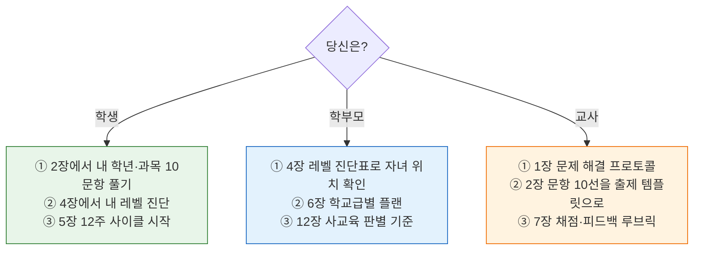

| 파트 | 장 | 내용 | 분량 |
|:--:|:--:|---|:--:|
| **Ⅰ 문제** | 0 | 난이도 체계 — ★1~★5 정의 | 정의 |
| | **1** | **공통 문제 해결 프로토콜 (RULE 6단계)** | **핵심** |
| | **2** | **과목 × 학교급 문항 150선** (5과목 × 3급 × 10문항) | **본체** |
| | 3 | 난이도 사다리 — 같은 소재가 ★1→★5로 오르는 법 | 심화 |
| **Ⅱ 전략** | **4** | **6단계 레벨 로드맵 (L0~L5)** | **핵심** |
| | 5 | 12주 훈련 사이클 | 실행 |
| | 6 | 학교급별 학기 플랜 (초·중·고) | 실행 |
| | 7 | 오답 재작성 프로토콜 & 자가채점 루브릭 | 실행 |
| | 8 | 시험장 타임박스 | 실전 |
| **Ⅲ 배경** | 9~12 | 정책 팩트 · 수능 예측 · 예상 문항 · 리스크 | 근거 |
| **Ⅳ 자료** | 13~14 | 사이트·영상·논문 총람 · 실행표 | 참조 |

---

# 파트 Ⅰ · 문제

---

## 0. 난이도 체계 — ★은 무엇으로 정해지는가

난이도는 "어려운 내용"이 아니라 **요구되는 사고의 종류**로 결정됩니다. 세 축이 곱해집니다.

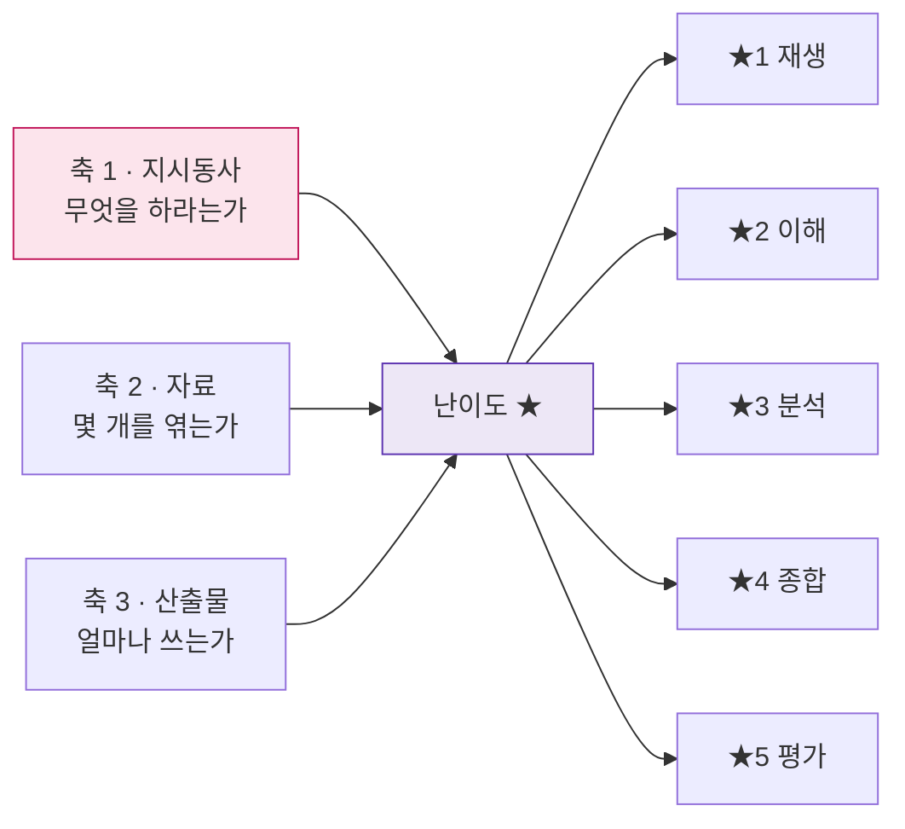

| ★ | 이름 | 지시동사 | 자료 수 | 산출 분량 | 채점 요소 수 | 대표 학년 |
|:--:|---|---|:--:|---|:--:|---|
| **★1** | 재생 | 찾아 쓰시오 / 쓰시오 | 1 | 1문장 | 1~2 | 초3~4 |
| **★2** | 이해 | 설명하시오 / 까닭을 쓰시오 | 1 | 2~3문장 | 2~3 | 초5~중1 |
| **★3** | 분석 | 비교하시오 / 분석하시오 / 해석하시오 | 2 | 4~6문장·150자 | 3~4 | 중2~고1 |
| **★4** | 종합 | 판단하고 근거를 쓰시오 / 제안하시오 | 2~3 | 300~600자 | 4~5 | 중3~고2 |
| **★5** | 평가 | 평가하시오 / 비판적으로 검토하시오 / 논하시오 | 3~4 | 600~1,200자 | 5~6 | 고2~3 |

> 💡 **★3이 벽입니다.** ★2는 "아는 것을 쓰는 것"이지만 ★3부터는 **자료 두 개를 연결**해야 합니다. 대부분의 학생은 ★2에서 ★3으로 못 넘어가고, 그 상태에서 분량만 늘려 ★4·★5 문항에 대응하려다 실점합니다.

**★ 판별법 — 문항을 보고 3초 안에 난이도를 아는 법**

| 문항에 이것이 있으면 | 최소 난이도 |
|---|:--:|
| "찾아 쓰시오", "고르시오" | ★1 |
| "까닭", "왜", "이유" | ★2 |
| "(가)와 (나)", "비교", "차이" | ★3 |
| "판단하고", "근거 **두 가지**", "제안" | ★4 |
| "평가", "비판적으로", "한계", "대안", "어느 정도로" | ★5 |

---

## 1. 공통 문제 해결 프로토콜 — RULE 6단계

> **모든 서·논술형 문항은 이 순서로 풉니다.** 과목도 학년도 상관없습니다. 이 6단계가 파트 Ⅱ 훈련 전체의 뼈대입니다.

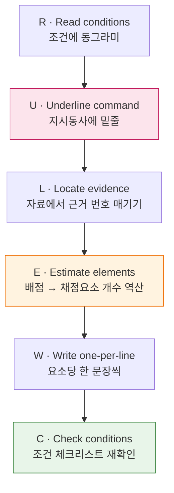

### 1-1. 단계별 행동 명세

| 단계 | 행동 | 시간 배분 | 실패하면 |
|:--:|---|:--:|---|
| **① 조건 표시** | 분량·문장 수·근거 개수·형식(인용/그래프/영어)에 **동그라미** | 5% | 조건 미준수 = 상한 강제 하향 |
| **② 지시동사 판별** | 지시동사에 **밑줄**, 요구 행동을 여백에 한 단어로 (`설명` `비교` `판단`) | 5% | **최다 실점 원인** |
| **③ 근거 위치** | 자료·본문에서 쓸 부분에 **①②③ 번호**를 매김 | 15% | 자료 없이 상식으로 씀 |
| **④ 요소 역산** | **배점 ÷ 2 ≈ 채점요소 개수** → 여백에 요소 목록 작성 | 10% | 분량은 채웠는데 점수는 절반 |
| **⑤ 요소당 1문장** | 목록 순서대로 한 요소 = 한 문장. 접속어로 연결 | 55% | 한 문단에 뭉쳐 채점자가 못 찾음 |
| **⑥ 조건 검산** | ①에서 동그라미 친 것을 하나씩 지우며 확인 | 10% | 다 쓰고 0점 |

### 1-2. ④ 요소 역산 — 가장 빨리 점수가 오르는 기술

채점기준은 **배점을 요소로 쪼개서** 만들어집니다. 역산하면 답안의 뼈대가 나옵니다.

| 배점 | 예상 요소 수 | 답안 구조 |
|:--:|:--:|---|
| 2~3점 | 1~2 | 결론 1문장 (+근거 1문장) |
| 4~5점 | 2~3 | 결론 + 근거 1 + 근거 2 |
| 6~8점 | 3~4 | 결론 + 근거 2개 + 자료 인용 |
| 10점 이상 | 4~6 | 결론 + 근거 2 + 반론 + 재반박 + 한계 |

**실전 예시 — 8점 문항을 만나면**

```
[여백 메모]   8점 → 요소 4개
  ① 판단:  ____
  ② 근거1: (자료 ②에서)
  ③ 근거2: (개념어 ___ 사용)
  ④ 인용/조건 충족 확인
→ 4문장을 쓴다. 5문장도 3문장도 아니다.
```

> 📌 이것은 [IB 수학의 M/A/R 마크 분할 채점](<./(서논술형)-논술형_IB_기출문항_자료지도.md>)을 학생 쪽에서 뒤집은 것입니다. 채점자가 찾을 것을 **미리 배치**하는 것이 서·논술형의 전부입니다.

### 1-3. ⑤ 요소당 1문장 — 문장 설계 템플릿

| 요소 | 문장 시작 | 금지 |
|---|---|---|
| **판단·결론** | "~이다.", "나는 A라고 판단한다." | "~인 것 같다" (모호) |
| **근거(자료)** | "자료 (가)에서 ~가 ~로 변한 것을 보면," | 자료 없이 "일반적으로" |
| **근거(개념)** | "이는 ~ 때문이다. ~란 ~을 뜻한다." | 개념어 부정확 사용 |
| **반론** | "물론 ~라는 반론이 가능하다." | 반론 언급만 하고 끝 |
| **재반박** | "그러나 ~인 경우에는 이 반론이 성립하지 않는다." | — |
| **한계** | "다만 ~라는 조건이 달라지면 판단도 달라진다." | 결론 없이 한계만 |

### 1-4. AI 채점을 염두에 둔 답안 작성 원칙

경기·서울 교육청이 AI 서·논술형 평가 시스템을 확대 중이고, KICE 검증에서 **AI는 문장 길이·어미 다양성 같은 형식 요소에 후한 반면 교사는 개념 이해도와 근거 타당성을 본다**는 차이가 확인됐습니다. 따라서:

| ✅ 두 채점자 모두에게 유리 | ❌ 한쪽에만 통함 |
|---|---|
| 핵심어를 **문장 앞쪽**에 배치 | 미사여구로 길이만 늘리기 (AI만 속음) |
| **한 문장 = 한 요소**로 경계 선명 | 만연체 복문 (교사도 AI도 요소 못 찾음) |
| 개념어를 **정의째** 사용 | 개념어 나열 (AI는 인정, 교사는 감점) |
| 자료를 **직접 인용 후 해석** | 자료 인용만 하고 해석 없음 |

〔근거〕 [KICE "AI채점, 교사보다 형식적 요소에 높은 점수"](https://news.nate.com/view/20260419n14624) · [AI 초벌 채점 논의](https://m.news.nate.com/view/20260419n06799)

### 1-5. 감점 사유 분류표 — 틀렸을 때 여기서 찾는다

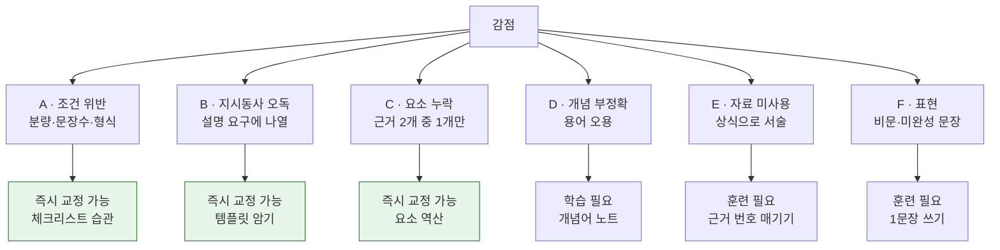

> 💡 **A·B·C는 실력이 아니라 습관입니다.** 대부분 학생의 감점 중 60% 이상이 여기에 속하며, **2주 안에 교정 가능**합니다. D·E·F부터가 진짜 학습입니다. 7장 오답 재작성 프로토콜이 이 분류를 그대로 씁니다.

---
## 2. 과목 × 학교급 문항 150선

> **읽는 법** — 각 표는 **한 과목·한 학교급의 10문항**이며, ★1에서 ★5로 난이도가 오르도록 배열했습니다.
> `채점 요소` = 배점이 어떻게 쪼개지는가 (④ 요소 역산의 정답)
> `해결 키` = 이 문항을 만났을 때 **가장 먼저 할 행동**

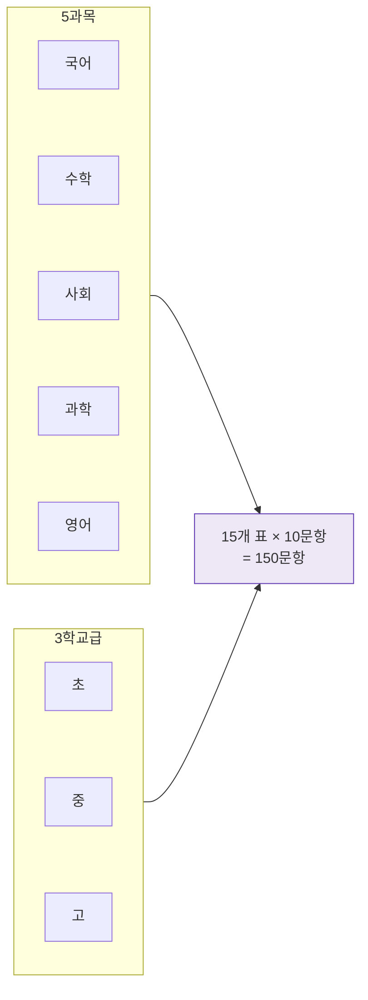

---

### 2-1. 국어 · 초등 (10문항)

| # | ★ | 학년 | 유형 | 문항 (형식 재현) | 채점 요소 | 해결 키 |
|:--:|:--:|:--:|---|---|---|---|
| 1 | ★1 | 초3 | 사실 확인 | 글에서 **겨울잠을 자는 동물 두 가지**를 찾아 쓰고, 그 내용이 나온 문장을 그대로 옮겨 쓰시오. | 대상2 + 인용1 | 답은 본문 안에 있다 — **먼저 밑줄** |
| 2 | ★1 | 초3 | 까닭 한 문장 | 주인공이 운 까닭을 **"왜냐하면 ~기 때문입니다"** 형식으로 한 문장으로 쓰시오. | 까닭1 + 형식1 | 형식이 곧 점수 — 틀을 먼저 씀 |
| 3 | ★2 | 초4 | 순서 설명 | 이 놀이의 방법을 **'먼저–다음으로–마지막으로'**를 사용해 세 문장으로 쓰시오. | 단계3 + 접속어 | 접속어 3개를 **먼저 써 놓고** 채운다 |
| 4 | ★2 | 초4 | 마음 추론 | 이 장면에서 인물의 마음을 나타내는 낱말 하나를 쓰고, **그렇게 생각한 근거를 본문에서 찾아** 쓰시오. | 낱말1 + 근거1 | "근거를 본문에서" = 인용 필수 |
| 5 | ★2 | 초5 | 중심 문장 | 이 문단의 중심 내용을 **한 문장**으로 다시 쓰시오. (20자 내외) | 핵심어 + 완결 | 되풀이되는 낱말이 중심어 |
| 6 | ★3 | 초5 | 두 글 비교 | (가)와 (나)가 같은 대상을 설명하는 **방법의 차이**를 쓰고, 어느 쪽이 이해하기 쉬웠는지 까닭과 함께 쓰시오. | 차이1 + 판단1 + 까닭1 | "차이"가 보이면 **표를 그려 정리** |
| 7 | ★3 | 초5 | 사실·의견 구분 | 광고 문구에서 **사실인 부분과 의견인 부분**을 각각 하나씩 찾아 쓰고, 그렇게 나눈 기준을 쓰시오. | 사실1 + 의견1 + 기준1 | 확인 가능한가? → 사실 |
| 8 | ★3 | 초6 | 주장·근거 점검 | 글쓴이의 주장을 한 문장으로 쓰고, 근거 중 **주장을 뒷받침하지 못하는 것 하나**를 골라 까닭을 쓰시오. | 주장1 + 지목1 + 까닭1 | 근거마다 "이게 주장으로 이어지나?" |
| 9 | ★4 | 초6 | 제안하는 글 | 자료를 보고 우리 학급에 제안할 내용 **하나와 근거 두 가지**를 5문장으로 쓰시오. | 제안1 + 근거2 + 자료연결1 + 형식1 | 5문장 = 요소 5개. **한 문장에 하나씩** |
| 10 | ★4 | 초6 | 반론 인식 | '초등학생 스마트폰 사용 제한'에 대한 내 입장을 쓰고, **반대 입장에서 나올 수 있는 말 한 가지**와 그에 대한 답을 쓰시오. (6문장) | 입장1 + 근거2 + 반론1 + 답1 + 마무리1 | 반론을 **적으로 보지 말고 재료로** |

> 🎯 **초등 국어 핵심**: 1~5번은 "본문에서 찾기", 6~8번은 "두 개를 연결하기", 9~10번은 "내 생각 붙이기". **6번을 넘기지 못하면 중등에서 막힙니다.**

---

### 2-2. 국어 · 중학교 (10문항)

| # | ★ | 학년 | 유형 | 문항 (형식 재현) | 채점 요소 | 해결 키 |
|:--:|:--:|:--:|---|---|---|---|
| 1 | ★2 | 중1 | 설명 방법 | 설명문 (가)에서 사용된 **설명 방법 두 가지**를 찾아 쓰고, 각 방법이 독자의 이해를 돕는 이유를 한 문장씩 쓰시오. (6점) | 방법2 + 이유2 | 방법 이름만 쓰면 절반. **효과까지** |
| 2 | ★2 | 중1 | 문맥 어휘 | 밑줄 친 ⓐ의 문맥적 의미를 **앞뒤 문장을 근거로** 한 문장으로 쓰시오. (3점) | 의미1 + 근거1 | 사전 뜻 ✗, **이 글에서의 뜻** ✓ |
| 3 | ★3 | 중1 | 요약 | 세 문단을 **각 문단의 핵심어를 포함하여** 세 문장으로 요약하시오. | 핵심어3 + 연결1 | 문단당 한 문장, 핵심어에 동그라미 먼저 |
| 4 | ★3 | 중2 | 문학 해석 | 시의 화자가 처한 상황을 **시어 두 개를 근거로** 설명하고, 마지막 행의 어조 변화가 주제에 미치는 효과를 쓰시오. (8점) | 상황1 + 시어2 + 효과1 | 시어를 **따옴표로 인용**해야 근거로 인정 |
| 5 | ★3 | 중2 | 매체 언어 장치 | 같은 사건을 다룬 기사 (가)·(나)가 **동일 사실을 다르게 보이게 한 언어적 장치 두 가지**를 찾고, 각각이 독자 인식에 미치는 영향을 한 문장씩 쓰시오. (8점) | 장치2 + 영향2 | 제목·어미·수식어·수치 제시 방식을 본다 |
| 6 | ★3 | 중2 | 문법 적용 | 다음 단어에서 일어난 **음운 변동의 종류**를 쓰고, 그렇게 판단한 근거를 규칙에 비추어 설명하시오. | 종류1 + 근거1 + 규칙1 | 규칙 이름 + 적용 과정 둘 다 |
| 7 | ★4 | 중3 | 논리 허점 | 토론 자료를 읽고 반대 측 주장의 **논리적 허점 한 가지**를 지적한 뒤, 이를 보완할 근거를 제시하시오. (10점) | 허점1 + 이유1 + 보완근거1 + 표현1 | 허점 유형(성급한 일반화·인과 혼동) 이름 대기 |
| 8 | ★4 | 중3 | 조건 작문 | '경쟁'에 대한 자신의 관점을 **비유 하나를 사용하여** 200자로 쓰시오. | 관점1 + 비유1 + 전개1 + 분량1 | 조건 2개(비유·분량)를 **먼저 동그라미** |
| 9 | ★4 | 중3 | 전제 밝히기 | 글쓴이가 **밝히지 않은 전제 한 가지**를 찾아 쓰고, 그 전제가 무너지면 주장이 어떻게 되는지 쓰시오. | 전제1 + 결과1 + 설명1 | "당연히 ~라면"에 숨은 것 |
| 10 | ★5 | 중3 | 반박문 | 상대 입론을 **한 문장으로 요약**한 뒤, 반박 두 가지를 제시하고 예상되는 재반박에 대비한 문장을 덧붙이시오. (400자) | 요약1 + 반박2 + 재반박대비1 + 구성1 | 요약을 정확히 해야 반박이 **빗나가지 않음** |

> 🎯 **중등 국어 핵심**: 4·5번(근거 인용)과 7번(허점 지목)이 분기점입니다. **"장치를 찾았다"에서 "그 장치가 독자를 어디로 이끄는가"로 넘어가면 ★3 벽을 통과**합니다.

---

### 2-3. 국어 · 고등학교 (10문항)

| # | ★ | 학년 | 유형 | 문항 (형식 재현) | 채점 요소 | 해결 키 |
|:--:|:--:|:--:|---|---|---|---|
| 1 | ★3 | 고1 | 논지 구조화 | 지문의 논지 전개를 **'주장–근거–예상 반론–대응'** 순서로 정리해 4문장으로 쓰시오. | 4요소 각 1 | 지문에 구조 표시부터 (①②③④) |
| 2 | ★3 | 고1 | 문맥 정밀 | ⓐ가 지문에서 갖는 의미를 **문맥상 근거 한 가지를 포함하여** 한 문장으로 쓰시오. (3점) | 의미1 + 근거1 | 수능 국어 어휘 문항의 서술형 전환 |
| 3 | ★4 | 고1 | 매체 비교 논증 | 같은 사건을 보도한 기사 (가)와 SNS 게시물 (나)를 비교해, **매체 특성이 정보 신뢰도에 미치는 영향**을 논하시오. (600자) | 특성비교2 + 영향2 + 사례1 + 구성1 | 매체 **속성**(게이트키핑·즉시성·익명성)으로 환원 |
| 4 | ★4 | 고2 | 관점 비교 | (가)와 (나)의 핵심 전제를 각각 밝히고, **두 관점이 갈라지는 지점**을 한 문장으로 특정하시오. (300자) | 전제2 + 분기점1 + 표현1 | "무엇에 대해 의견이 다른가"를 **명사구로** |
| 5 | ★4 | 고2 | 이론 적용 판단 | \<보기\>의 사례가 지문의 이론으로 **설명되는지 판단**하고, 설명되지 않는다면 어떤 조건이 충족되지 않는지 쓰시오. (150자) | 판단1 + 근거1 + 조건1 | 이론의 **적용 조건**을 먼저 목록화 |
| 6 | ★4 | 고2 | 문학 해석 근거화 | 작품 해석 A와 B 중 하나를 택하고, **작품 내 근거 두 개**를 들어 정당화하시오. 반대 해석이 성립할 여지도 한 문장으로 쓰시오. | 선택1 + 근거2 + 여지1 | 근거는 반드시 **행·구절 인용** |
| 7 | ★5 | 고2 | 입장 논술 | (가)는 공정을 기회의 평등으로, (나)는 결과의 보정으로 본다. 두 관점을 비교하고 **구체적 정책 사례 하나**로 자신의 입장을 논술하시오. (900자) | 비교2 + 입장1 + 사례1 + 반론1 + 구성1 | 사례는 **하나만 깊게** — 나열 금지 |
| 8 | ★5 | 고3 | 비판적 검토 | (가)~(라)를 활용해 **'기술 중립성' 주장을 비판적으로 검토**하고 대안적 관점을 제시하시오. (1,200자) | 주장정리1 + 비판2 + 자료활용2 + 대안1 | 자료 4개를 **각각 다른 역할**로 배치 |
| 9 | ★5 | 고3 | 자기 반박 | 자신의 주장을 제시한 뒤, **그 주장의 가장 약한 지점을 스스로 지목**하고 그럼에도 주장이 유지되는 이유를 쓰시오. (600자) | 주장1 + 약점1 + 방어1 + 한계1 | AP DBQ '정교성' 1점과 동일 구조 |
| 10 | ★5 | 고3 | 조건 통합 논술 | 자료 (가)~(라)를 **모두 활용**하고 **개념어 3개를 포함**하여, 제시된 문제의 해결 방향을 논하시오. (1,000자) | 자료4 + 개념어3 + 방향1 + 구성1 | 조건 체크박스를 여백에 그려두고 지워 나감 |

> 🎯 **고등 국어 핵심**: 7~10번은 모두 **"반론·한계"가 배점에 포함**됩니다. [자매 문서 AP DBQ 루브릭의 정교성 1점](<./(서논술형)-논술형_IB_기출문항_자료지도.md>)이 국내 확장형 루브릭 '논증 구성' 최상단과 같은 지점을 봅니다.

---

### 2-4. 수학 · 초등 (10문항)

| # | ★ | 학년 | 유형 | 문항 (형식 재현) | 채점 요소 | 해결 키 |
|:--:|:--:|:--:|---|---|---|---|
| 1 | ★1 | 초3 | 과정 쓰기 | 347 + 285를 계산하는 과정을 **받아올림이 드러나게** 쓰시오. | 과정2 + 답1 | "드러나게" = 중간 단계를 **지우지 말 것** |
| 2 | ★1 | 초4 | 어림 판단 | 친구가 구한 답이 맞는지 **어림하여 판단**하고 까닭을 쓰시오. | 판단1 + 어림근거1 | 정확히 풀지 말고 **자릿수로** |
| 3 | ★2 | 초4 | 식의 의미 | 문제 상황을 식으로 나타내고, **식의 각 수가 무엇을 뜻하는지** 쓰시오. | 식1 + 의미2 | 수 하나하나에 이름표 붙이기 |
| 4 | ★2 | 초5 | 두 가지 방법 | 같은 문제를 **두 가지 방법**으로 풀고, 어느 쪽이 더 간단한지 까닭과 함께 쓰시오. | 방법2 + 판단1 + 까닭1 | "간단하다"의 기준(계산 횟수)을 밝힌다 |
| 5 | ★2 | 초5 | 오류 찾기 | 친구의 풀이에서 **틀린 곳을 찾아** 왜 틀렸는지 설명하고 바르게 고치시오. | 위치1 + 이유1 + 정정1 | 위치만 쓰면 절반 — **이유가 본점수** |
| 6 | ★3 | 초5 | 단위 관계 설명 | 1 m²와 1 cm²의 관계가 **왜 100배가 아니라 10000배인지** 그림 또는 식으로 설명하시오. | 설명1 + 근거1 + 표현1 | 가로·세로 **둘 다 변한다**는 점 |
| 7 | ★3 | 초6 | 비율 판단 | 두 컵의 설탕물 중 **어느 쪽이 더 진한지** 판단하고, 비율을 이용해 근거를 쓰시오. | 판단1 + 계산1 + 근거1 | 분모를 맞추거나 **비율로 환산** |
| 8 | ★3 | 초6 | 평균의 한계 | 두 반의 평균이 같다. 그런데 학습 상태가 같다고 말할 수 **없는 이유**를 자료를 근거로 쓰시오. | 이유1 + 자료근거1 + 대안지표1 | 평균 뒤에 숨은 **흩어진 정도** |
| 9 | ★4 | 초6 | 자료 해석·반론 | 그래프를 보고 내릴 수 있는 결론 하나를 쓰고, **다르게 해석될 가능성**도 함께 쓰시오. | 결론1 + 근거1 + 대안해석1 + 표현1 | 축·기간·단위를 먼저 확인 |
| 10 | ★4 | 초6 | 규칙 일반화 | 수의 배열에서 규칙을 **말로 설명**하고, 100번째 수를 구하는 방법을 서술하시오. | 규칙1 + 설명1 + 방법1 + 답1 | 3~4번째까지 써 보고 **차이를 본다** |

> 🎯 **초등 수학 핵심**: 초등 수학 평가자료의 **92.5%가 "풀이 과정과 답을 쓰시오"** 유형입니다(1번 유형). **4·5·8·9번처럼 "비교·오류·한계·대안 해석"을 요구하는 유형은 학교에서 거의 안 나옵니다** — 여기가 집에서 메워야 할 구멍입니다.
> 〔근거〕 [이투데이 초등 수학 평가자료 분석](https://www.etoday.co.kr/news/view/2621971)

---

### 2-5. 수학 · 중학교 (10문항)

| # | ★ | 학년 | 유형 | 문항 (형식 재현) | 채점 요소 | 해결 키 |
|:--:|:--:|:--:|---|---|---|---|
| 1 | ★2 | 중1 | 과정 분할 | 180을 소인수분해하는 과정을 쓰고, **약수의 개수를 구하는 방법**을 함께 서술하시오. | 과정2 + 방법1 + 답1 | 지수+1의 곱인 **이유**까지 |
| 2 | ★2 | 중1 | 오류 정정 | `-3² = 9`라고 쓴 풀이가 틀린 이유를 **연산 순서를 근거로** 설명하고 바르게 고치시오. | 이유1 + 근거1 + 정정1 | 부호가 **밑에 포함되는가** |
| 3 | ★3 | 중2 | 문장제 모델링 | 연립방정식으로 해결하는 과정에서 **미지수를 그렇게 설정한 이유**를 포함하여 풀이를 서술하시오. | 설정이유1 + 식2 + 풀이1 + 답1 | 미지수 설정을 **문장으로** 먼저 |
| 4 | ★3 | 중2 | 그래프 해석 | 일차함수 그래프에서 **기울기가 이 상황에서 무엇을 뜻하는지** 쓰고, 절편의 의미도 함께 서술하시오. | 기울기의미1 + 절편의미1 + 표현1 | 단위를 붙여 말한다 (예: 분당 m) |
| 5 | ★3 | 중2 | 오개념 반박 | "동전을 5번 던져 모두 앞면이 나왔으니 다음은 뒷면이 나올 확률이 높다"는 주장을 **반박**하시오. | 반박1 + 근거1 + 개념어1 | 독립시행 — **개념어를 정의째** |
| 6 | ★4 | 중3 | 조건 + 계산 | `y = x² - 4x + k`가 x축과 서로 다른 두 점에서 만난다. (1) **판별식을 이용해** k의 범위를 풀이와 함께 구하시오. (2) k=3일 때 두 교점과 꼭짓점이 이루는 삼각형의 넓이를 구하는 과정을 서술하시오. (10점) | 판별식1 + 범위1 + 좌표2 + 넓이1 | (1)의 결과를 (2)에 **일관되게 사용** |
| 7 | ★4 | 중3 | 반례 + 조건 수정 | "`a² = b²`이므로 `a = b`"라는 추론이 옳지 않은 이유를 **반례를 들어** 설명하고, 옳게 되도록 조건을 수정해 다시 진술하시오. | 반례1 + 이유1 + 수정1 + 진술1 | 반례는 **구체적 수**로 |
| 8 | ★4 | 중3 | 증명 서술 | 피타고라스 정리를 **넓이를 이용해** 증명하는 과정을 그림과 함께 서술하시오. | 구성1 + 식전개2 + 결론1 | 그림의 각 부분에 **문자 표기** |
| 9 | ★4 | 중3 | 통계 한계 | 설문 결과로 "우리 학교 학생 대부분이 A를 선호한다"고 결론 내릴 수 **없는 이유**를 표본과 관련지어 쓰시오. | 이유1 + 표본개념1 + 개선안1 | 표본 크기·추출 방법·응답 편향 |
| 10 | ★5 | 중3 | 실생활 모델링 | 주어진 상황을 식으로 나타내고, 이 모델이 **현실과 어긋날 수 있는 지점 한 가지**를 지적한 뒤 보완 방향을 제시하시오. | 모델1 + 해석1 + 한계1 + 보완1 + 표현1 | 모델의 **가정**을 먼저 적어 둔다 |

> 🎯 **중등 수학 핵심**: 6번이 전형적 정기고사 문항, **7·9·10번이 서·논술형 전환 문항**입니다. 수학은 AI–교사 채점 상관계수가 **0.77로 전 교과 최고**라 수능 도입 시 가장 먼저·가장 크게 들어올 영역입니다.

---

### 2-6. 수학 · 고등학교 (10문항)

| # | ★ | 학년 | 유형 | 문항 (형식 재현) | 채점 요소 | 해결 키 |
|:--:|:--:|:--:|---|---|---|---|
| 1 | ★3 | 고1 | 조건 서술 | 이차부등식이 **모든 실수에 대해 성립**할 조건을 구하는 과정을 판별식과 최고차항 부호를 모두 언급하여 서술하시오. | 부호조건1 + 판별식1 + 결론1 | 두 조건 **모두** 써야 만점 |
| 2 | ★3 | 고1 | 중복 제거 설명 | 경우의 수를 구할 때 **왜 나누어 주어야 하는지**를 구체적 예를 들어 설명하시오. | 이유1 + 예1 + 식1 | 같은 것으로 세어진 경우를 **나열** |
| 3 | ★4 | 고1 | 정의역 제한 | 함수의 정의역을 제한해야 하는 이유를 **역함수 존재 조건**과 관련지어 서술하시오. | 조건1 + 이유1 + 예1 | 일대일 대응 — 그래프로 확인 |
| 4 | ★4 | 고2 | 분할 채점형 | 함수 f(x)가 조건 (가),(나)를 만족할 때 **f(3)을 구하는 과정을 단계별로** 서술하고 답을 쓰시오. (6점) | 변환 M1·2점 / 미지수결정 M1·2점 / 산출 A1·1점 / 결론 A1·1점 | **M(방법)은 계산 실수와 무관하게 인정** — 과정을 지우지 마라 |
| 5 | ★4 | 고2 | 반례 + 수정 | `a² = b² ⇒ a = b`가 성립하지 않는 이유를 반례로 설명하고 조건을 수정해 진술하시오. | 반례1 + 이유1 + 수정1 | 중3 7번의 고2 버전 — **조건 진술의 정밀도**가 다름 |
| 6 | ★4 | 고2 | 귀납 정당화 | 수열의 규칙을 **추측하고**, 그 추측이 항상 옳다고 말하려면 무엇이 더 필요한지 쓰시오. | 추측1 + 근거1 + 필요조건1 | 몇 개 확인 ≠ 증명 |
| 7 | ★5 | 고2 | 모형 해석 | `P(t) = 1200 / (1 + 5e^(-0.4t))` 로 모형화된 개체군에서 (a) 초기 개체 수 **[2]** (b) 1000을 넘는 최소 정수 t **[3]** (c) `P'(t)`가 최대가 되는 시점과 **그 시점의 의미** **[5]** | (c) 미분식 M1 / 조건 M1 / 산출 A1 / 변곡점 진술 R1 / 맥락 해석 R1 | **[ ] 배점이 곧 단계 수** — IB·Cambridge 공통 형식 |
| 8 | ★5 | 고3 | 두 풀이 비교 | 같은 문제에 대한 풀이 A와 B를 **정확성·효율성 면에서 비교**하고, 어느 쪽이 더 나은지 판단 근거와 함께 쓰시오. | 비교2 + 판단1 + 근거1 + 한계1 | "더 낫다"의 **기준을 먼저 선언** |
| 9 | ★5 | 고3 | 논리 결함 지적 | 다음 증명에서 **논리적으로 정당화되지 않은 단계**를 지목하고, 그 단계를 메우려면 무엇이 필요한지 쓰시오. | 지목1 + 이유1 + 보완1 + 표현1 | "따라서"가 나오는 곳을 의심 |
| 10 | ★5 | 고3 | 모델 선택 정당화 | 실험 데이터에 대해 **선형 모델과 지수 모델 중 어느 쪽이 적절한지** 판단하고, 판단 근거와 이 판단의 한계를 쓰시오. | 판단1 + 근거2 + 한계1 + 표현1 | 잔차·결정계수 또는 **증가율의 성질** |

> 🎯 **고등 수학 핵심**: 4·7번의 **M/A/R 분할 채점 구조**를 이해하면 "답은 틀렸는데 점수가 나오는" 원리를 알게 됩니다. 과정을 지우거나 암산으로 건너뛰면 **받을 수 있는 M 마크를 버리는 것**입니다.

---
### 2-7. 사회 · 초등 (10문항)

| # | ★ | 학년 | 유형 | 문항 (형식 재현) | 채점 요소 | 해결 키 |
|:--:|:--:|:--:|---|---|---|---|
| 1 | ★1 | 초3 | 자료 사실 추출 | 우리 고장의 옛 모습과 오늘날 모습을 비교한 사진에서 **달라진 점 두 가지**를 찾아 쓰시오. | 변화2 | 눈에 보이는 것부터 — 추측 ✗ |
| 2 | ★2 | 초4 | 지도 읽기 | 지도를 보고 이 마을에 **시장이 이곳에 생긴 까닭**을 지도의 정보를 근거로 쓰시오. | 까닭1 + 지도근거1 | 길·강·집이 모인 곳 |
| 3 | ★2 | 초4 | 역할 설명 | 우리가 낸 세금이 **공공기관을 통해 어떻게 쓰이는지** 한 가지 예를 들어 설명하시오. | 예1 + 과정1 + 연결1 | 구체적 기관 이름을 댄다 |
| 4 | ★3 | 초5 | 인물 판단 | 이 인물의 선택에 대해 **잘한 점과 아쉬운 점**을 각각 하나씩 쓰고, 그때의 상황을 근거로 들어 판단하시오. | 잘한점1 + 아쉬운점1 + 시대근거1 | **그 시대 기준**으로 판단 |
| 5 | ★3 | 초5 | 그래프 변화 | 인구 그래프에서 읽을 수 있는 변화를 **한 문장으로** 쓰고, 그 변화가 우리 생활에 줄 영향을 한 가지 쓰시오. | 변화1 + 영향1 + 연결1 | 변화 → 영향의 **화살표를 말로** |
| 6 | ★3 | 초5 | 사료 비교 | 같은 사건을 기록한 두 자료가 **다르게 말하는 부분**을 찾고, 왜 다를 수 있는지 쓰시오. | 차이1 + 이유1 + 표현1 | **누가 썼는가**를 먼저 본다 |
| 7 | ★4 | 초6 | 원리 적용 판단 | 학급 회의에서 있었던 일이 **민주주의 원리에 맞는지 판단**하고, 근거 두 가지를 쓰시오. | 판단1 + 원리1 + 근거2 | 원리 이름(다수결·소수 존중)을 명시 |
| 8 | ★4 | 초6 | 선택과 대가 | 자료 속 선택에서 **포기한 것(기회비용)**이 무엇인지 쓰고, 그 선택이 합리적이었는지 판단하시오. | 기회비용1 + 판단1 + 근거2 | 포기한 것 중 **가장 큰 것** |
| 9 | ★4 | 초6 | 제안 + 근거 | 지구촌 문제 자료를 보고 우리가 실천할 수 있는 방법 **하나와 근거 두 가지**를 쓰시오. (5문장) | 제안1 + 근거2 + 자료연결1 + 형식1 | 실천 가능한 크기로 좁힌다 |
| 10 | ★4 | 초6 | 규칙 + 반대 고려 | 학교에 새 규칙을 제안하고, **반대할 사람의 입장**을 한 가지 쓴 뒤 그 입장을 어떻게 고려할지 쓰시오. | 제안1 + 근거1 + 반대입장1 + 조정1 | 반대하는 **사람을 구체적으로** 떠올린다 |

---

### 2-8. 사회 · 중학교 (10문항)

| # | ★ | 학년 | 유형 | 문항 (형식 재현) | 채점 요소 | 해결 키 |
|:--:|:--:|:--:|---|---|---|---|
| 1 | ★2 | 중1 | 자료 인과 | (가)는 A국 연령별 인구 구조, (나)는 복지 지출 비중이다. (1) (가)의 변화를 **한 문장으로** (2점) (2) 그 변화가 (나)에 준 영향을 **인과가 드러나게** 서술 (6점) | 변화1 + 인과2 + 표현1 | "~때문에 ~이 늘었다" 형태를 **먼저 써 놓기** |
| 2 | ★2 | 중1 | 요인 설명 | 이 지역의 기후 특성이 나타나는 이유를 **기후 요소 두 가지**를 들어 설명하시오. | 요소2 + 설명1 | 위도·수륙 분포·해류·지형 중 택2 |
| 3 | ★3 | 중1 | 지역 비교 | 두 지역의 산업 구조 자료를 비교해 **공통점 하나와 차이점 하나**를 쓰고, 차이가 생긴 이유를 쓰시오. | 공통1 + 차이1 + 이유1 | 비교는 **같은 기준축**으로 |
| 4 | ★3 | 중2 | 개념 적용 | 제시된 사례가 **어떤 인권과 관련되는지** 밝히고, 그렇게 판단한 근거를 사례에서 찾아 쓰시오. | 개념1 + 근거1 + 연결1 | 개념 정의를 먼저 한 문장 |
| 5 | ★3 | 중2 | 제도 이유 설명 | 삼권분립이 **왜 필요한지**를 권력 집중의 위험과 관련지어 설명하시오. | 필요성1 + 위험1 + 사례1 | 제도는 **막으려는 것**에서 출발 |
| 6 | ★4 | 중3 | 지표 충돌 해석 | 두 경제 지표가 **서로 다른 방향**을 가리킨다. 각각이 말하는 바를 쓰고, 이를 어떻게 종합해야 할지 서술하시오. | 해석2 + 종합1 + 근거1 | 지표의 **정의와 측정 대상**이 다름 |
| 7 | ★4 | 중3 | 찬반 + 반론 | 정책 A에 대한 **찬성 논거 하나**를 제시하고, 제기될 수 있는 **반론 한 가지**와 그에 대한 답변을 쓰시오. (200자) | 논거1 + 반론1 + 재반박1 | 반론은 **가장 강한 것**으로 골라야 점수 |
| 8 | ★4 | 중3 | 사료 가치·한계 | 자료의 **출처와 목적**을 밝히고, 이 자료를 근거로 쓸 때의 **가치와 한계**를 각각 쓰시오. | 출처1 + 목적1 + 가치1 + 한계1 | IB History의 **OPVL 축약형** |
| 9 | ★4 | 중3 | 자료 결합 판단 | 지도와 통계를 함께 보고, 이 지역에 필요한 정책을 **판단하고 근거 두 가지**를 쓰시오. | 판단1 + 지도근거1 + 통계근거1 + 표현1 | 자료 **두 개를 모두** 인용해야 만점 |
| 10 | ★5 | 중3 | 이해관계 조정 | 지역 개발 사업에 대해 **이해관계자 두 집단의 입장**을 각각 정리하고, 양쪽을 고려한 조정안을 제시하시오. (400자) | 입장2 + 근거2 + 조정1 + 표현1 | 조정안은 **무엇을 양보시키는지** 명시 |

---

### 2-9. 사회 · 고등학교 (10문항)

| # | ★ | 학년 | 유형 | 문항 (형식 재현) | 채점 요소 | 해결 키 |
|:--:|:--:|:--:|---|---|---|---|
| 1 | ★3 | 고1 | 통합사회 인과 | 자료 (가)의 추세가 (나)에 미친 영향을 **인과 관계가 드러나도록** 두 문장으로 쓰시오. (4점) | 사실1 + 인과2 + 표현1 | 매개 변수를 한 단어로 명시 |
| 2 | ★3 | 고1 | 개념 구분 | '절차적 정의'와 '분배적 정의'의 차이를 **각각의 판단 기준**을 들어 설명하시오. | 정의2 + 기준2 | 무엇을 보고 정의로운지 판단하는가 |
| 3 | ★4 | 고1 | 찬반 정당화 | 재난 시 정부가 개인의 이동을 제한하는 조치에 대해, 자료 (가)~(다)를 근거로 **찬성·반대 두 입장을 각각 제시**한 뒤 자신의 견해를 정당화하시오. (1,000자) | 찬성2 + 반대2 + 견해1 + 자료활용2 + 구성1 | 양쪽을 **동등한 무게**로 써야 상위 등급 |
| 4 | ★4 | 고2 | 이론 적용 비교 | 같은 사회 현상을 두 이론으로 설명하고, **어느 쪽 설명력이 더 큰지** 판단하시오. (400자) | 설명2 + 판단1 + 근거1 + 한계1 | 설명력 = **설명하지 못하는 것**으로 비교 |
| 5 | ★4 | 고2 | 측정의 한계 | 이 지표가 사회 상태를 **온전히 보여주지 못하는 이유**를 쓰고, 보완할 지표를 제안하시오. | 한계2 + 대안1 + 근거1 | 지표는 무엇을 **빼고 세는가** |
| 6 | ★4 | 고2 | 인과 추론 오류 | "A 정책 이후 B가 개선되었으므로 A가 효과적이다"라는 주장의 **추론상 문제**를 지적하고, 검증하려면 무엇이 필요한지 쓰시오. | 오류지목1 + 이유1 + 검증방법1 + 표현1 | 교란 변수·역인과·선택 편향 |
| 7 | ★5 | 고2 | 비교 에세이 | **두 개의 서로 다른 지역**에서 일어난 권위주의 국가 성립을 예로 들어, **경제적 요인이 얼마나 중요했는지 평가(To what extent)** 하시오. | 지역2 + 사례2 + 평가1 + 반론1 + 구성1 | **"두 지역" 조건 위반 시 상한 강제 하향** |
| 8 | ★5 | 고3 | 자료 종합 평가 | 자료 (가)~(라)를 모두 사용하여 정책 X의 **성과와 한계를 평가**하고 개선 방향을 제시하시오. (1,000자) | 성과2 + 한계2 + 자료4 + 개선1 | 자료마다 **역할을 다르게** 배정 |
| 9 | ★5 | 고3 | 다중 관점 조정 | 이 쟁점에 대한 **세 이해관계자의 관점**을 각각 정리하고, 어떤 가치가 충돌하는지 밝힌 뒤 조정 원칙을 제시하시오. | 관점3 + 충돌1 + 원칙1 + 표현1 | 충돌하는 **가치의 이름**을 붙인다 |
| 10 | ★5 | 고3 | 판단 + 한계 명시 | 쟁점에 대한 자신의 입장을 정하고, **그 판단이 달라질 수 있는 조건**을 명시하며 논하시오. (1,200자) | 입장1 + 근거2 + 반론1 + 조건1 + 구성1 | 결론부 "다만 ~라면" **한 문장이 등급을 올림** |

> 🎯 **사회 핵심**: 중3 8번(출처·목적·가치·한계)과 고2 7번(두 지역 조건)은 **IB History Paper 1·2 구조의 국내 이식형**입니다. 조건 위반이 곧 상한 하향이라는 규칙이 국내 루브릭에도 그대로 들어옵니다.

---

### 2-10. 과학 · 초등 (10문항)

| # | ★ | 학년 | 유형 | 문항 (형식 재현) | 채점 요소 | 해결 키 |
|:--:|:--:|:--:|---|---|---|---|
| 1 | ★1 | 초3 | 관찰 기록 | 관찰한 내용을 **크기·색깔·모양**이 드러나게 세 문장으로 쓰시오. | 항목3 | 느낌 ✗, **관찰 사실** ✓ |
| 2 | ★2 | 초4 | 분류 기준 | 물체들을 두 무리로 나누고, **어떤 기준으로 나누었는지** 설명하시오. | 기준1 + 분류1 + 설명1 | 기준은 **예·아니오로 답할 수 있게** |
| 3 | ★2 | 초4 | 예상 대조 | 실험 전 예상과 실제 결과를 비교해, **다른 점과 그 까닭**을 쓰시오. | 비교1 + 까닭1 | 예상이 틀린 것도 **자료** |
| 4 | ★3 | 초5 | 변인 통제 | 이 실험에서 **한 가지만 다르게 하고 나머지는 같게 한 이유**를 쓰시오. | 이유1 + 변인2 | 무엇 때문인지 **알 수 없게 되므로** |
| 5 | ★3 | 초5 | 경향 서술 | 그래프에서 나타나는 **변화의 경향**을 한 문장으로 쓰고, 그렇게 되는 까닭을 쓰시오. | 경향1 + 까닭1 + 표현1 | "점점 ~진다" + 단위 |
| 6 | ★3 | 초5 | 실험 개선 | 이 실험에서 **결과가 정확하지 않을 수 있는 까닭**을 쓰고 개선 방법을 제안하시오. | 원인1 + 개선1 + 연결1 | 측정 도구·횟수·주변 조건 |
| 7 | ★4 | 초6 | 결론의 한계 | 한 번의 실험 결과만으로 **"A가 B의 원인이다"라고 말할 수 없는 까닭**을 쓰시오. | 까닭1 + 근거1 + 보완1 | 반복·비교 집단이 없다 |
| 8 | ★4 | 초6 | 모형의 한계 | 지구본(또는 모형)으로 설명하기 **어려운 점 한 가지**를 쓰고, 왜 그런지 설명하시오. | 한계1 + 이유1 + 표현1 | 모형은 무엇을 **단순화했는가** |
| 9 | ★4 | 초6 | 원리 적용 | 생활 속 현상 하나를 골라 배운 원리로 **설명**하고, 그 설명이 맞는지 확인할 방법을 쓰시오. | 현상1 + 원리1 + 확인법1 + 표현1 | 확인 방법 = **작은 실험** |
| 10 | ★4 | 초6 | 주장 평가 | 광고 속 과학적 주장이 **믿을 만한지 판단**하고 근거 두 가지를 쓰시오. | 판단1 + 근거2 + 표현1 | 근거 자료가 **제시되었는가** |

---

### 2-11. 과학 · 중학교 (10문항)

| # | ★ | 학년 | 유형 | 문항 (형식 재현) | 채점 요소 | 해결 키 |
|:--:|:--:|:--:|---|---|---|---|
| 1 | ★2 | 중1 | 입자 설명 | 물이 끓을 때의 변화를 **입자의 배열과 운동**으로 설명하시오. | 배열1 + 운동1 + 연결1 | 눈에 보이는 현상 → **입자 언어로 번역** |
| 2 | ★2 | 중1 | 오차 원인 | 같은 물체를 여러 번 측정했는데 값이 달랐다. **가능한 원인 두 가지**와 줄이는 방법을 쓰시오. | 원인2 + 방법1 | 도구·읽는 방법·환경 |
| 3 | ★3 | 중2 | 변인 설계 | 빛의 세기에 따른 광합성량 변화를 확인하려 한다. (1) **독립·종속·통제변인** (3점) (2) 과정 3단계와 **예상 결과 그래프 개형** (7점) | 변인3 + 과정3 + 그래프1 | 통제변인을 **2개 이상** 적어야 안전 |
| 4 | ★3 | 중2 | 예측 + 근거 | 회로를 이렇게 바꾸면 전구의 밝기가 어떻게 될지 **예측**하고 근거를 쓰시오. | 예측1 + 근거1 + 개념어1 | 저항·전류 관계를 식으로 |
| 5 | ★3 | 중2 | 비교 설명 | 두 소화 효소의 **작용 부위와 대상**을 비교하여 표로 정리하고, 차이가 생기는 이유를 쓰시오. | 비교2 + 이유1 | pH 환경과 연결 |
| 6 | ★4 | 중3 | 계산 + 해석 한계 | 유전 자료로 자손의 형질 확률을 구하고, **이 확률이 실제 결과와 다를 수 있는 이유**를 쓰시오. | 계산1 + 답1 + 이유1 + 개념1 | 확률 ≠ 실제 빈도, **표본 수** |
| 7 | ★4 | 중3 | 실험 설계 | 가설을 세우고 이를 검증할 실험을 **과정·변인·예상 결과**가 드러나게 설계하시오. | 가설1 + 변인2 + 과정1 + 예상1 | 가설은 **검증 가능한 문장**으로 |
| 8 | ★4 | 중3 | 대립 가설 구분 | 두 가지 설명 중 **어느 쪽이 옳은지 구분할 수 있는 실험**을 제안하고, 왜 그 실험이 구분해 주는지 쓰시오. | 실험1 + 구분원리1 + 예상2 | 두 가설이 **다른 결과를 예측**하는 지점 |
| 9 | ★4 | 중3 | 자료 오류 지적 | 제시된 그래프 해석에서 **잘못된 부분**을 찾아 지적하고 바르게 해석하시오. | 지적1 + 이유1 + 정정1 | 축·눈금·기간·단위 |
| 10 | ★5 | 중3 | 기사 비판 평가 | 과학 기사의 주장이 **제시된 근거로 뒷받침되는지 평가**하고, 추가로 필요한 정보를 쓰시오. (400자) | 주장1 + 근거평가2 + 추가정보1 + 표현1 | 표본·대조군·재현 여부 |

---

### 2-12. 과학 · 고등학교 (10문항)

| # | ★ | 학년 | 유형 | 문항 (형식 재현) | 채점 요소 | 해결 키 |
|:--:|:--:|:--:|---|---|---|---|
| 1 | ★3 | 고1 | 원리 적용 | 물과 모래의 온도 변화 그래프를 **비열 차이**로 설명하고, 이를 **해륙풍 발생**에 적용해 서술하시오. | 비열1 + 그래프해석1 + 적용2 | 원리 → 현상의 **두 단계를 분리** |
| 2 | ★3 | 고1 | 개념 설명 | 이 반응에서 **산화된 물질과 환원된 물질**을 밝히고, 그렇게 판단한 근거를 전자 이동으로 설명하시오. | 판정2 + 근거1 | 산화수 변화 표시 |
| 3 | ★4 | 고1 | 인과 + 한계 | 자료에서 읽히는 인과 관계를 서술하고, 이 자료만으로 단정할 수 **없는 이유**를 함께 쓰시오. | 인과2 + 한계1 + 표현1 | 상관 ≠ 인과 |
| 4 | ★4 | 고2 | 분자 수준 설명 | 그래프는 pH별 효소 X의 반응 속도이다. (a) 최적 pH **[1]** (b) pH 9에서 속도가 감소한 이유를 **분자 수준에서** **[3]** (c) 이 실험만으로 "X는 위에서 작용하지 않는다"고 결론 내릴 수 **없는 이유** **[4]** | 추정1 / 구조변형2·활성부위1 / 조건한계2·추가실험2 | (b)는 **입체 구조 변형**까지 가야 만점 |
| 5 | ★4 | 고2 | 불확도 분석 | 진자 실험에서 (a) `T²`–`L` 그래프 기울기의 물리적 의미 **[2]** (b) **오차 막대를 이용한 최대·최소 기울기로 불확도 계산** **[3]** (c) 계통 오차 원인과 개선 방안 **[2]** | 의미1 / 기울기2·계산1 / 원인1·개선1 | 계통 오차는 **한쪽으로 치우침** |
| 6 | ★4 | 고2 | 결론 반박 | 제시된 실험의 결론에 대해 **반박 가능한 지점**을 찾아 지적하고, 반박을 막으려면 어떤 설계가 필요한지 쓰시오. | 지적1 + 이유1 + 설계1 + 표현1 | 대조군·맹검·반복 |
| 7 | ★5 | 고2 | 평형 정당화 | 약산 적정에서 (a) 당량점 pH가 7보다 큰 이유 (b) **반당량점에서 pH = pKa임을 평형식으로 정당화** (c) 지시약 선택의 타당성 판단 | 이유1 / 식전개2·결론1 / 판단1·근거1 | (b)는 **식 전개가 곧 점수** |
| 8 | ★5 | 고3 | 모델 비교 | 두 과학 모델이 같은 현상을 설명한다. **각 모델이 설명하는 범위와 못 하는 범위**를 비교하고, 어느 쪽을 택할지 판단하시오. | 범위2 + 한계2 + 판단1 | 모델은 **반증 가능한 예측**으로 비교 |
| 9 | ★5 | 고3 | 자료 해석 + 후속 설계 | 논문 형식 자료를 해석해 결론을 요약하고, **다음에 수행해야 할 실험**을 이유와 함께 설계하시오. (600자) | 요약1 + 해석2 + 설계1 + 이유1 | 남은 **미해결 질문**에서 출발 |
| 10 | ★5 | 고3 | 과학기술 쟁점 | 과학기술 도입을 둘러싼 쟁점에 대해 **과학적 근거와 사회적 가치를 구분**하여 정리하고 자신의 판단과 그 한계를 쓰시오. (800자) | 과학근거2 + 가치쟁점2 + 판단1 + 한계1 | 사실 문제와 **가치 문제를 섞지 말 것** |

> 🎯 **과학 핵심**: 고2 4·5·7번은 **IB DP Biology P2 / Physics P3 / AP Chemistry FRQ** 형식의 재현입니다. 대괄호 배점 `[3]`이 곧 **요소 3개**라는 신호이고, 이 형식은 국내 고교 서·논술형에 가장 빠르게 이식되고 있습니다.

---
### 2-13. 영어 · 초등 (10문항)

| # | ★ | 학년 | 유형 | 문항 (형식 재현) | 채점 요소 | 해결 키 |
|:--:|:--:|:--:|---|---|---|---|
| 1 | ★1 | 초3 | 낱말 + 뜻 | 빈칸에 알맞은 낱말을 넣어 문장을 완성하고, **그 문장의 뜻을 우리말로** 쓰시오. | 낱말1 + 해석1 | 그림·앞뒤 문장이 단서 |
| 2 | ★1 | 초4 | 그림 영작 | 그림을 보고 **한 문장**으로 영어로 쓰시오. (주어+동사 포함) | 문장1 + 어법1 | 주어를 빠뜨리지 않는다 |
| 3 | ★2 | 초4 | 대화 완성 | 대화의 빈칸에 알맞은 말을 영어로 쓰고, **그렇게 답한 까닭을 우리말로** 쓰시오. | 응답1 + 까닭1 | 질문의 **의문사**를 먼저 확인 |
| 4 | ★2 | 초5 | 조건 영작 | `must`를 사용하여 교실 규칙 **두 문장**을 영어로 쓰시오. | 문장2 + 조건1 | 조건 단어를 **먼저 써 놓기** |
| 5 | ★3 | 초5 | 요지 파악 | 글을 읽고 **글쓴이가 가장 하고 싶은 말**을 우리말 한 문장으로 쓰고, 근거가 된 영어 문장을 옮겨 쓰시오. | 요지1 + 인용1 | 반복되는 낱말이 주제어 |
| 6 | ★3 | 초5 | 조건 소개문 | 자신을 소개하는 글을 **이름·좋아하는 것·이유**를 포함해 다섯 문장으로 쓰시오. | 항목3 + 문장수1 + 어법1 | 조건 3개 = **문장 3개 이상 확보** |
| 7 | ★3 | 초6 | 순서 + 근거 | 이야기 그림의 순서를 정하고, **그렇게 정한 까닭**을 영어 표현 하나를 인용해 설명하시오. | 순서1 + 까닭1 + 인용1 | 시간 표현(first, then)을 찾는다 |
| 8 | ★4 | 초6 | 이메일 답장 | 친구의 이메일에 **목적·이유·제안**이 드러나게 세 문장으로 답장을 쓰시오. | 목적1 + 이유1 + 제안1 | 세 문장 = 요소 세 개, 하나씩 |
| 9 | ★4 | 초6 | 비교 영작 | 두 인물을 **비교하는 문장 두 개**를 영어로 쓰고, 왜 그렇게 비교했는지 우리말로 쓰시오. | 비교문2 + 근거1 | 비교급 형태 확인 |
| 10 | ★4 | 초6 | 제안하는 글 | `because`를 사용해 학교 생활 개선을 제안하는 글을 **다섯 문장**으로 쓰시오. | 제안1 + 이유2 + 조건1 + 어법1 | because 뒤에는 **문장**이 온다 |

---

### 2-14. 영어 · 중학교 (10문항)

| # | ★ | 학년 | 유형 | 문항 (형식 재현) | 채점 요소 | 해결 키 |
|:--:|:--:|:--:|---|---|---|---|
| 1 | ★2 | 중1 | 오류 교정 | 밑줄 친 부분의 **어법 오류를 바르게 고치고**, 왜 틀렸는지 우리말로 설명하시오. | 정정1 + 이유1 | 수 일치·시제·품사 |
| 2 | ★2 | 중1 | 요지 영작 | 글의 요지를 **영어 한 문장**으로 쓰시오. (본문 문장 그대로 옮기지 말 것) | 요지1 + 재진술1 | 주제어를 바꿔 쓰기(paraphrase) |
| 3 | ★3 | 중2 | 지칭 추론 | 밑줄 친 `it`이 가리키는 것을 쓰고, **그렇게 판단한 근거 문장**을 본문에서 찾아 옮기시오. | 지칭1 + 근거1 | 바로 앞 명사구부터 후보 |
| 4 | ★3 | 중2 | 목적 + 근거 | 이 글의 **목적**을 우리말로 쓰고, 그렇게 판단한 영어 문장 하나를 인용하시오. | 목적1 + 인용1 + 연결1 | 요청·권유 표현을 찾는다 |
| 5 | ★3 | 중2 | 조건 영작 | 주어진 표현을 모두 사용하여 **세 문장**으로 자신의 경험을 쓰시오. | 표현사용3 + 어법1 | 표현마다 체크박스 |
| 6 | ★4 | 중3 | 한계 + 대안 | 글쓴이가 제안한 해결책의 **한계를 한 가지 지적**하고, 대안을 **영어 두 문장**으로 쓰시오. (8점) | 내용4 + 어법2 + 응집성2 | 한계 지적은 우리말 사고 → 영어 문장화 |
| 7 | ★4 | 중3 | 요약문 | 글을 **30단어 내외**로 요약하시오. (핵심어 두 개 포함) | 핵심어2 + 구조1 + 분량1 | 단어 수를 **세면서** 쓴다 |
| 8 | ★4 | 중3 | 장르 글쓰기 | 학교 신문에 실을 **독자 투고문을 100단어**로 쓰시오. (입장과 이유 포함) | 입장1 + 이유2 + 장르형식1 + 어법1 | 장르 = 호칭·맺음말까지 |
| 9 | ★4 | 중3 | 도표 설명 | 도표의 **가장 큰 변화**를 영어 두 문장으로 설명하고, 그 원인을 추측해 한 문장 덧붙이시오. | 변화2 + 추측1 + 어법1 | increase/decrease + 수치 |
| 10 | ★5 | 중3 | 의견문 | 주제에 대한 자신의 입장을 **120단어**로 쓰시오. 이유 두 가지와 **예상 반론 한 가지**를 포함할 것. | 입장1 + 이유2 + 반론1 + 어법1 + 분량1 | 반론 문장 틀(`Some may say...`)을 외워 둔다 |

---

### 2-15. 영어 · 고등학교 (10문항)

| # | ★ | 학년 | 유형 | 문항 (형식 재현) | 채점 요소 | 해결 키 |
|:--:|:--:|:--:|---|---|---|---|
| 1 | ★3 | 고1 | 논리 근거 서술 | 빈칸에 들어갈 내용을 우리말로 쓰고, **글의 논리 전개상 그 내용이어야 하는 이유**를 쓰시오. | 내용1 + 이유1 + 근거1 | 빈칸 앞뒤의 **연결어**가 방향 지시 |
| 2 | ★3 | 고1 | 요약문 | 글을 **60단어 내외**로 요약하시오. (주제문 + 근거 두 개 구조) | 주제1 + 근거2 + 분량1 | 예시는 버리고 **주장만** |
| 3 | ★4 | 고1 | 주제 재진술 | 글의 주제를 **본문 표현을 쓰지 않고** 영어 한 문장으로 재진술하고, 근거 문장 두 개를 인용하시오. | 재진술1 + 인용2 + 어법1 | 동의어·상위어로 바꾸기 |
| 4 | ★4 | 고2 | 관점 비교 영작 | 두 글의 관점 차이를 **영어 100단어**로 비교하시오. | 관점2 + 차이1 + 구조1 + 어법1 | `while`, `whereas` 구문 활용 |
| 5 | ★4 | 고2 | 불일치 지적 | 본문과 도표가 **일치하지 않는 부분**을 찾아 지적하고, 어느 쪽이 맞는지 근거와 함께 쓰시오. | 지적1 + 근거1 + 판단1 | 수치·비교급·기간을 대조 |
| 6 | ★4 | 고2 | 장르 전환 | 기사 내용을 **편지 형식**으로 바꾸어 150단어로 쓰시오. 형식적 특징을 지킬 것. | 내용2 + 장르형식2 + 어법1 | 독자·목적·어조를 먼저 정함 |
| 7 | ★5 | 고2 | 사설 쓰기 | 교내 이슈에 대한 **사설을 150단어**로 쓰시오. 입장·근거 2개·예상 반론을 포함할 것. | 입장1 + 근거2 + 반론1 + 장르1 + 어법1 | 제목을 먼저 정하면 논지가 잡힌다 |
| 8 | ★5 | 고3 | 장문 작문 | 세 과제 중 하나를 골라 **450~600단어**로 작성하시오. 텍스트 유형(블로그/연설문/공식 서한)을 명시하고 형식적 특징을 지킬 것. | 언어12 + 메시지12 + 개념적이해6 | **IB English B Paper 2 HL 형식** — 장르 인식이 별도 배점 |
| 9 | ★5 | 고3 | 학술 요약 + 비판 | 학술적 글을 요약한 뒤, 그 주장의 **약점 한 가지**를 지적하고 근거를 쓰시오. (영어 120단어) | 요약2 + 약점1 + 근거1 + 어법1 | 근거의 **일반화 범위**를 의심 |
| 10 | ★5 | 고3 | 번역 선택 정당화 | 같은 문장의 두 가지 번역을 제시한 뒤, **어느 쪽이 더 적절한지 판단**하고 근거를 쓰시오. | 판단1 + 근거2 + 대안1 | 직역/의역이 아니라 **맥락·독자** 기준 |

> 🎯 **영어 핵심**: 영어는 **수능 도입 가능성이 가장 낮은 영역**(절대평가 + 영작 채점 편차)이지만, **내신 서·논술형에서는 이미 핵심**입니다. 채점이 `내용 + 어법 + 응집성`으로 삼분되므로, **어법이 약해도 내용 점수는 따로 받습니다** — 틀릴까 봐 쓰지 않는 것이 가장 큰 손해입니다.

---

## 3. 난이도 사다리 — 같은 소재가 ★1에서 ★5로 오르는 법

> 문항의 난이도는 **소재가 아니라 요구**가 결정합니다. 하나의 소재로 다섯 단계를 만들어 보면 그 원리가 보입니다.

### 3-1. 소재: "우리 동네 대중교통 이용량 그래프"

| ★ | 문항 | 바뀐 것 | 필요한 새 능력 |
|:--:|---|---|---|
| **★1** | 이용량이 **가장 많은 달**을 쓰시오. | — | 자료 읽기 |
| **★2** | 그 달에 이용량이 많은 **까닭을 한 문장**으로 쓰시오. | 까닭 추가 | 인과 연결 |
| **★3** | 버스와 지하철 이용량 변화를 **비교**하고, 차이가 생긴 이유를 쓰시오. | 자료 2개 | 비교 축 설정 |
| **★4** | 이 자료를 근거로 우리 동네에 필요한 정책을 **판단하고 근거 두 가지**를 쓰시오. | 판단 + 근거 수 | 자료→주장 연결 |
| **★5** | 그 정책에 **반대할 집단의 입장**을 정리하고, 자신의 판단이 **달라질 수 있는 조건**을 명시하여 논하시오. | 반론 + 한계 | 다중 관점·조건화 |

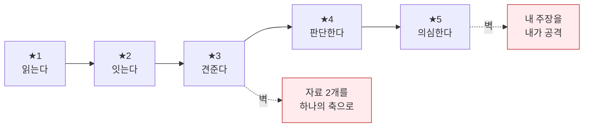

### 3-2. 소재: "이차함수" (수학 버전)

| ★ | 문항 | 필요한 새 능력 |
|:--:|---|---|
| **★1** | 꼭짓점의 좌표를 **구하는 과정**을 쓰시오. | 절차 서술 |
| **★2** | 그래프가 위로 볼록인 **이유**를 계수와 관련지어 쓰시오. | 근거 부착 |
| **★3** | k 값이 변할 때 그래프가 **어떻게 달라지는지** 두 경우를 비교해 서술하시오. | 경우 비교 |
| **★4** | x축과 두 점에서 만날 조건을 **판별식으로 구하고**, 그 조건의 의미를 설명하시오. | 조건 + 의미 |
| **★5** | 이 함수로 실제 현상을 모형화할 때 **어긋날 수 있는 지점**을 지적하고 보완 방향을 쓰시오. | 모델 한계 |

### 3-3. 학년이 올라가면 무엇이 추가되는가 — 누적 구조

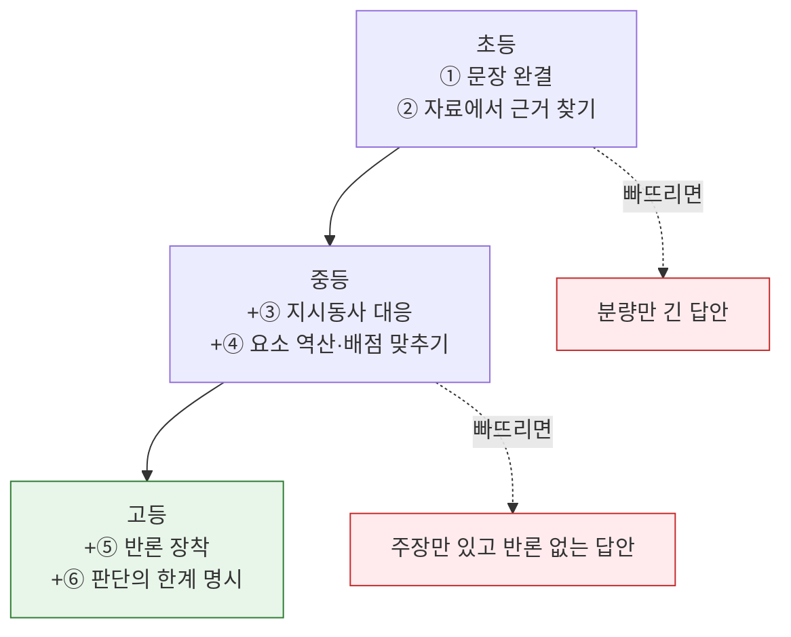

> 📌 **누적이지 대체가 아닙니다.** 고3이 ★5 문항에서 실점하는 이유의 다수는 ⑤⑥을 몰라서가 아니라 **①②(문장 완결·자료 근거)가 흔들려서**입니다. 4장 레벨 진단이 이 지점을 잡아냅니다.

---
# 파트 Ⅱ · 전략

---

## 4. 6단계 레벨 로드맵 (L0 → L5)

> **학년이 아니라 레벨로 공부합니다.** 고3이 L1에 있을 수 있고 초6이 L3에 있을 수 있습니다. 먼저 진단하고, 자기 레벨의 훈련만 합니다. **건너뛰면 반드시 되돌아옵니다.**

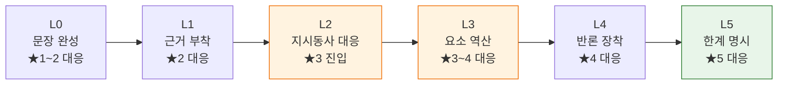

### 4-1. 레벨 진단표 — 지금 어디에 있는가

**진단 방법**: 2장에서 **자기 학년의 ★3 문항 3개**를 풀고, 아래 표의 위에서부터 확인합니다. 하나라도 ✗면 거기가 당신의 레벨입니다.

| 확인 항목 | ✗이면 | 
|---|:--:|
| 모든 문장이 주어–서술어를 갖추고 끝맺는가 | **L0** |
| 모든 주장에 근거가 붙어 있고, 그 근거가 **자료·본문 안**에 있는가 | **L1** |
| 지시동사(설명/비교/판단)에 맞는 **행동**을 했는가 | **L2** |
| 배점에 맞는 **요소 개수**를 채웠는가 (8점=4요소 등) | **L3** |
| ★4 이상 문항에 **반론 문장**이 있는가 | **L4** |
| 결론에 **판단이 달라질 조건**이 명시되어 있는가 | **L5 도달** |

### 4-2. 레벨별 훈련 명세

| 레벨 | 이름 | 목표 | 핵심 훈련 | 기간 | 통과 기준 |
|:--:|---|---|---|:--:|---|
| **L0** | 문장 완성기 | 한 문장을 끝까지 쓴다 | 매일 **한 문장 요약** 3개. 소리 내어 읽고 어색하면 다시 | 2~3주 | 10문장 중 **9개 완결** |
| **L1** | 근거 부착기 | 모든 주장에 근거를 붙인다 | 답안마다 "왜냐하면"을 **강제 삽입**. 근거에 자료 번호 표기 | 3~4주 | 근거가 자료 안에 있는 비율 **8/10** |
| **L2** | 지시동사 대응기 | 요구받은 행동을 한다 | 지시동사 **5종 템플릿 암기** → 문항 20개에 첫 문장만 쓰기 | 3~4주 | 지시동사별 첫 문장 **무오류** |
| **L3** | 요소 역산기 | 배점만큼 쓴다 | 배점 → 요소 개수 → 여백 목록 → 요소당 1문장 | 4~6주 | 배점·요소 매칭 **8/10** |
| **L4** | 반론 장착기 | 내 주장을 내가 공격한다 | 모든 ★4 답안에 **"물론 ~반론이 가능하다"** 삽입 후 재반박 | 6~8주 | ★4 문항 **전부에 반론 존재** |
| **L5** | 한계 명시기 | 판단의 조건을 밝힌다 | 결론부에 **"다만 ~라면 판단이 달라진다"** 1문장 + 대안 관점 | 상시 | ★5 문항에서 조건 진술 **일관 등장** |

### 4-3. 레벨별 흔한 정체 원인과 처방

| 레벨 | 정체 신호 | 진짜 원인 | 처방 |
|:--:|---|---|---|
| L0 | 말로는 아는데 못 씀 | 문장 길이 욕심 | **짧게 끊어 쓰기.** 한 문장 25자 제한 |
| L1 | 근거를 쓰는데 점수가 안 오름 | 근거가 **상식**이지 자료가 아님 | 자료에 번호 매기고 **번호를 답안에 인용** |
| L2 | 아는 내용을 다 썼는데 감점 | 지시동사 오독 | 문항 여백에 **요구 행동 한 단어** 적기 |
| L3 | 길게 쓰는데 절반만 받음 | 요소 중복·누락 | **요소 목록을 먼저** 쓰고 체크하며 작성 |
| L4 | 반론을 썼는데 점수 없음 | 반론을 **언급만** 하고 답 안 함 | 반론 뒤 반드시 "그러나 ~" 한 문장 |
| L5 | 상위권인데 만점이 안 나옴 | 결론이 단정적 | **조건화 문장** 1개 추가 (AP '정교성' 1점과 동일) |

### 4-4. 레벨 × 학년 정상 분포

| 학년 | 정상 범위 | 경고 신호 |
|---|---|---|
| 초 3~4 | L0 ~ L1 | L0 미만(문장 미완성) |
| 초 5~6 | L1 ~ L2 | L0에 머무름 |
| 중 1~2 | L2 ~ L3 | L1 이하 |
| 중 3 | L3 | L2 이하 |
| 고 1 | L3 ~ L4 | L2 이하 |
| 고 2~3 | L4 ~ L5 | L3 이하 |

> ⚠️ **레벨 건너뛰기의 대가**: L1(근거 부착)이 안 된 채 L4(반론) 훈련을 시키면, **근거 없는 주장에 근거 없는 반론을 붙인 답안**이 나옵니다. 분량은 늘지만 점수는 그대로입니다. 학원 선택 시 **"우리 아이가 몇 레벨인지 말해 달라"**고 물어보는 것이 가장 빠른 검증입니다.

---

## 5. 12주 훈련 사이클

> 한 학기(약 16주)에 **12주 훈련 + 시험 4주**가 들어갑니다. 이 사이클을 학기마다 반복하며 레벨을 하나씩 올립니다.

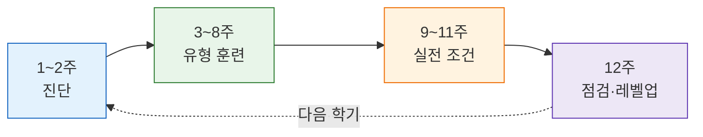

### 5-1. 주차별 계획

| 주차 | 단계 | 할 일 | 산출물 |
|:--:|---|---|---|
| **1** | 진단 | 2장에서 내 학년 ★3 문항 3개 풀기 → 4-1 표로 레벨 판정 | 레벨 판정서 |
| **2** | 진단 | 지난 학기 서술형 답안 전부 꺼내 **감점 사유 6분류**(1-5절) | 감점 분포표 |
| **3~4** | 유형 | 내 레벨의 핵심 훈련 (4-2 표) + ★1~2 문항 주 5개 | 답안 20편 |
| **5~6** | 유형 | ★3 문항 주 4개. **RULE 6단계를 매번 손으로** 표시하며 | 답안 16편 |
| **7~8** | 유형 | 약점 과목 집중 — 감점 분포표 1위 유형만 | 답안 12편 |
| **9~10** | 실전 | **시간 제한** 적용 (8장 타임박스). ★4 문항 주 3개 | 답안 12편 |
| **11** | 실전 | 지필 범위 내 **예상 문항 자작** 5개 + 자기 채점기준 작성 | 자작 문항 5개 |
| **12** | 점검 | 1주차 답안 **재작성** → 비교 → 레벨 재판정 | 레벨 재판정서 |

> 💡 **11주차 '자작 문항'이 가장 효율이 높습니다.** 출제자의 자리에 서 보면 "무엇이 채점 요소가 되는가"가 몸으로 이해됩니다. 교사가 만든 채점기준과 자기가 만든 것을 비교하면 격차가 보입니다.

### 5-2. 과목 배분 (주당 총 시간 기준)

| 학교급 | 총 시간/주 | 국어 | 수학 | 사회 | 과학 | 영어 |
|---|:--:|:--:|:--:|:--:|:--:|:--:|
| 초등 | **40분** | 15분 | 10분 | 8분 | 7분 | — |
| 중등 | **100분** | 25분 | 30분 | 20분 | 15분 | 10분 |
| 고등 | **150분** | 35분 | 45분 | 30분 | 25분 | 15분 |

> 📌 **초등에 영어 서술형 시간이 없는 이유**: 초등 영어는 서·논술형 비중이 낮고, **모국어 문장 완결력(L0~L1)이 먼저**입니다. 국어가 되면 영어 서술형은 형식만 익히면 됩니다.

---

## 6. 학교급별 학기 플랜

### 6-1. 초등학교

**상황** — 전남광주 기준 **2027년 3월 초5·6 선도 적용** 시작, 2032 전면화 목표. 경기·서울은 AI 서·논술형 평가를 초등까지 확대 중. 그러나 **초등 수학 검정교과서 평가자료의 92.5%가 "풀이 과정과 답을 쓰시오"** 한 유형에 몰려 있어, **비교·오류·한계·대안 해석 유형은 학교에서 거의 경험하지 못합니다.**

**목표 역량 — 딱 3가지**

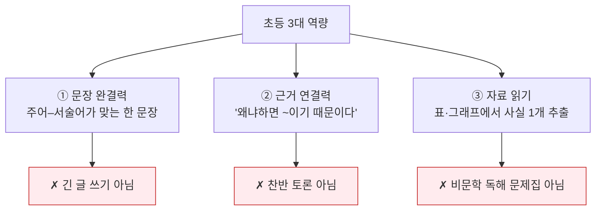

**학기 캘린더**

| 시기 | 할 일 | 문항 (2장 참조) |
|---|---|---|
| 3월 | 학교알리미에서 **평가계획 확인** · 레벨 진단 | 국어 5·6번, 수학 4·5번 |
| 4~5월 | L0~L1 훈련 (한 문장 요약 + 왜냐하면) | 국어 1~5번, 사회 1~3번 |
| 6월 | 자료 읽기 집중 — 그래프·표 1일 1개 | 수학 7~9번, 과학 5번 |
| 7월 | 학기말 평가 대비: **조건 지키기** 연습 | 각 과목 6~8번 |
| 9~10월 | L2 진입 — 비교·오류 찾기 | 수학 4·5번, 국어 6번 |
| 11~12월 | 제안·반론 맛보기 (강요 ✗) | 국어 9·10번, 사회 9·10번 |

**주간 루틴 (사교육 없이, 주 40분)**

| 요일 | 활동 | 시간 |
|---|---|:--:|
| 월 | **한 문장 요약** — 읽은 책/교과서 한 쪽을 한 문장으로 | 5분 |
| 수 | **왜냐하면 훈련** — 그날의 선택 하나에 이유 2개 붙여 말하고 쓰기 | 10분 |
| 금 | **오류 찾기** — 틀린 문제를 "왜 틀렸는지" 문장으로 기록 (정답 다시 쓰기 ✗) | 10분 |
| 주말 | **자료 한 개 읽기** — 뉴스 그래프/영양성분표에서 사실 1개 + 의견 1개 | 15분 |

> ⚠️ **가장 흔한 실패**: 초등 저학년에게 '논술'을 시키는 것. **7세가 비문학 독해 문제집을 푸는** 현상이 이미 문제로 지적되고 있고, 서울 강남구 학원 3곳 중 **1곳(29.9%)** 이 논·서술형 프로그램을 운영합니다. **분량을 늘리는 습관은 중등에서 조건 미준수 감점으로 바뀝니다.**

**학부모 체크리스트**
- [ ] 학교 **평가계획**을 학기 초에 확인했는가 (→ [학교알리미](https://www.schoolinfo.go.kr/))
- [ ] 아이가 **틀린 문제의 이유를 말로 설명**할 수 있는가
- [ ] 답안에 **"왜냐하면"이 등장**하는가
- [ ] **조건(문장 수·형식)을 지키는** 연습을 하는가
- [ ] 논술 학원 등록 전에 **학교 서술형 답안 3개를 직접 읽어봤는가**

---

### 6-2. 중학교

**상황** — **2026학년도 지침이 직접 적용되는 구간입니다.** 중학교 지필평가에 논술형 일정 비율 포함 의무, 교과별 학기당 논술형 **30% 이상**, 수행평가 상한 40%→30%. 전남광주 기준 중1은 자유학기제 1학기에 체계를 마련해 **2학기부터 전면 적용**. MYP 운영교 94교로 IB 접점도 가장 넓습니다.

**핵심 역량 — 지시동사 대응 (L2)**

| 지시동사 | 요구 행동 | 답안 첫 문장 템플릿 |
|---|---|---|
| **쓰시오 / 찾아 쓰시오** | 확인 | "~이다." (단정) |
| **설명하시오** | 인과 연결 | "~이기 때문에 ~이 된다." |
| **비교하시오** | 공통점+차이점 | "둘 다 ~이지만, A는 ~인 반면 B는 ~이다." |
| **분석하시오** | 요소 분해 | "이 자료는 ~와 ~의 두 요소로 나뉘는데," |
| **판단하고 근거를 쓰시오** | 입장+정당화 | "나는 A라고 판단한다. 근거는 두 가지이다. 첫째, ~" |
| **평가하시오** | 판단+반론+한계 | "A는 ~점에서 효과적이나, ~점에서는 한계가 있다." |

**학기 캘린더**

| 시기 | 할 일 | 문항 (2장 참조) |
|---|---|---|
| 3월 | 평가계획·**논술형 반영 비율** 확인 · 레벨 진단 | 각 과목 3~5번 |
| 4월 | L2 훈련 — 지시동사 템플릿 6종 암기 | 국어 1·2번, 사회 1·2번 |
| 5월 | **1차 지필 대비**: 배점→요소 역산 반복 | 수학 1~3번, 과학 1~3번 |
| 6월 | 시험 직후 **오답 재작성** (7장 프로토콜) | 감점 상위 유형만 |
| 7월 | 수행평가 대비 — 조건 작문·실험 설계 | 국어 8번, 과학 7번 |
| 9~10월 | L3 진입 — 요소 역산 자동화 | 각 과목 6~8번 |
| 11~12월 | L4 맛보기 — 반론 문장 삽입 훈련 | 국어 10번, 사회 7·10번 |

**주간 루틴 (주 100분)**

| 빈도 | 활동 |
|---|---|
| 주 2회 | 교과서 소단원 하나를 **5문장 요약** (개념어 3개 필수 포함) |
| 주 1회 | 오답 1문항을 **채점기준 대조 후 재작성** |
| 주 1회 | 뉴스/자료 1개 → **사실 2 + 해석 1 + 반론 1** 구조로 정리 |
| 시험 전 | 지난 시험 서술형 답안 전부 다시 읽기 (새 문제 ✗) |

**절대 하지 말아야 할 것**

| ❌ 하지 말 것 | 이유 |
|---|---|
| 모범답안 통째로 암기 | 자료가 바뀌면 0점. AI 초벌은 형식 유사성에 속아도 **교사 확정에서 걸러짐** |
| 분량 늘리기 | 조건 미준수 감점. IB History의 "조건 위반 시 상한 강제 하향"과 같은 원리 |
| 미사여구·수식어 추가 | 채점 요소가 묻힘 |
| 답안을 한 문단으로 뭉치기 | 채점자가 요소를 못 찾음 → **요소마다 문장 분리** |

---

### 6-3. 고등학교

**상황** — **현 고1~고3은 2028 수능 체제로, 서·논술형 수능과 무관**합니다. 그러나 내신은 이미 교과별 학기당 논술형 **30% 이상**이 적용됩니다. 국민참여위에서도 **고교 내신 서·논술형 확대 찬성이 72.8%** 로 수능(55.5%)보다 훨씬 높았습니다. 전남광주는 고교를 당분간 제외해 **지역 편차가 큽니다.**

**이중 트랙**

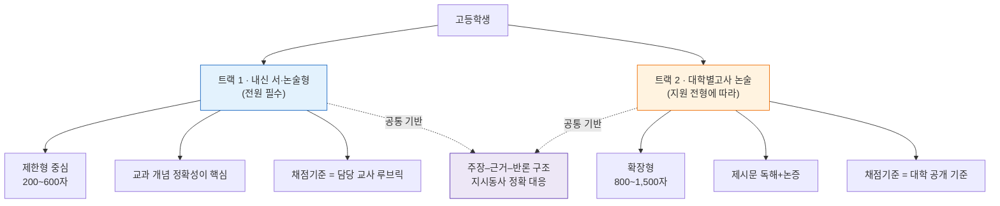

**학기 캘린더**

| 시기 | 할 일 | 문항 (2장 참조) |
|---|---|---|
| 3월 | 과목별 **논술형 반영 비율·채점기준 사전 안내** 확인 | 각 과목 1~2번 |
| 4월 | L3 점검 — 배점 역산 자동화 | 수학 4번, 과학 4·5번 |
| 5월 | **1차 지필**: 제한형 200~400자 템플릿 숙달 | 국어 4·5번, 사회 1·2번 |
| 6월 | 오답 재작성 + **개념어 정의 노트** 구축 | 감점 D유형 집중 |
| 7월 | 수행평가 — 탐구보고서·소논문 (자매 문서 9장) | 과학 9번, 사회 8번 |
| 9~10월 | L4 — 반론·재반박 삽입 자동화 | 국어 9번, 사회 7·9번 |
| 11~12월 | L5 — 결론부 **조건화 문장** 훈련 | 국어 7·8번, 사회 10번, 과학 10번 |
| (논술 전형 지원자) | 9월~ 주 1편 확장형 + 대학별 기출·채점기준 대조 | 국어 7·8·10번 |

**답안 설계 템플릿**

**① 제한형 (200~400자) — 요소 배치형**

```
[1문장] 결론/판단 먼저 제시
[2~3문장] 근거 1 — 자료에서 직접 인용 + 해석
[2~3문장] 근거 2 — 개념어 사용
[1문장] 결론 재확인 (조건 충족 확인)
```

**② 확장형 (800자 이상) — 논증 구조형**

```
[도입] 쟁점 규정 — 질문을 다시 쓰지 말 것 (AP DBQ 논제 0점 사유)
[본론1] 관점 A의 핵심 전제와 근거
[본론2] 관점 B의 핵심 전제와 근거 + 두 관점이 갈라지는 지점 명시
[본론3] 내 입장 + 구체적 사례 1개 + 반론 인식 및 재반박
[결론] 판단의 조건·한계 명시  ← 여기가 상위 등급 진입점
```

> 💡 **상위권이 가장 많이 놓치는 것**: [AP DBQ 루브릭](<./(서논술형)-논술형_IB_기출문항_자료지도.md>)의 **'정교성(Complexity)' 1점** — 반증·모순·다양한 관점의 인정. 국내 확장형 루브릭의 '논증 구성 5점'도 같은 지점을 봅니다. **결론에서 "다만 ~인 경우에는 판단이 달라질 수 있다"를 한 문장 넣는 것**만으로 등급이 움직입니다.

**시험 전 체크리스트**
- [ ] 담당 교사가 **채점기준표를 사전 안내**했는가 (안 했다면 요청 — 사전 확정이 원칙)
- [ ] 지난 시험의 **감점 사유를 6분류**했는가
- [ ] **조건(분량·문장 수·인용 수)** 을 먼저 세고 쓰는 습관이 있는가
- [ ] 개념어를 **정의째로** 쓸 수 있는가 (개념어 부정확은 제한형 최대 실점)
- [ ] 논술 전형 지원 시, **해당 대학의 기출·채점기준·해설**을 확인했는가

---

### 6-4. 학교급 종합 대조표

| 축 | 초등 | 중등 | 고등 |
|---|---|---|---|
| **정책 압력** | 2027 선도 적용 (지역별) | **2026 지침 직접 적용** | 내신 적용 / 수능 무관 |
| **목표 레벨** | L0 → L2 | L2 → L3(→L4) | L3 → L5 |
| **주력 난이도** | ★1~★4 | ★2~★5 | ★3~★5 |
| **주력 문항** | 사실 추출·까닭 서술 | 자료 해석·오류 설명·조건 논증 | 관점 비교·입장 정립·비판적 검토 |
| **분량** | 1~5문장 | 3문장~400자 | 400~1,200자 |
| **주된 실점 원인** | 문장 미완성 | 지시동사 오독·조건 위반 | 개념어 부정확·정교성 부재 |
| **채점 방식** | 3단계 루브릭 | 요소별 배점 + AI 보조 | 요소별 + 총체적 혼합 |
| **주당 훈련** | 40분 | 100분 | 150분 |
| **하지 말 것** | 선행 논술 사교육 | 모범답안 암기 | 분량 채우기 |
| **수능 서·논술형 관련성** | **높음** (2037~ 응시 세대) | **중간** | **없음** |

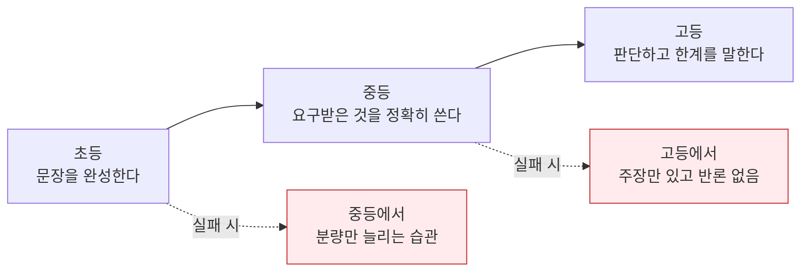

---
## 7. 오답 재작성 프로토콜 & 자가채점 루브릭

> **새 문제를 푸는 것보다 틀린 문제를 다시 쓰는 것이 5배 빠릅니다.** 서·논술형은 지식이 아니라 **행동 습관**이 점수를 만들기 때문입니다.

### 7-1. 오답 재작성 5단계

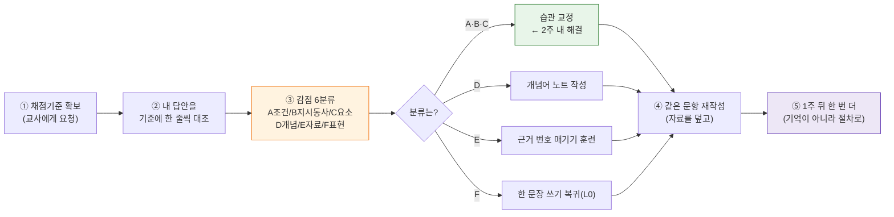

**④ 재작성 규칙**
- 원래 답안을 **보지 않고** 다시 씁니다 (고치는 게 아니라 다시 씀)
- RULE 6단계를 **손으로 표시**하며 씁니다
- 재작성본과 원본을 나란히 두고 **무엇이 달라졌는지 한 줄로** 기록

**⑤ 1주 뒤 재시도의 의미**: 바로 다시 쓰면 기억으로 씁니다. 1주 뒤에도 같은 구조가 나오면 **절차가 몸에 붙은 것**입니다.

### 7-2. 감점 분포표 — 학기마다 갱신

| 분류 | 1차 지필 | 2차 지필 | 기말 | 추세 |
|---|:--:|:--:|:--:|:--:|
| A 조건 위반 | | | | |
| B 지시동사 오독 | | | | |
| C 요소 누락 | | | | |
| D 개념 부정확 | | | | |
| E 자료 미사용 | | | | |
| F 표현·비문 | | | | |

> 💡 **A·B·C의 합이 전체의 60% 이하로 내려가면 레벨업 신호입니다.** 그 시점부터 D(개념)가 1위가 되는데, 그건 **정상적인 교과 학습의 문제**이지 서·논술형의 문제가 아닙니다.

### 7-3. 범용 자가채점 루브릭 (10점)

> 어떤 과목·학년의 답안이든 이 표로 스스로 채점할 수 있습니다. **8점 이상이면 그 문항은 통과**입니다.

| 기준 | 2점 | 1점 | 0점 |
|---|---|---|---|
| **① 조건 충족** | 분량·형식·개수 조건을 모두 지킴 | 일부 미충족 | 조건 무시 |
| **② 지시동사 대응** | 요구된 행동을 정확히 수행 | 일부만 수행(예: 비교 중 한쪽만) | 다른 행동을 함 |
| **③ 근거의 출처** | 근거가 모두 자료·본문 안에 있고 인용됨 | 일부만 자료 기반 | 상식·추측으로 서술 |
| **④ 요소 완결** | 배점에 맞는 요소를 빠짐없이, 요소당 한 문장 | 요소 일부 누락 또는 중복 | 요소 구분 없음 |
| **⑤ 표현** | 모든 문장이 완결되고 개념어가 정확 | 오류가 있으나 소통 가능 | 비문·미완성 다수 |

**★4 이상 문항은 아래 가점 항목을 추가** (총 14점 만점으로 환산)

| 가점 기준 | 2점 | 1점 | 0점 |
|---|---|---|---|
| **⑥ 반론 처리** | 반론 제시 + 재반박까지 완결 | 반론 언급만 | 없음 |
| **⑦ 한계 명시** | 판단이 달라질 조건을 구체적으로 제시 | 막연한 유보 표현 | 단정만 |

### 7-4. 교사·학부모용 피드백 문장 템플릿

> "잘했다 / 더 노력하자"는 피드백은 아무것도 바꾸지 않습니다. **분류 + 다음 행동** 두 부분으로 말합니다.

| 상황 | ❌ 흔한 피드백 | ✅ 작동하는 피드백 |
|---|---|---|
| 조건 위반 | "글자 수를 지켜야지" | "분량 조건에 동그라미를 치고 시작하자. 이번엔 3문장 조건에 5문장을 썼어." |
| 지시동사 오독 | "문제를 잘 읽어" | "'비교하시오'였는데 A만 썼어. **첫 문장을 '둘 다 ~이지만'으로 시작**해 보자." |
| 요소 누락 | "더 자세히 써" | "8점이면 요소가 4개야. 여백에 ①②③④를 먼저 적고 채우자." |
| 자료 미사용 | "근거가 부족해" | "자료 (나)의 두 번째 줄을 그대로 인용하고 해석을 붙이면 2점이 올라가." |
| 반론 없음 | "논리가 약해" | "'물론 ~라는 반론이 가능하다'를 한 문장 넣고, 그다음에 '그러나'로 답해 보자." |

> 📌 **채점기준은 담당 교사가 만들고 사전에 확정합니다.** 그 기준을 확보해 자기 답안과 대조하는 것이, 외부 지문으로 하는 어떤 훈련보다 정확하고 저렴합니다.

---

## 8. 시험장 타임박스

> 서·논술형에서 시간 배분 실패는 **실력 문제가 아니라 설계 문제**입니다. 분량이 아니라 **단계에 시간을 배분**합니다.

### 8-1. 문항 하나당 타임박스

| 총 시간 | ① 조건 표시 | ② 지시동사 | ③ 근거 표시 | ④ 요소 역산 | ⑤ 작성 | ⑥ 검산 |
|:--:|:--:|:--:|:--:|:--:|:--:|:--:|
| **5분** (★1~2) | 15초 | 15초 | 45초 | 30초 | 3분 | 15초 |
| **10분** (★3) | 30초 | 30초 | 1분 30초 | 1분 | 6분 | 30초 |
| **20분** (★4) | 1분 | 30초 | 3분 | 2분 | 12분 | 1분 30초 |
| **40분** (★5) | 2분 | 1분 | 6분 | 4분 | 24분 | 3분 |

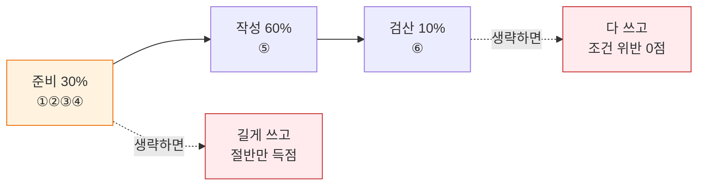

> 💡 **준비에 30%를 쓰는 것이 핵심입니다.** 대부분의 학생은 문항을 읽자마자 쓰기 시작해 **④ 요소 역산을 건너뛰고**, 결과적으로 분량은 채우되 요소는 빠뜨립니다.

### 8-2. 시간이 부족할 때의 우선순위

| 남은 시간 | 버릴 것 | 지킬 것 |
|---|---|---|
| 절반 | 예시·부연 설명 | **결론 + 근거 2개** |
| 1/3 | 근거 2 | **결론 + 근거 1 + 조건 충족** |
| 거의 없음 | 서술 | **결론 한 문장 + 근거 한 마디** |

> 📌 **백지보다 한 문장이 낫습니다.** 요소별 배점이므로 **결론 문장 하나만으로도 1~2점**이 나옵니다. 완성도를 이유로 아무것도 안 쓰는 것이 가장 큰 손실입니다.

### 8-3. 실전 3대 실수

| 실수 | 증상 | 예방 |
|---|---|---|
| **앞 문항 과투자** | 1번에 20분 쓰고 뒷문항 백지 | 문항별 **시계 시각을 미리 적어 둠** |
| **조건 뒤늦은 발견** | 다 쓰고 나서 "3문장 이내"를 봄 | ① 단계에서 **동그라미** |
| **자료 미사용** | 머릿속 지식으로만 씀 | ③ 단계에서 자료에 **번호부터** |

---
# 파트 Ⅲ · 배경 — 왜 이런 문제가 나오는가

> 파트 Ⅰ·Ⅱ만으로 실행은 충분합니다. 이 파트는 **근거를 확인하고 싶을 때** 보는 자료입니다.

---

## 9. 【사실】 2026년 9월 현재 상황 팩트시트

### 9-1. 국가교육위원회 공론화 결과 (2026.09.17 발표)

2026년 8월 29~30일 경기 화성 YBM연수원에서 국민참여위원 180명이 1박 2일 숙의토론을 진행했고, 그 결과가 제10차 국교위 회의에서 보고되었습니다.

| 항목 | 숙의 전 | 숙의 후 | 변화 |
|---|:--:|:--:|:--:|
| 수능 서·논술형 도입 **필요** | 58.3% | **55.5%** | ▼2.8%p |
| 고교 내신 서·논술형 확대 **필요** | 76.1% | **72.8%** | ▼3.3%p |

> 📌 **읽어야 할 신호**: 토론을 **깊이 할수록 찬성이 줄었습니다.** "방향은 옳지만 실행이 어렵다"는 인식이 숙의 과정에서 강화되었다는 뜻이고, 곧 **전면 도입이 아닌 제한적·단계적 도입**으로 설계가 기울 수밖에 없음을 의미합니다.

**최대 우려 사항**

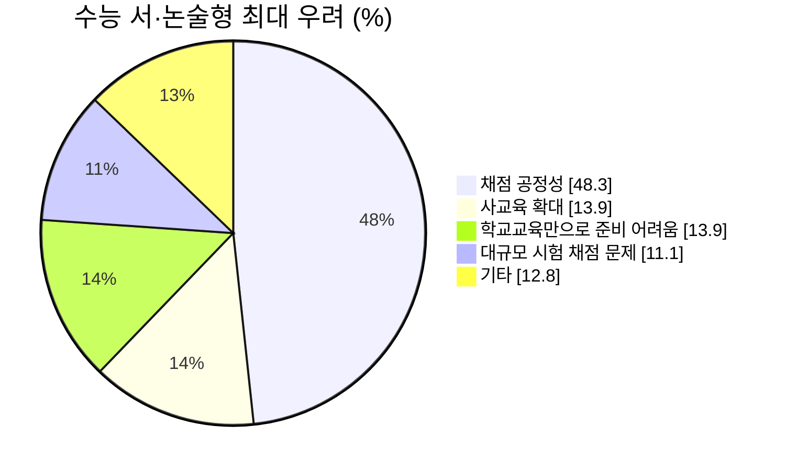

**도입 방식 선호도**

| 방식 | 비율 | 해석 |
|---|:--:|---|
| 일부 영역 도입 후 확대 | **36.7%** | 최다 — 단계론이 주류 |
| 일부 영역에만 도입 | 30.0% | 제한 유지론 |
| 전 영역 도입 | **5.5%** | 사실상 배제 |
| 반대/기타 | 27.8% | |

**도입 시기**: 2037~2038학년도 수능이 39.4%로 최다, 도입 반대 25.0%

〔출처〕 [뉴스핌 숙의 결과](https://www.newspim.com/news/view/20260917000700) · [서울신문](https://www.seoul.co.kr/news/society/education-news/2026/09/17/20260917500163) · [SBS Biz](https://biz.sbs.co.kr/article/20000335239) · [머니투데이(비판적 시각)](https://www.mt.co.kr/policy/2026/09/17/2026091710591484777)

### 9-2. 정책 추진 일정

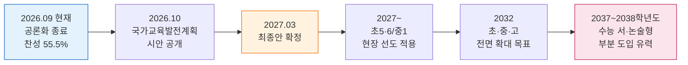

| 시점 | 내용 |
|---|---|
| 2026.08 | 국교위 대입특위, 내신·수능 절대평가 전환 + 수능 서·논술형 도입 검토 착수 |
| 2026.08.29~30 | 국민참여위원회 숙의토론회 (180명, 1박 2일) |
| 2026.09.17 | 제10차 국교위 회의 — 숙의 결과 보고, **"공정성 검증 우선"** 기조 확인 |
| **2026.10 말** | **「2028~2037 국가교육발전계획」 시안 공개** ← 가장 중요한 분기점 |
| 2026.10~2027.02 | 대국민 의견수렴 |
| **2027.03 말** | **최종안 확정** |

〔출처〕 [국교위 업무보고](https://www.newspim.com/news/view/20260805000395) · [이데일리](https://edaily.co.kr/News/Read?mediaCodeNo=257&newsId=04956086645544368) · [MBC](https://imnews.imbc.com/news/2026/society/article/6842663_36918.html)

### 9-3. 2028학년도 수능은 이미 확정 — 서·논술형 없음

혼동이 잦은 지점입니다. **2028 수능 개편은 "통합형"이지 "논술형"이 아닙니다.**

| 영역 | 2028학년도 구조 | 서술형 요소 |
|---|---|---|
| 국어 | 45문항 80분 · 화법과 언어 / 독서와 작문 / 문학 공통 | ✗ |
| 수학 | 30문항 100분 · **단답형 9문항 포함** · 대수/미적분Ⅰ/확률과통계 | △ 단답형만 |
| 영어 | 45문항 70분 (듣기 17) | ✗ |
| 탐구 | **통합사회·통합과학** 각 25문항 40분, 배점 1.5/2/2.5점 차등 | ✗ |

> 즉 **현 고1~고3은 서·논술형 수능과 무관**합니다. 영향권은 **현 초등~중1**입니다.

〔출처〕 [교육부 2028 대입개편](https://www.moe.go.kr/boardCnts/viewRenew.do?boardID=294&boardSeq=97551&lev=0&s=moe&m=020402) · [정책브리핑](https://www.korea.kr/news/policyNewsView.do?newsId=148938778) · [한국대학신문](https://news.unn.net/news/articleView.html?idxno=574018) · [EBSi 2028 수능 체제 개편](https://www.ebsi.co.kr/ebs/pot/potg/retrieveSeriesSubjectList.ebs?seriesGrpId=PKG_0370&seriesId=PRO_1881)

### 9-4. 내신은 **이미** 바뀌었다 — 2026학년도 지침

| 변경 항목 | 이전 | 2026학년도 |
|---|:--:|:--:|
| 교과별 수행평가 비율 상한 | 40% | **30%** |
| 중·고 교과별 학기당 **논술형 평가 비율** | 권고 없음/낮음 | **30% 이상** |
| 중학교 지필평가 | 선택형 중심 | **일정 비율 논술형 포함 의무** |
| "수행평가를 논술형만으로 시행 불가" 지침 | 존재 | **삭제** |

> 📌 **이것이 진짜 게임 체인저입니다.** 수능은 10년 뒤 이야기지만, **학기당 논술형 30% 이상**은 지금 학기에 성적표로 돌아옵니다.

〔출처〕 [중고생 수행·논술형 평가 비율 30% 이상 조정](https://v.daum.net/v/20260223174853619) · [경기도교육청 대입개혁 연구 추진현황 PDF](https://www.goe.go.kr/resource/goe/na/bbs_2675/2025/11/6b926081-60e5-4d74-8ea6-c11f9a368dd4.pdf)

### 9-5. 시·도교육청별 선도 움직임

| 교육청 | 핵심 정책 | 대상 | 비고 |
|---|---|---|---|
| **전남광주특별시교육청** | 서술·논술형 평가 도입, 일부 과목 **객관식 100% 폐지** 실험 | 초5·6, 중1 | 2027.03 시작 → **2032 전면화** 목표. 고교는 당분간 제외. 교사 부담 경감 위해 '교육과정개발평가원' 설립·AI 활용 검토 |
| **경기도교육청** | **AI 서·논술형 평가** 전 교과 확대 (2025 국어·사회·과학 → 2026 수학·영어 추가) | 초·중·고 | 연구학교 15교 + 실천학교 25교로 '경기형 AI 서·논술형 평가 모델' 구축. 선도교원 350명 → 일반교원 5,000명 연수, 7,500명 방문 컨설팅 |
| **서울특별시교육청** | **채움AI**(AI 서·논술형 평가 지원 시스템) 구축 + **S-PLAN** 문해력·수리력 진단 | 초·중·고 | AI 기반 평가 실천학교 2025년 66교 → **2026년 110교** |

〔출처〕 [전남광주 초5·6·중1 도입](https://www.kpinews.kr/newsView/1065589851088910) · [전남인뉴스](https://www.jninnews.com/news/articleView.html?idxno=41266) · [경기 AI 서·논술형 전 교과 확대](https://www.newspim.com/news/view/20260414000378) · [서울신문 경기교육청](https://www.seoul.co.kr/news/society/education-news/2026/04/14/20260414500056) · [2026 서울교육 주요정책](https://www.newsis.com/view/NISX20260127_0003492367) · [서울교육 주요업무 2026 PDF](https://www.sen.go.kr/resources/www/data/policydata1_9_1.pdf)

### 9-6. IB 확산 — 서·논술형의 '실물 모델'

| 구분 | 2024.09 | 2026.07 | 증가 |
|---|:--:|:--:|:--:|
| IB 월드스쿨(인증) | 34교 | **126교** | 3.7배 |
| 후보학교 | 61교 | **143교** | 2.3배 |
| 합계 | 95교 | **269교** | **2.8배** |
| 관심학교 | — | 423교 | — |

프로그램별: **PYP 122교 · MYP 94교 · DP 53교**
지역별: **대구**(월드스쿨 41 + 후보 27) 최다, **경기**(34 + 30) 급성장, **서울**은 2026 관심학교 91교 신규 선정해 총 106교 운영

> 📌 2장 문항 중 **사회 중3 8번(출처·목적·가치·한계), 고2 7번(두 지역 조건), 과학 고2 4·5·7번(대괄호 배점)** 이 IB·AP 형식의 직접 이식형입니다.

〔출처〕 [미디어제주 IB 269개교](https://www.mediajeju.com/news/articleView.html?idxno=365190) · [서울 IB 관심학교 91곳](https://www.etoday.co.kr/news/view/2575086) · [경기교육청 IB 전면 확산](https://m.news.nate.com/view/20260218n08034) · [충청북도교육청 IB 포털](https://www.cbe.go.kr/ib/main.do)

---

## 10. 【예측】 수능 서·논술형은 어떤 모습일까

### 10-1. 예측은 '희망'이 아니라 '제약 조건'에서 나온다

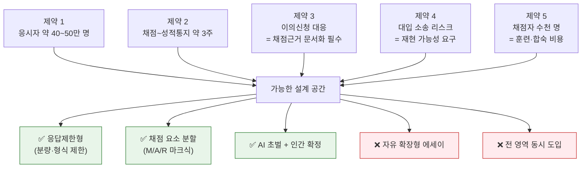

**일본의 실패가 결정적 참고 사례입니다.** 일본은 대학입학공통테스트에 국어·수학 **기술식(記述式) 문항**을 도입하려 했으나, 연 50만 명 규모 답안의 채점 현실성과 채점 불신에 부딪혀 **무산**되었습니다. 한국 응시 규모도 동급이므로 **같은 제약이 같은 결론을 강제**합니다.

> 전문가 제안 요지: 도입 초기에는 **응답 내용·분량을 제한하는 '응답제한형'** 출제가 불가피하며, **AI 초벌 채점 후 인간이 확정**하거나 지원 대학이 점수를 부여하는 방식 등이 거론됩니다.

〔출처〕 [국민일보 '채점 불신'에 좌초한 日 서·논술형 입시](https://www.kmib.co.kr/article/view.asp?arcid=9000003060&code=11131100&sid1=soc) · [뉴시스 수능 대전환②](https://m.news.nate.com/view/20260808n02945) · [뉴시스 수능 대전환①](https://www.newsis.com/view/NISX20260807_0003741020)

### 10-2. 시나리오 3종

| | **A — 최소 도입** | **B — 부분 도입** ★유력 | **C — 전면 전환** |
|---|---|---|---|
| **확률(추정)** | 25% | **55%** | 5% |
| (도입 무산/무기한 연기) | | | 15% |
| 시기 | 2035~2036학년도 | **2037~2038학년도** | — |
| 대상 영역 | 수학 단답형 확대 + 국어 1~2문항 | **국어·수학 + 통합사회/통합과학 각 1~3문항** | 전 영역 |
| 문항당 분량 | 1~2문장 / 풀이 과정 | **3~5문장 또는 150~300자** | 600~1,000자 에세이 |
| 배점 비중 | 영역당 5% 이하 | **영역당 10~20%** | 50% 이상 |
| 채점 | 인간 이중채점 | **AI 초벌 + 인간 이중채점 + 조정채점** | 외부 위탁 대규모 채점단 |
| 성적 처리 | 기존 표준점수에 합산 | **절대평가 등급 or 별도 지표 병기** | 등급제 |

> 🎯 **핵심 예측 (신뢰도 ★★★★☆)**: 수능 서·논술형은 **"논술"이 아니라 "구조화된 단답·서술형"** 으로 들어옵니다. 대학별고사 논술(800~1,200자 에세이)과는 **형태가 전혀 다릅니다.** 2장 문항으로 말하면 **★3~★4 수준**이고, ★5는 들어오지 않습니다.

### 10-3. 무엇이 들어오고 무엇이 안 들어오나

| 문항 특성 | 2장 대응 문항 | 수능 도입 가능성 | 근거 |
|---|---|:--:|---|
| 풀이 과정 서술 (수학) | 수학 고 4번 | **★★★★★** | 이미 단답형 9문항 존재, 채점 객관화 쉬움 |
| 자료 해석 → 인과 서술 | 사회 고 1번 | **★★★★☆** | 정답 요소 명세 가능, 분량 통제 용이 |
| 개념 정의·비교 서술 | 사회 고 2번 | **★★★★☆** | 채점 요소 이산적 |
| 오류 찾기·반례 제시 | 수학 고 5·9번 | **★★★☆☆** | 사고력 측정 우수하나 부분점수 설계 난도 |
| 근거 2개로 주장 정당화 | 사회 고 5번 | **★★★☆☆** | 시나리오 B의 최대 확장선 |
| 찬반 + 반론 재반박 (800자) | 사회 고 3번 | **★★☆☆☆** | 채점 편차 통제 불가 — 대학별고사 영역 |
| 개방형 에세이 (IB TOK형) | — | **★☆☆☆☆** | 총체적 루브릭은 대규모 시험에 부적합 |

### 10-4. 채점 모델 예측 — AI는 어디까지 하나

KICE는 국어·수학·사회·과학·기술 5개 교과 대상 AI 자동채점 모델을 개발하고, 실제 중·고생 답안 **13,652건**으로 성능을 검증했습니다.

| 교과·유형 | AI–교사 채점 상관계수 |
|---|:--:|
| 수학 서술형 | **0.77** (최대) |
| 사회 논술형 | **0.66** |

**결정적 한계**: AI는 **문장 길이·어미의 다양성 같은 형식적 요소에 높은 점수**를 주는 반면, 교사는 **개념 이해도와 논리적 근거의 타당성**을 중시합니다.

KICE의 공식 기조는 **"AI 자동채점은 교사를 대체하는 기술이 아니라 교사의 평가 전문성을 강화하는 지원 도구"** 이며, **설명가능성과 인간 주도성**을 요건으로 제시합니다.

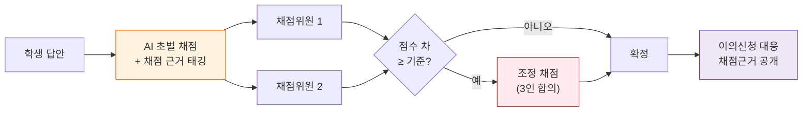

> 💡 이 구조가 **1-4절 'AI 채점을 염두에 둔 답안 작성 원칙'** 의 근거입니다.

〔출처〕 [KICE "AI채점, 교사보다 형식적 요소에 높은 점수"](https://news.nate.com/view/20260419n14624) · [AI 초벌 채점 논의](https://m.news.nate.com/view/20260419n06799) · [전북미래교육신문](https://edujb.com/news/articleView.html?idxno=9035) · [서플](https://supple.kr/news/cmtdgkx2r00183fjilxu1ks3a) · [국어과 서·논술형 수능 평가 문항 개발 방안 연구(KCI)](https://www.kci.go.kr/kciportal/landing/article.kci?arti_id=ART002930135) · [AI 자동채점 기반 평가자 협의 모델(KCI)](https://www.kci.go.kr/kciportal/ci/sereArticleSearch/ciSereArtiView.kci?sereArticleSearchBean.artiId=ART003235709)

---
## 11. 【예측】 수능 영역별 예상 문항

> 시나리오 B(부분 도입, 응답제한형)를 전제로 한 **형식 재현 예시**입니다. 2장 문항과 달리 **수능 출제 형식**에 맞춘 것입니다.

### 11-1. 국어 — "독해의 결과가 아니라 독해의 경로를 쓰게 한다"

**［① 논지 재구성형 (4점, 3문장 이내)］**
> (가)의 필자는 X를 주장하고, (나)의 필자는 이를 비판한다. **(나)가 (가)의 어떤 전제를 겨냥하고 있는지** 밝히고, 그 비판이 성립하기 위해 (나)가 추가로 전제해야 하는 것을 쓰시오. (3문장 이내)
> *채점: 전제 식별(2) + 추가 전제 진술(2) / 문장 수 초과 시 감점*

**［② 어휘·문맥 정밀 서술형 (3점, 1문장)］**
> 밑줄 친 ⓐ가 지문에서 갖는 의미를 **문맥상 근거 한 가지를 포함하여** 한 문장으로 쓰시오.

**［③ 자료 적용형 (5점, 150자)］**
> \<보기\>의 사례가 지문의 이론으로 설명되는지 **판단하고 근거를 제시**하시오. 설명되지 않는다면 이론의 어떤 조건이 충족되지 않는지 쓰시오.

> 🔍 현 수능 국어 고난도 추론 문항을 **선택지만 제거한 형태**입니다. 출제 자산을 그대로 쓸 수 있어 전환 비용이 가장 낮습니다.

### 11-2. 수학 — "이미 절반은 들어와 있다"

**［① 풀이 과정 분할 채점형 (6점)］**
> 함수 f(x)가 조건 (가),(나)를 만족한다. f(3)의 값을 구하는 **과정을 단계별로 서술**하고 답을 쓰시오.
>
> | 채점 단계 | 마크 | 점수 |
> |---|:--:|:--:|
> | 조건 (가)를 식으로 변환 | M1 | 2 |
> | 조건 (나) 적용해 미지수 결정 | M1 | 2 |
> | f(3) 정확히 산출 | A1 | 1 |
> | 결론 진술 | A1 | 1 |

**［② 오류 판정·정정형 (4점)］**
> 다음 풀이에는 한 곳의 오류가 있다. **오류 단계의 번호를 쓰고, 왜 옳지 않은지 반례 또는 이유를 들어** 설명하시오.

**［③ 모델 해석형 (5점)］**
> 위 식에서 **상수 k가 실제 맥락에서 무엇을 의미하는지** 쓰고, k가 커질 때 그래프가 어떻게 변하는지 서술하시오.

> 🔍 **가장 먼저, 가장 크게 들어올 영역**입니다. AI–교사 상관계수 0.77, 이미 단답형 인프라 존재.

### 11-3. 통합사회 — "자료 → 판단 → 근거"

**［① 자료 해석 인과 서술형 (4점, 2문장)］** 자료 (가)의 추세가 (나)에 미친 영향을 **인과가 드러나도록** 두 문장으로 쓰시오.

**［② 개념 적용 판단형 (5점, 150자)］** 사례 X를 '절차적 정의'와 '분배적 정의' 중 **어느 관점으로 설명하는 것이 타당한지 판단**하고, 자료에서 근거 **두 가지**를 들어 쓰시오.

**［③ 반론 인식형 (6점, 200자)］** 정책 A에 대한 찬성 논거 하나를 제시하고, **제기될 수 있는 반론 한 가지**를 쓴 뒤 그에 답하시오. *채점: 논거(2)+반론(2)+재반박(2)*

> 🔍 ③이 **시나리오 B의 상한선**입니다. IB History P2의 반론 요구를 200자로 압축한 형태.

### 11-4. 통합과학 — "실험 설계와 결론의 한계"

**［① 변인 통제 서술형 (4점)］** **통제해야 할 변인 두 가지**를 쓰고, 통제하지 않았을 때 결과 해석에 생기는 문제를 한 문장으로 쓰시오.

**［② 결론의 한계 논증형 (5점, 150자)］** 이 실험 결과만으로 "A가 B의 원인이다"라고 결론 내릴 수 **없는 이유**를 자료에 근거해 쓰시오.

**［③ 그래프 예측·설명형 (5점)］** 조건을 바꾸었을 때 예상되는 그래프 개형을 **간단히 그리고**, 그렇게 판단한 이유를 두 문장으로 쓰시오.

### 11-5. 영어 — 도입 가능성 최하위

| 후보 유형 | 가능성 | 이유 |
|---|:--:|---|
| 요약문 완성 서술형 | ★★★☆☆ | 채점 요소 명세 가능 |
| 한 문장 영작 (조건 제시) | ★★☆☆☆ | 어법 채점 편차 |
| 자유 작문 (100단어 이상) | ★☆☆☆☆ | 대규모 채점 불가 |

### 11-6. 영역별 도입 순서 예측

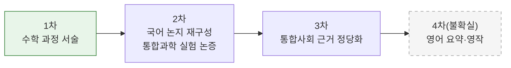

---

## 12. 리스크 — 사교육 함정 피하기

### 12-1. 왜 이 정책이 사교육을 부를 수 있는가

교사노조연맹 송수연 위원장은 "상대평가냐 절대평가냐, 객관식이냐 서·논술형이냐의 문제가 아니다"라며 서·논술형 전환이 **"고액 첨삭과 사교육 시장의 확대로 이어질 가능성"** 을 지적했습니다. 국민참여위 조사에서도 **사교육 확대 우려 13.9%, 학교교육만으로 준비 어려움 13.9%** 가 2·3위 우려였습니다.

현장 신호:
- 학원가에서 **독서·논술·토론 결합 수업이 6~7세부터** 운영 중
- **서울 강남구 학원 3곳 중 1곳(29.9%)** 이 논·서술형 프로그램 운영
- "학교 시험 객관식 사라진다"는 보도에 학부모들이 논술학원을 찾는 현상

### 12-2. 판별 기준 — 이 학원은 도움이 되는가

| ✅ 도움이 되는 신호 | ❌ 위험 신호 |
|---|---|
| **우리 아이가 몇 레벨(L0~L5)인지** 말해 줌 | "논술 실력"처럼 뭉뚱그려 말함 |
| **채점기준표를 먼저 보여주고** 답안을 기준에 대조해 줌 | "모범답안"을 주고 외우게 함 |
| 학생이 **쓴 것을 학생 스스로 고치게** 함 | 강사가 대신 고쳐서 돌려줌 |
| 학교 교육과정·교과서 자료를 사용 | 자체 제작 "논술 전용" 지문만 사용 |
| **분량 제한**을 지키도록 훈련 | 길게 쓰는 것을 실력으로 설명 |
| 초등에 **선행을 권하지 않음** | 미취학·초저 대상 '논술 선행' 강조 |

> 💡 **가장 비용 효율적인 대비는 학교 안에 있습니다.** 채점기준은 **담당 교사가 만들고 사전에 확정**합니다. 그 기준을 확인하고 자기 답안을 대조하는 것(7장)이, 외부 지문으로 하는 어떤 훈련보다 정확합니다.

〔출처〕 [뉴시스 수능 대전환①](https://www.newsis.com/view/NISX20260807_0003741020) · [한국일보 "학원 안 가도 된다고 자신할 수 있나"](https://www.hankookilbo.com/news/article/A2026081315550000589) · [광주드림](https://www.gjdream.com/news/articleView.html?idxno=672665) · [서울신문 세종로의 아침](https://www.seoul.co.kr/news/editOpinion/column/politics-story/2026/08/25/20260825025001) · [교육언론[창]](https://www.educhang.co.kr/news/articleView.html?idxno=9987) · [울산매일](https://www.iusm.co.kr/news/articleView.html?idxno=1066679)

### 12-3. 정책 리스크 — 예측이 빗나갈 경우

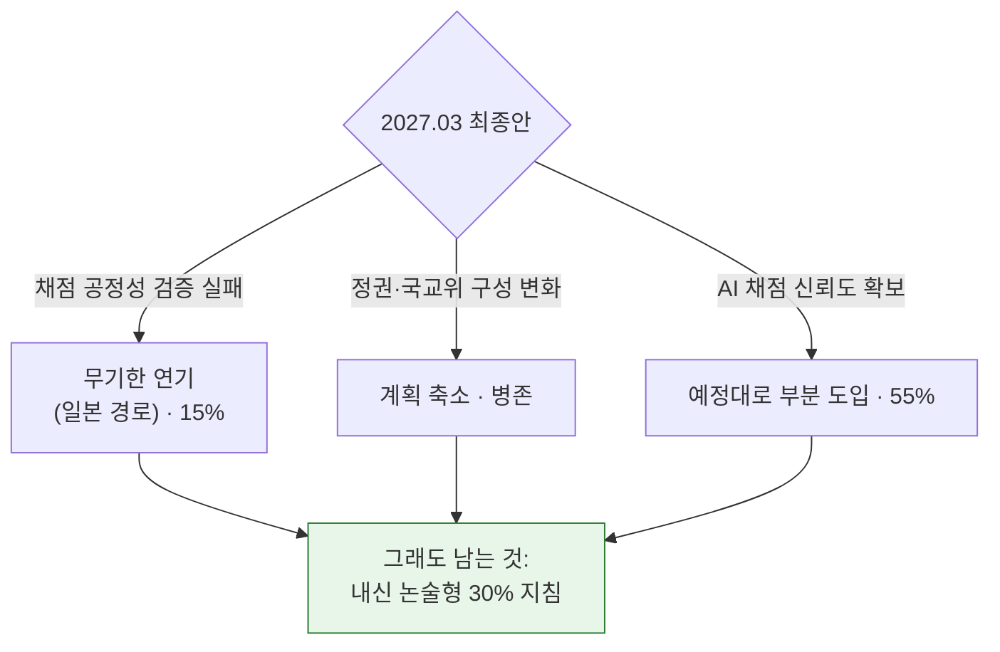

> 🎯 **전략의 강건성**: 어떤 시나리오에서도 **내신 서·논술형은 남습니다.** 파트 Ⅰ·Ⅱ의 150문항과 6레벨 훈련은 **수능 도입 여부와 무관하게 유효**합니다. 반대로 "수능 논술 대비"를 표방하는 선행 투자는 **15%+@의 확률로 완전히 무용지물**이 됩니다.

---

# 파트 Ⅳ · 자료

---

## 13. 자료·영상·사이트 총람

### 13-1. 공식 사이트 (1차 자료)

| 사이트 | 용도 | 링크 |
|---|---|---|
| **KICE 학생평가지원포털(STAS)** | 예시문항·채점기준·평가도구 국가 허브 | [stas.moe.go.kr](https://stas.moe.go.kr/) |
| **학교알리미** | 우리 학교 **평가계획·학업성적관리규정** 공시 확인 | [schoolinfo.go.kr](https://www.schoolinfo.go.kr/) |
| **국가교육위원회** | 국가교육발전계획 시안·공론화 결과 | [ne.go.kr](https://www.ne.go.kr/) |
| **교육부** | 대입개편·정책 보도자료 | [moe.go.kr](https://www.moe.go.kr/) |
| **서울시교육청 정책자료** | 학생평가 내실화 계획 등 | [sen.go.kr 정책자료](https://www.sen.go.kr/user/bbs/BD_selectBbsList.do?q_bbsSn=1025) |
| **경기도교육청** | 서·논술형 자료집·교과별 문항 예시 | [goe.go.kr](https://www.goe.go.kr/) |
| **충북교육청 IB 포털** | IB 프로그램 국내 운영 정보 | [cbe.go.kr/ib](https://www.cbe.go.kr/ib/main.do) |
| **EBSi 2028 수능 체제 개편** | 개편 구조 해설 강좌 | [바로가기](https://www.ebsi.co.kr/ebs/pot/potg/retrieveSeriesSubjectList.ebs?seriesGrpId=PKG_0370&seriesId=PRO_1881) |

### 13-2. 영상 자료 (YouTube)

| 영상 | 대상 | 링크 |
|---|---|---|
| **대학수학능력시험 서·논술형 평가 도입 방안** | 교사·학부모 (정책 원리) | [보기](https://www.youtube.com/watch?v=r5DMmsCnH1I) |
| **"수능에 서논술형 도입하면 학원 갈 필요가 없다구요?"** | 학부모 (쟁점 정리, 2026.08) | [보기](https://www.youtube.com/watch?v=K58WmrOyb_U) |
| **수능 서논술형 도입? 지금 논술학원 보내기 전에 이것부터 보세요** | 학부모 (사교육 판단) | [보기](https://www.youtube.com/watch?v=eM1OUPOEmLs) |
| **고등학교도 AI 서·논술형 평가…수능 도입 가능할까** (EBS뉴스) | 전체 | [보기](https://www.youtube.com/watch?v=yPZD2xQBFiU) |
| **소통 / '수능 절대평가 및 서논술형 논의' 톺아보기** (2026.08.08) | 전체 | [보기](https://www.youtube.com/watch?v=_INo22GhxWM) |
| **서·논술형 평가 실천하기 — 장학자료 활용 도움영상** | **교사 (문항 개발 실무)** | [보기](https://www.youtube.com/watch?v=jxW9OVuStE4) |
| **서논술형 문항 개발의 이론과 실제** (플레이리스트) | **교사 (연수용)** | [보기](https://www.youtube.com/playlist?list=PLFBY55WnH1QftD1QBLQGDn7O40Vek2r8n) |

### 13-3. 연구·논문 (심화)

| 자료 | 내용 | 링크 |
|---|---|---|
| 국어과 서·논술형 수능 평가 문항 개발 방안 연구 | **수능 국어 서·논술형 문항 설계 직접 연구** | [KCI](https://www.kci.go.kr/kciportal/landing/article.kci?arti_id=ART002930135) |
| 논술형 평가 전문성 강화를 위한 AI 자동채점 기반 평가자 협의 모델 | 교사–AI 협업 채점 모델 | [KCI](https://www.kci.go.kr/kciportal/ci/sereArticleSearch/ciSereArtiView.kci?sereArticleSearchBean.artiId=ART003235709) |
| 인공지능 기반 자동평가의 현재와 미래 | 서술형 자동채점 문헌 고찰 | [KCI](https://www.kci.go.kr/kciportal/landing/article.kci?arti_id=ART002597181) |
| 인공지능 한국어 논·서술형 자동채점 연구의 현황과 과제 | 교육부 행복한교육 | [바로가기](https://happyedu.moe.go.kr/happy/bbs/selectHappyArticle.do?bbsId=BBSMSTR_000000005152&nttId=38618) |
| 한국과 미국 워싱턴주 사회과 서·논술형 평가 문항 분석 | 국제 비교 | [PDF](https://www.sungshin.ac.kr/bbs/edure/3950/67154/download.do) |

### 13-4. 실물 문항·루브릭이 더 필요하면

→ **[서논술형 / IB 기출문항 자료지도](<./(서논술형)-논술형_IB_기출문항_자료지도.md>)**
- 6장: 교과별 실제 문항 예시 (국내·IB·AP·Cambridge)
- 7장: 채점 루브릭 전문 (IB Markband, AP DBQ 7점, 국내 표준 양식)
- 8장: 6개 교과 심화 (국어·영어·수학·역사·사회·철학)
- 9장: 탐구 주제·소논문 예시

---

## 14. 한 장 실행표

| 지금 당장 (1주) | 이번 학기 (12주) | 올해 안 |
|---|---|---|
| **2장에서 내 학년 ★3 문항 3개 풀기** | 5장 **12주 사이클** 1회전 완주 | 2026.10 말 **국가교육발전계획 시안** 확인 |
| **4-1 표로 내 레벨(L0~L5) 판정** | 4-2 표의 **내 레벨 훈련만** 반복 | 2027.03 **최종안** 확인 후 전략 재조정 |
| 지난 시험 답안 **감점 6분류** (1-5절) | 시험마다 **7장 오답 재작성 5단계** | 학교의 IB·AI 평가 실천학교 여부 확인 |
| **1장 RULE 6단계** 손으로 표시하며 3문항 | 11주차 **자작 문항 5개 + 자기 채점기준** | 사교육은 **12-2 판별 기준** 통과 시에만 |
| 학교알리미에서 **평가계획·논술형 비율** 확인 | 12주차 **레벨 재판정** | 다음 학기 목표 레벨 설정 |

```mermaid
flowchart LR
    D["진단<br/>레벨 판정"] --> T["훈련<br/>내 레벨만"] --> A["적용<br/>실제 시험"] --> R["재작성<br/>감점 6분류"] --> D

    style D fill:#e3f2fd,stroke:#1565c0
    style T fill:#e8f5e9,stroke:#2e7d32
    style R fill:#fff3e0,stroke:#ef6c00
```

> **한 문장 요약** — 새 문제를 많이 푸는 것이 아니라, **내 레벨의 문제를 RULE 6단계로 풀고, 틀린 것을 다시 쓰는 것**이 서·논술형 대비의 전부입니다.

---

## 출처

**정책·공론화**
- [뉴스핌 국민참여위 숙의 결과](https://www.newspim.com/news/view/20260917000700) · [뉴스핌 국교위 "공정성 검증 우선"](https://www.newspim.com/news/view/20260917000743) · [서울신문 국민위원 55%](https://www.seoul.co.kr/news/society/education-news/2026/09/17/20260917500163) · [SBS Biz](https://biz.sbs.co.kr/article/20000335239) · [머니투데이](https://www.mt.co.kr/policy/2026/09/17/2026091710591484777) · [서울신문 1박2일 끝장토론](https://www.seoul.co.kr/news/society/education-news/2026/08/28/20260828500094)
- [뉴스핌 국교위 업무보고](https://www.newspim.com/news/view/20260805000395) · [이데일리](https://edaily.co.kr/News/Read?mediaCodeNo=257&newsId=04956086645544368) · [MBC](https://imnews.imbc.com/news/2026/society/article/6842663_36918.html) · [뉴시스 수능 대전환①](https://www.newsis.com/view/NISX20260807_0003741020) · [뉴시스 수능 대전환②](https://m.news.nate.com/view/20260808n02945)

**2028 수능 체제**
- [교육부 2028 대입개편](https://www.moe.go.kr/boardCnts/viewRenew.do?boardID=294&boardSeq=97551&lev=0&s=moe&m=020402) · [정책브리핑](https://www.korea.kr/news/policyNewsView.do?newsId=148938778) · [한국대학신문 통합사회·통합과학 25문항](https://news.unn.net/news/articleView.html?idxno=574018) · [이투데이 2028 수능 시행일](https://www.etoday.co.kr/news/view/2475259) · [EBSi](https://www.ebsi.co.kr/ebs/pot/potg/retrieveSeriesSubjectList.ebs?seriesGrpId=PKG_0370&seriesId=PRO_1881)

**시·도교육청**
- [KPI뉴스 전남광주 초5·6·중1 도입](https://www.kpinews.kr/newsView/1065589851088910) · [전남인뉴스](https://www.jninnews.com/news/articleView.html?idxno=41266) · [뉴스핌 '논술 100% 평가' 강행 의지](https://www.newspim.com/news/view/20260716000845) · [한국경제 지역 교사들 발칵](https://www.hankyung.com/article/202607034703i) · [대구신문 초5부터 확대](https://www.idaegu.co.kr/news/articleView.html?idxno=559165)
- [뉴스핌 경기 AI 서·논술형 전 교과 확대](https://www.newspim.com/news/view/20260414000378) · [서울신문 경기교육청](https://www.seoul.co.kr/news/society/education-news/2026/04/14/20260414500056) · [안전신문](https://www.safetynews.co.kr/news/articleView.html?idxno=247624) · [이데일리 경기 AI 평가체계](https://edaily.co.kr/News/Read?mediaCodeNo=257&newsId=03152086645416120)
- [뉴시스 2026 서울교육 주요정책](https://www.newsis.com/view/NISX20260127_0003492367) · [서울교육 주요업무 2026 PDF](https://www.sen.go.kr/resources/www/data/policydata1_9_1.pdf) · [중고생 수행·논술형 30% 이상](https://v.daum.net/v/20260223174853619) · [경기도교육청 대입개혁 연구 PDF](https://www.goe.go.kr/resource/goe/na/bbs_2675/2025/11/6b926081-60e5-4d74-8ea6-c11f9a368dd4.pdf)

**AI 채점·문항 연구**
- [KICE AI채점 형식 요소 편향](https://news.nate.com/view/20260419n14624) · [AI 초벌 채점 '구원투수'](https://m.news.nate.com/view/20260419n06799) · [전북미래교육신문](https://edujb.com/news/articleView.html?idxno=9035) · [서플](https://supple.kr/news/cmtdgkx2r00183fjilxu1ks3a) · [국민일보 日 서·논술형 입시 좌초](https://www.kmib.co.kr/article/view.asp?arcid=9000003060&code=11131100&sid1=soc)
- [이투데이 초등 수학 평가자료 92.5%](https://www.etoday.co.kr/news/view/2621971)

**IB 확산**
- [미디어제주 전국 269개교](https://www.mediajeju.com/news/articleView.html?idxno=365190) · [이투데이 서울 IB 관심학교 91곳](https://www.etoday.co.kr/news/view/2575086) · [경기교육청 IB 전면 확산](https://m.news.nate.com/view/20260218n08034) · [충북교육청 IB](https://www.cbe.go.kr/ib/main.do)

**사교육 리스크**
- [교육언론[창]](https://www.educhang.co.kr/news/articleView.html?idxno=9987) · [울산매일](https://www.iusm.co.kr/news/articleView.html?idxno=1066679) · [한국일보 오피니언](https://www.hankookilbo.com/news/article/A2026081315550000589) · [광주드림](https://www.gjdream.com/news/articleView.html?idxno=672665) · [서울신문 세종로의 아침](https://www.seoul.co.kr/news/editOpinion/column/politics-story/2026/08/25/20260825025001)

**영상**
- [수능 서·논술형 평가 도입 방안](https://www.youtube.com/watch?v=r5DMmsCnH1I) · [절대평가+서논술형 톺아보기](https://www.youtube.com/watch?v=K58WmrOyb_U) · [논술학원 보내기 전에](https://www.youtube.com/watch?v=eM1OUPOEmLs) · [EBS뉴스 고교 AI 서·논술형](https://www.youtube.com/watch?v=yPZD2xQBFiU) · [소통 2026.08.08](https://www.youtube.com/watch?v=_INo22GhxWM) · [서·논술형 평가 실천하기](https://www.youtube.com/watch?v=jxW9OVuStE4) · [서논술형 문항 개발의 이론과 실제](https://www.youtube.com/playlist?list=PLFBY55WnH1QftD1QBLQGDn7O40Vek2r8n)
