# 만들면서 배우는 AI 발명 프로젝트
## 초등 5학년 · 기획 2차시 + 개발 4차시 · 총 6차시

---

| 항목 | 내용 |
|---|---|
| **대상** | 초등학교 5학년 3명 (1팀) |
| **차시** | 6차시 × 90분 = 540분 |
| **구조** | **1~2차시 기획** (문제점 → 페르소나 → 벤치마킹 → 유저 시나리오) → **3~6차시 개발** |
| **도구** | 웹캠 → 컴퓨터(엔트리 AI 모델) → 마이크로비트 |
| **개발 방식** | **PRIMM** — 짜여 있는 예제를 예측·실행·조사한 뒤 우리 것으로 고쳐 만든다 |
| **끝나는 지점** | 발표회가 아니라 **기획 의도대로 작동하는지 검증하고 3회전 개선한 발명품** |

---

# 0. 한눈에 보는 6차시 요약

> 이 장만 읽어도 전체 설계가 파악됩니다. 상세 지도안은 4장부터입니다.

## 0.1 전체 구조

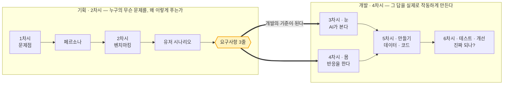

## 0.2 6차시 한 줄 요약

| 차시 | 구분 | 제목 | **무엇을 배우는가 (핵심)** | 무엇을 하는가 | 산출물 |
|---|---|---|---|---|---|
| **1** | 기획 | 문제점과 사람 | **막연한 불편함을 '누구의 문제'로 좁힌다** — 문제 정의문·페르소나 | 불편함 20개 사냥 → 1개 선정 → 페르소나 카드 | 문제 정의문 · 페르소나 카드 |
| **2** | 기획 | 벤치마킹과 시나리오 | **이미 있는 해결책을 조사하고 우리 차별점을 정한다** / 사용 장면을 시간 순서로 그린다 | 기존 해결책 3개 비교 → Before/After 4컷 → 요구사항 3줄 | 벤치마킹 표 · 시나리오 · **요구사항 명세** |
| **3** | 개발 | AI의 눈 (컴퓨터 비전) | **입력→특징→분류→신뢰도** / AI는 '모름'을 못 말한다 / 조건은 위에서부터 하나만 | 실험 A·B·C → 요구사항을 클래스로 번역 | 조사 기록지 · 클래스 확정 |
| **4** | 개발 | 발명품의 몸 (피지컬 컴퓨팅) | **입력(센서)→판단→출력** / 한 번에 하나씩 / 켜고→보여주고→지운다 | 실험 D·E·F → 동작 설계표·순서도 | 동작 설계표 · 순서도 |
| **5** | 개발 | 만든다 | **데이터는 양보다 다양성** / 한 번에 하나씩 붙이고 확인한다 | 촬영·학습 → 예제 코드 수정 → 마이크로비트·하우징 | 학습 모델 · 시제품 v1.0 |
| **6** | 개발 | 검증하고 고친다 | **기획 의도대로 되는지 검증** / 원인은 데이터·코드·HW 셋 / 한 번에 하나만 고친다 | 시나리오 기반 테스트 12개 → 개선 2~3회전 | 테스트 기록지 · **개선 이력표** |

## 0.3 차시별 학습 내용 상세

### 1차시 · 기획 ① 문제점 → 페르소나
- **개념** 불편함(현상)과 문제(정의)의 차이 / 페르소나 = 문제를 겪는 구체적인 한 사람
- **기능** 불편함을 수집·분류하고, 한 문장짜리 문제 정의문으로 좁힌다
- **판별 기준** "이건 **무엇과 무엇을 구분**하면 해결되는가?" (구분 문제여야 이 수업에서 만들 수 있다)
- **결과** "○○한 △△(페르소나)가 □□할 때 ◇◇해서 불편하다"

### 2차시 · 기획 ② 벤치마킹 → 유저 시나리오
- **개념** 벤치마킹 = 베끼기가 아니라 **비교 기준 만들기** / 시나리오 = 사용 장면의 시간 순서
- **기능** 기존 해결책 3가지(사람이 하는 방식·기존 제품·비슷한 앱)를 항목별로 비교하고, Before/After 4컷을 그린다
- **핵심 전환** 시나리오의 각 장면을 **요구사항 3줄**로 바꾼다 → 이것이 3~6차시 개발의 계약서가 된다
- **결과** "우리 발명품은 ①□□을 보고 ②△△라고 판단해 ③◇◇로 알려준다"

### 3차시 · 개발 ① AI의 눈
- **개념** 입력·특징 추출·분류·신뢰도 4단계 / 조건문은 위에서부터 하나만 실행
- **원리 3가지**
  1. 대기 시간이 없으면 결과가 요동친다 (실험 A)
  2. AI는 100%가 아니라 '몇 %'로 말하고, 모르는 것도 억지로 고른다 (실험 B)
  3. 좁고 특별한 조건이 위, 넓고 일반적인 조건이 아래 (실험 C)
- **기획 연결** 요구사항 ①(무엇을 보는가)을 **클래스 3~4개 + 모르겠음**으로 번역

### 4차시 · 개발 ② 발명품의 몸
- **개념** 센서→판단→액추에이터 / 순차 실행 / 상태를 지우는 타이밍
- **원리 3가지**
  1. 프로그램은 한 번에 한 가지만 한다 (실험 D)
  2. 지우기를 위에 두면 켜지자마자 사라진다 → 켜고→대기→지우기 (실험 E)
  3. 쉬는 블록을 빼면 오히려 느려진다 (실험 F)
- **기획 연결** 요구사항 ③(어떻게 알려주는가)을 **LED·소리·지속시간**으로 번역

### 5차시 · 개발 ③ 만든다
- **개념** 학습 데이터는 양보다 **다양성**(각도·거리·밝기·장소)
- **원리** 두 가지를 한꺼번에 붙이면 원인을 못 찾는다 → 화면 출력 검증 후 하드웨어 결합
- **기획 연결** 페르소나가 쓰는 **실제 환경에서** 촬영한다

### 6차시 · 개발 ④ 검증하고 고친다
- **개념** 테스트는 계획적으로 / 원인의 3분류(데이터·코드·하드웨어) / 통제된 개선
- **원리** 신뢰도 임계값을 올리면 놓치고, 내리면 틀린다 — 정답은 팀이 정한다
- **기획 연결** 2차시 **유저 시나리오 그대로** 테스트 조건을 만든다 (기획서가 시험지가 된다)

## 0.4 전체 마인드맵

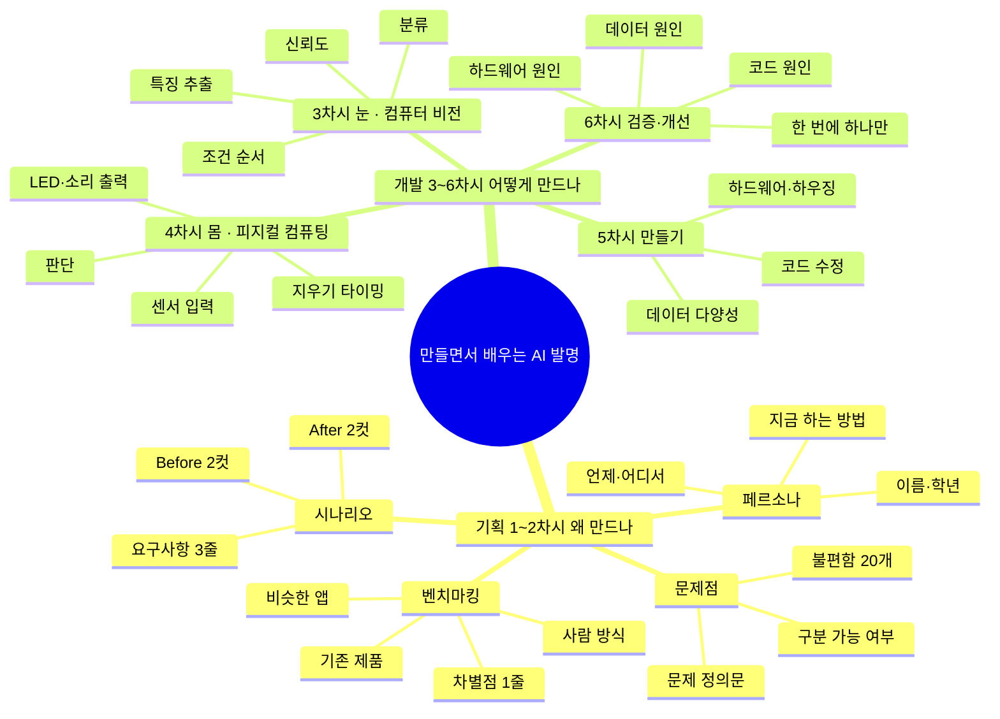

## 0.5 6차시 단계도 (전체 흐름)

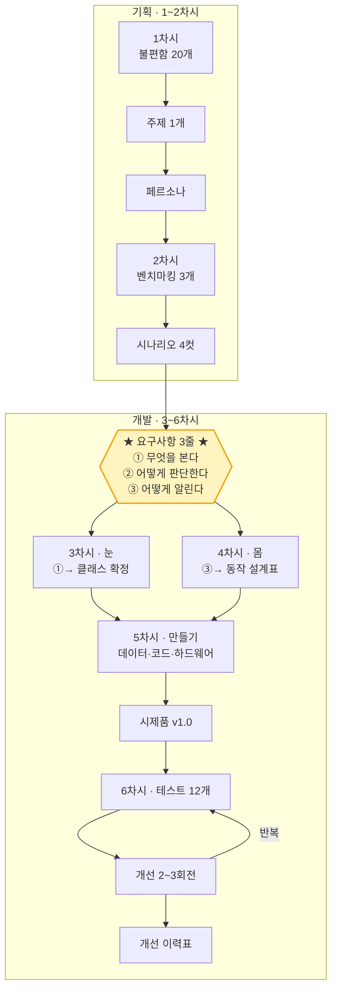

---

# 1. 이 수업의 설계

## 1.1 왜 기획을 2차시나 쓰는가

만들기부터 시작하면 "무엇을 만들었는지"는 남지만 "왜 만들었는지"는 남지 않습니다. 이 수업은 앞의 2차시를 **기획**에 온전히 씁니다.

기획의 결론은 **요구사항 3줄**입니다. 이 세 줄이 3~6차시 내내 기준이 됩니다.

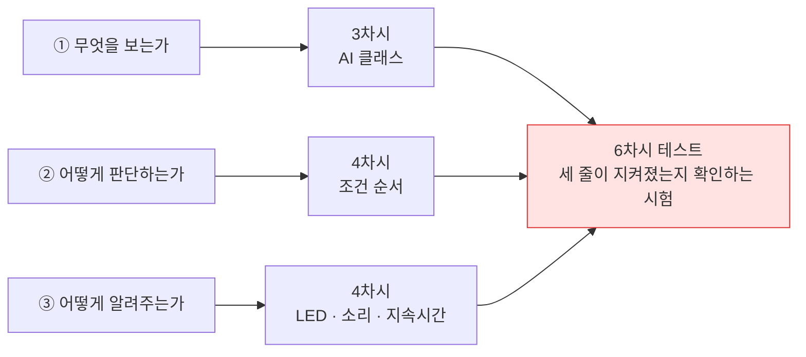

## 1.2 개발의 방법 — PRIMM

백지에서 코딩을 시작하면 초등 5학년은 대부분 막힙니다. **이미 작동하는 예제**에서 출발합니다.

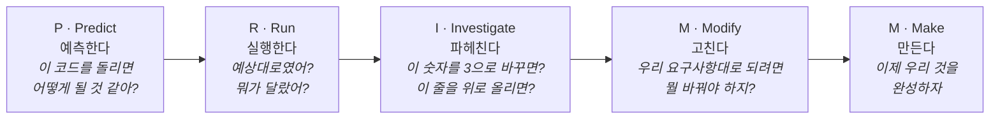

| 차시 | 3차시 | 4차시 | 5차시 | 6차시 |
|---|---|---|---|---|
| **PRIMM 단계** | I (조사) | I (조사) | M + M (수정·제작) | 개선 루프 |

**예측은 반드시 글로 먼저 적게 합니다.** 예측 없이 실행 버튼부터 누르면 그냥 구경이 됩니다.

> **교사 유의** — 예측이 틀린 학생에게 "아니야"라고 하지 마세요. **"오, 그렇게 생각했구나. 왜?"** 로 받으면 다음 실행을 훨씬 집중해서 봅니다.

## 1.3 만드는 것 — 세 덩어리

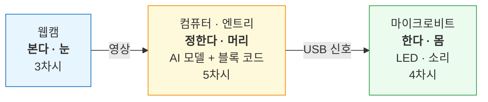

## 1.4 3인 1팀 역할

역할은 차시마다 한 칸씩 돌립니다.

| 구간 | 역할 | 하는 일 |
|---|---|---|
| 기획 (1~2차시) | **기록 담당** | 회의록·문제 정의문·요구사항 문장 다듬기 |
| | **조사 담당** | 현장 관찰, 벤치마킹 자료 수집 |
| | **그림 담당** | 페르소나 카드·시나리오 4컷 시각화 |
| 개발 (3~6차시) | **눈 담당** | 촬영 계획, 사진 수집, 모델 학습 |
| | **머리 담당** | 예측 기록, 블록 조립, 값·순서 실험 |
| | **몸 담당** | 마이크로비트 연결, 하우징, 테스트 기록 |

| | 1차시 | 2차시 | 3차시 | 4차시 | 5차시 | 6차시 |
|---|---|---|---|---|---|---|
| **A** | 기록 | 조사 | 눈 | 머리 | 몸 | 눈 |
| **B** | 조사 | 그림 | 머리 | 몸 | 눈 | 머리 |
| **C** | 그림 | 기록 | 몸 | 눈 | 머리 | 몸 |

**PRIMM의 예측(P)만은 예외입니다.** 항상 **세 명이 각자 따로** 적은 뒤 비교합니다.

## 1.5 90분 운영 틀

| 구간 | 시간 | 성격 |
|---|---|---|
| 여는 활동 | 10분 | 지난 차시 확인 · 오늘의 질문 |
| **활동 1** | 30분 | 기획: 발산·조사 / 개발: PRIMM |
| 쉬는 시간 | 10분 | 몸 움직이기 — 반드시 지킬 것 |
| **활동 2** | 30분 | 기획: 수렴·문서화 / 개발: 우리 것에 적용 |
| 닫는 활동 | 10분 | 기록 · 다음 차시 예고 |

---

# 2. 학습목표

**기획**
1. 관찰한 불편함을 **누구의 어떤 문제**인지 한 문장으로 정의할 수 있다.
2. 문제를 겪는 사람을 **페르소나**로 구체화하고, 그 사람 입장에서 필요를 설명할 수 있다.
3. 기존 해결책을 **항목별로 비교**해 우리 발명품의 차별점을 말할 수 있다.
4. 사용 장면을 **시간 순서의 시나리오**로 그리고, 이를 **요구사항 3줄**로 옮길 수 있다.

**개발**

5. 컴퓨터 비전이 **입력 → 특징 → 분류 → 신뢰도**로 작동함을 예제를 조작해 설명할 수 있다.
6. 피지컬 컴퓨팅이 **입력(센서) → 판단 → 출력(액추에이터)** 구조임을 예제를 조작해 설명할 수 있다.
7. 예제 코드를 **우리 요구사항에 맞게 수정**해 발명품을 완성할 수 있다.
8. 시나리오에 근거해 테스트하고 **실패 원인을 데이터·코드·하드웨어로 나눌** 수 있다.
9. 개선 전후를 비교해 **무엇을 고쳐서 무엇이 좋아졌는지** 설명할 수 있다.

---

# 3. 기획 산출물이 개발로 넘어가는 경로

이 표를 교실 벽에 붙여 두세요. 학생이 "왜 이걸 하지?"라고 물을 때 여기를 가리킵니다.

| 기획 산출물 | 차시 | → 개발에서 무엇이 되는가 | 차시 |
|---|---|---|---|
| 문제 정의문 | 1 | 프로젝트 이름 · 판단 기준 | 전 차시 |
| 페르소나 카드 | 1 | **촬영 장소와 조건** (그 사람이 쓰는 환경) | 5 |
| 벤치마킹 표 | 2 | 우리가 꼭 지켜야 할 차별점 1가지 | 5·6 |
| 시나리오 4컷 | 2 | **테스트 조건 12개** | 6 |
| 요구사항 ① 무엇을 본다 | 2 | **AI 클래스 목록** | 3 |
| 요구사항 ② 어떻게 판단 | 2 | **조건 순서 · 신뢰도 기준** | 4·6 |
| 요구사항 ③ 어떻게 알린다 | 2 | **동작 설계표 (LED·소리·시간)** | 4 |

---

# 4. 차시별 지도안

---

# 1차시 — 문제점을 찾고, 그 사람을 그린다

> **구분** 기획 ① · **주제** 문제점 → 페르소나
> **오늘의 결과물** 문제 정의문 1개 · 페르소나 카드 1장

## 목표
- 막연한 불편함 더미에서 **우리가 풀 문제 하나**를 골라 한 문장으로 정의한다.
- 그 문제를 겪는 사람을 **구체적인 한 명**으로 그린다.

## 1차시 단계도

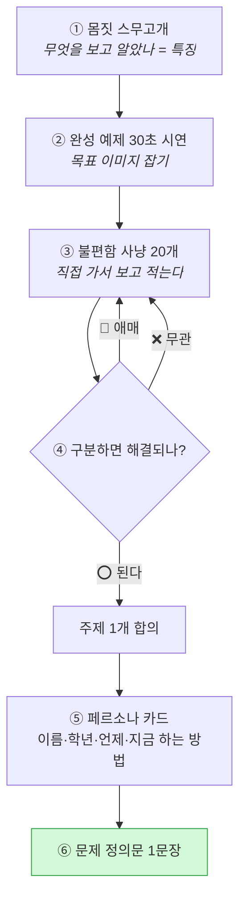

## 1차시 마인드맵

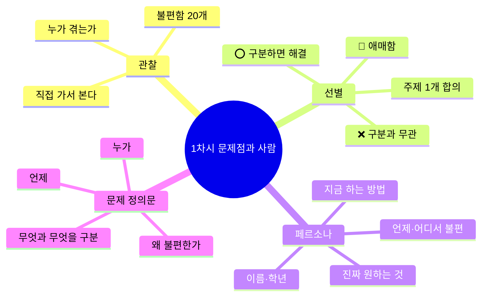

## 여는 활동 · 10분 — 몸짓 스무고개

한 명이 몸짓만으로 표현하고 둘이 맞힙니다. 3라운드.

> **발문** — "무엇을 보고 알아맞혔어요?"
> 손 위치, 몸의 기울기, 반복 동작. 이것이 **특징**이고, 컴퓨터도 특징을 보고 구분한다고 연결합니다. (3차시 복선)

이어서 교사가 만들어 둔 완성 예제를 30초만 시연합니다. **설명하지 말고 보여주기만** 합니다.

> "6주 뒤에 여러분은 이런 걸 만듭니다. 그런데 오늘은 코딩을 하지 않습니다. **무엇을 만들지 정하는 게 오늘 일**입니다."

## 활동 1 · 30분 — 불편함 사냥

1. 팀이 함께 학교를 돌며 불편한 점을 **20개** 적습니다. (15분)
   - 규칙: 앉아서 상상하지 말고 **직접 가서 보고** 적는다.
2. 세 무더기로 나눕니다. (10분)

| 무더기 | 기준 | 예 |
|---|---|---|
| ⭕ 쓸 수 있음 | 둘 이상을 **구분**하면 해결됨 | 분리수거를 헷갈림 |
| 🔺 애매함 | 구분 문제인지 불분명 | 복도가 시끄러움 |
| ❌ 못 씀 | 구분과 무관 | 급식이 맛없음 |

3. ⭕ 에서 팀 주제 **1개**를 합의로 고릅니다. (5분)

> **발문** — "이건 무엇과 무엇을 구분하면 해결되나요?"
> 이 질문에 답 못 하는 아이디어는 이 수업에서 만들 수 없습니다.

## 쉬는 시간 · 10분

## 활동 2 · 30분 — 페르소나 만들기

"모두가 불편하다"는 말은 **아무도 불편하지 않다**는 말과 같습니다. 한 사람으로 좁힙니다.

### ▸ 페르소나 카드 (20분)

**페르소나 카드**

| 항목 | 적는 내용 |
|---|---|
| 얼굴 그림 | *(칸을 크게 비워 두고 직접 그리게 합니다)* |
| **이름 · 학년** | |
| **한 줄 소개** | |
| **언제 · 어디서 불편한가** | |
| **지금은 어떻게 하고 있나** (현재의 해결 방법) | |
| **그래서 무엇이 문제인가** | |
| **진짜로 원하는 것 한 가지** | |

> **핵심 지도** — 페르소나는 상상 인물이 아닙니다. **실제로 관찰한 사람**(1학년 동생, 급식 도우미 선생님, 우리 반 친구)을 모델로 삼게 하세요. 이름과 학년까지 적으면 다음 차시부터 대화가 달라집니다.
>
> **발문** — "이 사람이 지금 이미 하고 있는 방법이 있죠? 그건 왜 부족한가요?" — 이 답이 2차시 벤치마킹의 첫 줄이 됩니다.

### ▸ 문제 정의문 (10분)

카드를 근거로 한 문장을 완성합니다.

**문제 정의문**

| 칸 | 무엇을 적나 | 우리 팀 |
|---|---|---|
| ① 상황·특성 | 어떤 처지의 사람인가 | |
| ② 누구 (페르소나) | 이름이 있는 한 사람 | |
| ③ 언제 | 어느 순간에 | |
| ④ 왜 | 무엇 때문에 불편한가 | |
| ⑤ 구분할 것 | 무엇과 무엇을 구분하면 되나 | |

> **완성 문장** — ①한 ②는 ③할 때 ④해서 불편하다. → ⑤를 구분하면 해결할 수 있다.
>
> *예)* 이제 막 입학한 1학년 동생은 재활용품을 버릴 때 어느 통에 넣는지 몰라서 아무 데나 넣는다.
> → 플라스틱 / 종이 / 캔 을 구분하면 해결할 수 있다.

## 닫는 활동 · 10분

문제 정의문을 소리 내어 읽고 세 명이 모두 동의하는지 확인합니다. 한 명이라도 "그건 아닌 것 같은데"라고 하면 그 이유를 카드 여백에 적어 둡니다. (6차시 "다음에 해본다면"에 자주 들어갑니다.)

**준비물** — 클립보드, 포스트잇, 페르소나 카드 양식(부록 A), 완성 예제(시연용)

---

# 2차시 — 이미 있는 방법을 조사하고, 쓰는 장면을 그린다

> **구분** 기획 ② · **주제** 벤치마킹 → 유저 시나리오 → 요구사항
> **오늘의 결과물** 벤치마킹 비교표 · 시나리오 4컷 · **요구사항 3줄**

## 목표
- 같은 문제를 이미 어떻게 풀고 있는지 조사하고 우리의 차별점을 정한다.
- 사용 장면을 시간 순서로 그리고, 이를 개발이 읽을 수 있는 **요구사항**으로 바꾼다.

## 2차시 단계도

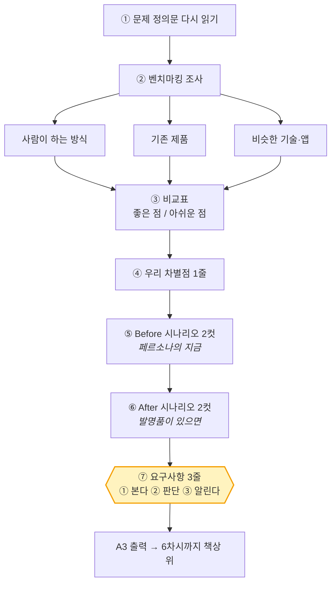

## 2차시 마인드맵

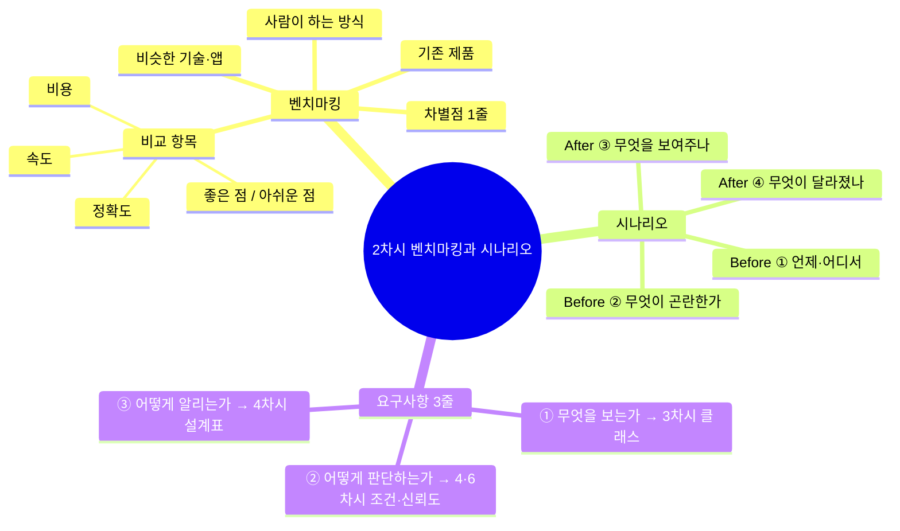

## 여는 활동 · 10분

1차시 문제 정의문을 다시 읽습니다.

> **오늘의 질문** — "우리만 이 문제를 발견했을까요? **다른 사람들은 이걸 어떻게 풀고 있죠?**"

## 활동 1 · 30분 — 벤치마킹

벤치마킹은 베끼기가 아니라 **비교 기준을 만드는 일**이라고 먼저 말해 줍니다.

### ▸ 조사 (15분) — 세 종류를 반드시 채웁니다

| 종류 | 무엇을 조사하나 | 예 (분리수거 도우미) |
|---|---|---|
| ① **사람이 하는 방식** | 지금 사람이 어떻게 해결하고 있나 | 통에 붙은 그림 안내판 / 선생님이 알려줌 |
| ② **기존 제품** | 파는 물건 중 비슷한 것 | 자동 분리 쓰레기통 |
| ③ **비슷한 기술·앱** | 다른 분야의 같은 원리 | 사진으로 꽃 이름 알려주는 앱 |

> 인터넷 검색이 어려우면 교사가 사진 3~4장을 미리 인쇄해 카드로 제공합니다.

### ▸ 비교표 작성 (15분)

| 비교 항목 | ① 사람 방식 | ② 기존 제품 | ③ 비슷한 앱 | **우리 발명품** |
|---|---|---|---|---|
| 누가 쓰나 | | | | 우리 페르소나 |
| 얼마나 빠른가 | | | | |
| 틀릴 때가 있나 | | | | |
| 돈이 드나 | | | | |
| **좋은 점** | | | | |
| **아쉬운 점** | | | | |

> **핵심 발문** — "셋 다 있는데도 우리 페르소나는 왜 아직 불편할까요?"
> 그 빈칸이 우리 자리입니다.

**우리 차별점**

| | 내용 |
|---|---|
| 기존 방법은 | |
| 하지만 우리 발명품은 | |

이 한 줄은 6차시 개선의 우선순위를 정할 때 다시 꺼냅니다.

## 쉬는 시간 · 10분

## 활동 2 · 30분 — 유저 시나리오 → 요구사항

### ▸ Before / After 4컷 (20분)

페르소나의 하루를 만화 4컷으로 그립니다. 그림 실력은 보지 않습니다.

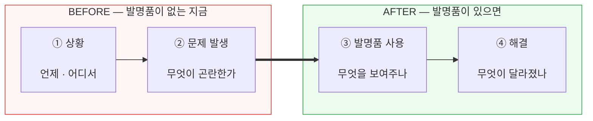

각 컷 아래에 한 문장씩 씁니다.

각 컷 아래에 한 문장씩 씁니다.

> **핵심 발문 (③번 컷에서)** — "그 순간 발명품은 **무엇을 보고**, **뭐라고 판단하고**, **어떻게 알려주나요?**"
> 이 질문 하나가 다음 단계 전부입니다.

### ▸ 요구사항 3줄 (10분) — 오늘의 진짜 결과물

**요구사항** — 발명품 이름 : ____________________

| | 항목 | 적는 내용 | 개발에서 무엇이 되나 |
|---|---|---|---|
| **①** | 무엇을 보는가 | 카메라로 ____________ 을(를) 본다.<br/>구분할 것 : ①____ ②____ ③____ ④모르겠음 | 3차시 · AI 클래스 |
| **②** | 어떻게 판단하는가 | ______ 이면 ______ 이라고 판단한다.<br/>확실하지 않으면 ____________ 라고 한다. | 4·6차시 · 조건 순서 · 신뢰도 |
| **③** | 어떻게 알려주는가 | ____________ 로 알려준다. (빛 / 소리 / 글자)<br/>알림은 ______ 초 동안 보여준다. | 4차시 · 동작 설계표 |

> **교사 지도** — 이 종이를 A3로 출력해 **6차시 내내 책상 위에 두게 하세요.** 개발 중 다툼이 생기면 여기로 돌아옵니다.
>
> **구분 항목은 3~4개를 넘기지 않게** 합니다. 이유는 3차시 실험에서 학생이 직접 확인합니다. 지금은 "많으면 헷갈린대"로 충분합니다.

## 닫는 활동 · 10분

기획서 3종(문제 정의문 · 페르소나 카드 · 요구사항)을 한 파일에 모아 사진으로 남깁니다.

> **다음 차시 예고** — "다음 시간부터 개발입니다. 첫 번째 질문은 **'AI는 대체 어떻게 보는가'** 입니다."

**준비물** — 벤치마킹 자료 카드(교사 준비), 비교표·시나리오 양식(부록 B·C), A3 요구사항 양식(부록 D), 색연필

---

# 3차시 — AI의 눈: 컴퓨터 비전을 뜯어본다

> **구분** 개발 ① · **PRIMM** I(조사)
> **오늘의 결과물** 조사 기록지 · **클래스 확정** (요구사항 ①의 실현)

## 목표
- 이미지 분류가 어떻게 작동하는지 예제를 조작해 알아낸다.
- 요구사항 ①「무엇을 보는가」를 AI가 알아들을 **클래스 목록**으로 옮긴다.

## 3차시 단계도

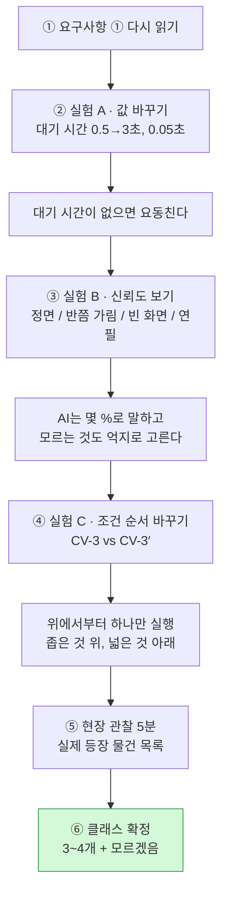

## 3차시 마인드맵

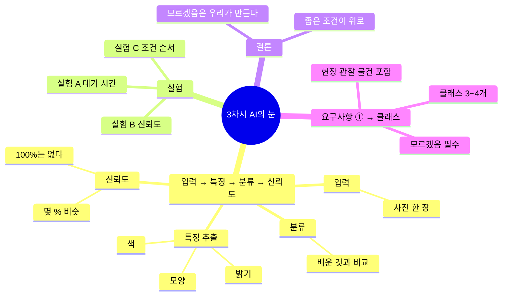

## 컴퓨터 비전이란 — 학생에게 이렇게 설명합니다

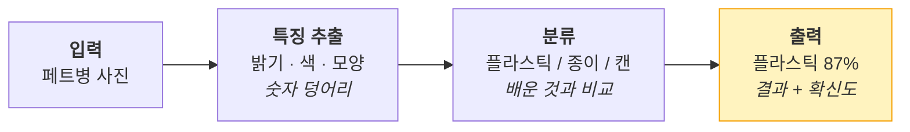

> "컴퓨터는 사진을 사진으로 보지 않고 숫자로 봅니다.
> 배운 숫자들 중 어느 것과 가장 비슷한지 고릅니다.
> 100% 확신하는 법은 없고, 항상 '몇 퍼센트쯤 비슷하다'고 말합니다."

## 여는 활동 · 10분

2차시 요구사항 ①을 소리 내어 읽습니다.

> **오늘의 질문** — "우리는 '페트병을 본다'고 썼죠. 그런데 **AI에게 페트병을 어떻게 알려주죠?** 그리고 AI가 신발을 보면 뭐라고 할까요?"

## 활동 1 · 30분 — Investigate ①

교사가 준 **최소 예제**를 씁니다. 마이크로비트는 아직 붙이지 않습니다.

```
[예제 CV-1]
계속 반복하기
  학습한 모델로 분류하기
  ( "결과: " 와 (분류 결과) 를 합치기 )  라고 말하기
  0.5 초 기다리기
```

### 실험 A — 값을 바꾼다 (10분)

각 실험마다 **예측 먼저, 실행 나중**입니다.

| # | 바꿀 것 | 예측 | 실제 | 알아낸 것 |
|---|---|---|---|---|
| A1 | `0.5초` → `3초` | | | |
| A2 | `0.5초` → `0.05초` | | | |
| A3 | 웹캠을 손으로 가리기 | | | |
| A4 | 물건을 아주 멀리 두기 | | | |

> A2에서 화면이 정신없이 바뀝니다. **"기다리는 시간이 왜 필요할까?"** 를 여기서 잡습니다.

### 실험 B — 신뢰도를 꺼낸다 (10분)

```
[예제 CV-2]
계속 반복하기
  학습한 모델로 분류하기
  ( (분류 결과) 와 (  '플라스틱' 에 대한 신뢰도  ) 를 합치기 ) 라고 말하기
  0.5 초 기다리기
```

| # | 해볼 것 | 관찰 |
|---|---|---|
| B1 | 페트병을 정면에서 보여주기 | 신뢰도 ____ % |
| B2 | 페트병을 반쯤 가리기 | 신뢰도 ____ % |
| B3 | 아무것도 안 보여주기 | 신뢰도 ____ % |
| B4 | 연필을 보여주기 | 신뢰도 ____ % |

> **핵심 발문** — "B4에서도 신뢰도가 0이 아니죠? AI는 왜 '모르겠다'고 말하지 못할까요?"
>
> AI는 **주어진 보기 중에서 고를 뿐**입니다. 그래서 '모르겠음'을 우리가 직접 만들어 줘야 합니다.

### 실험 C — 순서를 바꾼다 (10분)

가장 중요한 실험입니다.

```
[예제 CV-3 — 원래]                    [예제 CV-3′ — 순서를 바꾼 것]
만약 '플라스틱' 이면 → "파란 통"        만약 '모르겠음' 이면 → "다시 보여주세요"
아니면 만약 '종이' 이면 → "초록 통"      아니면 만약 '플라스틱' 이면 → "파란 통"
아니면 → "다시 보여주세요"               아니면 만약 '종이' 이면 → "초록 통"
```

> **예측 질문** — "블록이 똑같고 순서만 다릅니다. 결과도 같을까요?"

대부분 "같다"고 예측합니다. 실행해 보면 다릅니다. `만약~아니면` 은 **위에서부터 하나만** 골라 실행합니다.

> **정리 발문** — "그럼 조건은 어떤 순서로 써야 할까요?"
> **좁고 특별한 것이 위로, 넓고 일반적인 것이 아래로.**

## 쉬는 시간 · 10분

## 활동 2 · 30분 — 요구사항 ① → 클래스로 번역

1. **현장 관찰 (15분)** — 페르소나가 실제로 있는 곳에서 5분간 지켜보며 상황 횟수를 셉니다.
   실제로 등장하는 물건을 목록으로 적습니다. (여기서 '모르겠음'에 넣을 후보가 나옵니다.)
2. **클래스 확정 (15분)**

실험 결과와 연결해 두 규칙을 알려줍니다.

- **3~4개를 넘기지 않는다** — 많을수록 데이터가 배로 필요하고 신뢰도가 떨어진다 (실험 B)
- **'모르겠음' 클래스를 반드시 넣는다** — AI는 스스로 모르겠다고 말하지 못한다 (실험 B4)

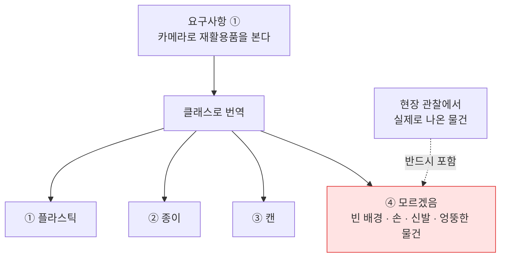

## 닫는 활동 · 10분

조사 기록지를 정리하고 **데이터 수집 계획표**(부록 F)의 클래스 칸을 채웁니다.

**준비물** — 예제 CV-1·2·3 파일, 조사 기록지(부록 E), 촬영 소품

> **교사 준비** — 신뢰도 블록의 이름과 위치는 엔트리 버전에 따라 다릅니다. 사전 점검에서 확인해 예제 파일에 미리 넣어 두세요.

---

# 4차시 — 발명품의 몸: 피지컬 컴퓨팅을 뜯어본다

> **구분** 개발 ② · **PRIMM** I(조사)
> **오늘의 결과물** 조사 기록지 · **동작 설계표 · 순서도** (요구사항 ②③의 실현)

## 목표
- 마이크로비트의 입력–판단–출력 구조를 예제 조작으로 알아낸다.
- 요구사항 ②③「어떻게 판단하고 알려주는가」를 동작 설계표와 순서도로 옮긴다.

## 4차시 단계도

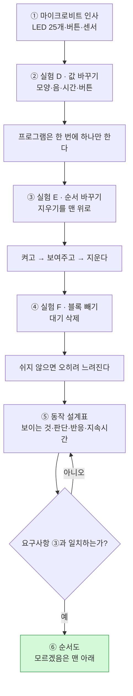

## 4차시 마인드맵

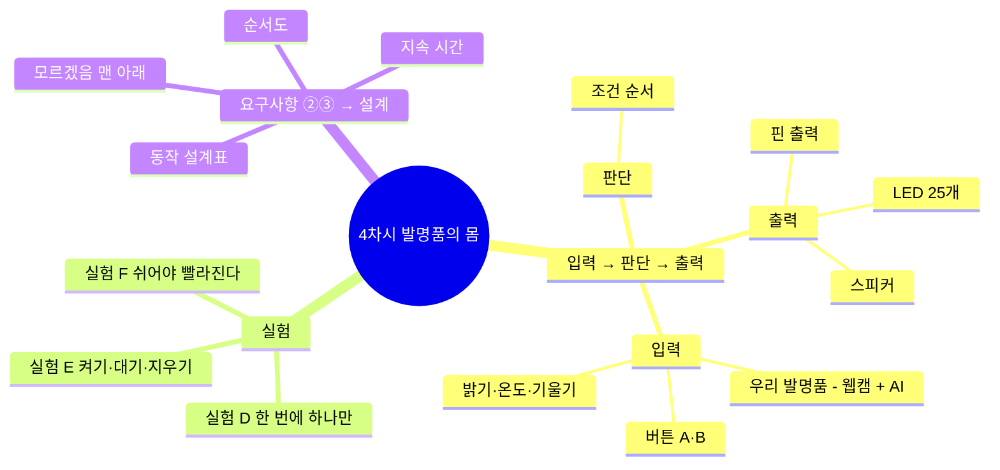

## 피지컬 컴퓨팅이란 — 학생에게 이렇게 설명합니다

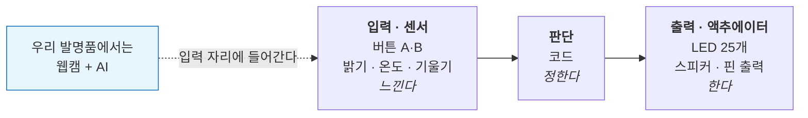

## 여는 활동 · 10분 — 마이크로비트 인사

보드를 손에 들고 LED 25개, 버튼 A·B, 센서를 눈으로 확인합니다. USB로 연결해 하트를 띄워 봅니다.

> **오늘의 질문** — "요구사항 ③에 '소리로 알려준다'고 썼죠. 그런데 **얼마나 오래** 알려줘야 할까요?"

## 활동 1 · 30분 — Investigate ②

```
[예제 PC-1]
계속 반복하기
  만약  마이크로비트 버튼 A를 눌렀는가?  이라면
     마이크로비트 LED에 '하트' 출력하기
     마이크로비트 '도' 음 0.5 초 연주하기
  아니면
     마이크로비트 LED 모두 지우기
```

### 실험 D — 값을 바꾼다 (10분)

| # | 바꿀 것 | 예측 | 실제 |
|---|---|---|---|
| D1 | `'하트'` → `'네모'` | | |
| D2 | `'도'` → `'솔'` | | |
| D3 | `0.5초` → `2초` | | |
| D4 | `버튼 A` → `버튼 B` | | |

> D3에서 버튼을 빠르게 여러 번 눌러 보게 하세요. 소리가 끝날 때까지 다음 입력을 못 받습니다. **"프로그램은 한 번에 한 가지만 합니다."**

### 실험 E — 순서를 바꾼다 (10분)

```
[예제 PC-1′ — LED 지우기를 맨 위로]
계속 반복하기
  마이크로비트 LED 모두 지우기        ← 위로 올림
  만약  버튼 A를 눌렀는가?  이라면
     마이크로비트 LED에 '하트' 출력하기
```

> **예측 질문** — "버튼을 누르면 하트가 보일까요?"

깜빡이거나 거의 안 보입니다. 켜자마자 지워지기 때문입니다.

> **정리 발문** — **켜고 → 잠깐 보여주고 → 지운다.** 이 순서가 나와야 5차시에서 LED가 정상 작동합니다.

### 실험 F — 블록을 빼본다 (10분)

```
[예제 PC-2 — 센서 사용]
계속 반복하기
  ( 마이크로비트 밝기 값 ) 라고 말하기
  0.2 초 기다리기
```

| # | 해볼 것 | 관찰 |
|---|---|---|
| F1 | 손으로 보드를 덮기 | 값이 ____ 로 |
| F2 | 창가로 가져가기 | 값이 ____ 로 |
| F3 | `0.2초 기다리기`를 삭제 | |

> F3에서 화면이 멈춘 것처럼 느려집니다. **"쉬지 않고 일하면 오히려 느려진다"** — 6차시 테스트에서 이 지식이 쓰입니다.

## 쉬는 시간 · 10분

## 활동 2 · 30분 — 요구사항 ②③ → 설계로 번역

### ▸ 동작 설계표 (15분)

부록 G 양식에 클래스 수만큼 줄을 채웁니다. **요구사항 종이를 옆에 펴 두고** 작성합니다.

| 카메라에 보이는 것 | AI의 판단 | 마이크로비트의 반응 | 지속 시간 |
|---|---|---|---|
| 페트병 | 플라스틱 | LED '하트' + '도' 음 | 1초 후 지움 |
| 종이 | 종이 | LED '네모' + '미' 음 | 1초 후 지움 |
| 캔 | 캔 | LED '삼각형' + '솔' 음 | 1초 후 지움 |
| 아무것도 / 엉뚱한 것 | 모르겠음 | LED 'X' | 계속 |

> **점검 발문** — "이 표가 2차시 요구사항 ③과 어긋나는 곳은 없나요? 다르면 **표를 고칠지 요구사항을 고칠지** 팀이 정하고, 고친 이유를 적으세요."

### ▸ 순서도 (15분)

3차시 실험 C를 반영해 '모르겠음'을 맨 아래에 둡니다.

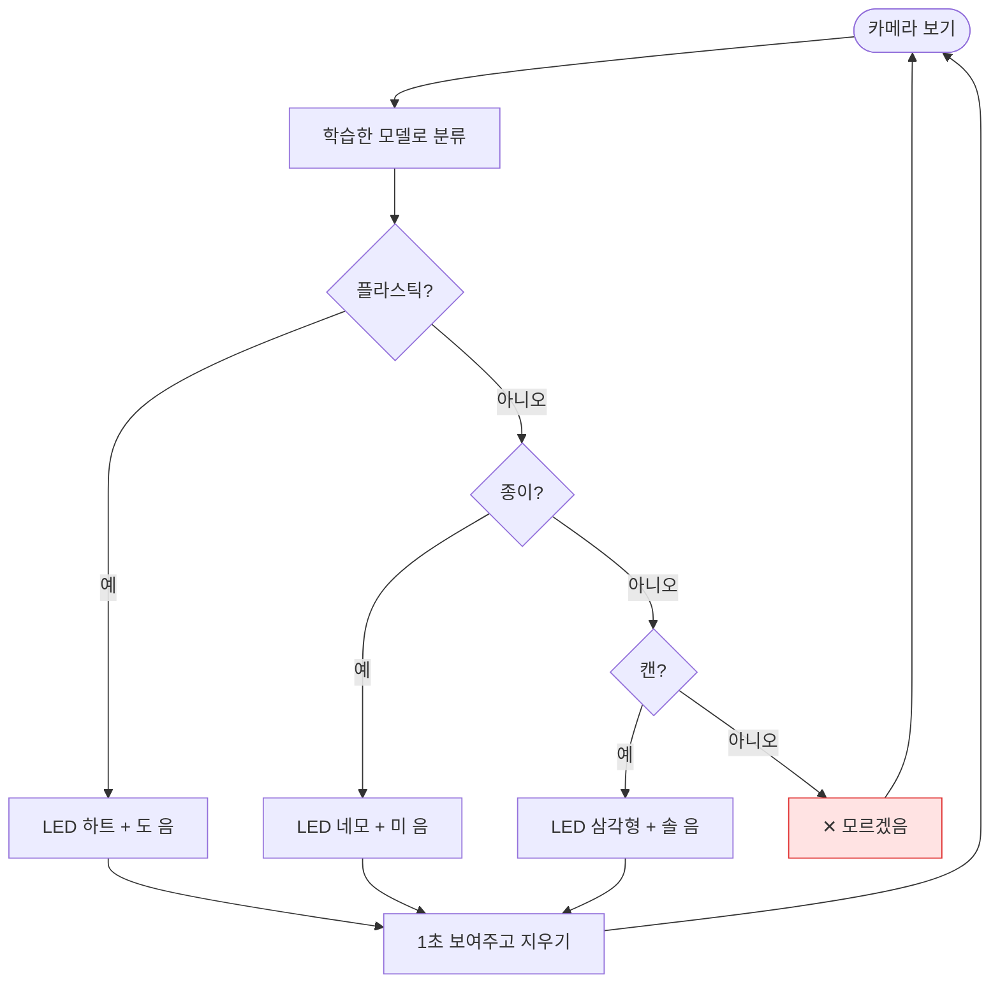

## 닫는 활동 · 10분

데이터 수집 계획표(부록 F)를 완성합니다. **페르소나 카드를 보고** 촬영 장소를 정합니다 — 그 사람이 실제로 쓰는 곳이어야 합니다.

**준비물** — 마이크로비트, 데이터 전송용 USB 케이블, 예제 PC-1·2 파일, 순서도 용지(A3)

---

# 5차시 — 만든다

> **구분** 개발 ③ · **PRIMM** M(Modify) + M(Make)
> **오늘의 결과물** 학습된 모델 · 코드 v0.2 · **시제품 v1.0**

## 목표
- 페르소나의 환경에서 데이터를 모아 모델을 학습시킨다.
- 예제 코드를 설계표대로 고치고, 마이크로비트와 몸체를 붙인다.

## 5차시 단계도

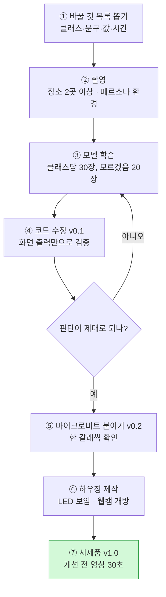

## 5차시 마인드맵

```mermaid
mindmap
  root(("5차시 만든다"))
    데이터
      다양성
        각도
        거리
        밝기
        장소 2곳 이상
      균형
        클래스별 장수 맞추기
      페르소나 환경에서 촬영
    코드
      클래스 이름
      조건 갈래 추가
      안내 문구
      대기 시간
      모르겠음 맨 아래
    하드웨어
      USB·전원 연결
      한 갈래씩 붙이고 확인
      하우징
        LED 노출
        웹캠 개방
    한 번에 하나씩 붙이고 확인

```

## 여는 활동 · 10분

> **오늘의 질문** — "지금까지 남의 코드를 돌려봤죠. 오늘부터는 우리 코드입니다. 예제에서 **뭘 바꿔야** 우리 요구사항대로 될까요?"

바꿔야 할 것을 칠판에 목록으로 뽑습니다. (클래스 이름 / 조건 개수 / LED 모양 / 소리 / 안내 문구 / 대기 시간)

## 활동 1 · 30분 — 데이터 수집과 학습

1. 엔트리 `인공지능 모델 학습하기` → `분류: 이미지` 를 엽니다.
2. 계획표대로 촬영합니다. 클래스당 **30장 이상**, '모르겠음'은 20장.
3. 학습 후 첫 성능을 확인합니다.

> **촬영 지도** — 같은 자리에서 30장을 연속으로 찍으면 다음 차시 테스트에서 반드시 무너집니다. **자리를 두 곳 이상 옮기고, 각도·거리·밝기를 바꿔가며** 찍게 하세요.
>
> **기획 연결** — "우리 페르소나는 어디서 이걸 쓰죠? **거기서 찍어야 합니다.**"

## 쉬는 시간 · 10분

## 활동 2 · 30분 — 코드 수정 · 하드웨어 결합 · 하우징

### ▸ 1단계 : 코드 수정, 화면 출력만으로 검증 (12분)

3차시 예제 CV-3을 열어 **설계표대로 고칩니다.** 백지에서 시작하지 않습니다.

```
[우리 코드 v0.1 — 예제를 고친 것]

시작하기 버튼을 클릭했을 때
  계속 반복하기
    학습한 모델로 분류하기

    만약  분류 결과가 '플라스틱' 인가?  이라면        ← 클래스 이름 수정
       "파란 통이에요" 라고 말하기                  ← 문구 수정

    아니면 만약  분류 결과가 '종이' 인가?  이라면      ← 줄 추가
       "초록 통이에요" 라고 말하기

    아니면 만약  분류 결과가 '캔' 인가?  이라면        ← 줄 추가
       "회색 통이에요" 라고 말하기

    아니면
       "잘 모르겠어요. 다시 보여주세요" 라고 말하기

    1 초 기다리기                                 ← 실험 A로 정한 값
```

**아직 마이크로비트는 붙이지 않습니다.** 두 가지를 한 번에 붙이면 문제가 생겼을 때 원인을 모릅니다.

> **핵심 지도** — **"한 번에 하나씩 붙이고, 붙일 때마다 확인한다."** 6차시 내내 쓰입니다.

### ▸ 2단계 : 마이크로비트 붙이기 (10분)

각 갈래에 **한 갈래씩** 붙이고 매번 확인합니다.

```
[우리 코드 v0.2 — 마이크로비트 추가]

    만약  분류 결과가 '플라스틱' 인가?  이라면
       "파란 통이에요" 라고 말하기
       마이크로비트 LED에 '하트' 출력하기          ← 추가
       마이크로비트 '도' 음 0.5 초 연주하기         ← 추가
       1 초 기다리기                             ← 실험 E 반영
       마이크로비트 LED 모두 지우기                ← 실험 E 반영: 지우기는 마지막
```

### ▸ 3단계 : 하우징 (8분)

골판지·우드락으로 몸체를 만듭니다. 조건은 둘뿐입니다.
- 마이크로비트 **LED가 밖에서 보일 것**
- 웹캠이 **가려지지 않을 것**

## 닫는 활동 · 10분

작동 영상을 30초 정도 찍어 둡니다. 6차시 **개선 전** 자료가 됩니다.

**준비물** — 웹캠 노트북, 흰 배경 전지, 촬영 소품, 마이크로비트, USB 케이블, 건전지 홀더, 골판지, 우드락, 글루건

> **교사 준비 — 반드시 사전 점검**
> 웹캠 AI 처리와 마이크로비트 시리얼 통신을 **동시에** 돌리는 구성입니다. 학교 PC 사양·보안 프로그램에 따라 버벅이거나 연결이 끊길 수 있습니다.
> **수업 2주 전에 실제 사용할 PC로 웹캠 인식부터 LED 출력까지 완주해 보세요.** 문제가 있으면 화면 출력만으로 대체하고 마이크로비트는 시범용으로 운영하는 대안을 준비합니다.

---

# 6차시 — 검증하고 고친다

> **구분** 개발 ④ · **프로세스** 테스트 → 개선 2~3회전
> **오늘의 결과물** 테스트 기록지 · **개선 이력표**

발표회 대신 **검증과 개선에 90분을 온전히 씁니다.** 이 수업에서 가장 중요한 차시입니다.

## 목표
- 2차시 유저 시나리오에 근거해 테스트 조건을 만들고 실패를 수집한다.
- 실패 원인을 데이터·코드·하드웨어로 나누고, 한 번에 하나씩 고쳐 효과를 확인한다.

## 6차시 단계도

```mermaid
flowchart TD
    X1["① 시나리오 → 테스트 조건<br/>페르소나가 쓰는 상황"] --> X2["② 테스트 12개 수행<br/>✕ 목록 확보"]
    X2 --> X3{"③ 원인은 무엇인가?"}
    X3 -->|데이터| D1["사진 15장 추가 → 재학습"]
    X3 -->|코드| D2["조건 순서 · 대기 시간 · 신뢰도"]
    X3 -->|하드웨어| D3["구멍 · 각도 · 케이블"]
    D1 --> X5["⑤ 한 가지만 고치기"]
    D2 --> X5
    D3 --> X5
    X5 --> X6["⑥ 같은 테스트 12개 재실행"]
    X6 --> X7{"좋아졌나?"}
    X7 -->|아니오| X8["되돌리고 다른 원인 시도"] --> X3
    X7 -->|예| X9["⑦ 이력표 기록"]
    X9 -->|"2~3회전"| X3
    X9 --> X10["⑧ 이력표 완성<br/>처음 ○/12 → 마지막 ○/12<br/>요구사항 ①②③ 체크"]
    style X10 fill:#d3f9d8,stroke:#2f9e44
```

## 6차시 마인드맵

```mermaid
mindmap
  root(("6차시 검증과 개선"))
    테스트
      시나리오 기반 조건
      T1~T4 학습한 조건
      T5~T10 바뀐 조건
      T11~T12 속도·지속
      실패를 찾는 것이 성과
    원인 3분류
      데이터
        못 배웠다
        밝기·배경·모르겠음 부족
      코드
        조건 순서
        대기 시간
        신뢰도 기준
      하드웨어
        LED 가림
        카메라 각도
        케이블
    개선 규칙
      한 번에 하나만
      같은 테스트 재실행
      안 되면 되돌린다
    마무리
      신뢰도 0.7 트레이드오프
      요구사항 ①②③ 체크
      다음에 해본다면

```

## 여는 활동 · 10분 — 시나리오를 시험지로 바꾸기

2차시 시나리오 4컷을 펴 놓습니다.

> **오늘의 질문** — "우리 페르소나가 **③번 컷처럼** 쓰면 진짜로 될까요? 오늘 목표는 **잘 되게 하는 것이 아니라 언제 안 되는지 찾는 것**입니다."

시나리오의 장면·장소·손 위치를 그대로 테스트 조건으로 옮깁니다. (T5~T10을 팀이 직접 채우게 합니다.)

## 활동 1 · 30분 — 1차 테스트와 원인 분류

### ▸ 테스트 12개 (18분) — 부록 H

| # | 테스트 조건 | 기대 결과 | 실제 결과 | ○/✕ |
|---|---|---|---|---|
| T1 | 학습한 자리, 정면, 첫 번째 클래스 | | | |
| T2 | 같은 자리, 두 번째 클래스 | | | |
| T3 | 같은 자리, 세 번째 클래스 | | | |
| T4 | 아무것도 없음 | 모르겠음 | | |
| T5 | **시나리오 장소로 이동** | | | |
| T6 | 배경 바꾸기 (게시판 등) | | | |
| T7 | **페르소나 키에 맞춰 낮게 들기** | | | |
| T8 | 멀리서 들기 | | | |
| T9 | 반쯤 가리고 들기 | | | |
| T10 | 엉뚱한 것 (신발, 손) | 모르겠음 | | |
| T11 | 빠르게 물건 바꾸기 | 따라 바뀜 | | |
| T12 | 5분 연속 켜두기 | 계속 작동 | | |

T5~T10에서 대부분 ✕가 나옵니다. **이것이 성과입니다.**

### ▸ 원인 나누기 (12분)

| 증상 | 이건 무슨 문제? | 왜 그렇게 생각하나 |
|---|---|---|
| 창가에서 틀림 | **데이터** | 밝은 곳 사진을 안 찍었음 |
| 신발을 플라스틱이라 함 | **데이터** | '모르겠음'에 신발이 없음 |
| LED가 안 보임 | **하드웨어** | 골판지가 가림 |
| 물건 바꿔도 안 바뀜 | **코드** | 기다리는 시간이 너무 김 |
| 항상 '모르겠음'만 나옴 | **코드** | 조건 순서가 잘못됨 (실험 C) |

> **핵심 발문** — "이건 AI가 못 배운 걸까요, 우리가 코드를 잘못 짠 걸까요, 물건이 잘못 만들어진 걸까요?"
>
> 이 세 갈래로 나누는 능력이 이 수업에서 가르치려는 가장 큰 것입니다.

## 쉬는 시간 · 10분

## 활동 2 · 30분 — 개선 2~3회전

가장 자주 틀리는 실패 **하나**를 골라 고칩니다.

| 원인 | 고치는 방법 |
|---|---|
| **데이터** | 그 조건에서 사진 15장 추가 촬영 → 재학습 |
| **코드** | 조건 순서 바꾸기 / 대기 시간 조정 / 신뢰도 조건 추가 |
| **하드웨어** | 구멍 뚫기 / 카메라 각도 조정 / 케이블 정리 |

고친 뒤 **똑같은 테스트 12개를 다시** 돌리고 ○ 개수를 비교합니다.

> **규칙** — 한 번에 하나만 고칩니다. 두 개를 동시에 고치면 무엇이 효과가 있었는지 알 수 없습니다.

시간이 남으면 **신뢰도 조건**을 시도하게 하세요. (3차시 실험 B)

```
[우리 코드 v0.3 — 신뢰도 조건 추가]

    만약  ( '플라스틱' 에 대한 신뢰도 ) > 0.7  이라면      ← 확실할 때만 반응
       "파란 통이에요" 라고 말하기
       마이크로비트 LED에 '하트' 출력하기
    아니면
       "잘 모르겠어요" 라고 말하기
       마이크로비트 LED에 'X' 출력하기
```

> **발문** — "0.7을 0.9로 올리면? 0.3으로 내리면?"
>
> 올리면 조심스러워지고(놓치는 게 많아짐), 내리면 성급해집니다(틀리는 게 많아짐). **우리 페르소나에게 어느 쪽이 나은지** 팀이 결정하게 합니다. 정답은 없습니다.
>
> 1학년 동생이 쓴다면 — 틀리게 알려주는 것과 자꾸 "모르겠어요" 하는 것 중 무엇이 더 나쁠까요? 기획으로 돌아가 판단하는 순간입니다.

## 닫는 활동 · 10분 — 개선 이력표 완성

**개선 이력표** — 발명품 이름 : ____________________

| 회전 | 무엇이 안 됐나 | 원인은? (데이터/코드/하드웨어) | 무엇을 고쳤나 | 테스트 결과 |
|---|---|---|---|---|
| 1 | | | | ○ ___ / 12 |
| 2 | | | | ○ ___ / 12 |
| 3 | | | | ○ ___ / 12 |

| 항목 | 값 |
|---|---|
| 처음 | ○ ____ / 12 |
| 마지막 | ○ ____ / 12 |
| **좋아진 개수** | **______ 개** |
| ★ 요구사항 3줄은 지켜졌나? | ① ☐  ② ☐  ③ ☐ |
| 아직 못 고친 것 | |
| 다음에 해본다면 | |

마지막 세 칸을 반드시 채우게 합니다. **요구사항 체크는 기획과 개발을 잇는 마지막 매듭입니다.**

> **마무리 발문** — "다 고쳤나요? 아니죠. 발명은 **완성되는 게 아니라 계속 고쳐지는 것**입니다. 여러분은 기획부터 개선까지 한 바퀴를 돌았습니다."

**준비물** — 2차시 기획서 3종, 개선 이력표(A3), 추가 촬영 소품, 공구

---

# 5. 평가

## 5.1 원칙

**작동 여부로 평가하지 않습니다.** 성능이 좋은 팀이 아니라 **기획과 개발이 이어져 있고, 테스트를 성실히 하고, 원인을 제대로 나눈 팀**이 잘한 것입니다.

## 5.2 루브릭

| 구간 | 영역 | 잘함 | 보통 | 노력 요함 |
|---|---|---|---|---|
| 기획 | **문제 정의** | 관찰에 근거해 누구의 문제인지 한 문장으로 좁힘 | 주제는 정했으나 대상이 막연함 | "그냥 불편해서" |
| 기획 | **페르소나** | 실제 인물 관찰에 기반, 현재 해결 방법까지 파악 | 인물은 만들었으나 일반적 | 이름만 적음 |
| 기획 | **벤치마킹** | 3종을 항목별로 비교하고 차별점을 말함 | 나열만 함 | 조사 안 함 |
| 기획 | **시나리오·요구사항** | 시나리오가 요구사항 3줄로 정확히 옮겨짐 | 일부만 연결됨 | 따로 놈 |
| 개발 | **예측 (P)** | 근거를 들어 예측하고 틀린 이유를 설명함 | 예측은 적었으나 근거 없음 | 실행부터 함 |
| 개발 | **조사 (I)** | 값·순서 변경에서 원리를 스스로 말함 | 시키는 대로 바꿔봄 | 조작만 하고 관찰 없음 |
| 개발 | **수정 (M)** | 요구사항·설계표대로 정확히 고침 | 일부만 고침 | 예제 그대로 씀 |
| 개발 | **테스트** | 시나리오에 근거해 조건을 만들고 실패를 정직히 기록 | 대충 돌려봄 | 잘 되는 것만 확인 |
| 개발 | **원인 분석** | 데이터·코드·하드웨어로 정확히 나눔 | 나누기는 함 | "그냥 안 돼요" |
| 개발 | **개선** | 한 번에 하나씩 고치고 효과를 확인함 | 고쳤으나 확인 안 함 | 고치지 못함 |
| 공통 | **협업** | 역할을 바꿔가며 참여하고 의견 차를 대화로 해결 | 맡은 역할은 수행 | 특정 활동에만 참여 |

## 5.3 개인 평가의 근거

3인 1팀이라 팀 산출물만으로는 개인을 볼 수 없습니다. 다음 넷이 개인 기록입니다.

1. **기획 회의 기록** — 1~2차시, 누가 어떤 의견을 냈는지 이름과 함께 남깁니다.
2. **예측 기록지** — 3~5차시 개인별 작성. PRIMM의 P는 항상 따로 씁니다.
3. **역할 수행** — 로테이션 표에서 자기 담당 차시에 무엇을 결정했는지.
4. **개선 이력표 서명** — 각 회전마다 주도한 학생 이름.

---

# 6. 교사 준비물

## 6.1 기획 차시 (1~2차시)

- [ ] 페르소나 카드 양식 (부록 A) · 벤치마킹 비교표 (부록 B)
- [ ] 시나리오 4컷 양식 (부록 C) · **요구사항 A3 양식 (부록 D)**
- [ ] 벤치마킹 자료 카드 — 인터넷 검색이 어려운 경우 대비, 주제별 사진 3~4장 인쇄
- [ ] 클립보드, 포스트잇, 색연필
- [ ] 완성 예제 (1차시 30초 시연용)

## 6.2 개발 차시 — 사전 제작 예제 파일 (가장 중요)

이 수업은 **교사가 미리 만들어 둔 예제 파일**에 전적으로 의존합니다. 없으면 PRIMM이 성립하지 않습니다.

| 파일 | 차시 | 내용 | 비고 |
|---|---|---|---|
| **완성 예제** | 1 | 분류 + LED + 소리 전부 작동 | 학습된 모델 포함 |
| **CV-1** | 3 | 분류 결과만 말하기 | 최소 코드 |
| **CV-2** | 3 | 신뢰도 표시 추가 | |
| **CV-3 / CV-3′** | 3 | 조건 순서가 다른 두 버전 | **두 개 다 필요** |
| **PC-1 / PC-1′** | 4 | 버튼 → LED, 지우기 위치가 다른 두 버전 | **두 개 다 필요** |
| **PC-2** | 4 | 밝기 센서 값 표시 | |

> 예제용 학습 모델(가위바위보 또는 분리수거)도 미리 만들어 두세요. 1·3·4차시는 이 모델을 그대로 씁니다.

## 6.3 장비 · 재료

- [ ] 웹캠 있는 노트북 1대 이상 (2대 권장 — 촬영용/코딩용 분리)
- [ ] 마이크로비트 v2 1개 (여분 1개)
- [ ] **데이터 전송용** USB 케이블 (충전 전용은 작동 안 함)
- [ ] 건전지 홀더 + AAA 건전지
- [ ] 엔트리 하드웨어 연결 프로그램 설치 · 펌웨어 사전 업로드
- [ ] 골판지, 우드락, 글루건, 가위, 커터, 마스킹테이프
- [ ] 흰 배경 전지 또는 천 · 촬영 소품

## 6.4 인쇄물

- [ ] 부록 A 페르소나 카드 · B 벤치마킹 표 · C 시나리오 4컷 · **D 요구사항 A3**
- [ ] 부록 E 예측/조사 기록지 3부 × 3차시(3~5차시)
- [ ] 부록 F 데이터 수집 계획표 · G 동작 설계표 · H 테스트 기록지 · I 개선 이력표 A3
- [ ] 순서도 용지 A3

---

# 7. 주제 예시

1차시에서 학생이 막힐 때만 꺼냅니다. **먼저 보여주지 마세요.**

| 발명품 | 페르소나 예 | 구분할 것 | 마이크로비트 반응 |
|---|---|---|---|
| 분리수거 도우미 | 입학한 지 한 달 된 1학년 | 플라스틱 / 종이 / 캔 / 모르겠음 | 통 색 LED + 안내음 |
| 바른자세 알리미 | 오래 앉으면 등이 굽는 우리 반 친구 | 바른 자세 / 굽은 자세 / 자리 비움 | 지속 시 경고음 |
| 급식 잔반 알리미 | 잔반을 확인해야 하는 급식 도우미 | 다 먹음 / 남김 / 모르겠음 | 웃는 얼굴 / 슬픈 얼굴 |
| 실내화 확인기 | 현관에서 매일 지적받는 동생 | 실내화 / 운동화 / 모르겠음 | ✓ / ✗ |
| 우산 두고 가지 마 | 우산을 자주 잃어버리는 친구 | 우산 있음 / 없음 | 현관 알림음 |

---

# 부록

## 부록 A — 페르소나 카드 (1차시)

**페르소나 카드** — A4로 출력해 사용

| 항목 | 적는 내용 |
|---|---|
| 얼굴 그림 | *(칸을 크게 비워 두고 직접 그리게 합니다)* |
| **이름 · 학년** | |
| **한 줄 소개** | |
| **언제 · 어디서 불편한가** | |
| **지금은 어떻게 하고 있나** | |
| **그래서 무엇이 문제인가** | |
| **진짜로 원하는 것 한 가지** | |

**문제 정의문**

> ____________ 한 **____________** 은(는) ____________ 할 때 ____________ 해서 불편하다.
> → **____________** 과(와) **____________** 을(를) 구분하면 해결할 수 있다.

## 부록 B — 벤치마킹 비교표 (2차시)

| 비교 항목 | ① 사람이 하는 방식 | ② 기존 제품 | ③ 비슷한 기술·앱 | **우리 발명품** |
|---|---|---|---|---|
| 무엇인가 | | | | |
| 누가 쓰나 | | | | |
| 얼마나 빠른가 | | | | |
| 틀릴 때가 있나 | | | | |
| 돈이 드나 | | | | |
| 좋은 점 | | | | |
| 아쉬운 점 | | | | |

**우리 차별점** — 기존 방법은 ____________________ 하지만, 우리는 ____________________ 한다.

## 부록 C — 유저 시나리오 4컷 (2차시)

```mermaid
flowchart LR
    subgraph BEF["BEFORE — 발명품이 없는 지금"]
        direction LR
        B1["① 상황<br/><br/>언제 · 어디서"] --> B2["② 문제 발생<br/><br/>무엇이 곤란한가"]
    end
    subgraph AFT["AFTER — 발명품이 있으면"]
        direction LR
        A1["③ 발명품 사용<br/><br/>무엇을 보여주나"] --> A2["④ 해결<br/><br/>무엇이 달라졌나"]
    end
    B2 ==> A1
    style BEF fill:#fff5f5,stroke:#e03131
    style AFT fill:#ebfbee,stroke:#2f9e44
```

각 컷 아래에 한 문장씩 씁니다.

## 부록 D — 요구사항 (2차시 · A3 출력, 6차시까지 책상 위에)

**요구사항** — 발명품 이름 : ____________________

| | 항목 | 적는 내용 | 개발에서 무엇이 되나 |
|---|---|---|---|
| **①** | 무엇을 보는가 | 카메라로 ____________ 을(를) 본다.<br/>구분할 것 : ①____ ②____ ③____ ④모르겠음 | 3차시 · AI 클래스 |
| **②** | 어떻게 판단하는가 | ______ 이면 ______ 이라고 판단한다.<br/>확실하지 않으면 ____________ 라고 한다. | 4·6차시 · 조건 순서 · 신뢰도 |
| **③** | 어떻게 알려주는가 | ____________ 로 알려준다. (빛 / 소리 / 글자)<br/>알림은 ______ 초 동안 보여준다. | 4차시 · 동작 설계표 |

## 부록 E — 예측 기록지 (개인별 · 3~5차시 매 실험)

**예측 기록지** — 차시 ____  이름 __________  실험 번호 ______

| 항목 | 적는 내용 |
|---|---|
| **무엇을 바꾸나** | |
| **나의 예측** *(실행하기 전에!)* | |
| **그렇게 생각한 이유** | |
| **실제 결과** | |
| **예측과 같았나?** | ☐ 같음   ☐ 다름 |
| **알아낸 것** | |

## 부록 F — 데이터 수집 계획표 (4차시 작성 · 5차시 사용)

| 클래스 | 목표 | 어디서 (2곳 이상, 페르소나 환경 포함) | 어떻게 바꿔 찍나 | 담당 | 실제 |
|---|---|---|---|---|---|
| ① | 30장 | | 각도 / 거리 / 밝기 | | |
| ② | 30장 | | | | |
| ③ | 30장 | | | | |
| ④ 모르겠음 | 20장 | | | | |

> '어떻게 바꿔 찍나' 칸이 비어 있으면 6차시 테스트에서 반드시 무너집니다.

## 부록 G — 동작 설계표 (4차시)

| 카메라에 보이는 것 | AI의 판단 | 마이크로비트의 반응 | 지속 시간 |
|---|---|---|---|
| | | | |
| | | | |
| | | | |
| (엉뚱한 것 / 아무것도 없음) | 모르겠음 | | |

**조건 순서** — 좁고 특별한 것이 위, 넓고 일반적인 것이 아래. '모르겠음'은 맨 아래.
**점검** — 이 표가 부록 D 요구사항 ③과 일치하는가? ☐

## 부록 H — 테스트 기록지 (6차시)

| # | 조건 | 기대 | 실제 | ○/✕ | 원인 (데이터/코드/HW) |
|---|---|---|---|---|---|
| T1 | 학습한 자리, 정면 | | | | |
| T2 | 같은 자리, 두 번째 클래스 | | | | |
| T3 | 같은 자리, 세 번째 클래스 | | | | |
| T4 | 아무것도 없음 | 모르겠음 | | | |
| T5 | **시나리오 장소로 이동** | | | | |
| T6 | 배경 바꾸기 | | | | |
| T7 | **페르소나 키에 맞춰 낮게** | | | | |
| T8 | 멀리서 | | | | |
| T9 | 반쯤 가리기 | | | | |
| T10 | 엉뚱한 것 | 모르겠음 | | | |
| T11 | 빠르게 바꾸기 | | | | |
| T12 | 5분 연속 작동 | | | | |

**○ 개수 : ____ / 12**

## 부록 I — 개선 이력표 (6차시)

| 회전 | 무엇이 안 됐나 | 원인 | 무엇을 고쳤나 | ○/12 | 주도한 사람 |
|---|---|---|---|---|---|
| 1 | | | | | |
| 2 | | | | | |
| 3 | | | | | |

처음 ○ ____ / 12  →  마지막 ○ ____ / 12  →  **____개 좋아졌다**

요구사항은 지켜졌나?  ① ☐   ② ☐   ③ ☐

아직 못 고친 것 : ________________________________

다음에 해본다면 : ________________________________

---

# 8. 교사용 메모

## 8.1 기획 2차시를 망치는 세 가지

1. **교사가 주제를 정해 주기** — 가장 흔한 실패입니다. 시간이 없어도 참으세요. 자기가 고른 문제라야 6차시까지 버팁니다.
2. **페르소나를 상상으로 만들기** — "우리 학교 학생들"은 페르소나가 아닙니다. **이름과 학년이 있는 한 사람**이어야 합니다.
3. **벤치마킹을 검색만 하고 끝내기** — 비교표의 '아쉬운 점' 칸이 채워지지 않으면 벤치마킹을 안 한 것입니다.

## 8.2 개발 4차시를 망치는 세 가지

1. **예측을 건너뛰기** — 아이들은 실행 버튼을 먼저 누르고 싶어 합니다. 예측지를 걷은 뒤에 실행을 허락하는 방식으로 물리적으로 막으세요.
2. **교사가 답을 먼저 말하기** — "이렇게 하면 이렇게 돼"라고 말하는 순간 조사(I)가 사라집니다. 끝까지 질문으로만 대응하세요.
3. **너무 큰 예제를 주기** — 예제는 **10줄을 넘기지 않아야** 합니다.

## 8.3 시간이 부족할 때

줄이는 순서입니다.

1. 먼저 — 5차시 하우징 제작 (종이컵·상자로 간소화)
2. 다음 — 1차시 불편함 20개를 10개로
3. 다음 — 4차시 실험 F (센서)
4. 다음 — 2차시 벤치마킹 ③(비슷한 앱) 생략
5. **절대 줄이지 말 것** — **2차시 요구사항 3줄**, **3차시 실험 C(조건 순서)**, **6차시 전체**

이 셋이 빠지면 남는 것은 평범한 따라 하기 수업입니다.

## 8.4 3명이라 생기는 일

- **한 명이 다 해버림** — 역할표를 벽에 붙이고, 담당 아닌 학생이 마우스를 잡으면 교사가 개입합니다.
- **의견이 2:1로 갈림** — 다수결로 넘기지 말고 소수 의견을 요구사항 종이 여백에 적어둡니다. 6차시 "다음에 해본다면"에 그 의견이 들어가는 경우가 많습니다.
- **한 명 결석** — 타격이 큽니다. 차시 산출물을 반드시 사진으로 남겨 공유하세요.

## 8.5 자주 나오는 기술 문제

| 증상 | 원인 | 대처 |
|---|---|---|
| 웹캠이 안 잡힘 | 브라우저 권한 미허용 | 주소창 카메라 아이콘에서 허용 |
| 마이크로비트 연결 안 됨 | 충전 전용 USB 케이블 | 데이터 전송용으로 교체 |
| 한쪽 클래스로만 분류됨 | 클래스별 사진 수 불균형 | 적은 쪽 보충 후 재학습 |
| 프로그램이 버벅임 | 웹캠 + 시리얼 동시 부하 | 다른 프로그램 종료, 대기 시간 추가 |
| LED가 계속 깜빡임 | 반복문마다 재출력 | 켜기 → 대기 → 지우기 순서 확인 (실험 E) |
| 반응이 한 박자 늦음 | 대기 시간이 김 | 실험 A 결과를 근거로 조정 |

## 8.6 참고

- **PRIMM** — Sue Sentance 등이 제안한 프로그래밍 교수법. Predict–Run–Investigate–Modify–Make. 백지 코딩의 좌절을 줄이고, 남의 코드를 읽는 능력부터 기르는 접근입니다.
- **Dancing with AI** — MIT Media Lab Personal Robots Group
  https://dancingwithai.media.mit.edu/
  Day 1~5 교사용 스크립트 공개(영어). 본 커리큘럼이 가져온 활동 — 몸짓 스무고개, 학습 데이터 추리, 배경 조건 비교 실험.
- **페르소나·시나리오** — 디자인 씽킹의 공감(Empathize)·정의(Define) 단계를 초등 수준으로 축약한 것입니다.

---

*엔트리 블록 이름과 마이크로비트 연결 절차는 도구 버전에 따라 달라질 수 있습니다. 예제 파일을 만들 때 함께 확인해 주세요.*
