# AI 발명 프로젝트 — 90분 실습 상세 지도안

## 초등 5학년 · 3인 1팀 · 6차시 · **고친다 → 테스트한다 → 이해한다**

### 개발 환경 : 엔트리(인공지능 이미지 분류) + 마이크로비트 v2 + 웹캠 · AI 도구 병행

---

| 항목 | 내용 |
|---|---|
| **차시** | 6차시 × 90분 = 540분 |
| **구성** | 1~2차시 기획 · 3~6차시 제작 |
| **핵심 방식** | **MTU 루프** — Modify(고친다) → Test(테스트한다) → Understand(이해한다) |
| **실습 비중** | **전체 540분 중 실습 380분 (70%)** · 설명은 회당 최대 10분 |
| **개발 환경** | 엔트리 웹 · 마이크로비트 v2 · 웹캠 노트북 · 엔트리 하드웨어 연결 프로그램 |
| **AI 활용** | ① 교사가 자료 제작 ② AI 초안 코드를 학생이 테스트·수정 ③ 학생이 규칙 안에서 질문 |
| **운영 주기** | **주 1회 × 6주** — 차시 사이 일주일이 교사 준비 시간 |
| **학습 데이터** | **교사 베이스 + 학생 보충** — 교사가 클래스당 30장(의도적 약점 포함), 학생은 '모르겠음'과 개선 보충만 |
| **선행 문서** | `초등5학년_AI발명_통합수업안.md` (전체 설계) · `(예시)-분리수거도우미_예제파일_제작가이드.md` (예제 8종) |

> **이 문서의 역할** — 통합수업안이 "무엇을 왜"라면, 이 문서는 **"90분 동안 손으로 무엇을 하는가"** 입니다. 분 단위 진행, 실습 카드, 교사 대사, AI 활용 지점, 산출물 체크까지 담았습니다.

---
---

# 0부 · 이 방식이어야 하는 이유

> 요청하신 "이 방식으로 할 수밖에 없는지"에 대한 답입니다. **결론부터 — 6차시·3인·초등 5학년·AI 하드웨어라는 네 조건이 겹치면 선택지가 사실상 하나로 좁혀집니다.**

## 0.1 네 가지 방식을 실제로 돌려보면

| 방식 | 1~2차시 | 3~4차시 | 5~6차시 | 6차시 뒤에 남는 것 |
|---|---|---|---|---|
| **① 강의 + 따라 치기** | 개념 설명 | 화면 보고 그대로 조립 | 완성 · 발표 | 작동하는 결과물. **다음 주면 아무도 못 고침** |
| **② 백지에서 창작** | 개념 + 아이디어 | 막힘 · 교사 호출 폭주 | 미완성 | 좌절. 한 명이 다 하고 둘은 구경 |
| **③ 자율 프로젝트** | 주제 탐색 | 각자 다른 문제로 흩어짐 | 팀마다 진도 격차 3배 | 잘하는 팀만 완성 |
| **④ 고치기 → 테스트 → 이해 (본 안)** | 기획 완결 | **작동하는 코드를 고쳐가며 원리 습득** | 테스트 · 개선 | **왜 그렇게 됐는지 말할 수 있는 결과물** |

## 0.2 왜 ①·②·③이 이 조건에서 무너지는가

### ① 따라 치기가 무너지는 지점

블록 코딩은 **따라 치면 무조건 돌아갑니다.** 그래서 학생은 한 번도 틀리지 않고 6차시를 마칩니다. 문제는 5차시 테스트입니다. 창가에서 오작동이 나는 순간, 따라 친 학생은 **어디를 봐야 할지 모릅니다.** 자기가 조립한 블록의 의미를 한 번도 물어본 적이 없기 때문입니다.

> 이 수업의 최종 산출물은 발명품이 아니라 **개선 이력표**입니다. 따라 치기로는 이력표의 "원인은?" 칸을 채울 수 없습니다.

### ② 백지 창작이 무너지는 지점

초등 5학년이 엔트리 AI 블록 + 마이크로비트 시리얼을 백지에서 조립하려면, **블록을 찾는 데만** 한 차시가 갑니다. 90분 중 60분이 "그 블록 어디 있어요?"로 사라집니다. 3인 팀에서는 여기서 **가장 빠른 한 명이 마우스를 독점**하고 수업이 끝납니다.

### ③ 자율 프로젝트가 무너지는 지점

주제가 팀마다 다르면 교사가 세 배로 필요합니다. 1팀 수업이면 가능해 보이지만, **실패 사례를 비교할 대상이 없어** 6차시 개선의 재료가 빈약해집니다.

## 0.3 그래서 남는 방식 — MTU 루프

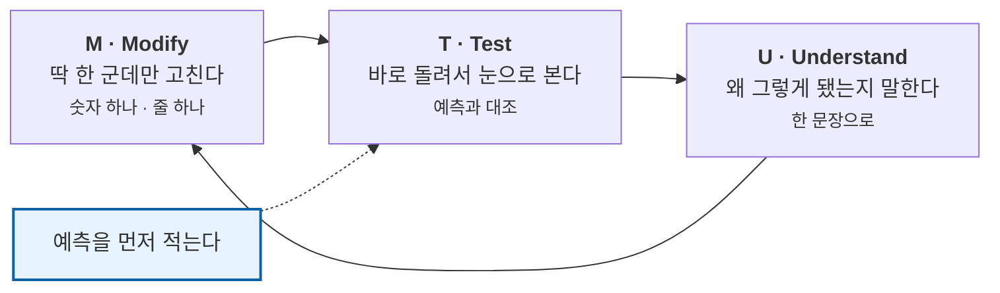

**한 바퀴에 4~6분.** 이 수업의 모든 실습은 이 루프의 반복입니다. 6차시 동안 학생은 이 루프를 **약 40회** 돕니다.

| MTU가 해결하는 것 | 어떻게 |
|---|---|
| 백지 공포 | 코드가 이미 돌아간다. 학생은 **한 군데만** 고친다 |
| 이해 없는 조립 | 고친 결과를 **즉시** 보므로, 원인–결과가 4분 안에 붙는다 |
| 한 명 독점 | 고칠 지점이 1군데뿐이라 **셋이 돌아가며** 손댈 수 있다 |
| 개선 단계 부실 | 5·6차시의 개선이 3·4차시 MTU와 **똑같은 동작**이다 |

## 0.4 예상되는 반론과 답

| 반론 | 답 |
|---|---|
| "남의 코드만 고치면 창의성이 없지 않나요?" | 창의성은 **무엇을 구분할지 정하는 기획(1~2차시)** 과 **무엇을 고칠지 정하는 개선(6차시)** 에 있습니다. 블록을 처음부터 쌓는 것은 창의가 아니라 **타이핑**입니다 |
| "이해를 먼저 시키고 실습해야 하지 않나요?" | 5학년에게 `만약~아니면`의 단락 평가를 말로 설명하면 30초 만에 잊습니다. **순서를 바꾼 두 파일을 나란히 돌려보면** 평생 안 잊습니다 |
| "AI가 코드를 써 주면 학생이 배우는 게 있나요?" | AI가 쓴 코드도 **반드시 틀립니다.** 이 수업에서 AI 코드는 정답이 아니라 **테스트 대상**입니다 (4차시 참조) |
| "6차시로 부족하지 않나요?" | 부족합니다. 그래서 **MUST 기능을 3개로 제한**하고 나머지는 "다음에 해본다면"으로 보냅니다 |

## 0.5 결론

> **6차시 · 3인 · 초등 5학년 · 실물 하드웨어**라는 조건에서 "고쳐서 완성하는 경험"까지 가려면,
> **작동하는 코드에서 출발해 한 번에 한 군데씩 고치고 즉시 테스트하는 방식 외에 완주 가능한 경로가 없습니다.**

---
---

# 1부 · 실습 운영의 공통 규칙

이 규칙들은 **6차시 내내 동일하게** 적용됩니다. 첫 차시에 벽에 붙이고 시작하세요.

## 1.1 실습 카드 — 모든 실습의 기본 단위

```
┌─ 실습 [번호] ──────────────────────── [분] ─┐
│                                              │
│  ① 고친다   무엇을 : ______________________  │
│             딱 한 군데만!                     │
│                                              │
│  ② 예측한다 (실행 버튼 누르기 전에)            │
│             ______________________________   │
│             왜 그렇게 생각했나 : ___________   │
│                                              │
│  ③ 테스트한다  실행 → 3번 반복                 │
│             실제 결과 : ___________________   │
│                                              │
│  ④ 이해한다  한 문장으로                       │
│             "___________ 하면 ___________"    │
│                                              │
│  ⑤ 되돌린다  ☐ 원래대로 돌려놓았다             │
└──────────────────────────────────────────────┘
```

> **⑤ 되돌리기를 반드시 체크시키세요.** 실험한 채로 두면 다음 실습이 오염되고, 4차시에 무엇이 원본인지 아무도 모르게 됩니다.

## 1.2 실습 3대 규칙 — 벽에 붙일 것

```
 ┌────────────────────────────────────────────────┐
 │                                                │
 │   ①  한 번에 한 군데만 고친다                    │
 │       두 개 고치면 무엇 때문인지 모른다            │
 │                                                │
 │   ②  예측을 적기 전에는 실행 버튼을 누르지 않는다   │
 │       예측 없는 실행은 그냥 구경이다               │
 │                                                │
 │   ③  고쳤으면 반드시 되돌린다                    │
 │       원본이 살아 있어야 다음 실험을 한다           │
 │                                                │
 └────────────────────────────────────────────────┘
```

## 1.3 3인 손 규칙 — 마우스 독점 방지

| 시점 | 마우스를 잡는 사람 |
|---|---|
| 실습 카드 ① 고친다 | **그 차시 '머리 담당'** |
| 실습 카드 ③ 테스트한다 | **그 차시 '눈 담당'** (카메라 앞 조작) |
| 실습 카드 기록 | **그 차시 '몸 담당'** |
| **실습이 끝날 때마다** | **한 칸씩 이동** |

> 실습 하나가 끝나면 자리를 바꿉니다. 4~6분마다 손이 바뀌므로 한 명이 독점할 수 없습니다.
> **교사 개입 신호** — 담당 아닌 학생이 마우스를 잡으면 말없이 실습 카드를 손가락으로 가리킵니다.

## 1.4 AI 사용 신호등 — 1차시에 반드시 합의

학생이 수업 중 AI에게 질문할 수 있습니다. 다만 **PRIMM의 예측(P)과 조사(I)를 대신하게 하면 수업이 무너집니다.** 그래서 신호등으로 구분합니다.

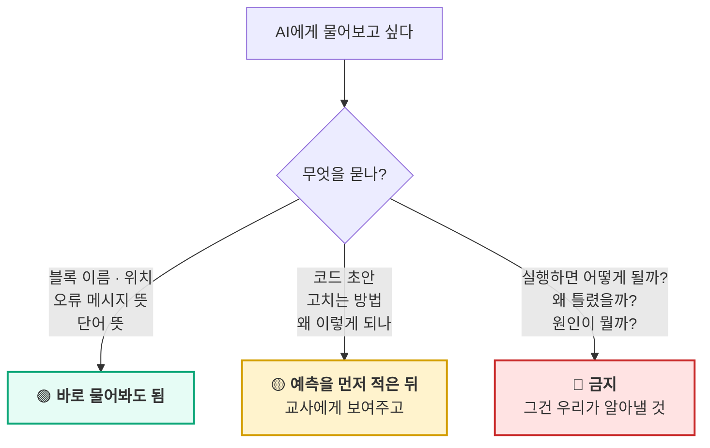

| 신호 | 예시 질문 | 이유 |
|---|---|---|
| 🟢 | "엔트리에서 신뢰도 블록 어디 있어?" · "'하드웨어 연결 안 됨'이 무슨 뜻이야?" | 도구 사용법은 배움의 대상이 아님 |
| 🟡 | "이 코드에 클래스 하나 더 넣으려면?" · "왜 LED가 깜빡여?" | 예측지를 먼저 쓴 뒤에만. **AI 답을 그대로 쓰지 않고 테스트로 확인** |
| 🔴 | "이거 실행하면 어떻게 돼?" · "우리 AI가 왜 틀렸어?" | **예측(P)과 원인 분석은 학생의 일.** 여기를 넘기면 수업의 목적이 사라짐 |

> **학생에게 하는 말** — "AI는 **블록 사전**으로 써요. **점쟁이로 쓰면 안 돼요.**
> 실행하면 어떻게 될지는 여러분이 맞혀야 재밌어요."

## 1.5 개발 환경 사전 체크 (매 차시 시작 5분 전)

```
□ 엔트리 접속 · 로그인 확인
□ 웹캠 권한 허용 (주소창 카메라 아이콘)
□ 마이크로비트 USB 연결 (데이터 전송용 케이블인지 확인)
□ 엔트리 하드웨어 연결 프로그램 실행 · 연결 상태 초록
□ 예제 파일 열어 1회 시운전
□ 다른 프로그램 종료 (웹캠 + 시리얼 동시 부하 대비)
```

> **3차시 이후 매 차시, 학생이 직접 이 체크리스트를 수행합니다.** 교사가 대신 해 주면 학생은 6차시까지 연결 방법을 모릅니다.

---
---
---

# 2부 · 차시별 90분 상세 지도안

---
---

# 【1차시】 프로세스를 알고, 주제를 고른다

> **결과물** 예측 기록지 3장 · 문제 카드 1장 · **팀 주제 1개**
> **실습 비중** 90분 중 55분

## 1차시 분 단위 진행표

| 시간 | 구간 | 활동 | 형태 | 산출 |
|---|---|---|---|---|
| 00–05 | 여는 | 환경 체크 시범 · 오늘 할 일 안내 | 교사 | — |
| 05–15 | 여는 | **몸짓 스무고개 3라운드** | 실습 | 특징 목록 |
| 15–20 | 여는 | 발명 프로세스 6단계 · MTU 소개 | 교사 10분 미만 | — |
| 20–30 | 활동1 | **Predict — 완성 예제 예측지 작성** | 개인 실습 | 예측 기록지 |
| 30–50 | 활동1 | **Run — 완성 예제 돌려보기 + 이상한 물건** | 실습 | 실제 결과 |
| 50–60 | 쉬는 시간 | | | |
| 60–70 | 활동2 | **경계 찾기 — 세 질문** | 개인 실습 | 세 숫자 |
| 70–82 | 활동2 | **갈래에서 찾기 · 주제 후보 5개** | 팀 실습 | 후보 목록 |
| 82–88 | 닫는 | 3조건 점검 · 주제 확정 | 팀 | 문제 카드 |
| 88–90 | 닫는 | AI 신호등 합의 · 다음 차시 예고 | 교사 | 서명 |

---

## 00–05 · 환경 체크 시범

교사가 §1.5 체크리스트를 **화면에 띄우고 소리 내어 하나씩** 수행합니다.

> **대사** — "3차시부터는 이걸 여러분이 직접 해요. 오늘은 보기만 하세요."

---

## 05–15 · 실습 0 — 몸짓 스무고개

```
┌─ 실습 0 ── 몸짓 스무고개 ──────────── 10분 ─┐
│ 3라운드. 한 명이 몸짓만, 둘이 맞힌다.        │
│ 라운드마다 역할을 바꾼다.                    │
│                                             │
│ 라운드 1 : 동물     맞힌 사람 ______        │
│ 라운드 2 : 운동     맞힌 사람 ______        │
│ 라운드 3 : 학교 물건 맞힌 사람 ______        │
│                                             │
│ ▸ 무엇을 보고 알아맞혔나 (3개만)             │
│   ① __________ ② __________ ③ __________  │
└─────────────────────────────────────────────┘
```

> **발문** — "무엇을 보고 알아맞혔어요?"
> 손 위치 · 몸의 기울기 · 반복 동작 → 칠판에 적고 **"특징"** 이라고 이름 붙입니다.
>
> **연결 대사** — "컴퓨터도 똑같아요. 사진 전체를 외우는 게 아니라 **특징**을 봐요."
> **심리학 연결** — "몇 개 안 봤는데 맞혔죠? 사람도 몇 개만 보고 판단하는군요."

---

## 15–20 · 발명 프로세스와 MTU (교사 설명 5분)

칠판에 두 그림만 그립니다. **5분을 넘기지 마세요.**

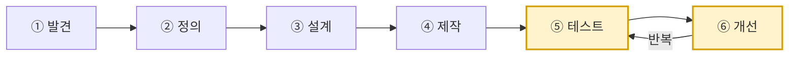

> **대사** — "발명은 언제 끝날까요?"
> (아이들: "완성되면요")
> "아니에요. **발명은 완성되는 게 아니라 계속 고쳐지는 거예요.** 그래서 마지막 시간이 발표회가 아니라 **고치는 시간**입니다."

이어서 MTU를 한 줄로.

> **대사** — "우리는 3차시부터 계속 이걸 해요. **한 군데 고치고 → 바로 돌려보고 → 왜 그런지 말하기.** 이거 한 바퀴에 5분이에요."

---

## 20–30 · 실습 1 — Predict (개인 · 10분)

`00_완성예제_분리수거도우미` 를 화면에 띄웁니다. **절대 실행하지 않습니다.**

```
[ 시작하기 버튼을 클릭했을 때 ]
  [ 마이크로비트 모든 LED 끄기 ]
  [ "분리수거 도우미를 시작합니다" 를 (2) 초 동안 말하기 ]
  [ 계속 반복하기 ]
      [ 학습한 모델로 분류하기 ]
      [ 만약  (분류 결과) = (플라스틱)  이라면 ]
          [ "파란 통이에요" 라고 말하기 ]
          [ 하트 보여주기 ]
          [ 마이크로비트 (도) 음을 (0.5) 초 연주하기 ]
      [ 아니면 만약  (분류 결과) = (종이)  이라면 ]
          [ "초록 통이에요" 라고 말하기 ]
          [ 네모 보여주기 ]
          [ 마이크로비트 (미) 음을 (0.5) 초 연주하기 ]
      [ 아니면 만약  (분류 결과) = (캔)  이라면 ]
          [ "회색 통이에요" 라고 말하기 ]
          [ 세모 보여주기 ]
          [ 마이크로비트 (솔) 음을 (0.5) 초 연주하기 ]
      [ 아니면 ]
          [ "잘 모르겠어요. 다시 보여주세요" 라고 말하기 ]
          [ 엑스 보여주기 ]
      [ (1) 초 기다리기 ]
      [ 마이크로비트 모든 LED 끄기 ]
```

**세 명이 각자 따로 씁니다. 상의 금지.**

| # | 예측 질문 | 나의 예측 | 그렇게 생각한 이유 |
|---|---|---|---|
| P1 | 페트병을 보여주면? | | |
| P2 | 연필을 보여주면? | | |
| P3 | 아무것도 안 보여주면? | | |
| P4 | `1초`를 `5초`로 바꾸면? | | |
| P5 | 마이크로비트에는 뭐가 나올까? | | |

> **교사 운영** — **예측지를 걷은 뒤에 실행을 허락합니다.** 이것이 물리적 장치입니다.
> "저건 뭐예요?"라는 질문에는 **"3차시에 하나씩 뜯어볼 거야"** 로만 답하세요. 지금 설명하면 궁금증이 죽습니다.

---

## 30–50 · 실습 2 — Run (팀 · 20분)

### 30–40 · 예측한 것 확인

| 순서 | 보여줄 것 | 누가 | 실제 결과 | 예측과 |
|---|---|---|---|---|
| 1 | 페트병 | A | | ☐같음 ☐다름 |
| 2 | 우유팩 | B | | ☐같음 ☐다름 |
| 3 | 캔 | C | | ☐같음 ☐다름 |
| 4 | 아무것도 없음 | A | | ☐같음 ☐다름 |
| 5 | 연필 | B | | ☐같음 ☐다름 |

### 40–50 · **일부러 이상한 것 보여주기** ★ 오늘의 핵심

```
┌─ 실습 2-B ── AI를 골탕 먹여라 ──────── 10분 ─┐
│ 목표 : AI가 이상하게 반응하는 순간을 5개 찾기  │
│                                               │
│  ☐ 신발            → 뭐라고 했나 __________   │
│  ☐ 손              → __________              │
│  ☐ 얼굴            → __________              │
│  ☐ 페트병 반쯤 가리기 → __________            │
│  ☐ 창가로 가져가기   → __________             │
│  ☐ 물건 아주 빠르게 바꾸기 → __________       │
│                                               │
│  가장 놀랐던 것 : ___________________________ │
└───────────────────────────────────────────────┘
```

> **핵심 발문** — "예측이 맞은 건 몇 개? 틀린 건 뭐였어요? **왜 틀렸다고 생각해요?**"
>
> **교사 유의** — 틀린 학생에게 "아니야"라고 하지 마세요.
> **"오, 그렇게 생각했구나. 왜 그렇게 생각했어?"** 로 받습니다.
>
> **닫는 대사** — "여러분이 방금 찾은 이상한 반응들, **3차시에 왜 그런지 알아낼 거예요.**"

---

## 50–60 · 쉬는 시간 (몸 움직이기 · 반드시 지킬 것)

---

## 60–70 · 실습 3 — 경계 찾기 (개인 · 10분)

칠판에 세 질문. **혼자 씁니다. 상의 절대 금지.**

```
 ①  컵에 물이 얼마나 남아야  "비었다"  인가요?   → _______%
 ②  책상에 물건이 몇 개 있어야 "지저분하다" 인가요? → _______개
 ③  줄이 몇 명부터  "길다"  인가요?              → _______명
```

세 명의 답을 칠판에 나란히 적습니다. **반드시 다릅니다.**

| | A | B | C |
|---|---|---|---|
| ① 비었다 | ___% | ___% | ___% |
| ② 지저분 | ___개 | ___개 | ___개 |
| ③ 길다 | ___명 | ___명 | ___명 |

> **발문 1** — "세 명이 다 다르네요. **누가 맞아요?**"
> **발문 2** — "그럼 이 선은 어디 있는 거예요? **컵에 그어져 있어요?**"
> **발문 3** — "아까 우리가 본 AI한테는 **누가 이 선을 정해줬을까요?**"

```
   ┌──────────────────────────────────────────┐
   │      AI에게는 우리가 선을 그어 줍니다.        │
   │      이번에 그 선을 긋는 사람은 여러분입니다.  │
   └──────────────────────────────────────────┘
```

---

## 70–82 · 실습 4 — 갈래에서 주제 찾기 (팀 · 12분)

갈래 카드 5장을 벽에 붙입니다. **갈래 이름과 한 줄 질문만.** 예시는 절대 붙이지 않습니다.

```
 ┌──────────────┐ ┌──────────────┐ ┌──────────────┐
 │   ① 사물      │ │   ② 상태      │ │   ③ 몸짓      │
 │ "이건 무엇인가" │ │ "어떻게 되었나" │ │ "무엇을 말하나" │
 └──────────────┘ └──────────────┘ └──────────────┘
 ┌──────────────┐ ┌──────────────┐
 │  ④ 있다/없다   │ │  ⑤ 애매한 것   │
 │ "거기 있나"    │ │ "어디부터인가"  │
 └──────────────┘ └──────────────┘
```

**팀이 돌아다니며 각 갈래마다 우리 학교 이야기를 하나씩 씁니다.**

| 갈래 | 우리 학교 이야기 |
|---|---|
| ① 사물 | |
| ② 상태 | |
| ③ 몸짓 | |
| ④ 있다/없다 | |
| ⑤ 애매한 것 | |

### 막혔을 때만 — 주제카드 10선 (고민 문장만 낭독)

```
   1단계   "다섯 갈래 중 어떤 게 제일 끌려요?"
   2단계   "그 갈래에서 우리 학교 이야기 세 개만"
   3단계   "셋 중에 사진으로 찍을 수 있는 건?"
   4단계   그래도 못 고르면 → 아래 고민 문장만 읽어줌
```

| # | 발명품 | 난이도 | 고민 문장 (이것만 읽습니다) |
|---|---|---|---|
| 01 | 분리수거 짝꿍 | ★☆☆ | "쓰레기통에 자꾸 다 섞여 있어요. 저도 우유팩을 어디 넣는지 잘 몰라요." |
| 02 | 잔반 응원단 | ★★☆ | "급식 남기면 죄송한데, 억지로 먹으라는 것도 싫어요." |
| 03 | 거북목 알리미 | ★★☆ | "어느새 얼굴이 책에 닿아 있어요. 제가 언제 굽는지 제가 몰라요." |
| 04 | 현관 지킴이 | ★☆☆ | "비 오는 날 아침에만 우산이 있고, 집에 갈 때는 항상 없어요." |
| 05 | 손 씻기 응원 로봇 | ★★☆ | "손 씻으라는데 물만 묻히고 오는 애들이 많아요. 저도 가끔 그래요." |
| 06 | 모퉁이 안전 눈 | ★★☆ | "복도 모퉁이에서 반대편이 안 보여요. 세게 부딪혔어요." |
| 07 | 식물 돌보미 | ★★★ | "어떤 날은 두 번 주고 어떤 날은 아무도 안 줘요. 방울토마토는 그렇게 죽었어요." |
| 08 | 신발 검문소 | ★☆☆ | "운동화 그대로 들어오는 애들 때문에 바닥이 엉망이에요. 청소는 우리가 하는데요." |
| 09 | 말 거는 게시판 | ★☆☆ | "포스터를 붙였는데 아무도 안 멈춰요. 열심히 그렸는데 속상해요." |
| 10 | 물 마시기 알리미 | ★★★ | "아침에 채운 물이 그대로예요. 목마른 줄도 몰랐어요." |

**처음이라면** 01·08·09  **도전이라면** 06·07·10  **캠페인까지** 01·05·09

> **갈래 ⑤를 고른 팀에게 미리** — "이건 답이 없는 문제예요. AI가 잘 맞히기 어려울 거예요. 그런데 **왜 어려운지 알아내는 것**이 여러분의 발명이 될 거예요."

---

## 82–88 · 3조건 점검 + 문제 카드

```
□ 1. 이 불편함을 우리 셋 다 겪어본 적이 있다.
□ 2. "무엇과 무엇을 구분하면 되나?"에 3~4개로 답할 수 있다.
□ 3. 그중 하나는 '모르겠음'이다.
□ 4. 학교 안에서 클래스당 30장을 찍을 수 있다.
□ 5. 구분한 다음 마이크로비트가 무엇을 할지 한 문장으로 말할 수 있다.
```

**하나라도 ✕면 주제를 바꾸는 게 아니라 좁힙니다.**

```
┌────────────────────────────────────────────────┐
│              우리 팀 문제 카드                    │
│  우리가 찾은 불편함 : ________________________   │
│  누가 불편한가      : ________________________   │
│  어느 갈래인가      : ① ② ③ ④ ⑤                │
│  무엇과 무엇을 구분하면 해결되는가                  │
│     ① _________  ② _________  ③ _________     │
│     ④ 모르겠음                                  │
└────────────────────────────────────────────────┘
```

### ⚠ 사람을 분류하는 주제는 하지 않습니다

```
   ✕ 남자/여자   ✕ 기분 좋은 친구/나쁜 친구
   ✕ 공부 잘하는 친구   ✕ 우리 반 친구 얼굴
```

> "사람을 사진 몇 장으로 나누면, 거기 안 맞는 사람은 어떻게 될까요? AI는 반드시 **어느 한쪽으로 밀어 넣어요.** 사람한테 그러면 안 돼요."
> **허용** — 본인·팀원이 **의도적으로 만든 신호**(손동작, 자세).

---

## 88–90 · AI 신호등 합의 + 예고

§1.4 신호등을 벽에 붙이고 **셋이 서명**합니다.

```
   우리는 AI를 블록 사전으로 씁니다. 점쟁이로 쓰지 않습니다.
   🔴 "실행하면 어떻게 돼?" 는 묻지 않습니다. 우리가 맞힙니다.

   서명 :  A ________  B ________  C ________
```

> **예고** — "다음 시간에 **기획을 다 끝냅니다.** 그다음부터 마지막까지는 계속 만들고 고쳐요."
> **숙제** — 각자 그 문제를 겪는 사람 한 명을 눈여겨보고 오기.

> ### 🚨 교사 — 오늘 수업이 끝나는 순간 시계가 돌아갑니다
>
> 주제가 확정됐습니다. **3차시까지 2주. 이 사이에 베이스 데이터셋을 찍어야 합니다.**
> 클래스가 아직 확정 전(2차시)이라 완전히는 못 찍지만, **오늘 문제 카드의 ①②③ 후보로 예비 촬영을 시작**하세요.
> 2차시에 클래스가 확정되면 차이 나는 부분만 보완하면 됩니다. 만드는 법은 **5부**에 있습니다.

**준비물** — `00_완성예제` 파일, 마이크로비트 연결된 노트북, 예측 기록지 3부, 갈래 카드 5장, 촬영 소품(페트병·우유팩·캔·연필·신발), 클립보드 3개, AI 신호등 포스터

---
---
---

# 【2차시】 기획을 끝낸다 — 페르소나부터 동작 설계표까지

> **결과물** 페르소나 카드 · 벤치마킹 한 문장 · 시나리오 6컷 · **기능 정의표(MUST 3개)** · **동작 설계표** · 데이터 수집 계획표
> **실습 비중** 90분 중 75분

> **⚠ 오늘 안에 기획이 끝나야 합니다.** 타이머를 학생이 보이는 곳에 두고, 구간마다 소리 나게 알립니다.

## 2차시 분 단위 진행표

| 시간 | 구간 | 활동 | 형태 | 산출 |
|---|---|---|---|---|
| 00–05 | 여는 | "누가 쓸까요?" 발문 | 교사 | — |
| 05–25 | STEP3 | **페르소나 카드 작성** | 팀 실습 | 페르소나 A3 |
| 25–40 | STEP3 | **벤치마킹 — 사진 3장 보고 한 문장** | 팀 실습 | 비교표 + 한 문장 |
| 40–50 | 쉬는 시간 | | | |
| 50–65 | STEP4 | **유저 시나리오 6컷** | 팀 실습 | 6컷 A3 |
| 65–75 | STEP4 | **기능 정의 — MUST 3개** | 팀 실습 | 기능 정의표 |
| 75–85 | STEP4 | **동작 설계표 + 사회학 발문** | 팀 실습 | 동작 설계표 |
| 85–90 | 닫는 | 데이터 수집 계획표 · 기획 종료 선언 | 팀 | 계획표 |

---

## 00–05 · 여는 질문

> "우리가 만든 걸 누가 쓸까요?"
> (아이들: "우리 반 애들이요")
> **"우리 반 애들 중에 누구요? 이름을 대 볼래요? 그 애는 언제 제일 불편했어요?"**

> **대사** — "**'모두'를 위한 발명품은 아무도 안 써요.** 한 명을 정하면 만들 것이 확 선명해져요."

---

## 05–25 · 실습 5 — 페르소나 카드 (팀 · 20분)

셋이 함께 **한 장**을 채웁니다. 실존 인물이 아니라 **여러 명을 합친 한 사람**입니다.

```
┌──────────────────────────────────────────────────────┐
│                  우 리 의 사 용 자                      │
│   이름(가명) : ______________  학년 : ______           │
│                                                      │
│   ▸ 이 사람은 어떤 사람인가 (3줄)                       │
│     ______________________________________________   │
│     ______________________________________________   │
│     ______________________________________________   │
│   ▸ 언제 · 어디서 이 문제를 겪나                        │
│     때 : ____________   곳 : ____________            │
│   ▸ 지금은 어떻게 해결하고 있나                          │
│     ______________________________________________   │
│   ▸ 왜 그 방법으로는 부족한가                           │
│     ______________________________________________   │
│   ▸ 이 사람이 우리에게 할 것 같은 말  ★                 │
│     " ___________________________________________ "  │
│   ▸ 이 사람이 절대 원하지 않는 것  ★                    │
│     ______________________________________________   │
└──────────────────────────────────────────────────────┘
```

### 진행 요령 (20분 쪼개기)

| 분 | 할 일 |
|---|---|
| 05–10 | 1차시 숙제(눈여겨본 사람) 셋이 각자 1분씩 말하기 → 공통점 뽑기 |
| 10–18 | 카드 위 5칸 채우기 |
| 18–25 | **★ 두 칸에 8분을 씁니다** — "할 것 같은 말"과 "절대 원하지 않는 것" |

> **★ 두 칸이 이 활동의 전부입니다.**
>
> **"할 것 같은 말"** — 이 한 문장이 6차시 내내 나침반입니다. **큰 글씨로 따로 써서 벽에 붙이세요.**
> **"절대 원하지 않는 것"** — 여기서 "시끄러운 거요", "혼내는 거요"가 나옵니다. **이게 곧 WON'T 목록**이 됩니다.

### 완성 예시 — 02번 잔반 응원단

```
   이름 : 서연 (5학년)
   어떤 사람 : 편식이 있다. 남기면 미안해서 눈치를 본다.
              억지로 먹으라는 말을 제일 싫어한다.
   때/곳 : 급식 시간 끝날 무렵 / 잔반통 앞
   지금은 : 몰래 빨리 버리고 도망간다
   왜 부족한가 : 죄책감만 남고 다음에도 똑같다
   ★ 할 것 같은 말 : "혼내지 말고 그냥 조금씩 줄이게 도와주면 안 돼요?"
   ★ 절대 원하지 않는 것 : 이름이 불리는 것 · 큰 소리로 알리는 것
```

> 이 페르소나 하나가 **"슬픈 얼굴 LED는 되지만 큰 경고음은 안 된다"** 는 설계를 만들어 냅니다.

> **교사 개입 신호** — 페르소나가 너무 착하고 완벽하게 그려지면 개입하세요.
> **"그 사람이 짜증 났던 순간을 말해 볼래요?"**

---

## 25–40 · 실습 6 — 벤치마킹 (팀 · 15분)

> **발문** — "이 문제, 우리만 겪는 걸까요? 어른들은 어떻게 해결했을까요?"

### ⚠ 자유 검색 금지 — 교사가 사진을 준비합니다

5학년에게 검색을 시키면 15분이 그냥 사라집니다. **교사가 미리 사진 3~5장을 인쇄하거나 화면에 띄웁니다.**

| 어디서 찾나 | 예시 (교사가 준비) |
|---|---|
| ① 학교 안 | 지금 쓰는 포스터 · 당번표 · 방송 |
| ② 세상에 있는 물건 | 센서 자동 쓰레기통 · 손 씻기 타이머 · 자동문 |
| ③ 다른 학교 사례 | 비슷한 학생 발명품 사진 |

| # | 이미 있는 것 | 어떻게 해결하나 | 좋은 점 | 아쉬운 점 | 우리가 가져올 것 |
|---|---|---|---|---|---|
| 1 | | | | | |
| 2 | | | | | |
| 3 | | | | | |

### 산출물은 표가 아니라 이 한 문장입니다

```
┌──────────────────────────────────────────────────────┐
│   기존의 ______________ 는 ______________ 하지만,      │
│                                                      │
│   우리 것은 ______________________________ 한다.       │
└──────────────────────────────────────────────────────┘
```

> **예시** — "기존의 **잔반 포스터**는 **모두에게 똑같이 말하지만**, 우리 것은 **내 식판만 보고 나한테만 조용히 말한다.**"

> **핵심 발문** — "우리 것이 이미 있는 것보다 나은 점이 하나도 없으면요?"
> 정직하게 답하게 하세요. **"우리는 이걸 우리 손으로 만들어 본다"** 도 훌륭한 답입니다. **억지로 우수함을 지어내게 하지 마세요.**

> **시간이 밀리면** — 표는 1줄만 채우고 한 문장으로 바로 갑니다.

---

## 40–50 · 쉬는 시간

---

## 50–65 · 실습 7 — 유저 시나리오 6컷 (팀 · 15분)

**말로 설명하지 말고 그리게 합니다.** 졸라맨으로 충분합니다.

```
┌────────────┬────────────┬────────────┐
│ 1컷 다가온다 │ 2컷 보여준다 │ 3컷 AI가 본다│
│            │            │            │
│  (그림)     │  (그림)     │  (그림)     │
│ __________ │ __________ │ __________ │
├────────────┼────────────┼────────────┤
│ 4컷 반응한다 │ 5컷 사람이  │ 6컷 떠난다   │
│  (LED/소리) │    반응한다  │            │
│  (그림)     │  (그림)     │  (그림)     │
│ __________ │ __________ │ __________ │
└────────────┴────────────┴────────────┘
```

| 컷 | 반드시 정해야 할 것 |
|---|---|
| 1컷 | 어떤 상황에서 다가오나 |
| 2컷 | 카메라에 **무엇을** 보여주나 |
| 3컷 | **몇 초** 걸리나 |
| 4컷 | **빛? 소리? 얼마 동안?** |
| 5컷 | 사람이 **무엇을** 하나 |
| 6컷 | **기분이 어떤가** |

### 마지막 3분 — 안 되는 시나리오 ★ 반드시 시킵니다

```
   ▸ 다른 사람이 왔다면?      → ____________________
   ▸ 아무것도 안 보여줬다면?   → ____________________
   ▸ 엉뚱한 걸 보여줬다면?     → ____________________
   ▸ 너무 멀리 서 있다면?      → ____________________
```

> **핵심 발문** — "AI가 **'잘 모르겠다'** 고 말할 수 있을까요?"
>
> **답을 주지 마세요.** 3차시 실습 B4에서 답이 나옵니다. **질문만 남겨 둡니다.**
> 여기서 '모르겠음' 클래스의 필요성이 저절로 나옵니다.

---

## 65–75 · 실습 8 — 기능 정의 MUST 3개 (팀 · 10분)

### 65–68 · 동사만 뽑기

시나리오 6컷을 보며 **동사만** 포스트잇에 하나씩 적습니다.
"본다" "구분한다" "빛을 낸다" "소리를 낸다" "센다" "기록한다" "알린다"…

### 68–75 · 세 무더기로 나누기

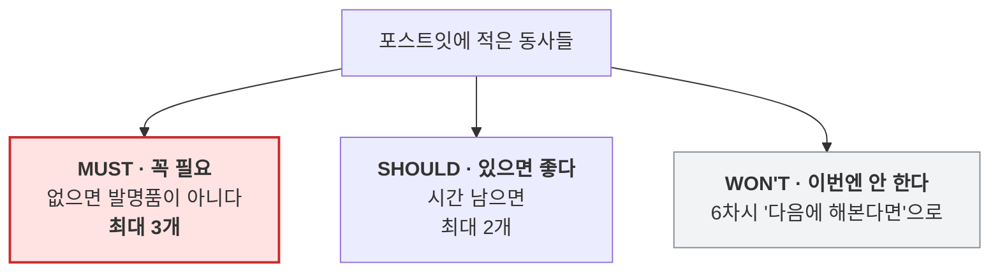

| 구분 | 기능 | 왜 필요한가 (**페르소나 근거**) | 어떻게 확인하나 |
|---|---|---|---|
| **MUST 1** | | | |
| **MUST 2** | | | |
| **MUST 3** | | | |
| SHOULD 1 | | | |
| SHOULD 2 | | | |
| WON'T | | | — |

> **MUST는 최대 3개. 이 제한이 이 활동의 전부입니다.**
> 5학년 팀은 반드시 기능을 10개씩 만듭니다. 그러면 6차시 안에 아무것도 못 끝냅니다.
>
> **판정 발문** — "이거 **하나만** 되고 나머지 다 안 되면, 그래도 발명품이라고 할 수 있어요?"
> **"네"라고 답하는 것만 MUST입니다.**

> **"왜 필요한가" 칸은 반드시 페르소나 카드를 근거로.** "멋있어서"는 반려합니다.
> **"어떻게 확인하나" 칸이 그대로 5차시 테스트 항목이 됩니다.**

---

## 75–85 · 실습 9 — 동작 설계표 (팀 · 10분) ★ 오늘의 최종 산출물

**이것이 4~5차시에 만들 코드의 설계도입니다.** 여기가 비면 3차시부터 진행이 안 됩니다.

| 카메라에 보이는 것 | AI의 판단 (클래스) | 마이크로비트의 반응 | 지속 시간 |
|---|---|---|---|
| | | | |
| | | | |
| | | | |
| (엉뚱한 것 / 아무것도 없음) | **모르겠음** | | |

### 마이크로비트 반응은 이 안에서 고릅니다 (교사 제공 목록)

| 종류 | 쓸 수 있는 것 |
|---|---|
| LED 모양 | 하트 / 네모 / 세모 / 엑스 (교사가 `내 블록`으로 미리 제작) |
| 소리 | 도 / 미 / 솔 / 라 · 0.5초 |
| 지속 | 1초 후 지움 / 계속 유지 |

> **왜 목록에서 고르게 하나** — LED 25개를 좌표로 켜는 블록을 학생이 직접 짜면 예제가 50줄이 됩니다. **배관은 교사가 깔고, 학생은 의미 있는 부분만 조작합니다.**
> 함수 내부는 4차시에 궁금해하는 학생에게만 열어 보여주세요.

### 두 가지 규칙

- **클래스는 3~4개를 넘기지 않는다** — 많을수록 데이터가 배로 필요하고 신뢰도가 떨어집니다
- **'모르겠음' 클래스를 반드시 넣는다** — AI는 스스로 모르겠다고 말하지 못합니다

### 클래스 확정 직후 3분 — 사회학 발문

> **발문** — "이 네 가지로 나눈 건 **누구예요?**"
> **발문** — "옆 반 친구들이 같은 문제를 맡았으면 똑같이 나눴을까요?"
> **발문** — "다르게 나눌 수도 있었을까요? 어떻게요?"

**다르게 나눌 수 있었던 방법을 설계표 여백에 적어 두게 합니다. 6차시에 다시 꺼냅니다.**

```
여백 — 다르게 나눌 수도 있었던 방법 : _______________________________
```

---

## 85–90 · 데이터 수집 계획표 + 기획 종료 선언

| 클래스 | 목표 | 어디서 (**2곳 이상**) | 어떻게 바꿔 찍나 | 담당 | 실제 |
|---|---|---|---|---|---|
| ① | 30장 | | 각도 / 거리 / 밝기 | | |
| ② | 30장 | | | | |
| ③ | 30장 | | | | |
| ④ 모르겠음 | 20장 | | | | |

> **'어떻게 바꿔 찍나' 칸이 비어 있으면 5차시 테스트에서 반드시 무너집니다.**

### 기획 종료 선언 (교사가 소리 내어)

```
   오늘로 기획 끝.
   다음 시간부터 마지막 시간까지 계속 만들고 고칩니다.
   지금 정한 클래스는 바꾸지 않습니다.
```

> **왜 못 바꾸게 하나** — 클래스를 바꾸면 사진을 전부 다시 찍어야 하고, 그러면 6차시에 고칠 시간이 사라집니다.
> 바꾸고 싶다는 말이 나오면 **"그 생각은 개선 이력표의 '다음에 해본다면'에 적어 둡시다."**

**준비물** — 페르소나 카드 A3, 벤치마킹 사진 3~5장(교사 준비), 시나리오 6컷 용지 A3, 포스트잇 3색, 기능 정의표, 동작 설계표, 데이터 수집 계획표, **큰 타이머**, 굵은 사인펜

---
---
---

# 【3차시】 컴퓨터 비전을 고쳐가며 익히고, 데이터를 읽는다

> **PRIMM** I(조사) · **MTU 루프 3회전**
> **결과물** 실습 카드 3장(A·B·C) · **학습된 우리 모델** · **봉인된 약점 예측 3가지**
> **실습 비중** 90분 중 80분 — **오늘부터 설명은 최대 5분**

## 3차시 분 단위 진행표

| 시간 | 구간 | 활동 | 형태 | MTU |
|---|---|---|---|---|
| 00–05 | 여는 | **학생이 직접 환경 체크** | 팀 실습 | — |
| 05–10 | 여는 | 컴퓨터 비전 4단계 설명 | 교사 5분 | — |
| 10–22 | 실습A | **CV-1 · 대기 시간을 고친다** | MTU ×4 | ✔ |
| 22–34 | 실습B | **CV-2 · 신뢰도를 관찰한다** | MTU ×4 | ✔ |
| 34–48 | 실습C | **CV-3 순서A/B · 순서를 바꾼다** ★ | MTU ×1 | ✔ |
| 48–58 | 쉬는 시간 | | | |
| 58–66 | 활동2 | **교사 데이터셋 읽기 — 데이터 카드 진단** | 팀 실습 | — |
| 66–72 | 활동2 | **약점 예측 — "이 AI는 어디서 틀릴까"** ★ | 팀 실습 | ✔ |
| 72–80 | 활동2 | **'모르겠음' 20장만 직접 촬영** | 팀 실습 | — |
| 80–86 | 활동2 | **모델 학습 + 예측 검증 테스트** | 팀 실습 | ✔ |
| 86–90 | 닫는 | 오늘 정한 값 · 약점 예측지 봉인 | 팀 | — |

---

## 00–05 · 실습 10 — 학생이 직접 환경 체크

**오늘부터 교사가 대신 하지 않습니다.** 몸 담당이 체크리스트를 읽고 셋이 나눠 수행합니다.

```
┌─ 환경 체크 ────────────────── 5분 ─┐
│ □ 엔트리 접속                       │
│ □ 웹캠 권한 허용 (카메라 아이콘)      │
│ □ 마이크로비트 USB 연결              │
│    → 오늘은 아직 안 씁니다. 연결만.   │
│ □ 하드웨어 연결 프로그램 실행         │
│ □ CV-1 파일 열기                    │
│ □ 다른 프로그램 종료                 │
│                                     │
│ 걸린 시간 : ____분                   │
└─────────────────────────────────────┘
```

> **🟢 AI 허용 지점** — 안 되는 항목이 있으면 AI에게 물어봐도 됩니다.
> 예) "엔트리에서 웹캠 권한이 차단됐다고 나와요. 어떻게 허용해요?"

---

## 05–10 · 컴퓨터 비전 4단계 (교사 5분)

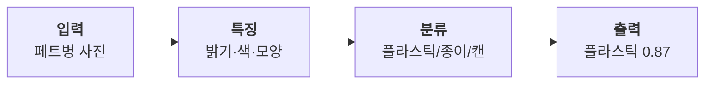

> **대사** — "컴퓨터는 사진을 사진으로 안 봐요. **숫자로** 봐요.
> 배운 숫자들 중에 **어느 것과 제일 비슷한지** 골라요.
> 그리고 **100% 확신하는 법이 없어요.** 항상 '몇 퍼센트쯤 비슷하다'고 말해요."

> **오늘의 질문** — "1차시에 AI가 **신발을 보고도 이상한 답**을 했죠. 오늘 그 이유를 알아낼 거예요."

**5분을 넘기지 마세요. 나머지는 손으로 알아냅니다.**

---

## 10–22 · 실습 A — CV-1 · 대기 시간을 고친다 (MTU ×4 · 12분)

```
[ CV-1_분류만보기 ]  — 딱 4줄
[ 시작하기 버튼을 클릭했을 때 ]
  [ 계속 반복하기 ]
      [ 학습한 모델로 분류하기 ]
      [ ( ("결과: ") 와 (분류 결과) 를 합치기 ) 라고 말하기 ]
      [ (0.5) 초 기다리기 ]
```

**고칠 곳은 `0.5` 하나뿐입니다.**

### 실습 카드 A (4바퀴 · 각 3분)

| # | ① 고친다 | ② 예측한다 | ③ 테스트한다 | ④ 이해한다 |
|---|---|---|---|---|
| **A1** | `0.5` → `3` | | 페트병 3번 | |
| **A2** | `0.5` → `0.05` | | 페트병 3번 | |
| **A3** | (안 고침) | 웹캠을 손으로 가리면? | 5초간 가리기 | |
| **A4** | (안 고침) | 아주 멀리 두면? | 2m에서 3번 | |

**손 로테이션** — A1은 A가, A2는 B가, A3은 C가, A4는 다시 A가 마우스를 잡습니다.

> **A2 직후 핵심 발문** — 화면이 정신없이 바뀝니다.
> **"왜 기다리는 시간이 필요할까요?"**
> 끌어낼 답 — 사람이 읽을 시간이 필요하고, 컴퓨터도 쉴 틈이 필요하다.

### 실습 A 마무리 — 우리 값 정하기

```
   우리 발명품의 대기 시간은  ______ 초로 정한다.
   왜냐하면 ___________________________________
```

> **이 값이 4차시 코드 v0.1에 그대로 들어갑니다.** 크게 적어 벽에 붙이세요.

> **☐ 되돌리기** — `0.5`로 되돌려 놓았는지 확인.

---

## 22–34 · 실습 B — CV-2 · 신뢰도를 관찰한다 (MTU ×4 · 12분)

```
[ CV-2_신뢰도보기 ]
[ 시작하기 버튼을 클릭했을 때 ]
  [ 계속 반복하기 ]
      [ 학습한 모델로 분류하기 ]
      [ ( (분류 결과) 와 ( ("  플라스틱 확신도 ") 와 (플라스틱 에 대한 신뢰도) 를 합치기 ) 를 합치기 ) 라고 말하기 ]
      [ (0.5) 초 기다리기 ]
```

화면에는 이렇게 나옵니다.

```
   플라스틱   플라스틱 확신도 0.87
   종이      플라스틱 확신도 0.04
   모르겠음   플라스틱 확신도 0.11
```

### 실습 카드 B — **코드는 안 고칩니다. 카메라 앞을 고칩니다.**

| # | ① 고친다 (카메라 앞) | ② 예측한다 | ③ 실제 | ④ 이해한다 |
|---|---|---|---|---|
| **B1** | 페트병 정면 | 확신도 __ | | |
| **B2** | 페트병 반쯤 가리기 | 올라갈까 내려갈까 | | |
| **B3** | 아무것도 없음 | **0이 될까?** | | |
| **B4** | **연필 보여주기** | **0이 될까?** | | ★ |

> **B4 직후 핵심 발문** — "연필인데도 플라스틱 확신도가 **0이 아니네요.**
> **AI는 왜 '이건 모르겠어요'라고 말하지 못할까요?**"
>
> **끌어낼 답** — AI는 우리가 준 보기(플라스틱·종이·캔·모르겠음) **중에서만** 고릅니다.
> 보기에 없으면 그중 제일 비슷한 걸 고를 뿐입니다.
> **그래서 '모르겠음'이라는 보기를 우리가 직접 만들어 줘야 합니다.**

> **2차시와 연결** — "2차시 시나리오에서 **'AI가 모르겠다고 말할 수 있을까?'** 물었죠. **답이 지금 나왔어요.**"

### 실습 B 마무리

```
   우리 팀의 '모르겠음' 클래스에 넣을 것 (5개 이상)
   ① ______ ② ______ ③ ______ ④ ______ ⑤ ______
```

> 이 목록이 오늘 오후 촬영 계획에 그대로 들어갑니다.

---

## 34–48 · 실습 C — CV-3 순서A / 순서B ★ 이 수업에서 가장 중요한 14분

**두 파일을 나란히 두 화면(또는 두 탭)에 띄웁니다. 실행하지 않습니다.**

```
[ CV-3_순서A ]  — 올바른 순서
      [ 만약  (분류 결과) = (플라스틱)  이라면 ]  → "파란 통이에요"
      [ 아니면 만약  (분류 결과) = (종이)  이라면 ]  → "초록 통이에요"
      [ 아니면 만약  (분류 결과) = (캔)  이라면 ]   → "회색 통이에요"
      [ 아니면 ]                                → "다시 보여주세요"

[ CV-3_순서B ]  — 조건 하나가 맨 위로 올라감
      [ 만약  (플라스틱 에 대한 신뢰도) < (0.9)  이라면 ]  → "다시 보여주세요"   ◀ 위로
      [ 아니면 만약  (분류 결과) = (플라스틱)  이라면 ]  → "파란 통이에요"
      [ 아니면 만약  (분류 결과) = (종이)  이라면 ]     → "초록 통이에요"
      [ 아니면 만약  (분류 결과) = (캔)  이라면 ]      → "회색 통이에요"
```

### 진행 (14분)

| 분 | 할 일 |
|---|---|
| 34–38 | 두 코드를 나란히 보며 **다른 곳 찾기** — "몇 군데가 다른가요?" |
| 38–42 | **세 명이 각자 예측지 작성** (상의 금지) |
| 42–45 | 순서A 실행 → 페트병·우유팩·캔·연필 4개 테스트 |
| 45–48 | 순서B 실행 → **똑같은 4개** 테스트 |

```
┌─ 실습 C ── 순서만 바꿨는데 ───────── 14분 ─┐
│ ② 예측 : 두 코드는 블록이 거의 같고           │
│          순서만 다릅니다. 결과도 같을까요?     │
│            ☐ 같다   ☐ 다르다                 │
│          왜 : ______________________________ │
│                                              │
│ ③ 테스트                                     │
│         │ 순서A 결과 │ 순서B 결과              │
│  페트병 │           │                        │
│  우유팩 │           │                        │
│  캔    │           │                        │
│  연필  │           │                        │
│                                              │
│ ④ 이해 : "만약~아니면 은 __________________"  │
└──────────────────────────────────────────────┘
```

**대부분 "같다"고 예측합니다. 그리고 틀립니다.**

순서B는 페트병을 정확히 보여줘도 신뢰도가 0.9를 넘기 어려워 **거의 항상 "다시 보여주세요"만** 말합니다. 아래 세 갈래는 실행될 기회가 거의 없습니다.

> **발문 1** — "순서B에서 '파란 통이에요'는 **언제** 나오나요?"
> **발문 2** — "왜 아래 블록들은 실행이 **안 될까요?**"
> **발문 3** — "그럼 조건은 **어떤 순서로** 써야 할까요?"
>
> **끌어낼 결론** — `만약~아니면`은 **위에서부터 하나만** 골라 실행하고 나머지는 건너뜁니다.
> **좁고 특별한 것이 위로, 넓고 일반적인 것이 아래로. '모르겠음'은 맨 아래.**

### 실습 C 마무리 — 우리 순서 확정

```
   우리 코드의 조건 순서
   ① __________  ② __________  ③ __________  ④ 모르겠음(맨 아래)
```

> **이 순서가 4차시 코드 v0.1에 그대로 들어갑니다.**

---

## 48–58 · 쉬는 시간

---

## 58–66 · 실습 11 — 교사 데이터셋 읽기 (팀 · 8분)

> **오늘 학생은 사진을 찍지 않습니다.** 교사가 지난 일주일 동안 찍어 둔 **베이스 데이터셋**을 씁니다.
> 대신 학생은 **그 데이터를 읽고 진단합니다.** 찍는 것보다 이게 어렵고, 이게 배움입니다.

### 교사가 함께 주는 것 — 데이터 카드

베이스 데이터셋에는 **어떻게 찍었는지 적힌 카드**가 따라옵니다.

```
┌─ 데 이 터 카 드 ─────────────────────────────┐
│  클래스 ①______  30장                        │
│  클래스 ②______  30장                        │
│  클래스 ③______  30장                        │
│                                              │
│  찍은 장소  : 교실 앞 흰 벽  (1곳)             │
│  찍은 거리  : 30cm 고정                       │
│  찍은 각도  : 정면 위주                        │
│  조명      : 형광등만                         │
│  든 사람   : 선생님 한 명                      │
│  찍은 날짜 : ____월 ____일                    │
│                                              │
│  ※ '모르겠음' 클래스는 비어 있습니다.           │
│     오늘 여러분이 채웁니다.                     │
└──────────────────────────────────────────────┘
```

### 실습 카드 11 — 데이터를 읽는다

| # | 질문 | 우리 팀의 답 |
|---|---|---|
| 1 | 몇 곳에서 찍었나요? | ____곳 |
| 2 | 몇 명이 들고 찍었나요? | ____명 |
| 3 | 어떤 밝기에서 찍었나요? | |
| 4 | **여기에 없는 상황은 뭐가 있을까요?** (3개) | ① ② ③ |
| 5 | **'모르겠음' 칸이 왜 비어 있을까요?** | |

> **5번 발문** — "선생님이 '모르겠음'을 안 만들어 둔 이유가 뭘까요?"
>
> **끌어낼 답** — '모르겠음'에 뭘 넣을지는 **우리 교실·우리 주제마다 다릅니다.**
> 선생님은 우리 반에 뭐가 굴러다니는지 모릅니다. **이건 우리만 만들 수 있습니다.**

---

## 66–72 · 실습 12 — 약점 예측 ★ (팀 · 6분)

> **오늘 가장 중요한 6분입니다.** 여기서 적은 예측이 **5차시 테스트의 정답지**가 됩니다.

```
┌─ 실습 12 ── 이 AI는 어디서 틀릴까 ──── 6분 ─┐
│                                              │
│  데이터 카드를 보고, 이 데이터로 배운 AI가      │
│  틀릴 것 같은 상황을 3개 예측합니다.            │
│  (아직 학습도 안 시켰습니다. 순수 예측입니다)    │
│                                              │
│  예측 ① ______________________________       │
│     왜 : ____________________________        │
│  예측 ② ______________________________       │
│     왜 : ____________________________        │
│  예측 ③ ______________________________       │
│     왜 : ____________________________        │
│                                              │
│  ▶ 이 종이를 봉투에 넣어 봉인합니다.            │
│    5차시에 뜯어서 맞았는지 확인합니다.           │
└──────────────────────────────────────────────┘
```

**세 명이 각자 씁니다. 상의 금지.**

> **교사 유도 발문 (막힐 때만)** — "한 곳에서만 찍었대요. 그럼 **다른 곳**에 가면요?"
> "선생님 손만 찍혔대요. 그럼 **다른 사람**이 들면요?"
> "형광등에서만 찍었대요. 그럼 **창가**에서는요?"

> **⚠ 답을 말해 주지 마세요.** 하나라도 스스로 나오면 충분합니다.
> **🔴 AI 금지** — 이 예측을 AI에게 물으면 5차시가 통째로 무의미해집니다.

### 봉인 봉투

```
   봉투 겉면에 적기 :

   [ 5차시에 뜯을 것 ]
   우리가 3차시에 예측한 우리 AI의 약점 3가지
   봉인일 : ____월 ____일   봉인자 : A___ B___ C___
```

---

## 72–80 · 실습 13 — '모르겠음' 20장만 직접 촬영 (팀 · 8분)

**학생이 직접 찍는 것은 이 클래스 하나뿐입니다.** 나머지 90장은 교사가 이미 찍어 두었습니다.

### 왜 '모르겠음'만 학생이 찍는가

| 이유 | 설명 |
|---|---|
| **교사가 만들 수 없다** | 우리 교실에 뭐가 굴러다니는지는 그 팀만 안다 |
| **소유감** | "이건 내가 가르친 거야"가 최소 한 클래스는 있어야 한다 |
| **실습 B와 직결** | 3차시 실습 B4에서 "AI는 모르겠다고 못 한다"를 몸으로 겪었다 |
| **시간이 짧다** | 20장은 8분 안에 가능하다 |

### 20장 배분 — 실습 B에서 적은 목록을 그대로 씁니다

```
   빈 배경만              5장   (2분)
   손만 보이기            5장   (2분)
   엉뚱한 물건            5장   (2분)  ← 실습 B 목록에서
   물건이 반쯤 나감        5장   (2분)
```

| 분 | 무엇을 | 누가 든다 | 누가 찍는다 |
|---|---|---|---|
| 72–74 | 빈 배경 | — | 눈 담당 |
| 74–76 | 손 | 머리 담당 | 눈 담당 |
| 76–78 | 엉뚱한 물건 5종 | 몸 담당 | 눈 담당 |
| 78–80 | 반쯤 나간 물건 | 머리 담당 | 몸 담당 |

> **⚠ 교사 베이스와 같은 조건으로 찍습니다.** 같은 자리, 같은 거리(30cm).
> 여기만 다르게 찍으면 AI가 "배경이 다르면 모르겠음"이라고 잘못 배웁니다.
> **이것도 나중에 좋은 개선 소재가 되지만, 오늘은 통제합니다.**

---

## 80–86 · 실습 14 — 모델 학습 + 예측 검증 (6분)

`모델 학습하기` 를 누릅니다. 교사 90장 + 학생 20장 = **총 110장**.

### 학습 직후 — 아까 예측한 것부터 확인합니다

```
┌─ 예측 검증 테스트 ──────────────── 6분 ─┐
│  [ 기본 동작 ]                            │
│  ① 클래스 ① 보여주기  → ☐○ ☐✕           │
│  ② 클래스 ② 보여주기  → ☐○ ☐✕           │
│  ③ 클래스 ③ 보여주기  → ☐○ ☐✕           │
│  ④ 아무것도 없음      → 모르겠음? ☐○ ☐✕  │
│  ⑤ 엉뚱한 것          → 모르겠음? ☐○ ☐✕  │
│                                           │
│  [ 우리 예측 하나만 미리 찔러보기 ]          │
│  ⑥ 예측 ①을 지금 해보면? → ☐맞음 ☐틀림    │
│     (나머지 2개는 5차시까지 아껴 둡니다)      │
│                                           │
│  ○ 개수 : ____ / 6                        │
└───────────────────────────────────────────┘
```

> **⑥번이 오늘의 하이라이트입니다.**
> 예측 ①이 맞으면 아이들이 소리를 지릅니다. **"내가 맞혔어!"**
> 이 경험이 5차시 테스트를 기다리게 만듭니다.

> **⚠ 예측 ②③은 지금 확인하지 않습니다.** 5차시까지 아껴 두세요. 오늘 다 써버리면 5차시가 밋밋해집니다.

### 기본 동작(①~⑤)이 안 될 때만 손댑니다

| 증상 | 즉시 대처 | 시간 |
|---|---|---|
| 한쪽 클래스로만 분류됨 | **교사 베이스 문제** — 교사가 그 클래스 10장 즉시 보충 | 3분 |
| '모르겠음'이 잘 안 나옴 | **학생 데이터 문제** — 엉뚱한 물건 5장 추가 후 재학습 | 3분 |
| 전부 이상함 | 클래스 이름 오타 확인 → 재학습 | 2분 |

> **중요한 태도** — ○가 6개가 아니어도 괜찮습니다. **오히려 4~5개가 정상입니다.**
> 완벽하면 5차시에 실패가 안 나오고, 실패가 없으면 6차시에 고칠 게 없습니다.

---

## 86–90 · 닫는 활동 — 오늘 정한 값 기록

동작 설계표 옆에 **큰 글씨로** 붙입니다.

```
 ┌────────────────────────────────────────┐
 │   3차시에 우리가 정한 것                  │
 │                                        │
 │   대기 시간   : ______ 초  (실습 A)      │
 │   조건 순서   : ①___ ②___ ③___ ④모르겠음 │
 │                            (실습 C)     │
 │   모델 첫 성능 : ○ ____ / 6             │
 │                                        │
 │   [ 봉인 ]  약점 예측 3가지 → 봉투 안     │
 │            5차시에 뜯는다               │
 └────────────────────────────────────────┘
```

> **예고** — "다음 시간에 **마이크로비트를 뜯어보고**, 오늘 정한 값으로 **우리 코드를 만듭니다.**"

**준비물** — CV-1·CV-2·CV-3순서A·CV-3순서B 파일, 웹캠 노트북, **교사 베이스 데이터셋(클래스당 30장)**, **데이터 카드**, 흰 배경 전지, '모르겠음'용 잡동사니(필통·책·지우개·신발), **봉인 봉투 1장**, 실습 카드 A·B·C, 예측 기록지 3부

> **⚠ 교사 필수 준비** — 베이스 데이터셋은 **1차시가 끝난 뒤 일주일 안에** 촬영합니다. 만드는 법은 **5부**에 있습니다.

---
---
---

# 【4차시】 마이크로비트를 고쳐가며 익히고, 우리 코드로 바꾼다

> **PRIMM** I(조사) → **M(Modify)** · **MTU 루프 3회전 + AI 코드 검증**
> **결과물** 실습 카드 D·E·F · **우리 코드 v0.1 (화면 출력만)**
> **실습 비중** 90분 중 80분

## 4차시 분 단위 진행표

| 시간 | 구간 | 활동 | 형태 | MTU |
|---|---|---|---|---|
| 00–05 | 여는 | 환경 체크 (마이크로비트 포함) | 팀 실습 | — |
| 05–10 | 여는 | 마이크로비트 인사 · 입력-판단-출력 | 실습+설명 | — |
| 10–20 | 실습D | **PC-1 · 값을 고친다** | MTU ×4 | ✔ |
| 20–32 | 실습E | **PC-1′ · 지우기 위치를 바꾼다** ★ | MTU ×1 | ✔ |
| 32–42 | 실습F | **PC-2 · 블록을 빼본다** | MTU ×3 | ✔ |
| 42–52 | 쉬는 시간 | | | |
| 52–62 | 활동2 | **AI 초안 코드 받기 + 틀린 곳 찾기** ★ | 팀 실습 | ✔ |
| 62–80 | 활동2 | **우리 코드 v0.1로 고치기** | 팀 실습 | ✔ |
| 80–86 | 활동2 | **v0.1 전체 테스트 (화면만)** | 팀 실습 | ✔ |
| 86–90 | 닫는 | 개선 전 영상 30초 촬영 | 팀 | — |

---

## 00–05 · 환경 체크 (마이크로비트 포함)

```
┌─ 환경 체크 ────────────────── 5분 ─┐
│ □ 엔트리 접속 · 웹캠 권한             │
│ □ 마이크로비트 USB 연결               │
│    → 케이블이 데이터 전송용인가?       │
│ □ 하드웨어 연결 프로그램 연결 상태 초록  │
│ □ 하트 한 번 띄워보기 (연결 확인)      │
│ □ PC-1 파일 열기                     │
└─────────────────────────────────────┘
```

> **연결 안 될 때 🟢 AI 허용** — "마이크로비트가 엔트리에 연결이 안 돼요. 뭘 확인해야 해요?"
> 가장 흔한 원인은 **충전 전용 케이블**입니다.

---

## 05–10 · 마이크로비트 인사 (실습 + 설명 5분)

보드를 손에 들고 눈으로 확인합니다.

```
   □ LED 25개 (5×5)를 세어본다
   □ 버튼 A · B를 눌러본다
   □ 뒷면 센서를 찾아본다
```

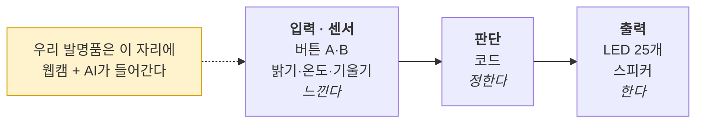

> **대사** — "오늘은 **몸**을 배워요. 우리 발명품에서는 **입력 자리에 웹캠과 AI**가 들어갈 거예요."

---

## 10–20 · 실습 D — PC-1 · 값을 고친다 (MTU ×4 · 10분)

```
[ PC-1_버튼과LED ]
[ 시작하기 버튼을 클릭했을 때 ]
  [ 계속 반복하기 ]
      [ 만약  (마이크로비트 버튼 A를 눌렀는가?)  이라면 ]
          [ 하트 보여주기 ]
          [ 마이크로비트 (도) 음을 (0.5) 초 연주하기 ]
      [ 아니면 ]
          [ 마이크로비트 모든 LED 끄기 ]
```

| # | ① 고친다 | ② 예측한다 | ③ 테스트한다 | ④ 이해한다 |
|---|---|---|---|---|
| **D1** | `하트 보여주기` → `네모 보여주기` | | 버튼 A 3번 | |
| **D2** | `(도)` → `(솔)` | | 버튼 A 3번 | |
| **D3** | `0.5` → `2` | | **버튼을 빠르게 5번** | ★ |
| **D4** | `버튼 A` → `버튼 B` | | 버튼 A·B 각각 | |

> **D3 직후 핵심 발문** — 버튼을 빠르게 여러 번 눌러도 반응이 없습니다.
> **"왜 빨리 눌러도 안 먹을까요?"**
> **끌어낼 답 — "프로그램은 한 번에 한 가지만 합니다."** 소리가 끝날 때까지 다음 입력을 못 받습니다.
>
> **연결** — "우리 발명품도 소리를 길게 넣으면 **다음 물건을 못 봐요.** 몇 초로 할까요?"

> **☐ 되돌리기** 확인.

---

## 20–32 · 실습 E — PC-1′ · 지우기 위치를 바꾼다 ★ (12분)

**두 파일을 나란히 띄웁니다.**

```
[ PC-1_버튼과LED ]  — 원래
  [ 계속 반복하기 ]
      [ 만약 (버튼 A를 눌렀는가?) 이라면 ]
          [ 하트 보여주기 ]
      [ 아니면 ]
          [ 마이크로비트 모든 LED 끄기 ]

[ PC-1_지우기위로 ]  — 지우기를 맨 위로
  [ 계속 반복하기 ]
      [ 마이크로비트 모든 LED 끄기 ]        ◀ 위로 올라옴
      [ 만약 (버튼 A를 눌렀는가?) 이라면 ]
          [ 하트 보여주기 ]
```

```
┌─ 실습 E ── 지우기는 언제 ──────── 12분 ─┐
│ ② 예측 : 지우기를 맨 위로 올렸습니다.       │
│          버튼을 누르면 하트가 보일까요?      │
│            ☐ 잘 보인다  ☐ 깜빡인다         │
│            ☐ 안 보인다                     │
│          왜 : ___________________________  │
│                                            │
│ ③ 테스트 : 원래 파일 → 눌러본다            │
│            지우기위로 파일 → 눌러본다        │
│                                            │
│ ④ 이해 : LED는 "__ → __ → __" 순서로 해야  │
└────────────────────────────────────────────┘
```

깜빡이거나 거의 안 보입니다. **켜자마자 지워지기 때문입니다.**

> **정리 발문** — "그럼 **지우는 것은 언제** 해야 할까요?"
> **끌어낼 결론 — 켜고 → 잠깐 보여주고 → 지운다.**
>
> **이 순서가 나와야 5차시에서 LED가 정상 작동합니다.** 벽에 크게 붙이세요.

```
   ┌──────────────────────────────────┐
   │   켜고 → 잠깐 보여주고 → 지운다     │
   │   (지우기는 언제나 맨 마지막)        │
   └──────────────────────────────────┘
```

---

## 32–42 · 실습 F — PC-2 · 블록을 빼본다 (MTU ×3 · 10분)

```
[ PC-2_밝기센서 ]
[ 시작하기 버튼을 클릭했을 때 ]
  [ 계속 반복하기 ]
      [ (마이크로비트 밝기 값) 라고 말하기 ]
      [ (0.2) 초 기다리기 ]
```

| # | ① 고친다 / 해본다 | ② 예측 | ③ 실제 | ④ 이해 |
|---|---|---|---|---|
| **F1** | 손으로 보드를 덮기 | 값이 __로 | | |
| **F2** | 창가로 가져가기 | 값이 __로 | | |
| **F3** | `(0.2) 초 기다리기` **삭제** | 빨라질까? | | ★ |

> **F3 직후 핵심 발문** — 화면이 멈춘 것처럼 느려집니다.
> **"쉬는 블록을 뺐는데 왜 더 느려졌을까요?"**
> **끌어낼 답 — "쉬지 않고 일하면 오히려 느려진다."**
>
> **5차시 예고** — "5차시에 웹캠이랑 마이크로비트를 **같이** 돌리면 이게 진짜 문제가 돼요. 오늘 배운 걸 그때 쓸 거예요."

> **☐ 되돌리기** — `0.2초 기다리기`를 다시 넣었는지 확인.

---

## 42–52 · 쉬는 시간

---

## 52–62 · 실습 13 — AI 초안 코드를 받아 틀린 곳을 찾는다 ★ (10분)

> **오늘의 하이라이트.** AI가 쓴 코드를 **정답이 아니라 테스트 대상**으로 다룹니다.

### 진행

**1. (52–54) 교사가 미리 받아둔 AI 초안 코드를 나눠 줍니다.**

교사는 수업 전 AI에게 이렇게 요청해 초안을 준비합니다. (§3부 프롬프트 4번)

```
초등 5학년이 엔트리로 만드는 이미지 분류 + 마이크로비트 발명품 코드를
블록 의사코드로 써 줘. 클래스는 [①][②][③][모르겠음] 4개.
일부러 초등학생이 자주 하는 실수 2가지를 넣어 줘.
(조건 순서 실수, LED 지우기 위치 실수)
```

**2. (54–60) 팀이 AI 초안에서 틀린 곳을 찾습니다. 실행하지 않고 눈으로 먼저.**

```
┌─ 실습 13 ── AI 코드 검사관 ─────── 10분 ─┐
│ AI가 써 준 코드입니다. 어딘가 틀렸습니다.    │
│                                            │
│ ▸ 실행하기 전에 눈으로 찾기 (2군데)          │
│   ① 몇 번째 줄 : ______                    │
│      왜 이상한가 : ______________________  │
│   ② 몇 번째 줄 : ______                    │
│      왜 이상한가 : ______________________  │
│                                            │
│ ▸ 근거는 실습 __ 와 실습 __ 입니다.          │
│                                            │
│ ▸ 실행해서 확인 → 예상대로였나 ☐예 ☐아니오  │
└────────────────────────────────────────────┘
```

**3. (60–62) 정답 맞추기 — 실습 C(조건 순서)와 실습 E(지우기 위치)가 근거입니다.**

> **핵심 발문** — "**AI도 틀리네요.** 그럼 AI가 준 코드는 어떻게 써야 할까요?"
>
> **끌어낼 결론** — **"AI 코드는 정답이 아니라 초안이다. 반드시 돌려봐야 한다."**

> **🔴 여기서 금지** — "AI야, 뭐가 틀렸어?"라고 되묻는 것.
> **틀린 곳을 찾는 것이 오늘 학생의 일입니다.**

---

## 62–80 · 실습 14 — 우리 코드 v0.1로 고치기 (18분)

**3차시 CV-3_순서A 파일을 열어 2차시 동작 설계표대로 고칩니다. 백지에서 시작하지 않습니다.**

### 고칠 곳 체크리스트 (한 줄씩 · 고칠 때마다 실행)

```
┌─ 실습 14 ── v0.1 만들기 ────────── 18분 ─┐
│ □ 1. 클래스 이름 ①을 우리 것으로  → 실행 확인 │
│ □ 2. 말하기 문구 ①을 우리 것으로  → 실행 확인 │
│ □ 3. 클래스 ② 갈래 추가          → 실행 확인 │
│ □ 4. 클래스 ③ 갈래 추가          → 실행 확인 │
│ □ 5. '모르겠음' 문구 수정 (맨 아래) → 실행 확인│
│ □ 6. 대기 시간을 실습 A 값으로     → 실행 확인 │
│                                             │
│ ⚠ 한 줄 고칠 때마다 반드시 실행합니다.        │
│    6번 고쳤으면 6번 실행합니다.               │
└─────────────────────────────────────────────┘
```

```
[ 우리 코드 v0.1 ]  — 마이크로비트는 아직 안 붙입니다

[ 시작하기 버튼을 클릭했을 때 ]
  [ 계속 반복하기 ]
      [ 학습한 모델로 분류하기 ]

      [ 만약  (분류 결과) = (①클래스)  이라면 ]        ← 1. 이름 수정
          [ "____________" 라고 말하기 ]              ← 2. 문구 수정

      [ 아니면 만약  (분류 결과) = (②클래스)  이라면 ]  ← 3. 갈래 추가
          [ "____________" 라고 말하기 ]

      [ 아니면 만약  (분류 결과) = (③클래스)  이라면 ]  ← 4. 갈래 추가
          [ "____________" 라고 말하기 ]

      [ 아니면 ]                                     ← 5. 맨 아래 (실습 C)
          [ "잘 모르겠어요. 다시 보여주세요" 라고 말하기 ]

      [ (___) 초 기다리기 ]                          ← 6. 실습 A 값
```

> **⚠ 마이크로비트는 아직 붙이지 않습니다.**
> 화면 출력만으로 판단이 제대로 되는지 먼저 확인합니다.
> **두 가지를 한 번에 붙이면 문제가 생겼을 때 어디가 원인인지 모릅니다.**

> **핵심 지도 대사** — **"한 번에 하나씩 붙이고, 붙일 때마다 확인한다."**
> 5·6차시 내내 쓰입니다. 벽에 붙이세요.

### 🟡 AI 조건부 허용 지점

막혔을 때, **예측지를 먼저 쓴 뒤** 교사에게 보여주고 물어볼 수 있습니다.

```
   🟡 허용 예 : "엔트리에서 '아니면 만약' 블록을 어떻게 추가해요?"
   🟡 허용 예 : "합치기 블록 두 개를 겹치는 방법 알려줘"
   🔴 금지 예 : "우리 코드 완성해 줘"
   🔴 금지 예 : "이거 실행하면 어떻게 돼?"
```

---

## 80–86 · 실습 15 — v0.1 전체 테스트 (화면만 · 6분)

```
┌─ v0.1 테스트 ──────────────────── 6분 ─┐
│  ① 클래스 ① 보여주기 → 문구 맞나 ☐○ ☐✕  │
│  ② 클래스 ② 보여주기 → 문구 맞나 ☐○ ☐✕  │
│  ③ 클래스 ③ 보여주기 → 문구 맞나 ☐○ ☐✕  │
│  ④ 아무것도 없음    → 모르겠음? ☐○ ☐✕   │
│  ⑤ 엉뚱한 것       → 모르겠음? ☐○ ☐✕   │
│  ⑥ 물건 빠르게 바꾸기 → 따라오나 ☐○ ☐✕  │
│                                          │
│  ○ 개수 : ____ / 6                       │
│  안 되는 것이 있으면 → 코드? 데이터?        │
│    ______________________________________│
└──────────────────────────────────────────┘
```

> **여기서 ✕가 나와도 오늘은 고치지 않습니다.** 5차시 테스트 목록에 넣습니다.
> 다만 **"코드 문제인지 데이터 문제인지"** 만 적어 둡니다. 6차시 원인 분류의 예행 연습입니다.

---

## 86–90 · 닫는 활동 — 개선 전 영상 30초

작동 영상을 **30초** 찍습니다. **6차시 개선 전 자료**가 됩니다.

```
   촬영 내용 : 클래스 ①②③ + 모르겠음, 각 5초씩
   찍는 사람 : 몸 담당
   파일명    : [팀이름]_개선전_4차시
```

> **예고** — "다음 시간에 **마이크로비트를 붙이고**, **언제 안 되는지** 찾습니다."

**준비물** — PC-1·PC-1지우기위로·PC-2 파일, 마이크로비트 v2 + 데이터 전송용 USB, 3차시 학습 모델, AI 초안 코드 인쇄본 3부, 실습 카드 D·E·F, 동작 설계표

---
---
---

# 【5차시】 붙이고, 언제 안 되는지 찾는다

> **PRIMM** M(Make) · **프로세스** ④ 제작2 + ⑤ 테스트
> **결과물** **코드 v0.2 · 시제품 · 실패 기록 10건 이상**
> **실습 비중** 90분 중 80분

## 5차시 분 단위 진행표

| 시간 | 구간 | 활동 | 형태 | MTU |
|---|---|---|---|---|
| 00–05 | 여는 | 환경 체크 · 오늘의 프레임 | 팀 | — |
| 05–08 | 여는 | **"오늘은 실패를 찾는 날"** 선언 | 교사 3분 | — |
| 08–28 | 활동1 | **한 갈래씩 마이크로비트 붙이기** | MTU ×4 | ✔ |
| 28–38 | 활동1 | **몸체 만들기** | 팀 실습 | — |
| 38–48 | 쉬는 시간 | | | |
| 48–78 | 활동2 | **테스트 12개** | 팀 실습 | ✔ |
| 78–84 | 활동2 | **기능 정의표 대조** | 팀 | — |
| 84–90 | 닫는 | 실패 목록 정리 · 예고 | 팀 | — |

---

## 00–05 · 환경 체크

```
□ 엔트리 · 웹캠 권한
□ 마이크로비트 연결 · 하트 테스트
□ 4차시 v0.1 파일 열기 → 한 번 실행해 정상 확인
□ 건전지 홀더 준비 (몸체 제작용)
□ 다른 프로그램 종료 — 오늘은 웹캠 + 시리얼 동시 부하
```

---

## 05–08 · 오늘의 프레임 (3분)

> **오늘의 질문** — "오늘 우리 목표는 **잘 되게 하는 것이 아니라, 언제 안 되는지 찾는 것**입니다.
> **실패를 몇 개나 찾을 수 있을까요?**"

```
 ┌────────────────────────────────────────┐
 │   오늘의 성과 = 찾아낸 실패의 개수         │
 │   목표 : 10개 이상                       │
 └────────────────────────────────────────┘
```

> **이 프레임이 중요합니다.** 이걸 안 깔면 학생은 실패할 때마다 좌절합니다.

### ★ 봉인 봉투 뜯기

3차시에 봉인한 **약점 예측 3가지**를 지금 뜯습니다. 아직 읽기만 하고 확인은 나중입니다.

```
┌─ 3차시의 우리 예측 ────────────────────┐
│  예측 ① _____________________________  │
│  예측 ② _____________________________  │
│  예측 ③ _____________________________  │
│                                        │
│  ▶ 오늘 테스트 12개를 다 돌린 뒤          │
│    몇 개나 맞혔는지 확인합니다.            │
└────────────────────────────────────────┘
```

> **대사** — "2주 전에 여러분이 **아직 만들지도 않은 AI가 어디서 틀릴지** 예측했어요.
> 오늘 몇 개나 맞혔는지 볼 거예요."
>
> 이 한마디가 테스트 30분의 동기를 만듭니다.

---

## 08–28 · 실습 16 — 한 갈래씩 붙이기 (MTU ×4 · 20분)

**갈래 하나 붙이고 → 즉시 테스트 → 다음 갈래.** 4갈래 × 5분.

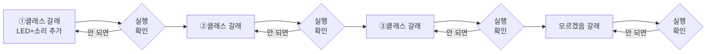

### 갈래 하나에 추가하는 4줄 (실습 E 순서 반영)

```
      [ 만약  (분류 결과) = (①클래스)  이라면 ]
          [ "____________" 라고 말하기 ]
          [ ____ 보여주기 ]                      ← 추가 · LED 켜기
          [ 마이크로비트 (__) 음을 (0.5) 초 연주하기 ]  ← 추가 · 소리
          [ (1) 초 기다리기 ]                     ← 추가 · 잠깐 보여주기
          [ 마이크로비트 모든 LED 끄기 ]            ← 추가 · 지우기는 마지막
```

### 실습 카드 16

| 갈래 | 담당 | LED | 소리 | 붙인 뒤 테스트 | 결과 |
|---|---|---|---|---|---|
| ①클래스 | A | | | 3번 보여주기 | ☐○ ☐✕ |
| ②클래스 | B | | | 3번 보여주기 | ☐○ ☐✕ |
| ③클래스 | C | | | 3번 보여주기 | ☐○ ☐✕ |
| 모르겠음 | A | 엑스 | (없음) | 3번 | ☐○ ☐✕ |

> **⚠ 한 갈래를 붙였는데 안 되면, 다음 갈래로 넘어가지 않습니다.** 그 자리에서 해결합니다.
> 4개를 다 붙인 뒤에 문제를 찾으면 어디가 원인인지 모릅니다.

### 자주 나오는 문제와 즉시 대처

| 증상 | 원인 | 대처 |
|---|---|---|
| LED가 계속 깜빡임 | 지우기가 위에 있음 | **실습 E** — 지우기를 맨 아래로 |
| 소리가 겹쳐서 이상함 | 대기 시간보다 소리가 김 | 소리 0.5초 이하로 |
| 반응이 한참 늦음 | 대기 시간이 너무 김 | **실습 A** 값으로 조정 |
| 연결이 끊김 | 시리얼 부하 | 다른 프로그램 종료 · **실습 F** — 기다리기 블록 확인 |

---

## 28–38 · 실습 17 — 몸체 만들기 (10분)

**조건은 둘뿐입니다.** 예쁘게 만드는 시간이 아닙니다.

```
   □ 마이크로비트 LED가 밖에서 보일 것
   □ 웹캠이 가려지지 않을 것
```

| 분 | 할 일 |
|---|---|
| 28–31 | 골판지에 웹캠 구멍 · LED 창 위치 그리기 |
| 31–36 | 자르고 세우기 |
| 36–38 | **세운 채로 1회 실행** — 진짜 보이나 확인 |

> **핵심** — 36–38분의 확인을 빼먹지 마세요. **여기서 "LED가 안 보인다"는 실패가 나오면 그것도 오늘의 수확입니다.**

> **시간이 부족하면** — 종이컵이나 상자로 대체합니다. 하우징은 가장 먼저 줄이는 항목입니다.

---

## 38–48 · 쉬는 시간

---

## 48–78 · 실습 18 — 테스트 12개 (30분) ★ 오늘의 본론

**아무렇게나 해보는 게 아니라 계획표대로** 돌립니다. 항목당 2.5분.

| # | 테스트 조건 | 기대 결과 | 실제 결과 | ○/✕ | 원인 추측 |
|---|---|---|---|---|---|
| T1 | 학습한 자리, 정면, ①클래스 | ① | | | |
| T2 | 같은 자리, ②클래스 | ② | | | |
| T3 | 같은 자리, ③클래스 | ③ | | | |
| T4 | 아무것도 없음 | 모르겠음 | | | |
| T5 | **창가로 이동**, ①클래스 | ① | | | |
| T6 | **배경에 게시판**, ①클래스 | ① | | | |
| T7 | **다른 사람이 들기** | ① | | | |
| T8 | **멀리서 들기** (2m) | ① | | | |
| T9 | **반쯤 가리고 들기** | ① | | | |
| T10 | **엉뚱한 것** (신발, 손) | 모르겠음 | | | |
| T11 | 빠르게 물건 바꾸기 | 따라 바뀜 | | | |
| T12 | 5분 연속 켜두기 | 계속 작동 | | | |

**○ 개수 : ____ / 12**

### 진행 요령

| 분 | 테스트 | 담당 |
|---|---|---|
| 48–56 | T1~T4 (기본) | 눈 담당이 보여주고, 몸 담당이 기록 |
| 56–66 | T5~T8 (환경 변화) | 자리를 실제로 옮깁니다 |
| 66–73 | T9~T11 (방해 조건) | |
| 73–78 | T12 (5분 연속) — **다른 정리하며 켜 둡니다** | |

> **T5~T10에서 대부분 ✕가 나옵니다. 이것이 오늘의 성과입니다.**
> 교사가 여기서 위로하거나 급히 고쳐 주면 안 됩니다. **"오, 하나 찾았다!"** 로 반응하세요.

> **"원인 추측" 칸은 비워 두어도 됩니다.** 6차시에 제대로 나눕니다.

---

## 78–84 · 실습 19 — 2차시 기능 정의표와 대조 (6분)

| MUST 기능 | 2차시에 적은 "어떻게 확인하나" | 실제로 되나? |
|---|---|---|
| MUST 1 | | ☐○ ☐✕ |
| MUST 2 | | ☐○ ☐✕ |
| MUST 3 | | ☐○ ☐✕ |

> **발문** — "우리가 2차시에 **'이건 꼭 된다'** 고 정했던 게 진짜 되나요?"
>
> 이 대조가 기획과 제작을 잇습니다. MUST가 ✕면 **6차시 개선 1순위**입니다.

---

## 84–90 · 닫는 활동 — 실패 목록 정리

**✕ 항목만 모아 옮겨 적습니다. 아직 원인은 찾지 않습니다.**

```
┌─ 다음 시간 개선 목록 ────────────────┐
│  ✕ 총 ____ 개                        │
│                                      │
│  가장 자주 틀린 것 (1순위) : ________ │
│  두 번째 (2순위)         : ________ │
│  세 번째 (3순위)         : ________ │
│                                      │
│  MUST 기능 중 ✕ 인 것 : ___________  │
└──────────────────────────────────────┘

┌─ 예측 적중 확인 ★ ───────────────────┐
│  3차시 예측 ① → ☐맞음 ☐틀림 ☐아직몰라 │
│  3차시 예측 ② → ☐맞음 ☐틀림 ☐아직몰라 │
│  3차시 예측 ③ → ☐맞음 ☐틀림 ☐아직몰라 │
│                                       │
│  맞힌 개수 : ____ / 3                 │
│                                       │
│  ▸ 우리가 예측 못 했던 실패는?          │
│    _________________________________  │
│  ▸ 왜 그건 예측 못 했을까?             │
│    _________________________________  │
└───────────────────────────────────────┘
```

> **닫기 전 발문** — "✕가 몇 개예요? 그중에 **제일 자주 틀리는 건** 뭐죠?"
> **예고** — "다음 시간에 **이걸 고칩니다.** 발표회 안 해요. 90분 내내 고쳐요."

**준비물** — 마이크로비트, 데이터 전송용 USB, 건전지 홀더+AAA, 골판지, 우드락, 글루건, 가위, 테스트 기록지, 스톱워치, 촬영 소품, 줄자(2m 표시용)

> **교사 사전 점검 — 반드시**
> 웹캠 AI 처리와 마이크로비트 시리얼 통신을 **동시에** 돌리는 구성입니다. 학교 PC 사양·보안 프로그램에 따라 버벅이거나 연결이 끊길 수 있습니다.
> **수업 2주 전에 실제 사용할 PC로 웹캠 인식부터 LED 출력까지 완주해 보세요.**
> 문제가 있으면 **5차시를 화면 출력만으로 대체하고 마이크로비트는 교사 시범용**으로 운영합니다.

---
---
---

# 【6차시】 고친다 — 개선 2~3회전

> **프로세스** ⑥ 개선 · **MTU 루프의 완성형**
> **결과물** 개선된 발명품 · **개선 이력표**
> **실습 비중** 90분 중 80분

발표회 대신 **개선에 90분을 온전히 씁니다. 이 수업에서 가장 중요한 차시입니다.**

## 6차시 분 단위 진행표

| 시간 | 구간 | 활동 | 형태 |
|---|---|---|---|
| 00–05 | 여는 | 환경 체크 · 4차시 영상 다시 보기 | 팀 |
| 05–15 | 여는 | **원인 나누기 — 데이터/코드/HW** | 팀 실습 |
| 15–40 | 활동1 | **개선 1회전** (고치기 10분 + 재테스트 15분) | 팀 실습 |
| 40–50 | 쉬는 시간 | | |
| 50–72 | 활동2 | **개선 2회전** (+ 여유 시 3회전) | 팀 실습 |
| 72–80 | 활동2 | **v0.3 신뢰도 조건 도전** | 팀 실습 |
| 80–86 | 닫는 | **'모르겠음' 통 열어보기** | 팀 |
| 86–90 | 닫는 | 개선 이력표 완성 · 마무리 | 팀 |

---

## 00–05 · 환경 체크 + 4차시 영상 다시 보기

4차시에 찍은 **개선 전 영상 30초**를 함께 봅니다.

> **대사** — "오늘 끝날 때 다시 찍어서 **나란히 놓고 볼 거예요.**"

---

## 05–15 · 실습 20 — 원인 나누기 (10분)

5차시 ✕ 목록을 놓고 셋이 함께 분류합니다. **이 수업에서 가르치려는 가장 큰 능력입니다.**

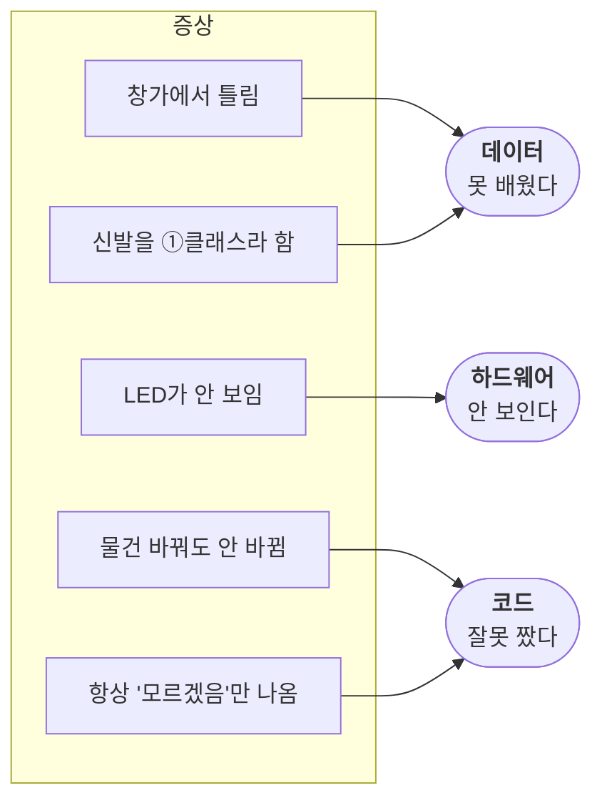

### 분류 실습표 — 5차시 ✕ 를 전부 옮겨 적고 분류

| ✕ 항목 | 데이터? | 코드? | 하드웨어? | 왜 그렇게 생각하나 |
|---|---|---|---|---|
| | ☐ | ☐ | ☐ | |
| | ☐ | ☐ | ☐ | |
| | ☐ | ☐ | ☐ | |
| | ☐ | ☐ | ☐ | |
| | ☐ | ☐ | ☐ | |

### 판단 기준 (학생용)

| 이런 증상이면 | 이 문제 |
|---|---|
| **못 가본 곳·못 본 것**에서 틀린다 | **데이터** — 안 가르쳤다 |
| 항상 똑같이 이상하다 · 순서가 이상하다 | **코드** — 잘못 짰다 |
| 화면에는 맞는데 **안 보이거나 안 들린다** | **하드웨어** — 가려졌다 |

> **핵심 발문** — "이건 **AI가 못 배운 걸까요, 우리가 코드를 잘못 짠 걸까요, 아니면 물건이 잘못 만들어진 걸까요?**"
>
> **🔴 AI 금지 지점** — 원인 진단을 AI에게 묻지 않습니다. **이 판단이 오늘의 학습 목표 그 자체입니다.**

---

## 15–40 · 실습 21 — 개선 1회전 (25분)

### 개선 루프

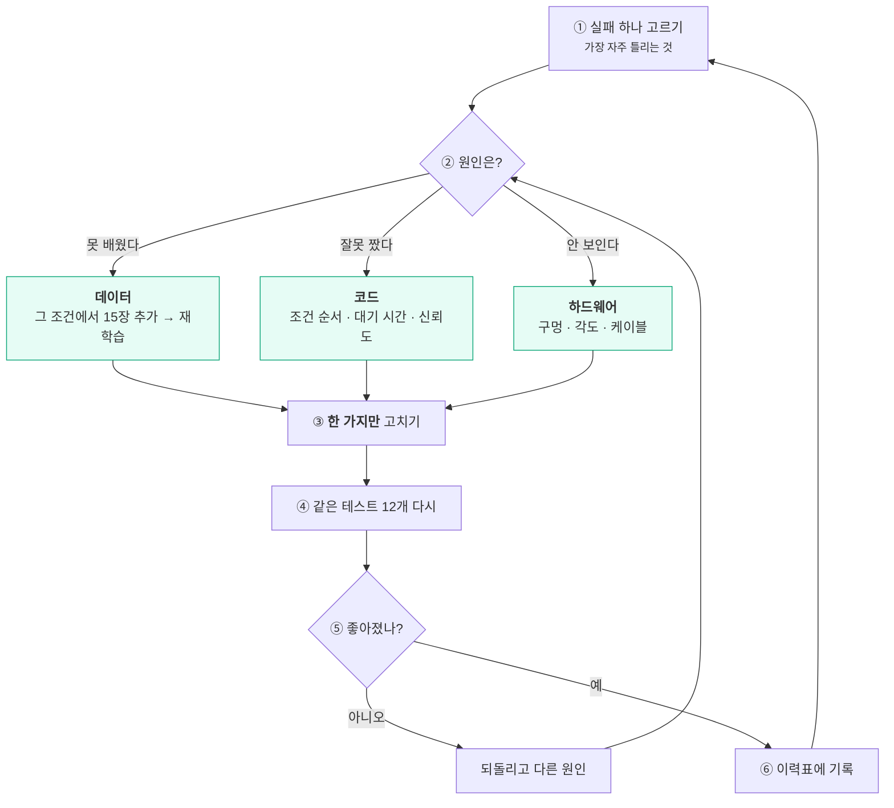

### 시간 배분

| 분 | 할 일 |
|---|---|
| 15–18 | **실패 1순위 선택** + 원인 확정 |
| 18–28 | **한 가지만 고치기** (아래 표 참조) |
| 28–40 | **테스트 12개 전부 다시** 돌리기 |

### 원인별 고치는 방법

| 원인 | 구체적으로 무엇을 하나 | 걸리는 시간 |
|---|---|---|
| **데이터** | 실패한 **그 조건 그대로** 15장 추가 촬영 → 재학습 | 10분 |
| **코드** | 조건 순서 바꾸기(실습 C) / 대기 시간 조정(실습 A) / 소리 길이 줄이기(실습 D) | 3분 |
| **하드웨어** | LED 구멍 뚫기 / 웹캠 각도 조정 / 케이블 정리 | 5분 |

### 데이터 보충 촬영 요령 — 오늘 학생이 데이터를 만드는 유일한 순간

> **교사 베이스 데이터셋의 빈틈을 학생이 직접 메웁니다.** 이 수업에서 학생이 "AI를 가르치는" 실감을 가장 크게 갖는 지점입니다.

```
┌─ 보충 촬영 규칙 ─────────────────────────┐
│                                          │
│  ① 실패한 조건과 똑같이 찍는다             │
│     T5에서 창가에서 틀렸다 → 창가에서 찍는다 │
│     T7에서 다른 사람이 들 때 틀렸다        │
│        → 다른 사람이 든 채로 찍는다        │
│                                          │
│  ② 15장이면 충분하다                      │
│     더 찍는다고 더 좋아지지 않는다          │
│                                          │
│  ③ 한 조건만 보충한다                     │
│     창가와 사람을 동시에 보충하면           │
│     무엇이 효과였는지 모른다                │
│                                          │
│  ④ 다른 클래스는 건드리지 않는다            │
│     ①만 창가에서 15장 더 찍으면            │
│     ①이 유리해져 다른 게 망가질 수 있다      │
│     → ②③도 창가에서 5장씩 같이 찍는다      │
└──────────────────────────────────────────┘
```

| 실패 유형 | 무엇을 몇 장 |
|---|---|
| T5 창가에서 틀림 | 창가에서 ① 15장 · ② ③ 각 5장 |
| T7 다른 사람이 들면 틀림 | 다른 사람 손으로 ① 15장 · ② ③ 각 5장 |
| T8 멀리서 틀림 | 1~2m 거리에서 ① 15장 · ② ③ 각 5장 |
| T10 엉뚱한 것을 클래스로 봄 | **'모르겠음'에** 그 물건 15장 |

> **④번이 중요합니다.** 한 클래스만 보충하면 데이터 균형이 깨져 **다른 클래스가 나빠집니다.**
> 5차시보다 ○가 줄어드는 팀이 나오면 대개 이 이유입니다. 그것도 훌륭한 배움이니 이력표에 적게 하세요.

### ⚠ 오늘의 절대 규칙

```
 ┌────────────────────────────────────────────┐
 │   한 번에 하나만 고친다.                      │
 │   두 개를 동시에 고치면                       │
 │   무엇이 효과가 있었는지 알 수 없다.            │
 └────────────────────────────────────────────┘
```

### 1회전 기록

```
   무엇이 안 됐나 : ________________________
   원인은        : ☐데이터 ☐코드 ☐하드웨어
   무엇을 고쳤나  : ________________________
   테스트 결과    : ○ ____ / 12  (전 : ○ ____ / 12)
   좋아졌나      : ☐예 ☐아니오
   주도한 사람    : ____________
```

> **✕가 나와도 성공입니다.** "되돌리고 다른 원인 시도"가 **정상 경로**입니다.

---

## 40–50 · 쉬는 시간

---

## 50–72 · 실습 22 — 개선 2회전 (+ 3회전) (22분)

같은 루프를 반복합니다. **2순위 실패**를 고릅니다.

| 분 | 할 일 |
|---|---|
| 50–52 | 실패 2순위 선택 + 원인 확정 |
| 52–60 | 한 가지만 고치기 |
| 60–70 | 테스트 12개 다시 |
| 70–72 | 기록 · 시간 남으면 3회전 |

```
   [ 2회전 ]
   무엇이 안 됐나 : ________________  원인 : ☐데이터 ☐코드 ☐HW
   무엇을 고쳤나  : ________________  ○ ____ / 12   주도 : _______

   [ 3회전 ]  (시간이 남으면)
   무엇이 안 됐나 : ________________  원인 : ☐데이터 ☐코드 ☐HW
   무엇을 고쳤나  : ________________  ○ ____ / 12   주도 : _______
```

---

## 72–80 · 실습 23 — v0.3 신뢰도 조건 도전 (8분)

**3차시 실습 B에서 배운 신뢰도를 코드에 씁니다.** 이 수업의 마지막 코드 수정입니다.

```
[ 우리 코드 v0.3 — 신뢰도 조건 추가 ]

      [ 만약  ( (①클래스 에 대한 신뢰도) > (0.7) )  이라면 ]   ← 확실할 때만 반응
          [ "____________" 라고 말하기 ]
          [ ____ 보여주기 ]
          [ (1) 초 기다리기 ]
          [ 마이크로비트 모든 LED 끄기 ]
      [ 아니면 ]
          [ "잘 모르겠어요" 라고 말하기 ]
          [ 엑스 보여주기 ]
```

### 실습 카드 23 — 임계값을 직접 고른다

| ① 고친다 | ② 예측한다 | ③ 테스트한다 | ④ 이해한다 |
|---|---|---|---|
| `0.7` → `0.9` | 어떻게 달라질까 | 클래스 ① 5번 | |
| `0.9` → `0.3` | 어떻게 달라질까 | 클래스 ① 5번 · 엉뚱한 것 5번 | |
| **우리 값 : ____** | | 테스트 12개 | ○ ___/12 |

> **발문** — "0.7을 **0.9로 올리면** 어떻게 될까요? **0.3으로 내리면요?**"
>
> 올리면 **조심스러워지고**(놓치는 게 많아짐), 내리면 **성급해집니다**(틀리는 게 많아짐).
> **어느 쪽이 우리 발명품에 나을지 팀이 결정하게 합니다. 정답은 없습니다.**

> **1차시와 연결** — "1차시에 '컵에 물이 얼마나 남아야 비었나' 물었죠.
> **지금 여러분이 그 선을 긋고 있는 거예요.**"

---

## 80–86 · 실습 24 — '모르겠음' 통 열어보기 (6분)

```
┌──────────────────────────────────────────────────────┐
│           우리가 '모르겠음' 에 넣은 것들                 │
│   ______________  ______________  ______________     │
│   ______________  ______________  ______________     │
│                                                      │
│   이것들은 정말 '모르는' 것이었나요?                     │
│   아니면 우리가 관심 없었던 것인가요?                     │
│   ______________________________________________     │
│                                                      │
│   우리 발명품이 가장 못 알아보는 것은?                    │
│   ______________________________________________     │
│   그건 왜 그럴까요?                                    │
│   ______________________________________________     │
└──────────────────────────────────────────────────────┘
```

> **핵심 발문** — "'모르겠음'은 **AI가 몰라서** 넣은 걸까요, **우리가 안 가르쳐서** 못 아는 걸까요?"
>
> **답을 정리해 주지 마세요. 아이들이 잠깐 멈추면 그것으로 충분합니다.**

---

## 86–90 · 개선 이력표 완성 + 마무리

### 개선 후 영상 30초 촬영 → 4차시 영상과 나란히 재생

```
┌──────────────────────────────────────────────────────────┐
│                    개 선 이 력 표                          │
│  발명품 이름 : ______________________                      │
│  우리의 사용자 : ______________________ (2차시 페르소나)     │
├────┬─────────────┬──────────┬─────────────┬─────────────┤
│회전 │ 무엇이 안 됐나 │ 원인은?    │ 무엇을 고쳤나  │ 테스트 결과   │
├────┼─────────────┼──────────┼─────────────┼─────────────┤
│ 1  │             │ 데이터/코드/│             │ ○ __ /12     │
│    │             │ 하드웨어    │             │             │
├────┼─────────────┼──────────┼─────────────┼─────────────┤
│ 2  │             │           │             │ ○ __ /12     │
├────┼─────────────┼──────────┼─────────────┼─────────────┤
│ 3  │             │           │             │ ○ __ /12     │
└────┴─────────────┴──────────┴─────────────┴─────────────┘

  처음    ○ ____ / 12        (5차시)
  마지막  ○ ____ / 12        →  ______ 개 좋아졌다

  우리가 그은 선 : ____________ 부터를 ____________ 라고 정했다.
  그 이유       : _______________________________________

  아직 못 고친 것 : _____________________________________
  다음에 해본다면  : _____________________________________
     (2차시 WON'T 목록 + 동작 설계표 여백의
      '다르게 나눌 수 있었던 방법'을 꺼내 보세요)

  서명 :  A ________  B ________  C ________
```

**마지막 네 칸을 반드시 채우게 합니다.**

> **마무리 발문** — "다 고쳤나요? 아니죠.
> **발명은 완성되는 게 아니라 계속 고쳐지는 것**입니다. 오늘 여러분은 **한 바퀴를 돌았습니다.**"

**준비물** — 개선 이력표 A3, 5차시 테스트 기록지, 4차시 개선 전 영상, 추가 촬영 소품, 공구(가위·글루건·펀치), 노트북

---
---
---

# 3부 · AI 활용 설계

> 요청하신 세 갈래(교사 제작 / 학생 질문 / AI 코드 검증)를 모두 반영했습니다.

## 3.1 세 갈래가 수업 어디에 붙는가

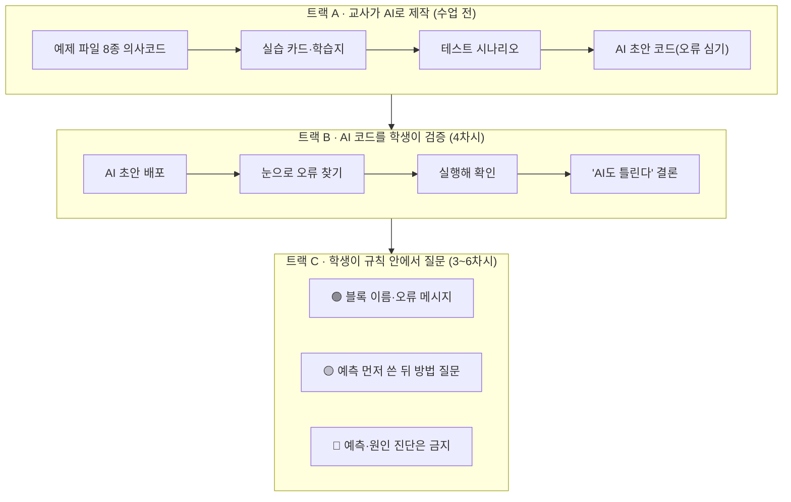

| 트랙 | 언제 | 누가 | 무엇을 |
|---|---|---|---|
| **A** | 수업 2주 전 | 교사 | 예제 8종 · 학습지 · 테스트 시나리오 · 오류 심은 초안 |
| **B** | 4차시 52–62분 | 학생 | AI 초안에서 오류 2곳 찾기 |
| **C** | 3~6차시 상시 | 학생 | 신호등 규칙 안에서 질문 |

---

## 3.2 트랙 A — 교사용 AI 프롬프트 7종

그대로 복사해 쓰실 수 있게 썼습니다. **`[ ]` 안만 바꾸세요.**

### 프롬프트 1 — 예제 파일 의사코드 생성

```
초등 5학년 대상 엔트리(Entry) 블록코딩 수업 예제를 만들어 줘.

조건:
- 엔트리 인공지능 '분류: 이미지' 모델 사용
- 마이크로비트 v2 연동
- 블록 의사코드로 작성 (실제 엔트리 블록 이름 사용)
- 10줄을 넘기지 말 것
- 한 파일에 원리 하나만 담을 것
- 학생이 바꿀 지점(숫자/순서)이 눈에 띄게

만들 예제: [분류 결과만 화면에 말하는 최소 코드]

출력 형식:
[ 블록1 ]
  [ 블록2 ]
형태로, 들여쓰기로 중첩을 표현해 줘.
```

### 프롬프트 2 — 실습 카드(MTU) 생성

```
아래 예제 코드로 초등 5학년용 실습 카드를 만들어 줘.

[여기에 예제 코드 붙여넣기]

형식은 MTU 루프:
① 고친다 (딱 한 군데)
② 예측한다 (실행 전에 쓰는 칸 + 이유 칸)
③ 테스트한다 (구체적으로 몇 번, 무엇을)
④ 이해한다 (한 문장 빈칸 채우기)

실습은 4개, 각 3분 안에 끝나야 해.
난이도는 쉬운 것부터 놀라운 것 순서로.
마지막 실습에서 아이가 "어?" 하고 놀랄 만한 걸 배치해 줘.
```

### 프롬프트 3 — 발문 세트 생성

```
아래 실습에서 초등 5학년에게 던질 발문을 만들어 줘.

[실습 내용 붙여넣기]

조건:
- 답을 알려주는 발문 금지. 질문만.
- 아이가 스스로 원리를 말하게 유도할 것
- "왜"로 시작하는 질문 위주
- 실습 직후 1개, 정리용 1개
- 아이가 틀린 예측을 했을 때 받아주는 말도 1개
```

### 프롬프트 4 — **오류를 일부러 심은 초안 코드** (4차시 실습 13용)

```
초등 5학년이 엔트리로 만드는 이미지 분류 + 마이크로비트 발명품 코드를
블록 의사코드로 써 줘.

클래스: [①클래스] [②클래스] [③클래스] [모르겠음] 4개
반응: LED 모양 + 소리 + 1초 후 지우기

그런데 일부러 초등학생이 자주 하는 실수 2가지를 넣어 줘:
1. 조건 순서 실수 — '모르겠음'을 맨 위에 두기
2. LED 지우기 위치 실수 — 켜기 직전에 지우기

어디가 틀렸는지는 알려주지 말고 코드만 출력해 줘.
줄 번호를 붙여 줘.
```

> **이 프롬프트가 트랙 B의 핵심 재료입니다.** 정답은 교사만 갖고 있습니다.

### 프롬프트 5 — 테스트 시나리오 생성

```
아래 발명품의 테스트 항목 12개를 만들어 줘.

발명품: [설명]
클래스: [①][②][③][모르겠음]
사용 환경: 초등학교 교실

조건:
- T1~T4는 학습한 환경에서 기본 동작 확인
- T5~T10은 반드시 실패하도록 설계 (환경 변화, 방해 조건)
- T11~T12는 지속성 확인
- 각 항목은 초등 5학년이 2분 안에 실행 가능해야 함
- '기대 결과' 칸을 채워 줘
```

### 프롬프트 6 — 페르소나 예시 생성 (2차시 교사 참고용)

```
초등학교 5학년이 [주제]를 해결하는 발명품을 만듭니다.
이 발명품을 쓸 사용자 페르소나를 초등학생 눈높이로 써 줘.

포함할 것:
- 가명, 학년
- 어떤 사람인가 3줄
- 언제/어디서 이 문제를 겪나
- 지금은 어떻게 해결하나
- 왜 그 방법이 부족한가
- 이 사람이 할 것 같은 말 (큰따옴표 한 문장)
- 절대 원하지 않는 것

주의: 완벽하고 착한 사람으로 그리지 말고,
짜증나고 귀찮아하는 진짜 초등학생처럼 써 줘.
```

### 프롬프트 7 — 교사용 트러블슈팅 대비

```
엔트리 + 마이크로비트 v2 + 웹캠으로 이미지 분류 발명품을 만드는
초등 수업에서 자주 생기는 기술 문제와 즉시 대처법을 표로 정리해 줘.

환경: 학교 PC, 보안 프로그램 설치됨, 웹캠 + 시리얼 동시 사용
대상: 기술 지원 없이 혼자 수업하는 교사
형식: 증상 | 원인 | 30초 안에 할 수 있는 대처
```

> **⚠ AI가 준 것은 전부 사전 점검 PC에서 실제로 돌려 보세요.**
> 엔트리 블록의 정확한 이름과 위치는 **버전에 따라 다릅니다.** AI는 이걸 모릅니다.

---

## 3.3 트랙 B — AI 코드를 테스트 대상으로 다루기

### 왜 이 활동이 중요한가

| 흔한 오해 | 이 활동이 심는 것 |
|---|---|
| "AI가 준 코드는 맞겠지" | **AI도 틀린다. 반드시 돌려봐야 한다** |
| "AI한테 물어보면 빨라" | **틀린 코드를 받으면 오히려 느려진다** |
| "코드는 어려워서 못 읽어" | **읽을 줄 알아야 AI를 쓸 수 있다** |

### 4차시 실습 13 진행 요약

```
 52–54분  교사가 AI 초안 코드 배포 (오류 2곳)
 54–60분  학생이 실행하지 않고 눈으로 찾기
 60–62분  실행해 확인 + 결론
```

> **결론 대사** — **"AI 코드는 정답이 아니라 초안이에요. 검사하는 사람은 여러분이에요."**

### 확장 (시간이 남을 때)

6차시에 여유가 있으면 한 번 더 씁니다.

```
   교사 : "이 실패를 AI한테 물어봤더니 이렇게 고치라고 했어요."
          (교사가 미리 받아둔 AI 답변 제시)
   발문 : "AI 말이 맞을까요? 우리 테스트 12개로 확인해 봅시다."
```

**AI 제안을 테스트로 검증하는 것** — 이것이 이 수업이 가르치는 AI 활용법입니다.

---

## 3.4 트랙 C — 학생 AI 사용 신호등 (재확인)

| 신호 | 허용 범위 | 예시 |
|---|---|---|
| 🟢 **바로 물어봄** | 도구 사용법 · 오류 메시지 · 단어 뜻 | "신뢰도 블록 어디 있어?" "'하드웨어 연결 안 됨'이 무슨 뜻이야?" |
| 🟡 **예측 먼저 쓴 뒤, 교사 확인 후** | 방법 질문 · 원리 질문 | "'아니면 만약' 블록 추가하는 법?" "왜 LED가 깜빡여?" |
| 🔴 **금지** | 예측 대신 · 원인 진단 대신 | "실행하면 어떻게 돼?" "우리 AI가 왜 틀렸어?" "코드 완성해 줘" |

### 교사 운영 팁

- **1차시에 서명**을 받아 두면 3차시 이후 지적이 쉽습니다. 말로 혼내지 말고 **서명한 종이를 가리키세요.**
- 🟡을 물어본 뒤에는 **반드시 테스트로 확인**하게 합니다. "AI가 그랬어요"는 근거가 아닙니다.
- 🔴을 물어본 것이 발각되면 벌하지 말고 **"그럼 그거 우리가 먼저 맞혀 볼까?"** 로 되돌립니다.

---
---

# 4부 · 교사 운영 요약

## 4.1 실습 시간 총량

| 차시 | 총 90분 중 실습 | 교사 설명 |
|---|---|---|
| 1차시 | 55분 | 10분 |
| 2차시 | 75분 | 5분 |
| 3차시 | 80분 | 5분 |
| 4차시 | 80분 | 5분 |
| 5차시 | 80분 | 3분 |
| 6차시 | 80분 | 3분 |
| **합계** | **450분 (83%)** | **31분** |

> **교사 설명이 회당 10분을 넘으면 실습이 밀립니다.** 설명하고 싶어지면 **발문으로 바꾸세요.**

## 4.2 MTU 루프 총 횟수

| 차시 | MTU 루프 | 내용 |
|---|---|---|
| 3차시 | 9회 | 실습 A(4) + B(4) + C(1) |
| 4차시 | 9회 | 실습 D(4) + E(1) + F(3) + AI검증(1) |
| 4차시 | 6회 | v0.1 여섯 줄 고치기 |
| 5차시 | 4회 | 갈래별 붙이고 확인 |
| 6차시 | 3~6회 | 개선 회전 + 신뢰도 임계값 |
| **합계** | **약 31~34회** | |

## 4.3 시간이 부족할 때 — 줄이는 순서

1. 먼저 — **5차시 몸체 제작** (종이컵·상자로 대체, 10분 → 3분)
2. 다음 — **2차시 벤치마킹 표** (표 생략, 한 문장만)
3. 다음 — **3차시 '모르겠음' 촬영 20장 → 12장** (교사가 8장 미리 채워 둠)
4. 다음 — **4차시 실습 F** (센서)
5. 다음 — **1차시 갈래 5개 → 3개**
5. **절대 줄이지 말 것**

```
   ✕ 3차시 실습 C  (조건 순서)         — 빠지면 코드를 못 읽음
   ✕ 3차시 실습 12 (약점 예측 · 봉인)   — 빠지면 5차시가 그냥 오류 찾기가 됨
   ✕ 4차시 실습 E  (지우기 위치)        — 빠지면 5차시 LED가 안 됨
   ✕ 5차시 테스트 12개                 — 빠지면 6차시에 고칠 게 없음
   ✕ 6차시 전체                       — 빠지면 그냥 따라 하기 수업
   ✕ 2차시 MUST 3개 제한               — 빠지면 6차시 안에 못 끝냄
```

## 4.4 실습이 무너지는 다섯 가지

| 무너지는 지점 | 신호 | 대처 |
|---|---|---|
| **예측 건너뛰기** | 실행 버튼부터 누름 | **예측지를 걷은 뒤 실행 허락** |
| **한 명 독점** | 한 아이만 마우스 | 실습 카드를 손가락으로 가리킴 (§1.3) |
| **되돌리기 안 함** | 다음 실습이 이상함 | 실습 카드 ⑤ 칸 체크 확인 |
| **두 개 동시 수정** | 원인 파악 불가 | "지금 몇 군데 고쳤어요?" |
| **AI에 예측 위임** | 답이 너무 빠름 | 서명한 신호등 포스터를 가리킴 |

## 4.5 자주 나오는 기술 문제

| 증상 | 원인 | 30초 대처 |
|---|---|---|
| 웹캠이 안 잡힘 | 브라우저 권한 미허용 | 주소창 카메라 아이콘 → 허용 |
| 마이크로비트 연결 안 됨 | **충전 전용 USB 케이블** | 데이터 전송용으로 교체 |
| 한쪽 클래스로만 분류됨 | 클래스별 사진 수 불균형 | 적은 쪽 10장 보충 후 재학습 |
| 프로그램이 버벅임 | 웹캠 + 시리얼 동시 부하 | 다른 프로그램 종료 · 기다리기 블록 추가 (실습 F) |
| LED가 계속 깜빡임 | 반복문마다 재출력 | 켜기 → 대기 → 지우기 순서 확인 (실습 E) |
| 반응이 한 박자 늦음 | 대기 시간이 김 | 실습 A 결과로 조정 |
| 소리가 끊기고 겹침 | 소리 길이 > 대기 시간 | 소리를 0.5초 이하로 (실습 D3) |

## 4.6 차시별 산출물 체크

| 차시 | 반드시 나와야 하는 것 | 없으면 |
|---|---|---|
| 1 | 문제 카드 · 팀 주제 1개 | 2차시 진행 불가 |
| 2 | **동작 설계표 · 데이터 계획표** | 3차시 촬영 불가 |
| 3 | **학습된 모델** · 대기시간 · 조건순서 · **봉인된 약점 예측** | 4차시 코드 수정 불가 |
| 4 | **코드 v0.1** (화면 출력 정상) | 5차시 하드웨어 결합 불가 |
| 5 | **코드 v0.2 · 실패 10건 이상** | 6차시에 고칠 게 없음 |
| 6 | **개선 이력표** | 프로젝트 미완 |

---

# 5부 · 학습 데이터 준비 — 교사 베이스 + 학생 보충

> 컴퓨터 비전 수업에서 학습 데이터는 **이미 만들어진 것을 쓰는 것이 정상**입니다.
> 다만 이 수업은 **데이터 부족이 실패의 원인**이라는 걸 6차시에 발견하게 하는 구조라, 완제품을 주면 개선 3갈래 중 하나가 사라집니다.
> 그래서 **2층 구조**를 씁니다.

## 5.1 누가 무엇을 만드는가

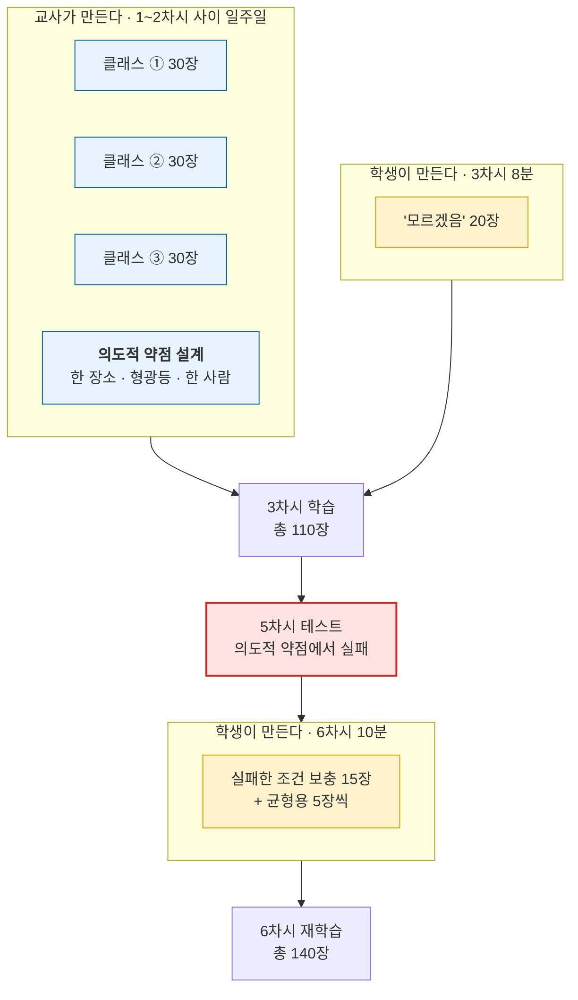

| 누가 | 언제 | 무엇을 | 장수 | 시간 |
|---|---|---|---|---|
| **교사** | 1차시 후 일주일 | 클래스 ①②③ | 90장 | 40분 |
| **학생** | 3차시 72–80분 | '모르겠음' | 20장 | 8분 |
| **학생** | 6차시 개선 회전 | 실패 조건 보충 | 25~30장 | 10분 |

> **학생의 촬영 부담이 총 18분으로 줄었습니다.** (기존안 17분+α → 8분 + 10분, 그마저 두 차시에 분산)

## 5.2 왜 완제품을 안 주는가 — 이 설계의 이유

| 완제품만 줄 때 | 2층 구조일 때 |
|---|---|
| 5차시 실패가 나와도 **"원래 그런가 보다"** | 데이터 카드를 봤으므로 **"창가에서 안 찍었잖아"** 가 나온다 |
| 6차시 개선이 **코드·하드웨어 2갈래**로 축소 | **데이터·코드·하드웨어 3갈래**가 유지된다 |
| AI를 **주어진 것**으로 경험 | AI를 **내가 가르치는 것**으로 경험 |
| '모르겠음'이 우리 교실과 안 맞음 | '모르겠음'은 그 팀만 만들 수 있다 |

> **핵심** — 학생이 데이터를 **만드는 양**은 줄이되, 데이터를 **읽고 진단하고 처방하는 일**은 늘렸습니다.
> 실제 AI 개발자가 하는 일도 촬영이 아니라 이쪽입니다.

## 5.3 교사 베이스 데이터셋 제작 — 40분 작업

### 언제 만드나

```
   1차시 종료 → 주제 확정
        │
        │  ← 여기서 예비 촬영 시작 (문제 카드의 ①②③ 후보로)
        ▼
   2차시 종료 → 클래스 확정
        │
        │  ← 여기서 차이 나는 부분만 보완 · 데이터 카드 작성
        ▼
   3차시 → 학생에게 전달
```

> **주 1회 6주 일정이라 1차시→3차시 사이에 2주가 있습니다.** 충분합니다.
> 2차시에 클래스가 바뀔 수 있으니 **1차시 직후에 다 찍지 말고 60% 정도만** 찍어 두세요.

### ★ 의도적 약점 설계 — 이 표대로 찍습니다

**완벽한 데이터셋을 만들면 안 됩니다.** 5차시에 실패가 안 나오고, 실패가 없으면 6차시에 고칠 게 없습니다.

| 항목 | 이렇게 찍는다 | 일부러 빼는 것 | 5차시에 터지는 테스트 |
|---|---|---|---|
| **장소** | **1곳만** (교실 앞 흰 벽) | 창가 · 복도 | **T5** 창가 이동 |
| **조명** | **형광등만** | 자연광 · 어두운 곳 | **T5** |
| **배경** | 단색 벽만 | 게시판 · 어수선한 배경 | **T6** 배경 변화 |
| **든 사람** | **교사 한 명** | 다른 사람 · 아이 손 | **T7** 다른 사람 |
| **거리** | **30cm 고정** | 멀리 · 아주 가까이 | **T8** 멀리서 |
| **가림** | 온전한 물건만 | 반쯤 가린 것 | **T9** 반쯤 가리기 |
| **각도** | 정면 + 좌우 약간 | 위·아래에서 | — |

> **다 빼면 안 됩니다.** 위 6개를 전부 빼면 성능이 너무 낮아 3차시 기본 테스트(①~⑤)부터 실패합니다.
> **권장 — 장소·조명·든 사람 3개만 좁히고, 나머지(각도·거리)는 어느 정도 다양하게.**

### 30장 찍는 요령 (클래스당 10분)

```
   정면 · 30cm             10장
   좌 15도 · 30cm           5장
   우 15도 · 30cm           5장
   약간 위에서               5장
   물건을 바꿔가며            5장   (같은 클래스의 다른 물건)
   ───────────────────────────
                          30장
```

> **같은 클래스 안에서는 물건 종류를 다양하게.** 페트병만 30장 찍으면 우유병을 못 알아봅니다.
> 예) 플라스틱 = 페트병 · 플라스틱 컵 · 요구르트병

### 클래스 균형 — 반드시 지킬 것

```
   ① 30장   ② 30장   ③ 30장   ④ 모르겠음 20장
```

> 한 클래스가 다른 것의 2배가 되면 **AI가 그쪽으로 쏠립니다.** 3차시에 "한쪽으로만 분류됨" 증상이 나오면 대개 이 문제입니다.
> '모르겠음'만 20장인 것은 의도적입니다. 학생이 8분에 찍을 수 있는 양이 그 정도입니다.

## 5.4 데이터 카드 — 학생에게 함께 주는 것

**데이터셋만 주고 카드를 안 주면 3차시 실습 11·12가 성립하지 않습니다.**

```
┌─ 데 이 터 카 드 ─────────────────────────────┐
│  발명품 : ______________________             │
│                                              │
│  클래스 ① ______  30장                       │
│           (찍은 물건 : _________________)     │
│  클래스 ② ______  30장                       │
│           (찍은 물건 : _________________)     │
│  클래스 ③ ______  30장                       │
│           (찍은 물건 : _________________)     │
│  클래스 ④ 모르겠음  0장  ← 여러분이 채웁니다     │
│                                              │
│  찍은 장소  : ______________  (___곳)         │
│  찍은 거리  : ______ cm                       │
│  찍은 각도  : ______________                  │
│  조명      : ______________                   │
│  든 사람   : ______________  (___명)          │
│  배경      : ______________                   │
│  찍은 날짜 : ____월 ____일                    │
└──────────────────────────────────────────────┘
```

> **카드는 정직하게 씁니다.** "1곳", "1명", "형광등만"을 그대로 적어야 학생이 약점을 찾아냅니다.
> 숨기면 실습 12(약점 예측)가 추측 게임이 됩니다.

## 5.5 6주 운영 캘린더 — 교사 준비 일정

| 주차 | 수업 | 수업 사이에 교사가 할 일 | 소요 |
|---|---|---|---|
| **-2주** | — | **PC 사전 점검** (웹캠→시리얼→LED 완주) · 엔트리 버전별 블록 이름 확인 | 60분 |
| **-1주** | — | **예제 파일 8종 제작** (완성예제·CV-1·2·3A·3B·PC-1·1′·2) · LED 함수 4종 · 예제용 분리수거 모델 | 120분 |
| **1주** | **1차시** 주제 확정 | 🚨 **베이스 데이터셋 예비 촬영 60%** (문제 카드 ①②③ 후보로) | 25분 |
| **2주** | **2차시** 클래스 확정 | 🚨 **데이터셋 보완 + 데이터 카드 작성** · 벤치마킹 사진 3~5장 준비 | 25분 |
| **3주** | **3차시** CV 실습·학습 | AI 초안 코드 준비 (오류 2개 심기 · 3부 프롬프트 4번) · 정답지 보관 | 20분 |
| **4주** | **4차시** PC 실습·v0.1 | 하우징 재료 준비 · 건전지 홀더 점검 · 테스트 소품 준비(줄자·신발 등) | 20분 |
| **5주** | **5차시** 결합·테스트 | 개선 이력표 A3 인쇄 · 6차시 보충 촬영 동선 확인 | 15분 |
| **6주** | **6차시** 개선 | 결과물 사진 보관 · 학생 사진 데이터 삭제 | 15분 |

> **가장 위험한 칸은 1주와 2주입니다.** 여기가 밀리면 3차시에 학생이 할 게 없습니다.
> 최악의 경우 대비 — **예제용 분리수거 모델을 그대로 쓰고, 주제만 분리수거로 맞추는 비상 경로**를 열어 두세요.

## 5.6 촬영 동의와 데이터 관리

| 항목 | 조치 |
|---|---|
| 사람이 찍히는 주제(자세·손·행동) | **촬영 전 학생·보호자 동의서** 필수 |
| 다른 반 학생이 배경에 나오는 경우 | 해당 사진 삭제 후 재촬영 |
| 학습용 사진 보관 | **프로젝트 종료 후 삭제**를 6차시 마지막에 학생과 함께 실행 |
| 클라우드 업로드 | 학교 정책 확인 · 가능하면 로컬 저장만 |

> **6차시 마지막 2분에 학생이 보는 앞에서 삭제하세요.** 이것 자체가 AI 윤리 수업 장면이 됩니다.
> **발문** — "우리가 찍은 사진, 이제 어떻게 할까요? 왜 지워야 할까요?"

---

# 6부 · 한 장 요약

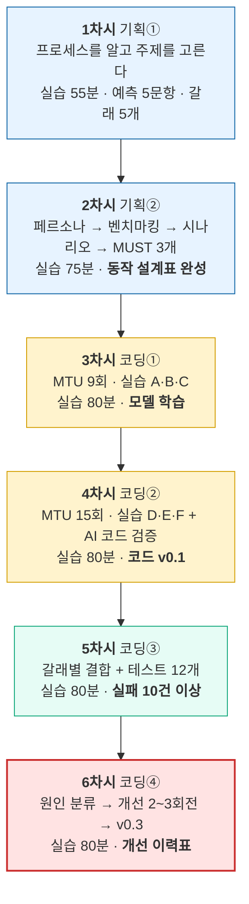

```
 ┌────────────────────────────────────────────────────────────┐
 │                                                            │
 │   왜 이 방식인가                                              │
 │                                                            │
 │   6차시 · 3인 · 초등 5학년 · 실물 하드웨어                     │
 │   이 조건에서 "고쳐서 완성하는 경험"까지 가려면                  │
 │                                                            │
 │   작동하는 코드에서 출발해                                     │
 │   한 번에 한 군데씩 고치고 즉시 테스트하는 방식 외에             │
 │   완주 가능한 경로가 없다.                                     │
 │                                                            │
 │   그리고 AI가 쓴 코드도                                       │
 │   정답이 아니라 테스트 대상이다.                                │
 │                                                            │
 └────────────────────────────────────────────────────────────┘
```

---

*엔트리 블록 이름과 마이크로비트 연결 절차는 도구 버전에 따라 달라질 수 있습니다. 예제 파일을 만들 때 반드시 실제 사용할 PC에서 함께 확인해 주세요.*
*사람을 촬영하는 주제는 촬영 전 학생·보호자 동의를 받고, 학습용 사진은 프로젝트 종료 후 삭제하도록 지도해 주세요.*
