# 만들면서 배우는 AI 발명 프로젝트 — 통합 수업안

## 초등 5학년 · 3인 1팀 · **6차시** · 기획 2차시 + 제작 4차시

---

| 항목 | 내용 |
|---|---|
| **대상** | 초등학교 5학년 3명 (1팀) |
| **차시** | **6차시 × 90분 = 540분** |
| **구성** | **1~2차시 = 기획 완결 · 3~6차시 = 제작(코딩)** |
| **도구** | 웹캠 → 컴퓨터(엔트리 블록 코딩) → 마이크로비트 v2 |
| **수업 방식** | **PRIMM** — 짜여 있는 코드를 예측·실행·조사한 뒤, **수정(Modify)에서 제작을 시작**한다 |
| **끝나는 지점** | 발표회가 아니라 **개선을 2~3회전 거친 발명품 + 개선 이력표** |
| **통합 원본** | 6차시 커리큘럼 · 도식화 · 주제확장 생각의여백 가이드 · 주제카드 10선 |

> **이 문서 하나로 수업이 굴러갑니다.** 네 문서를 요청하신 진행 순서로 재배치하고, 새로 필요한 두 단계(페르소나·벤치마킹 / 유저 시나리오·기능 정의)를 **2차시 안에 다 끝나도록** 압축 설계했습니다. 3~6차시 코딩은 기존 방식(PRIMM 실험 A~F, 코드 v0.1→v0.2→v0.3)을 그대로 씁니다.

---

# 0. 수업 설계 — 시작하기 전에

## 0.1 여섯 단계가 6차시에 들어가는 방식

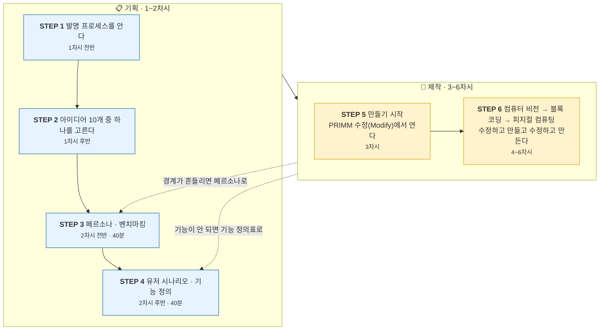

> **핵심 원칙 — 2차시가 끝나는 순간 기획은 끝납니다.**
> 3차시부터는 컴퓨터 앞에만 앉습니다. 클래스·반응·기능이 3차시 이후에 바뀌면 데이터를 다시 찍어야 하고, 6차시 안에 절대 못 끝냅니다.

## 0.2 왜 이 순서인가

| 단계 | 이 단계가 없으면 생기는 일 |
|---|---|
| ① 프로세스 | 만들다 실패하면 "망했다"로 끝난다. 실패가 과정의 일부임을 모른다 |
| ② 주제 선택 | 교사 주제를 받으면 아이는 발명가가 아니라 **실행자**가 된다 |
| ③ 페르소나·벤치마킹 | "나만 편한 물건"이 나온다. 이미 있는 걸 모르고 다시 만든다 |
| ④ 시나리오·기능 정의 | 기능이 계속 늘어나 6차시 안에 아무것도 못 끝낸다 |
| ⑤ PRIMM 수정 진입 | 백지 코딩에서 5학년은 대부분 막힌다 |
| ⑥ 나선형 반복 | ④ 제작에서 수업이 끝나고, 개선 경험이 통째로 사라진다 |

## 0.3 발명 프로세스 — 반복하는 고리

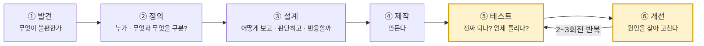

대부분의 수업은 ④ 제작에서 끝납니다. **이 수업은 ⑤↔⑥ 구간에 6차시 중 1.5차시를 씁니다.**

## 0.4 만드는 것 — 눈 · 머리 · 몸

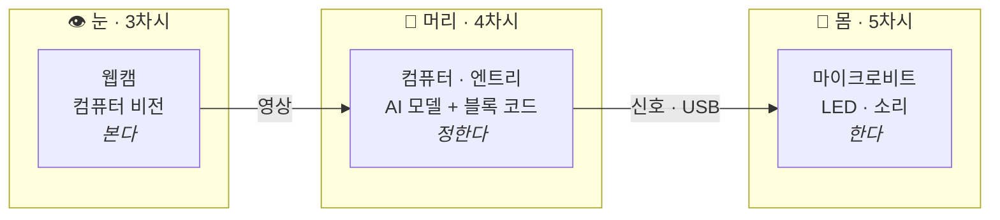

**한 번에 다 붙이지 않습니다.** 눈 → 머리 → 몸 순서로 하나씩 붙이고, 붙일 때마다 확인합니다.

## 0.5 6차시 전체 지도

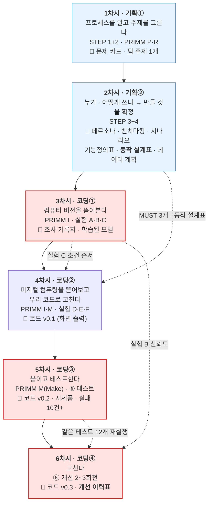

> 붉은 칸은 **시간이 부족해도 절대 줄이지 않습니다.** (실험 C · 테스트 12개 · 개선 전체)

## 0.6 90분 운영 틀 (모든 차시 공통)

```mermaid
gantt
    title 90분 구성
    dateFormat mm
    axisFormat %M분
    section 흐름
    여는 활동 10분   :a1, 00, 10m
    활동 1 · 30분    :crit, a2, after a1, 30m
    쉬는 시간 10분   :a3, after a2, 10m
    활동 2 · 30분    :crit, a4, after a3, 30m
    닫는 활동 10분   :a5, after a4, 10m
```

쉬는 시간 10분은 **반드시 지킵니다.** 몸을 움직이게 하세요.

## 0.7 3인 1팀 역할 로테이션

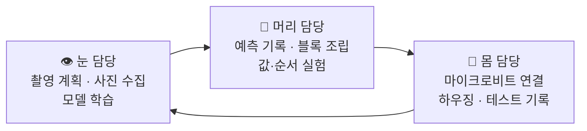

| | 1차시 | 2차시 | 3차시 | 4차시 | 5차시 | 6차시 |
|---|---|---|---|---|---|---|
| **A** | 눈 | 머리 | 몸 | 눈 | 머리 | 몸 |
| **B** | 머리 | 몸 | 눈 | 머리 | 몸 | 눈 |
| **C** | 몸 | 눈 | 머리 | 몸 | 눈 | 머리 |

**PRIMM의 예측(P)만은 예외** — 항상 세 명이 각자 따로 적은 뒤 비교합니다. 맞히는 게 목적이 아니라 **서로 다르게 생각했다는 걸 확인**하는 게 목적입니다.

## 0.8 학습목표

1. 발명이 **발견 → 정의 → 설계 → 제작 → 테스트 → 개선**의 반복 과정임을 자기 프로젝트로 설명할 수 있다.
2. 사용자를 페르소나로 구체화하고, 기존 해결책과 비교해 **우리 것의 다른 점**을 말할 수 있다.
3. 유저 시나리오에서 **필요한 기능만 추려내고 나머지를 미룰 수 있다.**
4. 컴퓨터 비전이 **입력 → 특징 → 분류 → 신뢰도**로 작동함을 예제를 조작해 설명할 수 있다.
5. 피지컬 컴퓨팅이 **입력(센서) → 판단 → 출력(액추에이터)** 구조임을 예제를 조작해 설명할 수 있다.
6. 예제 코드를 **우리 문제에 맞게 수정**해 발명품을 완성할 수 있다.
7. 계획적으로 테스트해 실패를 모으고, 원인을 **데이터·코드·하드웨어**로 나눌 수 있다.
8. 개선 전후를 비교해 **무엇을 고쳐서 무엇이 좋아졌는지** 설명할 수 있다.

## 0.9 교사가 알고 있어야 할 세 관점 — 아이들에게 가르치지 않습니다

| 관점 | 핵심 질문 | 수업에서 만나는 지점 |
|---|---|---|
| **사회학** — 분류에는 권력이 있다 | 누가 범주를 정하는가 | 2차시 클래스 확정 · 6차시 '모르겠음' 열어보기 |
| **심리학** — 사람도 범주로 생각한다 | 몇 개 보고 전체를 판단하면 무엇을 잃나 | 1차시 몸짓 스무고개 · 5차시 창가 실패 |
| **철학** — 경계는 어디에 있는가 | 그 선은 세상에 있나, 우리가 긋나 | 1차시 경계 찾기 · 6차시 신뢰도 임계값 |

```
   ✕  "이걸 사회학에서는 분류의 권력이라고 해요"
   ○  "이 네 가지로 나눈 건 누구예요?"
```

개념어를 꺼내는 순간 아이들은 답을 외우려 합니다. **질문만 던지고, 어색한 침묵을 견디세요.**

---
---
---

# 【1차시】 기획① — 발명 프로세스를 알고, 주제를 고른다

> **STEP 1 + STEP 2** · **프로세스** ① 발견 · **PRIMM** P(예측) · R(실행)
> **오늘의 결과물** 예측 기록지 · 문제 카드 · **팀 주제 1개**

---

## STEP 1 · 발명 프로세스를 안다 (여는 활동 + 활동 1 · 40분)

### 여는 활동 · 10분 — 몸짓 스무고개

한 명이 몸짓만으로 표현하고 둘이 맞힙니다. 3라운드.

> **발문** — "무엇을 보고 알아맞혔어요?"
> 손 위치, 몸의 기울기, 반복 동작. 이것이 **특징**이고, 컴퓨터도 특징을 보고 구분한다고 연결합니다.
>
> **심리학 연결 발문** — "몇 개 안 봤는데 맞혔네요. 사람도 몇 개만 보고 판단하는군요?"

이어서 §0.3의 프로세스 고리를 칠판에 그립니다.

> **핵심 발문** — "발명은 언제 끝날까요?"
>
> 아이들은 "완성되면요"라고 답합니다. 여기서 말해 주세요.
> **"발명은 완성되는 게 아니라 계속 고쳐지는 거예요. 그래서 이 수업의 마지막 시간은 발표회가 아니라 고치는 시간입니다."**

### 활동 1 · 30분 — PRIMM 첫 경험

교사가 미리 만들어 둔 **완성 예제**(분리수거 도우미)를 씁니다. 코드는 이미 다 짜여 있고 마이크로비트도 연결되어 있습니다.

> **주의** — 예제는 끝까지 분리수거로 고정합니다. **PRIMM의 예제는 좁고 구체적일수록 좋습니다.** 여백은 예제가 아니라 프로젝트에 있어야 합니다.

#### ▸ Predict (10분) — 돌리기 전에

블록 코드를 화면에 띄워 놓고 **실행하지 않은 채** 예측 기록지(부록 A)를 각자 채웁니다.

```
시작하기 버튼을 클릭했을 때
  계속 반복하기
    학습한 모델로 분류하기
    만약  분류 결과가 '플라스틱' 인가?  이라면
       "파란 통이에요" 라고 말하기
       마이크로비트 LED에 '하트' 출력하기
    아니면
       마이크로비트 LED에 'X' 출력하기
    1 초 기다리기
```

| 예측 질문 | 나의 예측 |
|---|---|
| 페트병을 보여주면 어떻게 될까? | |
| 연필을 보여주면 어떻게 될까? | |
| 아무것도 안 보여주면? | |
| 1초를 5초로 바꾸면? | |

#### ▸ Run (20분) — 돌려보고 맞춰보기

셋이 번갈아 물건을 보여주며 실행합니다. 예측 기록지 옆 칸에 실제 결과를 적습니다.

> **핵심 발문** — "예측이 맞은 건 몇 개? 틀린 건 뭐였어요? 왜 틀렸다고 생각해요?"

여기서 **일부러 이상한 물건**(신발, 손, 얼굴)을 보여주게 하세요. 예측하지 못한 반응이 나올 때 아이들 눈이 커집니다. **그 순간이 3차시로 넘어가는 다리입니다.**

> **교사 유의** — 예측이 틀린 학생에게 "아니야"라고 하지 마세요.
> **"오, 그렇게 생각했구나. 왜 그렇게 생각했어?"** 로 받으면 다음 실행을 훨씬 집중해서 봅니다.

## 쉬는 시간 · 10분

---

## STEP 2 · 아이디어 10개 중 하나를 고른다 (활동 2 + 닫는 활동 · 40분)

### 순서

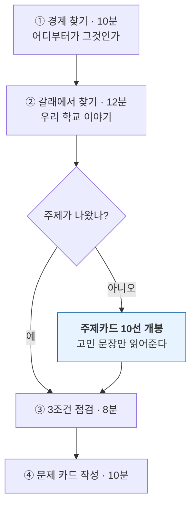

> **⚠ 가장 중요한 규칙** — 주제카드 10선은 **아이들이 막혔을 때만** 꺼냅니다. 먼저 보여주면 "고르는 수업"이 되고, 발견 단계가 통째로 사라집니다.

### ① 경계 찾기 · 10분 — 어디부터가 그것인가

칠판에 세 문장을 씁니다. 각자 **혼자** 답을 적습니다. 상의 금지.

```
 ①  컵에 물이 얼마나 남아야  "비었다"  인가요?   → 나의 답 : _______%
 ②  책상에 물건이 몇 개 있어야 "지저분하다" 인가요? → 나의 답 : _______개
 ③  줄이 몇 명부터  "길다"  인가요?              → 나의 답 : _______명
```

셋의 답을 나란히 칠판에 적습니다. **반드시 다릅니다.**

> **발문 1** — "세 명이 다 다르네요. 누가 맞아요?"
> **발문 2** — "그럼 이 선은 어디 있는 거예요? 컵에 그어져 있어요?"
> **발문 3** — "아까 우리가 본 AI한테는 **누가 이 선을 정해줬을까요?**"

```
   ┌──────────────────────────────────────────┐
   │      AI에게는 우리가 선을 그어 줍니다.        │
   │                                          │
   │      이번 프로젝트에서 그 선을 긋는 사람은     │
   │      바로 여러분입니다.                      │
   └──────────────────────────────────────────┘
```

### ② 갈래에서 찾기 · 12분

주제를 지정하지 않습니다. **갈래**만 벽에 붙이고 팀이 그 안에서 찾게 합니다.

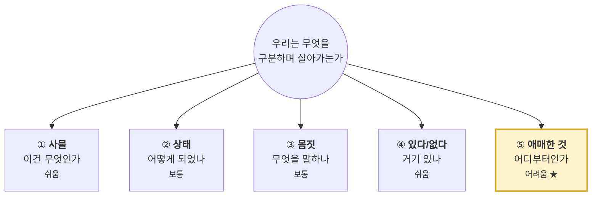

각 갈래마다 **우리 학교 이야기를 하나씩** 찾아 5개를 채운 뒤, 그중 하나를 고릅니다.

> **벽에 붙일 것은 갈래 이름과 한 줄 질문뿐입니다.** 예시를 보여주면 거기서 고르고 맙니다.

**갈래 ⑤를 고른 팀에게는 미리 말해 주세요.**

> "이건 답이 없는 문제예요. AI가 잘 맞히기 어려울 거예요. 그런데 **왜 어려운지 알아내는 것**이 여러분의 발명이 될 거예요."

### 막혔을 때 — 주제카드 10선

```
   1단계   "다섯 갈래 중에 어떤 게 제일 끌려요?"      → 갈래 선택
   2단계   "그 갈래에서 우리 학교 이야기 세 개만"      → 후보 3개
   3단계   "셋 중에 사진으로 찍을 수 있는 건?"        → 실현 가능성 필터
   4단계   그래도 못 고르면 → 카드의 '고민 문장'만 읽어줌
```

**카드를 주지 말고 고민 문장만 소리 내어 읽어 주세요.** "이 중에 너희 얘기 같은 게 있어?"

| # | 발명품 | 난이도 | 아이들의 고민 (이것만 읽어줍니다) |
|---|---|---|---|
| **01** | 분리수거 짝꿍 | ★☆☆ | "우리 반 쓰레기통에 자꾸 다 섞여 있어요. 저도 우유팩을 어디 넣는지 잘 몰라요. 물어보기는 창피하고요." |
| **02** | 잔반 응원단 | ★★☆ | "급식을 남기면 죄송한데, 억지로 먹으라는 것도 싫어요. 조금씩 줄이고 싶은데 아무도 안 알아줘요." |
| **03** | 거북목 알리미 | ★★☆ | "공부하다 보면 어느새 얼굴이 책에 닿아 있어요. 제가 언제 굽는지 제가 몰라요." |
| **04** | 현관 지킴이 | ★☆☆ | "비 오는 날 아침에만 우산이 있고, 집에 갈 때는 항상 없어요. 우산꽂이에 주인 없는 우산이 스무 개예요." |
| **05** | 손 씻기 응원 로봇 | ★★☆ | "급식 전에 손 씻으라는데 물만 묻히고 오는 애들이 많아요. 저도 가끔 그래요." |
| **06** | 모퉁이 안전 눈 | ★★☆ | "복도 모퉁이에서 반대편이 안 보여요. 지난주에 3학년 동생이랑 세게 부딪혔어요." |
| **07** | 식물 돌보미 | ★★★ | "당번이 돌아가며 물을 주는데 어떤 날은 두 번 주고 어떤 날은 아무도 안 줘요. 방울토마토는 그렇게 죽었어요." |
| **08** | 신발 검문소 | ★☆☆ | "비 오는 날 운동화 그대로 들어오는 애들 때문에 교실 바닥이 엉망이에요. 청소는 우리가 하는데요." |
| **09** | 말 거는 게시판 | ★☆☆ | "우리가 만든 캠페인 포스터를 붙였는데 아무도 안 멈춰요. 열심히 그렸는데 속상해요." |
| **10** | 물 마시기 알리미 | ★★★ | "하교할 때 보면 아침에 채운 물이 그대로예요. 목마른 줄도 몰랐어요. 두통이 생긴 날이 많아요." |

**처음이라면** → 01 · 08 · 09  **도전하고 싶다면** → 06 · 07 · 10  **캠페인까지 가고 싶다면** → 01 · 05 · 09

#### 카드별 참고 정보 (교사만 봅니다 — 클래스·반응은 2차시에 팀이 정합니다)

| # | 구분할 것 (참고) | 촬영 난이도 | 예상 실패 | 캠페인 확장 |
|---|---|---|---|---|
| 01 | 플라스틱 / 종이 / 캔 / 모르겠음 | 쉬움 | 찌그러진 병 · 라벨 뗀 병 · 손이 같이 찍힘 | ●●● 정확도 게시 |
| 02 | 다 먹음 / 조금 남김 / 많이 남김 | 보통 | 식판 각도가 조금만 달라져도 무너짐 | ●●● "먹을 만큼만 받자" |
| 03 | 바른 자세 / 굽은 자세 / 자리 비움 | 쉬움 | 옷 색이 바뀌면 오작동 · 배경 사람 | ●●○ 1분 스트레칭 |
| 04 | 우산 있음 / 없음 / 모르겠음 | 보통 | 우산과 긴 자·막대기를 헷갈림 | ●●○ 분실물 제로 주간 |
| 05 | 거품 손 / 맹물 손 / 손 없음 | 보통 | 물이 튀어 렌즈가 흐려짐 → HW 개선 소재 | ●●● 20초 챌린지 |
| 06 | 걷기 / 뛰기 / 없음 | 어려움 | 순간 자세라 흐릿함 · 팔 흔들기와 혼동 | ●●● 걸어 다니는 학교 |
| 07 | 싱싱 / 처짐 / 모르겠음 | **매우 어려움** | 처진 사진이 부족 → **2주 전 사전 준비 필수** | ●●○ 초록이 살리기 |
| 08 | 실내화 / 운동화 / 맨발 | 쉬움 | 자기 팀 신발만 찍어 학습 → 데이터 편향 체감 | ●●○ 깨끗한 바닥 |
| 09 | 멈춤 / 지나감 / 없음 | 쉬움 | 멀리 있는 사람도 '멈춤'으로 인식 | ●●● 어떤 캠페인에도 결합 |
| 10 | 가득 / 절반 / 거의 빔 | 보통 | 투명한 물이 잘 안 보임 → HW 개선 소재 | ●●● 하루 물 ○컵 |

### ③ 3조건 점검 · 8분

| 조건 | 확인 질문 | 왜 |
|---|---|---|
| **① 구분 가능** | "무엇과 무엇을 구분하면 해결되나?" | 답 못 하면 이미지 분류로 만들 수 없음 |
| **② 촬영 가능** | "그 장면을 학교에서 30장 찍을 수 있나?" | 데이터가 없으면 3차시가 무너짐 |
| **③ 내 이야기** | "이거 너희가 진짜 겪은 일이야?" | 남의 문제는 6차시 개선까지 못 감 |

### ⚠ 사람을 분류하는 주제 — 하지 않습니다

```
   ✕  남자 / 여자 구분하기          ✕  기분 좋은 친구 / 나쁜 친구
   ✕  공부 잘하는 친구 알아보기      ✕  우리 반 친구 얼굴 알아보기
```

> "사람을 사진 몇 장으로 나누면, 거기 안 맞는 사람은 어떻게 될까요? AI는 반드시 어느 한쪽으로 밀어 넣어요. 사람한테 그러면 안 돼요."

금지로 끝내지 말고 **왜 안 되는지를 함께 생각하는 5분**으로 쓰세요.
**허용되는 것** — 본인과 팀원이 **의도적으로 만든 신호**(손동작, 자세).

### 닫는 활동 · 10분 — 문제 카드

```
┌────────────────────────────────────────────────┐
│              우리 팀 문제 카드                    │
│  우리가 찾은 불편함 : ________________________   │
│  누가 불편한가      : ________________________   │
│  어느 갈래인가      : ① ② ③ ④ ⑤                │
│  무엇과 무엇을 구분하면 해결되는가                  │
│     ① _________  ② _________  ③ _________     │
│     ④ 모르겠음                                  │
└────────────────────────────────────────────────┘

□ 1. 이 불편함을 우리 셋 다 겪어본 적이 있다.
□ 2. "무엇과 무엇을 구분하면 되나?"에 3~4개로 답할 수 있다.
□ 3. 그중 하나는 '모르겠음'이다.
□ 4. 학교 안에서 클래스당 30장을 찍을 수 있다.
□ 5. 구분한 다음 마이크로비트가 무엇을 할지 한 문장으로 말할 수 있다.
```

**하나라도 ✕가 있으면 주제를 바꾸는 것이 아니라 좁힙니다.**
예) "학교가 더러워요" → "우리 교실 바닥이 비 오는 날 더러워요" → 08번

> **다음 차시 예고** — "다음 시간에 **기획을 다 끝냅니다.** 그다음부터는 계속 만들기만 할 거예요."
> **숙제** — 각자 그 문제를 겪는 사람을 한 명 눈여겨 보고 오기.

**준비물** — 완성 예제 파일(교사 제작), 예측 기록지, 갈래 카드 5장(A4), 클립보드, 주제카드 10선(교사 보관)

---
---
---

# 【2차시】 기획② — 누가 · 어떻게 쓰는지 정하고, 만들 것을 확정한다

> **STEP 3 + STEP 4** · **프로세스** ② 정의 + ③ 설계
> **오늘의 결과물** 페르소나 카드 · 벤치마킹 한 문장 · 시나리오 6컷 · **기능 정의표(MUST 3개)** · **동작 설계표** · 데이터 수집 계획표

> **⚠ 오늘 안에 기획이 끝나야 합니다.** 3차시부터는 컴퓨터 앞에만 앉습니다. 타이머를 눈에 보이게 두고 운영하세요.

## 오늘의 타임박스

```mermaid
gantt
    title 2차시 90분 — 기획 완결
    dateFormat mm
    axisFormat %M분
    section STEP 3 · 40분
    여는 질문           :a1, 00, 5m
    페르소나 카드        :crit, a2, after a1, 20m
    벤치마킹 + 한 문장    :a3, after a2, 15m
    section 쉬는 시간
    쉬는 시간           :a4, after a3, 10m
    section STEP 4 · 40분
    시나리오 6컷         :crit, a5, after a4, 15m
    기능 정의 MUST 3개   :crit, a6, after a5, 10m
    동작 설계표          :crit, a7, after a6, 10m
    데이터 계획 + 마무리  :a8, after a7, 5m
```

---

## STEP 3 · 페르소나와 벤치마킹 (40분)

### 여는 질문 · 5분

> "우리가 만든 걸 누가 쓸까요?"
>
> 아이들은 대개 "우리 반 애들이요"라고 답합니다. 여기서 밀어붙이세요.
> **"우리 반 애들 중에 누구요? 이름을 대 볼래요? 그 애는 언제 제일 불편했어요?"**

**'모두'를 위한 발명품은 아무도 안 씁니다. 한 명을 정하면 만들 것이 선명해집니다.**

### 3-1. 페르소나 카드 · 20분

셋이 함께 **한 장**을 채웁니다. 실존 인물이 아니라 **여러 명을 합친 한 사람**입니다.

```
┌──────────────────────────────────────────────────────┐
│                  우 리 의 사 용 자                      │
│   이름(가명) : ______________  학년 : ______           │
│                                                      │
│   ▸ 이 사람은 어떤 사람인가 (3줄)                       │
│     ______________________________________________   │
│     ______________________________________________   │
│     ______________________________________________   │
│   ▸ 언제 · 어디서 이 문제를 겪나                        │
│     때 : ____________   곳 : ____________            │
│   ▸ 지금은 어떻게 해결하고 있나                          │
│     ______________________________________________   │
│   ▸ 왜 그 방법으로는 부족한가                           │
│     ______________________________________________   │
│   ▸ 이 사람이 우리에게 할 것 같은 말 (큰따옴표로!)        │
│     " ___________________________________________ "  │
│   ▸ 이 사람이 절대 원하지 않는 것                        │
│     ______________________________________________   │
└──────────────────────────────────────────────────────┘
```

> **가장 중요한 칸은 마지막 두 개입니다.**
>
> **"할 것 같은 말"** — 이 한 문장이 6차시 내내 팀의 나침반입니다. **벽에 붙여 두세요.**
> **"절대 원하지 않는 것"** — 여기서 "시끄러운 거요", "혼내는 거요"가 나옵니다. 이것이 뒤이어 나올 **WON'T 목록**이 됩니다.

**예시 — 02번 잔반 응원단**

```
   이름 : 서연 (5학년)
   어떤 사람 : 편식이 있다. 남기면 미안해서 눈치를 본다.
              억지로 먹으라는 말을 제일 싫어한다.
   때/곳 : 급식 시간 끝날 무렵 / 잔반통 앞
   지금은 : 몰래 빨리 버리고 도망간다
   왜 부족한가 : 죄책감만 남고 다음에도 똑같다
   할 것 같은 말 : "혼내지 말고 그냥 조금씩 줄이게 도와주면 안 돼요?"
   절대 원하지 않는 것 : 이름이 불리는 것 · 큰 소리로 알리는 것
```

> 이 페르소나 하나가 "슬픈 얼굴 LED는 되지만 큰 경고음은 안 된다"는 설계를 만들어 냅니다.

> **시간이 없을 때** — 관찰 활동은 생략하고 1차시 숙제(눈여겨본 사람)로 바로 씁니다.

### 3-2. 벤치마킹 · 15분

> **발문** — "이 문제, 우리만 겪는 걸까요? 어른들은 어떻게 해결했을까요?"

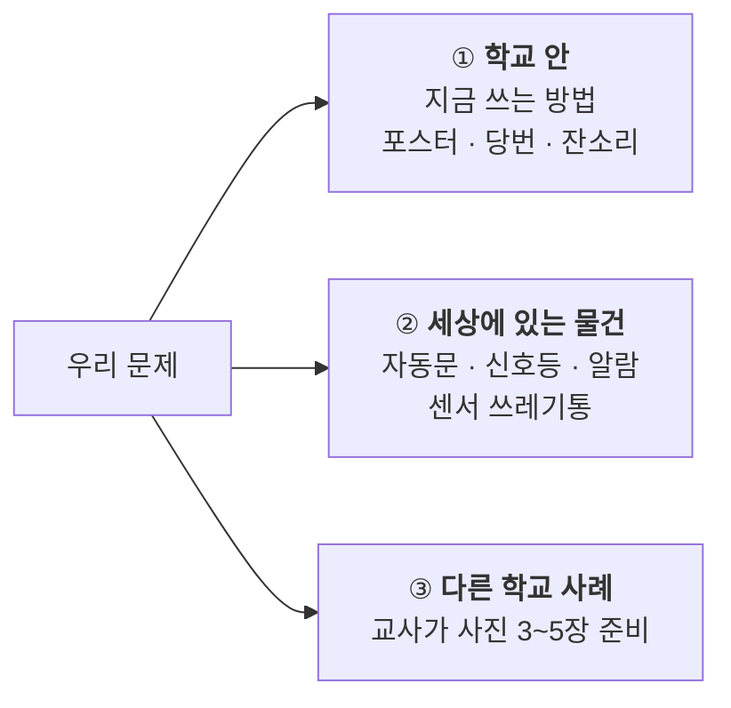

> **교사 준비 필수** — 5학년에게 자유 검색을 시키면 15분이 그냥 사라집니다. **교사가 미리 사진 3~5장을 준비해 보여주는 방식만** 씁니다. (예: 센서 자동 쓰레기통, 손 씻기 타이머, 자세 교정 앱 화면)

| # | 이미 있는 것 | 어떻게 해결하나 | 좋은 점 | 아쉬운 점 | 우리가 가져올 것 |
|---|---|---|---|---|---|
| 1 | | | | | |
| 2 | | | | | |
| 3 | | | | | |

**표를 채운 뒤 딱 한 문장을 만듭니다. 이 한 문장이 벤치마킹의 전부입니다.**

```
┌──────────────────────────────────────────────────────┐
│   기존의 ______________ 는 ______________ 하지만,      │
│                                                      │
│   우리 것은 ______________________________ 한다.       │
└──────────────────────────────────────────────────────┘
```

> **예시** — "기존의 **잔반 포스터**는 **모두에게 똑같이 말하지만**, 우리 것은 **내 식판만 보고 나한테만 조용히 말한다.**"

> **핵심 발문** — "우리 것이 이미 있는 것보다 나은 점이 하나도 없으면요?"
> 그럴 땐 정직하게 말하게 하세요. **"우리는 이걸 우리 손으로 만들어 본다"** 도 훌륭한 답입니다. 억지로 우수함을 지어내게 하지 마세요.

## 쉬는 시간 · 10분

---

## STEP 4 · 유저 시나리오와 기능 정의 (40분)

### 4-1. 시나리오 6컷 · 15분

**말로 설명하지 말고 6컷으로 그리게 합니다.** 그림 실력은 상관없습니다. 졸라맨으로 충분합니다.

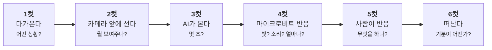

**마지막 3분은 '안 되는 시나리오'에 씁니다. 이것을 반드시 시킵니다.**

```
   ▸ 서연이가 아니라 다른 사람이 왔다면?     ▸ 아무것도 안 보여줬다면?
   ▸ 엉뚱한 걸 보여줬다면?                 ▸ 너무 멀리 서 있다면?
```

> **핵심 발문** — "AI가 '잘 모르겠다'고 말할 수 있을까요?"
> 답은 3차시 실험 B에서 나옵니다. **지금은 질문만 남겨 두세요.** 여기서 '모르겠음' 클래스의 필요성이 저절로 나옵니다.

### 4-2. 기능 정의 — MUST 3개 · 10분

시나리오 6컷에서 **동사만** 뽑아 포스트잇에 하나씩 적습니다. "본다" "구분한다" "빛을 낸다" "소리를 낸다" "센다" "기록한다"…

그리고 세 무더기로 나눕니다.

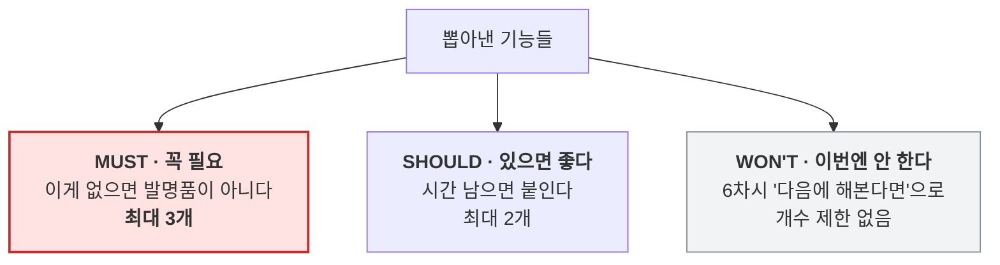

> **MUST는 최대 3개입니다. 이 제한이 이 활동의 전부입니다.**
> 5학년 팀은 반드시 기능을 10개씩 만듭니다. 그러면 6차시 안에 아무것도 못 끝냅니다.
>
> **발문** — "이거 하나만 되고 나머지 다 안 되면, 그래도 발명품이라고 할 수 있어요?"
> 이 질문에 "네"라고 답하는 것만 MUST입니다.

| 구분 | 기능 | 왜 필요한가 (페르소나 근거) | 어떻게 확인하나 |
|---|---|---|---|
| **MUST 1** | | | |
| **MUST 2** | | | |
| **MUST 3** | | | |
| SHOULD 1 | | | |
| SHOULD 2 | | | |
| WON'T | | | — |

> **"왜 필요한가" 칸은 반드시 페르소나 카드를 근거로 씁니다.** "멋있어서"는 안 됩니다.
> **"어떻게 확인하나" 칸이 5차시 테스트 항목이 됩니다.**

### 4-3. 동작 설계표 · 10분 ★ 오늘의 최종 산출물

MUST 기능을 표로 옮깁니다. **이것이 4~5차시에 만들 코드의 설계도입니다.**

| 카메라에 보이는 것 | AI의 판단 (클래스) | 마이크로비트의 반응 | 지속 시간 |
|---|---|---|---|
| | | | |
| | | | |
| | | | |
| (엉뚱한 것 / 아무것도 없음) | **모르겠음** | | |

**두 가지 규칙 — 반드시 지킵니다**

- **클래스는 3~4개를 넘기지 않는다** — 많을수록 데이터가 배로 필요하고 신뢰도가 떨어집니다.
- **'모르겠음' 클래스를 반드시 넣는다** — AI는 스스로 모르겠다고 말하지 못합니다.

#### ▸ 사회학 발문 — 클래스를 확정한 직후 3분

> **발문** — "이 네 가지로 나눈 건 누구예요?"
> **발문** — "옆 반 친구들이 같은 문제를 맡았으면 똑같이 나눴을까요?"
> **발문** — "다르게 나눌 수도 있었을까요? 어떻게요?"

다르게 나눌 수 있었던 방법을 **설계표 여백에 적어 두게** 합니다. **6차시에 다시 꺼냅니다.**

### 4-4. 데이터 수집 계획표 + 마무리 · 5분

다음 시간에 바로 촬영에 들어갈 수 있도록 **누가, 어디서, 몇 장**까지 정합니다.

| 클래스 | 목표 | 어디서 (2곳 이상) | 어떻게 바꿔 찍나 | 담당 | 실제 |
|---|---|---|---|---|---|
| ① | 30장 | | 각도 / 거리 / 밝기 | | |
| ② | 30장 | | | | |
| ③ | 30장 | | | | |
| ④ 모르겠음 | 20장 | | | | |

> **'어떻게 바꿔 찍나' 칸이 비어 있으면 5차시 테스트에서 반드시 무너집니다.**

> **닫기 전 선언** — "오늘로 **기획 끝**입니다. 다음 시간부터 마지막 시간까지는 계속 만들고 고칩니다. 지금 정한 클래스는 **바꾸지 않습니다.**"

**준비물** — 페르소나 카드 A3, 벤치마킹 사진 3~5장(교사 준비), 시나리오 6컷 용지 A3, 포스트잇 3색, 기능 정의표, 동작 설계표, 데이터 수집 계획표, **타이머**

---
---
---

# 【3차시】 코딩① — 컴퓨터 비전을 뜯어보고, 우리 모델을 만든다

> **STEP 5 · 만들기 시작** · **PRIMM** I(조사) · **프로세스** ④ 제작 1
> **오늘의 결과물** 조사 기록지 · **학습된 우리 모델**

## 왜 수정에서 시작하는가

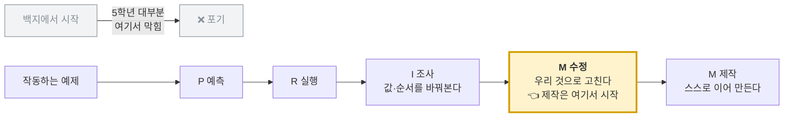

**"오늘부터는 우리 코드입니다. 근데 백지에서 시작하지 않습니다. 이미 되는 코드를 우리 것으로 고칩니다."**

## 여는 활동 · 10분

1차시에서 이상한 물건(신발, 손)을 보여줬을 때를 떠올립니다.

> **오늘의 질문** — "AI는 왜 신발을 보고도 '플라스틱'이라고 했을까요?"

### 컴퓨터 비전이란 — 학생에게 이렇게 설명합니다

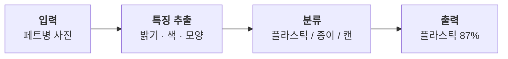

> "컴퓨터는 사진을 사진으로 보지 않고 **숫자로** 봅니다.
> 배운 숫자들 중에 어느 것과 **가장 비슷한지** 고릅니다.
> **100% 확신하는 법은 없고**, 항상 '몇 퍼센트쯤 비슷하다'고 말합니다."

## 활동 1 · 30분 — Investigate ①: 컴퓨터 비전 예제

교사가 준 **최소 예제**를 씁니다. 마이크로비트는 아직 붙이지 않습니다.

```
[예제 CV-1]
계속 반복하기
  학습한 모델로 분류하기
  ( "결과: " 와 (분류 결과) 를 합치기 )  라고 말하기
  0.5 초 기다리기
```

### 실험 A — 값을 바꾼다 (10분)

각 실험마다 **예측 먼저, 실행 나중**입니다.

| # | 바꿀 것 | 예측 | 실제 | 알아낸 것 |
|---|---|---|---|---|
| A1 | `0.5초` → `3초` | | | |
| A2 | `0.5초` → `0.05초` | | | |
| A3 | 웹캠을 손으로 가리기 | | | |
| A4 | 물건을 아주 멀리 두기 | | | |

> A2에서 화면이 정신없이 바뀝니다. **"기다리는 시간이 왜 필요할까?"** 를 여기서 잡습니다.
> **여기서 정한 대기 시간이 4차시 코드 v0.1에 그대로 들어갑니다.**

### 실험 B — 신뢰도를 꺼낸다 (10분)

```
[예제 CV-2]
계속 반복하기
  학습한 모델로 분류하기
  ( (분류 결과) 와 ( '플라스틱' 에 대한 신뢰도 ) 를 합치기 ) 라고 말하기
  0.5 초 기다리기
```

| # | 해볼 것 | 관찰 |
|---|---|---|
| B1 | 페트병을 정면에서 보여주기 | 신뢰도 ____ % |
| B2 | 페트병을 반쯤 가리기 | 신뢰도 ____ % |
| B3 | 아무것도 안 보여주기 | 신뢰도 ____ % |
| B4 | 연필을 보여주기 | 신뢰도 ____ % |

> **핵심 발문** — "B4에서도 신뢰도가 0이 아니죠? **AI는 왜 '모르겠다'고 말하지 못할까요?**"
>
> AI는 **주어진 보기 중에서 고를 뿐**입니다. 그래서 우리가 '모르겠음'을 직접 만들어 줘야 합니다.
> **2차시 시나리오에서 남겨둔 질문의 답이 여기서 나옵니다.**

### 실험 C — 순서를 바꾼다 (10분) ★ 절대 생략 금지

```
[예제 CV-3 — 원래]                    [예제 CV-3′ — 순서를 바꾼 것]
만약 '플라스틱' 이면 → "파란 통"        만약 '모르겠음' 이면 → "다시 보여주세요"
아니면 만약 '종이' 이면 → "초록 통"      아니면 만약 '플라스틱' 이면 → "파란 통"
아니면 → "다시 보여주세요"               아니면 만약 '종이' 이면 → "초록 통"
```

> **예측 질문** — "두 코드는 블록이 똑같고 순서만 다릅니다. **결과도 같을까요?**"

대부분 "같다"고 예측합니다. 실행해 보면 다릅니다. `만약~아니면` 은 **위에서부터 하나만** 골라 실행하고 나머지는 건너뜁니다.

> **정리 발문** — "그럼 조건은 어떤 순서로 써야 할까요?"
> **좁고 특별한 것이 위로, 넓고 일반적인 것이 아래로. '모르겠음'은 맨 아래.**

## 쉬는 시간 · 10분

## 활동 2 · 30분 — 데이터 수집과 학습

1. 엔트리 `인공지능 모델 학습하기` → `분류: 이미지` 를 엽니다.
2. **2차시 데이터 수집 계획표대로** 촬영합니다. **클래스당 30장 이상, '모르겠음'은 20장.**
3. 학습 후 첫 성능을 확인합니다.

> **촬영 지도 — 이 한 줄이 5차시를 좌우합니다.**
> 같은 자리에서 30장을 연속으로 찍으면 테스트에서 **반드시 무너집니다.**
> **자리를 두 곳 이상 옮기고, 각도·거리·밝기를 바꿔가며** 찍게 하세요.

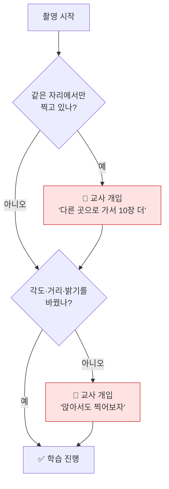

**학습이 끝나면 바로 확인합니다.**

| 증상 | 대처 |
|---|---|
| 한쪽 클래스로만 분류됨 | 클래스별 사진 수 불균형 → 적은 쪽 보충 후 재학습 |
| '모르겠음'이 잘 안 나옴 | 엉뚱한 물건 종류를 더 늘려 촬영 |
| 특정 자리에서만 잘 됨 | 다른 자리에서 10장씩 추가 |

## 닫는 활동 · 10분

조사 기록지를 정리합니다. 실험 A에서 정한 **대기 시간**, 실험 C에서 정한 **조건 순서**를 동작 설계표 옆에 크게 적어 둡니다. **다음 시간에 그대로 씁니다.**

**준비물** — 예제 CV-1·2·3/3′ 파일, 웹캠 노트북, 흰 배경 전지, 촬영 소품, 조사 기록지, 데이터 수집 계획표

> **교사 준비** — 신뢰도 블록의 정확한 이름과 위치는 엔트리 버전에 따라 다릅니다. 사전 점검에서 확인하고 예제 파일에 미리 넣어 두세요.

---
---
---

# 【4차시】 코딩② — 피지컬 컴퓨팅을 뜯어보고, 우리 코드로 고친다

> **PRIMM** I(조사) → **M(Modify)** · **프로세스** ③ 설계 확인 + ④ 제작 1
> **오늘의 결과물** 조사 기록지 · **우리 코드 v0.1 (화면 출력만)**

## 여는 활동 · 10분 — 마이크로비트 인사

보드를 손에 들고 LED 25개, 버튼 A·B, 센서를 눈으로 확인합니다. USB로 연결해 하트를 띄워 봅니다.

### 피지컬 컴퓨팅이란 — 학생에게 이렇게 설명합니다

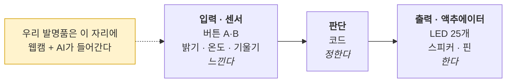

## 활동 1 · 30분 — Investigate ②: 피지컬 컴퓨팅 예제

```
[예제 PC-1]
계속 반복하기
  만약  마이크로비트 버튼 A를 눌렀는가?  이라면
     마이크로비트 LED에 '하트' 출력하기
     마이크로비트 '도' 음 0.5 초 연주하기
  아니면
     마이크로비트 LED 모두 지우기
```

### 실험 D — 값을 바꾼다 (10분)

| # | 바꿀 것 | 예측 | 실제 |
|---|---|---|---|
| D1 | `'하트'` → `'네모'` | | |
| D2 | `'도'` → `'솔'` | | |
| D3 | `0.5초` → `2초` | | |
| D4 | `버튼 A` → `버튼 B` | | |

> D3에서 버튼을 빠르게 여러 번 눌러 보게 하세요. 소리가 끝날 때까지 다음 입력을 못 받습니다.
> **"프로그램은 한 번에 한 가지만 합니다."**

### 실험 E — 순서를 바꾼다 (10분) ★

```
[예제 PC-1′ — LED 지우기를 맨 위로]
계속 반복하기
  마이크로비트 LED 모두 지우기        ← 위로 올림
  만약  버튼 A를 눌렀는가?  이라면
     마이크로비트 LED에 '하트' 출력하기
```

> **예측 질문** — "버튼을 누르면 하트가 보일까요?"

깜빡이거나 거의 안 보입니다. **켜자마자 지워지기 때문입니다.**

> **정리 발문** — **"켜고 → 잠깐 보여주고 → 지운다."** 이 순서가 나와야 5차시에서 LED가 정상 작동합니다.

### 실험 F — 블록을 빼본다 (10분)

```
[예제 PC-2 — 센서 사용]
계속 반복하기
  ( 마이크로비트 밝기 값 ) 라고 말하기
  0.2 초 기다리기
```

| # | 해볼 것 | 관찰 |
|---|---|---|
| F1 | 손으로 보드를 덮기 | 값이 ____ 로 |
| F2 | 창가로 가져가기 | 값이 ____ 로 |
| F3 | `0.2초 기다리기`를 삭제 | |

> F3에서 화면이 멈춘 것처럼 느려집니다. **"쉬지 않고 일하면 오히려 느려진다."** 5차시 통합 테스트에서 이 지식이 쓰입니다.

## 쉬는 시간 · 10분

## 활동 2 · 30분 — Modify: 예제 코드를 우리 것으로

> **오늘의 질문** — "지금까지 남의 코드를 돌려봤죠. 이제 우리 코드입니다. 예제에서 **뭘 바꿔야** 우리 발명품이 될까요?"

바꿔야 할 것을 칠판에 목록으로 뽑습니다. (클래스 이름 / 조건 개수 / 안내 문구 / 대기 시간)

**3차시 예제 CV-3을 열어 2차시 동작 설계표대로 고칩니다. 백지에서 시작하지 않습니다.**

```
[우리 코드 v0.1 — 예제를 고친 것]

시작하기 버튼을 클릭했을 때
  계속 반복하기
    학습한 모델로 분류하기

    만약  분류 결과가 '①클래스' 인가?  이라면        ← 클래스 이름 수정
       "____________" 라고 말하기                  ← 문구 수정

    아니면 만약  분류 결과가 '②클래스' 인가?  이라면   ← 줄 추가
       "____________" 라고 말하기

    아니면 만약  분류 결과가 '③클래스' 인가?  이라면   ← 줄 추가
       "____________" 라고 말하기

    아니면
       "잘 모르겠어요. 다시 보여주세요" 라고 말하기    ← 실험 C: 맨 아래

    1 초 기다리기                                 ← 실험 A로 정한 값
```

> **아직 마이크로비트는 붙이지 않습니다.** 화면 출력만으로 판단이 제대로 되는지 먼저 확인합니다.
> 두 가지를 한 번에 붙이면 문제가 생겼을 때 어디가 원인인지 모릅니다.
>
> **핵심 지도** — 이 원칙을 학생에게 말로 알려주세요.
> **"한 번에 하나씩 붙이고, 붙일 때마다 확인한다."** 5·6차시 내내 쓰입니다.

## 닫는 활동 · 10분

작동 영상을 **30초** 찍어 둡니다. 6차시 **개선 전** 자료가 됩니다.

**준비물** — 마이크로비트 v2, 데이터 전송용 USB 케이블, 예제 PC-1·1′·2 파일, 웹캠 노트북, 동작 설계표

---
---
---

# 【5차시】 코딩③ — 붙이고, 테스트한다

> **PRIMM** M(Make) · **프로세스** ④ 제작 2 + ⑤ 테스트
> **오늘의 결과물** **코드 v0.2 · 완성된 시제품 · 실패 기록 10건 이상**

## 여는 활동 · 10분

> **오늘의 질문** — "오늘 우리 목표는 **잘 되게 하는 것이 아니라, 언제 안 되는지 찾는 것**입니다. 실패를 몇 개나 찾을 수 있을까요?"

**이 프레임이 중요합니다. 실패를 찾는 것이 오늘의 성과가 됩니다.**

## 활동 1 · 30분 — 하드웨어 붙이기

**1. USB 연결 후 하드웨어 연결 확인 (5분)**

**2. 코드의 각 갈래에 마이크로비트 블록을 한 갈래씩 붙이고 매번 확인 (15분)**

```
[우리 코드 v0.2 — 마이크로비트 추가]

    만약  분류 결과가 '①클래스' 인가?  이라면
       "____________" 라고 말하기
       마이크로비트 LED에 '____' 출력하기          ← 추가
       마이크로비트 '__' 음 0.5 초 연주하기         ← 추가
       1 초 기다리기                             ← 실험 E 반영
       마이크로비트 LED 모두 지우기                ← 실험 E 반영: 지우기는 마지막
```

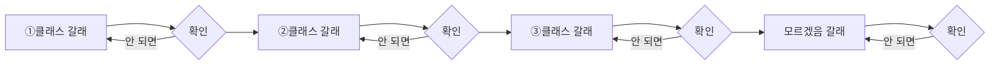

**3. 몸체 만들기 (10분)** — 골판지·우드락. 조건은 둘뿐입니다.
- 마이크로비트 **LED가 밖에서 보일 것**
- 웹캠이 **가려지지 않을 것**

### 완성 순서도

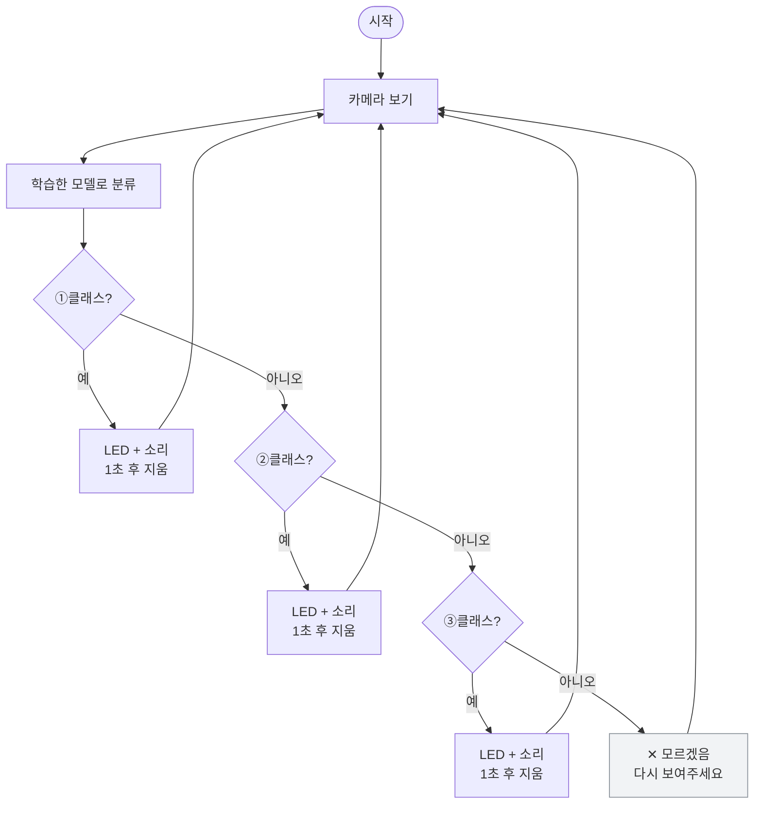

## 쉬는 시간 · 10분

## 활동 2 · 30분 — 1차 테스트

**아무렇게나 해보는 게 아니라 계획표대로** 돌립니다.

| # | 테스트 조건 | 기대 결과 | 실제 결과 | ○/✕ |
|---|---|---|---|---|
| T1 | 학습한 자리, 정면, ①클래스 | ① | | |
| T2 | 같은 자리, ②클래스 | ② | | |
| T3 | 같은 자리, ③클래스 | ③ | | |
| T4 | 아무것도 없음 | 모르겠음 | | |
| T5 | 창가로 이동, ①클래스 | ① | | |
| T6 | 배경에 게시판, ①클래스 | ① | | |
| T7 | 다른 사람이 들기 | ① | | |
| T8 | 멀리서 들기 | ① | | |
| T9 | 반쯤 가리고 들기 | ① | | |
| T10 | 엉뚱한 것(신발, 손) | 모르겠음 | | |
| T11 | 빠르게 물건 바꾸기 | 따라 바뀜 | | |
| T12 | 5분 연속 켜두기 | 계속 작동 | | |

**○ 개수 : ____ / 12**

> **T5~T10에서 대부분 ✕가 나옵니다. 이것이 오늘의 성과입니다.**

### 2차시 기능 정의표와 대조하기

| MUST 기능 | "어떻게 확인하나"에 적은 것 | 실제로 되나? |
|---|---|---|
| MUST 1 | | ○ / ✕ |
| MUST 2 | | ○ / ✕ |
| MUST 3 | | ○ / ✕ |

> **발문** — "우리가 2차시에 '이건 꼭 된다'고 정했던 게 진짜 되나요?"

## 닫는 활동 · 10분

✕ 항목을 모아 다음 시간 개선 목록을 만듭니다. **아직 원인은 찾지 않습니다.**

> **닫기 전 발문** — "✕가 몇 개예요? 그중에 제일 자주 틀리는 건 뭐죠?"

**준비물** — 마이크로비트, USB 케이블, 건전지 홀더, 골판지, 우드락, 글루건, 테스트 기록지, 스톱워치

> **교사 준비 — 반드시 사전 점검**
> 웹캠 AI 처리와 마이크로비트 시리얼 통신을 **동시에** 돌리는 구성입니다. 학교 PC 사양·보안 프로그램에 따라 버벅이거나 연결이 끊길 수 있습니다.
> **수업 2주 전에 실제 사용할 PC로 웹캠 인식부터 LED 출력까지 완주해 보세요.** 문제가 있으면 5차시를 화면 출력만으로 대체하고 마이크로비트는 시범용으로 운영하는 대안을 준비합니다.
> 엔트리 블록의 정확한 이름과 위치는 버전에 따라 다르므로 이때 함께 확인하고, 1·3·4차시 예제 파일도 이 PC에서 미리 만들어 두세요.

---
---
---

# 【6차시】 코딩④ — 고친다

> **프로세스** ⑥ 개선 (2~3회전)
> **오늘의 결과물** 개선된 발명품 · **개선 이력표**

발표회 대신 **개선에 90분을 온전히 씁니다. 이 수업에서 가장 중요한 차시입니다.**

## 개선 루프 — 오늘 이것을 반복합니다

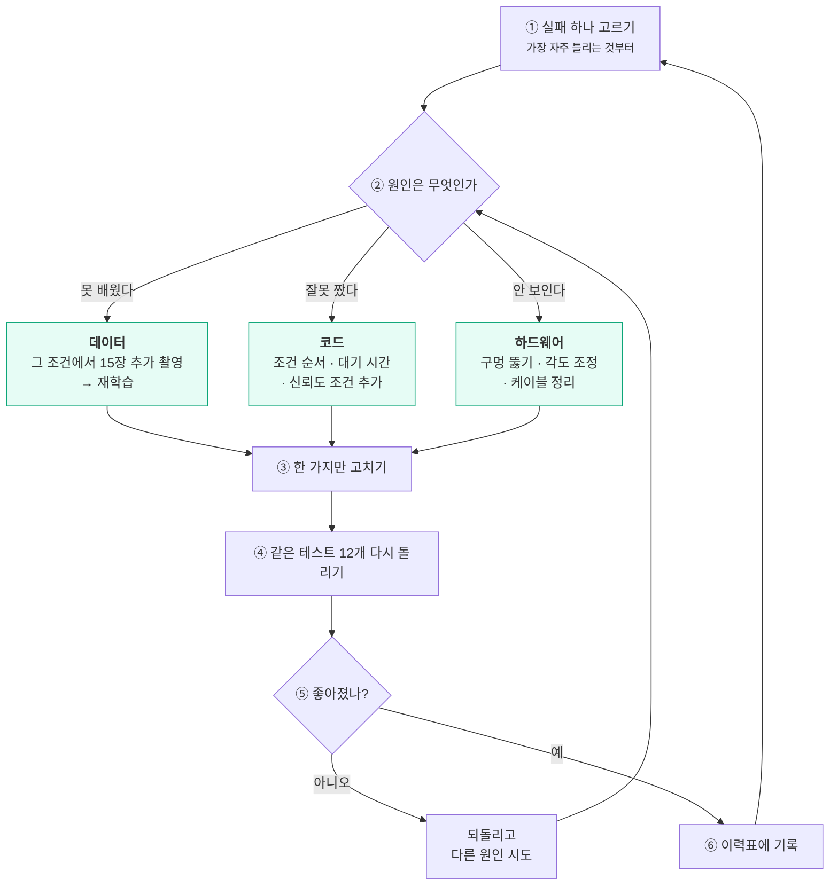

## 여는 활동 · 10분 — 원인 나누기

5차시 ✕ 목록을 놓고 셋이 함께 원인을 분류합니다.

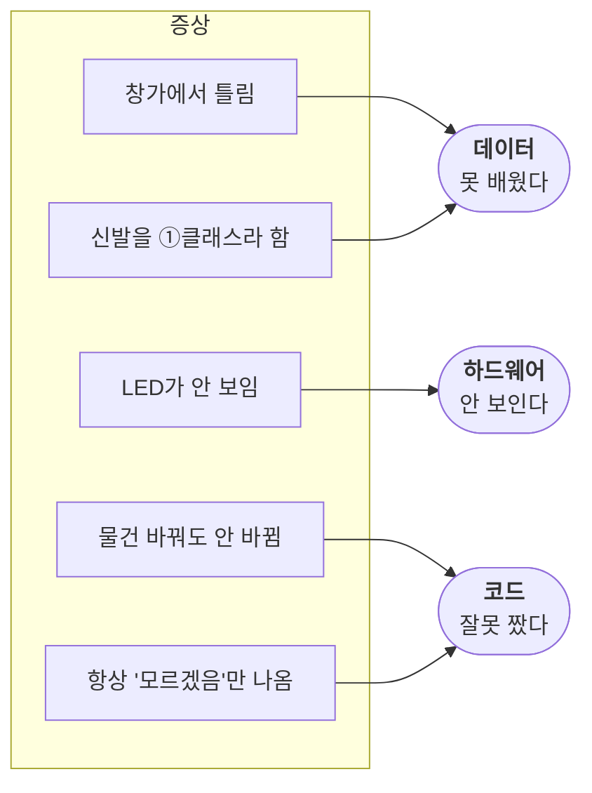

| 증상 | 이건 무슨 문제? | 왜 그렇게 생각하나 |
|---|---|---|
| 창가에서 틀림 | **데이터** | 밝은 곳 사진을 안 찍었음 |
| 신발을 ①클래스라 함 | **데이터** | '모르겠음'에 신발이 없음 |
| LED가 안 보임 | **하드웨어** | 골판지가 가림 |
| 물건 바꿔도 안 바뀜 | **코드** | 기다리는 시간이 너무 김 |
| 항상 '모르겠음'만 나옴 | **코드** | 조건 순서가 잘못됨 (실험 C) |

> **핵심 발문** — "이건 AI가 못 배운 걸까요, 우리가 코드를 잘못 짠 걸까요, 아니면 물건이 잘못 만들어진 걸까요?"
>
> **이 세 갈래로 나누는 능력이 이 수업에서 가르치려는 가장 큰 것입니다.**

## 활동 1 · 30분 — 개선 1회전

가장 자주 틀리는 실패 **하나**를 골라 고칩니다.

| 원인 | 고치는 방법 |
|---|---|
| **데이터** | 그 조건에서 사진 15장 추가 촬영 → 재학습 |
| **코드** | 조건 순서 바꾸기 / 대기 시간 조정 / 신뢰도 조건 추가 |
| **하드웨어** | 구멍 뚫기 / 카메라 각도 조정 / 케이블 정리 |

고친 뒤 **5차시와 똑같은 테스트 12개를 다시** 돌립니다. ○ 개수를 비교합니다.

> **규칙** — **한 번에 하나만 고칩니다.** 두 개를 동시에 고치면 무엇이 효과가 있었는지 알 수 없습니다.

## 쉬는 시간 · 10분

## 활동 2 · 30분 — 개선 2·3회전

같은 루프를 반복합니다. 시간이 남으면 **코드 개선**을 하나 더. 3차시 실험 B에서 배운 신뢰도를 씁니다.

```
[우리 코드 v0.3 — 신뢰도 조건 추가]

    만약  ( '①클래스' 에 대한 신뢰도 ) > 0.7  이라면      ← 확실할 때만 반응
       "____________" 라고 말하기
       마이크로비트 LED에 '____' 출력하기
    아니면
       "잘 모르겠어요" 라고 말하기
       마이크로비트 LED에 'X' 출력하기
```

> **발문** — "0.7을 0.9로 올리면 어떻게 될까요? 0.3으로 내리면요?"
>
> 올리면 조심스러워지고(놓치는 게 많아짐), 내리면 성급해집니다(틀리는 게 많아짐).
> **어느 쪽이 우리 발명품에 나을지 팀이 결정하게 합니다. 정답은 없습니다.**
> 이 임계값을 정하는 것이 곧 **1차시 경계 찾기에서 했던 그 일**입니다.

## 닫는 활동 · 10분 — 되돌아보기 + 개선 이력표

### ▸ '모르겠음' 통 열어보기

```
┌──────────────────────────────────────────────────────┐
│           우리가 '모르겠음' 에 넣은 것들                 │
│   ______________  ______________  ______________     │
│   ______________  ______________  ______________     │
│                                                      │
│   이것들은 정말 '모르는' 것이었나요?                     │
│   아니면 우리가 관심 없었던 것인가요?                     │
│   ______________________________________________     │
│                                                      │
│   우리 발명품이 가장 못 알아보는 것은?                    │
│   ______________________________________________     │
│   그건 왜 그럴까요?                                    │
│   ______________________________________________     │
└──────────────────────────────────────────────────────┘
```

> **핵심 발문** — "'모르겠음'은 AI가 몰라서 넣은 걸까요, **우리가 안 가르쳐서** 못 아는 걸까요?"
>
> 이 질문 하나가 사회학·심리학·철학을 동시에 건드립니다. 답을 정리해 줄 필요는 없습니다. **아이들이 잠깐 멈추면 그것으로 충분합니다.**

### ▸ 개선 이력표 — 최종 산출물

```
┌──────────────────────────────────────────────────────────┐
│                    개 선 이 력 표                          │
│  발명품 이름 : ______________________                      │
│  우리의 사용자 : ______________________ (2차시 페르소나)     │
├────┬─────────────┬──────────┬─────────────┬─────────────┤
│회전 │ 무엇이 안 됐나 │ 원인은?    │ 무엇을 고쳤나  │ 테스트 결과   │
├────┼─────────────┼──────────┼─────────────┼─────────────┤
│ 1  │             │ 데이터/코드/│             │ ○ __ /12     │
│    │             │ 하드웨어    │             │             │
├────┼─────────────┼──────────┼─────────────┼─────────────┤
│ 2  │             │           │             │ ○ __ /12     │
├────┼─────────────┼──────────┼─────────────┼─────────────┤
│ 3  │             │           │             │ ○ __ /12     │
└────┴─────────────┴──────────┴─────────────┴─────────────┘

  처음    ○ ____ / 12
  마지막  ○ ____ / 12        →  ______ 개 좋아졌다

  우리가 그은 선 : ____________ 부터를 ____________ 라고 정했다.
  그 이유       : _______________________________________

  아직 못 고친 것 : _____________________________________
  다음에 해본다면  : _____________________________________
     (2차시 WON'T 목록과 동작 설계표 여백의
      '다르게 나눌 수 있었던 방법'을 꺼내 보세요)
```

**마지막 네 칸을 반드시 채우게 합니다.**

> **마무리 발문** — "다 고쳤나요? 아니죠. 발명은 **완성되는 게 아니라 계속 고쳐지는 것**입니다. 오늘 여러분은 한 바퀴를 돌았습니다."

**준비물** — 개선 이력표(A3), 추가 촬영 소품, 공구, 5차시 테스트 기록지, 4차시 개선 전 영상

---
---

# 7. 평가

## 7.1 원칙

**작동 여부로 평가하지 않습니다.** 최종 성능이 좋은 팀이 아니라, **테스트를 성실히 하고 원인을 제대로 나눈 팀**이 잘한 것입니다.

## 7.2 루브릭

| 영역 | 잘함 | 보통 | 노력 요함 |
|---|---|---|---|
| **사용자 이해** | 페르소나를 근거로 기능을 정하고 설명함 | 페르소나는 썼으나 설계와 연결 안 됨 | "다 쓸 거예요" |
| **범위 정하기** | MUST 3개로 좁히고 나머지를 미룸 | 기능을 줄이긴 함 | 다 하려다 아무것도 못 끝냄 |
| **예측 (P)** | 근거를 들어 예측하고, 틀린 이유를 설명함 | 예측은 적었으나 근거 없음 | 실행부터 함 |
| **조사 (I)** | 값·순서 변경 결과에서 원리를 스스로 말함 | 시키는 대로 바꿔봄 | 조작만 하고 관찰 없음 |
| **수정 (M)** | 예제를 우리 설계에 맞게 정확히 고침 | 일부만 고침 | 예제 그대로 씀 |
| **테스트** | 계획표대로 끝까지 돌리고 실패를 정직하게 기록 | 대충 돌려봄 | 잘 되는 것만 확인 |
| **원인 분석** | 데이터·코드·하드웨어로 정확히 나눔 | 나누기는 함 | "그냥 안 돼요" |
| **개선** | 한 번에 하나씩 고치고 효과를 확인함 | 고쳤으나 확인 안 함 | 고치지 못함 |
| **협업** | 역할을 바꿔가며 참여하고 의견 차를 대화로 해결 | 맡은 역할은 수행 | 특정 활동에만 참여 |

## 7.3 개인 평가의 근거

1. **예측 기록지** — 매 차시 개인별 작성. PRIMM의 P는 항상 따로 씁니다.
2. **역할 수행** — 로테이션 표에서 자기 담당 차시에 무엇을 결정했는지.
3. **개선 이력표 서명** — 각 회전마다 주도한 학생 이름을 적게 합니다.

## 7.4 갈래 ⑤(애매한 것)를 고른 팀

성능이 낮게 나옵니다. **아이들이 실패했다고 느끼지 않게 하는 것이 교사의 일입니다.**

- **미리 예고합니다** — "이건 원래 어려운 문제예요."
- **평가 기준을 바꿔 말해 줍니다** — "몇 개 맞혔는지가 아니라, **왜 어려운지 알아냈는지**를 볼 거예요."
- **6차시에 먼저 발언 기회를 줍니다** — 이 팀의 이야기가 가장 흥미롭습니다.

---

# 8. 교사 준비물

## 8.1 사전 제작 — 예제 파일 (가장 중요)

이 수업은 **교사가 미리 만들어 둔 예제 파일**에 전적으로 의존합니다. 없으면 PRIMM이 성립하지 않습니다.

| 파일 | 차시 | 내용 | 비고 |
|---|---|---|---|
| **완성 예제** | 1 | 분류 + LED + 소리 전부 작동 | 학습된 모델 포함 |
| **CV-1** | 3 | 분류 결과만 말하기 | 최소 코드 |
| **CV-2** | 3 | 신뢰도 표시 추가 | |
| **CV-3 / CV-3′** | 3 | 조건 순서가 다른 두 버전 | **두 개 다 필요** |
| **PC-1 / PC-1′** | 4 | 버튼 → LED, 지우기 위치가 다른 두 버전 | **두 개 다 필요** |
| **PC-2** | 4 | 밝기 센서 값 표시 | |

> 예제용 학습 모델(분리수거)도 미리 만들어 두세요. **예제는 끝까지 분리수거로 고정합니다.**

```mermaid
flowchart TD
    A["수업 2주 전<br>실제 사용할 PC 확보"] --> B["웹캠 인식 확인"]
    B --> C["엔트리 예제 모델 학습"]
    C --> D["마이크로비트 연결<br>데이터 전송용 USB · 펌웨어"]
    D --> E["웹캠 + 시리얼 동시 구동 완주"]
    E --> F{"정상 작동?"}
    F -- 예 --> G["예제 파일 7종 제작"]
    F -- 아니오 --> H["대안 운영<br>화면 출력 중심<br>마이크로비트는 시범용"]
    G --> I["벤치마킹 사진 3~5장 준비"]
    H --> I
    I --> J["인쇄물 준비<br>부록 A~I"]
    classDef warn fill:#ffe3e3,stroke:#c92a2a;
    class H warn;
```

## 8.2 장비

- [ ] 웹캠 있는 노트북 1대 이상 (2대 권장 — 촬영용/코딩용 분리)
- [ ] 마이크로비트 v2 1개 (여분 1개)
- [ ] **데이터 전송용** USB 케이블 (충전 전용은 작동 안 함)
- [ ] 건전지 홀더 + AAA 건전지
- [ ] 엔트리 하드웨어 연결 프로그램 설치 · 펌웨어 사전 업로드

## 8.3 재료

- [ ] 골판지, 우드락, 글루건, 가위, 커터, 마스킹테이프
- [ ] 흰 배경 전지 또는 천
- [ ] 촬영 소품 (주제에 맞는 실물)
- [ ] 포스트잇 3색 (2차시 기능 정의용)

## 8.4 인쇄물

- [ ] 예측 기록지 3부 × 6차시 (부록 A)
- [ ] **페르소나 카드 A3 (부록 B)** ← 신규
- [ ] **벤치마킹 표 (부록 C)** ← 신규
- [ ] **유저 시나리오 6컷 A3 (부록 D)** ← 신규
- [ ] **기능 정의표 (부록 E)** ← 신규
- [ ] 동작 설계표 (부록 F)
- [ ] 데이터 수집 계획표 (부록 G)
- [ ] 테스트 기록지 (부록 H)
- [ ] 개선 이력표 A3 (부록 I)
- [ ] 갈래 카드 5장 A4 · 순서도 용지 A3

---

# 9. 부록 — 인쇄용 양식

## 부록 A — 예측 기록지 (개인별 · 매 차시)

```
차시 ____   이름 __________   실험 번호 ______

┌──────────────────────────────────────────────────┐
│ 무엇을 바꾸나                                       │
│  ______________________________________________  │
├──────────────────────────────────────────────────┤
│ 나의 예측 (실행하기 전에!)                           │
│  ______________________________________________  │
│  그렇게 생각한 이유                                 │
│  ______________________________________________  │
├──────────────────────────────────────────────────┤
│ 실제 결과                                          │
│  ______________________________________________  │
├──────────────────────────────────────────────────┤
│ 예측과 같았나?    ☐ 같음   ☐ 다름                   │
│ 알아낸 것                                          │
│  ______________________________________________  │
└──────────────────────────────────────────────────┘
```

## 부록 B — 페르소나 카드 (2차시)

```
┌──────────────────────────────────────────────────────┐
│                  우 리 의 사 용 자                      │
│   이름(가명) : ______________  학년 : ______           │
│   ▸ 이 사람은 어떤 사람인가 (3줄)                       │
│     ______________________________________________   │
│     ______________________________________________   │
│     ______________________________________________   │
│   ▸ 언제 · 어디서 이 문제를 겪나                        │
│     때 : ____________   곳 : ____________            │
│   ▸ 지금은 어떻게 해결하고 있나                          │
│     ______________________________________________   │
│   ▸ 왜 그 방법으로는 부족한가                           │
│     ______________________________________________   │
│   ▸ 이 사람이 우리에게 할 것 같은 말                     │
│     " ___________________________________________ "  │
│   ▸ 이 사람이 절대 원하지 않는 것                        │
│     ______________________________________________   │
└──────────────────────────────────────────────────────┘
```

## 부록 C — 벤치마킹 표 (2차시)

| # | 이미 있는 것 | 어떻게 해결하나 | 좋은 점 | 아쉬운 점 | 우리가 가져올 것 |
|---|---|---|---|---|---|
| 1 | | | | | |
| 2 | | | | | |
| 3 | | | | | |

```
   기존의 ______________ 는 ______________ 하지만,
   우리 것은 __________________________________ 한다.
```

## 부록 D — 유저 시나리오 6컷 (2차시)

```
┌────────────┬────────────┬────────────┐
│ 1컷 다가온다 │ 2컷 보여준다 │ 3컷 AI가 본다│
│            │            │            │
│ __________ │ __________ │ __________ │
├────────────┼────────────┼────────────┤
│ 4컷 반응한다 │ 5컷 사람이  │ 6컷 떠난다   │
│            │    반응한다  │            │
│ __________ │ __________ │ __________ │
└────────────┴────────────┴────────────┘

▸ 안 되는 시나리오
  다른 사람이 왔다면 : ____________________
  아무것도 없다면    : ____________________
  엉뚱한 걸 보여주면 : ____________________
  너무 멀리 있으면   : ____________________
```

## 부록 E — 기능 정의표 (2차시)

| 구분 | 기능 | 왜 필요한가 (페르소나 근거) | 어떻게 확인하나 |
|---|---|---|---|
| **MUST 1** | | | |
| **MUST 2** | | | |
| **MUST 3** | | | |
| SHOULD 1 | | | |
| SHOULD 2 | | | |
| WON'T | | | — |

> MUST는 **최대 3개**. "이거 하나만 되고 나머지 다 안 되면, 그래도 발명품인가?"에 "네"인 것만.

## 부록 F — 동작 설계표 (2차시)

| 카메라에 보이는 것 | AI의 판단 | 마이크로비트의 반응 | 지속 시간 |
|---|---|---|---|
| | | | |
| | | | |
| | | | |
| (엉뚱한 것 / 아무것도 없음) | 모르겠음 | | |

**조건 순서** — 좁고 특별한 것이 위, 넓고 일반적인 것이 아래. '모르겠음'은 맨 아래.

**여백** — 다르게 나눌 수도 있었던 방법 : ______________________________

## 부록 G — 데이터 수집 계획표 (2차시)

| 클래스 | 목표 | 어디서 (2곳 이상) | 어떻게 바꿔 찍나 | 담당 | 실제 |
|---|---|---|---|---|---|
| ① | 30장 | | 각도 / 거리 / 밝기 | | |
| ② | 30장 | | | | |
| ③ | 30장 | | | | |
| ④ 모르겠음 | 20장 | | | | |

> **'어떻게 바꿔 찍나' 칸이 비어 있으면 5차시 테스트에서 반드시 무너집니다.**

## 부록 H — 테스트 기록지 (5·6차시)

| # | 조건 | 기대 | 실제 | ○/✕ | 원인 (데이터/코드/HW) |
|---|---|---|---|---|---|
| T1 | 학습한 자리, 정면 | | | | |
| T2 | 같은 자리, 두 번째 클래스 | | | | |
| T3 | 같은 자리, 세 번째 클래스 | | | | |
| T4 | 아무것도 없음 | 모르겠음 | | | |
| T5 | 자리 이동 (창가) | | | | |
| T6 | 배경 바꾸기 | | | | |
| T7 | 다른 사람이 들기 | | | | |
| T8 | 멀리서 | | | | |
| T9 | 반쯤 가리기 | | | | |
| T10 | 엉뚱한 것 | 모르겠음 | | | |
| T11 | 빠르게 바꾸기 | | | | |
| T12 | 5분 연속 작동 | | | | |

**○ 개수 : ____ / 12**

## 부록 I — 개선 이력표 (6차시)

| 회전 | 무엇이 안 됐나 | 원인 | 무엇을 고쳤나 | ○/12 | 주도한 사람 |
|---|---|---|---|---|---|
| 1 | | | | | |
| 2 | | | | | |
| 3 | | | | | |

처음 ○ ____ / 12  →  마지막 ○ ____ / 12  →  **____개 좋아졌다**

우리가 그은 선 : ____________ 부터를 ____________ 라고 정했다.
그 이유 : ________________________________

아직 못 고친 것 : ________________________________

다음에 해본다면 : ________________________________

---

# 10. 교사용 메모

## 10.1 PRIMM을 망치는 세 가지

1. **예측을 건너뛰기** — 가장 흔한 실패입니다. **예측지를 걷은 뒤에 실행을 허락**하는 방식으로 물리적으로 막으세요.
2. **교사가 답을 먼저 말하기** — "이렇게 하면 이렇게 돼"라고 말하는 순간 조사(I)가 사라집니다. **끝까지 질문으로만** 대응하세요.
3. **너무 큰 예제를 주기** — 예제는 **10줄을 넘기지 않아야** 합니다.

## 10.2 2차시 기획을 망치는 세 가지

1. **페르소나를 '멋진 사람'으로 만들기** — 아이들은 페르소나를 이상적으로 그립니다. **"그 사람이 짜증 났던 순간"** 을 물어야 진짜가 나옵니다.
2. **벤치마킹을 검색으로 때우기** — 5학년에게 자유 검색을 시키면 15분이 사라집니다. **교사가 사진 3~5장**을 준비해 두세요.
3. **기능을 안 줄이기** — MUST 3개 제한은 협상 대상이 아닙니다. 4개가 되는 순간 6차시 안에 못 끝냅니다.

> **2차시 운영의 생명은 타임박스입니다.** 20분·15분·15분·10분·10분·5분을 타이머로 끊으세요. 완성도보다 **다 끝내는 것**이 우선입니다. 빈칸이 좀 남아도 3차시로 넘어갑니다.

## 10.3 3차시 이후 기획이 흔들릴 때

가장 흔한 사고는 **4차시쯤 "클래스를 바꾸고 싶어요"** 입니다.

> **답** — "바꾸면 사진을 다 다시 찍어야 해요. 그럼 마지막 시간에 고칠 시간이 없어요.
> 그 생각은 **개선 이력표의 '다음에 해본다면'** 에 적어 둡시다."

**클래스 변경은 허용하지 않습니다.** 대신 그 아이디어를 반드시 기록으로 남겨 주세요.

## 10.4 시간이 부족할 때 — 줄이는 순서

1. 먼저 — 5차시 하우징 제작 (종이컵·상자로 간소화)
2. 다음 — 2차시 벤치마킹 (사진 3장 보고 한 문장만 만들기, 표는 생략)
3. 다음 — 1차시 갈래 5개 → 3개
4. 다음 — 4차시 실험 F (센서)
5. **절대 줄이지 말 것** — **3차시 실험 C (조건 순서)**, **5차시 테스트 12개**, **6차시 전체**, **2차시 MUST 3개 제한**

이 넷이 빠지면 남는 것은 평범한 따라 하기 수업입니다.

## 10.5 3명이라 생기는 일

- **한 명이 다 해버림** — 역할표를 벽에 붙이고, 담당 아닌 학생이 마우스를 잡으면 교사가 개입합니다.
- **의견이 2:1로 갈림** — 다수결로 넘기지 말고 **소수 의견을 설계표 여백에 적어둡니다.** 6차시 "다음에 해본다면"에 그 의견이 들어가는 경우가 많습니다.
- **한 명 결석** — 타격이 큽니다. 차시 산출물을 반드시 **사진으로 남겨 공유**하세요.

## 10.6 자주 나오는 기술 문제

| 증상 | 원인 | 대처 |
|---|---|---|
| 웹캠이 안 잡힘 | 브라우저 권한 미허용 | 주소창 카메라 아이콘에서 허용 |
| 마이크로비트 연결 안 됨 | 충전 전용 USB 케이블 | 데이터 전송용으로 교체 |
| 한쪽 클래스로만 분류됨 | 클래스별 사진 수 불균형 | 적은 쪽 보충 후 재학습 |
| 프로그램이 버벅임 | 웹캠 + 시리얼 동시 부하 | 다른 프로그램 종료, 대기 시간 추가 |
| LED가 계속 깜빡임 | 반복문마다 재출력 | 켜기 → 대기 → 지우기 순서 확인 (실험 E) |
| 반응이 한 박자 늦음 | 대기 시간이 김 | 실험 A 결과를 근거로 조정 |

## 10.7 발문 모음 — 인쇄해 교탁에 두세요

### 사용자 — 누가 쓰는가 (2차시)
- 우리 반 애들 중에 누구요? 이름을 대 볼래요?
- 그 사람이 지금 우리 뒤에 서 있다면 뭐라고 할까요?
- 이거 하나만 되고 나머지 다 안 되면, 그래도 발명품이라고 할 수 있어요?
- 우리가 2차시에 '꼭 된다'고 정했던 게 진짜 되나요? (5차시)

### 사회학 — 누가 정하는가
- 이 네 가지로 나눈 건 누구예요?
- 옆 반 친구가 같은 문제를 맡았으면 똑같이 나눴을까요?
- '모르겠음' 통에는 어떤 애들이 들어갔어요?
- 우리 발명품을 못 쓰는 사람은 누구일까요?

### 심리학 — 사람도 그런다
- AI는 사진 40장 보고 다 안다고 생각했어요. 사람도 그런 적 있어요?
- 처음 만난 친구를 몇 초 만에 판단해 본 적 있어요? 맞았어요?
- 우리 AI는 왜 창가에서 틀렸을까요? 안 가본 곳이라 그런가요?

### 철학 — 선은 어디에
- 어디부터가 '비었다'예요? 세 명이 다 다르네요. 누가 맞아요?
- 그 선은 어디 있어요? 컵에 그어져 있어요?
- AI한테는 누가 그 선을 정해줘요?
- 0.7로 할까요 0.9로 할까요? 왜요?
- '모르겠음'은 AI가 몰라서일까요, 우리가 안 가르쳐서일까요?

## 10.8 참고

- **PRIMM** — Sue Sentance 등이 제안한 프로그래밍 교수법. Predict–Run–Investigate–Modify–Make. 백지 코딩의 좌절을 줄이고, 남의 코드를 읽는 능력부터 기르는 접근입니다.
- **Dancing with AI** — MIT Media Lab Personal Robots Group · https://dancingwithai.media.mit.edu/
  Day 1~5 교사용 스크립트 공개(영어). 본 커리큘럼이 가져온 활동 — 몸짓 스무고개, 학습 데이터 추리, 배경 조건 비교 실험.

---

# 11. 한 장 요약

```mermaid
flowchart TD
    A["<b>1차시 · 기획①</b><br>발명은 고쳐지는 것임을 안다<br>경계는 사람마다 다름을 발견한다<br>주제를 고른다"]:::ph
    B["<b>2차시 · 기획②</b><br>한 사람을 위해 만든다는 걸 안다<br>할 것과 안 할 것을 정한다<br>그 선을 우리가 긋는다는 걸 자각한다"]:::soc
    C["<b>3차시 · 코딩①</b><br>우리가 고른 예시로 기계를 가르친다"]
    D["<b>4차시 · 코딩②</b><br>예제를 우리 것으로 고친다"]
    E["<b>5차시 · 코딩③</b><br>기계가 그 선대로 행동하게 만든다<br>우리가 안 가르친 것에서 기계가 틀린다"]:::psy
    F["<b>6차시 · 코딩④</b><br>우리가 그은 선을 다시 본다<br>세 관점이 여기서 만난다"]:::all
    A --> B --> C --> D --> E --> F
    classDef ph fill:#e7f3ff,stroke:#0b62a4;
    classDef soc fill:#fff3cd,stroke:#d39e00;
    classDef psy fill:#e6fcf5,stroke:#0ca678;
    classDef all fill:#ffe3e3,stroke:#c92a2a,stroke-width:2px;
```

```
 ┌────────────────────────────────────────────────────────────┐
 │   이 수업이 진짜로 가르치는 것                                  │
 │                                                            │
 │   AI를 만드는 일은                                            │
 │   "무엇과 무엇을 구분할지" 를 정하는 일이다.                      │
 │                                                            │
 │   그 경계는 세상에 있는 것이 아니라                              │
 │   누군가가 긋는 것이고,                                        │
 │                                                            │
 │   이번에 그 선을 긋는 사람은                                    │
 │   너희다.                                                    │
 └────────────────────────────────────────────────────────────┘
```

---

*엔트리 블록 이름과 마이크로비트 연결 절차는 도구 버전에 따라 달라질 수 있습니다. 예제 파일을 만들 때 함께 확인해 주세요.*
*사람을 촬영하는 주제(03·05·06·09)는 촬영 전 반드시 학생·보호자 동의를 받고, 학습용 사진은 프로젝트 종료 후 삭제하도록 지도해 주세요.*
