# 1회차 · 1교시 — AI 시대 2030, 프로젝트는 '문제와 근거'에서 시작한다

> **대상** 초등 5학년 3명 · **시간** 40분 · **준비물** A4 용지, 펜 (그 외 없음)
> **이 교시의 역할** "왜 코딩보다 **문제 찾기와 근거 잡기**가 먼저인가"를 **개발자의 눈**과 **리딩클루의 '질문 → 반박 → 프로젝트' 흐름**으로 납득시키고, 2교시(**실습** — 10가지 생활 문제를 토론하고, 테스트군이 되어 실험하고, 문제점·페르소나까지 정하기)로 넘어간다.
> **한 문장** — AI가 답을 쓰는 시대, **질문(문제)은 사람이 만들고, 근거가 그 질문을 붙잡는다.** 프로젝트는 거기서 시작한다.
> **구성** **PART A 제안서** (교사·학부모용 근거 자료) → **PART B 40분 수업안** (아이들 눈높이)

---

# PART A. 제안서 — 「AI 시대 2030 개발자 인재상과 초등 프로젝트 수업」

## A-0. 한 장 요약

| 항목 | 내용 |
|---|---|
| **현상** | AI가 코드를 쓴다. 구글은 새 코드의 **25% 이상**을 AI가 생성(2024.10). 개발자 **84%** 가 AI 도구를 쓰거나 쓸 계획(Stack Overflow 2025). 동시에 **초년생 개발자 고용은 2022년 말 대비 약 20% 감소**(Stanford, 2025). |
| **변화** | 개발자의 위치가 **"코드를 치는 사람" → "무엇을 만들지 정하고, 여러 AI를 지휘하고, 결과를 검증·책임지는 사람"** 으로 이동. = **AI 오케스트라의 지휘자** |
| **출발점** | 프로젝트는 **문제 발견**에서 시작하고 **근거**로 붙잡는다. "혼자 정한 문제는 확신이고, 반박당한 문제만 문제"(리딩클루). 근거가 달라지면 **만들 발명품이 달라진다.** → A-1 |
| **대입 변화** | 사람은 수능 한 문제에 1분 30초, **AI는 1초**. 국가교육위원회가 **수능 논·서술형 도입**을 추진 중(2026.10 시안, 2027.3 확정 예정, 보도상 빠르면 2033학년도). 서울대 2028학년도 정시 대폭 축소. **정답 고르기 → 근거로 쓰기** (PD수첩, 2026.9.8) → A-2 |
| **바뀐 시대 (사례 36선)** | **만드는 법**: 말로 만든다(바이브 코딩, 스타트업 25%가 코드 95%를 AI로) · **만드는 사람**: 한국 고등학생이 3개월 만에 스타트업 CTO, 1인 창업 6개월 만에 매각 · **과학**: AI 연구가 노벨상 2개, AI가 수학올림피아드 금메달 수준 · **일**: 초급 개발자 고용 20%↓, 코딩테스트 → 실무 미션 · **입시**: 고교학점제, 2028 내신 5등급, 논·서술형 검토 · **피지컬 AI**: 무인 로보택시 상용 운행 · **또래**: 11세 발명가, LG 캠프 선배의 "벌레 물린 자국 분석기" → A-3-3 |
| **반대 신호** | AI 쓰고 19% 느려진 숙련자, 사람 상담을 다시 늘린 기업, 1년 만에 격하된 AI 교과서, 서술형 도입을 철회한 일본 → **기술 속도 ≠ 신뢰 속도**. 검증·근거의 가치가 올라간다 → A-3-5 |
| **미래 예측** | 🟢 거의 확실: 개발자 = 지휘·검증, LG 캠프는 영상 + 역할 기술서, 고교학점제·2028 대입 체제 · 🟡 가능성 높음: 코딩 에이전트가 팀원, 과정 기록 비중↑ · 🔴 불확실: 논·서술형 수능(5학년 = **2034학년도** 대입) → **🟢만 모아도 "문제·근거·완주 경험"이 답** → A-3-6 |
| **2030 인재상 (제안)** | ① **문제 발견자** ② **AI 오케스트라 지휘자** ③ **검증·책임자** ④ **팀 플레이어** ⑤ **끝까지 만드는 사람** |
| **기르는 방법** | **읽고 사색하기**(문제를 보는 눈) + **팀으로 움직이기**(역할·조율) + **AI를 지휘해 보기**(방향·검증) + **프로젝트를 여러 번 완주하기**(반복) |
| **🔥 바로 닥친 현실** | **LG AI 청소년 캠프 5기 — 약 1년 뒤(2027년 가을 접수 예상), D-365.** 초6~중2 대상, 성적 대신 **"일상 문제 + AI 해결 아이디어" 영상 1~3분 + 역할 기술서**로 선발, 합격 시 서울대 4인 팀 프로젝트 → 상위 15명 실리콘밸리. 지금 5학년은 **4기가 아니라 5기부터** 대상이며 초6·중1·중2 **최대 3번** 기회. 월별 로드맵·영상 대본·기술서 문장 틀 → A-7 |
| **이 수업의 제안** | 6회차 동안 **문제 발견 → 시나리오 → 예제 수정 → AI 질문·검증 → 컴퓨터 비전 → 피지컬 출력 → 검사**를 한 번 완주. 산출물이 그대로 **LG 캠프 지원서의 재료**가 된다. |

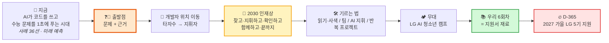

---

## A-1. 프로젝트의 시작 — 문제를 찾고, 근거로 붙잡는다

> **참조** 리딩클루(ReadingClue) 메인 페이지 — https://www.readingclue.com (2026-09-11 확인)
> 리딩클루는 **"관심사 → 책 → 질문 → 기획안"** 순서로 독서를 프로젝트로 잇는 플랫폼입니다. 책 대신 **생활 속 관찰**을 넣으면 우리 발명 수업과 구조가 같습니다. 이 절이 **1교시 전체의 중심 메시지**입니다.

### A-1-1. 다섯 문장으로 보는 핵심

| 리딩클루의 문장 | 뜻 | 우리 발명 수업에서는 |
|---|---|---|
| **"단서는 책이 주지 않습니다. 당신이 남깁니다."** | 책(자료)은 재료일 뿐, 질문은 읽는 사람이 남긴 흔적에서 나온다 | 문제는 교과서도 AI도 주지 않는다. **내가 보고 적은 장면**이 단서다 |
| **"AI가 답을 쓰는 시대, 질문은 사람이 만듭니다."** | 답을 만드는 일은 AI로 넘어가고, 사람에게는 질문이 남는다 | 지휘자 게임의 **그림 카드** = 문제. AI는 이걸 모른다 |
| **"관심사를 정하면 연관된 책이 정해집니다."** | "책부터 읽어라"로는 시작이 안 된다. 관심사가 먼저다 | 2교시: **이슈 10가지 중 관심 분야**를 먼저 고른 뒤 장면을 찾는다 |
| **"혼자 정의한 문제는 확신이고, 반박당한 문제만 문제입니다."** | 반박을 통과해야 문제 정의로 인정된다. 문제 제기는 혼자 하고, 문제 정의는 여럿이 한다 | **근거**와 **팀**이 필요한 이유. 3명이 서로 "그건 너만 그런 거 아냐?"라고 묻는다 |
| **"문제를 깊게 하면 프로젝트가 생깁니다."** (프로젝트는 목표가 아니라 부산물) | 프로젝트를 억지로 시키면 사람이 빠진다. 문제가 깊어지면 프로젝트는 따라온다 | 6회차 중 **1·2회차를 통째로 문제와 근거에** 쓰는 이유 |

### A-1-2. 왜 대부분 '프로젝트'까지 못 가나 — 100명 중 1명

리딩클루는 메인 페이지에서 **"100명이 책을 읽으면 1명만 실행합니다"** 라는 깔때기를 보여 줍니다.

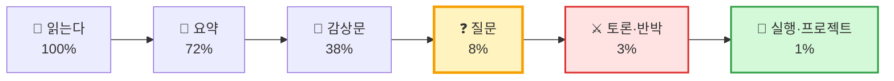

| 깔때기 단계 | 가장 크게 줄어드는 곳 | 우리 수업이 붙잡는 방법 |
|---|---|---|
| 감상 → **질문** (38% → 8%) | "재밌었다·불편했다"에서 멈춘다 | 1회차 2교시: 느낌을 **문제 제기문 한 문장**으로 바꾼다 |
| 질문 → **토론·반박** (8% → 3%) | 질문을 남에게 검증받지 않는다 | 1교시 **반박 라운드**, 2회차 시나리오 합의 |
| 반박 → **실행** (3% → 1%) | 근거가 약해 끝까지 밀고 갈 힘이 없다 | 2교시 **테스트 실험**(센 숫자) → 테스트군 넓히기 숙제 → 3~6회차 제작 → 시나리오로 검사 |

> ⚠️ 이 수치는 리딩클루가 설명용으로 제시한 것이며 **출처가 따로 표기되어 있지 않습니다.** 연구 결과처럼 인용하지 말고, "대부분 **질문** 단계에서 멈춘다"는 **경향을 보여 주는 그림**으로만 사용하세요.

### A-1-3. 읽기의 5단계 = 발명의 5단계

리딩클루의 독서 5단계를 발명 과정에 그대로 겹쳐 봅니다.

| 단계 | 리딩클루 (독서) | 발명 수업 (관찰) | 6회차 |
|:---:|---|---|:---:|
| 01 **입력** | 끝까지 읽는다 | 장면을 **끝까지 본다** (쉬는 시간 관찰) | 1 |
| 02 **감상** | 좋았던 장면을 말한다 | "이거 불편해!" — **느낌**을 말한다 | 1 |
| 03 **전환점** | **느낌을 질문 한 문장으로 바꾼다** | 불편함을 **문제 제기문**으로 바꾼다 | 1 |
| 04 **마찰** | **반론을 받고 고쳐 쓴다** | 반박 라운드 → **근거를 보강**한다 | 1·2 |
| 05 **융합·산출** | 질문을 결과물로 만들어 발표한다 | 발명품을 만들고 시나리오로 검사·발표 | 3~6 |

> **핵심** — 이 표에서 **03 전환점**과 **04 마찰**을 넘는 것이 1회차의 일입니다. 03을 넘으면 **문제**가, 04를 넘으면 **근거**가 생깁니다.

### A-1-4. 근거 잡기 — 비판적 사고 3단계

리딩클루는 비판적 사고를 **① 전제를 찾는다 → ② 어긋나는 지점을 찾는다 → ③ 직접 확인한다(설문·인터뷰·관찰)** 세 단계로 설명합니다. 발명에 적용하면 다음과 같습니다.

| 단계 | 리딩클루 | 발명 수업에서 묻는 말 |
|---|---|---|
| ① **전제 찾기** | 보이는 주장 뒤에 **말하지 않고 깔아 둔 것** | "이 발명품이 필요하다는 말 뒤에 **어떤 생각이 숨어 있지?**" |
| ② **어긋나는 지점** | **내 경험**과 책의 주장이 맞지 않는 한 칸 | "내가 **직접 본 것**과 다른 점은 없어?" |
| ③ **직접 확인** | 설문 · 인터뷰 · 관찰 | "**몇 번 봤어? 몇 명한테 물어봤어?**" |

#### 예시 — 근거가 발명품을 바꾼다

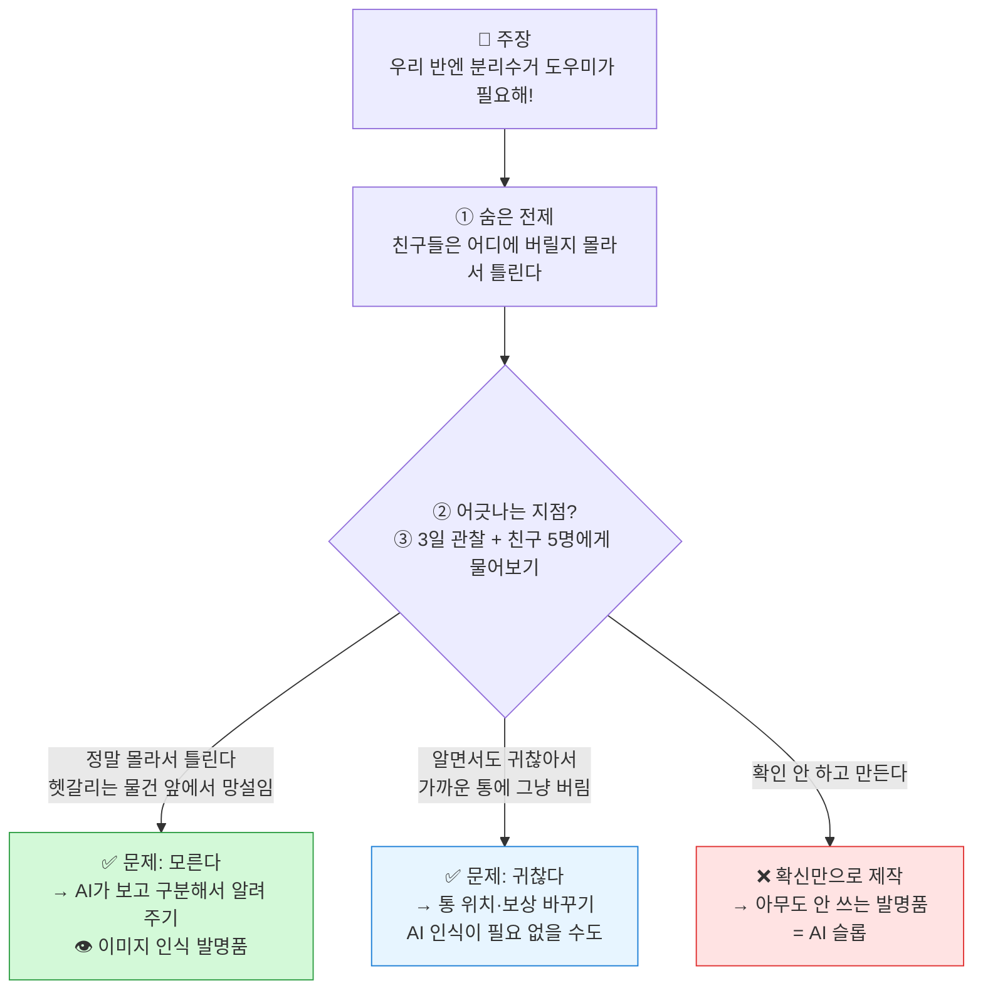

> **이것이 근거가 중요한 이유입니다.** 같은 "분리수거 문제"라도 근거가 무엇이냐에 따라 **만들어야 할 발명품이 완전히 달라집니다.** 근거 없이 만들면 기술이 아무리 좋아도 **엉뚱한 문제를 푸는 발명품**이 됩니다.

### A-1-5. 근거 사다리 — 초5용 도구

리딩클루의 '직접 확인'을 아이들이 스스로 점검할 수 있게 **다섯 칸 사다리**로 바꾼 것입니다. (이 수업에서 만든 도구)

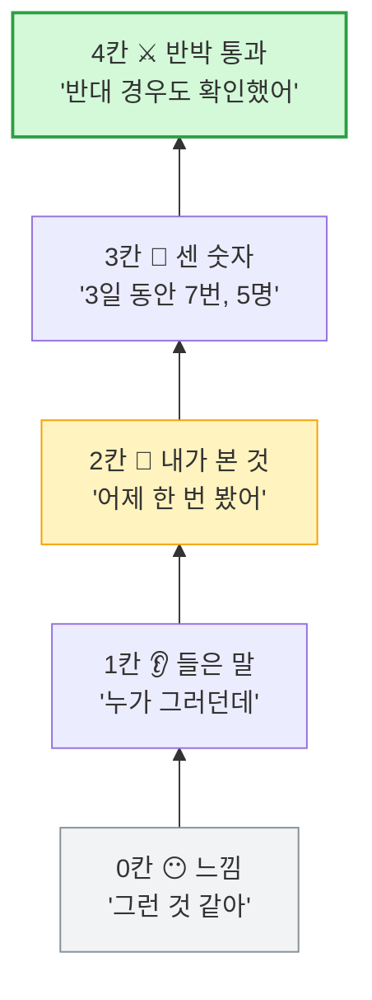

| 사다리 | 아이들 말 | 이 칸에 있으면 | 올라가는 방법 |
|:---:|---|---|---|
| 0칸 느낌 | "그런 것 같아" | 아직 **확신**일 뿐 | "언제 그렇게 느꼈어?" |
| 1칸 들은 말 | "친구가 그러던데" | 남의 확신 | "**직접** 가서 볼까?" |
| 2칸 내가 본 것 | "어제 봤어" | 1교시 쉬는 시간 관찰 | "한 번 더, 몇 명인지 세 볼까?" |
| 3칸 센 숫자 | "3일 동안 7번" / "4명 중 3명" | **1회차 목표선** (2교시 A/B 실험) | "반대 경우는 없었어?" |
| 4칸 반박 통과 | "아닌 경우도 확인했어" | 리딩클루가 말하는 **"문제"** — 2회차 목표선 (테스트군 19명) | → 이제 만들어도 된다 |

### A-1-6. 리딩클루의 '문제 카드'와 2교시 「우리 팀 문제 카드」

| 리딩클루 문제 카드 5칸 | 뜻 | 2교시 「우리 팀 문제 카드」 칸 |
|---|---|---|
| **배경** | 어디서 이 질문이 나왔나 (느낀 순간) | ① 어떤 장면? — 누가·언제·어디서 |
| **주장** | 질문 한 문장 | ② 주장 — 문제 제기문 (해결책 없이) |
| **반론** | 반대편의 말 | ④ 반론 — ⑦ 반박 라운드에서 받은 말 |
| **근거** | 왜 그렇게 말할 수 있나 | ③ 근거 — 근거 사다리 2칸 이상 |
| **확인** | 어떻게 직접 확인할까 | ⑤ 확인 — ⑧ 세 관점 확인 숙제 |
| (왜 중요한가) | 리딩클루 카드 항목 | ⑥ 왜 중요한가 |

> 리딩클루의 **기획안 5가지 형식**(논문·리서치·캠페인·서비스/웹앱·제품/하드웨어) 중 우리 수업은 **제품/하드웨어**(동작 시나리오·부품 목록)에 해당합니다. → 2회차 시나리오, 3회차 아키텍처로 이어집니다.

### A-1-7. 문제·근거 → 개발자 인재상 · LG 캠프로 이어지는 선

| 문제·근거가 하는 일 | 개발자 현장 | LG AI 청소년 캠프 |
|---|---|---|
| **문제** = 무엇을 만들지 정한다 | AI에게 줄 **방향**. 방향이 없으면 AI 슬롭 (A-4) | 영상 필수 요건 "**왜 그 문제를 발견했는지**", 심사 "**사회 문제의 참신성**" |
| **근거** = 그 문제가 진짜임을 보인다 | 면접 질문 "**왜 이렇게 만들었나**"에 답하는 재료 | 캠프 합격 가이드 "**데이터를 스스로 만들거나 구할 수 있는가**", "2주간의 기록이나 30명 설문" |
| **반박** = 팀이 문제를 다듬는다 | 코드 리뷰, 사용자 피드백 | **4인 1팀** 프로젝트, 심사 "협업 의지" |

> **교사 메모 (OECD 표기)** — 리딩클루는 OECD의 **세 가지 힘**(새로운 가치 만들기·다른 생각 조율하기·끝까지 책임지기)과 **학습 사이클**(예측→행동→성찰)을 한 화면에서 짝지어 설명합니다. OECD 원문에서는 이 둘이 **별개의 틀**(변혁적 역량 / AAR 순환)이므로, 학부모 설명 때는 A-8 표처럼 나누어 쓰는 것이 정확합니다.

---

## A-2. 대입도 '정답 고르기'에서 '근거로 쓰기'로 — PD수첩 「A.I시대, 기로에 선 수능」

> **자료** MBC PD수첩 「A.I시대, 기로에 선 수능」 (2026.9.8 방송, 약 44분) — https://www.youtube.com/watch?v=lliYB7pRSg0
> 유튜브 자동 자막을 바탕으로 정리했습니다. 정책 내용은 **방송 시점의 보도**이며 **확정된 제도가 아닙니다.** 국가교육위원회는 **2026년 10월 대입 개편 시안 → 2027년 3월 최종안 확정**을 예고했습니다.

### A-2-1. 방송 핵심 요약

| 장면 (방송 시각) | 내용 | 우리 1회차에 주는 시사점 |
|---|---|---|
| **수능 논·서술형 도입 추진** (01:05~) | 국가교육위원회가 수능 논·서술형 문항 도입을 추진. 보도에 따르면 **빠르면 2033학년도 대입부터** 적용 검토 (학원가는 "현재 6학년부터"라고 안내) | 지금 5학년은 제도가 바뀌면 **바로 그다음 대상**이 될 수 있다. **확정 전**이므로 불안이 아니라 **방향**으로 받아들인다 |
| **1분 30초 vs 1초** (02:49~) | 수능은 수학 1문항 약 3분 20초, 그 밖의 과목은 대체로 1분 30초 안에 풀어야 하는 **오지선다**. 지금의 AI는 같은 문제를 **1초 만에** 푼다. "이 간극 앞에서 우리가 재고 있는 것이 정말 **사고력**인지 물어야 한다" | 정답을 빨리 **고르는** 능력은 AI가 이미 이겼다 |
| **개혁은 늘 수능 앞에서 멈췄다** (03:37~) | 30년 동안 교육과정을 다섯 번 고쳐 **토론 수업·프로젝트 학습·창의성**을 앞세웠지만 교실은 끝내 바뀌지 않았다. 의지가 부족해서가 아니라 **평가가 그대로였기 때문** | 프로젝트 수업은 새 유행이 아니라 **30년 동안 미뤄 온 숙제**다 |
| **블룸의 6단계** (05:52~) | 기억·이해·적용·분석·평가·창조 중 객관식은 잘 만들어도 **지식·이해·적용**까지만 잴 수 있다. 교육과정이 원래 재려던 것의 **"반밖에 못 잰다"** | 분석·평가·창조는 **직접 해 봐야** 는다 → A-2-3 |
| **"AI가 대체하기 가장 좋은 사람"** (06:47~) | 규격화·표준화·대량 생산의 산업화 시대 교육으로 길러진 인재는 **AI가 대체하기 가장 좋은 형태**가 된다. 우리는 이제 뒤따라가는 사람이 아니라 **맨 앞에서 길을 내는 사람**이 되어야 한다 | 따라 할 정답이 없는 곳에서는 **문제를 스스로 찾아야** 한다 |
| **기업 채용** (08:10~) | 공채가 사라지고 직무별 수시 채용이 늘면서 **포트폴리오**, **문제를 주고 어떻게 접근하는지** 보는 평가가 늘고 있다 | A-3 개발자 흐름과 같은 결론 |
| **대학 선발** (09:01~) | 서울대는 **2028학년도에 정시(수능 위주) 인원을 대폭 축소**하기로 했다. 수능만으로는 "어떻게 소통하고, 협력하고, 지식을 활용하는지" 알 수 없어 **학생부**로 본다 | 소통·협력·활용은 **팀 프로젝트의 기록**으로 보인다 |
| **"질문은 배우지 않는다"** (10:19~) | 수험생에게 쌓인 건 **정답을 빨리 찾는 기술**. "답을 빨리, 정확히 찾는 능력은 따지지만, **어떤 질문을 던져야 하는지는 배우지 않는다**" | 리딩클루의 "**질문은 사람이 만든다**"(A-1)와 같은 말 |
| **해외 대입 논술** (15:50~) | 프랑스 바칼로레아, 독일 아비투어, 영국 A레벨, 중국 가오카오, IB — 모두 **자료를 읽고 근거를 들어 자기 주장**을 쓰게 한다 | 세계 기준은 **"근거로 말하기"** → A-2-4 |
| **광주의 한 초등학교** (22:17~) | 교사들이 **융합 탐구 질문**을 만들고, 5학년은 질문 하나로 **매일 2교시씩 25일** 탐구. 책·신문·인터넷에서 스스로 자료를 찾고, 토론으로 학급 공통 질문을 정한 뒤 글을 쓴다. 교사의 핵심 역할은 **개별 피드백** | **초등 5학년이 할 수 있다**는 실제 사례 → A-2-5 |
| **AI 채점** (41:24~) | AI가 채점을 돕되 **점수와 함께 "왜 이 점수인지" 근거를 보여 주고**, 사람이 그 근거를 검증해 최종 판단. "**최종 점수 결과는 사람이 책임진다**" | 검증·책임자 인재상 → A-5 ③ |
| **초등학교부터** (32:14~) | 초등학교는 입시 부담이 적어 **다양한 시도를 해 볼 여지가 많다.** 제도가 연착륙하려면 **초등부터 수업과 평가를 바꿔야** 한다 | 이 6회차가 그 시도다 |

### A-2-2. 1분 30초 vs 1초 — 무엇을 길러야 하나

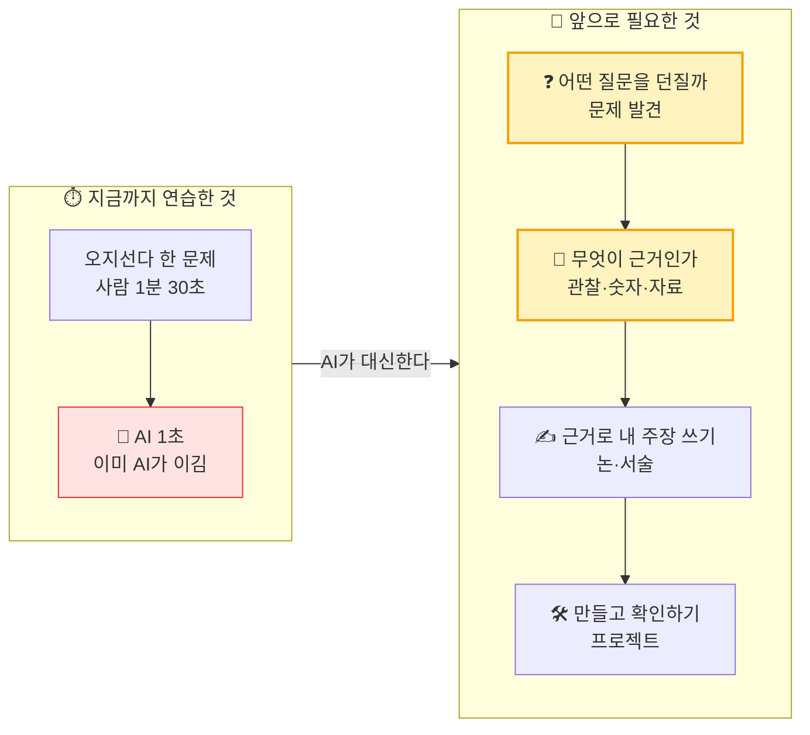

### A-2-3. 블룸의 6단계 — 객관식이 못 재는 '위쪽 절반'을 6회차에서

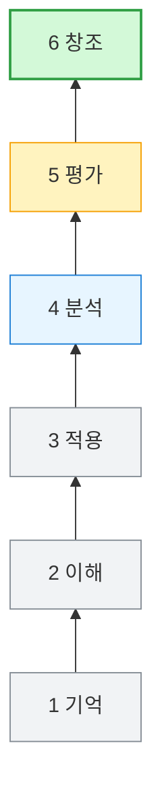

| 블룸 단계 | 객관식으로 | 우리 6회차에서 | 산출물 |
|---|:---:|---|---|
| 1 기억 · 2 이해 | ✅ 잴 수 있음 | 3회차 — 엔트리 예제가 **무엇을 하는지** 파악 | 아키텍처 그림 |
| 3 적용 | ✅ (잘 만든 문제만) | 4회차 — 예제를 **시나리오에 맞게** 고침 | 동작하는 프로그램 |
| 4 **분석** | ❌ 어려움 | 1회차 — A/B 실험 결과를 비교해 원인을 좁힘 / 4회차 — 오류 원인 찾기 | 문제 제기문, 디버깅 기록지 |
| 5 **평가** | ❌ 어려움 | 1회차 — 근거 사다리·반박 라운드 / 4회차 — AI 답 검증 / 6회차 — 시나리오 검사 | 반박 메모, 검사 기록지 |
| 6 **창조** | ❌ 불가 | 1회차 — **문제를 새로 정의** / 5·6회차 — 발명품 완성·확장 아이디어 | 완성 발명품 |

> **포인트** — 방송이 "반밖에 못 잰다"고 한 **위쪽 절반(분석·평가·창조)** 이 바로 **문제 찾기 + 근거 잡기 + 만들기**입니다. 1회차 한 번에 이미 분석·평가·창조를 모두 건드립니다.

### A-2-4. 해외 대입 논술 — 공통점은 '근거'

| 시험 | 방송에 소개된 문제 | 요구하는 것 |
|---|---|---|
| 🇫🇷 **바칼로레아** (프랑스) | "불의에 맞서 싸우는 것은 국가의 책임인가?" | 정답 없는 질문에 **자기 논리** |
| 🇩🇪 **아비투어** (독일, 전 과목 논술·분석형) | 헌법과 세계화에 대한 글을 읽고 요약 → **논거 분석** → 서로 다른 입장 **비교·평가** | 자료 읽기 → **근거 분석** → 평가 |
| 🇬🇧 **A레벨** (영국) | "냉전이 미국의 국가 안보를 위해 전개됐다는 주장에 동의하는가?" | **사료와 배경 지식을 근거로** 주장을 논리적으로 설명 |
| 🇨🇳 **가오카오** (중국) | 성장하면서 어떤 단어에 대한 이해가 달라졌는지, 관점·주제를 정해 800자 이상 | **자기 경험**을 근거로 한 글 |
| 🌐 **IB** (163개국) | 논술형 외부 평가 | 모범 답안 기반 채점자 훈련, 교차 검증 |

> **공통점** — 어느 나라도 "정답을 고르라"고 하지 않습니다. **"근거를 들어 네 생각을 말하라"** 고 합니다. 1회차의 **근거 사다리**(A-1-5)가 초등 버전입니다.

### A-2-5. 초등 모델 — 광주의 한 초등학교 '융합 탐구 수업'

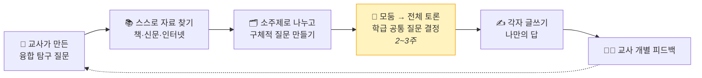

| 항목 | 광주 초등학교 (방송) | 우리 6회차 |
|---|---|---|
| 출발 | 교사가 만든 **융합 탐구 질문** (예: "내 몸과 국토가 어떻게 닮았는지 서술하고, 건강한 지구를 위한 처방전을 제안하라") | 아이들이 찾은 **생활 속 문제** (2교시) |
| 교과 | 국어·사회·과학·도덕 / 사회 그래프 분석에 수학 비례식 적용 | 국어(문제 제기문)·사회(누가 왜)·수학(숫자 근거)·과학(센서)·미술(4컷)·정보(엔트리) |
| 자료 | 교과서 밖 책·신문·인터넷을 **스스로** 찾기 | 직접 **실험**하고 **세기**(테스트군), 가족·친구에게 **묻기** |
| 토론 | 모둠·전체 토론으로 공통 질문 결정 (2~3주) | **반박 라운드**, 3명 동의 확인 |
| 시간 | 5학년, 질문 하나로 **매일 2교시 × 25일**, 1년 약 260교시, 4년째 운영 | 문제 하나로 **6회차** (1회 80~90분) |
| 결과물 | 탐구 글쓰기 | 발명품 + 시나리오 + 기록지 |
| 교사 역할 | 강의 대신 **개별 피드백** | 답을 주지 않고 **질문만** ("누가? 몇 번 봤어?") |

**방송 속 교사들이 쓰는 '좋은 탐구 질문' 4기준 → 우리 문제 제기문 점검표**

| 광주 초등학교 교사들의 기준 | 우리 문제 제기문에 적용하면 |
|---|---|
| 단원에서 탐구한 **중요한 개념**을 확인할 수 있는가 | 이 문제를 풀면 **입력·판단·출력**(보고, 구분하고, 알린다)을 배울 수 있는가 |
| **여러 시간 배운 내용을 연결**해야 답할 수 있는가 | 한 번에 끝나지 않고 **6회차를 끌고 갈 만큼** 깊은가 |
| "○○하고 ○○하며 ○○하시오"처럼 **단순 나열**이 아닌가 | 불편한 점을 여러 개 늘어놓지 않고 **한 장면**에 집중했는가 |
| 문제 안에 **답의 방향을 너무 많이** 알려 주고 있지 않은가 | 문제 제기문에 **해결책(○○ 로봇)을 미리 넣지** 않았는가 |

> **교사 메모** — 방송 속 교사의 고백: 예전에는 반짝이는 시청각 자료, AI·디지털 자료로 수업을 꾸몄지만 "수업이 끝나면 재밌었다고는 하는데, 도대체 **이 아이들은 무엇을 얻었을까** 허탈했다." → 이 6회차도 **도구(엔트리·AI·마이크로비트)가 주인공이 되지 않도록**, 문제와 근거를 끝까지 중심에 둡니다.

### A-2-6. AI 채점 — "근거를 보여 주고, 사람이 책임진다"

| 방송 속 설명 | 2030 인재상과의 연결 |
|---|---|
| 수능 논·서술 채점에 AI 활용을 검토 중. AI는 점수만 주는 게 아니라 **"왜 이 점수인지 근거"** 를 보여 준다 | AI도 **근거**를 내놓아야 신뢰받는다 |
| 마지막에 **사람 채점자가 그 근거를 검증**해 최종 판단한다 | **③ 검증·책임자** — AI 결과를 확인하는 사람 |
| "채점은 AI가 돕고, **최종 점수 결과는 사람이 책임진다**" | 1교시 O/X "AI가 만든 발명품이 고장 나면 AI가 책임진다 → X"의 근거 |

### A-2-7. 이 방송이 1회차에 주는 세 가지 메시지

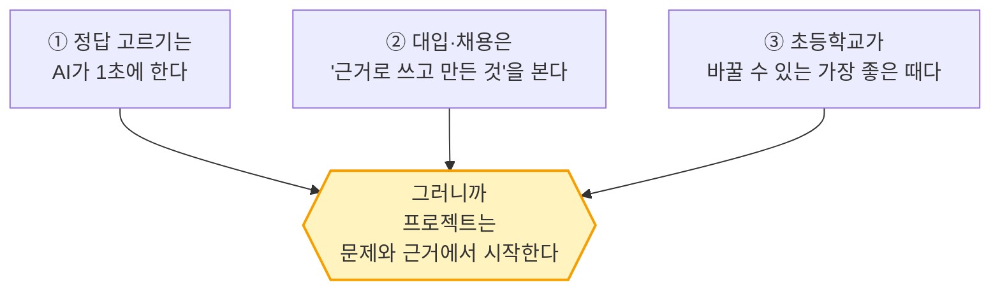

> **학부모 설명 시 주의** — 방송은 제도 변화가 **초등 논술 사교육을 부추길 수 있다**는 우려도 함께 다룹니다. 이 수업의 메시지는 "학원을 더 보내야 한다"가 아니라, **"수업 안에서 문제를 찾고 근거로 말해 본 경험"이 가장 확실한 준비**라는 것입니다. 정책은 **확정 전**이라는 점도 함께 안내하세요.

### A-2-8. 논·서술형이 부딪힌 3가지 벽 — 블루프린트 자료로 본 쟁점

> 출처: `pdf/(AI)-차세대_논서술형_수능_시스템_블루프린트.pdf` (방송 내용을 바탕으로 AI 도구로 만든 요약 자료, **출처 미표기 수치 포함** — 인용 전 원문 확인)

| 벽 | 내용 | 해외는 어떻게 | 우리 수업과의 연결 |
|---|---|---|---|
| **① 공정성 vs 타당성** | 객관식은 1점 차로 줄 세워 **"공정해 보이지만"** 역량은 못 잰다. 서술형은 역량은 재지만 **채점 주관** 불신이 크다 | 🇨🇳 가오카오: 한 지역에 **채점관 3천 명**, 모의 채점 통과자만, 오차 나면 3·4차 전문가 / 🌐 IB: 채점된 **'미끼 답안'** 을 몰래 섞어 채점자 감시 / 🇯🇵 일본: 준비 없이 **민간 외주 채점** → 논란 끝에 **철회** | 근거 사다리의 "**반박 통과**" = 여러 사람이 확인한 판단 |
| **② 사교육 팽창** | 예고만으로 초1 독서논술반 **대기 1,000번**, 7세 에세이반 | — | "학원 대신 **수업 속 경험**" (A-2-7) |
| **③ 교실 인프라** | 서술형은 **개별 첨삭**이 필수인데 교사 1인당 학생 수가 많다 | 광주 초등: **시간 확보 + 개별 피드백** 구조로 해결 (A-2-5) | 3명 소수 수업 = **개별 피드백이 가능한 구조** |

**자료가 제안하는 해법 — "순서를 바꿔라"**

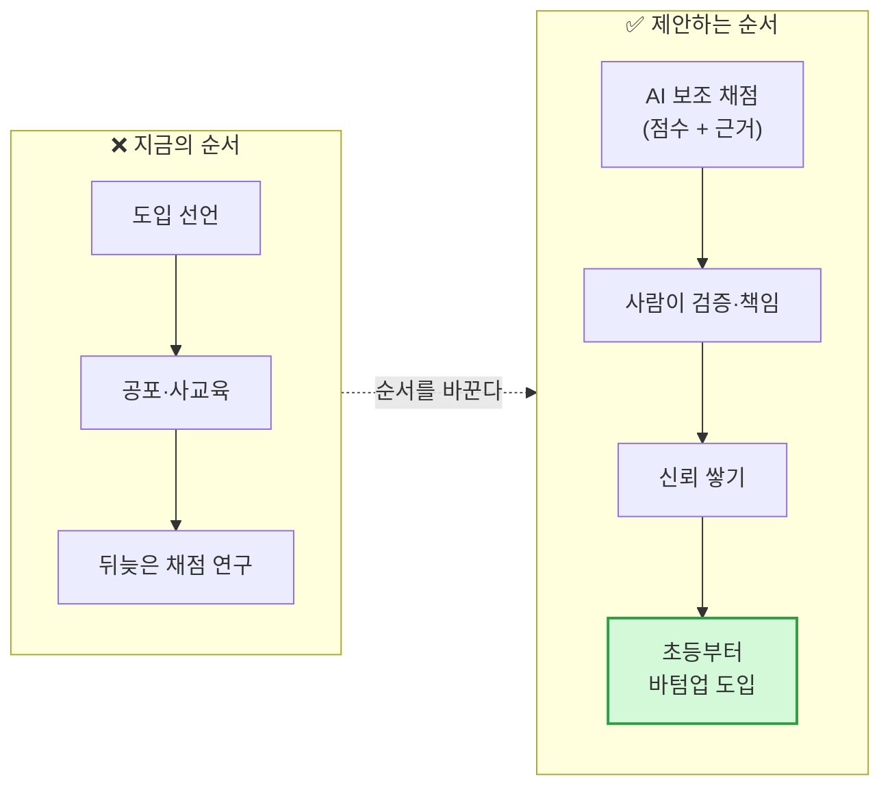

> **교사 메모** — 이 자료의 결론도 방송과 같습니다. **"입시 부담이 적은 초등학교부터"** 수업과 평가를 바꾸자는 것. 지금 5학년은 도입된다면 **2034학년도 대입**(2033년 고3) 대상입니다. 확정 여부와 상관없이 **"근거로 쓰고, 여러 사람의 확인을 통과하는" 경험**은 어느 제도에서도 쓸모가 있습니다.

---

## A-3. 바뀐 시대 — 개발자의 흐름과 7개 분야 사례

> **이 절의 역할** — "AI 시대"라는 말은 흐립니다. 여기서는 **이미 일어난 일**을 분야별로 모아, 그 **신호**에서 우리 아이들의 **2027 · 2030 · 2034 · 2040**을 예측합니다(A-3-6). 결론부터 말하면, 모든 신호가 **같은 방향**을 가리킵니다. **만드는 비용은 0에 가까워지고, "무엇을 왜 만들지"와 "그게 맞는지"의 가치가 올라갑니다.**

### A-3-1. 개발자 타임라인

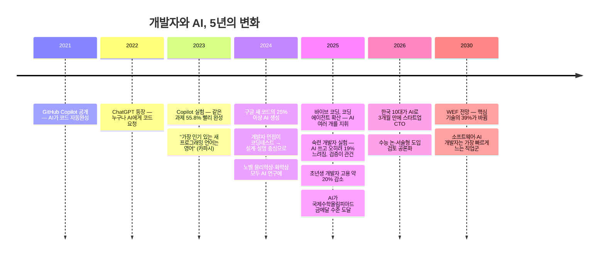

### A-3-2. 개발자 흐름 근거 표

| # | 근거 | 핵심 수치·내용 | 시사점 |
|:---:|---|---|---|
| 1 | **GitHub Copilot 통제 실험** (Peng 외, 2023) | AI 도구를 쓴 그룹이 같은 과제를 **55.8% 더 빨리** 완성 | 코드 **작성 속도**는 더 이상 차별점이 아니다 |
| 2 | **구글 CEO 발언** (2024.10 실적 발표) | 구글 신규 코드의 **4분의 1 이상**을 AI가 생성, 엔지니어가 **검토·승인** | 사람은 **검토·결정**으로 이동 |
| 3 | **Stack Overflow 개발자 설문** (2024·2025) | AI 도구 사용·계획 **76% → 84%**, 그러나 AI 답의 정확도를 **신뢰하지 않는** 응답이 신뢰보다 많음 | 쓰는 건 기본, **믿지 말고 확인** |
| 4 | **METR 실험** (2025.7) | 숙련 오픈소스 개발자 16명이 AI를 쓰자 **19% 느려짐**. 본인들은 **20% 빨라졌다고 착각** | AI를 **지휘·검증하는 능력**이 없으면 오히려 손해 |
| 5 | **Stanford 디지털경제연구소** 「Canaries in the Coal Mine」 (2025.8) | 22~25세 **소프트웨어 개발자 고용이 2022년 말 정점 대비 약 20% 감소**. 경력자는 유지·증가 | "코드만 치는" 초급 일자리가 먼저 줄어든다 → 영상 `[AI-시대]-더 좁아진 취업문` |
| 6 | **WEF 「Future of Jobs 2025」** | 2030년까지 **핵심 기술의 39% 변화**. 빠르게 느는 직업에 **AI·ML 전문가, 소프트웨어·앱 개발자**. 핵심 역량 1위 **분석적 사고**, 상승 역량 **창의적 사고·호기심·평생학습** | 개발자는 **사라지지 않는다. 역할이 바뀐다.** |
| 7 | **카파시(전 테슬라 AI 총괄)** — "영어가 새 프로그래밍 언어"(2023), "바이브 코딩"(2025), "소프트웨어 3.0"(2025) | 자연어로 AI에게 방향을 주면 코드가 나온다. 단, **사람이 결과를 확인하는 고리**가 핵심 | **비개발자도 만드는 사람**이 된다. 기획자·개발자 경계가 흐려짐 |
| 8 | 영상 `[코딩]-AI 시대는 코딩테스트가 중요하지 않다`, `[코딩]-챗지피티로 인해 바뀐 개발자 면접 트렌드` / `pdf/(AI)-The_AI_Orchestrator.pdf` | 넥슨 신입 육성 과정(넥토리얼) — "코딩테스트에서 좋은 평가를 받은 사람이 실무에서도 좋은 평가를 받는다는 **상관관계를 찾지 못했다**". ChatGPT로 **어뷰징**이 늘어 변별력 상실 → "**며칠 안에 이걸 만들어 오라**"는 팀 실무 미션으로 | 설명할 수 있는 **프로젝트 경험**이 무기 |

> ※ 수치는 각 기관 발표 원문 기준입니다. 학부모 설명회 등에서 인용할 때는 원문 링크를 한 번 더 확인하세요.

### A-3-3. 바뀐 시대 사례 36선 — 7개 분야

> **확실도 표시** — ✅ 공식 발표·논문 등 원문 확인이 쉬운 사실 · 📰 언론 보도·기업 발표 기준(수치는 바뀔 수 있음) · 📎 저장소 자료(영상·AI 요약 PDF) 기준, **원문 재확인 권장**
> **아이들에게 쓸 때** — 한 번에 2~3개만. B-2 「이야기 카드 뱅크」에 초5용 스크립트가 있습니다.

#### ① 만드는 방법이 바뀌었다 — "말로 만든다"

| # | 언제 | 무슨 일 | 초5에게 한 줄 | 무엇이 바뀌었나 | 확실도 |
|:---:|:---:|---|---|---|:---:|
| 1 | 2025.2 | 카파시가 **"바이브 코딩"** 이라는 말을 만듦 — 코드를 거의 보지 않고 **말로 설명하며** 프로그램을 만드는 방식. 같은 해 영국 콜린스 사전 **올해의 단어** | "요즘은 **말로** 앱을 만들어요" | 코딩 문법 → **설명하는 힘** | 📰 |
| 2 | 2025.3 | 미국 스타트업 학교 **Y Combinator**: 이번 기수 스타트업의 **약 25%가 코드의 95%를 AI로** 작성했다고 대표가 밝힘 | "새로 생긴 회사 4곳 중 1곳은 코드를 거의 AI가 써요" | 창업 초기 개발 인력 → **AI** | 📰 |
| 3 | 2025.4 | 마이크로소프트 CEO: 회사 코드의 **20~30%를 AI가** 작성 | "구글도 마이크로소프트도 AI가 코드를 써요" | 대기업도 같은 흐름 (구글 25% 이상, A-3-2 #2) | 📰 |
| 4 | 2025 | **코딩 에이전트**(Claude Code, OpenAI Codex, GitHub Copilot 에이전트 등) 확산 — 한 줄씩 돕는 수준을 넘어 **일을 맡기면 스스로 여러 파일을 고치고 테스트** | "AI 여러 명한테 **일을 나눠 주는** 사람이 개발자예요" | 도구 → **팀원** (A-4 오케스트라) | ✅ |
| 5 | 2026 | 한국 10대의 도구 조합 — 리서치 **Genspark·Perplexity** → 화면 설계 **Figma AI** → 코드·배포 **Claude·Cursor·v0·Lovable** (`pdf/(AI)-10대_창업가의_인공지능_활용법.pdf`) | "형·누나들은 AI 4~5개를 **이어서** 써요" | 한 도구 숙달 → **도구 조합(지휘)** | 📎 |
| 6 | 2026 | 10대는 문서 대신 **AI와 나눈 대화(맥락) 파일을 통째로 공유**, 급식 알림 같은 기능은 **에이전트를 카톡에 연결**해 직접 만듦 (같은 PDF) | "불편하면 **직접** 만들어 버려요" | 검색·클릭 → **대화·위임** | 📎 |

#### ② 만드는 사람이 바뀌었다 — 10대·1인 창업

| # | 언제 | 무슨 일 | 초5에게 한 줄 | 무엇이 바뀌었나 | 확실도 |
|:---:|:---:|---|---|---|:---:|
| 7 | 2026 | **고등학생 CTO 신주원** — AI 코딩 발전을 보고 자퇴 후 대안학교, **3개월 만에 스타트업 2곳의 CTO**. 스크린타임 챌린지 앱 **렛스고**(캡처로 인증 → 기부·간식 챌린지, JA 코리아 투자 유치), **여치**(5,000원 10대 맞춤 AI 피부 분석). 영상 `[AI-시대]-10대는 왜 학교를 자퇴하고 창업했을까` | "고등학생 형이 **스마트폰 시간 문제**를 앱으로 만들었어요" (2교시 이슈 ⑤와 같은 문제!) | 25년 루트 → **3개월 실전** | 📎 |
| 8 | 2025.6 | 이스라엘의 **1인 창업자**가 만든 바이브 코딩 서비스 **Base44**, 창업 **약 6개월 만에** 웹사이트 기업 Wix에 약 8천만 달러에 인수 | "**혼자서** 6개월 만에 회사를 만들어 팔았어요" | 팀·자본 → **1인 + AI** | 📰 |
| 9 | 2025.7 | 스웨덴 **Lovable**(말로 웹앱을 만드는 서비스), 출시 **약 8개월 만에 연 매출 1억 달러** 규모 발표 | "말로 앱 만드는 서비스가 제일 빨리 크는 회사가 됐어요" | 누구나 만드는 도구의 폭발 | 📰 |
| 10 | 2025 | 미국 10대들이 만든 **Cal AI** — **음식 사진을 찍으면 칼로리를 알려 주는** 앱, 연 매출 수천만 달러 규모로 보도. 공동창업자는 고교 시절 시작 | "**사진을 보고 구분하는 AI**로 10대가 회사를 키웠어요" — 우리 **5회차(웹캠 AI)** 와 같은 원리 | 이미지 인식 = 이제 **10대의 도구** | 📰 |
| 11 | 2026 | 정부 창업 사업 **「모두의 창업」 2기** — 사업계획서 수십 장 대신 **도전신청서 1장·아이디어 한 줄**로 1만 명 선발, 오디션형 단계 심사. **13세 최연소 합격자** 사례 언급 (`pdf/(AI)-모두의_창업__합격_가이드_로드맵.pdf`) | "초등학생 형 나이도 창업 대회에 붙어요" | 서류·스펙 → **작동하는 아이디어** | 📎 |
| 12 | 2026 | 같은 자료의 **데이터 4단계** — 말(“쓰겠다” 80%) < 약속(사전 신청 200명) < **행동**(10명 중 5명 실제 도입) < **지속**(3명이 3주 매일 사용) | "'쓸래?'보다 '**썼어?**'가 진짜 증거예요" | 설문 → **행동 데이터** (A-1-5 근거 사다리와 같은 구조) | 📎 |

#### ③ 과학이 바뀌었다 — AI가 발견하고, 사람이 질문한다

| # | 언제 | 무슨 일 | 초5에게 한 줄 | 무엇이 바뀌었나 | 확실도 |
|:---:|:---:|---|---|---|:---:|
| 13 | 2024.10 | **노벨 화학상** — 단백질 구조를 예측하는 AI **알파폴드**(구글 딥마인드 허사비스·점퍼)와 단백질 설계(베이커). 알파폴드는 알려진 단백질 **2억 개 이상**의 구조를 예측 | "과학자 수십 년 걸리던 일을 AI가 해서 **노벨상**을 받았어요" | 실험 수년 → 예측 수분, 사람은 **무엇을 물을지** | ✅ |
| 14 | 2024.10 | **노벨 물리학상** — 인공신경망의 기초를 만든 홉필드·힌턴 | "AI를 만든 생각이 노벨상을 받았어요" | AI = 과학의 **중심 도구** | ✅ |
| 15 | 2025.7 | **국제수학올림피아드(IMO)** — 구글 딥마인드와 OpenAI의 AI가 **금메달 수준** 점수(사람처럼 **말로 쓴 증명**) | "세계 최고 수학 대회 문제를 AI가 금메달 점수로 풀었어요" | "어려운 문제 풀기"도 AI가 한다 → 사람은 **새 문제 만들기** · 영상 `[올림피아-대회]` | 📰 |
| 16 | 2026 | 10대 CTO의 실패 — Claude가 만든 **완벽해 보이는 pH 실험 계획·코드**로 대학 연구실에서 실험 → **실패, 원인도 못 찾음**. "AI가 만든 문제를 다시 AI로 풀어야 하는 역설" (10대 창업가 PDF) | "**그 분야를 모르면** AI가 틀려도 모른대요" | 도메인 지식 = **검증의 눈** (③ 검증·책임자) | 📎 |

#### ④ 일과 채용이 바뀌었다

| # | 언제 | 무슨 일 | 초5에게 한 줄 | 무엇이 바뀌었나 | 확실도 |
|:---:|:---:|---|---|---|:---:|
| 17 | 2025.8 | 22~25세 개발자 고용 **약 20% 감소**, 경력자는 유지 (Stanford, A-3-2 #5) | "코드만 치는 일은 줄고, **판단하는 일**은 남아요" | 초급 일자리부터 재편 | ✅ |
| 18 | 2024~2025 | 스웨덴 핀테크 **클라르나** — AI 상담이 상담원 **약 700명 몫**을 한다고 발표 → 이후 **품질 문제로 사람 상담을 다시 강화** | "AI로 다 바꿨다가 **사람이 다시 필요**해졌어요" | 대체가 아니라 **역할 재배치** | 📰 |
| 19 | 2025.4 | 학습앱 **듀오링고** "AI 우선" 선언 → 사용자·직원 반발 | "AI만 앞세우면 **사람들이 싫어해요**" | 기술 수용 = **신뢰의 문제** | 📰 |
| 20 | 2024~ | 넥슨: 코딩테스트 점수 ↔ 실무 성과 **상관관계 없음** → **팀 실무 미션·AI 활용 허용** 평가로 (A-3-2 #8) | "시험 점수보다 **만들어 본 경험**을 봐요" | 시험 → **포트폴리오·미션** | 📎 |
| 21 | 2026.9 | PD수첩 — 대기업 **공채 축소·직무별 수시 채용**, 문제를 주고 **어떻게 접근하는지** 보는 평가 증가 (A-2-1) | "회사도 '**어떻게 풀었어?**'를 물어요" | 스펙 → **과정 설명** | 📰 |
| 22 | 2025 | WEF: 2030년까지 **핵심 기술 39%** 변화, 상승 역량 **창의적 사고·호기심·평생학습** (A-3-2 #6) | "배우는 걸 **계속** 해야 하는 시대" | 한 번 배워 평생 → **계속 배우기** | ✅ |

#### ⑤ 학교와 입시가 바뀌고 있다

| # | 언제 | 무슨 일 | 초5에게 한 줄 | 무엇이 바뀌었나 | 확실도 |
|:---:|:---:|---|---|---|:---:|
| 23 | 2025.3 | **고교학점제** 전면 시행 — 고등학생이 과목을 **골라서** 듣는다 | "고등학교에선 내가 **과목을 골라요**" | 정해진 시간표 → **선택과 진로 설계** | ✅ |
| 24 | 2023.12 확정 | **2028 대입 개편** — 고교 내신 **5등급제**, 수능 **선택과목 폐지(통합형)** | "등급 칸이 줄어 **점수 한 줄로 가르기**가 어려워져요" | 줄 세우기 약화 → **학생부·과정** 비중 | ✅ |
| 25 | 2026.9~ | 국가교육위원회, 수능 **논·서술형** 도입 **검토** — 2026.10 시안, 2027.3 최종안 예정. 보도상 빠르면 **2033학년도**부터 (A-2) | "앞으로 수능에서 **내 생각을 근거로 쓰는** 문제가 나올 수도" | 고르기 → **쓰기** (🔴 확정 아님) | 📰 |
| 26 | 2025 | **AI 디지털교과서** — 2025.3 도입 → 같은 해 법 개정으로 **'교과서'에서 '교육자료'로** 지위가 바뀜 | "좋은 기계를 넣는다고 수업이 바로 좋아지진 않아요" | **도구보다 수업 설계** (A-2-5 교사 메모와 같은 결론) | 📰 |
| 27 | 2019~2021 | **일본**, 대입 공통시험에 **기술(서술)식 도입 추진 → 채점 외주·공정성 논란으로 철회** (`pdf/(AI)-차세대_논서술형_수능_시스템_블루프린트.pdf`) | "준비 없이 바꾸면 **실패**하기도 해요" | 변화의 속도 ≠ 신뢰의 속도 | ✅ |
| 28 | 진행 중 | 중국 가오카오 — 논술 채점에 한 지역만 **채점관 3천 명**, 모의 채점 통과자만 채점 / **IB** — 이미 채점된 **'미끼 답안'** 을 몰래 섞어 채점자 일관성 감시 (같은 PDF) | "글쓰기 시험은 **공정하게 채점하는 방법**이 핵심이에요" | AI 채점 + **사람 검증** 구조로 (A-2-6) | 📎 |

#### ⑥ 기계가 몸을 가졌다 — 피지컬 AI

| # | 언제 | 무슨 일 | 초5에게 한 줄 | 무엇이 바뀌었나 | 확실도 |
|:---:|:---:|---|---|---|:---:|
| 29 | 2025 | 미국 **웨이모** 무인 로보택시 — 여러 도시에서 **운전자 없이** 유료 운행, 주당 수십만 건 | "운전사 없는 택시가 **진짜로** 돈 받고 달려요" | AI 판단 → **현실 세계 행동** | 📰 |
| 30 | 2025.1 | 엔비디아 젠슨 황, CES에서 다음 물결로 **"피지컬 AI"**(로봇·자율주행) 선언 | "다음은 **움직이는 AI**래요" | 화면 속 AI → **몸을 가진 AI** | 📰 |
| 31 | 2025~ | **카카오 AI 루키 캠프** — 중학생 100명이 3박 4일 **피지컬 AI 팀 프로젝트** (영상 `[캠프]-중학생 개발자 100명의…`) | "중학생들이 AI 로봇을 **팀으로** 만들어요" | 우리 **6회차(마이크로비트)** 가 바로 그 입구 | 📎 |
| 32 | 2026 | **LG AI 청소년 캠프** 서울대 합숙에서 LG 현직자가 자체 AI 모델 **엑사원(EXAONE)** 특강 (Blueprint PDF) | "AI를 **직접 만드는 회사**가 초6~중2를 뽑아요" | 기업이 **초등부터** 인재를 찾는다 | 📎 |

#### ⑦ 우리 또래가 바꿨다 — 청소년 발명·캠프 선배

| # | 언제 | 무슨 일 | 초5에게 한 줄 | 배울 점 | 확실도 |
|:---:|:---:|---|---|---|:---:|
| 33 | 2017~2020 | 미국 **기탄잘리 라오** — **11세**에 수돗물 **납 오염 감지 장치**(Tethys)로 과학 대회 우승, 이후 사이버 폭력 감지 AI 앱(Kindly). 2020 TIME **첫 '올해의 어린이'** | "**5학년 나이**에 동네 수돗물 문제를 발명으로 풀었어요" | 뉴스에서 본 **남의 문제**를 **우리 동네**로 좁힘 | ✅ |
| 34 | 1~3기 | **LG AI 청소년 캠프 선배 아이디어** — 벌레 물린 자국 분석기(이미지 → 곤충 식별 → 응급처치), **쇼츠 중독 방지 AI**(시선 추적 + 화면 흑백 전환), 아기 울음소리 해석(소리 분류), 딸기 가격 예측, 점심 메뉴 추천, 앱 권한 위험도, 시각장애인 표정 읽기 (`docs/아이디어/청소년_AI창업_아이디어_사례집.md`, Blueprint PDF) | "형·누나들은 **벌레 물린 자국**, **동생 울음소리** 같은 **작은 불편**에서 시작했어요" | 거대한 주제 ❌ · **3m 안의 문제** ⭕ | 📎 |
| 35 | 제37회 | **대한민국학생발명전시회 대통령상**(중1) — 폭우 때 **맨홀 뚜껑이 튀어 오르는** 사고를 막는 수압 이용 맨홀 / 또 다른 대통령상 — **"기름진 국을 좋아하는 아빠 뱃살이 걱정돼서"** 만든 기름 걷는 국자 | "**아빠 뱃살 걱정**도 대통령상이 돼요" | **가족 관찰**이 가장 참신한 문제 | 📎 |
| 36 | 2026 | PD수첩 — 광주의 한 초등학교 **5학년**이 질문 하나로 **25일** 탐구 (A-2-5) | "여러분 **또래**가 이미 하고 있어요" | 초5도 **긴 호흡 프로젝트**가 된다 | 📰 |

### A-3-4. 사례 속으로 — 한국 10대는 AI를 어떻게 쓰나

> 출처: `pdf/(AI)-10대_창업가의_인공지능_활용법.pdf` + 영상 `[AI-시대]-10대는 왜 학교를 자퇴하고 창업했을까 _ 고등학생 CTO 신주원` (AI 요약 PDF이므로 수치·표현은 영상 원본으로 재확인 권장)

| 구분 | 90년대생 (기성세대) | 10대 (AI 네이티브) | 우리 수업에서 |
|---|---|---|---|
| 정보 찾기 | 검색창에 단어 → 사이트 방문 | AI에게 묻고 **꼬리 질문** ("다른 방식으로 설명해 줘") | 4회차 **AI에게 묻기** — 한 번에 끝내지 않기 |
| 협업 | 정리된 문서·링크 공유 | AI와 나눈 **대화 맥락을 통째로** 공유 | 3인 팀 **기록 머리**의 기록지 = 팀의 맥락 |
| 일상 불편 | 참는다 / 앱을 찾는다 | **직접 만든다** (급식 알림 에이전트) | "불편하면 발명한다" = 이 수업의 전제 |
| AI란 | 배워야 할 **도구** | 함께 크는 **파트너** | 지휘자 게임 (B-3) |

**그러나 이 사례가 스스로 밝힌 한계 두 가지**

| 한계 | 내용 | 교육적 의미 |
|---|---|---|
| **도메인 지식의 부재** | AI가 짠 실험이 실패했는데 **원인을 못 찾음** (#16) | 읽고 사색하기 = **검증의 눈** (A-6 ①) |
| **실행은 위임, 사고는 보호** | PPT·요약·코드·디자인 초안은 AI에 맡기되, **토론의 근거 도출·자기 생각 형성**은 사람의 영역으로 지킨다 | 1교시 **근거 사다리·반박 라운드**는 AI에게 맡기지 않는 영역 |

> **아이들에게 한 문장** — "형·누나들은 AI로 **엄청 빨리** 만들어요. 그런데 **그 분야를 모르면 AI가 틀려도 모른대요.** 그래서 우리는 **직접 보고, 세고, 따져 보는 것**부터 해요."

### A-3-5. 반대 신호 — 모든 게 AI 속도로 바뀌지는 않는다

> 예측이 과장되지 않으려면 **반대 신호**도 같이 봐야 합니다. 학부모 설명회에서 "AI가 다 한다"는 공포 대신 **균형**을 보여 주는 표입니다.

| 빠르게 바뀌는 것 ⚡ | 느리게 바뀌거나 되돌아온 것 🐢 | 교훈 |
|---|---|---|
| 코드 작성 (구글 25%, YC 95%) | 숙련자도 검증 없이 쓰면 **19% 느려짐** (METR) | 속도보다 **검증** |
| AI 상담으로 대체 (클라르나) | 품질 문제로 **사람 상담 재강화** | 대체보다 **재배치** |
| AI 디지털교과서 도입 | 1년도 안 돼 **교육자료로 격하** | 도구보다 **수업 설계** |
| 서술형 시험 도입 선언 (일본) | 채점 공정성 문제로 **철회** | 제도는 **신뢰**만큼만 바뀐다 |
| 논·서술형 수능 검토 (한국) | 초1 독서논술반 **대기 1,000번**, 7세 에세이반 — **불안 마케팅** (블루프린트 PDF) | 학원이 아니라 **수업 속 경험**이 준비 (A-2-7) |
| 10대 3개월 CTO | pH 실험 실패, 원인 모름 | 속도의 대가는 **깊이** |

### A-3-6. 신호에서 미래로 — 지금 5학년의 시간표 예측

**예측하는 방법** — 이미 일어난 **신호**(A-3-3) → 여러 분야에서 반복되는 **추세** → **예측**. 확실도를 셋으로 나눕니다.
🟢 **거의 확실** (이미 제도·일정이 정해졌거나, 모든 신호가 같은 방향) · 🟡 **가능성 높음** (추세는 분명, 속도·형태는 미정) · 🔴 **불확실** (검토·논의 단계)

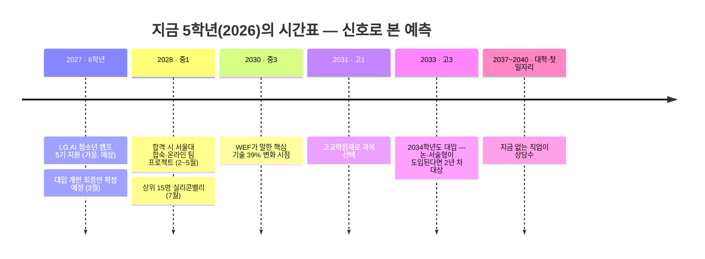

| 시점 | 나이 | 🟢 거의 확실 | 🟡 가능성 높음 | 🔴 불확실 | 그래서 지금 할 일 |
|---|---|---|---|---|---|
| **2027** | 6학년 | LG 캠프는 **영상 + 역할 기술서**로 선발 (1~4기 동일 구조) · 말로 만드는 도구는 **더 쉬워진다** | 지원자가 늘고 **"AI로 만든 비슷한 아이디어"** 가 많아진다 → 차별화는 **나만의 현장 + 숫자 근거** | 5기 정확한 일정·학년 기준 (요강 발표 후 확정) | **6회차 완주 + 두 번째 프로젝트** (A-7) |
| **2028~2030** | 중학생 | 개발자 역할 = **지휘·검증** (모든 개발 신호가 같은 방향) | 코딩 에이전트가 **팀원처럼** 일한다 · 로봇·센서 등 **피지컬 AI**가 학교·집으로 | 어떤 도구가 살아남을지 | 도구가 아니라 **입력·판단·출력으로 보는 눈** (3회차 아키텍처) |
| **2031~2034** | 고등학생 | **고교학점제**(시행 중) · **2028 대입 체제**(내신 5등급·통합형 수능) | 학생부·**과정 기록**의 비중 ↑ · 채점에 **AI 보조 + 사람 책임** 구조 | **논·서술형 수능** 도입 여부·시기 (5학년 = 2034학년도 대입) | **근거로 쓰는 습관** — 문제 제기문·관찰 기록 |
| **2035~2040** | 대학·첫 일자리 | "문제를 찾고 · 근거로 설득하고 · 팀으로 끝까지 만드는" 사람의 가치 ↑ (역사상 모든 도구 혁명의 공통점) | 초급 "실행" 일자리는 줄고, **판단·조율·책임** 일자리가 는다 | 구체적 직업 이름 | **5가지 인재상** (A-5) |

> **읽는 법** — 🔴가 많아 불안해 보이지만, **🟢 칸만 모아도 결론은 하나**입니다. 어떤 제도가 오든 **"문제를 찾고, 근거를 대고, 만들어서 확인해 본 경험"** 은 손해 볼 일이 없습니다. 이것이 6회차 수업이 **확실한 쪽에 거는 이유**입니다.

### A-3-7. 변하지 않는 것 3가지

> 아마존 창업자 제프 베이조스의 조언 — "10년 뒤 무엇이 **변할까**보다, 무엇이 **변하지 않을까**를 물어라. 변하지 않는 것에 걸면 오래 간다."

| 변하지 않는 것 | 왜 | 인재상 (A-5) | 6회차 |
|---|---|---|---|
| **사람은 불편하다** | AI가 아무리 빨라도 **어떤 불편을 풀지**는 사람을 봐야 안다 | ① 문제 발견자 | 1·2회차 |
| **사람은 믿을 근거를 원한다** | AI 채점도, 투자도, 대입도 결국 "**왜?**"를 묻는다 | ③ 검증·책임자 | 근거 사다리, 6회차 검사 |
| **큰일은 함께 한다** | 1인 창업도 AI라는 팀원, 사용자라는 청중이 있다 | ④ 팀 플레이어 | 3인 역할 로테이션 |

---

## A-4. 개발자의 위치 — AI와 어떻게 협력하는가

### "타자수"에서 "지휘자"로

| 구분 | 어제의 개발자 (~2020) | 오늘의 개발자 (2025) | 2030 개발자 (전망) |
|---|---|---|---|
| 주 업무 | 코드를 **직접 작성** | AI가 쓴 코드를 **검토·수정** | 여러 AI 에이전트에게 **일을 나눠 주고 지휘** |
| 핵심 질문 | "어떻게 짜지?" | "이 코드 맞나?" | "**무엇을, 누구를 위해, 왜** 만들지?" |
| 도구 | 편집기, 검색 | AI 자동완성, 챗봇 | 코딩·테스트·리서치 **에이전트 여러 개** |
| 평가 방식 | 코딩테스트 점수 | 설계·설명 면접 | **완주한 프로젝트와 그 과정 기록** |
| 부족하면 | 코드를 못 짬 | AI 오류를 못 잡음 | **방향을 못 줌 → AI 슬롭만 쌓임** |
| 필수 덕목 | 문법 지식, **더하기**(코드 생산) | AI 도구 활용 | 호기심, 창의성, **빼기**(본질만 남기기) |

> **"더하기보다 어려운 빼기"** (`pdf/(AI)-The_AI_Orchestrator.pdf`) — AI는 코드와 아이디어를 **끝없이 더합니다.** 지휘자의 힘은 그중 **무엇을 버릴지** 아는 데서 나옵니다. 우리 수업에서는 2교시 **12장면 → 1장면**, 3회차 **"한 번에 한 군데만"** 이 빼기 연습입니다. 이 자료의 결론 한 줄: **"기술은 AI가, 방향은 인간이."**

### AI 오케스트라 — 개발자는 지휘자

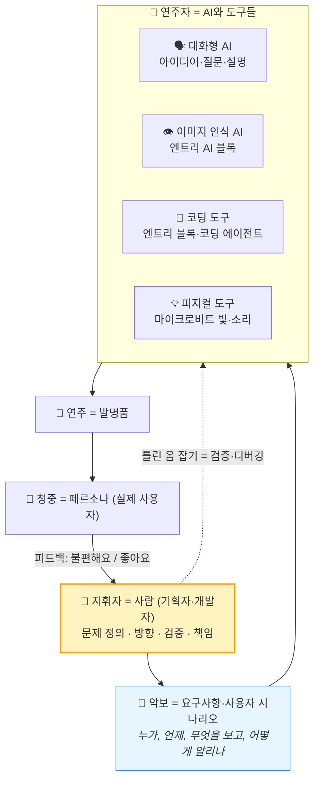

| 오케스트라 | 개발 현장 | 우리 6회차 | 지휘자가 없으면 |
|---|---|---|---|
| **악보** | 요구사항·설계 | 1·2회차 문제 제기문·시나리오 | 연주자마다 다른 곡 → **AI 슬롭** |
| **파트 배분** | 에이전트별 역할 | 3회차 아키텍처 (입력·판단·출력) | 모두가 같은 부분만 연주 |
| **틀린 음 잡기** | 코드 리뷰·테스트 | 4회차 디버깅, AI 답 검증 | 틀린 채로 공연 → 사고 |
| **악기 교체** | 부품 교체·확장 | 5회차 웹캠, 6회차 마이크로비트 | 한 악기 바꾸면 전체 붕괴 |
| **공연 후 평가** | 사용자 피드백 | 6회차 시나리오 검사·재검사 | 청중이 떠남 |

> **핵심** — 오케스트라에서 지휘자는 악기를 제일 잘 다루는 사람이 아니라 **곡 전체를 이해하고 방향을 정하는 사람**입니다. AI 시대 개발자도 같습니다. 그래서 **"비개발자"도 좋은 지휘자가 될 수 있고**, LG 캠프가 **기획자**와 **개발자**를 동등하게 뽑는 이유이기도 합니다.

### 비개발자(기획자)에게도 열린 시대

| 비개발자 가이드(인포그래픽)의 4가지 역량 | 뜻 | 오케스트라에서 |
|---|---|---|
| 기술보다 중요한 **'문제 정의'** 능력 | 어떤 아이디어로 어떤 문제를 풀 것인가 | 곡 고르기 |
| 도구를 배우는 대신 **AI에게 '방향'을 던지기** | 맥락 전달, 올바른 방향 제시 | 지휘봉 |
| 인간에 대한 **관찰과 공감** | 사람의 문제를 깊이 관찰 | 청중 이해 |
| 판단하는 **'눈'과 실행력** | 결과가 진짜 쓸만한지 판단 | 틀린 음 잡기 |

> 출처: `pdf/비개발자를_위한_AI_가치_가이드.png` — "AI 슬롭(많이 만들지만 남는 게 없는 것) vs AI 자산(지속적으로 쓰이고 개선되는 것)"

---

## A-5. 제안 — AI 시대 2030 개발자 인재상 5가지

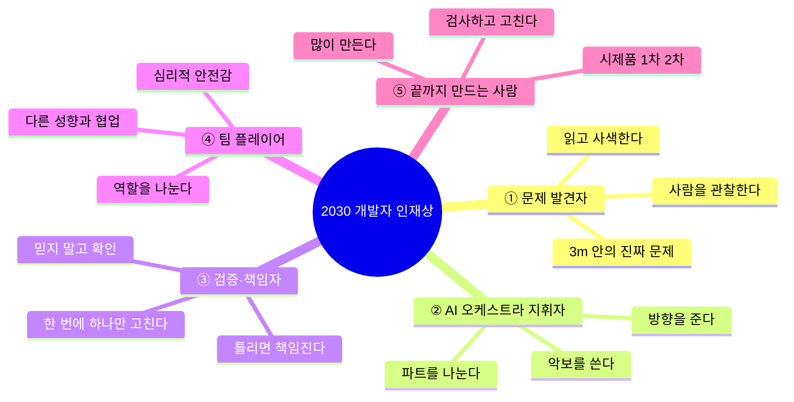

| 인재상 | 아이들 말로 | 근거 ① 연구·통계 | 근거 ② LG 캠프 | 근거 ③ OECD | 6회차 |
|---|---|---|---|---|:---:|
| **① 문제 발견자** | **찾는 사람** | Getzels & Csikszentmihalyi — 문제를 오래 탐색한 학생이 더 창의적 작품, 수년 뒤 성공 / PD수첩 — "어떤 질문을 던져야 하는지는 배우지 않는다" | 심사 **"사회 문제의 참신성"**, 영상 필수 "왜 그 문제를 발견했나" | 새로운 가치 창출 | 1·2 |
| **② AI 오케스트라 지휘자** | **지휘하는 사람** | 카파시 "영어가 새 언어", 코딩 에이전트 확산 | 개발자 역할 "**AI 알고리즘 선택**", 기획자 역할 "**AI 학습용 데이터 수집**" | 행위주체성 (Agency) | 3·5 |
| **③ 검증·책임자** | **확인하는 사람** | METR — 검증 없으면 19% 느려짐 / Stack Overflow — 신뢰 < 불신 / PD수첩 — AI 채점도 "최종 결과는 사람이 책임" | 지원 시 **AI 도구 사용 방법 공개 의무** | 책임감 갖기 | 4·6 |
| **④ 팀 플레이어** | **함께하는 사람** | Google 프로젝트 아리스토텔레스 — 좋은 팀 1위 조건 **심리적 안전감** / Wuchty 외(Science, 2007) — 영향력 큰 연구는 점점 **팀**이 만든다 | **4인 1팀 랜덤 배정**, 심사 "협업 의지", **LG탐색상**(팀 최다 기여자) | 협력적 행위주체성, 긴장·딜레마 조정 | 전 회차 |
| **⑤ 끝까지 만드는 사람** | **끝까지 하는 사람** | 도자기 수업 일화(『Art & Fear』) — **많이 만든 반**이 더 좋은 작품 / Lucas 교육연구(2021) — PBL 수업 학생 성취 **약 8%p↑** (고교 AP·초3 과학) | 개발자 역할 "**1차 프로토타입 → 개선 2차 개발 → 성능 향상**", 온라인 출석 80%·결석 유예 없음 | AAR 순환 (예측·실행·성찰) | 3~6 |

---

## A-6. 왜? — 네 가지 질문에 대한 근거

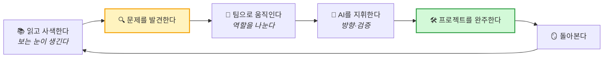

### ① 왜 **책을 읽고 사색**해야 문제가 보이나

| 근거 | 내용 | 수업 적용 |
|---|---|---|
| **아인슈타인 — 특허청 직원** (영상 `[천재]-특허청 직원이 현대 물리학을 창조했다`) | 1902~1909년 스위스 특허청 심사관. 친구들과 **'올림피아 아카데미'라는 독서 모임**을 만들어 흄·마흐·푸앵카레를 읽고 토론. 발명품 서류를 보며 **생각 실험**을 거듭한 끝에 1905년 논문들을 발표 | 읽고 → 친구와 말하고 → 혼자 생각하기 = **문제를 보는 눈** |
| **Getzels & Csikszentmihalyi, 『The Creative Vision』 (1976)** | 미술 학생 연구: 그리기 전에 **재료를 많이 만져 보고, 구도를 오래 탐색한(문제 발견)** 학생의 작품이 더 독창적으로 평가되고 수년 뒤 작가로 더 성공 | 2교시 스피드 토론(10주제)과 실험에 시간을 **충분히** 준다 |
| **스티브 잡스 — 캘리그래피 수업** (2005 스탠퍼드 연설) | 대학에서 청강한 서체 수업이 10년 뒤 매킨토시의 아름다운 글꼴이 됨. "점들은 나중에 이어진다" | 다른 분야 지식이 **융합**의 재료 |
| **비탈릭 부테린 — 이더리움 창시자** (영상 `[천재]-떡잎부터 남달랐던...`) | 즐기던 게임의 캐릭터 능력을 회사가 **일방적으로 바꾼 경험**에서 "중앙에서 한 회사가 다 정하는 구조"의 문제를 발견했다고 본인이 밝힘 | 불편한 **내 경험**이 큰 문제의 입구 |
| **창의력 인포그래픽** (`pdf/창의력을_설계하는_세_가지_혁신.png`) | 제1원칙 사고(본질까지 쪼개기), 교차 학습, "3시간 관찰의 힘", 질문하고 설명하며 검증 | 2교시 **A/B 실험**과 따지기 (질문하고 검증하기) |

> **정리** — AI는 **답**을 주지만 **질문**은 주지 않는다. 좋은 질문은 **읽고, 생각하고, 관찰한 사람**에게서 나온다.

### ② 왜 **프로젝트를 많이** 해야 하나

| 근거 | 내용 |
|---|---|
| **도자기 수업 일화** (『Art & Fear』, 1993) | 한 반은 **양**(무게)으로, 다른 반은 **질**(작품 1개)로 평가. 가장 좋은 작품은 **양** 반에서 나옴 — 많이 만들며 실수에서 배웠기 때문 |
| **Lucas Education Research (2021)** | 고교 AP 과목에 PBL을 적용한 반의 시험 통과율 **약 8%p 높음**. 초등 3학년 과학 PBL 반도 성취 **약 8% 높음** — 저소득층 학생에게도 동일한 효과 |
| **팔머 럭키** (영상 `[천재]-페이스북이 버린 천재 안두릴 CEO 팔머럭키`) | 10대에 부모님 차고에서 VR 헤드셋 **시제품을 여러 번 만들며** 개선 → 19세에 오큘러스 창업 → 이후 안두릴 창업 |
| **10대 창업가** (영상 `[AI-시대]-10대는 왜 학교를 자퇴하고 창업했을까`, 인포그래픽) | "25년의 전통적 루트" 대신 "**3개월의 실전 성장**" — 아이디어를 실제 서비스로 만들어 가치를 증명 (스크린타임 제어 앱, 저가형 AI 피부 분석) |
| **LG 캠프 개발자 역할 원문** | "1차 프로토타입 개발 → **개선 사항 반영 2차 개발** → 성능 향상 및 최종 개발 완성" — 캠프 자체가 **반복 프로젝트** 구조 |
| **채용 변화** (영상 `[코딩]-*`) | 면접에서 "**왜 이렇게 만들었나**"를 묻는다 → 설명할 수 있는 건 **직접 완주한 프로젝트**뿐 |

### ③ 왜 **팀워크**인가

| 근거 | 내용 |
|---|---|
| **Google 프로젝트 아리스토텔레스** (2015~2016) | 180여 개 팀 분석 → 성과 좋은 팀의 1위 조건은 천재 멤버가 아니라 **심리적 안전감**(틀려도 말할 수 있는 분위기) |
| **Wuchty·Jones·Uzzi, 「Science」 (2007)** | 수십 년간 논문·특허 수천만 건 분석 → **팀이 만든 연구가 점점 더 많이, 더 크게 인용**됨 |
| **LG 캠프 구조** | 개인 지원 → **4인 1팀 랜덤 배정** → 3개월 팀 프로젝트. 역할 기술서 필수 문항 "**나와 다른 성향·능력의 팀원과 어떻게 협업할지**", **LG탐색상** = 팀에 가장 크게 기여한 1인 |
| **카카오 AI 루키 캠프** (영상) | 중학생 100명이 3박 4일 **피지컬 AI 팀 프로젝트** |
| 영상 `[팀워크]-맨몸으로 높은 벽을 정복하는 가장 완벽한 방법` | 혼자는 못 넘는 벽을 **역할을 나눠** 넘는다 (아래·중간·위) — 3명 수업의 역할 분담 비유로 사용 |

### ④ 왜 **AI 오케스트라(지휘)** 가 중요한가

| 근거 | 내용 |
|---|---|
| **METR 실험** (2025) | 숙련자도 AI를 **지휘·검증하는 방법** 없이 쓰면 느려진다. 도구가 아니라 **지휘 능력**이 성과를 가른다 |
| **10대 창업가 인포그래픽** | "AI를 배우지 않고, **AI와 함께한다**", "검색 대신 이해될 때까지 **꼬리 질문**", "문서 공유보다 **대화 컨텍스트** 공유", 한계: 도메인 지식이 없으면 AI의 **환각을 못 잡는다** |
| **비개발자 가이드 인포그래픽** | "AI 에이전트에게 **맥락 전달, 올바른 방향 제시**" — 도구 사용법보다 방향이 먼저 |
| **LG 캠프 원문** | 지원 영상에 **AI 도구를 어떻게 썼는지 밝힐 것** — AI 사용은 감점이 아니라 **어떻게 지휘했는지**가 평가 대상 |
| **우리 6회차** | 대화형 AI(4회차 질문) + 이미지 인식 AI(5회차) + 엔트리(3·4회차) + 마이크로비트(6회차) = **4개 악기를 지휘하는 작은 오케스트라** |

---

## A-7. 🔥 바로 닥친 현실 — LG AI 청소년 캠프 D-365 로드맵

> **왜 "바로 닥친 현실"인가** — 대입(2034학년도)은 8년 뒤지만, **LG AI 청소년 캠프 5기 접수는 약 1년 뒤(2027년 가을 예상)** 입니다. 지금 5학년이 **처음으로 "문제 + 근거 + AI 해결"을 공식 무대에서 평가받는 날**이고, 이 6회차의 산출물이 그대로 지원서 재료가 됩니다.
> **출처** `docs/아이디어/LG_AI_청소년캠프_조사.md`(캠프 홈페이지 원문, 2026-09-08 조사) · `pdf/(AI)-LG_AI_Youth_Camp_2026_Blueprint.pdf`(AI 요약 자료 — 공식 요강과 다를 수 있음) · `docs/아이디어/청소년_AI창업_아이디어_사례집.md`
> ⚠️ **5기 일정·학년 기준은 추정**입니다. 1~4기의 반복 패턴으로 예상한 것이므로 **5기 요강 공개 후 반드시 재확인**하세요.

### A-7-1. 한눈에 — 1년 뒤 그날까지

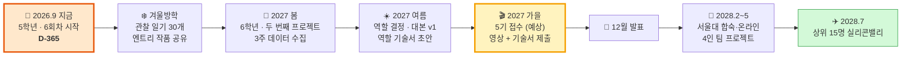

### A-7-2. 캠프 구조와 기수별 일정

| 단계 | 3기 (실제) | 4기 (지금 모집) | **5기 (우리, 예상)** | 인원 |
|---|---|---|---|---|
| Step 1 선발 — **영상 1~3분 + 자막 + 역할 기술서** | 2025.9.10 ~ 11.3 접수 → 12.17 발표 | **2026.9.14 ~ 10.22** 접수 | **2027년 9~10월** 접수 | 지원자 전체 (2기 1,329명 → 약 13:1) |
| Step 2 서울대 과정 — 2박 3일 합숙 + 매주 토 온라인 팀 프로젝트 | 2026.2.5~7 합숙 / 2.21~5.9 온라인 (토 9:30~11:30) | 2027.2~5 (예상) | **2028.2~5** | 100명 / 25팀 (4인 1팀) |
| Step 3 미국 과정 — 실리콘밸리·스탠퍼드 | 2026.7.12~28 | 2027.7 (예상) | **2028.7** | 상위 15명 (LG인재상) |

| 항목 | 내용 |
|---|---|
| 대상 | **접수 시점 기준 초6 ~ 중2** → 지금 5학년은 **4기 대상이 아니고 5기부터** (5기 요강에서 확인) |
| 비용 | **전액 무료**(LG 사회공헌). 개인 부담은 교통비·여권·ESTA 정도 |
| 지원 | **개인 지원만**, 1인 1지원, 기획자·개발자 **중복 선택 가능**, **PC에서만** 작성, 제출 후 수정 불가, **지난 기수 지원자 재지원 가능** |
| 수료 조건 | 합숙·최종 발표일 **필참**, 온라인 **출석 80%** — **영재원·학원 일정 겹쳐도 결석 처리** |
| 시상 | **LG인재상**(최우수 개인, 미국 과정) · **LG성장상**(우수 팀) · **LG탐색상**(팀별 최다 기여자 1인) · **최다 응모 학교상**(3개교, 각 100만 원 — 3기 3위는 **8명** 지원) |
| 기회 횟수 | 초6·중1·중2 **최대 3번** — 떨어져도 **재지원** 가능. 초6 지원은 "연습"이 아니라 **첫 번째 기회** |

> **4기를 교재로 쓰기** — 4기 요강이 **2026.9.14** 공개됩니다. 교사가 요강·역할 기술서 양식을 내려받아 두면, 6회차 동안 **실제 양식으로 "모의 지원서"** 를 채워 볼 수 있습니다. 주변에 **지금 6학년~중2** 형제·선배가 있다면 4기(10.22 마감) 지원을 안내해 주세요.

### A-7-3. 공식 심사 기준 5개 → 우리가 1년간 쌓을 증거

> 5개 중 **3개(협업·열정·역할 역량)** 는 아이디어가 아니라 **사람**을 봅니다. 아이디어 : 역할 증명 ≈ **5 : 5**로 준비합니다. (배점은 비공개)

| 공식 심사 기준 | 심사자가 알고 싶은 것 | 6회차에서 생기는 증거 | 1년 동안 더할 것 |
|---|---|---|---|
| ① **AI에 대한 관심** | AI를 **써 봤고**, 어떻게 **지휘**했나 | 4회차 AI 질문·검토 기록지 / 5회차 인식률 관찰 | AI에게 물은 질문 **노트 1권** (틀린 답을 잡은 사례 3개) |
| ② **사회 문제의 참신성** | **이 학생이니까** 발견한 문제인가 | 1회차 문제 카드 + 관찰·실험 숫자 | **관찰 일기 30개** → 나만 접근하는 현장의 문제 1개 |
| ③ **협업 의지** | 모르는 3명과 **4인 팀**에서 어떻게 일할까 | 3인 역할 로테이션 기록, 반박 라운드 | 의견이 갈렸던 **실제 사건 1개** 기록 (기술서 협업 문항 재료) |
| ④ **열정과 태도** | 끝까지 하는가 | 6회차 **완주**, 디버깅 기록 | **두 번째 프로젝트** 완주 (반복의 증거) |
| ⑤ **역할별 역량·경험** | 기획자·개발자로서 **해 본 일** | 기획: 페르소나·시나리오·학습 데이터 / 개발: 엔트리·AI 블록·마이크로비트 | 기획: 인터뷰·설문 / 개발: **남에게 공개한 작품** 1개 이상 |

### A-7-4. 선배들은 무엇으로 붙었나 — 1~3기 아이디어와 패턴

| 기수 | 아이디어 | 문제의 출처 | AI가 하는 일 | 우리 6회차와의 거리 |
|:---:|---|---|---|---|
| 1기 | **벌레 물린 자국 분석기** | 여름마다 겪는 **내 몸** | 사진 → 곤충 종류 → 대처법 | 🟢 5회차 **이미지 구분** 그대로 |
| 1기 | 시각장애인 의사소통 보조 | 주변 사람 관찰 | 표정 인식 → 감정 음성 안내 | 🟡 웹캠 입력 + 소리 출력 |
| 1기 | 출입자 인식 외부인 판별 | 우리 학교·아파트 | 얼굴 인식 | 🟡 (개인정보 주의) |
| 2기 | **아기 울음소리 해석** | 동생·육아 | 소리 분류(배고픔·졸림·불편) | 🟡 입력만 소리로 교체 |
| 2기 | 딸기 가격 예측 | 농산물 가격 | 시계열 예측 | 🔴 숫자 데이터 |
| 2기 | 점심 메뉴 추천 | 매일의 고민 | 추천 | 🟡 |
| 3기 | 앱 권한 위험도 판별 | 내 스마트폰 | 권한 분석 → 위험 점수 | 🔴 |
| 3기 | 검색 이력 기반 맞춤 답변 | 내 검색 습관 | 개인화 | 🔴 |
| ? | **쇼츠 중독 방지 AI** | 내 스마트폰 시간 | 시선 추적 + 화면 **흑백 전환** | 🟢 2교시 이슈 ⑤, 웹캠 + 출력 |

**여기서 읽히는 패턴 3가지**

| 패턴 | 설명 | 우리에게 |
|---|---|---|
| **작고 가깝다** | 벌레 자국, 동생 울음, 스마트폰 시간 — 전부 **3m 안** | 2교시 필터 🔍 "직접 봤나?" |
| **입력이 분명하다** | 사진·소리·숫자 중 **무엇을 보고** 판단하는지 한 줄로 말할 수 있다 | 방향 3칸 **본다 → 판단한다 → 알린다** |
| **기술보다 문제** | 심사위원 조언 — "**도메인을 좁혀라**", "**기술력의 함정에 빠지지 마라**", "**정답은 스크린 밖 일상에**" (Blueprint PDF) | 1교시 전체의 메시지 |

### A-7-5. 합격권 눈금 — 초6 버전

| 등급 | 예 | 왜 |
|---|---|---|
| ❌ 탈락권 | "AI로 환경오염을 해결하겠습니다" | 남의 문제, 범위 무한대, 동작 설명 불가 |
| 🔺 평범 | "시각장애인을 위한 AI 안내 앱을 만들겠습니다" | 착하지만 **이미 있고**, 내가 왜 아는지 근거 없음 |
| ⭕ **합격권** | "우리 반 급식 때 나물을 그대로 버리는 친구를 **3주 동안 세어 보니 하루 평균 6명**이었고, 물어보니 **'무슨 맛인지 몰라서'** 가 제일 많았습니다. 그래서 **반찬 사진을 보고 종류를 구분해 받기 전에 불빛으로 알려 주는** 장치를 **엔트리와 마이크로비트로 만들어 봤습니다**." | 관찰 → 숫자 → 원인 → AI 동작 → **이미 만들어 봄**이 한 줄로 이어짐 |
| 🌟 상위권 | 위 + "옆 반 2곳도 비슷했다" + "처음엔 인식률이 60%였는데 사진을 **조명별로 다시 찍어** 85%로 올렸다" + "쓰는 사람(2학년 동생) 반응을 **다시 확인**했다" | 참신성 + 실행력 + **검증·개선의 기록** |

> **기준선** — "초6이 **3주 안에 데이터를 직접 모을 수 있는** 크기의 문제." 그보다 크면 허풍, 작으면 의미가 약합니다. 우리 6회차는 이미 **⭕ 합격권의 뼈대**를 만들고, 2027년 봄 두 번째 프로젝트가 **🌟 상위권의 "개선 기록"** 을 만듭니다.

### A-7-6. D-365 월별 로드맵

| 시기 | 학년 | 할 일 | 산출물 (포트폴리오 폴더에) | 누가 |
|---|:---:|---|---|---|
| **2026.9~11** | 5 | **6회차 완주**. 매 회차 끝에 **30초 셀프 영상**("오늘 나는 ○○을 했고, ○○이 안 돼서 ○○로 고쳤다") | 문제 카드, 실험·관찰 기록, 페르소나·시나리오, 아키텍처, 디버깅·AI 질문 기록, 학습 데이터, 완성품 시연 영상, **셀프 영상 6개** | 학생·교사 |
| 2026.9.14~ | 5 | **4기 요강·양식 확보** → 6회차 중 **모의 지원서** 1회 (기술서 공통 문항 2개만) | 모의 기술서 초안 | 교사 |
| **2026.12~2027.2** | 5→6 | 겨울방학 **관찰 일기 30개** (짜증·불편했던 순간만) · **책 1권** (기술서 "영향을 준 책" 재료) · 엔트리 작품 1개 **공유** | 관찰 일기, 독서 메모, 공유 링크 | 학생·보호자 |
| 2027.3 | 6 | 대입 개편 최종안 발표(예정) 확인 — **불안이 아니라 방향** 점검 | — | 교사·보호자 |
| **2027.3~5** | 6 | **두 번째 프로젝트** — 관찰 일기에서 문제 1개, 6회차 구조(본다·판단·알린다)에서 **입력이나 출력만 바꿔** 확장. **3주 데이터 수집** + 당사자 인터뷰 5명 | 3주 기록표, 인터뷰 메모, 개선 전후 인식률 | 학생 (교사 코칭) |
| 2027.5 | 6 | 4기 LG인재상 발표·공지 확인 — **선배 주제·요강 변화** 메모 | 변화 메모 | 교사 |
| **2027.6~7** | 6 | **역할 결정** — 내가 만든 것을 **실행해서 남에게 보여 준 적**이 있으면 개발자 포함, 없으면 기획자 단독으로 깊게 (A-7-8) | 역할 결정 메모 | 학생 |
| **2027.8** | 6 | 여름방학 — **영상 대본 v1**(글로 먼저, 2,000자 이내) → 소리 내어 3분 안으로 깎기 → **가족·친구 앞 리허설 3회 + 반박 받기** · 역할 기술서 초안 (300·300·500·500자) | 대본 v1~v3, 기술서 초안 | 학생·보호자 |
| **2027.9~10** | 6 | **5기 요강 확인**(변경점 반영) → 촬영(본인 얼굴·목소리) → 유튜브 **'일부공개'** + 원본 파일 → **마감 3일 전 PC로 제출** | 최종 영상, 자막, 기술서 | 학생·보호자 |
| 2027.12 | 6 | 결과 발표 — 불합격이면 **중1에 재지원**(기회 3번) | — | — |
| 2028.2~5 | 중1 | 합격 시 **토요일 오전 일정 비우기** (영재원·학원과 겹치면 결석 처리) | — | 보호자 |

> **학부모께 미리 알릴 것** — ① 비용은 없지만 **시간과 출석**이 진짜 비용입니다(2028년 2~5월 매주 토요일, 합숙·발표일 필참). ② 만 14세 미만은 **보호자 명의 휴대폰**으로 인증합니다. ③ 같은 학교에서 여러 명이 지원하면 **최다 응모 학교상**이 있습니다 — 반 친구들과 함께 준비하면 좋습니다.

### A-7-7. 지원 영상 1~3분 — 우리 6회차로 채우는 5구간

| 구간 | 시간 | 내용 | 6회차 어디서 | 대본 예시 (급식 사례, 초6 말투) |
|---|---|---|:---:|---|
| ① 장면 | 0:00~0:25 | 설명 말고 **사건 하나** | 1회차 | "작년 5학년 때, 급식실에서 2학년 동생이 나물을 **한 번도 안 먹고 그대로 버리는 걸** 봤습니다." |
| ② 근거 | 0:25~0:50 | **숫자 1개는 반드시** | 1회차 숙제·2회차 | "그래서 3주 동안 세어 봤더니 하루 평균 6명이었고, 5명에게 물어보니 4명이 '무슨 맛인지 몰라서'라고 했습니다." |
| ③ AI 시나리오 | 0:50~1:50 | 입력 → AI 판단 → 출력 → 누가 어떻게 쓰나. **그림·시연 화면** | 2·5·6회차 | "반찬 사진을 웹캠이 보고 나물·고기·생선을 구분하면, 마이크로비트가 **받기 전에** 불빛으로 알려 줍니다. 처음엔 60%만 맞았는데, 조명을 바꿔 사진을 다시 찍어 85%까지 올렸습니다." |
| ④ 내 역할 | 1:50~2:30 | 기획자/개발자로서 **내가 맡을 일 + 해 본 경험** | 3~6회차 | (기획자) "저는 관찰하고 세고 물어보는 일을 맡았고, 학습 사진 120장을 직접 찍었습니다." / (개발자) "엔트리로 판단 규칙을 만들고, 오류를 한 군데씩 고쳤습니다." |
| ⑤ 팀·AI 고백 | 2:30~3:00 | 모르는 3명과 어떻게 일할지 + **AI 도구를 어떻게 썼는지** | 4회차 | "저는 팀에서 **기록을 맡는 걸** 잘합니다. AI에게 '사진 인식이 흔들리는 이유'를 물었고, 답 중 **조명 이야기가 맞는지 직접 실험해서** 확인했습니다." |

> **촬영 원칙** — 화려한 편집보다 **또박또박한 말·조용한 장소**. 자막이 **그대로 심사 자료**가 되므로 대본을 글로 먼저 완성합니다. AI 사용은 **숨기지 말고 구체적으로** — 감점이 아니라 **AI 관심의 증거**입니다.

### A-7-8. 기획자 vs 개발자 — 캠프가 정의한 역할과 역할 기술서

| | 🗂️ 기획자 | 💻 개발자 |
|---|---|---|
| **팀에서 하는 일** (요강 원문) | 문제 찾기 사전조사 / 경험을 살린 아이디어 제안 / 전문 지식 조사로 해결 방안 구체화 / 협의 내용 시각화(도표·그림·화면) / **AI 학습용 데이터 수집** / 과정 계획·기록·발표 준비 | 활용 가능한 기술 조사 / 우리 팀이 **구현 가능한지 검토** / **AI 알고리즘 선택** / 1차 프로토타입 / 개선 반영 2차 개발 / 성능 향상·최종 완성 |
| **오케스트라에서** | 악보를 쓰고 청중을 이해 | 악기를 고르고 조율 |
| **6회차에서 연습** | 1·2회차 문제·페르소나·시나리오, 5회차 학습 데이터 촬영 | 3·4회차 예제 수정·디버깅, 5회차 모델, 6회차 마이크로비트 |
| **고르는 기준** | 물어보고 기록하고 설명하는 게 재밌다 | 내가 만든 걸 **실행해서 남에게 보여 준 적**이 있다 |

**역할 기술서 문항과 1년 뒤 쓸 문장 틀**

| 문항 (글자 수) | 심사 포인트 | 문장 틀 — 형용사 대신 **사건** | 재료 |
|---|---|---|---|
| 공통 ① 자기소개 (300) | 성향·관심사·활동·**영향을 준 책** | "저는 ○○을 보면 **왜 그런지 세어 보는** 사람입니다. 5학년 때 ○○ 문제를 3주 동안 기록했고, 『○○』을 읽고 ○○을 알게 됐습니다." | 관찰 일기, 독서 메모 |
| 공통 ② 4인 팀 협업 (300) | **숨은 승부처** — 협업 의지 채점 | "**의견이 갈렸던 실제 경험** → 내가 한 행동 → 결과 → 캠프 팀에서 할 **구체 행동**(회의 기록 담당, 매주 진행 공유)" | 3인 역할 로테이션, 반박 라운드 기록 |
| 기획자 ③ 특기 (500) | 기획자 업무와 연결 | "관찰·인터뷰·시각화" 중 **내가 실제로 한 것** | 페르소나 카드, 4컷 만화 |
| 기획자 ④ 경험 (500) | 예시: 글쓰기·**발명**·인터뷰·시장조사·디자인·발표 | "6회차 AI 발명 프로젝트에서 ○명을 관찰·인터뷰해 문제를 ○○에서 ○○로 **다시 정의**했습니다." | 문제 카드의 **가설 → 수정** 기록 |
| 개발자 ③ 특기 (500) | 개발 능력 | "안 되면 **한 군데씩** 바꿔 원인을 찾습니다" + 사례 | 디버깅 기록지 |
| 개발자 ④ 경험 (500) | **필수: 개발 언어 / 툴(이름·버전) / 구현한 기능** | "**언어** 엔트리 블록 코딩 · **툴** 엔트리(버전 ○○), 엔트리 AI 이미지 분류 모델, BBC micro:bit V2 · **기능** 웹캠으로 반찬 사진 3종류 구분 → 마이크로비트 LED·소리 알림, 인식률 60% → 85% 개선" | 3~6회차 전체 |

> **지금 챙길 것** — 개발자 문항은 **툴 버전**까지 요구합니다. 3회차부터 **엔트리·마이크로비트 버전을 기록지에 적어 두세요.** 1년 뒤에는 기억나지 않습니다.

### A-7-9. 6회차 산출물 → LG 캠프 지원서 연결표

| LG 지원서 요구 | 6회차 어디서 만들어지나 | 산출물 |
|---|:---:|---|
| 영상 — **왜 그 문제를 발견했는지** | 1회차 | 문제 제기문 + 관찰 근거(숫자) |
| 영상 — **AI로 어떻게 해결할지 구체적으로** | 2회차 | 사용자 시나리오, 입력·판단·출력표 |
| 영상 — **AI 도구를 어떻게 썼는지** | 4회차 | AI 질문·검토 기록지 |
| 역할 기술서(개발자) — **언어·툴·구현 기능** | 3~6회차 | "엔트리(버전) + AI 이미지 분류 블록 + 마이크로비트로 ○○ 구현" |
| 역할 기술서(기획자) — **특기를 살린 경험** | 1·2·5회차 | 페르소나 카드, 4컷 만화, 학습 데이터 수집 기록 |
| 역할 기술서 — **다른 성향 팀원과의 협업** | 전 회차 | 3인 역할 로테이션 기록 |
| 역할 기술서 — **영향을 준 책** | 1교시 A-6 ① 이후 | 겨울방학 독서 메모 |
| 심사 — **사회 문제의 참신성** | 1회차 | 3m 안의 진짜 문제 |
| 심사 — **열정과 태도** | 6회차 + 2027 봄 | 두 번의 완주 기록 |

### A-7-10. 떨어지는 지원서의 공통점 — 미리 피하기

| 탈락 패턴 | 예 | 1년 동안의 예방법 |
|---|---|---|
| **거대 담론** | "AI로 기후 위기를" | 2교시 필터 🔍 — 3m 안 |
| **해결책부터** | "AI 로봇을 만들고 싶어요" | 문제 제기문에 **해결책 단어 금지** |
| **근거 없음** | "다들 불편해해요" | 근거 사다리 **3칸(숫자)** 이상 |
| **기술 자랑** | 화면·용어만 화려 | 심사위원 조언 "**기술력의 함정**" — 사람과 장면으로 |
| **역할 공백** | 영상에 "내가 맡을 일"이 없음 | ④ 구간 30초 필수 |
| **형식 실격** | 본인 미출연, 링크 불가, 비공식 양식, 마감 당일 제출 | 체크리스트 + **3일 전 제출** |

### A-7-11. LG 캠프만이 무대는 아니다 — 같은 재료로 도전할 수 있는 곳

| 무대 | 대상 | 같은 재료를 어떻게 | 비고 |
|---|---|---|---|
| **LG AI 청소년 캠프** | 초6~중2 | 영상 + 기술서 | 🎯 주 목표 |
| 대한민국학생발명전시회 (특허청) | 초·중·고 | 발명품 + 설명서 | 3~4월 접수 (연도별 확인) |
| 전국학생과학발명품경진대회 | 초·중·고 | 시·도 예선 → 전국 | 학교 통해 참가 |
| 삼성 주니어 SW 창작대회 | 초·중등 | SW로 사회 문제 해결 | 요강 확인 |
| 대한민국 청소년 창업경진대회 | 초·중·고 | 문제 → 서비스 기획 | 교육부·창업진흥원 |
| 카카오 AI 루키 캠프 | 중학생 | 피지컬 AI 팀 프로젝트 | 중학교 진학 후 |

> 대회 정보는 `docs/아이디어/청소년_AI창업_아이디어_사례집.md` 기준이며, **해마다 일정·대상이 바뀌므로 요강을 꼭 확인**하세요. 핵심은 **하나의 프로젝트 기록이 여러 무대의 재료가 된다**는 것입니다.

---

## A-8. OECD 인재상 검토 — 이 제안의 교육적 근거

| OECD 「학습 나침반 2030」 요소 | 뜻 | 2030 개발자 인재상과의 연결 |
|---|---|---|
| **학생 행위주체성 (Student Agency)** | 스스로 목표를 세우고 방향을 잡는다 | **② 지휘자** — 방향을 주는 사람 |
| **협력적 행위주체성 (Co-agency)** | 친구·교사·가족과 함께 방향을 정한다 | **④ 팀 플레이어** |
| 변혁적 역량 ① **새로운 가치 창출** | 없던 해결책을 만든다 | **① 문제 발견자, ⑤ 끝까지 만드는 사람** |
| 변혁적 역량 ② **긴장과 딜레마 조정** | 부딪히는 요구를 양쪽 다 고려 | **④ 팀 플레이어** (성향이 다른 팀원 조율) |
| 변혁적 역량 ③ **책임감 갖기** | 결과를 예측·평가하고 책임진다 | **③ 검증·책임자** |
| **AAR 순환** (예측 → 실행 → 성찰) | 행동 전 예측, 실행, 돌아보기 | 신청서의 "**예상하고 → 실행하고 → 원인을 찾아 → 한 군데씩 고친다**" |
| **PISA 2022 창의적 사고** (한국 최상위권) | 다양한 아이디어 → 독창적 아이디어 → **평가·개선** | 2교시 발산 → 수렴 |
| **기초 소양: 디지털·데이터 소양** | 데이터를 읽고 다루는 힘 | 5회차 학습 데이터·인식률 관찰 |

> **결론** — OECD가 말하는 "스스로 방향을 잡는 사람"은 AI 시대 개발 현장이 말하는 "AI 오케스트라의 지휘자"와 **같은 사람**이다. 그리고 그 사람은 **강의가 아니라 프로젝트 속에서** 길러진다.

---

# PART B. 40분 수업안 — "문제를 찾고, 근거로 붙잡아라"

## B-0. 한눈에 보기

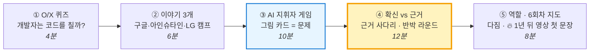

| 구간 | 시간 | 핵심 질문 | A4 칸 | 아이들이 가져갈 한 문장 |
|:---:|:---:|---|:---:|---|
| ① O/X | 0~4분 | AI가 코드를 쓰면 개발자는 뭘 하지? | ① | "코드는 AI가 빨리 쓴다. **질문은 사람이 만든다.**" |
| ② 이야기 | 4~10분 | 앞서가는 사람들은 뭐가 달랐지? | — | "**읽고 생각하고 관찰**한 사람이 문제를 찾는다." |
| ③ 지휘자 게임 | 10~20분 | 지휘자에게 제일 필요한 건 뭐지? | ② | "**그림 카드(문제)** 가 없으면 아무것도 못 한다." |
| ④ 확신 vs 근거 | 20~32분 | 내 문제가 진짜라는 걸 어떻게 보여 주지? | ③ | "**반박당해도 버티는 문제만 진짜 문제다.**" |
| ⑤ 역할·지도·다짐 | 32~40분 | 6번 수업은 어디서 시작하지? | ④ | "프로젝트는 **문제와 근거**에서 시작한다." |

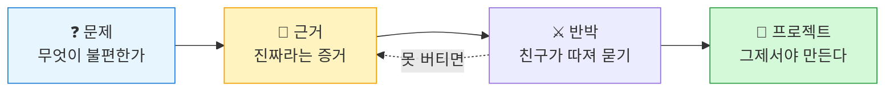

### A4 한 장 — 4칸 접기

> A4를 가로·세로로 한 번씩 접어 4칸. 각 칸 위에 번호만 씁니다. **뒷면은 2교시(이슈 투표)용으로 비워 둡니다.**

| ① O/X 퀴즈 | ② AI 지휘자 게임 그림 |
|:---:|:---:|
| **③ 근거 사다리 · 반박 메모** | **④ 나의 다짐 한 줄** |

---

## B-1. O/X 퀴즈 · 0~4분 — "개발자는 앞으로 코드를 칠까?"

> **여는 발문** — "개발자라고 하면 어떤 모습이 떠올라요?" (까만 화면에 코드를 치는 모습이 나오면 좋습니다) "그런데 요즘은 **AI가 코드를 써요.** 그럼 개발자는 뭘 할까요?"

①칸에 번호와 O/X만 적습니다. (6문항, 빠르게)

| # | 문제 | 정답 | 교사 한 줄 |
|:---:|---|:---:|---|
| 1 | AI는 수능 객관식 한 문제를 **1초 만에** 풀 수 있다 | O | 사람은 1분 30초. **정답 고르기**는 AI가 이겼다 |
| 2 | AI가 쓴 코드는 항상 맞는다 | X | 그래서 **확인하는 사람**이 필요하다 |
| 3 | AI는 "우리 반에서 뭐가 제일 불편한지" 스스로 알아낸다 | X | 우리 반을 **본 적이 없다** — 그걸 본 건 **우리** |
| 4 | "그런 것 같아"도 좋은 근거다 | X | 그건 **확신**이지 근거가 아니다 (④에서 다시) |
| 5 | 앞으로 수능에 **'내 생각을 근거로 쓰는' 문제**가 생길 수도 있다 | O | 나라에서 논의 중 (아직 확정은 아님) |
| 6 | AI가 채점하거나 발명품을 만들면, 결과는 AI가 책임진다 | X | AI는 근거를 보여 주고, **책임은 사람**이 진다 |
| ⭐7 | 한국 고등학생이 AI로 앱을 만들어 **스타트업의 기술 책임자(CTO)** 가 된 일이 있다 | O | 스마트폰 시간 문제를 앱으로 — **만드는 건 이제 누구나** (A-3-3 #7) |
| ⭐8 | AI가 세계 수학올림피아드 문제를 **금메달 점수**로 풀었다 | O | 어려운 문제 **풀기**도 AI가 한다. 사람은 **새 문제 찾기** (A-3-3 #15) |

> ⭐7·8은 **시간이 남으면 1개만**. 아이들이 "그럼 우리는 뭘 해?"라고 물으면 성공입니다.

> **정리 멘트** — "형·누나들은 수능 문제 하나를 1분 30초 안에 푸는 연습을 12년 동안 해요. 그런데 AI는 1초면 풀어요. 그래서 요즘 어른들이 '정답 고르기 말고 **내 생각을 근거로 쓰는 시험**'을 고민하고 있어요. AI가 **답**을 쓰는 시대예요. 그럼 사람은 뭘 할까요? **질문은 사람이 만들어요.** 오늘은 그 질문, 즉 **문제**를 찾는 사람이 되어 볼 거예요."

---

## B-2. 이야기 3개 · 4~10분 (각 2분)

| 이야기 | 아이들에게 하는 말 (예시 스크립트) | 끝 질문 |
|---|---|---|
| **1. 구글의 코드** | "구글에서는 새로 만드는 코드의 **4분의 1 넘게**를 AI가 써요. 사람은 AI가 쓴 코드를 **확인하고 결정**해요. 그래서 개발자 면접에서도 '코드 외웠니?'보다 **'왜 이렇게 만들었어?'** 를 물어본대요." | "'왜?'에 대답하려면 뭐가 있어야 할까?" → **근거** |
| **2. 특허청 직원 아인슈타인** | "아인슈타인은 **특허청 직원**이었어요. 매일 발명품 서류를 읽고, 퇴근하면 친구 둘과 **책 읽는 모임**에서 밤새 토론했어요. 친구들이 '그건 말이 안 돼!' 하고 **따지면** 다시 생각했죠. 그러다 세상을 바꾼 문제를 발견했어요." | "친구들이 따지는 게 왜 도움이 됐을까?" → **반박**이 문제를 단단하게 |
| **3. LG AI 청소년 캠프 — 1년 뒤 여러분의 무대** | "초6~중2가 지원하는 AI 캠프가 있어요. 뽑히면 서울대에서 4명이 한 팀으로 배우고, 잘한 15명은 실리콘밸리에 가요. **성적표를 안 내요.** 대신 '**내 주변에서 발견한 문제**'를 **왜 발견했는지** 1~3분 영상으로 설명해요. 먼저 붙은 형·누나들은 **벌레 물린 자국**을 사진으로 알아보는 AI, **동생 울음소리**가 배고픈 건지 졸린 건지 알려 주는 AI, **쇼츠를 너무 오래 보면 화면이 흑백으로** 바뀌는 AI를 생각했대요. 전부 **바로 옆에 있는 작은 불편**이죠? 여러분은 **딱 1년 뒤, 6학년 가을에** 지원할 수 있어요. 오늘부터 6번 동안 만드는 게 **그 영상의 재료**가 돼요." | "1년 뒤 영상의 **첫 장면**은 뭐가 될까?" |

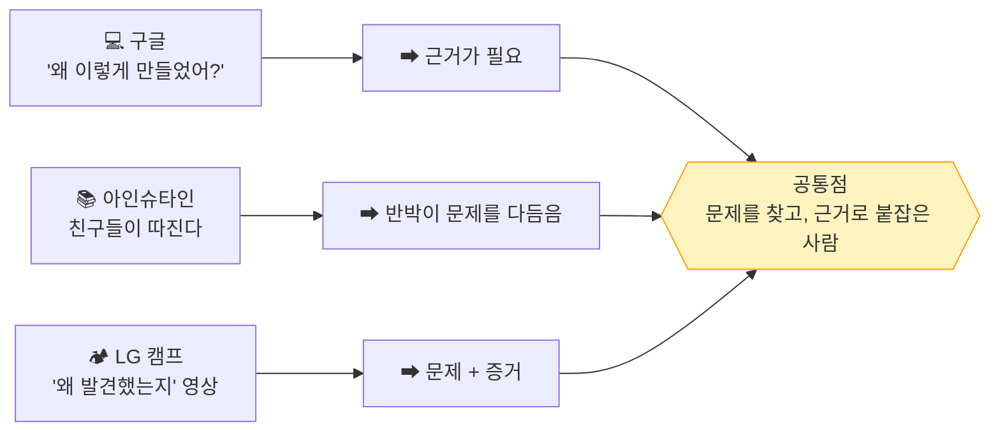

### 이야기 카드 뱅크 — 아이들 반응에 따라 바꿔 끼우기

> 기본 3개(구글·아인슈타인·LG 캠프) 중 **1·2번은 아래 카드로 바꿔도 됩니다.** 3번 LG 캠프는 **고정** — 1년 뒤의 무대이기 때문입니다. 아이들이 스마트폰·게임 이야기에 반응하면 A, 과학·수학에 반응하면 C, 만들기에 반응하면 D를 고릅니다.

| 카드 | 아이들에게 하는 말 (2분) | 끝 질문 | 이어지는 인재상 |
|---|---|---|---|
| **A. 고등학생 CTO** 📎 | "한국의 한 고등학생 형은 AI로 앱을 만들 수 있다는 걸 알고, **3개월 만에** 회사 두 곳의 기술 책임자가 됐어요. 하나는 **스마트폰을 너무 오래 보는 문제**를 푸는 앱이에요. 그런데 이 형도 실패했대요. AI가 짜 준 과학 실험이 망했는데, **그 분야를 몰라서 왜 틀렸는지 못 찾았대요.**" | "AI가 틀린 걸 알아채려면 뭐가 필요할까?" → **직접 알고, 확인하기** | ③ 검증·책임자 |
| **B. 사진 한 장으로 칼로리** 📰 | "미국 10대들이 **음식 사진을 찍으면 칼로리를 알려 주는** 앱을 만들어 큰 회사가 됐어요. 사진을 보고 '이건 밥, 이건 닭고기' 하고 **구분하는 AI**예요. 우리가 **5회차에 웹캠으로 하는 것**과 같은 원리예요." | "우리 주변에서 **사진으로 구분하면** 편해지는 건?" | ② 지휘자 |
| **C. 노벨상과 수학올림피아드** ✅📰 | "단백질 모양을 알아내는 데 과학자들은 몇 년씩 걸렸는데, AI가 **2억 개 넘게** 예측해서 **노벨상**을 받았어요. 작년엔 AI가 **세계 수학올림피아드**에서 금메달 점수도 받았어요. 그럼 사람은 뭘 할까요? AI한테 **'무엇을 알아내 줘'라고 정하는 건** 여전히 사람이에요." | "AI가 다 푼다면 **질문은 누가** 만들까?" | ① 문제 발견자 |
| **D. 11살 발명가** ✅ | "미국의 **11살** 기탄잘리는 뉴스에서 **수돗물에 납이 섞인** 도시 이야기를 보고, 물을 검사하는 장치를 발명해 대회에서 우승했어요. 나중엔 **처음으로 '올해의 어린이'** 로 뽑혔어요. 여러분 **나이**예요." | "뉴스 속 문제를 **우리 동네**로 가져오면?" | ① 문제 발견자, ⑤ 끝까지 |
| **E. 아빠 뱃살 국자** 📎 | "우리나라 학생 발명 대회에서 **대통령상**을 받은 발명품 중에 **기름 걷어 내는 국자**가 있어요. 만든 이유가 '**기름진 국 좋아하는 아빠 뱃살이 걱정돼서**'였대요." | "우리 **가족**이 매일 겪는 불편은?" | ① 문제 발견자 |
| **F. 사람을 다시 부른 회사** 📰 | "어떤 회사는 AI 상담원이 **700명 몫**을 한다고 자랑했어요. 그런데 손님들이 불편해해서 **사람 상담원을 다시** 늘렸대요." | "AI가 **못 하는 건** 뭘까?" | ④ 팀 플레이어, ③ 검증 |

> 표시 ✅ 📰 📎는 A-3-3과 같습니다. 📎 카드는 **"~라고 해요"** 로 말하고, 수치는 가볍게 다룹니다.

---

## B-3. AI 지휘자 게임 · 10~20분 — "그림 카드가 곧 문제다"

> **목표** — 지휘자(사람)에게 가장 필요한 것은 **무엇을 만들지(그림 카드 = 문제)** 이고, 그다음이 **방향 주기**와 **확인하기**라는 것을 몸으로 느낀다.

### 규칙

| 역할 | 누가 | 할 일 |
|---|---|---|
| 🎼 **지휘자** | 1명 (라운드마다 교대) | 교사가 몰래 보여 준 그림을 **말로만** 설명. 손짓 금지 |
| 🤖 **AI** | 나머지 2명 | 들은 말 **그대로만** ②칸에 그림. 질문 금지 (AI는 되묻지 않는다) |

**그림 카드** (교사가 A4를 4등분해 미리 그려 둠 — 선 5~6개짜리 단순 그림)
예: ① 해 + 집 + 나무 ② 웃는 로봇 얼굴 ③ 분리수거통 3개와 화살표

### 3라운드 진행 (각 2분 30초)

| 라운드 | 지휘자 규칙 | 예상 결과 | 교사 한마디 |
|:---:|---|---|---|
| **R0 카드 없이** (30초, 시범) | 교사가 지휘자에게 **카드를 안 주고** "아무거나 설명해 봐" | 지휘자가 머뭇거림 | "**무엇을 그릴지** 모르면 지휘를 시작도 못 하죠? 이게 **문제가 없는 프로젝트**예요." |
| **R1 한 문장** | "**한 문장**만" (예: "집 그려") | 두 AI의 그림이 **완전히 다름** | "방향이 부족하면 AI마다 제멋대로 해요. 이게 **AI 슬롭**이에요." |
| **R2 5문장** | "**무엇을, 어디에, 얼마나 크게**를 넣어 5문장" | 비슷해짐 | "**맥락**을 주니까 가까워졌죠? 이게 **악보**예요." |
| **R3 5문장 + 확인 1번** | 5문장 뒤 두 그림을 **보고** 고칠 점 1개 명령 | 가장 비슷함 | "**보고 → 고치기**. 이게 **검증**이에요." |

### 되돌아보기 (2분)

> **발문** — "R0에서 지휘자는 왜 아무것도 못 했어요?" → **그림 카드(문제)** 가 없어서
> **발문** — "진짜 발명에서는 그림 카드를 **누가 줘요?**" → 아무도 안 준다. **우리가 찾아야 한다.**

| 게임에서 | 개발 현장에서 | 우리 6회차에서 |
|---|---|---|
| **그림 카드** (지휘자만 앎) | **문제** — AI는 모른다 | **1회차 문제 제기문 + 근거** |
| 5문장 설명 | 요구사항·맥락 | 2회차 시나리오 |
| 보고 고치기 | 검증·디버깅 | 4회차 디버깅, AI 답 검토 |

> **정리 멘트** — "게임에선 선생님이 그림 카드를 줬죠. **진짜 세상에선 아무도 안 줘요.** 리딩클루라는 곳에선 이렇게 말해요. **'단서는 책이 주지 않습니다. 당신이 남깁니다.'** 그림 카드는 **우리가 직접 보고 남긴 것**에서 나와요."

---

## B-4. 확신 vs 근거 · 20~32분 — "반박당해도 버티는 문제"

> **목표** — "그런 것 같아(확신)"와 "내가 봤고 셌다(근거)"의 차이를 구분하고, 친구의 반박을 통과해 보는 경험을 한다.

### ① 100명 중 1명 (2분)

판서(또는 A4)에 계단을 그리며 이야기합니다.

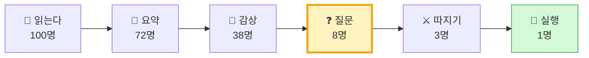

> "책을 100명이 읽으면, 끝까지 뭔가를 **만드는 사람은 1명**뿐이래요. (리딩클루가 보여 주는 그림이에요.) 제일 많이 사라지는 곳이 어디예요? **'재밌었다'에서 '질문'으로 넘어갈 때**예요. 오늘 우리는 그 계단을 넘어 볼 거예요."

### ② 근거 사다리 판정 (4분, A4 ③칸)

판서:

| 0칸 😶 | 1칸 👂 | 2칸 👀 | 3칸 🔢 | 4칸 ⚔️ |
|:---:|:---:|:---:|:---:|:---:|
| 느낌 | 들은 말 | 내가 본 것 | 센 숫자 | 반대 경우도 확인 |

교사가 5문장을 읽으면, ③칸에 번호와 **사다리 칸 숫자(0~4)** 를 적습니다.

| # | 주장 카드 (읽어 주기) | 정답 | 교사 한 줄 |
|:---:|---|:---:|---|
| 1 | "급식 나물은 다들 싫어하는 것 같아." | **0** | "같아"는 **느낌** |
| 2 | "엄마가 그러는데 요즘 애들은 분리수거를 잘 못한대." | **1** | 들은 말 — 엄마도 직접 봤을까? |
| 3 | "어제 우리 반 친구가 우유갑을 일반쓰레기에 버리는 걸 봤어." | **2** | **내가 본 것** — 오늘의 목표선 |
| 4 | "3일 동안 보니까 나물을 그대로 버린 친구가 매일 5명 넘었어." | **3** | **숫자**가 생겼다 |
| 5 | "그중에 배불러서 그런지 물어봤더니, 4명은 '무슨 맛인지 몰라서'래." | **4** | **다른 이유**도 확인했다 → 발명 방향이 보인다 |

> **발문** — "5번까지 가니까 뭐가 보여요?" → "배불러서"가 아니라 "**맛을 몰라서**"라면, 만들 발명품이 달라진다. **근거가 발명품을 정한다.**

### ③ 반박 라운드 (5분)

> "리딩클루에는 이런 말이 있어요. **'혼자 정한 문제는 확신이고, 반박당한 문제만 진짜 문제다.'** 우리도 해 봐요."

**반박 질문 카드** (판서 — 3개 중 하나를 골라 묻기)

| ⚔️ 반박 질문 | 무엇을 확인하나 | 리딩클루 3단계 |
|---|---|---|
| "**그건 너만 그런 거 아니야?**" | 다른 사람도 겪나 | ② 어긋나는 지점 |
| "**몇 번 봤어? 누가?**" | 사다리 몇 칸인가 | ③ 직접 확인 |
| "**다른 이유는 없을까?**" | 숨은 전제 | ① 전제 찾기 |

| 순서 | 할 일 | 시간 |
|:---:|---|:---:|
| 1 | 학생 A가 **요즘 불편했던 일 1개**를 한 문장으로 말한다 | 20초 |
| 2 | 오른쪽 학생 B가 **반박 질문 1개**를 한다 | 10초 |
| 3 | A가 **본 것·센 것**으로 답한다. 못 답하면 ③칸에 "**확인할 것: ○○**"을 적는다 | 40초 |
| 4 | B → C, C → A 순서로 돌아가며 반복 (3바퀴) | — |

> **교사 메모** — 반박은 **공격이 아니라 선물**이라고 먼저 말해 줍니다. 대답을 못 해도 실패가 아닙니다. "**확인할 것**"을 적은 학생에게 가장 크게 칭찬합니다. 그게 **다음 근거**가 되기 때문입니다.

### ④ 정리 (1분)

> "오늘 반박을 받고 '확인할 것'이 생긴 친구 있죠? 그게 바로 **프로젝트의 시작**이에요. **문제를 깊게 하면 프로젝트는 저절로 생겨요.** 만들기는 그다음이에요."

---

## B-5. 역할 · 6회차 지도 · 다짐 · 예고 · 32~40분

### 기획자? 개발자? (2분, 손들기)

> "LG 캠프에서는 **기획자**와 **개발자** 중 역할을 골라요(둘 다도 돼요). 기획자는 **문제와 근거를 찾고 보여 주는 사람**, 개발자는 **그걸 AI와 기계로 만들 수 있게 하는 사람**이에요. 둘 다 **지휘자 팀**이에요."

| 🗂️ 기획자 쪽에 손! | 💻 개발자 쪽에 손! |
|---|---|
| 친구가 불편해하는 걸 잘 알아챈다 | 기계가 어떻게 움직이는지 궁금하다 |
| 물어보고 기록하는 게 재밌다 | 안 되면 될 때까지 바꿔 본다 |

> 3명이 6번 동안 **기록 머리 · 조사 눈 · 그림 손** 역할을 돌아가며 맡는다고 알려 줍니다. (2교시 첫 역할은 2교시에 정함)

### 6회차 지도 (2분)

> "광주의 한 초등학교 5학년 형·누나들은 **질문 하나로 25일 동안** 책·신문을 찾고, 토론하고, 글을 써요. 우리는 **문제 하나로 6번** 동안 발명품까지 만들어요."

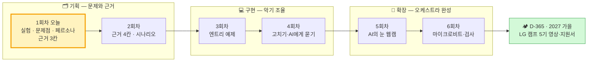

| 회차 | 하는 일 | 근거 사다리 | 내년 LG 지원서에 쓰는 문장 |
|:---:|---|:---:|---|
| 1 | 토론 · 실험 · 문제점 · 페르소나 | 3칸 (센 숫자) | "저는 ○○에서 △△ 문제를 발견했습니다." |
| 2 | 테스트군 19명 결과 + 쓰는 장면(시나리오) | 4칸 | "19명에게 실험해 보니 ○명이 … 그래서 □□한 사람을 위해 설계했습니다." |
| 3~4 | 예제 고치기, AI에게 묻기 | — | "AI에게 이렇게 묻고, 답을 확인해서 고쳤습니다." |
| 5~6 | 웹캠 AI + 마이크로비트, 검사 | 다시 확인 | "엔트리와 마이크로비트로 구현하고, 처음 관찰한 문제가 줄었는지 검사했습니다." |

### 나의 다짐 한 줄 + 1년 뒤 영상 첫 문장 (2분, A4 ④칸)

> **문장 틀 ①** — "나는 AI에게 **답을 받는** 사람이 아니라, **직접 보고 근거를 모아 문제를 찾는** 사람이 되고 싶다. 내가 먼저 살펴볼 곳은 **________** 이다."
>
> **문장 틀 ②** (🔥 D-365) — "**2027년 가을**, 내 LG 캠프 영상은 이렇게 시작한다: '5학년 때 저는 **________** 에서 **________** 을 봤습니다.'"

예: 급식실 / 우리 반 재활용함 / 학원 가는 길 / 우리 집 현관

> **교사 메모** — ②의 빈칸은 오늘 **비워 둬도 됩니다.** 2교시가 끝나면 채울 수 있고, 6회차가 끝나면 **숫자**가 붙습니다. 이 A4 ④칸을 사진으로 남겨 두었다가 **2027년 8월 대본 v1**을 쓸 때 꺼내 보여 주세요 — "1년 전 너는 이렇게 썼어." (A-7-6)

### 2교시 예고 (2분)

> "쉬는 시간 동안 **교실·복도·화장실·신발장**을 한 바퀴 보고 오세요. '어? 이거 좀 불편한데?' 싶은 장면을 **직접 눈으로 보고** 오면 돼요. 그러면 벌써 **근거 사다리 2칸**이에요. 2교시는 **실습 시간!** 학교·집·학원에서 흔한 문제 10가지를 같이 이야기하고, 우리가 **테스트군**이 돼서 **직접 실험**해요. 실험으로 숫자를 세면 **3칸**! 그리고 그 문제를 겪는 **딱 한 사람(페르소나)** 까지 만들어요."

---

## B-6. 교사 준비 체크리스트

| 구분 | 항목 | 확인 |
|---|---|:---:|
| 사전 | PART A 제안서 읽기 — 특히 **A-1 문제와 근거**, **A-2 PD수첩 요약**, **A-3-3 사례 36선 · A-3-6 미래 예측**, A-4 오케스트라 표, **A-7 LG 캠프 D-365 로드맵** | ☐ |
| 사전 | 이야기 3개 스크립트 소리 내어 읽기 (각 2분) + **이야기 카드 뱅크 A~F** 중 예비 카드 2장 고르기 | ☐ |
| 사전 | **A-3-3 사례 36선**에서 학부모 질문 대비용 3개 골라 두기 (✅ 표시 우선) · **A-3-5 반대 신호** 표 한 번 읽기 | ☐ |
| 사전 | 영상 중 1~2개 **미리 시청** (노트북 있으면 30초 구간 표시, 없으면 이야기로) — 추천: `[코딩]-챗지피티로 인해 바뀐 개발자 면접 트렌드`, `[천재]-특허청 직원이 현대 물리학을 창조했다`, `[켐프]-LG AI 청소년 캠프 합격 Tip` | ☐ |
| 사전 | PD수첩 「A.I시대, 기로에 선 수능」 미리 시청 — 들려줄 구간: **02:49~03:29**(1분 30초 vs 1초), **22:17~29:56**(광주 초등학교 융합 탐구), **41:47~42:31**(AI 채점과 사람의 책임) | ☐ |
| 사전 | **그림 카드 3장** — A4를 4등분, 선 5~6개짜리 단순 그림 (학생에게 안 보이게) | ☐ |
| 사전 | LG AI 청소년 캠프 4기 요강(9/14 공개) — 대상 학년·일정 재확인, **역할 기술서 양식 다운로드** (6회차 중 모의 지원서용), A-7-2 표의 5기 예상 일정 갱신 | ☐ |
| 사후 | 학생별 **포트폴리오 폴더** 만들기 — 1교시 A4 ④칸 사진부터 넣기 (A-7-6 로드맵 첫 칸) | ☐ |
| 당일 | A4 학생용 3장 + 여분 3장 + 판서용 3장, 펜 6개 | ☐ |
| 당일 | 판서용 A4 ①: "100명 → 1명" 계단 / ②: **근거 사다리 0~4칸** / ③: **반박 질문 카드 3개** | ☐ |
| 당일 | 타이머 — 게임 라운드 2분 30초, 반박 1인 70초 엄수 | ☐ |

## B-7. 관찰 포인트 (평가 대신 기록)

| 관찰 항목 | 🌱 시작 | 🌿 성장 | 🌳 도약 | 학생 A | 학생 B | 학생 C |
|---|---|---|---|:---:|:---:|:---:|
| AI와 사람의 역할 구분 | O/X만 맞힘 | 이유를 말함 | "질문·확인·책임은 사람" 스스로 표현 | | | |
| 지휘자 게임 | 한 단어 명령 | 위치·크기 포함 설명 | 보고 고칠 점을 **하나만** 골라 명령 | | | |
| 근거 사다리 판정 | 느낌으로 판정 | 칸을 맞힘 | 왜 그 칸인지 설명 | | | |
| 반박에 대한 태도 | 당황·방어 | 본 것으로 답함 | "**확인할 것**"을 스스로 적음 | | | |
| 반박 질문하기 | 질문 못 함 | 카드 그대로 질문 | 친구 말에 맞춘 질문 | | | |
| 다짐 한 줄 | 빈칸 | 일반적 표현 | **살펴볼 장소**까지 구체적 | | | |

> 이 기록은 6회차 마지막 성찰과 **내년 LG 캠프 역할 기술서** 작성 때 "처음엔 이랬어요"의 근거로 다시 씁니다.

---

## 참고 자료

| 종류 | 자료 | 사용 위치 |
|---|---|---|
| 연구 | Peng, Kalliamvakou, Cihon, Demirer (2023), *The Impact of AI on Developer Productivity: Evidence from GitHub Copilot* | A-3 |
| 연구 | METR (2025.7), *Measuring the Impact of Early-2025 AI on Experienced Open-Source Developer Productivity* | A-3, A-6 ④ |
| 연구 | Brynjolfsson, Chandar, Chen (2025.8), *Canaries in the Coal Mine?* Stanford Digital Economy Lab | A-3 |
| 설문 | Stack Overflow Developer Survey 2024 · 2025 | A-3 |
| 보고서 | World Economic Forum, *Future of Jobs Report 2025* | A-3, A-5 |
| 발언 | 구글 CEO 순다르 피차이, 2024년 3분기 실적 발표 (2024.10) | A-3, B-2 |
| 발언 | Andrej Karpathy — "The hottest new programming language is English"(2023), "vibe coding"(2025), "Software 3.0"(2025) | A-3 |
| 연구 | Getzels & Csikszentmihalyi (1976), *The Creative Vision* | A-6 ① |
| 연구 | Wuchty, Jones, Uzzi (2007), *The Increasing Dominance of Teams in Production of Knowledge*, Science | A-6 ③ |
| 사례 | Google re:Work, Project Aristotle | A-6 ③ |
| 연구 | Lucas Education Research (2021), Knowledge in Action(AP) · ML-PBL(초3 과학) | A-6 ② |
| 도서 | Bayles & Orland (1993), *Art & Fear* — 도자기 수업 일화 | A-6 ② |
| 정책 | OECD *Learning Compass 2030*, PISA 2022 Creative Thinking | A-8 |
| 방송 | MBC PD수첩 「A.I시대, 기로에 선 수능」 (2026.9.8) https://www.youtube.com/watch?v=lliYB7pRSg0 — 자동 자막 기준 정리 | A-0, A-2, B-1, B-5 |
| 웹 | 리딩클루(ReadingClue) 메인 페이지 https://www.readingclue.com — 슬로건, 독서 5단계, 비판적 사고 3단계, 문제 카드 5칸, '100명 중 1명' 깔때기(출처 미표기), 6개 명제 | A-1, B-3, B-4 |
| 저장소 | `docs/아이디어/LG_AI_청소년캠프_조사.md` (캠프 홈페이지 원문 기반) · `docs/아이디어/청소년_AI창업_아이디어_사례집.md` | A-7 |
| 저장소 PDF | `pdf/(AI)-LG_AI_Youth_Camp_2026_Blueprint.pdf` — 3기 일정·과정·선배 아이디어·심사위원 조언 (AI 요약 자료, 공식 요강과 차이 있음) | A-3-3, A-7 |
| 저장소 PDF | `pdf/(AI)-10대_창업가의_인공지능_활용법.pdf` — 고등학생 CTO 신주원(렛스고·여치), 도구 조합, 도메인 지식의 한계 | A-3-3, A-3-4, B-2 |
| 저장소 PDF | `pdf/(AI)-The_AI_Orchestrator.pdf` — 코더 → 디렉터, "빼기", 넥슨 넥토리얼 채용 사례 | A-3-2, A-4 |
| 저장소 PDF | `pdf/(AI)-차세대_논서술형_수능_시스템_블루프린트.pdf` — 공정성 vs 타당성, 가오카오·IB·일본 사례, 정책 순서 제언 | A-2-8, A-3-3 |
| 저장소 PDF | `pdf/(AI)-모두의_창업__합격_가이드_로드맵.pdf` — 도전신청서 1장, 데이터 4단계(말·약속·행동·지속) | A-3-3 |
| 사실 | 2024 노벨 화학상(알파폴드)·물리학상(홉필드·힌턴) / 2025 IMO AI 금메달 수준 / 고교학점제(2025)·2028 대입 개편(2023.12 확정) / 기탄잘리 라오(TIME 2020 올해의 어린이) | A-3-3 ✅ |
| 보도 | Y Combinator(2025.3), 마이크로소프트(2025.4), Base44·Wix(2025.6), Lovable(2025.7), Cal AI, 클라르나, 듀오링고, 웨이모, 엔비디아 CES 2025, AI 디지털교과서 지위 변경(2025) | A-3-3 📰 — **인용 전 최신 보도로 수치 재확인** |
| 저장소 | `pdf/` 인포그래픽 — LG AI 캠프 합격 가이드, 10대 창업가의 AI 활용법, 비개발자를 위한 AI 가치 가이드, 창의력을 설계하는 세 가지 혁신 | A-4, A-6 |
| 영상 | `movies/[코딩]-*`, `movies/[AI-시대]-*`, `movies/[천재]-*`, `movies/[켐프]-*`, `movies/[캠프]-*`, `movies/[팀워크]-*` | A-6, B-2 (교사 사전 시청) |
