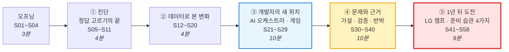

# 1회차 · 1교시 PPT — Gamma 슬라이드 설계서 (58장 · 심화판)

> **원본 수업안** [(1회차-1교시)-AI시대2030_개발자인재상_제안서.md](<(1회차-1교시)-AI시대2030_개발자인재상_제안서.md>) — PART A 데이터·사례 + PART B 활동을 **발표형 슬라이드**로 재구성
> **짝 파일** [(1회차-1교시)-PPT_감마_붙여넣기용.md](<(1회차-1교시)-PPT_감마_붙여넣기용.md>) — 이 설계서의 **🖥️ 화면** 부분만 모아 `---`로 나눈 파일
> **수준** 초5 상위 ~ 중1 눈높이. 아이들을 **"예비 발명가·예비 개발자"** 로 대합니다.
> ① **진짜 용어**를 쓰고 한 줄로 풀이 (근거·가설·검증·페르소나·프로토타입·A/B 테스트) ② **실제 수치와 출처** ③ 한 장에 **하나의 주장 + 그 근거** ④ 말투는 **발표형(~입니다)**, 질문은 **도전형**

---

## 0. 사용 방법

### 0-1. Gamma에 넣는 순서

| 단계 | 할 일 |
|:---:|---|
| 1 | Gamma **새로 만들기 → 텍스트 붙여넣기(Paste in text)** |
| 2 | 짝 파일 **「PPT_감마_붙여넣기용.md」 전체 복사 → 붙여넣기** |
| 3 | 텍스트 처리 **"유지(Preserve)"**, 카드 나누기 **"---" 기준** → 58장 |
| 4 | 테마: **흰 바탕 + 딥 네이비 제목 + 틸(청록)·코럴 포인트** 계열의 **모던·미니멀** 테마 추천 |
| 5 | 카드마다 **📐 레이아웃** 지시대로 Gamma 레이아웃(비교·타임라인·단계·차트·큰 숫자)으로 변경. **📊 표시가 있는 슬라이드는 이미지 대신 Gamma 차트**로 |
| 6 | **🎨 이미지 프롬프트(영문)** 를 Gamma **AI 이미지 생성**에 붙여 넣기 |
| 7 | **🗣️ 발표 멘트**는 발표자 노트로 |

> Gamma 메뉴 이름은 버전에 따라 다를 수 있습니다. 핵심은 **"텍스트 유지 + --- 로 카드 나누기"** 입니다.
> **내용을 고칠 때** — 붙여넣기용 파일은 이 설계서의 `<!--GAMMA-->` ~ `<!--/GAMMA-->` 사이만 뽑아 만든 것입니다. 설계서를 고친 뒤 붙여넣기용도 같이 고쳐 주세요.

### 0-2. 이미지 프롬프트 공통 규칙

| 규칙 | 이유 |
|---|---|
| 모든 프롬프트 끝에 **`modern editorial illustration, clean minimal infographic style, navy teal and coral palette, soft shadows, white background, no text`** | 58장의 톤을 **세련된 인포그래픽**으로 통일 (귀여운 만화체 ❌) |
| 인물은 **`Korean pre-teen students (age 11-12)`** — 진지하게 탐구하는 모습 | "어린아이"가 아니라 **예비 발명가**로 |
| **`no text`** 필수 | AI 그림은 한글·숫자를 깨뜨림 → 글자와 숫자는 **Gamma 텍스트·차트**로 |
| 실제 인물·로고 금지 | 초상권·상표 문제 예방 |
| 📊 **데이터 슬라이드는 그림보다 차트** | 숫자는 정확해야 하므로 Gamma 차트 기능 사용, 그림은 보조 아이콘만 |

### 0-3. 전체 구성 — 58장 / 40분

| 파트 | 슬라이드 | 시간 | 필수 | ⭐선택 |
|---|:---:|:---:|:---:|:---:|
| 오프닝 | S01~S04 | 3분 | 4 | 0 |
| ① 진단 — 정답 고르기의 끝 | S05~S11 | 4분 | 6 | 1 |
| ② 데이터로 본 변화 | S12~S20 | 4분 | 6 | 3 |
| ③ 개발자의 새 위치 — AI 오케스트라 | S21~S29 | 10분 | 9 | 0 |
| ④ 문제와 근거 — 가설·검증·반박 | S30~S40 | 10분 | 10 | 1 |
| ⑤ 1년 뒤 도전 — LG AI 청소년 캠프와 준비 습관 | S41~S58 | 9분 | 13 | 5 |
| **합계** | **58장** | **40분** | **48** | **10** |

> **⭐선택** 슬라이드는 시간·반응에 따라 숨김 처리합니다. **⑤ 파트(LG 캠프 · 준비 습관)** 는 동기를 만드는 파트이므로, 시간이 부족하면 ②·④의 선택 슬라이드부터 줄입니다.
> **동기의 흐름** — S04에서 "1년 뒤의 무대"를 예고하고, 수업 내내 "이게 그 영상의 재료"라고 연결한 뒤, ⑤ 파트에서 **캠프 → 왜 지금부터 → 습관 4가지 → 오늘의 선언**으로 마무리합니다.

### 0-4. 아이들 A4 (1교시 앞면 4칸)

| ① 진단 퀴즈 (S06~S10) | ② 지휘자 게임 (S25~S28) |
|:---:|:---:|
| **③ 근거 사다리 · 반박 메모 (S34~S40)** | **④ 선언 · 습관 · 1년 뒤 첫 문장 (S57)** |

---

# 오프닝 (S01~S04 · 3분)

## S01 · 표지 — ⏱ 0:00 · 필수

<!--GAMMA-->
# 문제를 찾는 사람이 AI를 지휘한다

AI 시대 2030 · 발명 프로젝트 1회차 1교시

> AI는 답을 만듭니다. **어떤 문제를 풀지**는 사람이 정합니다.
<!--/GAMMA-->

- **📐 레이아웃** — 좌측 대형 제목, 우측 이미지 50%
- **🎨 이미지 프롬프트**
  `A Korean pre-teen student standing confidently in front of a large transparent screen, arranging floating panels of data, camera icons and circuit boards like a conductor, several abstract AI agents represented as glowing geometric shapes responding to her gestures, modern editorial illustration, clean minimal infographic style, navy teal and coral palette, soft shadows, white background, no text`
  (요약: 떠 있는 데이터 패널과 AI 도형들을 지휘하듯 배치하는 학생)
- **🗣️ 발표 멘트** — "오늘부터 6회 동안 AI 발명품을 만듭니다. 그런데 오늘은 한 줄도 코딩하지 않습니다. 그 이유가 오늘 수업의 전부입니다."

---

## S02 · 도전 질문 — ⏱ 0:45 · 필수

<!--GAMMA-->
# 질문 하나로 시작합니다

## AI가 수능 문제를 1초에, 코드를 몇 분에 만든다면
## **사람에게 남는 일은 무엇일까요?**

- 30초 동안 생각하고, 한 문장으로 답해 봅니다
<!--/GAMMA-->

- **📐 레이아웃** — 중앙 정렬 대형 질문, 하단 작은 안내문
- **🎨 이미지 프롬프트**
  `A thoughtful Korean pre-teen student sitting at a desk facing a minimalist robot silhouette across the table, a single glowing question mark hovering between them, calm and serious atmosphere, modern editorial illustration, clean minimal infographic style, navy teal and coral palette, soft shadows, white background, no text`
  (요약: 로봇 실루엣과 마주 앉아 생각하는 학생, 사이에 떠 있는 물음표)
- **🗣️ 발표 멘트** — 3명 모두 한 문장씩 듣고 **판서만** 합니다. "이 답을 40분 뒤에 다시 보겠습니다."

---

## S03 · 오늘의 흐름 — ⏱ 1:30 · 필수

<!--GAMMA-->
# 오늘 40분의 흐름

1. **진단** — 정답을 고르는 능력의 가치는 왜 떨어졌나
2. **데이터** — 개발자·채용·과학·입시에서 실제로 일어난 일
3. **새 위치** — 개발자는 왜 'AI 오케스트라의 지휘자'가 되는가 (게임)
4. **문제와 근거** — 가설을 세우고, 검증하고, 반박을 통과시키는 법
5. **2030 인재상** — 1년 뒤 LG AI 청소년 캠프까지의 로드맵
<!--/GAMMA-->

- **📐 레이아웃** — 5단계 가로 프로세스, 3·4단계 강조
- **🎨 이미지 프롬프트**
  `An isometric roadmap with five connected platforms rising step by step, each platform with a simple icon (a stopwatch, a bar chart, a conductor baton, a magnifying glass over a chart, a flag), minimal and professional, modern editorial illustration, clean minimal infographic style, navy teal and coral palette, soft shadows, white background, no text`
  (요약: 5개 단계가 계단식으로 이어진 아이소메트릭 로드맵)
- **🗣️ 발표 멘트** — "3번은 몸으로 하는 게임, 4번이 오늘의 핵심입니다."

---

## S04 · 1년 뒤의 무대 — 예고 — ⏱ 2:15 · 필수

<!--GAMMA-->
# 1년 뒤, 여러분이 설 수 있는 무대가 있습니다

**LG AI 청소년 캠프** — 초6~중2 · 전액 무료 · 서울대학교 → 실리콘밸리

- 성적표도, 수상 경력도 내지 않습니다
- **"내 주변에서 발견한 문제"** 와 **"AI로 푸는 방법"** 을 1~3분 영상으로 보여 줍니다

> 오늘부터 6회 동안 만드는 모든 기록이 **1년 뒤 그 영상의 재료**가 됩니다
<!--/GAMMA-->

- **📐 레이아웃** — 좌측 텍스트, 우측 대형 이미지. "1년 뒤"를 코럴색으로 강조
- **🎨 이미지 프롬프트**
  `An empty stage under a single spotlight with a camera on a tripod waiting at center, a Korean pre-teen student standing at the edge of the audience looking at it with determination, a faint path of footprints leading from the student's desk to the stage, modern editorial illustration, clean minimal infographic style, navy teal and coral palette, soft shadows, white background, no text`
  (요약: 조명 아래 삼각대 카메라가 기다리는 빈 무대를 바라보는 학생, 책상에서 무대로 이어진 발자국)
- **🗣️ 발표 멘트** — "지금 5학년은 4기가 아니라 **5기(2027년 가을 접수 예상)** 부터 지원할 수 있습니다. **정확히 1년 뒤**입니다. 오늘은 그 준비의 첫날입니다. 40분 뒤에 이 캠프 이야기를 자세히 하겠습니다."

---

# ① 진단 — 정답 고르기의 끝 (S05~S11 · 4분)

## S05 · 진단 퀴즈 안내 — ⏱ 3:00 · 필수

<!--GAMMA-->
# 진단 퀴즈 — 직관을 먼저 확인합니다

- 5문항, 문항당 20초
- A4 ①칸에 **O / X**와 **확신도(1~3)** 를 함께 적습니다
- 틀린 문항이 오늘 가장 많이 배우는 지점입니다
<!--/GAMMA-->

- **📐 레이아웃** — 좌측 규칙 3줄, 우측 "O / X / 확신도" 예시 카드
- **🎨 이미지 프롬프트**
  `A clean flat-lay of a sheet of paper divided into four boxes, a pencil, and three small cards marked with a circle, a cross and a gauge meter, top-down view, modern editorial illustration, clean minimal infographic style, navy teal and coral palette, soft shadows, white background, no text`
  (요약: 4칸 종이·연필·O/X/게이지 카드를 위에서 본 구도)
- **🗣️ 발표 멘트** — "확신도는 1(찍음) ~ 3(확실). 확신했는데 틀리면 그게 제일 중요한 발견입니다."

---

## S06 · Q1 · Q2 — ⏱ 3:40 · 필수

<!--GAMMA-->
# Q1. AI는 수능 객관식 한 문제를 1초 안에 풀 수 있다

# Q2. 숙련된 개발자가 AI 도구를 쓰면, 실험에서 **항상 더 빨라졌다**
<!--/GAMMA-->

- **📐 레이아웃** — 문항 카드 2장 상하 배치
- **🎨 이미지 프롬프트**
  `Two minimalist cards: one with a stopwatch next to an answer sheet, the other with a developer at a laptop and a speedometer needle hovering uncertainly, modern editorial illustration, clean minimal infographic style, navy teal and coral palette, soft shadows, white background, no text`
  (요약: 스톱워치+답안지 카드 / 노트북 개발자+흔들리는 속도계 카드)
- **🗣️ 발표 멘트** — Q2는 함정입니다. 확신도를 꼭 적게 합니다.

---

## S07 · Q1 · Q2 해설 — ⏱ 4:20 · 필수 📊

<!--GAMMA-->
# Q1 ⭕ · Q2 ❌ — 빠른 AI, 느려진 전문가

| 항목 | 사람 | AI 활용 |
|---|:---:|:---:|
| 수능 한 문항 (국어·영어 등) | 약 **1분 30초** | 약 **1초** |
| 숙련 개발자 16명의 실제 작업 시간 (METR, 2025) | 기준 | **19% 더 느림** |
| 같은 개발자들의 **체감** | — | "20% 빨라졌다" |

> 빠른 도구 ≠ 빠른 결과. **결과를 확인하는 능력**이 성과를 가릅니다
<!--/GAMMA-->

- **📐 레이아웃** — 📊 좌측 막대그래프(실제 −19% vs 체감 +20%), 우측 표
- **🎨 이미지 프롬프트** (차트 보조 아이콘)
  `A split visual metaphor: a very fast racing robot on one side, and on the other side a developer tangled in long printouts checking lines of code with a magnifying glass, modern editorial illustration, clean minimal infographic style, navy teal and coral palette, soft shadows, white background, no text`
  (요약: 빠른 로봇 vs 코드 출력물 속에서 돋보기로 확인하는 개발자)
- **🗣️ 발표 멘트** — "착각의 크기가 무려 39%p입니다. AI를 쓰는 것보다 **AI를 확인하는 능력**이 더 희귀해졌다는 뜻입니다."

---

## S08 · Q3 · Q4 — ⏱ 5:00 · 필수

<!--GAMMA-->
# Q3. AI는 "우리 반 학생들이 매일 겪는 불편"을 스스로 찾아낼 수 있다

# Q4. "다들 그렇게 느낄 것 같아"는 근거(Evidence)가 될 수 있다
<!--/GAMMA-->

- **📐 레이아웃** — 문항 카드 2장
- **🎨 이미지 프롬프트**
  `A classroom seen through a frosted window with a robot outside unable to see clearly, and a thought bubble filled with fog next to a student, modern editorial illustration, clean minimal infographic style, navy teal and coral palette, soft shadows, white background, no text`
  (요약: 흐린 유리창 밖에서 교실을 못 보는 로봇 + 안개 낀 생각 풍선)
- **🗣️ 발표 멘트** — Q4의 해설은 ④ 파트(S32)에서 공개합니다.

---

## S09 · Q3 해설 — 데이터가 없는 곳 — ⏱ 5:40 · 필수

<!--GAMMA-->
# Q3 ❌ — AI는 '본 적 없는 현장'을 모릅니다

- AI는 **학습한 데이터** 안에서 가장 그럴듯한 답을 냅니다
- 우리 반 급식실, 우리 학교 분리수거함은 **데이터가 없는 현장**입니다
- 그 현장을 **관찰하고 기록하는 사람**만이 문제를 정의할 수 있습니다

> 현장 데이터 = 사람만 가진 **경쟁력**
<!--/GAMMA-->

- **📐 레이아웃** — 좌측 3줄, 우측 "AI가 아는 세계 / 모르는 세계" 원 2개 벤다이어그램
- **🎨 이미지 프롬프트**
  `A large circle of digital data points labeled by icons (books, websites, images) and a separate small circle containing a school cafeteria and a recycling bin, a student standing inside the small circle holding a notebook, modern editorial illustration, clean minimal infographic style, navy teal and coral palette, soft shadows, white background, no text`
  (요약: 거대한 데이터 원과 떨어진 작은 원(급식실·분리수거함) 안의 학생)
- **🗣️ 발표 멘트** — "2교시에 여러분이 할 일이 바로 이 **작은 원의 데이터**를 만드는 것입니다."

---

## S10 · Q5 — 책임은 누구에게 — ⏱ 6:20 · 필수

<!--GAMMA-->
# Q5. AI가 채점하거나 만든 결과가 틀리면, 책임은 AI에게 있다 → ❌

> "채점은 AI가 돕고, **최종 점수 결과는 사람이 책임집니다**." — 수능 AI 채점 검토 관련 발언 (PD수첩, 2026.9)

| AI의 역할 | 사람의 역할 |
|---|---|
| 점수 + **그 이유(근거)** 제시 | 근거를 **검증**하고 **최종 판단** |
<!--/GAMMA-->

- **📐 레이아웃** — 인용문 상단 + 2열 역할 표
- **🎨 이미지 프롬프트**
  `An AI interface displaying a score with a list of reasons, and a human reviewer placing a final stamp of approval after checking, balanced composition, modern editorial illustration, clean minimal infographic style, navy teal and coral palette, soft shadows, white background, no text`
  (요약: 근거 목록을 보여 주는 AI 화면과 최종 도장을 찍는 검토자)
- **🗣️ 발표 멘트** — "AI도 신뢰받으려면 **근거를 보여 줘야** 합니다. 사람도 마찬가지입니다."

---

## S11 · 블룸의 6단계 ⭐선택 — ⏱ 선택 시 · 선택

<!--GAMMA-->
# 객관식이 잴 수 있는 것은 절반입니다

| 블룸의 6단계 | 객관식으로 측정 | 누가 더 잘하나 |
|---|:---:|---|
| 6 **창조** — 새 문제·해결책 만들기 | ❌ | **사람** (문제 발견) |
| 5 **평가** — 근거로 판단하기 | ❌ | 사람 + AI 검증 |
| 4 **분석** — 원인 쪼개기 | 🔺 | 사람 + AI |
| 3 적용 · 2 이해 · 1 기억 | ⭕ | **AI가 이미 빠름** |

> 우리 6회차는 **위쪽 절반**(분석·평가·창조)을 훈련합니다
<!--/GAMMA-->

- **📐 레이아웃** — 피라미드 도식(아래 3단 회색, 위 3단 컬러)
- **🎨 이미지 프롬프트**
  `A six-level pyramid where the bottom three levels are faded gray and the top three levels glow in teal, coral and gold, a student climbing toward the top with a lantern, modern editorial illustration, clean minimal infographic style, navy teal and coral palette, soft shadows, white background, no text`
  (요약: 아래 3단은 흐리고 위 3단이 빛나는 피라미드를 오르는 학생)
- **🗣️ 발표 멘트** — "PD수첩에서 전문가는 객관식이 교육과정의 '**반밖에 못 잰다**'고 말했습니다."

---

# ② 데이터로 본 변화 (S12~S20 · 4분)

> 필수: S12·S13·S14·S17·S19·S20 / ⭐선택: S15·S16·S18 (반응 보고 1~2장)

## S12 · 개발자와 AI, 5년 — ⏱ 7:00 · 필수

<!--GAMMA-->
# 개발자와 AI, 5년의 변화

| 연도 | 사건 |
|:---:|---|
| 2021 | AI 코드 자동완성 등장 |
| 2022 | 누구나 AI에게 코드를 요청 |
| 2023 | AI 도구 사용 그룹, 같은 과제 **55.8% 빨리** 완성 (GitHub 실험) |
| 2024 | 구글 신규 코드의 **25% 이상**을 AI가 생성 |
| 2025 | '바이브 코딩' · 코딩 에이전트 확산 — **AI 여러 개에게 일을 나눠 맡김** |
| 2030 | WEF 전망: 핵심 기술의 **39%** 가 바뀜 |
<!--/GAMMA-->

- **📐 레이아웃** — 가로 타임라인 6포인트
- **🎨 이미지 프롬프트**
  `A horizontal timeline with six milestone nodes evolving from a single keyboard, to a chat window, to a speed gauge, to a pie chart, to multiple small AI agent icons working in parallel, to a futuristic city skyline, modern editorial illustration, clean minimal infographic style, navy teal and coral palette, soft shadows, white background, no text`
  (요약: 키보드 → 채팅창 → 속도계 → 원그래프 → 여러 AI 에이전트 → 미래 도시)
- **🗣️ 발표 멘트** — "5년 만에 '도구'가 '팀원'이 됐습니다."

---

## S13 · 수치로 본 개발 현장 — ⏱ 7:40 · 필수 📊

<!--GAMMA-->
# 수치로 본 개발 현장

| 지표 | 수치 | 출처 |
|---|:---:|---|
| 개발자 AI 도구 사용·계획 | **76% → 84%** | Stack Overflow 설문 2024→2025 |
| AI 답을 **신뢰하지 않는** 개발자 | 신뢰보다 **많음** | Stack Overflow 2025 |
| 22~25세 개발자 고용 (2022년 말 대비) | **약 −20%** | Stanford 디지털경제연구소, 2025 |
| 경력 개발자 고용 | 유지·증가 | 같은 연구 |

> 쓰는 것은 기본, **믿지 않고 확인하는 사람**이 남습니다
<!--/GAMMA-->

- **📐 레이아웃** — 📊 좌측 막대(76→84), 우측 하락 선그래프(초년생 −20%) + 표
- **🎨 이미지 프롬프트** (보조)
  `A minimal dashboard with abstract bar and line charts, one line trending down for junior roles and one flat line for senior roles, a magnifying glass resting on the dashboard, modern editorial illustration, clean minimal infographic style, navy teal and coral palette, soft shadows, white background, no text`
  (요약: 초급은 하락, 경력은 유지되는 추상 대시보드와 돋보기)
- **🗣️ 발표 멘트** — "코드만 치는 초급 일자리가 먼저 줄고, **판단하는 사람**은 남습니다."

---

## S14 · 채용이 묻는 질문이 바뀌었다 — ⏱ 8:20 · 필수

<!--GAMMA-->
# 채용이 묻는 질문이 바뀌었습니다

| 예전 | 지금 |
|---|---|
| 코딩테스트 점수 | **며칠 안에 만들어 오는 실무 미션** |
| "이 알고리즘 외웠나?" | "**왜 이렇게 설계했나? AI 결과를 어떻게 확인했나?**" |
| 공채 · 스펙 | 직무별 수시 채용 · **포트폴리오** |

> 넥슨 신입 과정: "코딩테스트 성적과 실무 평가 사이의 **상관관계를 찾지 못했다**"
<!--/GAMMA-->

- **📐 레이아웃** — Before/After 2열 + 하단 인용
- **🎨 이미지 프롬프트**
  `A job interview scene where a candidate presents a small working prototype and a project journal instead of a test score sheet, interviewers leaning in with interest, modern editorial illustration, clean minimal infographic style, navy teal and coral palette, soft shadows, white background, no text`
  (요약: 점수표 대신 시제품과 프로젝트 기록을 보여 주는 면접)
- **🗣️ 발표 멘트** — "'왜?'에 답하려면 **직접 완주한 프로젝트**가 있어야 합니다."

---

## S15 · 만드는 방법 — 말로 만든다 ⭐선택 — ⏱ 선택 시 · 선택

<!--GAMMA-->
# 만드는 방법의 변화 — 설명이 곧 코드

- **바이브 코딩(Vibe Coding)** — 자연어로 설명하면 AI가 코드를 작성 (2025년 콜린스 사전 올해의 단어)
- Y Combinator 한 기수 스타트업의 **약 25%가 코드의 95%를 AI로** 작성 (2025)
- 1인 창업자가 만든 서비스가 **약 6개월 만에 인수**된 사례 (2025)

> 차별점은 코딩 문법이 아니라 **"무엇을, 왜"를 정확히 설명하는 힘**
<!--/GAMMA-->

- **📐 레이아웃** — 3개 사실 카드 + 하단 결론 배너
- **🎨 이미지 프롬프트**
  `A person speaking a sentence that transforms into flowing lines of code and then into a finished app interface on a tablet, one continuous elegant flow from voice to product, modern editorial illustration, clean minimal infographic style, navy teal and coral palette, soft shadows, white background, no text`
  (요약: 말 → 코드 → 앱으로 이어지는 흐름)
- **🗣️ 발표 멘트** — "만드는 비용이 0에 가까워지면, **무엇을 만들지**의 가치가 올라갑니다."

---

## S16 · 한국 10대 CTO — 속도와 한계 ⭐선택 — ⏱ 선택 시 · 선택

<!--GAMMA-->
# 한국 고등학생, 3개월 만에 스타트업 CTO

| 성공 | 한계 |
|---|---|
| AI 도구 4~5개를 **조합**해 서비스 개발 | AI가 설계한 과학 실험이 **실패** |
| 스크린타임 챌린지 앱 — 투자 유치 | 해당 분야 지식이 없어 **원인을 찾지 못함** |
| AI와의 대화 기록(맥락)을 팀과 공유 | "AI가 만든 문제를 AI로 풀어야 하는 역설" |

> **도메인 지식 = 검증의 눈**
<!--/GAMMA-->

- **📐 레이아웃** — 좌 초록 / 우 코럴 2열 비교
- **🎨 이미지 프롬프트**
  `A teenage developer surrounded by several floating AI tool windows successfully launching an app, contrasted with the same teenager in a lab looking puzzled at a failed chemistry experiment, two-panel composition, modern editorial illustration, clean minimal infographic style, navy teal and coral palette, soft shadows, white background, no text`
  (요약: AI 도구로 앱 출시 성공 / 실험실에서 실패 원인을 못 찾는 모습)
- **🗣️ 발표 멘트** — 출처는 영상과 요약 자료 기준입니다. "속도의 대가는 **깊이**입니다."

---

## S17 · 과학의 변화 — ⏱ 9:00 · 필수

<!--GAMMA-->
# AI가 풀면, 사람은 무엇을 하나

- **2024 노벨 화학상** — 단백질 구조 예측 AI. 알려진 단백질 **2억 개 이상**의 구조 예측
- **2024 노벨 물리학상** — 인공신경망의 기초 연구
- **2025 국제수학올림피아드** — AI가 **금메달 수준** 점수

> 문제를 **푸는** 능력은 AI가 따라왔습니다.
> 남는 것은 **무엇을 물을지 정하는 능력** — 문제 발견(Problem Finding)
<!--/GAMMA-->

- **📐 레이아웃** — 3개 메달 아이콘 카드 + 결론 박스
- **🎨 이미지 프롬프트**
  `An elegant 3D protein ribbon structure glowing beside a gold medal and a chalkboard of geometric proofs, a student in the foreground writing a new question in a notebook, modern editorial illustration, clean minimal infographic style, navy teal and coral palette, soft shadows, white background, no text`
  (요약: 단백질 리본 구조·금메달·증명 칠판 앞에서 새 질문을 적는 학생)
- **🗣️ 발표 멘트** — "노벨상 연구에서도 '**무엇을 알아낼지**'는 사람이 정했습니다."

---

## S18 · 이미지 인식은 이미 10대의 도구 ⭐선택 — ⏱ 선택 시 · 선택

<!--GAMMA-->
# 이미지 인식 AI는 이미 10대의 도구입니다

| 사례 | 입력 | AI 판단 | 출력 |
|---|---|---|---|
| 미국 10대의 칼로리 앱 | 음식 사진 | 음식 종류 구분 | 칼로리 표시 |
| LG 캠프 선배 — 벌레 물린 자국 분석기 | 피부 사진 | 곤충 종류 추정 | 응급 대처법 |
| **우리 5회차** | **웹캠 영상** | **클래스 구분** | **마이크로비트 LED·소리** |

> 구조는 모두 같습니다: **입력 → 판단 → 출력**
<!--/GAMMA-->

- **📐 레이아웃** — 표 + 하단 3단 블록 도식(입력 → 판단 → 출력)
- **🎨 이미지 프롬프트**
  `Three horizontal pipeline diagrams stacked vertically, each showing a camera icon feeding into a neural network node and ending in an output device (a phone screen, a first-aid icon, a small LED board), minimal and technical, modern editorial illustration, clean minimal infographic style, navy teal and coral palette, soft shadows, white background, no text`
  (요약: 카메라 → 신경망 → 출력 장치로 이어지는 파이프라인 3줄)
- **🗣️ 발표 멘트** — "이 구조를 이해하면 **입력이나 출력만 바꿔서** 새 발명품을 만들 수 있습니다."

---

## S19 · 입시도 바뀌고 있다 — ⏱ 9:40 · 필수

<!--GAMMA-->
# 입시: '정답 고르기'에서 '근거로 쓰기'로

| 제도 | 내용 | 상태 |
|---|---|:---:|
| 고교학점제 | 고등학생이 과목을 **선택** | 🟢 2025 시행 |
| 2028 대입 | 내신 **5등급제**, 수능 통합형 | 🟢 확정 |
| 서울대 2028 | 정시(수능 위주) 인원 **대폭 축소** | 🟢 발표 |
| 수능 논·서술형 | 2026.10 시안 → 2027.3 최종안, 빠르면 2033학년도 | 🔴 **검토 중** |

| 해외 시험 | 요구 |
|---|---|
| 영국 A레벨 | "**사료와 배경 지식을 근거로** 주장을 논리적으로 설명하라" |
| 독일 아비투어 | 자료 요약 → **논거 분석** → 입장 비교·평가 |
<!--/GAMMA-->

- **📐 레이아웃** — 상단 상태 표(🟢🔴 배지), 하단 해외 비교 표
- **🎨 이미지 프롬프트**
  `A multiple-choice answer sheet gradually morphing into an essay page surrounded by small evidence cards (a chart, a document, a photograph), with subtle flags of different countries in the background, modern editorial illustration, clean minimal infographic style, navy teal and coral palette, soft shadows, white background, no text`
  (요약: OMR 답안지가 근거 카드에 둘러싸인 논술 답안지로 변하는 모습)
- **🗣️ 발표 멘트** — "🔴는 아직 확정이 아닙니다. 그러나 🟢만 봐도 방향은 같습니다 — **과정과 근거**."

---

## S20 · 신호에서 미래로 — ⏱ 10:20 · 필수

<!--GAMMA-->
# 신호에서 미래로 — 확실한 쪽에 겁니다

| | 🟢 거의 확실 | 🟡 가능성 높음 | 🔴 불확실 |
|---|---|---|---|
| 개발 | 개발자 = **지휘·검증** | 코딩 에이전트가 팀원 | 어떤 도구가 살아남을지 |
| 입시 | 고교학점제 · 2028 체제 | 과정 기록 비중 ↑ | 논·서술형 수능 시기 |
| 캠프 | LG 캠프는 영상 + 역할 기술서 | 비슷한 AI 아이디어 급증 | 5기 정확한 일정 |

> 🟢만 모아도 결론은 하나: **문제를 찾고, 근거를 대고, 끝까지 만들어 본 경험**
<!--/GAMMA-->

- **📐 레이아웃** — 3색 매트릭스 표, 🟢 열 강조
- **🎨 이미지 프롬프트**
  `A three-column forecast board with green, amber and red signal lights at the top, a student placing a chip confidently on the green column, strategic board-game mood, modern editorial illustration, clean minimal infographic style, navy teal and coral palette, soft shadows, white background, no text`
  (요약: 초록·주황·빨강 신호등 3열 예측판에서 초록에 칩을 거는 학생)
- **🗣️ 발표 멘트** — "'10년 뒤 **변하지 않을 것**에 걸어라' — 사람은 불편하고, 근거를 원하고, 큰일은 함께 합니다."

---

# ③ 개발자의 새 위치 — AI 오케스트라 (S21~S29 · 10분)

## S21 · 타자수에서 지휘자로 — ⏱ 11:00 · 필수

<!--GAMMA-->
# 개발자의 위치 이동: 타자수 → 지휘자

| | ~2020 | 2025 | 2030 (전망) |
|---|---|---|---|
| 주 업무 | 코드 **직접 작성** | AI 코드 **검토·수정** | AI 에이전트 여러 개 **지휘** |
| 핵심 질문 | "어떻게 짜지?" | "이 코드 맞나?" | "**무엇을, 누구를 위해, 왜?**" |
| 평가 | 코딩테스트 | 설계·설명 면접 | **완주한 프로젝트 기록** |
| 약하면 | 코드를 못 짬 | AI 오류를 못 잡음 | 방향을 못 줌 → **AI 슬롭** |
<!--/GAMMA-->

- **📐 레이아웃** — 3열 진화 표(좌→우 색이 진해짐)
- **🎨 이미지 프롬프트**
  `Three stages of a developer shown left to right: typing alone at a keyboard, reviewing AI-generated code on two monitors, and standing as a conductor directing a circle of small AI agent icons, a gradient arrow beneath them, modern editorial illustration, clean minimal infographic style, navy teal and coral palette, soft shadows, white background, no text`
  (요약: 타이핑 → 코드 검토 → 에이전트 지휘로 진화하는 개발자 3단계)
- **🗣️ 발표 멘트** — "**AI 슬롭(Slop)** — 많이 만들었지만 쓸모가 남지 않는 결과물. 방향이 없을 때 생깁니다."

---

## S22 · AI 오케스트라 구조 — ⏱ 12:07 · 필수

<!--GAMMA-->
# AI 오케스트라 — 역할 구조

| 오케스트라 | 개발 현장 | 우리 6회차 |
|---|---|---|
| **지휘자** | 기획자·개발자 — 문제 정의, 방향, 검증, 책임 | 우리 3명 |
| **악보** | 요구사항·사용자 시나리오 | 1·2회차 |
| **연주자** | 대화형 AI · 이미지 인식 AI · 코딩 도구 · 하드웨어 | 4·5·3·6회차 |
| **틀린 음 잡기** | 코드 리뷰 · 테스트 · 디버깅 | 4·6회차 |
| **청중** | 실제 사용자 (페르소나) | 2교시 |
<!--/GAMMA-->

- **📐 레이아웃** — 중앙 지휘자 + 방사형 4 연주자 도식, 하단 표
- **🎨 이미지 프롬프트**
  `A central conductor figure on a podium surrounded in a semicircle by four sleek AI agents, each represented by a distinct device (a chat interface, a camera lens, a block-code panel, a small LED microcontroller board), an audience silhouette in front, modern editorial illustration, clean minimal infographic style, navy teal and coral palette, soft shadows, white background, no text`
  (요약: 지휘자를 둘러싼 대화·카메라·블록코딩·LED 보드 에이전트와 청중)
- **🗣️ 발표 멘트** — "지휘자는 악기를 가장 잘 다루는 사람이 아니라, **곡 전체를 이해하고 방향을 정하는 사람**입니다."

---

## S23 · 기획자와 개발자 — ⏱ 13:13 · 필수

<!--GAMMA-->
# 기획자와 개발자 — 둘 다 지휘자 팀

| 🗂️ 기획자 (Planner) | 💻 개발자 (Developer) |
|---|---|
| 문제 사전조사 · 인터뷰 | 활용 가능한 기술 조사 |
| 해결 방안 구체화 · 시각화 | 구현 가능성 검토 |
| **AI 학습용 데이터 수집** | **AI 알고리즘 선택** |
| 기록 · 발표 준비 | 1차 프로토타입 → 개선 2차 → 완성 |

> LG AI 청소년 캠프가 정의한 역할 (요강 원문 정리) · **중복 선택 가능**
<!--/GAMMA-->

- **📐 레이아웃** — 2열 역할 카드
- **🎨 이미지 프롬프트**
  `Two professionals-in-training side by side: a student with interview notes, sticky flowcharts and a camera for collecting data, and a student with a laptop, a microcontroller board and a prototype device, connected by a shared blueprint, modern editorial illustration, clean minimal infographic style, navy teal and coral palette, soft shadows, white background, no text`
  (요약: 인터뷰·플로차트·카메라를 든 기획자 / 노트북·보드·시제품을 든 개발자, 공유 설계도)
- **🗣️ 발표 멘트** — "**프로토타입(Prototype)** — 아이디어를 확인하기 위해 먼저 만들어 보는 시험 제품입니다."

---

## S24 · 지휘자 게임 규칙 — ⏱ 14:20 · 필수

<!--GAMMA-->
# 실습: AI 지휘자 게임

| 역할 | 인원 | 규칙 |
|---|:---:|---|
| 🎼 지휘자 | 1 | 비공개 그림을 **언어로만** 전달 (제스처 금지) |
| 🤖 AI | 2 | 들은 내용 **그대로만** 실행 (질문 금지 — AI는 되묻지 않음) |

- 라운드마다 지휘자 교대 · 라운드당 2분 30초
- 목표: **두 AI의 결과물이 원본과 얼마나 일치하는가**
<!--/GAMMA-->

- **📐 레이아웃** — 역할 카드 2장 + 목표 배너
- **🎨 이미지 프롬프트**
  `A student with hands clasped behind the back giving verbal instructions, two students with simple visor headsets drawing on paper, a hidden reference card face-down on the table, focused game atmosphere, modern editorial illustration, clean minimal infographic style, navy teal and coral palette, soft shadows, white background, no text`
  (요약: 뒷짐 지고 지시하는 학생, 헤드셋 쓰고 그리는 두 학생, 엎어 둔 카드)
- **🗣️ 발표 멘트** — "이 게임은 **프롬프트 설계**와 **검증**을 몸으로 익히는 실험입니다."

---

## S25 · R0 · R1 — ⏱ 15:27 · 필수

<!--GAMMA-->
# R0 목표 없음 · R1 한 문장 지시

| 라운드 | 조건 | 관찰 결과 |
|---|---|---|
| R0 (30초) | 그림 카드 **없이** 지휘 | 지휘 **시작 불가** → 문제가 없는 프로젝트 |
| R1 | **한 문장**만 ("집을 그려") | 두 AI의 결과 **완전히 다름** → AI 슬롭 |

> 방향(목표)과 맥락이 없으면, 성능 좋은 AI도 **제멋대로** 만듭니다
<!--/GAMMA-->

- **📐 레이아웃** — 2행 표 + 우측 결과 비교 이미지
- **🎨 이미지 프롬프트**
  `Two drawings produced from the same one-line instruction shown side by side, one a minimal cabin and the other an elaborate castle, a blank card lying beside them, modern editorial illustration, clean minimal infographic style, navy teal and coral palette, soft shadows, white background, no text`
  (요약: 한 문장 지시로 나온 오두막 vs 성, 옆에 빈 카드)
- **🗣️ 발표 멘트** — "R0에서 멈춘 이유는 **목표(문제)** 가 없어서입니다."

---

## S26 · R2 맥락 있는 지시 — ⏱ 16:33 · 필수

<!--GAMMA-->
# R2 — 맥락 있는 지시 (5문장)

지시에 반드시 넣을 요소: **대상 · 위치 · 크기 · 순서 · 기준**

> 예) "종이 **가운데**에 **가로로 긴** 네모를 그린다. 그 **위에** 네모 폭과 같은 세모 지붕을 얹는다. **오른쪽 위 모서리**에 작은 원을 그린다…"

→ 결과물이 **수렴**합니다 = 요구사항(Requirements)의 힘
<!--/GAMMA-->

- **📐 레이아웃** — 좌측 5요소 체크리스트, 우측 두 결과 겹쳐 보기
- **🎨 이미지 프롬프트**
  `Two nearly identical house drawings overlaid with a translucent alignment grid, a five-item checklist beside them with checkmarks, precise and technical mood, modern editorial illustration, clean minimal infographic style, navy teal and coral palette, soft shadows, white background, no text`
  (요약: 정렬 격자 위에 거의 겹치는 두 그림 + 5항목 체크리스트)
- **🗣️ 발표 멘트** — "이 5문장이 2회차에 쓸 **사용자 시나리오**의 원형입니다."

---

## S27 · R3 검증 루프 — ⏱ 17:40 · 필수

<!--GAMMA-->
# R3 — 지시 → 확인 → 수정 1회 (검증 루프)

1. 5문장으로 지시
2. 두 결과물을 **원본과 비교**
3. 가장 큰 차이 **하나만** 수정 지시

> **한 번에 하나만** 바꿔야 무엇 때문에 좋아졌는지 알 수 있습니다 = 디버깅의 원칙
<!--/GAMMA-->

- **📐 레이아웃** — 3단 순환 루프 도식
- **🎨 이미지 프롬프트**
  `A circular loop diagram with three stations: an instruction speech bubble, a side-by-side comparison magnifier, and a single precise adjustment arrow moving one element, clean feedback loop, modern editorial illustration, clean minimal infographic style, navy teal and coral palette, soft shadows, white background, no text`
  (요약: 지시 → 비교 → 한 가지 수정의 피드백 루프)
- **🗣️ 발표 멘트** — "개발자가 AI 코드를 확인하는 방식과 **완전히 같습니다**."

---

## S28 · 게임 결과 분석 — ⏱ 18:47 · 필수 📊

<!--GAMMA-->
# 결과 분석 — 일치도는 어떻게 변했나

| 라운드 | 조건 | 원본과 일치 (0~5점) |
|:---:|---|:---:|
| R1 | 한 문장 | __ 점 |
| R2 | 맥락 5문장 | __ 점 |
| R3 | 5문장 + 검증 1회 | __ 점 |

**질문** — 점수를 가장 크게 올린 요인은 무엇이었나?
<!--/GAMMA-->

- **📐 레이아웃** — 📊 빈 막대그래프(현장에서 점수 기입) + 표
- **🎨 이미지 프롬프트** (보조)
  `Three ascending bars made of stacked paper sheets, each bar topped with a progressively more accurate house drawing, clean data visualization style, modern editorial illustration, clean minimal infographic style, navy teal and coral palette, soft shadows, white background, no text`
  (요약: 점점 정확해지는 그림이 올라간 종이 막대 3개)
- **🗣️ 발표 멘트** — 교사가 5점 기준(모양·위치·크기·개수·순서)으로 즉석 채점해 기입합니다.

---

## S29 · 게임이 가르쳐 준 것 — ⏱ 19:53 · 필수

<!--GAMMA-->
# 게임 → 개발 현장 → 우리 6회차

| 게임 | 개발 현장 | 6회차 |
|---|---|:---:|
| 그림 카드 | **문제 정의** — AI는 모른다 | 1회차 |
| 5문장 지시 | **요구사항 · 시나리오** | 2회차 |
| 비교 후 1개 수정 | **검증 · 디버깅** | 4·6회차 |
| 두 AI의 다른 결과 | 모델마다 다른 답 → **사람의 판단** | 5회차 |

> 진짜 세계에는 **그림 카드를 주는 사람이 없습니다.** 문제는 직접 찾아야 합니다
<!--/GAMMA-->

- **📐 레이아웃** — 3열 매핑 표 + 결론 배너
- **🎨 이미지 프롬프트**
  `A glowing reference card floating above a city of everyday scenes (a school cafeteria, a recycling area, a bus stop), no hand offering it, a student reaching up to grasp it independently, modern editorial illustration, clean minimal infographic style, navy teal and coral palette, soft shadows, white background, no text`
  (요약: 일상 풍경 위에 떠 있는 카드를 스스로 잡으려는 학생)
- **🗣️ 발표 멘트** — "리딩클루: **'단서는 책이 주지 않습니다. 당신이 남깁니다.'**"

---

# ④ 문제와 근거 — 가설·검증·반박 (S30~S40 · 10분)

## S30 · 왜 대부분 멈추나 — ⏱ 21:00 · 필수 📊

<!--GAMMA-->
# 100명이 읽으면, 실행은 1명

| 단계 | 읽기 | 요약 | 감상 | **질문** | 토론·반박 | 실행 |
|---|:---:|:---:|:---:|:---:|:---:|:---:|
| 남는 사람 | 100 | 72 | 38 | **8** | 3 | **1** |

> 가장 크게 끊기는 구간: **감상 → 질문** (38 → 8)
> 느낌을 **질문 한 문장**으로 바꾸는 순간이 프로젝트의 입구입니다
<!--/GAMMA-->

- **📐 레이아웃** — 📊 퍼널(깔때기) 차트, "질문 8" 강조
- **🎨 이미지 프롬프트** (보조)
  `A sleek funnel diagram narrowing sharply at the middle, a glowing question mark positioned at the narrowest point, one small rocket emerging from the bottom, modern editorial illustration, clean minimal infographic style, navy teal and coral palette, soft shadows, white background, no text`
  (요약: 가운데서 급격히 좁아지는 깔때기, 좁은 곳의 물음표, 바닥의 로켓)
- **🗣️ 발표 멘트** — "리딩클루가 제시한 설명용 그림입니다(조사 출처 미표기). **경향**으로 봐 주세요."

---

## S31 · 핵심 용어 — ⏱ 22:00 · 필수

<!--GAMMA-->
# 오늘부터 쓰는 4개의 용어

| 용어 | 뜻 | 예 |
|---|---|---|
| **문제 정의** (Problem Definition) | 누가·언제·왜 불편한지 한 문장으로 | "2학년은 처음 보는 반찬을 받으면 버린다" |
| **가설** (Hypothesis) | 아직 확인 안 된 **원인에 대한 추측** | "맛을 몰라서 버릴 것이다" |
| **근거** (Evidence) | 주장을 믿게 만드는 **관찰·숫자·자료** | "3일간 매일 5명 이상" |
| **검증** (Verification) | 가설이 맞는지 **직접 확인** | 5명 인터뷰, A/B 테스트 |
<!--/GAMMA-->

- **📐 레이아웃** — 4행 용어 카드(아이콘 + 정의 + 예)
- **🎨 이미지 프롬프트**
  `Four minimalist icon tiles in a row: a target with a crosshair, a lightbulb with a question mark, a clipboard with tally marks, and a magnifying glass over a checkmark, modern editorial illustration, clean minimal infographic style, navy teal and coral palette, soft shadows, white background, no text`
  (요약: 과녁 · 물음표 전구 · 체크표 클립보드 · 체크 위 돋보기 아이콘 4개)
- **🗣️ 발표 멘트** — "이 네 단어를 쓸 수 있으면 **중학생 과학 탐구 보고서** 수준입니다."

---

## S32 · 확신 vs 근거 — ⏱ 23:00 · 필수

<!--GAMMA-->
# 확신(Belief)과 근거(Evidence)는 다릅니다

| 확신 | 근거 |
|---|---|
| "그런 것 같아" | "어제 급식 시간에 **직접 봤다**" |
| "다들 그렇대" | "4명 중 **3명**이 그랬다" |
| 말하는 사람만 믿는다 | **다른 사람도** 확인할 수 있다 |

> **Q4 해설** — "다들 그렇게 느낄 것 같아"는 근거가 아닙니다 ❌
<!--/GAMMA-->

- **📐 레이아웃** — 좌우 대비(좌: 흐림 처리 / 우: 선명)
- **🎨 이미지 프롬프트**
  `A split composition: on the left a blurry, foggy speech bubble, on the right a crisp clipboard with tally marks, a timestamp and a small photo, a clear dividing line between them, modern editorial illustration, clean minimal infographic style, navy teal and coral palette, soft shadows, white background, no text`
  (요약: 흐릿한 말풍선 vs 체크표·시각·사진이 붙은 선명한 클립보드)
- **🗣️ 발표 멘트** — "근거의 조건은 하나 — **다른 사람도 같은 방법으로 확인할 수 있는가.**"

---

## S33 · 근거 사다리 — ⏱ 24:00 · 필수

<!--GAMMA-->
# 근거 사다리 — 근거의 강도 5단계

| 단계 | 유형 | 예 |
|:---:|---|---|
| **4** | **반박 통과** — 반대 경우까지 확인 | "배불러서라는 가설도 확인했지만 1명뿐" |
| **3** | **정량 데이터** — 센 숫자 | "3일 동안 매일 5명 이상" |
| **2** | **직접 관찰** | "어제 내가 봤다" |
| **1** | 전해 들은 말 | "누가 그러던데" |
| **0** | 느낌 | "그런 것 같아" |

> 오늘 목표선: **3단계** (2교시 실험) · 2회차 목표선: **4단계**
<!--/GAMMA-->

- **📐 레이아웃** — 세로 사다리/막대 도식(아래 연함 → 위 진함)
- **🎨 이미지 프롬프트**
  `A vertical five-step ladder rendered as stacked translucent blocks increasing in color intensity from pale gray at the bottom to deep teal at the top, small icons beside each step (cloud, ear, eye, bar chart, shield), a student climbing mid-way, modern editorial illustration, clean minimal infographic style, navy teal and coral palette, soft shadows, white background, no text`
  (요약: 아래서 위로 색이 진해지는 5단 블록 사다리와 오르는 학생)
- **🗣️ 발표 멘트** — "창업 심사에서도 같은 구조를 씁니다. 다음 장에서 보겠습니다."

---

## S34 · 근거 판정 실습 — ⏱ 25:00 · 필수

<!--GAMMA-->
# 실습: 근거 강도 판정 (A4 ③칸에 0~4)

1. "급식 나물은 다들 싫어하는 것 같아."
2. "엄마가 그러는데 요즘 애들은 분리수거를 잘 못한대."
3. "어제 우리 반 친구가 우유갑을 일반쓰레기에 넣는 걸 봤어."
4. "3일 동안 세어 보니 나물을 그대로 버린 학생이 매일 5명 이상이었어."
5. "그중 5명에게 물었더니 4명이 '맛을 몰라서', 1명이 '배불러서'였어."

**정답** — 0 · 1 · 2 · 3 · 4
<!--/GAMMA-->

- **📐 레이아웃** — 번호 목록 + 하단 정답(클릭 시 등장 애니메이션 권장)
- **🎨 이미지 프롬프트**
  `Five horizontal statement cards arranged from faint to bold, each with a small evidence icon, beside a school cafeteria tray and a recycling bin in soft focus, modern editorial illustration, clean minimal infographic style, navy teal and coral palette, soft shadows, white background, no text`
  (요약: 흐림 → 선명으로 배열된 진술 카드 5장, 뒤에 급식판·분리수거함)
- **🗣️ 발표 멘트** — 정답은 Gamma에서 **나중에 나타나기** 효과로 가립니다.

---

## S35 · 창업 심사의 근거 4단계 ⭐선택 — ⏱ 선택 시 · 선택 📊

<!--GAMMA-->
# 창업 심사도 같은 사다리를 씁니다

| 단계 | 데이터 | 예 | 신뢰도 |
|:---:|---|---|:---:|
| 1 | **말** | "쓰겠다" 80% | 낮음 |
| 2 | **약속** | 사전 신청 200명 | ↑ |
| 3 | **행동** | 10명 중 5명이 실제 사용 | ↑↑ |
| 4 | **지속** | 3명이 3주 동안 매일 사용 | **최고** |

> "쓸래?"보다 **"썼어?"** 가 강한 근거입니다 — 정부 창업 지원 사업 합격 가이드
<!--/GAMMA-->

- **📐 레이아웃** — 📊 계단형 막대(1→4 상승) + 표
- **🎨 이미지 프롬프트** (보조)
  `Four ascending steps labeled only by icons: a speech bubble, a signed pledge card, a hand pressing a button, and a calendar with repeated check marks, modern editorial illustration, clean minimal infographic style, navy teal and coral palette, soft shadows, white background, no text`
  (요약: 말풍선 → 서약 카드 → 버튼 누르는 손 → 체크가 반복된 달력)
- **🗣️ 발표 멘트** — "설문 '쓰겠다'는 가장 약한 근거입니다. **행동 데이터**가 가장 강합니다."

---

## S36 · 비판적 사고 3단계 — ⏱ 26:00 · 필수

<!--GAMMA-->
# 근거를 만드는 비판적 사고 3단계

| 단계 | 질문 | 발명에서 |
|:---:|---|---|
| ① **전제 찾기** | 이 주장 뒤에 **숨은 가정**은? | "필요하다" 뒤의 "몰라서 틀린다"는 가정 |
| ② **어긋나는 지점** | 내 관찰과 **다른 부분**은? | 알면서도 그냥 버리는 친구를 봤다 |
| ③ **직접 확인** | 관찰 · 인터뷰 · 실험으로 확인 | 3일 관찰 + 5명 인터뷰 + A/B 테스트 |
<!--/GAMMA-->

- **📐 레이아웃** — 3단 가로 프로세스
- **🎨 이미지 프롬프트**
  `Three connected panels: an iceberg showing a visible claim above water and a hidden assumption below, two puzzle pieces that do not fit, and a student conducting interviews with a clipboard, modern editorial illustration, clean minimal infographic style, navy teal and coral palette, soft shadows, white background, no text`
  (요약: 수면 아래 숨은 가정의 빙산 → 맞지 않는 퍼즐 → 인터뷰하는 학생)
- **🗣️ 발표 멘트** — "리딩클루가 제시하는 비판적 사고의 세 단계입니다."

---

## S37 · 가설이 발명품을 바꾼다 (실전 사례) — ⏱ 27:00 · 필수

<!--GAMMA-->
# 같은 문제, 검증 결과에 따라 다른 발명품

**주장**: "우리 반에는 분리수거 도우미가 필요하다"

| 검증 결과 | 확인된 원인 | 필요한 해결책 | AI 필요? |
|---|---|---|:---:|
| 헷갈리는 물건 앞에서 **망설임** | **정보 부족** | 이미지 인식 → 분류 안내 | ⭕ |
| 알면서도 가까운 통에 **그냥 넣음** | **귀찮음** | 통 배치 · 보상 설계 | ❌ |
| **검증하지 않고 제작** | 알 수 없음 | 아무도 쓰지 않는 제품 | — |

> **근거가 설계를 결정합니다.** 검증 없는 제작 = 엉뚱한 문제를 푸는 AI 슬롭
<!--/GAMMA-->

- **📐 레이아웃** — 분기(갈림길) 도식: 주장 1개 → 결과 3갈래, 하단 표
- **🎨 이미지 프롬프트**
  `A decision tree branching from a single recycling bin into three outcomes: a smart bin with a camera lens, a bin repositioned closer with a reward star, and an unused dusty device in a corner, clean flowchart composition, modern editorial illustration, clean minimal infographic style, navy teal and coral palette, soft shadows, white background, no text`
  (요약: 분리수거함 하나에서 스마트 분류함 / 위치·보상 변경 / 먼지 쌓인 기기로 갈라지는 결정 트리)
- **🗣️ 발표 멘트** — "원인이 '귀찮음'이라면 AI는 필요 없습니다. **AI가 꼭 필요한 문제인지**도 근거가 알려 줍니다."

---

## S38 · A/B 테스트 미리보기 — ⏱ 28:00 · 필수

<!--GAMMA-->
# A/B 테스트 — 2교시에 우리가 할 실험

| | A (현재 그대로) | B (도움 하나 추가) |
|---|---|---|
| 방법 | 물건 이름만 보고 3초 안에 분류 | 통별 그림 힌트표를 보고 분류 |
| 측정 | 정답 수 | 정답 수 |
| 해석 | A가 낮다 → **문제 존재의 근거** | B가 높다 → **해결 방향의 근거** |

> 실험 전에 **예측을 먼저 기록**합니다 — 예측 → 실행 → 성찰 (OECD 학습 순환)
<!--/GAMMA-->

- **📐 레이아웃** — A/B 2열 비교 + 하단 순환 3단(예측·실행·성찰)
- **🎨 이미지 프롬프트**
  `Two parallel test lanes labeled only by the letters A and B shapes replaced with icons: one plain lane with items to sort, one lane with a visual hint board, a results scoreboard with two bars at the end, scientific experiment mood, modern editorial illustration, clean minimal infographic style, navy teal and coral palette, soft shadows, white background, no text`
  (요약: 힌트 없는 레인 vs 힌트판 있는 레인, 끝에 막대 두 개 점수판)
- **🗣️ 발표 멘트** — "2교시에는 여러분이 **테스트군(Test Group)** 입니다."

---

## S39 · 반박은 설계의 일부 — ⏱ 29:00 · 필수

<!--GAMMA-->
# 반박을 통과한 문제만 '문제'입니다

> "혼자 정의한 문제는 **확신**이고, 반박당한 문제만 **문제**다." — 리딩클루

**반박 질문 3가지**
- **일반화** — "그건 너만 그런 것 아닌가?"
- **정량화** — "몇 번, 몇 명이었나? 어떻게 셌나?"
- **대안 가설** — "다른 원인은 없나?"
<!--/GAMMA-->

- **📐 레이아웃** — 인용문 상단 + 반박 질문 카드 3장(방패 아이콘)
- **🎨 이미지 프롬프트**
  `A structural beam being tested under three pressure arrows from different directions and remaining solid, a small team of students observing with notebooks, engineering stress-test metaphor, modern editorial illustration, clean minimal infographic style, navy teal and coral palette, soft shadows, white background, no text`
  (요약: 세 방향의 압력 화살표를 버티는 구조물과 기록하는 학생들)
- **🗣️ 발표 멘트** — "과학 논문도, 코드 리뷰도, 투자 심사도 **반박을 통과해야** 인정됩니다."

---

## S40 · 반박 라운드 실습 — ⏱ 30:00 · 필수

<!--GAMMA-->
# 실습: 반박 라운드 (3바퀴)

| 순서 | 역할 | 내용 | 시간 |
|:---:|---|---|:---:|
| 1 | 발표자 | 최근 겪은 불편 **한 문장** (주장) | 20초 |
| 2 | 반박자 | 반박 질문 **1개** | 10초 |
| 3 | 발표자 | **관찰·숫자**로 답변 | 40초 |
| 4 | — | 답하지 못하면 ③칸에 "**검증할 것: ○○**" 기록 | — |

> '검증할 것'이 생긴 사람이 가장 많이 전진한 사람입니다
<!--/GAMMA-->

- **📐 레이아웃** — 표 + 3인 순환 도식(A→B→C→A)
- **🎨 이미지 프롬프트**
  `Three students seated in a triangle at a round table with rotating arrows between them, one presenting, one challenging with a raised hand, one recording notes, focused debate club atmosphere, modern editorial illustration, clean minimal infographic style, navy teal and coral palette, soft shadows, white background, no text`
  (요약: 원탁에서 발표·반박·기록을 돌아가며 하는 세 학생)
- **🗣️ 발표 멘트** — "반박은 공격이 아니라 **품질 검사**입니다."

---

# ⑤ 1년 뒤 도전 — LG AI 청소년 캠프와 준비 습관 (S41~S58 · 9분)

> **이 파트의 목적 — 동기.** 캠프를 소개하고(**무대**) → 1년이 짧은 이유를 보이고(**긴박감**) → 오늘 시작할 습관 4가지를 주고(**방법**) → A4에 선언하게 합니다(**결심**).

## S41 · 2030 인재상 5가지 — ⏱ 31:00 · 필수

<!--GAMMA-->
# 2030 인재상 — 5가지 역량과 근거

| 인재상 | 핵심 행동 | 근거 |
|---|---|---|
| **문제 발견자** | 현장을 관찰해 문제를 정의 | 문제 탐색이 긴 학생이 더 창의적 (Getzels & Csikszentmihalyi) |
| **AI 지휘자** | 방향·맥락을 설계 | 코딩 에이전트 확산, "영어가 새 프로그래밍 언어" |
| **검증·책임자** | 결과를 확인하고 책임 | METR −19%, AI 채점도 최종 책임은 사람 |
| **팀 플레이어** | 역할 분담·조율 | Google 연구: 좋은 팀 1위 조건 = 심리적 안전감 |
| **끝까지 만드는 사람** | 시제품 → 개선 → 완성 | PBL 수업 성취 약 8%p↑ (Lucas 교육연구) |
<!--/GAMMA-->

- **📐 레이아웃** — 5행 표 또는 5개 아이콘 카드 가로 배열
- **🎨 이미지 프롬프트**
  `Five hexagonal badges arranged in a honeycomb, each with a distinct icon (a magnifying glass over a map, a conductor baton, a shield with a checkmark, interlocking hands, a finish flag over a prototype), modern editorial illustration, clean minimal infographic style, navy teal and coral palette, soft shadows, white background, no text`
  (요약: 돋보기·지휘봉·방패·맞잡은 손·결승 깃발 육각 배지 5개)
- **🗣️ 발표 멘트** — "OECD 학습 나침반 2030의 **새로운 가치 창출 · 긴장 조정 · 책임감**과도 겹칩니다."

---

## S42 · LG AI 청소년 캠프란 — ⏱ 31:42 · 필수

<!--GAMMA-->
# LG AI 청소년 캠프는 어떤 곳인가

| 항목 | 내용 |
|---|---|
| 운영 | **LG디스커버리랩 + 서울대학교** |
| 대상 | 접수 시점 기준 **초등 6학년 ~ 중학교 2학년** |
| 비용 | **전액 무료** (LG 사회공헌) — 서울대 합숙부터 미국 과정까지 |
| 핵심 | AI 기술을 배우는 것보다 **내 주변의 문제를 발견하고 AI로 해결하는 아이디어** |
| 역할 | **기획자 / 개발자** 중 선택 (둘 다 가능) |
| 기회 | 초6 · 중1 · 중2 **최대 3번** — 떨어져도 **재지원 가능** |

> 코딩 실력·성적·수상 경력을 **직접 묻지 않습니다**
<!--/GAMMA-->

- **📐 레이아웃** — 2열 정보 표 + 하단 강조 배너
- **🎨 이미지 프롬프트**
  `A modern university campus building and a sleek technology research lab connected by a glowing bridge, a diverse group of Korean pre-teen students crossing the bridge carrying notebooks and small devices, modern editorial illustration, clean minimal infographic style, navy teal and coral palette, soft shadows, white background, no text`
  (요약: 대학 캠퍼스와 기술 연구소를 잇는 빛나는 다리를 건너는 학생들)
- **🗣️ 발표 멘트** — "이 캠프가 보는 것은 **문제를 발견하는 눈**입니다. 오늘 1교시에서 배운 바로 그 능력입니다."

---

## S43 · 캠프의 여정과 숫자 — ⏱ 32:23 · 필수 📊

<!--GAMMA-->
# 캠프의 여정 — 3단계와 숫자

| 단계 | 내용 | 규모 |
|---|---|---|
| ① 선발 | 아이디어 영상 + 역할 기술서 | 2기 **1,329명** 지원 → 100명 (**약 13:1**) |
| ② 서울대 과정 | 2박 3일 합숙 + 2~5월 매주 토요일 온라인 팀 프로젝트 | **4인 1팀**, 25팀 (팀·멘토 랜덤 배정) |
| ③ 미국 과정 | 실리콘밸리 · 스탠퍼드 · AI 기업 방문 | **상위 15명** |

**상 체계** — LG인재상(최우수 개인 → 미국 과정) · LG성장상(우수 팀) · **LG탐색상(팀에서 가장 크게 기여한 1인)** · 최다 응모 학교상(학교당 100만 원, 3기 3위는 **8명** 지원)
<!--/GAMMA-->

- **📐 레이아웃** — 📊 3단 깔때기(1,329 → 100 → 15) + 하단 상 배지 4개
- **🎨 이미지 프롬프트** (보조)
  `A three-level funnel made of glass layers: a large crowd of small figures at the top, four-person teams at tables in the middle, and a small group walking toward an airplane at the bottom, award medals floating beside the funnel, modern editorial illustration, clean minimal infographic style, navy teal and coral palette, soft shadows, white background, no text`
  (요약: 많은 지원자 → 4인 팀 → 비행기로 향하는 소수, 옆에 떠 있는 메달)
- **🗣️ 발표 멘트** — "**LG탐색상**을 보세요. 결과물만이 아니라 **팀 안에서 얼마나 기여했는지**도 상으로 줍니다. 그래서 우리 3명의 역할 기록이 중요합니다."

---

## S44 · 무엇으로 뽑나 — 선발 방식 — ⏱ 33:05 · 필수

<!--GAMMA-->
# 무엇으로 뽑나 — 영상 1~3분 + 역할 기술서

**영상의 필수 요건 5가지**
1. 지원자 **본인이 직접 출연** (얼굴 + 목소리)
2. 일상에서 **왜 그 문제를 발견했는지** 설명
3. **AI로 어떻게 해결할지** 나만의 아이디어를 **구체적으로**
4. 고른 역할(기획자·개발자)에 맞춰 설명
5. ChatGPT 등 **AI 도구를 썼다면 어떻게 썼는지 공개** (감점 아님)

**역할 기술서** — 자기소개 · 4인 팀 협업 방법 · 역할별 특기와 **실제 경험**
<!--/GAMMA-->

- **📐 레이아웃** — 좌측 영상 요건 번호 목록, 우측 기술서 카드
- **🎨 이미지 프롬프트**
  `A Korean pre-teen student recording a short video at a tidy desk with a phone on a small tripod, beside her a printed role statement form and a notebook of observation records, focused and professional mood, modern editorial illustration, clean minimal infographic style, navy teal and coral palette, soft shadows, white background, no text`
  (요약: 삼각대 폰으로 영상을 찍는 학생, 옆에 역할 기술서와 관찰 기록 노트)
- **🗣️ 발표 멘트** — "2번과 3번이 오늘 우리가 배운 **문제와 근거**, 그리고 **AI 지휘**입니다. 5번은 AI를 숨기지 말고 **어떻게 확인했는지** 말하라는 뜻입니다."

---

## S45 · 심사 기준 5개와 쌓을 증거 ⭐선택 — ⏱ 선택 시 · 선택

<!--GAMMA-->
# 심사 기준 5개 → 1년 동안 쌓을 증거

| 공식 심사 기준 | 심사자가 알고 싶은 것 | 6회차에서 생기는 증거 | 1년 동안 더할 것 |
|---|---|---|---|
| AI에 대한 관심 | AI를 써 보고 **지휘**했나 | AI 질문·검토 기록 | 틀린 AI 답을 잡은 사례 3개 |
| **사회 문제의 참신성** | 이 학생이니까 찾은 문제인가 | 문제 카드 + 실험 숫자 | **관찰 일기 30개** |
| 협업 의지 | 모르는 4인 팀에서 어떻게 일할까 | 3인 역할 로테이션 | 의견이 갈렸던 실제 사건 기록 |
| 열정과 태도 | 끝까지 하는가 | 6회차 **완주** | **두 번째 프로젝트** 완주 |
| 역할별 역량 | 기획·개발로 **해 본 일** | 페르소나·데이터 / 엔트리·마이크로비트 | 인터뷰·설문 / 공개한 작품 |

> 5개 중 3개(협업 · 열정 · 역할)는 아이디어가 아니라 **사람**을 봅니다
<!--/GAMMA-->

- **📐 레이아웃** — 4열 표, "사회 문제의 참신성" 행 강조
- **🎨 이미지 프롬프트**
  `Five labeled-by-icon evaluation dials arranged in a row on a clean panel, each dial with a small evidence folder beneath it filling up over time, modern editorial illustration, clean minimal infographic style, navy teal and coral palette, soft shadows, white background, no text`
  (요약: 평가 다이얼 5개와 그 아래 점점 채워지는 증거 폴더)
- **🗣️ 발표 멘트** — "배점은 공개되지 않지만, 준비는 **아이디어 5 : 사람 5**로 합니다."

---

## S46 · 선배들의 패턴 — ⏱ 33:46 · 필수

<!--GAMMA-->
# 선배들의 아이디어에서 읽히는 패턴

| 아이디어 | 문제의 출처 | 입력 → 판단 → 출력 |
|---|---|---|
| 벌레 물린 자국 분석기 | 여름마다 겪는 **내 몸** | 사진 → 곤충 추정 → 대처법 |
| 아기 울음소리 해석 | **동생** | 소리 → 배고픔·졸림·불편 → 알림 |
| 쇼츠 중독 방지 AI | **내 스마트폰** | 시선 → 과사용 판단 → 화면 흑백 |

**패턴** — ① 작고 가깝다(3m 안) ② 입력이 분명하다 ③ 기술보다 문제가 먼저다

> 심사위원 조언: "도메인을 좁혀라", "기술력의 함정에 빠지지 마라"
<!--/GAMMA-->

- **📐 레이아웃** — 아이디어 카드 3장 + 패턴 3개 배지
- **🎨 이미지 프롬프트**
  `Three sleek idea cards: a phone camera scanning a small insect bite on an arm, sound waves from a crying infant flowing into a classifier node, and a smartphone screen fading to grayscale under an eye-tracking icon, modern editorial illustration, clean minimal infographic style, navy teal and coral palette, soft shadows, white background, no text`
  (요약: 벌레 자국 스캔 / 울음소리 분류 / 시선 추적으로 흑백이 되는 화면)
- **🗣️ 발표 멘트** — "세 아이디어 모두 **입력 → 판단 → 출력**이 한 줄로 설명됩니다. 우리 6회차 구조와 같습니다."

---

## S47 · 합격권 눈금 ⭐선택 — ⏱ 선택 시 · 선택

<!--GAMMA-->
# 아이디어의 수준 — 어디까지 가야 하나

| 수준 | 예 | 부족한 점 / 강점 |
|---|---|---|
| ❌ 탈락권 | "AI로 환경 오염을 해결하겠습니다" | 범위 무한대, 동작 설명 불가 |
| 🔺 평범 | "시각장애인을 위한 AI 앱" | 이미 존재, 발견 근거 없음 |
| ⭕ 합격권 | "나물을 버리는 학생을 **3주간 세어 보니 하루 평균 6명**, 인터뷰 결과 '**맛을 몰라서**'. 반찬을 **이미지로 구분해 배식 전 알림**을 주는 장치를 **엔트리·마이크로비트로 제작**" | 관찰 → 숫자 → 원인 → AI 동작 → **제작 경험** |
| 🌟 상위권 | 위 + 인식률 **60% → 85%** 개선 기록 + 사용자 재확인 | **검증·개선의 기록** |
<!--/GAMMA-->

- **📐 레이아웃** — 4단 게이지(빨강 → 초록 → 금색)
- **🎨 이미지 프롬프트**
  `A horizontal quality gauge with four zones from red to gold, icons placed along it: a globe, a generic app icon, a lunch tray with a camera and LED, and a rising accuracy chart with a trophy, modern editorial illustration, clean minimal infographic style, navy teal and coral palette, soft shadows, white background, no text`
  (요약: 지구 → 앱 아이콘 → 급식판+카메라+LED → 정확도 상승 그래프+트로피 게이지)
- **🗣️ 발표 멘트** — "⭕ 합격권 문장은 **6회차가 끝나면** 여러분이 말할 수 있는 문장입니다."

---

## S48 · 지원 영상 5구간 ⭐선택 — ⏱ 선택 시 · 선택

<!--GAMMA-->
# 1년 뒤 지원 영상의 구조 (3분)

| 구간 | 시간 | 내용 | 6회차 재료 |
|---|---|---|:---:|
| ① 장면 | 0:00~0:25 | 문제를 발견한 **사건 하나** | 1회차 |
| ② 근거 | 0:25~0:50 | **숫자 1개 이상** | 1·2회차 |
| ③ AI 시나리오 | 0:50~1:50 | 입력 → AI 판단 → 출력, 개선 과정 | 2·5·6회차 |
| ④ 내 역할 | 1:50~2:30 | 기획자·개발자로서 **해 본 일** | 3~6회차 |
| ⑤ 팀·AI 활용 | 2:30~3:00 | 협업 방식 + **AI를 어떻게 썼고 어떻게 확인했나** | 4회차 |
<!--/GAMMA-->

- **📐 레이아웃** — 가로 영상 타임라인 바(5구간 색 분할)
- **🎨 이미지 프롬프트**
  `A video editing timeline bar split into five colored segments, with a small thumbnail icon above each segment (a scene frame, a bar chart, a pipeline diagram, a role badge, a team with an AI chip), modern editorial illustration, clean minimal infographic style, navy teal and coral palette, soft shadows, white background, no text`
  (요약: 5색으로 나뉜 영상 타임라인과 구간별 썸네일 아이콘)
- **🗣️ 발표 멘트** — "AI 사용은 숨기지 않습니다. 요강상 **공개 의무**이며, 어떻게 **검증**했는지가 평가 포인트입니다."

---

## S49 · 왜 지금부터인가 — ⏱ 34:28 · 필수

<!--GAMMA-->
# 왜 '지금부터'인가 — 1년은 생각보다 짧습니다

| 합격권 지원서에 필요한 재료 | 만드는 데 걸리는 시간 |
|---|:---:|
| 관찰 숫자 (예: 3주간 하루 평균 6명) | **3주 이상** |
| 원인 확인 (당사자 인터뷰 5명) | 1~2주 |
| 직접 만들어 본 경험 (6회차 완주) | **3개월** |
| 개선 기록 (인식률 60% → 85%) | 두 번째 프로젝트 **3개월** |
| '영향을 준 책' + 그 이유 (기술서 문항) | **여러 달의 독서** |
| 영상 대본 · 리허설 · 반박 받기 | 1~2개월 |

> 기록은 **시간이 지나야** 쌓입니다. 영상은 벼락치기가 되어도, **근거는 벼락치기가 되지 않습니다**
<!--/GAMMA-->

- **📐 레이아웃** — 좌측 표, 우측 1년짜리 막대(구간별 색으로 채워지는 간트 차트)
- **🎨 이미지 프롬프트**
  `A calendar year laid out as twelve blocks gradually filling with colored tiles representing observations, books, prototypes and video drafts, a student adding a new tile, the final block glowing as a deadline, modern editorial illustration, clean minimal infographic style, navy teal and coral palette, soft shadows, white background, no text`
  (요약: 관찰·책·시제품·영상 타일로 12칸이 채워지는 1년 달력, 마지막 칸이 마감)
- **🗣️ 발표 멘트** — "초6 지원은 연습이 아니라 **첫 번째 기회**입니다. 그 기회를 쓰려면 **오늘부터** 쌓아야 합니다."

---

## S50 · 준비 습관 ① 읽기 — ⏱ 35:09 · 필수

<!--GAMMA-->
# 준비 습관 ① 읽는다 — 문제를 보는 눈

**역할 기술서 첫 문항이 묻습니다** — "나를 소개해 주세요. (**영향을 준 책**과 그 이유 등)"

| 방법 | 어떻게 |
|---|---|
| **한 달 한 권** | 관심사를 먼저 정하고, 그 관심사를 다룬 책을 고른다 |
| **입장이 다른 책 나란히 읽기** | 같은 주제를 다른 시각으로 쓴 책·기사 3개 → **질문이 저절로 생긴다** |
| **질문 한 문장 남기기** | 다 읽으면 "재밌었다"가 아니라 **"왜 ~일까?" 한 문장** |

> 읽기 → 감상 → **질문** → 반박 → 만들기 — 대부분 '감상'에서 멈춥니다 (리딩클루)
<!--/GAMMA-->

- **📐 레이아웃** — 상단 인용(기술서 문항), 중단 3행 표, 하단 5단계 흐름
- **🎨 이미지 프롬프트**
  `Three books of different colors lying open side by side on a desk, thin lines of light rising from each page and converging into a single glowing question mark above, a student with a pencil ready to write, modern editorial illustration, clean minimal infographic style, navy teal and coral palette, soft shadows, white background, no text`
  (요약: 나란히 펼친 책 3권에서 올라온 빛이 하나의 물음표로 모이는 장면)
- **🗣️ 발표 멘트** — "책을 많이 읽는 사람이 아니라, 책을 읽고 **질문을 남기는** 사람이 문제를 찾습니다. 1년 뒤 '영향을 준 책' 칸을 채울 책을 **이번 달에** 고릅시다."

---

## S51 · 준비 습관 ② 사색 — ⏱ 35:51 · 필수

<!--GAMMA-->
# 준비 습관 ② 사색한다 — 생각하는 시간을 따로 만든다

| 사례 | 무엇을 했나 |
|---|---|
| **특허청 직원** (1900년대) | 발명 서류를 읽고, 친구들과 독서 모임에서 **반박**을 주고받고, 혼자 **사고 실험** — "빛을 타고 달리면?" → 물리학을 바꾼 논문 |
| **미술 학생 연구** (Getzels & Csikszentmihalyi) | 그리기 전에 **문제를 오래 탐색한** 학생의 작품이 더 독창적, 수년 뒤 더 성공 |

**하루 10분 생각 노트**
- 불편했던 일 하나 → **"왜?" 세 번**
- **"만약 ~라면?"** 질문 하나
- 가족·친구에게 설명하고 **반박 받기**
<!--/GAMMA-->

- **📐 레이아웃** — 상단 사례 2칸, 하단 체크리스트 카드
- **🎨 이미지 프롬프트**
  `A quiet corner with a window, a student sitting with a notebook in deep thought, faint translucent diagrams of chains of questions branching above her head, a small clock showing a short dedicated time, calm reflective mood, modern editorial illustration, clean minimal infographic style, navy teal and coral palette, soft shadows, white background, no text`
  (요약: 창가에서 생각 노트를 든 학생, 머리 위로 가지를 뻗는 질문 도식, 작은 시계)
- **🗣️ 발표 멘트** — "AI는 1초 만에 답합니다. 그래서 **오래 생각하는 힘**이 오히려 희귀해졌습니다. 사색은 AI에게 맡길 수 없는 영역입니다."

---

## S52 · 준비 습관 ③ 문제 찾기 — ⏱ 36:32 · 필수

<!--GAMMA-->
# 준비 습관 ③ 문제를 찾는다 — 관찰 일기 30개

| 날짜 | 장소 | 누가 | 무엇이 불편했나 | 근거 단계 |
|---|---|---|---|:---:|
| 12/3 | 급식실 | 2학년 동생 | 처음 보는 반찬을 손도 안 대고 버림 (5명) | 3 |
| 12/5 | 현관 | 나 | 수요일 학원 교재를 또 잘못 챙김 (이번 달 3번째) | 3 |

**또래 발명가들의 출발점** — 11세, 뉴스 속 **수돗물 납 오염** → 검출 장치 · 중1, 폭우 때 **튀어 오르는 맨홀** → 수압 맨홀 · **아빠 뱃살** 걱정 → 기름 걷는 국자 (학생발명전시회 대통령상)

> 목표: 겨울방학 동안 **짜증 나고 불편했던 순간 30개** — 그중 **나만 접근할 수 있는 현장**의 문제 1개가 1년 뒤 영상의 첫 장면이 됩니다
<!--/GAMMA-->

- **📐 레이아웃** — 상단 일기 양식 표(예시 2행), 중단 또래 사례 3칩, 하단 목표 배너
- **🎨 이미지 프롬프트**
  `A field notebook open on a table showing a grid of small sketched scenes (a cafeteria tray, a front door with a backpack, a recycling bin), sticky tabs marking thirty entries, a student adding a new sketch, modern editorial illustration, clean minimal infographic style, navy teal and coral palette, soft shadows, white background, no text`
  (요약: 급식판·현관 가방·분리수거함 스케치가 격자로 채워진 관찰 노트, 30개 탭)
- **🗣️ 발표 멘트** — "선배들이 붙은 아이디어는 **벌레 물린 자국, 동생 울음소리, 스마트폰 시간**이었습니다. 거창한 문제가 아니라 **꾸준히 적은 사람**이 찾은 문제입니다."

---

## S53 · 준비 습관 ④ 해결하기 — ⏱ 37:14 · 필수

<!--GAMMA-->
# 준비 습관 ④ 해결한다 — 작게 만들고, 확인하고, 다시 만든다

| 단계 | 할 일 | 남는 기록 |
|---|---|---|
| 1 | **6회차 완주** — 입력 → 판단 → 출력 발명품 | 완성품, 시나리오 검사 기록 |
| 2 | **두 번째 프로젝트** — 입력이나 출력만 바꿔 확장 | 3주 데이터, 인터뷰 메모 |
| 3 | **개선 기록** — "60% → 85%, 조명별로 다시 촬영" | 개선 전후 비교 |
| 4 | **공개하기** — 가족·친구가 써 보게 하고 반응 기록 | 사용자 반응 |

> 개발자 역할 기술서 필수 기재: **개발 언어 / 툴 이름·버전 / 구현한 기능** → 3회차부터 기록
> "만들면 끝이 아니라, **검사하고 고쳐야** 끝입니다"
<!--/GAMMA-->

- **📐 레이아웃** — 4단 상승 계단 + 하단 강조 박스 2개
- **🎨 이미지 프롬프트**
  `A spiral staircase of four prototype versions of the same small device, each version more refined than the last, a student on the top step testing it with a younger child, measurement notes pinned beside each step, modern editorial illustration, clean minimal infographic style, navy teal and coral palette, soft shadows, white background, no text`
  (요약: 점점 정교해지는 시제품 4단 나선 계단, 꼭대기에서 동생과 테스트하는 학생)
- **🗣️ 발표 멘트** — "캠프의 개발자 역할도 **1차 시제품 → 개선 2차 → 성능 향상**입니다. 우리 6회차가 그 첫 바퀴입니다."

---

## S54 · 준비 습관 사이클과 주간 루틴 — ⏱ 37:55 · 필수

<!--GAMMA-->
# 네 가지 습관은 하나의 순환입니다

**읽기 → 사색 → 문제 발견 → 해결 → 기록 → 다시 읽기**

| 요일 | 습관 | 시간 |
|---|---|:---:|
| 월 | 📚 **읽기** — 책 20쪽 + 질문 한 문장 | 20분 |
| 수 | 🔍 **문제 찾기** — 관찰 일기 1개 (근거 단계 표시) | 10분 |
| 금 | 💭 **사색** — 생각 노트 "왜? 세 번" | 10분 |
| 주말 | 🛠️ **해결** — 만들기·기록 + **30초 셀프 영상** | 30분 |

> 일주일 **70분**. 1년이면 관찰 50개 · 책 12권 · 셀프 영상 50개
<!--/GAMMA-->

- **📐 레이아웃** — 좌측 5단 순환 사이클 도식, 우측 주간 표
- **🎨 이미지 프롬프트**
  `A circular cycle diagram with five stations connected by arrows (an open book, a thinking head silhouette, a magnifying glass over a scene, a wrench with a prototype, a notebook with a camera), a weekly planner grid beside it with four highlighted days, modern editorial illustration, clean minimal infographic style, navy teal and coral palette, soft shadows, white background, no text`
  (요약: 책·생각·돋보기·렌치·기록 5단 순환 도식과 4일이 표시된 주간 플래너)
- **🗣️ 발표 멘트** — "하루 10~30분이면 됩니다. **30초 셀프 영상**은 1년 뒤 카메라 앞에서 떨지 않게 해 줍니다."

---

## S55 · D-365 로드맵 ⭐선택 — ⏱ 선택 시 · 선택

<!--GAMMA-->
# D-365 로드맵 — 2027년 가을까지

| 시기 | 학년 | 할 일 |
|---|:---:|---|
| 2026.9~11 | 5 | **6회차 완주** + 매 회차 30초 셀프 영상 |
| 2026.12~2027.2 | 5→6 | 겨울방학 **관찰 일기 30개** · 책 · 엔트리 작품 공유 |
| 2027.3~5 | 6 | **두 번째 프로젝트** — 3주 데이터 + 인터뷰 5명 |
| 2027.6~7 | 6 | **역할 결정** (기획자 / 개발자 / 둘 다) |
| 2027.8 | 6 | 영상 대본 v1~v3 · 리허설 3회 · **반박 받기** · 역할 기술서 초안 |
| **2027.9~10** | 6 | 5기 요강 확인 → 촬영 → **마감 3일 전 PC로 제출** |
| 2027.12 | 6 | 발표 — 불합격이면 **중1에 재지원** (기회 3번) |

> 5기 일정은 1~4기 패턴을 바탕으로 한 **예상**입니다. 요강 공개 후 반드시 확인합니다
<!--/GAMMA-->

- **📐 레이아웃** — 세로 타임라인(월별), 2027.9~10 강조
- **🎨 이미지 프롬프트**
  `A vertical timeline path winding upward through four seasons (autumn leaves, winter snow, spring buds, summer sun) ending at a glowing submission button shape on a laptop, milestone flags along the way, modern editorial illustration, clean minimal infographic style, navy teal and coral palette, soft shadows, white background, no text`
  (요약: 가을 → 겨울 → 봄 → 여름을 지나 노트북 제출 버튼으로 이어지는 세로 길)
- **🗣️ 발표 멘트** — "지금 6학년~중2 형·누나가 있다면 **4기(2026.10.22 마감)** 도 알려 주세요."

---

## S56 · 6회차 → 지원서 ⭐선택 — ⏱ 선택 시 · 선택

<!--GAMMA-->
# 6회차 로드맵 — 모든 산출물이 포트폴리오가 됩니다

| 회차 | 활동 | 산출물 | 지원서에서 |
|:---:|---|---|---|
| **1** 오늘 | 문제 정의 · A/B 테스트 · 페르소나 | 문제 카드, 실험 기록 | 사회 문제의 참신성 |
| 2 | 사용자 시나리오 · 입력/판단/출력 | 시나리오, 설계표 | AI 해결 방법 |
| 3~4 | 엔트리 예제 분석 · 디버깅 · AI 질의 | 아키텍처, 디버깅·AI 기록 | AI 관심, 개발 역량 |
| 5 | 컴퓨터 비전 — 학습 데이터·모델 | 데이터, 인식률 기록 | 기획(데이터)·개발(모델) |
| 6 | 피지컬 컴퓨팅 · 시나리오 검사 | 완성품, 검사 기록 | 열정과 태도(완주) |
<!--/GAMMA-->

- **📐 레이아웃** — 6단 로드맵(1회차에 "현재 위치" 핀) + 표
- **🎨 이미지 프롬프트**
  `An isometric six-station roadmap: a field observation station, a storyboard wall, a laptop with block code, a webcam training setup, a microcontroller with glowing LEDs, and a portfolio folder at the finish, a location pin on the first station, modern editorial illustration, clean minimal infographic style, navy teal and coral palette, soft shadows, white background, no text`
  (요약: 관찰 → 스토리보드 → 블록코딩 → 웹캠 학습 → LED 보드 → 포트폴리오 폴더의 6정거장)
- **🗣️ 발표 멘트** — "개발자 역할 기술서는 **툴 이름과 버전**까지 요구합니다. 3회차부터 기록해 둡니다."

---

## S57 · 선언 · 습관 · 첫 문장 — ⏱ 38:37 · 필수

<!--GAMMA-->
# A4 ④칸 — 선언 · 습관 · 첫 문장

**① 나의 선언**
"나는 AI에게 답을 받는 사람이 아니라, **현장을 관찰하고 근거로 문제를 정의해 AI를 지휘하는** 사람이 된다."

**② 오늘 시작하는 습관**
- 이번 달에 읽을 책(관심 분야): ______
- 관찰 일기 첫 번째 현장: ______

**③ 1년 뒤 영상의 첫 문장**
"5학년 때 저는 ______ 에서 ______ 을 발견했습니다."
<!--/GAMMA-->

- **📐 레이아웃** — 두 개의 인용 박스(빈칸 강조), 하단 예시 칩: 급식실 · 분리수거함 · 학원 이동 · 우리 집 현관
- **🎨 이미지 프롬프트**
  `A student writing a personal statement at a clean desk, a small clapperboard and a calendar marked one year ahead resting beside the notebook, calm determined mood with warm desk light, modern editorial illustration, clean minimal infographic style, navy teal and coral palette, soft shadows, white background, no text`
  (요약: 1년 뒤가 표시된 달력과 슬레이트 옆에서 선언문을 쓰는 학생)
- **🗣️ 발표 멘트** — "②의 습관 두 칸은 **오늘 안에** 채웁니다. ③은 비워 둬도 됩니다. 2교시 뒤엔 장면이, 6회차 뒤엔 **숫자**가 채워집니다. 이 종이는 1년 뒤 대본을 쓸 때 다시 꺼냅니다."

---

## S58 · 2교시 예고 · 마무리 — ⏱ 39:18 · 필수

<!--GAMMA-->
# 2교시: 여러분이 테스트군입니다

**쉬는 시간 미션** — 교실·복도·화장실·신발장에서 불편한 장면 1개를 **직접 관찰** (근거 2단계)

**2교시** — 생활 문제 10가지 토론 → **A/B 테스트**로 근거 3단계 → 문제 정의 → **페르소나**

> AI가 답을 쓰는 시대, **문제는 사람이 찾고, 근거가 그 문제를 붙잡습니다.**
<!--/GAMMA-->

- **📐 레이아웃** — 상단 미션 카드, 중단 2교시 흐름 4단, 하단 결론 문장 크게
- **🎨 이미지 프롬프트**
  `A school floor plan in clean isometric style with four highlighted observation points marked by magnifying glass pins, a student with a field notebook walking the route, and a small lab bench with two labeled test trays waiting in the next room, modern editorial illustration, clean minimal infographic style, navy teal and coral palette, soft shadows, white background, no text`
  (요약: 관찰 지점 4곳이 표시된 학교 평면도와 옆 교실의 A/B 실험대)
- **🗣️ 발표 멘트** — "처음 질문 — '**사람에게 남는 일은?**' 이제 답할 수 있습니다. **문제를 찾고, 근거로 붙잡고, AI를 지휘하는 일**입니다."

---

## 부록 A. 용어집 (슬라이드에 등장하는 순서)

| 용어 | 영어 | 한 줄 풀이 | 처음 등장 |
|---|---|---|:---:|
| 블룸의 6단계 | Bloom's Taxonomy | 기억 → 이해 → 적용 → 분석 → 평가 → 창조 | S11 |
| 바이브 코딩 | Vibe Coding | 말로 설명해 AI가 코드를 쓰게 하는 방식 | S15 |
| 코딩 에이전트 | Coding Agent | 일을 맡기면 스스로 여러 파일을 고치고 테스트하는 AI | S12 |
| AI 슬롭 | AI Slop | 많이 만들었지만 쓸모가 남지 않는 결과물 | S21 |
| 프로토타입 | Prototype | 아이디어 확인용 시험 제품 | S23 |
| 요구사항 | Requirements | 무엇을 어떻게 동작시킬지 정한 문장 | S26 |
| 문제 정의 | Problem Definition | 누가·언제·왜 불편한지 한 문장 | S31 |
| 가설 | Hypothesis | 확인 전의 원인 추측 | S31 |
| 근거 | Evidence | 관찰·숫자·자료 | S31 |
| 검증 | Verification | 가설을 직접 확인하는 일 | S31 |
| A/B 테스트 | A/B Test | 조건 하나만 바꿔 결과를 비교하는 실험 | S38 |
| 테스트군 | Test Group | 실험에 참여하는 사람들 | S38 |
| 페르소나 | Persona | 문제를 겪는 대표 사용자 한 명 | S58 |

## 부록 B. 사실 확인 메모 (교사용)

| 슬라이드 | 내용 | 출처·주의 |
|---|---|---|
| S07 | METR −19% / 체감 +20% | METR 2025.7 실험 (숙련 오픈소스 개발자 16명) |
| S07 · S19 | 수능 1분 30초 vs AI 1초, 논·서술형 검토 | PD수첩 2026.9.8 — **확정 아님** |
| S12 · S13 | 55.8%, 25%, 76→84%, −20%, 39% | GitHub 실험 2023, 구글 2024.10, Stack Overflow 2024·2025, Stanford 2025.8, WEF 2025 |
| S14 | 넥슨 코딩테스트 상관관계 | 영상 자료 기준 |
| S15 | YC 25%·95%, 1인 창업 6개월 인수 | 2025 보도 기준 |
| S16 · S18 | 10대 CTO / 칼로리 앱 | 영상·보도 기준 — "~라고 보도되었습니다"로 |
| S17 | 노벨 화학·물리학상, IMO 금메달 수준 | 2024 노벨상 ✅ / 2025 IMO 보도 |
| S30 | 100 → 1 퍼널 | 리딩클루 제시 그림 — **조사 결과 아님** |
| S35 | 창업 근거 4단계 | 모두의 창업 가이드 AI 요약 PDF — 원문 재확인 권장 |
| S41 | Getzels & Csikszentmihalyi, Project Aristotle, Lucas 8%p | 1교시 수업안 A-6 참고문헌 |
| S04 · S55 | LG 캠프 5기 2027 가을 | 1~4기 패턴 **예상** — 요강 공개 후 재확인 |
| S42 ~ S45 | 운영 주체·대상·무료·재지원 / 2기 1,329명·약 13:1 / 4인 1팀·25팀 / 상 체계·3기 최다 응모 학교 3위 8명 / 영상 요건 5가지 / 심사 기준 5개 | `docs/아이디어/LG_AI_청소년캠프_조사.md` (캠프 홈페이지 원문, 2026-09-08 조사) |
| S50 | 역할 기술서 공통 문항 — 자기소개에 "영향을 준 책과 이유" | 같은 조사 문서 12절 (3기 기준 — 5기 양식 재확인) |
| S51 | 특허청 직원의 독서 모임·사고 실험 / Getzels & Csikszentmihalyi | 1교시 수업안 A-6 ① |
| S52 | 11세 발명가 · 수압 맨홀 · 기름 국자 | 1교시 수업안 A-3-3 ⑦ |
