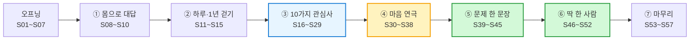

# 1회차 · 2교시 PPT — Gamma 슬라이드 설계서 (57장 · 초5 쉬운 말판)

> **원본 수업안** [(1회차-2교시-실습)-디자인씽킹_사이코드라마_문제점·페르소나.md](<(1회차-2교시-실습)-디자인씽킹_사이코드라마_문제점·페르소나.md>) — 40분 흐름·10가지 관심사·마음 연극·문제점·페르소나
> **함께 쓴 수업안** [(1회차-2교시)-실습_생활문제10_실험·문제점·페르소나.md](<(1회차-2교시)-실습_생활문제10_실험·문제점·페르소나.md>) — 좁은 주제 10가지의 **실전 예시 이야기**(도윤·민지·준호·유나…), 테스트군, A/B 실험(⭐선택 슬라이드)
> **짝 파일** [(1회차-2교시)-PPT_감마_붙여넣기용.md](<(1회차-2교시)-PPT_감마_붙여넣기용.md>) — 이 설계서의 `<!--GAMMA-->` 부분만 모아 `---`로 나눈 파일 (Gamma에 그대로 붙여 넣기)
> **수준** 초등 5학년 **중급**. ① **쉬운 말**(어려운 말은 괄호로 한 번만: "마음 연극(사이코드라마)", "딱 한 사람(페르소나)") ② **한 장에 한 가지** ③ **도식(표·단계·비교·순환) + 실전 예시** 중심 ④ 말투는 **"~해요"**

---

## 0. 사용 방법

### 0-1. Gamma에 넣는 순서

| 단계 | 할 일 |
|:---:|---|
| 1 | Gamma **새로 만들기 → 텍스트 붙여넣기(Paste in text)** |
| 2 | 짝 파일 **「PPT_감마_붙여넣기용.md」 전체 복사 → 붙여넣기** |
| 3 | 텍스트 처리 **"유지(Preserve)"**, 카드 나누기 **"---" 기준** → **57장** |
| 4 | 테마: 1교시와 같은 **흰 바탕 + 딥 네이비 제목 + 틸(청록)·코럴 포인트** (시리즈 통일). 글자는 **크게**, 한 장에 **3줄 안팎** |
| 5 | 카드마다 **📐 레이아웃** 지시대로 Gamma 스마트 레이아웃(단계·순환·비교·그리드·타임라인)으로 바꾸기 — **표는 도식으로 바꾸기 좋게** 짜 두었어요 |
| 6 | **🎨 이미지 프롬프트(영문)** 를 Gamma **AI 이미지 생성**에 붙여 넣기 |
| 7 | **🗣️ 선생님 멘트**는 발표자 노트로 |

> Gamma 메뉴 이름은 버전에 따라 다를 수 있어요. 핵심은 **"텍스트 유지 + --- 로 카드 나누기"** 입니다.
> **고칠 때** — 설계서의 `<!--GAMMA-->` ~ `<!--/GAMMA-->` 사이를 고친 뒤 붙여넣기용 파일도 같이 고쳐 주세요.

### 0-2. 이미지 프롬프트 공통 규칙

| 규칙 | 이유 |
|---|---|
| 모든 프롬프트 끝에 **`friendly flat vector illustration, clean infographic style, navy teal and coral palette, soft shadows, white background, no text`** | 1교시와 같은 색으로 **시리즈 통일**, 초5에 맞게 **친근한 평면 그림** (유아용 만화체 ❌) |
| 인물은 **`Korean elementary school students (age 11)`** | 우리 반 같은 느낌 |
| **`no text`** 필수 | AI 그림은 한글·숫자를 깨뜨려요 → 글자는 **Gamma 텍스트**로 |
| 실제 인물·회사 로고 금지 | 초상권·상표 문제 예방 (LG 캠프 슬라이드도 **로고 없이**) |
| 연극 장면은 **밝고 안전한 분위기** | 마음 연극은 **가볍게** — 우는 얼굴·다투는 장면 ❌ |

### 0-3. 전체 구성 — 57장 / 40분

| 파트 | 슬라이드 | 시간 | 필수 | ⭐선택 |
|---|:---:|:---:|:---:|:---:|
| 오프닝 — 오늘 찾을 것 2가지 | S01~S07 | 3분 | 7 | 0 |
| ① 몸으로 대답하기 | S08~S10 | 3분 | 3 | 0 |
| ② 나의 하루·1년 걷기 | S11~S15 | 6분 | 5 | 0 |
| ③ 10가지 관심사 토론 | S16~S29 | 12분 | 13 | 1 |
| ④ 마음 연극 (사이코드라마) | S30~S38 | 8분 | 9 | 0 |
| ⑤ 문제 한 문장 | S39~S45 | 4분 | 5 | 2 |
| ⑥ 딱 한 사람 (페르소나) | S46~S52 | 5분 | 6 | 1 |
| ⑦ 나눔 · 숙제 · 1년 뒤 | S53~S57 | 2분 | 5 | 0 |
| **합계** | **57장** | **40분** | **53** | **4** |

> **③ 10가지 관심사** 슬라이드(S18~S27)는 한 장 = 1분 토론입니다. 시간이 부족하면 **장면 카드가 하나도 안 붙은 관심사**는 제목만 보여 주고 넘깁니다.
> **실전 예시 주인공** — 수업 내내 **도윤(5학년, 잠들기 전 쇼츠)** 한 명을 따라가며 **장면 → 연극 → 문제 한 문장 → 딱 한 사람**이 되는 과정을 보여 줍니다. 다른 예시(민지·준호·유나·할머니)는 비교용으로 곁들입니다.

### 0-4. 아이들이 쓰는 종이

| 종이 | 언제 | 무엇을 |
|---|---|---|
| 1교시 A4 **뒷면** | S29 | 관심사 궁금 점수 0·1·2 |
| **장면 카드** (A4 8조각) | S15 | 1인 3장 — 누가 · 언제 · 무엇이 불편 |
| **마음 지도** (팀 A4, 4칸) | S33~S38 | 말 · 생각 · 행동 · 마음 + 옆 사람 · 숫자 |
| **팀 카드** 앞면 / 뒷면 | S43 / S49 | 우리 문제 카드 / 딱 한 사람 카드 |

---

# 오프닝 — 오늘 찾을 것 2가지 (S01~S07 · 3분)

## S01 · 표지 — 필수

<!--GAMMA-->
# 나의 하루를 무대에 올려요

1회차 2교시 · 문제 찾기 탐정 수업

> 오늘은 **만들지 않아요.** **진짜 문제**와 **딱 한 사람**을 찾아요.
<!--/GAMMA-->

- **📐 레이아웃** — 좌측 큰 제목, 우측 이미지 50%
- **🎨 이미지 프롬프트**
  `Three Korean elementary school students (age 11) standing on a small classroom stage under a warm spotlight, a large clock face drawn on the floor around them, one student holding a big magnifying glass, one holding a notebook, one holding colored pencils, curious and excited mood, friendly flat vector illustration, clean infographic style, navy teal and coral palette, soft shadows, white background, no text`
  (요약: 바닥에 시계가 그려진 작은 무대 위의 세 탐정 학생)
- **🗣️ 선생님 멘트** — "2교시는 탐정 수업이에요. 오늘은 한 가지도 만들지 않아요. 대신 **진짜 문제**를 찾아요."

---

## S02 · 1교시 다시 보기 — 필수

<!--GAMMA-->
# 1교시에서 배운 것 기억나요?

| 🤖 AI | 🧑 우리 |
|---|---|
| 답을 **빨리** 찾아요 | **문제**를 찾아요 |
| 우리 반을 **본 적 없어요** | 우리 반을 **매일 봐요** |

> "그런 것 같아"는 아직 **증거가 아니에요** → 직접 **보고, 세어 봐요!**
<!--/GAMMA-->

- **📐 레이아웃** — 좌우 비교 2단 (AI / 우리), 하단 강조 박스
- **🎨 이미지 프롬프트**
  `A friendly robot peeking through a classroom window from outside, unable to see clearly, while three Korean elementary school students (age 11) inside the classroom are looking closely at everyday objects with magnifying glasses, friendly flat vector illustration, clean infographic style, navy teal and coral palette, soft shadows, white background, no text`
  (요약: 창밖에서 교실을 못 보는 로봇, 안에서 관찰하는 학생들)
- **🗣️ 선생님 멘트** — "AI는 우리 반을 본 적이 없어요. 오늘 우리가 **AI가 절대 모르는 우리 문제**를 찾아요."

---

## S03 · 오늘의 목표 — 필수

<!--GAMMA-->
# 오늘 찾을 것은 딱 2가지!

1. 📣 **문제 한 문장** — **누가, 언제, 왜** 곤란한지
2. 👤 **딱 한 사람** — 그 문제를 겪는 한 사람 (**페르소나**)

> 🚫 로봇·앱 만들기는 **다음 시간에!** 오늘은 **찾는 날**이에요
<!--/GAMMA-->

- **📐 레이아웃** — 큰 카드 2장 나란히 (말풍선 카드 / 사람 카드), 하단 금지 표시
- **🎨 이미지 프롬프트**
  `Two large glowing cards on a desk, one card shows a big speech bubble icon, the other shows a simple person silhouette icon, a Korean elementary school student (age 11) reaching toward them with a magnifying glass, a small robot toy set aside in a box with a pause symbol, friendly flat vector illustration, clean infographic style, navy teal and coral palette, soft shadows, white background, no text`
  (요약: 말풍선 카드와 사람 카드, 옆에 잠시 쉬는 로봇 장난감)
- **🗣️ 선생님 멘트** — "'로봇 만들자!'가 떠오르면 **좋은 아이디어**예요. 그런데 오늘은 **아껴 두세요.** 다음 시간에 꺼내요."

---

## S04 · 오늘의 여행 지도 — 필수

<!--GAMMA-->
# 오늘 40분 여행 지도

1. 🧍 **몸으로 대답하기** — 3분
2. 🕰️ **나의 하루·1년 걷기** — 6분
3. 🗣️ **10가지 관심사 토론** — 12분
4. 🎭 **마음 연극** — 8분
5. 🧊 **문제 한 문장** — 4분
6. 👤 **딱 한 사람 만들기** — 5분
7. 🤝 **나눔 · 숙제** — 2분
<!--/GAMMA-->

- **📐 레이아웃** — 구불구불한 길 위의 7개 정거장 (타임라인/단계), 3·4번 강조
- **🎨 이미지 프롬프트**
  `A winding path map with seven round stops, each stop marked with a simple icon (standing person, clock, speech bubbles, theater mask, iceberg, person card, handshake), three Korean elementary school students (age 11) walking along the path with backpacks, friendly flat vector illustration, clean infographic style, navy teal and coral palette, soft shadows, white background, no text`
  (요약: 7개 정거장이 있는 구불구불한 길을 걷는 학생들)
- **🗣️ 선생님 멘트** — "3번 토론과 4번 연극이 오늘의 **하이라이트**예요."

---

## S05 · 넓게 → 좁게 — 필수

<!--GAMMA-->
# 발명가는 이렇게 찾아요: 넓게 → 좁게

| 🌍 넓게 | 🔍 좁게 | 🎯 딱 하나 |
|---|---|---|
| 10가지 관심사 | 내 장면 하나 | 문제 한 문장 + 한 사람 |
| "누구에게나 있어요" | "나는 이럴 때!" | "바로 이거야!" |

> 처음부터 좁히면 막혀요. **넓게 보고, 연극으로 좁혀요**
<!--/GAMMA-->

- **📐 레이아웃** — 왼쪽이 넓고 오른쪽이 좁아지는 깔때기(3단계 프로세스)
- **🎨 이미지 프롬프트**
  `A large funnel diagram, many small colorful icons (phone, lunch tray, dog, recycling bin, backpack, heart, house) pouring into the wide top, narrowing down to a single glowing star at the bottom, a Korean elementary school student (age 11) catching the star, friendly flat vector illustration, clean infographic style, navy teal and coral palette, soft shadows, white background, no text`
  (요약: 여러 생활 아이콘이 깔때기를 지나 별 하나가 되는 그림)
- **🗣️ 선생님 멘트** — "처음부터 '급식 문제 찾아!' 하면 급식에 관심 없는 친구는 막혀요. 그래서 오늘은 **아주 넓게** 시작해요."

---

## S06 · 오늘의 약속 — 필수

<!--GAMMA-->
# 오늘의 약속 4가지

1. 🎭 **무대 위에선 뭐든 괜찮아요** — 싫으면 **"패스!"**
2. 🚫 **해결책은 오늘 금지** — 로봇·앱은 다음 시간에
3. 🤝 **충고 금지** — "나도 그런 적 있어"만 말해요
4. 🎁 **따지는 건 선물** — "진짜야? 언제?"에 **고마워요!**
<!--/GAMMA-->

- **📐 레이아웃** — 아이콘 4개 그리드 (2×2)
- **🎨 이미지 프롬프트**
  `Four simple rule icons arranged in a two by two grid, a theater mask with a friendly hand wave, a robot inside a pause circle, two hands forming a heart, a small wrapped gift box with a question mark ribbon, friendly flat vector illustration, clean infographic style, navy teal and coral palette, soft shadows, white background, no text`
  (요약: 약속 4개를 뜻하는 아이콘 4칸)
- **🗣️ 선생님 멘트** — 판서해 두고 한 줄씩 함께 읽어요. "특히 **패스**는 언제든 괜찮아요."

---

## S07 · 우리 셋의 역할 — 필수

<!--GAMMA-->
# 우리 셋의 역할

| ✍️ 기록 머리 | 🔍 조사 눈 | 🎨 그림 손 |
|---|---|---|
| 카드를 쓰고, 연극 속 **속마음**을 적어요 | "진짜야? 몇 번?" 묻고 **세요** | 얼굴을 그리고 **발표**해요 |
| 연극에서: 🎥 **기록자** | 연극에서: 🪞 **속마음 친구** | 연극에서: 🎭 **엄마·동생·물건 역** |

> 🎬 선생님은 **연출가**! "컷!" 하면 멈춰요
<!--/GAMMA-->

- **📐 레이아웃** — 3열 카드 (사람 아이콘 + 두 줄 설명)
- **🎨 이미지 프롬프트**
  `Three Korean elementary school students (age 11) side by side, one writing on a clipboard, one holding a magnifying glass and counting on fingers, one drawing with colored pencils, a teacher in the background holding a small director clapperboard, friendly flat vector illustration, clean infographic style, navy teal and coral palette, soft shadows, white background, no text`
  (요약: 기록·조사·그림 역할의 세 학생과 연출가 선생님)
- **🗣️ 선생님 멘트** — 역할을 정해요. "연극할 때는 역할이 조금 바뀌어요. 그때 다시 알려 줄게요."

---

# ① 몸으로 대답하기 (S08~S10 · 3분)

## S08 · 방법 — 필수

<!--GAMMA-->
# 🧍 몸으로 대답하기

- 교실 **창가 쪽** = "**전혀** 아니야"
- 교실 **문 쪽** = "**매일** 그래!"
- 질문을 듣고 **내 자리에 서요** — 가운데도 괜찮아요

**창가 😐 ——— 🙂 ——— 😆 문 쪽**
<!--/GAMMA-->

- **📐 레이아웃** — 가로 한 줄 눈금(스펙트럼) 도식, 양 끝에 라벨
- **🎨 이미지 프롬프트**
  `A top-down view of a classroom floor with a long line of tape stretching from the window side to the door side, three Korean elementary school students (age 11) standing at different points along the line, arrows showing they can move, playful and energetic mood, friendly flat vector illustration, clean infographic style, navy teal and coral palette, soft shadows, white background, no text`
  (요약: 창가에서 문까지 이어진 바닥 선 위 서로 다른 자리에 선 학생들)
- **🗣️ 선생님 멘트** — "말로 대답 안 해도 돼요. **몸으로** 대답해요. 틀린 자리는 없어요."

---

## S09 · 질문 ①② — 필수

<!--GAMMA-->
# 질문 ① 📱
## 핸드폰이나 게임을 **하루 1시간 넘게** 한다!

# 질문 ② 💬
## 이번 주에 **친구 말 때문에 속상한** 적이 있다!

> 🔍 "왜 거기 섰어?"
<!--/GAMMA-->

- **📐 레이아웃** — 위아래 2단 큰 질문, 질문마다 아이콘
- **🎨 이미지 프롬프트**
  `Split scene, top half a Korean elementary school student (age 11) lying on a sofa glowing screen light on the face with a game controller nearby, bottom half two students with a chat bubble between them showing a small cracked heart icon, friendly flat vector illustration, clean infographic style, navy teal and coral palette, soft shadows, white background, no text`
  (요약: 위는 화면을 보는 아이, 아래는 말풍선 사이 금 간 하트)
- **🗣️ 선생님 멘트** — 질문마다 20초. 다른 자리에 선 친구 **한 명에게만** "왜 거기 섰어?"

---

## S10 · 질문 ③④ + 알게 된 것 — 필수

<!--GAMMA-->
# 질문 ③ 👶 집에서 **누군가를 챙기는** 일이 있다!
동생 · 강아지 · 화분 · 할머니

# 질문 ④ 🌱 **버릴 때 헷갈리는** 물건이 있다!

> 같은 질문에도 **서는 자리가 달라요.**
> 문제는 **사람마다** 달라요 → 그래서 오늘 **딱 한 사람**을 찾아요
<!--/GAMMA-->

- **📐 레이아웃** — 질문 2개 카드 + 하단 결론 박스 크게
- **🎨 이미지 프롬프트**
  `Three Korean elementary school students (age 11) standing at three clearly different spots on a floor line, each with a different thought bubble icon above (a puppy bowl, a milk carton, a flower pot), showing that everyone has different experiences, friendly flat vector illustration, clean infographic style, navy teal and coral palette, soft shadows, white background, no text`
  (요약: 서로 다른 자리에 서서 각자 다른 생각을 하는 세 학생)
- **🗣️ 선생님 멘트** — "봐요, 같은 질문인데 **다 다른 곳**에 섰죠? 그래서 발명가는 '**모두**'가 아니라 '**딱 한 사람**'을 찾아요."

---

# ② 나의 하루·1년 걷기 (S11~S15 · 6분)

## S11 · 바닥 무대 — 필수

<!--GAMMA-->
# 🕰️ 바닥에 무대를 만들어요

**나의 하루 시계 (7칸)**
⏰ 눈 뜰 때 → 🚶 등교길 → 📖 수업 → 🍱 점심·쉬는 시간 → 🏢 학원 → 🏠 저녁 → 🛏️ 잠들기 전

**나의 1년 달력 (6칸)**
🌸 3월 새 학기 → 👨‍👩‍👧 5월 가족 → ☀️ 여름방학 → 🌕 추석 → ⛄ 겨울방학 → 🧧 설날·학년 끝

> 칸에 멈추면 **동작 하나 + 한 문장!**
<!--/GAMMA-->

- **📐 레이아웃** — 위: 원형 순환 7칸(하루 시계) / 아래: 가로 타임라인 6칸(1년 달력)
- **🎨 이미지 프롬프트**
  `A classroom floor seen from above with seven paper cards arranged in a big circle like a clock and six paper cards arranged in a straight line like a calendar, each card with a simple icon (alarm clock, school path, book, lunch tray, bus, house, bed, cherry blossom, family, sun, full moon, snowman, lucky bag), three Korean elementary school students (age 11) walking on the cards, friendly flat vector illustration, clean infographic style, navy teal and coral palette, soft shadows, white background, no text`
  (요약: 바닥에 원형 시계 7칸과 달력 6칸, 그 위를 걷는 학생들)
- **🗣️ 선생님 멘트** — "이 무대 위를 **천천히 걸어요.** 선생님이 멈추라고 하면, 그 시간에 **내가 뭘 하는지** 몸으로 보여 줘요."

---

## S12 · 하루 시계 ① 아침~점심 — 필수

<!--GAMMA-->
# 🕰️ 하루 걷기 ① 아침 ~ 점심

| 칸 | 선생님 질문 | 이런 장면! |
|---|---|---|
| ⏰ 눈 뜰 때 | 제일 먼저 손에 잡는 건? | 알람 끄고 쇼츠 → **늦잠** |
| 🚶 등교길 | 빠뜨린 것? 멈칫한 순간? | 준비물을 두고 옴 |
| 📖 수업 시간 | 속으로 "아, 짜증!" 한 순간? | 모둠에서 **혼자** 다 함 |
| 🍱 점심·쉬는 시간 | 식판 앞, 분리수거함 앞에서? | 처음 보는 반찬, 우유갑 |

> 말하기 틀: "**[칸]** 에 나는 **[무엇을 하고]**, **[무엇이]** 불편해."
<!--/GAMMA-->

- **📐 레이아웃** — 4단 타임라인(시계 반쪽), 칸마다 아이콘
- **🎨 이미지 프롬프트**
  `A morning to lunchtime timeline with four scenes of a Korean elementary school student (age 11): reaching for a phone in bed next to an alarm clock, walking to school looking back at home, sitting in a group desk doing all the work alone, looking puzzled at a lunch tray, connected by a curved arrow like half a clock, friendly flat vector illustration, clean infographic style, navy teal and coral palette, soft shadows, white background, no text`
  (요약: 아침부터 점심까지 네 장면이 시계 반원처럼 이어진 그림)
- **🗣️ 선생님 멘트** — 칸당 20초. 한 명씩 돌아가며 **동작 + 한 문장**. 길어지면 "좋아, **연극 후보**로 찜!"

---

## S13 · 하루 시계 ② 오후~밤 — 필수

<!--GAMMA-->
# 🕰️ 하루 걷기 ② 오후 ~ 밤

| 칸 | 선생님 질문 | 이런 장면! |
|---|---|---|
| 🏢 방과후·학원 | 학원 가기 **5분 전**의 나는? | 놀다가 학원 차를 놓침 |
| 🏠 저녁·집 | 가족이랑 부딪히는 순간? | 게임 약속, 강아지 밥 |
| 🛏️ 잠들기 전 | 이불 속에서 뭐 해? 다음 날 아침은? | 쇼츠·단톡방 → **또 늦잠** |

> 📱 스마트폰은 **하루에 몇 번** 나왔어요?
<!--/GAMMA-->

- **📐 레이아웃** — 3단 타임라인(시계 나머지 반쪽), 📱 등장 칸에 작은 표시
- **🎨 이미지 프롬프트**
  `An afternoon to night timeline with three scenes of a Korean elementary school student (age 11): running after a small academy bus at a playground, at a dinner table with a parent pointing at a clock while a puppy waits by an empty bowl, lying in bed under a blanket lit by a phone screen at night, connected by a curved arrow completing a clock circle, friendly flat vector illustration, clean infographic style, navy teal and coral palette, soft shadows, white background, no text`
  (요약: 학원 차, 저녁 식탁, 이불 속 폰 — 시계 원을 완성하는 세 장면)
- **🗣️ 선생님 멘트** — "하루를 한 바퀴 돌았더니 **핸드폰이 몇 번** 나왔어요? 아침에도, 밤에도 나왔죠?"

---

## S14 · 1년 달력 — 필수

<!--GAMMA-->
# 📅 1년 걷기 — 해마다 돌아오는 불편

| 🌸 3월 새 학기 | 👨‍👩‍👧 5월 가족 | ☀️ 여름방학 |
|---|---|---|
| 새 반 단톡방이 어색해요 | 식당 키오스크 앞 할머니 | 핸드폰 시간 **폭발**, 벌레 물림 |
| **🌕 추석** | **⛄ 겨울방학** | **🧧 설날·학년 끝** |
| 사촌과 게임, 긴 차 이동 | **새 폰** → 앱 설치 | 분실물 상자, 헤어짐 |

> "이 칸에서 **해마다** 겪는 불편 있는 사람? ✋"
<!--/GAMMA-->

- **📐 레이아웃** — 6칸 달력 그리드 (계절 색으로 구분)
- **🎨 이미지 프롬프트**
  `A cheerful six-panel calendar grid showing a year of a Korean elementary school student (age 11): spring classroom with cherry blossoms, family restaurant with a grandmother at a kiosk, summer vacation with a phone and bug bites, autumn full moon family gathering with cousins playing games, winter with a new phone gift box, lunar new year with a lost-and-found box, friendly flat vector illustration, clean infographic style, navy teal and coral palette, soft shadows, white background, no text`
  (요약: 봄~겨울 1년을 6칸으로 보여 주는 달력 그림)
- **🗣️ 선생님 멘트** — 1분만 빠르게. "1년에 **한 번씩 꼭** 겪는 불편도 좋은 문제예요."

---

## S15 · 장면 카드 쓰기 — 필수

<!--GAMMA-->
# ✏️ 장면 카드 3장 쓰기 (하루 2 + 1년 1)

| 누가 | 언제 (칸) | 무엇이 불편? |
|---|---|---|
| 나 | 🛏️ 잠들기 전 | 쇼츠를 **끄고 싶은데** 계속 봐요 |
| 동생 | 🍱 점심 | 처음 보는 반찬을 **그냥 버려요** |
| 할머니 | 👨‍👩‍👧 5월 외식 | 키오스크 앞에서 **뒷사람 눈치**를 봐요 |

> ❌ 흐린 카드: "그냥 싫어요" → ⭕ 사진 같은 카드: **누가 · 언제 · 무엇**
<!--/GAMMA-->

- **📐 레이아웃** — 카드 3장이 겹쳐 놓인 모양 + 하단 ❌/⭕ 비교
- **🎨 이미지 프롬프트**
  `Three small paper cards laid out on a desk, each with a tiny illustration (a child in bed with a phone, a younger child pushing away a lunch tray, a grandmother hesitating at a touchscreen kiosk with people waiting behind), a pencil beside them, friendly flat vector illustration, clean infographic style, navy teal and coral palette, soft shadows, white background, no text`
  (요약: 세 장면이 그려진 작은 카드 3장)
- **🗣️ 선생님 멘트** — "카드를 **사진 찍듯이** 써요. 누가 찍혀 있어? 몇 시야? 뭐가 불편해?" (2분)

---

# ③ 10가지 관심사 토론 (S16~S29 · 12분)

## S16 · 10가지 큰 관심사 — 필수

<!--GAMMA-->
# 🗂️ 10가지 큰 관심사

| 1 📱 스마트폰·게임·영상 | 2 🔐 개인정보·온라인 안전 |
|---|---|
| **3 📚 공부·학교생활** | **4 🍱 먹는 것** |
| **5 🩹 몸·건강·잠** | **6 👶 가족·돌봄** |
| **7 💬 친구·마음·팀** | **8 🤝 배려·함께 사는 사회** |
| **9 🚸 우리 집·동네·길** | **10 🌱 자연·환경·돈** |

> 내 장면 카드를 **번호 자리에 붙여요!**
<!--/GAMMA-->

- **📐 레이아웃** — 2×5 아이콘 그리드 (색을 모두 다르게)
- **🎨 이미지 프롬프트**
  `A colorful grid of ten large round icons arranged in two rows of five: smartphone, padlock, open book, lunch tray, bandage, baby bottle, two speech bubbles with a heart, two hands holding, a house with a crosswalk, a leaf with a coin, clean and bold, friendly flat vector illustration, clean infographic style, navy teal and coral palette, soft shadows, white background, no text`
  (요약: 10가지 관심사를 뜻하는 큰 아이콘 10개)
- **🗣️ 선생님 멘트** — "관심사 판을 칠판에 붙여 둘게요. 내 카드가 **어느 번호**에 가까운지 붙여 봐요." (카드가 여러 번호에 걸리면 **아무 데나** 괜찮아요.)

---

## S17 · 토론하는 법 — 필수

<!--GAMMA-->
# 🗣️ 한 관심사 = 1분 토론

1. 🏕️ **형·누나 이야기** 듣기 — 20초
2. ✋ **내 하루에도 있어?** 카드 붙이기 — 10초
3. 🗣️ **토론 질문 하나** — 30초
4. ✏️ **궁금 점수** 0·1·2 — 10초

**형·누나** = **LG AI 청소년 캠프**에 뽑힌 초6~중2 선배들
**말하기 틀** — "나는 **찬성/반대**야. 왜냐하면 **[내 경험]** 때문이야." / "나는 좀 달라. 나는 **[언제] [어땠어]**."
<!--/GAMMA-->

- **📐 레이아웃** — 4단계 순환(원형) 도식 + 하단 말하기 틀 박스
- **🎨 이미지 프롬프트**
  `A circular four-step cycle diagram with icons: a campfire with older students telling a story, a hand raised with a small card, two students debating with opposite colored speech bubbles, a pencil writing a small score, a small timer in the center, friendly flat vector illustration, clean infographic style, navy teal and coral palette, soft shadows, white background, no text`
  (요약: 이야기 → 손들기 → 토론 → 점수로 도는 4단계 순환)
- **🗣️ 선생님 멘트** — "형·누나들은 내년에 여러분이 지원할 수 있는 캠프의 선배들이에요. 그 형·누나들이 **어떤 불편**에서 시작했는지 들어 봐요."

---

## S18 · 관심사 1 📱 스마트폰·게임·영상 — 필수

<!--GAMMA-->
# 📱 1. 스마트폰·게임·영상

## 🏕️ 형·누나 아이디어: **쇼츠 그만 AI**
눈이 화면을 **너무 오래** 보면 → 화면이 **흑백**으로! 혼내지 않고 **스스로 멈추게** 도와요

## 🗣️ 토론: 화면이 갑자기 흑백이 되면 — **도움? 짜증?**

> 🌅 실전 예시 — 도윤(5학년): "30분만 하기로 했는데 **2시간**이 지났어요."
<!--/GAMMA-->

- **📐 레이아웃** — 좌: 선배 아이디어 카드(컬러 화면 → 흑백 화면 전후 비교) / 우: 큰 토론 질문 / 하단 실전 예시
- **🎨 이미지 프롬프트**
  `Before and after comparison of a smartphone screen, left side bright and colorful short videos, right side the same screen turned gray and black and white, a Korean elementary school student (age 11) looking at it thoughtfully, a small eye icon above the phone, friendly flat vector illustration, clean infographic style, navy teal and coral palette, soft shadows, white background, no text`
  (요약: 컬러 화면이 흑백으로 바뀌는 전후 비교와 그걸 보는 아이)
- **🗣️ 선생님 멘트** — 토론 첫마디는 A부터. "하루에 핸드폰을 **처음 켠 시각**, **마지막으로 끈 시각**은?"도 물어봐요.

---

## S19 · 관심사 2 🔐 개인정보·온라인 안전 — 필수

<!--GAMMA-->
# 🔐 2. 개인정보·온라인 안전

## 🏕️ 형·누나 아이디어: **앱 권한 위험 점수**
앱이 "연락처 볼게요", "위치 볼게요" 하고 **달라는 것**을 AI가 살펴보고 → **얼마나 위험한지 점수**로!

## 🗣️ 토론: 손전등 앱이 **내 연락처**를 달라고 하면 — 줘도 될까?

> 🌅 실전 예시 — 새 폰을 받은 날, "**허용**" 버튼을 **읽지도 않고** 10번 넘게 눌렀어요.
<!--/GAMMA-->

- **📐 레이아웃** — 좌: 권한 요청 창 3개 → 점수 게이지 / 우: 토론 질문
- **🎨 이미지 프롬프트**
  `A smartphone showing three permission pop-up windows with simple icons (contacts book, location pin, camera), a Korean elementary school student (age 11) with a finger hovering over the allow button, a large friendly shield with a gauge meter beside the phone, friendly flat vector illustration, clean infographic style, navy teal and coral palette, soft shadows, white background, no text`
  (요약: 권한 요청 창 앞에서 망설이는 손가락, 옆에 위험도 게이지 방패)
- **🗣️ 선생님 멘트** — "우리 중 권한 창을 **끝까지 읽어 본** 사람? ✋ 몇 명인지 **세어 봐요.**"

---

## S20 · 관심사 3 📚 공부·학교생활 — 필수

<!--GAMMA-->
# 📚 3. 공부·학교생활

## 🏕️ 형·누나 아이디어: **예전에 찾은 것 다시 꺼내 주기**
어제 찾은 설명, 오늘 **어디서 봤는지 기억 안 나죠?** → 내가 **예전에 검색한 기록**을 AI가 기억했다가 다시 보여 줘요

## 🗣️ 토론: AI가 내가 찾은 걸 **전부 기억**한다면 — 편할까, 좀 무서울까?

> 🌅 실전 예시 — 예린: "단어 시험 전날 **20개를 몰아서** 외웠는데, 일주일 뒤 **하나도** 기억이 안 나요."
<!--/GAMMA-->

- **📐 레이아웃** — 좌: 흩어진 기록 → 모인 기록 도식 / 우: 토론 질문 / 하단 예시
- **🎨 이미지 프롬프트**
  `A Korean elementary school student (age 11) at a desk surrounded by scattered floating notes and search windows, a friendly glowing folder gathering the notes neatly together, a vocabulary card with a question mark nearby, friendly flat vector illustration, clean infographic style, navy teal and coral palette, soft shadows, white background, no text`
  (요약: 흩어진 메모와 검색창이 폴더 하나로 모이는 모습)
- **🗣️ 선생님 멘트** — "'어? 이거 어디서 봤더라?' 한 적 있어요? 가방 준비물, 지우개 잃어버리기도 이 관심사예요."

---

## S21 · 관심사 4 🍱 먹는 것 — 필수

<!--GAMMA-->
# 🍱 4. 먹는 것

## 🏕️ 형·누나 아이디어: **점심 메뉴 추천 AI**
"오늘 점심 뭐 먹지?" → 내가 **먹은 기록과 좋아하는 맛**을 보고 AI가 **오늘 메뉴를 추천**해요

## 🗣️ 토론: 급식 반찬을 AI가 골라 준다면 — **좋아하는 것만?** **몸에 좋은 것만?**

> 🌅 실전 예시 — 민지(2학년): "처음 보는 '톳무침'. **무슨 맛인지 몰라서** 한 입도 안 먹고 버렸어요."
<!--/GAMMA-->

- **📐 레이아웃** — 좌: 식판 그림 + 추천 화살표 / 우: 저울처럼 "좋아하는 것 ⚖️ 몸에 좋은 것" 비교
- **🎨 이미지 프롬프트**
  `A school lunch tray with several side dishes, one unfamiliar seaweed side dish highlighted with a question mark, a younger Korean elementary school student hesitating with chopsticks, beside it a balance scale weighing a dessert icon against a vegetable icon, friendly flat vector illustration, clean infographic style, navy teal and coral palette, soft shadows, white background, no text`
  (요약: 물음표가 붙은 처음 보는 반찬과 '맛 vs 건강' 저울)
- **🗣️ 선생님 멘트** — "오늘 급식에서 **남긴 것**은? 왜 남겼어요?"

---

## S22 · 관심사 5 🩹 몸·건강·잠 — 필수

<!--GAMMA-->
# 🩹 5. 몸·건강·잠

## 🏕️ 형·누나 아이디어: **벌레 물린 자국 분석기**
물린 자국 **사진**을 보고 → 모기? 개미? 진드기? → **어떻게 치료할지** 알려 줘요
(우리가 **5회차에 웹캠으로** 하는 것과 같은 방법!)

## 🗣️ 토론: AI가 "괜찮아요"라고 하면 — **병원에 안 가도 될까?**

> 🌅 실전 예시 — 지훈(6학년): "숙제 끝나면 얼굴이 공책에 붙어 있고 **목이 아파요.** 언제 그랬는지 몰라요."
<!--/GAMMA-->

- **📐 레이아웃** — 좌: 사진 → 판단 → 안내 3단계 / 우: 토론 질문 / 하단 예시
- **🎨 이미지 프롬프트**
  `A three-step flow: a smartphone camera taking a photo of a small bug bite on an arm, a magnifying glass showing three simple bug icons (mosquito, ant, tick), a first aid kit icon with a check mark, next to it a Korean elementary school student (age 11) hunched over homework with a curved neck line, friendly flat vector illustration, clean infographic style, navy teal and coral palette, soft shadows, white background, no text`
  (요약: 자국 사진 → 벌레 구분 → 구급상자 3단계, 옆에 구부정한 자세의 아이)
- **🗣️ 선생님 멘트** — "AI가 틀리면 **누가 책임**질까요? 1교시에 배웠죠?"

---

## S23 · 관심사 6 👶 가족·돌봄 — 필수

<!--GAMMA-->
# 👶 6. 가족·돌봄

## 🏕️ 형·누나 아이디어: **아기 울음소리 해석 AI**
아기는 말을 못 해서 **울음**으로 말해요 → 울음소리를 듣고 **배고픔? 졸림? 불편?** 알려 줘요

## 🗣️ 토론: AI가 "배고파요"라고 알려 주면 — 엄마는 아기를 **덜 볼까, 더 잘 볼까?**

> 🌅 실전 예시 — 유나: "강아지 물그릇이 비어 있었어요. 엄마는 **내가** 준 줄, 나는 **아빠가** 준 줄 알았어요."
<!--/GAMMA-->

- **📐 레이아웃** — 좌: 소리 파형 → 아이콘 3개(젖병·베개·기저귀) / 우: 토론 / 하단 예시
- **🎨 이미지 프롬프트**
  `A crying baby in a crib with a sound wave coming out, the sound wave splitting into three simple icons (milk bottle, pillow, diaper), a Korean family in the background, and in the corner a puppy sitting next to an empty water bowl with three family members pointing at each other, friendly flat vector illustration, clean infographic style, navy teal and coral palette, soft shadows, white background, no text`
  (요약: 울음소리가 세 아이콘으로 나뉘는 그림, 구석엔 빈 물그릇과 서로 가리키는 가족)
- **🗣️ 선생님 멘트** — "명절에 **할머니·할아버지**가 곤란해하신 순간도 이 관심사예요. 키오스크 같은 거요."

---

## S24 · 관심사 7 💬 친구·마음·팀 — 필수

<!--GAMMA-->
# 💬 7. 친구·마음·팀

## 🏕️ 형·누나 아이디어: **팀 싸움 중재 AI**
모둠 활동하다 싸운 적 있죠? → 친구 마음을 알아주는 힘을 키우고, **팀 갈등을 중재**하는 AI

## 🗣️ 토론: 단톡방에서 "**ㅇㅇ**" 두 글자 — 화난 걸까, 괜찮은 걸까?

> 🌅 실전 예시 — "내가 말하면 **아무도 대답을 안 해요.** 욕은 없는데… 기분이 이상해요."
<!--/GAMMA-->

- **📐 레이아웃** — 좌: 같은 "ㅇㅇ" 말풍선에 서로 다른 표정 3개 / 우: 토론 질문 / 하단 예시
- **🎨 이미지 프롬프트**
  `Three identical chat bubbles side by side, each connected to a different face (smiling, neutral, upset), showing that the same short message can feel different, a small group of Korean elementary school students (age 11) around a table with one student doing all the work, friendly flat vector illustration, clean infographic style, navy teal and coral palette, soft shadows, white background, no text`
  (요약: 똑같은 말풍선인데 표정이 다른 세 얼굴, 옆에 혼자 일하는 모둠원)
- **🗣️ 선생님 멘트** — "글자에는 **말투와 표정**이 없어요. 그래서 오해가 생겨요. 내년 캠프는 **모르는 4명이 한 팀**이래요. 형·누나들도 이걸 겪었겠죠?"

---

## S25 · 관심사 8 🤝 배려·함께 사는 사회 — 필수

<!--GAMMA-->
# 🤝 8. 배려·함께 사는 사회

## 🏕️ 형·누나 아이디어: **표정 읽어 주는 AI**
눈이 보이지 않는 사람은 상대가 **웃는지, 찡그리는지** 몰라요 → AI가 표정을 보고 **소리로** 알려 줘요

## 🗣️ 토론: 나에겐 쉬운데 **누군가에겐 어려운 것** — 우리 학교에 뭐가 있을까?

> 🌅 실전 예시 — 전학 온 친구가 급식표의 **알레르기 표시를 못 읽어서** 매일 물어봐요.
<!--/GAMMA-->

- **📐 레이아웃** — 좌: 얼굴 → 이어폰 소리 도식 / 우: 토론 질문 / 하단 예시
- **🎨 이미지 프롬프트**
  `A person with sunglasses and a white cane wearing a small earpiece, facing a smiling friend, a gentle sound wave with a smile icon traveling from the friend's face to the earpiece, in the background a new transfer student looking at a lunch menu board with allergy icons and a helpful classmate beside, friendly flat vector illustration, clean infographic style, navy teal and coral palette, soft shadows, white background, no text`
  (요약: 친구의 웃는 표정이 소리로 전달되는 그림, 뒤편에 급식표 앞 전학생)
- **🗣️ 선생님 멘트** — "다리를 다쳐 **목발**을 짚어 본 적 있어요? 그때 불편했던 게 바로 이 관심사예요."

---

## S26 · 관심사 9 🚸 우리 집·동네·길 — 필수

<!--GAMMA-->
# 🚸 9. 우리 집·동네·길

## 🏕️ 형·누나 아이디어: **모르는 사람 알려 주는 카메라**
아파트 현관·학교 정문에 들어오는 사람이 **아는 사람인지** AI가 알아봐요

## 🗣️ 토론: 안전을 위해 학교 정문에서 **모든 사람 얼굴을 찍어도** 될까?

> 🌅 실전 예시 — 시우(4학년): "월수금은 4시, 화목은 3시 반! 놀다가 **학원 차를 놓쳤어요.**"
> 🌅 또 다른 예시 — 할아버지가 횡단보도를 **다 건너기 전에** 신호가 바뀌어요.
<!--/GAMMA-->

- **📐 레이아웃** — 좌: 정문 카메라 그림 / 우: 찬성 🛡️ vs 반대 🔒 저울 / 하단 예시 2개
- **🎨 이미지 프롬프트**
  `A school front gate with a small camera, a balance scale in front of it weighing a shield icon (safety) against a padlock icon (privacy), in the background an elderly man crossing a crosswalk as the pedestrian light starts blinking and a child running toward a small academy bus, friendly flat vector illustration, clean infographic style, navy teal and coral palette, soft shadows, white background, no text`
  (요약: 정문 카메라 앞 '안전 vs 사생활' 저울, 뒤편에 횡단보도 할아버지와 학원 차)
- **🗣️ 선생님 멘트** — "안전도 중요하고, 내 얼굴도 소중해요. **양쪽 다** 이유를 말해 봐요."

---

## S27 · 관심사 10 🌱 자연·환경·돈 — 필수

<!--GAMMA-->
# 🌱 10. 자연·환경·돈

## 🏕️ 형·누나 아이디어: **딸기 가격 예측 AI**
딸기가 어떤 때는 비싸고 어떤 때는 싸죠? → **날씨와 지난 가격**을 보고 **다음 주 가격**을 미리 알려 줘요

## 🗣️ 토론: 분리수거를 틀리는 건 — **몰라서일까, 귀찮아서일까?**

> 🌅 실전 예시 — 준호(3학년): "우유갑이 종이인지 아닌지 **매일 헷갈려요.** 뒤에 친구가 기다려서 **아무 데나** 넣었어요."
<!--/GAMMA-->

- **📐 레이아웃** — 좌: 날씨 → 가격 그래프 도식 / 우: "몰라서 🤔 vs 귀찮아서 😮‍💨" 비교 / 하단 예시
- **🎨 이미지 프롬프트**
  `A basket of strawberries next to a simple rising and falling line graph with a sun and rain cloud above it, and beside it a younger Korean elementary school student holding a milk carton, looking confused in front of three recycling bins, other students waiting in line behind, friendly flat vector illustration, clean infographic style, navy teal and coral palette, soft shadows, white background, no text`
  (요약: 날씨에 따라 오르내리는 딸기 가격 그래프, 옆에 우유갑 들고 망설이는 아이)
- **🗣️ 선생님 멘트** — "몰라서인지 귀찮아서인지는 **실험하면 알 수 있어요.** 오늘은 **어느 쪽인 것 같은지** 이야기해 봐요."

---

## S28 · ⭐ 보너스: 나만 아는 세계 — 선택

<!--GAMMA-->
# ⭐ 보너스: 나만 아는 세계

| 🎺 밴드·합창 | 🥋 태권도 | 🌿 텃밭 |
|---|---|---|
| 합주 전 튜닝에 **20분** | 관장님 없으면 품새가 **틀린 걸 몰라요** | 상추 잎이 **왜 노래지는지** 몰라요 |
| **🧱 레고** | **♟️ 보드게임** | **🗣️ 사투리** |
| 부품 하나 찾는 데 **10분** | 동생이 규칙을 몰라 **매번 져요** | 할머니 말을 동생이 **못 알아들어요** |

> 내 **취미**에만 있는 불편은 **나만** 찾을 수 있어요 → 가장 **새로운** 문제!
<!--/GAMMA-->

- **📐 레이아웃** — 6칸 아이콘 그리드
- **🎨 이미지 프롬프트**
  `Six small hobby scenes in a grid: a child tuning a violin, a child practicing a taekwondo form alone, a small vegetable garden with a yellow leaf, a big pile of toy bricks, a board game with a younger sibling looking confused, a grandmother talking on the phone to a puzzled young child, friendly flat vector illustration, clean infographic style, navy teal and coral palette, soft shadows, white background, no text`
  (요약: 취미 현장 6칸 — 튜닝·태권도·텃밭·레고·보드게임·통화)
- **🗣️ 선생님 멘트** — 토론 중 **취미 이야기**가 나온 친구가 있을 때만 보여 줘요. "심사하는 사람은 '**이 친구니까** 찾을 수 있었겠다' 싶은 문제를 좋아해요."

---

## S29 · 점수 세고 하나 고르기 — 필수

<!--GAMMA-->
# ✏️ 점수 세고, 하나 고르기

| 관심사 | 1📱 | 2🔐 | 3📚 | 4🍱 | 5🩹 | 6👶 | 7💬 | 8🤝 | 9🚸 | 10🌱 |
|---|:---:|:---:|:---:|:---:|:---:|:---:|:---:|:---:|:---:|:---:|
| 점수 합계 | | | | | | | | | | |
| 붙은 카드 | | | | | | | | | | |

**2점** 나도 겪었어! · **1점** 좀 궁금해 · **0점** 나랑은 상관없어

> 🏆 점수 + 카드가 **제일 많은** 관심사 → **연극으로 파고들기!**
> 동점이면? **주인공 하고 싶은 사람**이 있는 쪽!
<!--/GAMMA-->

- **📐 레이아웃** — 표(아이들이 칠판에 채움) + 하단 트로피 박스
- **🎨 이미지 프롬프트**
  `A classroom whiteboard with ten icon columns and colorful sticky cards stuck under them, one column clearly taller with more cards and a small trophy on top, three Korean elementary school students (age 11) counting and pointing, friendly flat vector illustration, clean infographic style, navy teal and coral palette, soft shadows, white background, no text`
  (요약: 카드가 가장 많이 붙은 기둥 위의 트로피)
- **🗣️ 선생님 멘트** — "이 관심사에서 카드를 쓴 사람 중에 **주인공 해 볼 사람?** 하고 싶은 사람만 해요!"

---

# ④ 마음 연극 — 사이코드라마 (S30~S38 · 8분)

## S30 · 마음 연극이 뭐예요? — 필수

<!--GAMMA-->
# 🎭 마음 연극 (사이코드라마)

- 말로 설명하는 대신 **그 장면을 다시 해 보는** 연극이에요
- 연극을 하면 **내 속마음**과 **다른 사람의 마음**이 보여요

| 🎬 연출가 | 🌟 주인공 | 🎭 배우 | 👀 관객 |
|---|---|---|---|
| 선생님 | 장면을 꺼낸 친구 (**하고 싶은 사람만**) | 엄마·동생·**물건** 역 | 보고 "나도 그런 적 있어" |
<!--/GAMMA-->

- **📐 레이아웃** — 상단 설명 2줄, 하단 역할 4칸 (아이콘 카드)
- **🎨 이미지 프롬프트**
  `A bright classroom turned into a small stage, a teacher holding a clapperboard as director, one Korean elementary school student (age 11) in the center as the main character, another student acting as a mom with an apron, a third student sitting as the audience smiling, an empty chair on the stage, cheerful and safe mood, friendly flat vector illustration, clean infographic style, navy teal and coral palette, soft shadows, white background, no text`
  (요약: 연출가·주인공·배우·관객이 있는 밝은 교실 무대와 빈 의자)
- **🗣️ 선생님 멘트** — "배우처럼 잘할 필요 없어요. **그때 그 모습**만 보여 주면 돼요."

---

## S31 · 마음 연극 약속 — 필수

<!--GAMMA-->
# 🛡️ 마음 연극 약속

1. 🙋 주인공은 **하고 싶은 사람만**
2. ✋ 언제든 **"패스"** · 선생님이 **"컷!"** 하면 멈춰요
3. 🚫 사람 **흉내 내며 놀리기** ❌ → 그 사람의 **마음**을 연기해요
4. 🧥 끝나면 **역할 벗기** — 어깨 털고 "**나는 다시 ○○이야!**"
<!--/GAMMA-->

- **📐 레이아웃** — 방패 아이콘 + 약속 4줄 (체크리스트)
- **🎨 이미지 프롬프트**
  `A large friendly shield icon in the center surrounded by four small icons: a raised hand, a stop hand with a clapperboard, a heart replacing a laughing mask, a child brushing off shoulders with sparkles, friendly flat vector illustration, clean infographic style, navy teal and coral palette, soft shadows, white background, no text`
  (요약: 가운데 방패와 약속 4가지를 뜻하는 아이콘)
- **🗣️ 선생님 멘트** — "특히 3번! 엄마 **말투를 흉내** 내는 게 아니라, 엄마가 **어떤 마음**일지 보여 주는 거예요."

---

## S32 · 연극 기술 5가지 — 필수

<!--GAMMA-->
# 🎭 오늘 쓸 연극 기술 5가지

| 기술 | 어떻게? | 무엇이 보여요? |
|---|---|---|
| 🎬 **다시 보기** | 그 장면을 **30초** 다시 해요 | 누가·언제·어디서 |
| 🪞 **속마음 친구** | 뒤에 서서 "**사실은…**" 말해 줘요 | 진짜 마음 |
| 🪑 **빈 의자** | 의자 위 **물건**에게 말하고, **물건이 되어** 대답해요 | 숨은 이유 |
| 👀 **거울** | 친구가 **내 모습**을 따라 해요 | 내가 몰랐던 나 |
| 🔄 **자리 바꾸기** | **엄마·동생 자리**에 서 봐요 | 누가 불편한지 |
<!--/GAMMA-->

- **📐 레이아웃** — 5행 아이콘 리스트 (왼쪽 큰 아이콘)
- **🎨 이미지 프롬프트**
  `Five small classroom drama scenes in a vertical strip: a child replaying a scene, a friend standing behind a child whispering, a child talking to a smartphone placed on an empty chair, a friend mirroring a child's slouching pose, two children swapping places with curved arrows, friendly flat vector illustration, clean infographic style, navy teal and coral palette, soft shadows, white background, no text`
  (요약: 다시 보기·속마음 친구·빈 의자·거울·자리 바꾸기 다섯 장면)
- **🗣️ 선생님 멘트** — "지금부터 **도윤이 예시**로 하나씩 보여 줄게요. 그다음 우리 주인공 차례!"

---

## S33 · 예시 ① 다시 보기 — 필수

<!--GAMMA-->
# 예시 ① 🎬 다시 보기 — 잠들기 전의 도윤

**연출가** "어제 **잠들기 전**으로 가 볼게. 어디야? 몇 시야? 30초만 보여 줘."

**도윤** 🛏️ (이불 속, 밤 11시) "한 개만 더…"

**엄마 역** 🚪 "아직도 안 자?"

**도윤** "**이제** 끌 거야!"

> 🎥 기록자: **행동** — 밤 11시, 침대, 쇼츠 / **말** — "이제 끌 거야"
<!--/GAMMA-->

- **📐 레이아웃** — 대본(말풍선) 형식, 우측 장면 이미지
- **🎨 이미지 프롬프트**
  `A Korean elementary school boy (age 11) under a blanket at night, face lit by a phone screen showing endless short videos, a clock showing late night on the wall, a mother opening the bedroom door with light spilling in, gentle and not scary mood, friendly flat vector illustration, clean infographic style, navy teal and coral palette, soft shadows, white background, no text`
  (요약: 밤 11시, 이불 속에서 폰을 보는 아이와 문을 여는 엄마)
- **🗣️ 선생님 멘트** — "이렇게 짧게! 30초면 충분해요."

---

## S34 · 예시 ② 속마음 친구 — 필수

<!--GAMMA-->
# 예시 ② 🪞 속마음 친구

**도윤** (입으로) "이제 끌 거야!"

**속마음 친구** (뒤에 서서) "사실 나도… **끄고 싶은데 멈출 수가 없어.**"

**도윤** "…맞아."

> 💡 **입으로 한 말**과 **속마음**이 달라요 → 여기에 **진짜 문제**가 숨어 있어요!
<!--/GAMMA-->

- **📐 레이아웃** — 앞사람 말풍선(겉말) / 뒷사람 생각풍선(속마음) 2층 도식
- **🎨 이미지 프롬프트**
  `A Korean elementary school boy (age 11) in front saying something with a normal speech bubble, a friend standing close behind him with a soft glowing thought bubble containing a tangled knot icon, showing the difference between spoken words and true feelings, friendly flat vector illustration, clean infographic style, navy teal and coral palette, soft shadows, white background, no text`
  (요약: 앞의 말풍선과 뒤에 선 친구의 속마음 생각풍선)
- **🗣️ 선생님 멘트** — "속마음 친구가 틀리게 말하면 주인공이 '**아니야**' 하면 돼요. 맞으면 따라 해요."

---

## S35 · 예시 ③ 빈 의자 — 필수

<!--GAMMA-->
# 예시 ③ 🪑 빈 의자 — 폰에게 말하기

**도윤 → 폰** "너 때문에 매일 **늦잠** 자!"

(도윤이 **폰 자리**로 옮겨 앉아요)

**폰(도윤)** "난 **다음 영상을 자동으로** 틀어 줄 뿐인데?"

> 💡 알게 된 것: 영상이 **저절로 계속** 나와서 → **멈출 틈이 없어요**
<!--/GAMMA-->

- **📐 레이아웃** — 의자 2개 마주 보기 도식 (나 ↔ 폰), 화살표로 자리 이동
- **🎨 이미지 프롬프트**
  `An empty classroom chair with a large friendly smartphone character sitting on it, a Korean elementary school boy (age 11) standing and talking to it, then a curved arrow showing the boy moving to sit in the phone's chair to answer, playful mood, friendly flat vector illustration, clean infographic style, navy teal and coral palette, soft shadows, white background, no text`
  (요약: 의자에 앉은 폰 캐릭터에게 말하고, 자리를 옮겨 폰이 되어 대답하는 아이)
- **🗣️ 선생님 멘트** — "사람보다 **물건**에게 말하면 더 편해요. 가방, 분리수거함, 알람 시계도 앉힐 수 있어요."

---

## S36 · 예시 ④ 자리 바꾸기 — 필수

<!--GAMMA-->
# 예시 ④ 🔄 자리 바꾸기 — 엄마 자리에 서 보기

**연출가** "이번엔 도윤이가 **엄마** 자리에 서. 폰 보는 도윤이를 봐."

**엄마(도윤)** "**눈 나빠질까** 걱정되고… 내일 **못 일어날까** 봐 화가 나."

| 🙋 도윤의 불편 | 👩 엄마의 불편 |
|---|---|
| 멈추고 싶은데 **멈출 틈이 없어요** | 아이가 **걱정돼요** |

> 💡 같은 장면인데 **불편한 이유가 달라요!** → "**누구의** 문제일까?"
<!--/GAMMA-->

- **📐 레이아웃** — 상단 대본, 하단 좌우 비교 2칸
- **🎨 이미지 프롬프트**
  `Two Korean elementary school students swapping places on a small classroom stage with curved arrows, one now wearing a simple apron as the mom looking worried at the other student holding a phone, two thought bubbles showing different icons (an eye with a worried face, and a phone with a tangled knot), friendly flat vector illustration, clean infographic style, navy teal and coral palette, soft shadows, white background, no text`
  (요약: 자리를 바꿔 엄마 역이 된 아이, 서로 다른 걱정의 생각풍선 2개)
- **🗣️ 선생님 멘트** — "엄마 자리에 서 보니 어땠어? 엄마는 **적**이 아니라 **걱정하는 사람**이었네요."

---

## S37 · 예시 ⑤ 나눔 + 세기 — 필수

<!--GAMMA-->
# 예시 ⑤ 🤝 나눔 + ✋ 세기

**관객** "나도 사촌 집에서 그랬어." / "나는 게임이 그래."

**조사 눈** "지난 1주일에 **몇 번**이었어?"

| 우리 테스트군 | 비슷한 경험 | 1주일에 |
|:---:|:---:|:---:|
| **4명** (우리 3명 + 선생님) | **3명** | 평균 **4번** |

> 🪜 **센 숫자** = 증거 사다리 **3칸!** 그리고 🧥 **역할 벗기** — "나는 다시 ○○이야!"
<!--/GAMMA-->

- **📐 레이아웃** — 상단 말풍선 2개, 중앙 큰 숫자 3개(4명·3명·4번), 하단 사다리 아이콘
- **🎨 이미지 프롬프트**
  `Three Korean elementary school students (age 11) and a teacher sitting in a small circle, two of them raising hands with small speech bubbles showing a nodding icon, a big tally chart with four person icons and three highlighted, a small ladder icon with the third step glowing, friendly flat vector illustration, clean infographic style, navy teal and coral palette, soft shadows, white background, no text`
  (요약: 둥글게 앉아 손을 든 아이들, 4명 중 3명이 강조된 집계와 사다리 3칸)
- **🗣️ 선생님 멘트** — "1교시 끝에 말했죠? 오늘은 **우리가 테스트군**이에요. 4명 중 3명! 이게 **첫 증거**예요."

---

## S38 · 마음 지도 — 필수

<!--GAMMA-->
# 🧠 연극으로 채운 마음 지도

| 🗣️ **말** | 💭 **생각** |
|---|---|
| "이제 끌 거야!" | "다음 영상이 벌써 나오네…" |
| 👀 **행동** | 💗 **마음** |
| 이불 속 쇼츠, 알람 **3개**, 엄마 오면 급히 끔 | 끄고 싶은데 못 끄니 **답답**, 아침엔 **후회** |
| 👩 **옆 사람** | 🔢 **숫자** |
| 엄마 — 눈 나빠질까 **걱정** | 4명 중 **3명**, 1주일 **4번** |

> 💎 **말과 마음이 다를 때**가 보물! "끌 거야" ≠ "멈출 수 없어"
<!--/GAMMA-->

- **📐 레이아웃** — 2×3 칸 도식 (가운데 사람 실루엣), 하단 보석 강조 박스
- **🎨 이미지 프롬프트**
  `An empathy map diagram with a simple child silhouette in the center and six surrounding sections with icons (speech bubble, thought cloud, footsteps, heart, a parent figure, a tally mark), a glowing gem at the bottom connecting the speech bubble and the heart, friendly flat vector illustration, clean infographic style, navy teal and coral palette, soft shadows, white background, no text`
  (요약: 가운데 아이 실루엣과 여섯 칸의 마음 지도, 말과 마음을 잇는 보석)
- **🗣️ 선생님 멘트** — "이제 **우리 주인공** 차례예요!" → 같은 순서(다시 보기 → 속마음 → 빈 의자/거울 → 자리 바꾸기 → 나눔·세기)로 우리 장면을 연극해요. 기록 머리는 **팀 마음 지도**를 채워요.

---

# ⑤ 문제 한 문장 (S39~S45 · 4분)

## S39 · 문제의 빙산 — 필수

<!--GAMMA-->
# 🧊 문제는 빙산이에요

1. 🗣️ **불평** (보이는 곳) — "폰을 너무 많이 해요"
2. 👀 **장면** — 잠들기 전 이불 속에서 계속 봐요
3. ⚙️ **이유** — 영상이 **저절로** 나와서 멈출 틈이 없어요
4. 💗 **바라는 것** (가장 깊은 곳) — **내가 정한 때에** 스스로 멈추고 싶어요

> 🎯 **진짜 문제** = 바라는 것 + 그걸 **막는 이유**
<!--/GAMMA-->

- **📐 레이아웃** — 물 위·아래로 나뉜 빙산 도식, 위에서 아래로 4층
- **🎨 이미지 프롬프트**
  `A large iceberg in calm water divided into four horizontal layers from top to bottom, the small tip above water with a speech bubble icon, below the waterline a scene icon, a gear icon, and at the deepest bottom a glowing heart, a small Korean elementary school student (age 11) in a diving mask exploring downward with a flashlight, friendly flat vector illustration, clean infographic style, navy teal and coral palette, soft shadows, white background, no text`
  (요약: 4층 빙산 — 말풍선 → 장면 → 톱니바퀴 → 하트, 아래로 탐험하는 아이)
- **🗣️ 선생님 멘트** — "처음엔 '폰을 많이 해요'였죠? 연극을 하면서 **바닷속으로** 내려갔어요. 제일 깊은 곳에 **바라는 것**이 있었어요."

---

## S40 · 진짜 문제 체크 6 — 필수

<!--GAMMA-->
# ✅ 진짜 문제 체크 6

| # | 조사 눈의 질문 | 도윤 |
|:---:|---|:---:|
| 1 | 그 사람이 **직접** 불편하다고 했어? | ⭕ |
| 2 | **마지막으로** 언제였어? | ⭕ 어제 |
| 3 | 1주일에 **몇 번**? 몇 **명**? | ⭕ 4번, 3명 |
| 4 | 이미 쓰고 있는 **꾀**가 있어? | ⭕ 알람 3개 |
| 5 | **사람 탓** 말고 **상황 탓**이야? | ⭕ 자동 재생 |
| 6 | 문장에 **로봇·앱·AI** 단어가 없어? | ⭕ |

> ⭕ **5개 이상** → 진짜 문제! 몇 개가 ❌면 → "**우리 가설**"로 적고 숙제로 확인
<!--/GAMMA-->

- **📐 레이아웃** — 체크리스트 6줄 (체크 아이콘이 차례로 켜지는 느낌)
- **🎨 이미지 프롬프트**
  `A clipboard checklist with six rows and six green check marks, a Korean elementary school student (age 11) acting as a detective with a magnifying glass ticking the last box, a small alarm clock icon and a small play button icon floating nearby as clues, friendly flat vector illustration, clean infographic style, navy teal and coral palette, soft shadows, white background, no text`
  (요약: 6칸 체크리스트에 체크하는 탐정 아이)
- **🗣️ 선생님 멘트** — "4번 **꾀**가 제일 강한 질문이에요. 정말 불편하면 사람들은 **몰래 꾀**를 써요. 알람 3개처럼요!"

---

## S41 · 좋은 문제 vs 아쉬운 문제 ① — 필수

<!--GAMMA-->
# 좋은 문제 vs 아쉬운 문제 ①

| 😕 아쉬운 문제 | 왜? | 😀 이렇게 바꿔요 |
|---|---|---|
| "환경이 오염돼요" | 너무 커요 | "우리 반 분리수거함에 **우유갑이 일반쓰레기**로 들어가요" |
| "친구들이 시끄러워요" | **친구 탓** | "얼마나 시끄러운지 **스스로 알 방법이 없어요**" |
| "AI 숙제 앱이 필요해요" | **해결책부터** | "숙제 시간이 **예상보다 늘 두 배** 걸려요" |
<!--/GAMMA-->

- **📐 레이아웃** — 좌(흐림)·우(선명) 비교 3줄, 가운데 화살표
- **🎨 이미지 프롬프트**
  `A before and after comparison, left side a blurry foggy picture of a big planet with smoke, right side a sharp clear close-up picture of a classroom recycling bin with a milk carton in the wrong bin, a large arrow from left to right, friendly flat vector illustration, clean infographic style, navy teal and coral palette, soft shadows, white background, no text`
  (요약: 흐릿한 큰 지구 그림 → 선명한 우리 반 분리수거함 사진)
- **🗣️ 선생님 멘트** — "오른쪽은 **사진으로 찍을 수 있어요.** 왼쪽은 못 찍어요. 사진으로 찍을 수 있으면 좋은 문제예요."

---

## S42 · ⭐ 좋은 문제 vs 아쉬운 문제 ② — 선택

<!--GAMMA-->
# ⭐ 좋은 문제 vs 아쉬운 문제 ②

| 😕 아쉬운 문제 | 왜? | 😀 이렇게 바꿔요 |
|---|---|---|
| "아프리카 아이들이 물이 없어요" | **내가 본 적 없어요** | "**우리 할머니**가 키오스크 앞에서 **뒷사람 눈치** 때문에 포기해요" |
| "학원 가기 싫어요" | **기분**만 있어요 | "**화요일**에 학원 차를 **놀다가 놓쳐요**" |
| "다들 그렇대요" | **들은 말**이에요 | "우리 4명 중 **3명이 주 4번** 그랬어요" |
<!--/GAMMA-->

- **📐 레이아웃** — S41과 같은 비교 3줄
- **🎨 이미지 프롬프트**
  `A grandmother standing hesitantly in front of a restaurant touchscreen kiosk with a line of people waiting behind her, her grandchild (Korean elementary school student, age 11) watching from the side with a notebook, warm and caring mood, friendly flat vector illustration, clean infographic style, navy teal and coral palette, soft shadows, white background, no text`
  (요약: 키오스크 앞에서 망설이는 할머니와 옆에서 지켜보는 손주)
- **🗣️ 선생님 멘트** — "멀리 있는 문제보다 **내 옆 사람**의 문제가 더 힘이 세요. 내가 **직접 보고 물어볼 수** 있으니까요."

---

## S43 · 문제 한 문장 틀 — 필수

<!--GAMMA-->
# 📣 문제 한 문장 만들기

## 틀
**[누구]** 는 **[언제]** **[무엇이 필요]** 해요.
왜냐하면 **[연극에서 알게 된 이유]** 때문이에요.

## 도윤 팀의 문장
**5학년 하준이**는 **잠들기 전에** **스스로 멈추는 순간**이 필요해요.
왜냐하면 **다음 영상이 저절로 나와서 멈출 틈이 없기** 때문이에요.

> 🚫 "앱", "AI", "로봇"은 **없어요!** 누가 · 언제 · 무엇이 필요 · 왜
<!--/GAMMA-->

- **📐 레이아웃** — 위: 빈칸 틀(색 블록 4개) / 아래: 빈칸이 채워진 예시 (같은 색 매칭)
- **🎨 이미지 프롬프트**
  `A sentence strip puzzle made of four colored blocks (a person icon, a clock icon, a heart icon, a gear icon) clicking together into one long bar, a Korean elementary school student (age 11) placing the last block, friendly flat vector illustration, clean infographic style, navy teal and coral palette, soft shadows, white background, no text`
  (요약: 사람·시계·하트·톱니 블록 4개가 맞춰지는 문장 퍼즐)
- **🗣️ 선생님 멘트** — 기록 머리가 **팀 카드 앞면**에 써요 (2분). "해결책이 떠오르면 **카드 뒤 구석**에 작게 아껴 두세요."

---

## S44 · 다른 팀이라면? 예시 3개 — 필수

<!--GAMMA-->
# 🗂️ 다른 관심사라면 이렇게!

| 관심사 | 문제 한 문장 |
|---|---|
| 🌱 분리수거 | **3학년 준호**는 **쉬는 시간 분리수거함 앞에서** **헷갈리는 물건을 바로 확인할 방법**이 필요해요. 왜냐하면 **뒤에 친구가 기다려서** 물어볼 시간이 없기 때문이에요. |
| 🍱 급식 | **2학년 민지**는 **급식을 받기 전에** **무슨 맛인지 미리 아는 것**이 필요해요. 왜냐하면 **처음 보는 반찬은 무서워서** 그냥 버리기 때문이에요. |
| 👶 강아지 | **5학년 유나네 가족**은 **학원 다녀온 저녁에** **오늘 누가 밥을 줬는지 아는 것**이 필요해요. 왜냐하면 **서로 줬다고 생각해서** 아무도 안 주기 때문이에요. |
<!--/GAMMA-->

- **📐 레이아웃** — 3줄 카드 (관심사 아이콘 + 문장), 문장 속 4요소 색 강조
- **🎨 이미지 프롬프트**
  `Three horizontal cards stacked vertically, each with a small scene on the left: a younger child holding a milk carton at recycling bins with a line behind, a younger child looking at a lunch tray with a question mark, a family of three pointing at each other beside an empty dog bowl, friendly flat vector illustration, clean infographic style, navy teal and coral palette, soft shadows, white background, no text`
  (요약: 분리수거·급식·강아지 밥 장면이 그려진 문장 카드 3장)
- **🗣️ 선생님 멘트** — "세 문장 다 **누가 · 언제 · 필요 · 왜**가 들어 있죠? 우리 문장도 확인해 봐요."

---

## S45 · ⭐ 미니 실험 (시간이 남으면) — 선택

<!--GAMMA-->
# ⭐ 미니 실험: 재밌으면 시간을 못 느낄까?

| | 🅰️ 가만히 1분 맞히기 | 🅱️ 그림 그리며 1분 맞히기 |
|---|---|---|
| 방법 | 눈 감고, 1분 됐다 싶으면 손 들기 | 그림 그리다가, 1분 됐다 싶으면 손 들기 |
| 60초와 차이 | 예) **9초** | 예) **21초** |

1. 🤔 **짐작 먼저!** 어느 쪽이 더 틀릴까?
2. 🧪 A → B 해 보기 → 🔢 세기
3. 💡 "재밌는 걸 하면 시간을 **더 못 느낀다**" → 문제 카드 **증거 칸**에!
<!--/GAMMA-->

- **📐 레이아웃** — A/B 비교 2단 + 하단 3단계
- **🎨 이미지 프롬프트**
  `Split comparison: on the left a Korean elementary school student (age 11) sitting with eyes closed raising a hand next to a stopwatch, on the right the same student happily drawing and raising a hand late, the stopwatch on the right showing a bigger gap, friendly flat vector illustration, clean infographic style, navy teal and coral palette, soft shadows, white background, no text`
  (요약: 눈 감고 1분 맞히기 vs 그림 그리며 1분 맞히기 비교)
- **🗣️ 선생님 멘트** — 연극·문제 카드가 일찍 끝났을 때만. 다른 관심사의 실험은 **실험판 2교시 수업안**의 🧪 칸을 써요. 아니면 **2회차 여는 활동**으로 넘겨요.

---

# ⑥ 딱 한 사람 — 페르소나 (S46~S52 · 5분)

## S46 · 딱 한 사람이 뭐예요? — 필수

<!--GAMMA-->
# 👤 딱 한 사람 (페르소나)

| ❌ "모두가 불편해요" | ⭕ "**하준이**가 불편해요" |
|---|---|
| 누구를 위해 만드는지 **몰라요** | 누구를 위해 만드는지 **알아요** |
| 모두를 만족시키려다 **아무도** 안 써요 | 하준이가 쓰면 **비슷한 친구들**도 써요 |

> 비밀! 딱 한 사람은 **상상 속 사람이 아니에요.** 오늘 **연극에서 이미 만났어요!**
<!--/GAMMA-->

- **📐 레이아웃** — 좌: 흐릿한 군중 / 우: 선명한 한 사람 (비교 2단)
- **🎨 이미지 프롬프트**
  `A comparison illustration, on the left a blurry gray crowd of many faceless people, on the right one clear and colorful Korean elementary school boy (age 11) holding a phone with a spotlight on him, an arrow pointing from the crowd to the single person, friendly flat vector illustration, clean infographic style, navy teal and coral palette, soft shadows, white background, no text`
  (요약: 흐릿한 군중 → 조명 받은 선명한 한 사람)
- **🗣️ 선생님 멘트** — "발명가는 '모두'가 아니라 **딱 한 사람**을 위해 만들어요. 그 사람을 **페르소나**라고 해요."

---

## S47 · 연극 → 마음 지도 → 한 사람 — 필수

<!--GAMMA-->
# 🎭 → 🧠 → 👤 딱 한 사람이 만들어지는 길

1. 🎭 **연극 속 인물** — 주인공이 연기한 사람
2. 🧠 **마음 지도** — 말 · 생각 · 행동 · 마음 · 옆 사람 · 숫자
3. 👤 **딱 한 사람** — 가짜 이름 · 학년 · 한 줄 소개
4. 🔮 **1년 뒤 바라는 모습** — 해결책이 아니라 **마음**으로

> 📌 진짜 친구 이름은 **쓰지 않아요** → **가짜 이름**, 특징만 닮게!
<!--/GAMMA-->

- **📐 레이아웃** — 4단계 가로 프로세스 (아이콘 + 한 줄)
- **🎨 이미지 프롬프트**
  `A four-step horizontal process diagram: a theater mask, a mind map with six sections, a character profile card with a simple child portrait, a crystal ball with a sunrise inside, connected by arrows, friendly flat vector illustration, clean infographic style, navy teal and coral palette, soft shadows, white background, no text`
  (요약: 가면 → 마음 지도 → 인물 카드 → 수정 구슬 4단계)
- **🗣️ 선생님 멘트** — "마음 지도에 벌써 **재료가 다 있어요.** 옮겨 담기만 하면 돼요."

---

## S48 · 1년 뒤 장면 — 필수

<!--GAMMA-->
# 🔮 1년 뒤로 가 볼게요

**연출가** "1년 뒤, **이 문제가 풀린 날**의 하준이야. 잠들기 전이야. 뭐가 달라졌어? **기분이** 어때?"

**하준(주인공)** "내가 정한 시간에 **스스로** 끄고, 아침에 **개운하게** 일어났어!"

> 💡 이게 딱 한 사람의 **"바라는 모습"** 이에요
> ❌ "AI가 꺼 줬으면" (해결책) → ⭕ "**스스로** 끄고 **개운하게**" (마음)
<!--/GAMMA-->

- **📐 레이아웃** — 대본 2줄 + 하단 ❌/⭕ 비교
- **🎨 이미지 프롬프트**
  `A bright morning bedroom, a Korean elementary school boy (age 11) stretching happily by the window with sunshine, his phone resting calmly on a shelf across the room, a small crystal ball icon in the corner showing the future, hopeful mood, friendly flat vector illustration, clean infographic style, navy teal and coral palette, soft shadows, white background, no text`
  (요약: 햇살 속에서 개운하게 기지개 켜는 아이, 폰은 선반 위에)
- **🗣️ 선생님 멘트** — 주인공이 1분 동안 **미래 장면**을 해요. 끝나면 역할 벗기!

---

## S49 · 딱 한 사람 카드 예시 — 필수

<!--GAMMA-->
# 👤 딱 한 사람 카드 — 하준

| 칸 | 하준 |
|---|---|
| 😊 **이름·학년** | 하준 · 5학년 (가짜 이름) |
| 🎨 **어떤 아이?** | 영상 편집을 좋아해요. 아침에 잘 못 일어나요 |
| 🕰️ **언제 곤란해?** | 🛏️ 잠들기 전 · ☀️ 방학엔 더 심해요 |
| 🪄 **지금 쓰는 꾀** | 알람 3개, 엄마가 오면 급히 꺼요 |
| 💬 **하는 말** | "이제 끌 거야!" |
| 💗 **속마음** | "끄고 싶은데… 다음 영상이 벌써 나와." |
| 👩 **옆 사람** | 엄마 — 걱정돼서 매일 밤 문을 열어 봐요 |
| 🔢 **우리 증거** | 4명 중 3명, 1주일 4번 |
| 🔮 **바라는 모습** | **내가 정한 때에** 스스로 끄고 개운하게 일어나기 |
<!--/GAMMA-->

- **📐 레이아웃** — 좌: 큰 얼굴 그림 카드 / 우: 9줄 프로필 표
- **🎨 이미지 프롬프트**
  `A character profile card design, a large friendly portrait of a Korean elementary school boy (age 11) with slightly sleepy eyes holding a phone, small icons around the card (video editing clapper, three alarm clocks, a bed, a speech bubble, a heart, a worried parent silhouette, a tally mark, a sunrise), friendly flat vector illustration, clean infographic style, navy teal and coral palette, soft shadows, white background, no text`
  (요약: 졸린 눈의 아이 얼굴이 크게 있는 인물 카드와 주변 아이콘)
- **🗣️ 선생님 멘트** — 그림 손은 **얼굴**, 기록 머리는 **칸**을 채워요 (3분). "**속마음** 칸은 마음 지도에서 그대로 옮겨요."

---

## S50 · ⭐ 다른 딱 한 사람 예시 — 선택

<!--GAMMA-->
# ⭐ 다른 관심사의 딱 한 사람

| | 🌱 준호 · 3학년 | 👶 순자 할머니 · 72세 |
|---|---|---|
| **언제 곤란해?** | 쉬는 시간, 분리수거함 앞 | 가족 외식, 식당 키오스크 앞 |
| **지금 쓰는 꾀** | 옆 친구가 넣는 통에 **따라** 넣어요 | 손주에게 "**네가 해 줘**" |
| **💬 하는 말** | "이거 종이야? …그냥 여기 넣을래." | "난 괜찮다, 너희 먹고 싶은 거 시켜." |
| **💗 속마음** | "틀리면 혼날까 봐 무서워." | "**뒷사람이 기다려서** 눈치 보여." |
| **🔮 바라는 모습** | **자신 있게** 버리고 싶어요 | **천천히, 혼자서도** 주문하고 싶어요 |
<!--/GAMMA-->

- **📐 레이아웃** — 인물 2명 나란히 프로필 비교
- **🎨 이미지 프롬프트**
  `Two character profile cards side by side, left a younger Korean elementary school boy (age 9) holding a milk carton looking unsure, right a kind Korean grandmother (age 72) with glasses standing at a restaurant kiosk with a gentle smile, both cards with small icons of their situations, friendly flat vector illustration, clean infographic style, navy teal and coral palette, soft shadows, white background, no text`
  (요약: 우유갑 든 3학년과 키오스크 앞 할머니의 인물 카드 비교)
- **🗣️ 선생님 멘트** — "딱 한 사람은 **어른**일 수도, **할머니**일 수도 있어요. 할머니의 **말**과 **속마음**이 다르죠?"

---

## S51 · 좋은 한 사람 vs 아쉬운 한 사람 — 필수

<!--GAMMA-->
# 좋은 한 사람 vs 아쉬운 한 사람

| 😕 아쉬워요 | 😀 좋아요 |
|---|---|
| "스마트폰 쓰는 **학생들**" | "**하준 · 5학년** — 잠들기 전 쇼츠를 못 멈춤" |
| "**착하고 성실한** 아이" (꾸미는 말뿐) | "강아지 밥 당번인데 **학원 다녀오면** 까먹어요" (장면) |
| 바라는 것: "**AI가 꺼 줬으면**" | 바라는 것: "**스스로** 멈추고 싶어요" (마음) |
| 연극과 **상관없는** 상상 인물 | 오늘 **연극에서 만난** 사람 |
| 진짜 친구 **이름** 그대로 | **가짜 이름**, 특징만 닮게 |
<!--/GAMMA-->

- **📐 레이아웃** — 좌우 비교 5줄 (😕 흐림 / 😀 선명)
- **🎨 이미지 프롬프트**
  `A side by side comparison of two character cards, the left card faded and blank with only a vague group silhouette, the right card vivid with a detailed child portrait, a specific scene of a bedroom at night and a heart icon, a large check mark on the right card, friendly flat vector illustration, clean infographic style, navy teal and coral palette, soft shadows, white background, no text`
  (요약: 흐릿한 빈 인물 카드 vs 장면과 마음이 담긴 선명한 카드)
- **🗣️ 선생님 멘트** — 우리 카드를 이 표로 **점검**해요. 😕 칸에 해당하면 함께 고쳐요.

---

## S52 · 딱 한 사람 소개하기 — 필수

<!--GAMMA-->
# 🎤 딱 한 사람이 되어 소개해요

> "안녕, 나는 **5학년 하준**이야.
> 나는 **잠들기 전에** 쇼츠를 보다가 **멈추고 싶어도 멈출 틈이 없어.**
> 엄마는 걱정하고, 나는 아침마다 후회해.
> 내가 바라는 건 **내가 정한 때에 스스로 끄는 거**야!"

🎨 **그림 손**이 카드를 들고 **"나는"** 으로 말해요 (1분)
<!--/GAMMA-->

- **📐 레이아웃** — 큰 인용 말풍선 + 하단 안내
- **🎨 이미지 프롬프트**
  `A Korean elementary school student (age 11) standing proudly in front of two classmates, holding up a hand-drawn character card with a big face drawing, a large speech bubble above, classmates giving thumbs up, friendly flat vector illustration, clean infographic style, navy teal and coral palette, soft shadows, white background, no text`
  (요약: 직접 그린 인물 카드를 들고 소개하는 아이와 엄지 척 하는 친구들)
- **🗣️ 선생님 멘트** — "'**그 친구는**'이 아니라 '**나는**'으로 말해요. 그 사람이 **되어서** 말하면 더 잘 보여요."

---

# ⑦ 나눔 · 숙제 · 1년 뒤 (S53~S57 · 2분)

## S53 · 나눔 · 역할 벗기 · 엄지 척 — 필수

<!--GAMMA-->
# 🤝 마무리 3가지

1. 💬 **나눔** — "오늘 연극 보면서 **나도 그런 적 있다** 싶었던 것 하나!" (충고 금지)
2. 🧥 **역할 벗기** — 모두 일어나서 어깨 털고 "**나는 다시 ○○이야!**"
3. 👍 **엄지 척** — 우리 문제 카드와 딱 한 사람 카드, 괜찮아요? 👎면 이유를 **여백에**
<!--/GAMMA-->

- **📐 레이아웃** — 3단계 아이콘 (말풍선 → 어깨 털기 → 엄지)
- **🎨 이미지 프롬프트**
  `Three Korean elementary school students (age 11) standing in a small circle brushing off their shoulders with little sparkles, smiling, then giving thumbs up toward two cards on a desk, light and cheerful ending mood, friendly flat vector illustration, clean infographic style, navy teal and coral palette, soft shadows, white background, no text`
  (요약: 어깨를 털며 웃는 아이들과 카드에 보내는 엄지 척)
- **🗣️ 선생님 멘트** — "연극에서 맡은 **엄마 역, 폰 역**은 여기 두고 가요. 이제 다시 **나**예요."

---

## S54 · 숙제 ① 닮은 사람 5명에게 묻기 — 필수

<!--GAMMA-->
# 🏠 숙제 ① 닮은 사람 5명에게 물어보기

| ⭕ 이렇게 물어요 | ❌ 이렇게 묻지 않아요 |
|---|---|
| "**마지막으로** 이런 적이 언제야?" | "이런 적 **자주** 있어?" |
| "그때 **어떻게** 했어?" | "그거 **불편하지?**" |
| "해결하려고 **해 본 것** 있어?" | "이런 거 만들면 **쓸래?**" |

> 대답을 **그대로** 적어요. 우리 문제와 **같다 / 다르다** 체크!
> 🙏 **아는 사람**에게만, 먼저 "질문 하나 해도 돼?" · 이름 대신 "친구 A"
<!--/GAMMA-->

- **📐 레이아웃** — ⭕/❌ 좌우 비교 3줄 + 하단 약속 박스
- **🎨 이미지 프롬프트**
  `A Korean elementary school student (age 11) holding a small notebook and interviewing a family member at a kitchen table, the family member thinking and remembering with a small clock icon in a thought bubble, a checklist with five small person icons on the notebook, friendly flat vector illustration, clean infographic style, navy teal and coral palette, soft shadows, white background, no text`
  (요약: 식탁에서 가족을 인터뷰하는 아이와 5명 체크 노트)
- **🗣️ 선생님 멘트** — "'쓸래?' 하고 물으면 **누구나 '응'** 해요. 그래서 **지난번에 어땠는지**를 물어요."

---

## S55 · 숙제 ② 가족의 1년 달력 + 테스트군 넓히기 — 필수

<!--GAMMA-->
# 📅 숙제 ② 가족의 1년 달력

가족 한 명에게: "**1년 중 언제 제일 불편해?**" → 대답을 **그대로!**

| 누구에게? | 1년 중 언제? | 무엇이 불편? | 관심사 번호 |
|---|---|---|:---:|
| 예) 엄마 | 겨울방학 | 아이들 **핸드폰 시간** 싸움 | 1 📱 |

## 🔢 테스트군 넓히기
오늘 **4명** → 숙제 **3명 × 5명 = 15명** → 2회차 **19명!**
<!--/GAMMA-->

- **📐 레이아웃** — 상단 표 1줄 예시, 하단 숫자가 커지는 3단 도식 (4 → 15 → 19)
- **🎨 이미지 프롬프트**
  `A growing group diagram: a small circle of four person icons, an arrow to a bigger circle of fifteen person icons around three children, then an arrow to a large circle of nineteen person icons, beside it a family calendar on a fridge with one month circled, friendly flat vector illustration, clean infographic style, navy teal and coral palette, soft shadows, white background, no text`
  (요약: 4명 → 15명 → 19명으로 커지는 사람 원과 냉장고 위 가족 달력)
- **🗣️ 선생님 멘트** — "4명은 **아직 힌트**예요. 19명이 되면 **진짜 증거**에 가까워져요. 다른 사람의 달력에는 **내가 몰랐던 문제**가 있어요."

---

## S56 · 1년 뒤 영상의 첫 두 문장 — 필수

<!--GAMMA-->
# 🔥 1년 뒤 LG AI 청소년 캠프 영상, 첫 두 문장은 **오늘** 만들었어요

**①** "저는 **잠들기 전 제 방**에서, 끄고 싶은데 **다음 영상이 계속 나와서** 멈추지 못하는 저를 봤습니다."

**②** "친구들과 이야기해 보니 **4명 중 3명**이 **1주일에 4번쯤** 그랬습니다. 이건 **스스로 멈추고 싶은 5학년**과 **걱정하는 부모님**의 문제입니다."

> 📸 팀 카드를 **사진** 찍어 두어요 → 내년 가을, 영상 대본의 **첫 줄**이 돼요
<!--/GAMMA-->

- **📐 레이아웃** — 영화 필름 2칸 (문장 ①②), 하단 카메라 아이콘 박스
- **🎨 이미지 프롬프트**
  `A Korean elementary school student (age 11) one year older recording a video of herself with a smartphone on a small tripod at a desk, holding up a slightly worn hand-drawn problem card and character card from last year, a film strip with two frames floating above, hopeful and proud mood, friendly flat vector illustration, clean infographic style, navy teal and coral palette, soft shadows, white background, no text`
  (요약: 1년 뒤, 작년의 카드를 들고 지원 영상을 찍는 학생)
- **🗣️ 선생님 멘트** — "1교시에 **1년 뒤 영상 첫 문장**을 적었죠? 오늘 그 문장에 **숫자와 사람**이 붙었어요. 캠프 형·누나들도 이렇게 시작했어요."

---

## S57 · 오늘의 한 문장 · 2회차 예고 — 필수

<!--GAMMA-->
# 💬 오늘의 한 문장

## 넓게 보고, 연극으로 좁히고,
## **딱 한 사람**의 **진짜 문제**를 찾았어요

**2회차 예고** 🎞️
숙제로 모은 **19명의 이야기** → 우리 가설 **유지? 수정? 교체?** → 딱 한 사람이 발명품을 쓰는 **4컷 만화**!
<!--/GAMMA-->

- **📐 레이아웃** — 중앙 큰 문장 2줄, 하단 예고 3단계 화살표
- **🎨 이미지 프롬프트**
  `Three Korean elementary school students (age 11) walking together out of a funnel-shaped path toward a bright door, one holding a problem card, one holding a character card, one holding a four-panel comic sketch, sunrise light through the door, friendly flat vector illustration, clean infographic style, navy teal and coral palette, soft shadows, white background, no text`
  (요약: 문제 카드·인물 카드·4컷 만화를 들고 밝은 문으로 걸어가는 세 학생)
- **🗣️ 선생님 멘트** — "오늘은 **아무것도 만들지 않았지만**, 발명에서 **제일 중요한 것**을 찾았어요. 다음 시간엔 하준이가 발명품을 쓰는 **장면**을 그려요!"

---

## 부록 A. 쉬운 말 사전 (슬라이드에 나오는 순서)

| 슬라이드의 쉬운 말 | 원래 말 | 한 줄 풀이 | 처음 등장 |
|---|---|---|:---:|
| 딱 한 사람 | 페르소나 (Persona) | 문제를 겪는 대표 사용자 한 명 | S03 |
| 넓게 → 좁게 | 발산 → 수렴 (더블 다이아몬드) | 많이 모은 뒤 기준으로 고르기 | S05 |
| 몸으로 대답하기 | 스펙트로그램 (소시오메트리) | 질문에 대한 생각을 서는 자리로 보여 주기 | S08 |
| 하루 시계·1년 달력 걷기 | 타임라인 워크 · 여정 지도 | 시간 순서대로 장면을 떠올리기 | S11 |
| 형·누나 | LG AI 청소년 캠프 1~3기 참가자 | 초6~중2 선배들 | S17 |
| 마음 연극 | 사이코드라마 (심리극) | 장면을 다시 해 보며 마음을 들여다보는 연극 | S30 |
| 속마음 친구 | 이중자아 (더블) | 주인공 뒤에서 속마음을 말해 주는 역할 | S32 |
| 자리 바꾸기 | 역할 바꾸기 (역할 전환) | 다른 사람 자리에 서서 그 사람 마음 보기 | S32 |
| 테스트군 | Test Group | 확인에 참여하는 사람들 | S37 |
| 마음 지도 | 공감 지도 (Empathy Map) | 말·생각·행동·마음을 나눠 적은 표 | S38 |
| 꾀 | 우회 행동 (Workaround) | 불편해서 몰래 쓰는 방법 = 진짜 불편의 증거 | S40 |
| 문제 한 문장 | 문제 정의 (POV 문장) | 누가 · 언제 · 무엇이 필요 · 왜 | S43 |
| 1년 뒤 장면 | 미래 투사 | 문제가 풀린 미래를 연기해 바라는 모습 찾기 | S48 |
| 역할 벗기 | 디롤링 (De-roling) | 연극 역할의 감정을 두고 나오기 | S53 |

## 부록 B. 사실 확인 · 운영 메모 (교사용)

| 슬라이드 | 내용 | 출처 · 주의 |
|---|---|---|
| S17~S27 | LG 캠프 선배 아이디어 10개 | 사례집(1~3기 팀 아이템) · Blueprint PDF(AI 요약 자료). 수상 여부·세부 기능은 **공식 확인 안 됨** → "**~래요**"로 말하기. 쇼츠 그만 AI·팀 싸움 중재 AI는 **기수 미상** |
| S18~S27 | 실전 예시 이야기 (도윤·예린·민지·지훈·유나·시우·준호) | 실험판 2교시 수업안의 이야기 — **가상의 예시** 인물 |
| S28 | 취미 불편 6가지 | LG 캠프 조사 문서 아이템 카탈로그 E1~E8 |
| S30~S38 | 마음 연극 | 원래 사이코드라마는 **전문가가 하는 치료 기법** — 이 수업은 **교육용 역할극 수준**. 민감한 이야기(가정 내 갈등·괴롭힘 등)가 나오면 **컷 → 다음 활동 → 수업 후 개별 상담 연결** |
| S37 · S55 | 테스트군 4명 → 19명 | 1교시 S58 "2교시: 여러분이 테스트군입니다"와 연결 |
| S42 · S50 | 키오스크 앞 할머니 | 아이템 30선 — 55세 이상 키오스크 이용자 약 60% 불편, 1순위 이유 "뒤에 사람이 있어서" (서울시복지재단 조사 인용, 원출처 재확인 권장) |
| S45 | 미니 실험 숫자(9초·21초) | **예시 숫자** — 실제 수업 결과로 바꿔 쓰기 |
| S56 | LG 캠프 5기 (2027 가을) | 1~4기 패턴 **예상** — 요강 공개 후 재확인 (1교시 A-7) |
