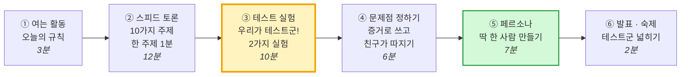
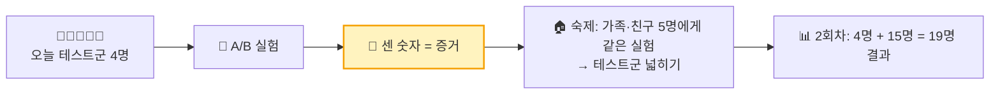
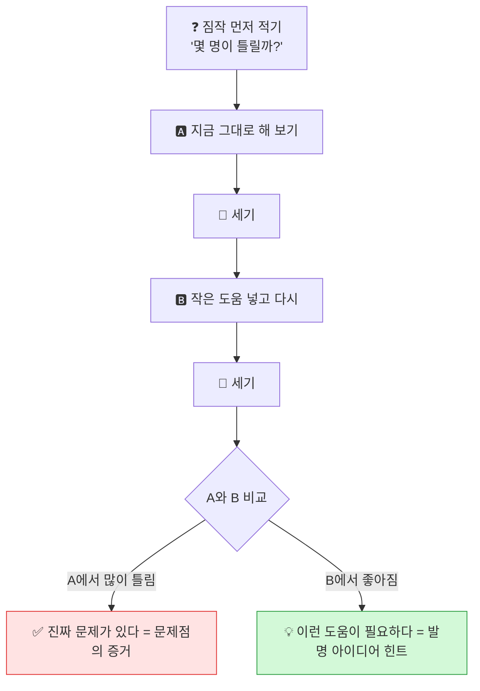
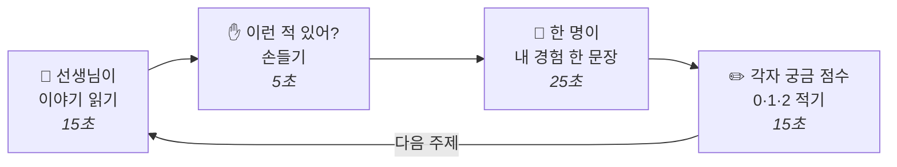
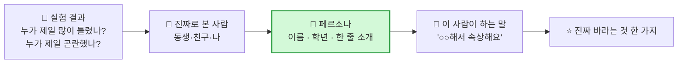
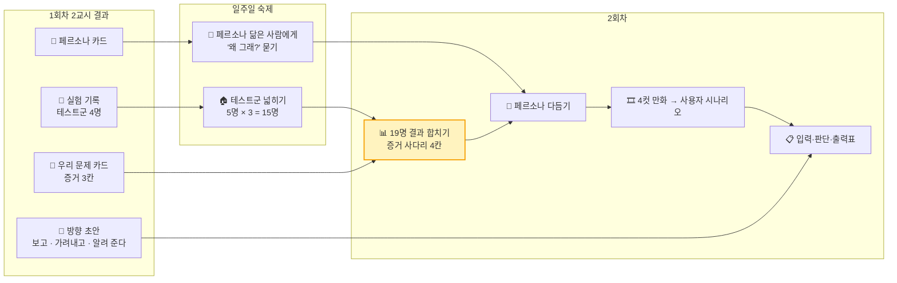

# 1회차 · 2교시 [실습] — 10가지 생활 문제, 우리가 직접 실험해서 찾아요

> **대상** 초등 5학년 3명 · **시간** 40분 · **준비물** A4 용지, 펜, 교실에 있는 물건 (필통·가방·쓰레기 등)
> **이 교시의 성격** 설명은 줄이고 **직접 해 보는 실습 시간**입니다. 10가지 주제로 **함께 이야기**하고, 우리가 **테스트군**이 되어 **실험**해서 **증거**를 모은 뒤, **문제점**과 **페르소나(딱 한 사람)** 까지 정합니다.
> **오늘 가져갈 것** 팀 A4 한 장 — 앞면 **「우리 문제 카드」**, 뒷면 **「페르소나 카드」** + 실험 기록지

---

## 0. 오늘 한눈에

| 순서 | 시간 | 우리가 하는 일 | 아이들 말로 | 남는 것 |
|:---:|:---:|---|---|---|
| ① 여는 활동 | 0~3분 | 오늘의 규칙, 역할 정하기 | "오늘은 **실험하는 날**!" | 역할 |
| ② 스피드 토론 | 3~15분 | 10가지 주제를 1분씩 이야기하고 점수 매기기 | "이런 적 있어?" | 궁금한 주제 2개 |
| ③ 테스트 실험 | 15~25분 | 2개 주제로 A/B 실험 | "진짜인지 **해 보자!**" | 실험 기록 (**센 숫자** = 증거) |
| ④ 문제점 정하기 | 25~31분 | 증거가 센 주제 1개로 문제 카드 쓰기 | "뭐가 문제야? **증거는?**" | 우리 문제 카드 |
| ⑤ 페르소나 | 31~38분 | 그 문제를 겪는 **딱 한 사람** 만들기 | "이 친구는 누구야?" | 페르소나 카드 |
| ⑥ 발표·숙제 | 38~40분 | 소리 내어 읽기, 숙제 안내 | "집에서도 실험해 와!" | 숙제 |

### 0-1. 오늘의 규칙 3가지 (판서 — 아이들에게 그대로 읽어 주기)

| # | 규칙 | 선생님이 하는 말 |
|:---:|---|---|
| 1 | **"그런 것 같아"는 증거가 아니에요** | "직접 **해 보고, 세어 보면** 그게 증거예요." |
| 2 | **먼저 짐작, 그다음 실험** | "실험 전에 '몇 명이 틀릴까?' **먼저 적어요.** 짐작이 틀리면 더 재밌어요." |
| 3 | **따지는 건 선물이에요** | "친구가 '진짜야?' 하고 따지면 **고마워요** 하고 증거를 보여 줘요." |

### 0-2. 테스트군이 뭐예요? (아이들에게 설명)

> "**테스트군**은 **실험에 참여하는 사람들**이에요. 새 약을 만들 때도, 새 게임을 만들 때도 먼저 몇 명이 써 보고 **정말 문제가 있는지, 정말 좋아지는지** 확인해요.
> 오늘은 **우리 3명 + 선생님 = 4명**이 테스트군이에요. 발명가는 만들기 **전에** 먼저 실험해요!"

> **교사 메모** — 4명의 결과는 **결론이 아니라 힌트**입니다. 아이들에게도 "4명은 너무 적어서 **아직 힌트**예요. 그래서 숙제로 더 많은 사람에게 해 봐요"라고 말해 줍니다. 이것이 **테스트군을 넓혀 가는 경험**입니다.

### 0-3. A/B 실험이 뭐예요?

> "**A**는 **지금 그대로** 해 보는 거예요. **B**는 **작은 도움을 하나 넣고** 똑같이 해 보는 거예요. A와 B를 비교하면 **① 진짜 문제가 있는지**, **② 무엇이 도움이 되는지** 둘 다 알 수 있어요."

### 0-4. A4 준비 — 3장

| A4 | 누가 | 어떻게 접나 | 무엇을 쓰나 |
|---|---|---|---|
| **① 토론 점수표** | 각자 | 1교시 A4 **뒷면** | ①~⑩ 번호 + 궁금 점수 (0·1·2) |
| **② 실험 기록지** | 팀 1장 | 가로로 반 접기 (위: 실험 1 / 아래: 실험 2) | 짐작 · A 결과 · B 결과 · 알게 된 것 |
| **③ 팀 카드** | 팀 1장 | 접지 않음 | **앞면** 우리 문제 카드 / **뒷면** 페르소나 카드 |

### 0-5. 3명 역할

| 역할 | 하는 일 | 대사 |
|---|---|---|
| ✍️ **기록 머리** | 실험 기록지와 팀 카드를 쓴다 | "몇 명이었지? 적을게!" |
| 🔍 **조사 눈** | 실험 결과를 세고, 친구 말을 따진다 | "**진짜야? 몇 번이야?**" |
| 🎨 **그림 손** | 페르소나 얼굴을 그리고 발표한다 | "이 친구를 소개할게요!" |

> **교사 메모** — 실험을 할 때는 3명 모두 **테스트군(참여자)** 이 됩니다. 역할은 기록과 정리할 때만 나눕니다.

---

## 1. 10가지 주제 카드

> 선생님이 **"이야기"** 를 읽어 주고 **"이런 적 있어?"** 를 묻습니다. **"숨은 문제점"** 과 **"발명 아이디어 씨앗"** 은 아이들 이야기가 막힐 때 **하나씩만** 꺼내 줍니다. 먼저 다 보여 주면 아이들 생각이 거기서 멈춰요.

### 한눈에 보는 10가지

| # | 장소 | 주제 | 한 줄 이야기 | 실험 이름 | 만들기 쉬움 |
|:---:|:---:|---|---|---|:---:|
| ① | 🏫 | 🍱 급식 반찬이 남아요 | 처음 보는 반찬은 무서워요 | 글자 메뉴 vs 그림 메뉴 | ⭐⭐⭐ |
| ② | 🏫 | ♻️ 분리수거가 헷갈려요 | 이건 어느 통이지? | 3초 분리수거 퀴즈 | ⭐⭐⭐ |
| ③ | 🏫 | 🧦 분실물이 주인을 못 찾아요 | 이 지우개 누구 거야? | 섞인 물건 주인 찾기 | ⭐⭐ |
| ④ | 🏫 | 📢 교실·복도가 시끄러워요 | 나는 안 시끄러운데? | 소리 크기 점수 매기기 | ⭐⭐ |
| ⑤ | 🏠 | 🎮 게임 시간을 자꾸 넘겨요 | 30분이 2시간이 됐어요 | 1분 맞히기 | ⭐⭐ |
| ⑥ | 🏠 | 🧍 숙제할 때 자세가 무너져요 | 어느새 거북목! | 3분 자세 몰래 체크 | ⭐⭐⭐ |
| ⑦ | 🏠 | 🐶 반려동물·식물 돌보기를 깜빡해요 | 오늘 누가 물 줬지? | 누가 줬지? 기억 게임 | ⭐⭐⭐ |
| ⑧ | 🏢 | 🚌 학원 차 시간을 놓쳐요 | 놀다 보니 벌써 시간이! | 2분 스스로 멈추기 | ⭐ |
| ⑨ | 🏢 | 🔤 영어 단어가 안 외워져요 | 외웠는데 다음 날 까먹어요 | 30초 단어 외우기 두 방법 | ⭐⭐ |
| ⑩ | 🏢 | 🎒 요일마다 가방 챙기기가 헷갈려요 | 수학 날에 영어 책을 가져왔어요 | 지금 내 가방 검사 | ⭐⭐⭐ |

> **만들기 쉬움** — 5회차(웹캠이 보고 가려내기)·6회차(마이크로비트 불빛·소리)로 이어지기 쉬운 정도입니다. ⭐이어도 고르면 막지 않습니다. 실험하다 보면 아이들이 **스스로** 알게 됩니다.

---

### ① 🍱 급식 반찬이 남아요

> **이야기** — "오늘 급식에 처음 보는 반찬이 나왔어요. 이름이 '톳무침'이래요. 무슨 맛인지 몰라서 한 입도 안 먹고 버렸어요. 옆 친구도 그냥 버리더라고요."

| 항목 | 내용 |
|---|---|
| 🙋 **이런 적 있어?** | 이름만 듣고 먹기 싫었던 반찬이 있어? / 싫어하는 반찬을 몰래 버린 적 있어? |
| 🔍 **숨은 문제점** | ① 받기 **전에** 무슨 맛인지 몰라요 ② "조금만 주세요"라고 말하기가 어려워요 ③ 매일 얼마나 버리는지 **아무도 세지 않아요** |
| 🧪 **교실 실험 (5분)** | **A 글자 메뉴** — 선생님이 A4에 처음 보는 반찬 이름 3개를 글자로만 써서 보여 줘요 → "먹어 볼래?" O/X **B 그림 메뉴** — 같은 반찬을 그림 + 맛 설명("짭짤하고 꼬들꼬들한 바다 나물")으로 보여 줘요 → 다시 O/X |
| 🔢 **세는 것** | A에서 O 몇 개? B에서 O 몇 개? (4명 × 3반찬 = 12칸) |
| 💡 **발명 아이디어 씨앗** | 👁️ 반찬 사진을 보고 → 🧠 달콤·짭짤·매콤을 가려내서 → 💡 받기 전에 그림과 불빛으로 알려 줘요 👁️ 다 먹은 식판을 보고 → 🧠 많이 남음·조금·다 먹음을 가려내서 → 💡 색깔 불빛으로 칭찬해요 |
| 👤 **페르소나 예시** | **민지 (2학년)** — "모르는 반찬은 무서워요. 맛만 알면 먹어 볼 수 있는데." |
| ⭐ **만들기 쉬움** | ⭐⭐⭐ |

### ② ♻️ 분리수거가 헷갈려요

> **이야기** — "우유를 다 마시고 우유갑을 버리려는데, 종이통에 넣어야 할지 일반쓰레기에 넣어야 할지 모르겠어요. 뒤에 친구들이 기다려서 그냥 아무 데나 넣었어요."

| 항목 | 내용 |
|---|---|
| 🙋 **이런 적 있어?** | 버리려다 멈칫한 물건 있어? / 몰라서 그냥 일반쓰레기에 넣은 적 있어? |
| 🔍 **숨은 문제점** | ① **헷갈리는 물건**은 늘 같은 것만 헷갈려요 ② 통에 붙은 안내가 **작고 글자뿐**이에요 ③ 알아도 **귀찮아서** 가까운 통에 넣어요 (몰라서? 귀찮아서? 실험으로 확인!) |
| 🧪 **교실 실험 (5분)** | **A 그냥 퀴즈** — 선생님이 물건 이름 4개(카드 1)를 하나씩 불러 줘요 → **3초 안에** 통 이름 적기 **B 힌트표 퀴즈** — A4에 그린 "통별 그림 힌트표"를 보면서 다른 물건 4개(카드 2)를 3초 안에 적기 |
| 🔢 **세는 것** | A 정답 몇 개? B 정답 몇 개? **제일 많이 틀린 물건**은? |
| 💡 **발명 아이디어 씨앗** | 👁️ 물건을 카메라에 보여 주면 → 🧠 플라스틱·종이·캔·비닐을 가려내서 → 💡 맞는 통에 불이 켜져요 👁️ 헷갈리는 물건만 모아서 → 🧠 자주 틀리는 것 순위를 → 💡 통 앞에 크게 보여 줘요 |
| 👤 **페르소나 예시** | **준호 (3학년)** — "우유갑이 종이인지 아닌지 매일 헷갈려요. 틀리면 선생님한테 혼날까 봐요." |
| ⭐ **만들기 쉬움** | ⭐⭐⭐ (강사 예제 파일 있음) |

### ③ 🧦 분실물이 주인을 못 찾아요

> **이야기** — "교실 뒤 분실물 바구니에 지우개, 필통, 물병, 겉옷이 잔뜩 쌓여 있어요. 그런데 아무도 안 찾아가요. 내 것도 저기 있을지 몰라요."

| 항목 | 내용 |
|---|---|
| 🙋 **이런 적 있어?** | 물건을 잃어버리고 못 찾은 적 있어? / 분실물 바구니를 뒤져 본 적 있어? |
| 🔍 **숨은 문제점** | ① 물건에 **이름이 없어요** ② 비슷한 물건이 많아서 **내 것인지 헷갈려요** ③ 바구니를 뒤지기가 **귀찮고 창피해요** |
| 🧪 **교실 실험 (5분)** | **A 섞인 물건 주인 찾기** — 3명이 지우개·연필을 하나씩 몰래 선생님에게 줘요. 선생님이 섞어서 책상에 놓으면 **내 것 찾기**. 시간 재기 **B 특징 카드** — 다른 물건으로 다시 하되, 먼저 A4 조각에 **내 물건 특징 1개**("모서리가 닳은 파란 지우개")를 적어 두고 찾기 |
| 🔢 **세는 것** | ① 필통 속 물건 중 **이름 쓴 것 몇 개 / 전체 몇 개** ② A 걸린 시간 vs B 걸린 시간 ③ 헷갈린 사람 수 |
| 💡 **발명 아이디어 씨앗** | 👁️ 분실물 사진을 보고 → 🧠 필통·물병·옷을 가려내서 → 💡 종류별로 "새 분실물 도착!" 알려 줘요 👁️ 물건 특징을 보고 → 🧠 "우리 반 누구 것과 비슷한지" → 💡 주인 후보에게 알려 줘요 |
| 👤 **페르소나 예시** | **서연 (5학년)** — "지우개를 일주일에 한 번은 잃어버려요. 바구니 뒤지는 건 좀 창피해요." |
| ⭐ **만들기 쉬움** | ⭐⭐ |

### ④ 📢 교실·복도가 시끄러워요

> **이야기** — "쉬는 시간에 교실이 너무 시끄러워서 책을 못 읽겠어요. 그런데 떠드는 친구들은 '우리 안 시끄러운데?'래요. 복도 모퉁이에서는 뛰다가 부딪힐 뻔했어요."

| 항목 | 내용 |
|---|---|
| 🙋 **이런 적 있어?** | 시끄러워서 짜증 난 적 있어? / 내가 시끄럽다는 말을 들은 적 있어? / 모퉁이에서 부딪힐 뻔한 적 있어? |
| 🔍 **숨은 문제점** | ① **얼마나 시끄러운지** 사람마다 다르게 느껴요 ② 떠드는 사람은 **스스로 잘 몰라요** ③ 모퉁이 너머는 **안 보여요** |
| 🧪 **교실 실험 (5분)** | **A 느낌 점수** — 모두 눈을 감아요. 선생님이 소리 5개(책상 톡톡 · 책 덮기 · 보통 말소리 · 손뼉 · 의자 끌기)를 내면 각자 **1~5점**을 적어요 **B 기준표 점수** — A4에 그린 기준표(1 속삭임 · 2 조용한 말 · 3 보통 말 · 4 큰 소리 · 5 소리침)를 보고 같은 소리를 다시 점수 매겨요 |
| 🔢 **세는 것** | 소리마다 **제일 높은 점수 − 제일 낮은 점수** (차이가 클수록 사람마다 다르게 느낀다는 증거) → A 차이 vs B 차이 |
| 💡 **발명 아이디어 씨앗** | 👁️ 소리 크기를 듣고 → 🧠 조용·보통·시끄러움을 가려내서 → 💡 교실 앞에 초록·노랑·빨강 불빛 👁️ 모퉁이에 사람이 오는 걸 보고 → 🧠 있음·없음을 가려내서 → 💡 반대편에 "천천히!" 불빛 |
| 👤 **페르소나 예시** | **하은 (4학년)** — "쉬는 시간에 책 읽는 게 좋은데, 시끄럽다고 말하면 친구들이 싫어해요." |
| ⭐ **만들기 쉬움** | ⭐⭐ |

### ⑤ 🎮 게임 시간을 자꾸 넘겨요

> **이야기** — "엄마랑 게임은 30분만 하기로 약속했어요. 그런데 한 판만 더 하다 보니 2시간이 지났어요. 엄마한테 혼나고 둘 다 기분이 나빠졌어요."

| 항목 | 내용 |
|---|---|
| 🙋 **이런 적 있어?** | 약속한 시간을 넘긴 적 있어? / 게임하다가 "벌써?" 한 적 있어? |
| 🔍 **숨은 문제점** | ① 재밌으면 **시간 가는 걸 못 느껴요** ② 끝내라는 말이 **갑자기** 와서 억울해요 ③ 규칙을 **내가 아니라 부모님이** 정해서 지키기 싫어요 |
| 🧪 **교실 실험 (5분)** | **A 가만히 1분 맞히기** — 모두 눈을 감고, 속으로 1분이 됐다 싶으면 조용히 손을 들어요. 선생님이 **실제 시간**을 적어요 **B 몰입 1분 맞히기** — A4에 그림을 그리면서(재밌는 걸 하면서) 1분 됐다 싶으면 손 들기 |
| 🔢 **세는 것** | 각자 **60초와의 차이** (예: 42초에 손 → 18초 차이). A 차이 vs B 차이 — **재밌는 걸 하면 더 틀릴까?** |
| 💡 **발명 아이디어 씨앗** | 👁️ 화면 앞에 앉은 모습을 보고 → 🧠 오래 봄·잠깐 봄을 가려내서 → 💡 끝나기 5분 전에 **부드러운** 불빛 신호 👁️ 내가 정한 규칙을 보고 → 🧠 지켰음·못 지켰음 → 💡 지키면 별 모으기 |
| 👤 **페르소나 예시** | **도윤 (5학년)** — "진짜 30분만 하려고 했어요. 근데 시간이 너무 빨리 가요." |
| ⭐ **만들기 쉬움** | ⭐⭐ |

### ⑥ 🧍 숙제할 때 자세가 무너져요

> **이야기** — "처음엔 바르게 앉아서 숙제를 시작해요. 그런데 끝날 때쯤 보면 얼굴이 공책에 붙어 있고 목이 아파요. 언제 그렇게 됐는지 모르겠어요."

| 항목 | 내용 |
|---|---|
| 🙋 **이런 적 있어?** | 숙제하다가 목·허리가 아픈 적 있어? / "허리 펴!"라는 말을 자주 들어? |
| 🔍 **숨은 문제점** | ① 자세가 무너지는 **순간을 스스로 몰라요** ② 누가 말해 줘야만 알아요 ③ 말해 주면 **잔소리처럼** 들려요 |
| 🧪 **교실 실험 (5분)** | **A 몰래 체크** — 한 명(쓰는 사람)이 2분 동안 선생님이 불러 주는 문장을 A4에 따라 써요. 다른 두 명이 **20초마다** 자세를 몰래 체크(바름 ⭕ / 구부정 ❌). 끝나면 쓴 사람이 **"나 몇 번 구부정했을 것 같아?"** 먼저 짐작 **B 신호 넣기** — 쓰는 사람을 바꿔서 다시 하되, 선생님이 **40초마다 책상을 톡톡** 두 번 쳐 줘요 |
| 🔢 **세는 것** | ① **짐작 vs 실제** 구부정 횟수 (차이가 크면 "스스로 모른다"는 증거) ② A 구부정 횟수 vs B 구부정 횟수 |
| 💡 **발명 아이디어 씨앗** | 👁️ 웹캠으로 앉은 모습을 보고 → 🧠 바른 자세·구부정을 가려내서 → 💡 구부정하면 **작은 소리나 진동** 👁️ 얼굴과 공책 사이 거리를 보고 → 🧠 가까움·적당함 → 💡 불빛 색 |
| 👤 **페르소나 예시** | **지훈 (6학년)** — "엄마가 허리 펴라고 하면 짜증 나요. 그냥 나 혼자 알 수 있으면 좋겠어요." |
| ⭐ **만들기 쉬움** | ⭐⭐⭐ |

### ⑦ 🐶 반려동물·식물 돌보기를 깜빡해요

> **이야기** — "우리 집 강아지 물그릇이 비어 있었어요. 엄마는 제가 준 줄 알았고, 저는 아빠가 준 줄 알았어요. 결국 아무도 안 줬어요."

| 항목 | 내용 |
|---|---|
| 🙋 **이런 적 있어?** | 식물이 말라 버린 적 있어? / "누가 밥 줬어?" 하고 가족끼리 물어본 적 있어? |
| 🔍 **숨은 문제점** | ① **누가 줬는지 기억**이 안 나요 (두 번 주거나, 아무도 안 주거나) ② 비었는지 **매번 가서 봐야** 해요 ③ 가족마다 "내 일"이라고 생각하지 않아요 |
| 🧪 **교실 실험 (5분)** | **A 듣고 기억하기** — 선생님이 "우리 집 일주일 이야기"(부록)를 한 번 읽어 줘요. 끝나고 질문 3개("수요일에 물 준 사람은?")에 답하기 **B 표 그리며 듣기** — 다른 이야기를 들으면서 A4에 **요일 표**에 체크하며 듣고, 같은 질문에 답하기 |
| 🔢 **세는 것** | A 정답 몇 개 vs B 정답 몇 개 + "어제 우리 집 반려동물·식물에게 **누가** 줬는지 **확실히 아는 사람**" 손들기 |
| 💡 **발명 아이디어 씨앗** | 👁️ 그릇·화분 사진을 보고 → 🧠 빔·있음(마름·촉촉)을 가려내서 → 💡 비면 불빛 👁️ 준 사람을 보고 → 🧠 오늘 줬음·안 줬음 → 💡 현관에 오늘의 체크 표시 |
| 👤 **페르소나 예시** | **유나 (5학년)** — "몽이 밥은 내가 챙기기로 했는데, 학원 다녀오면 까먹어요." |
| ⭐ **만들기 쉬움** | ⭐⭐⭐ |

### ⑧ 🚌 학원 차 시간을 놓쳐요

> **이야기** — "놀이터에서 친구랑 놀다가 학원 차 시간을 놓쳤어요. 요일마다 시간이 달라서 헷갈려요. 결국 뛰어서 갔는데 늦었어요."

| 항목 | 내용 |
|---|---|
| 🙋 **이런 적 있어?** | 학원 차를 놓치거나 늦은 적 있어? / 오늘 몇 시에 학원 가는지 헷갈린 적 있어? |
| 🔍 **숨은 문제점** | ① **요일마다 시간**이 달라요 ② 놀 때는 **시계를 안 봐요** ③ 알람이 **너무 일찍** 울리면 무시하고, **너무 늦게** 울리면 못 가요 |
| 🧪 **교실 실험 (5분)** | **A 스스로 멈추기** — 3명이 끝말잇기를 해요. "**2분 되면 스스로 멈추기!**" (시계 보기 금지) 선생님이 실제 멈춘 시간을 적어요 **B 30초 전 신호** — 다시 끝말잇기, 이번엔 선생님이 1분 30초에 **"톡" 한 번** 신호를 줘요 |
| 🔢 **세는 것** | A에서 2분에 가깝게 멈춘 사람 수 vs B + 보지 않고 **이번 주 학원 요일·시간**을 몇 개 적을 수 있나 |
| 💡 **발명 아이디어 씨앗** | 👁️ 오늘 요일과 시간을 보고 → 🧠 여유·곧 출발·지금 출발을 가려내서 → 💡 단계별 불빛 (초록→노랑→빨강) |
| 👤 **페르소나 예시** | **시우 (4학년)** — "월수금은 4시, 화목은 3시 반이라 맨날 헷갈려요." |
| ⭐ **만들기 쉬움** | ⭐ — 시계·알람으로도 되는 문제라 **AI가 꼭 필요한지** 실험하며 이야기해 보기 좋아요 |

### ⑨ 🔤 영어 단어가 안 외워져요

> **이야기** — "단어 시험 전날 밤에 20개를 한꺼번에 외웠어요. 시험은 겨우 봤는데, 일주일 뒤에 물어보니까 하나도 기억이 안 나요."

| 항목 | 내용 |
|---|---|
| 🙋 **이런 적 있어?** | 몰아서 외운 적 있어? / 외웠는데 금방 까먹은 적 있어? |
| 🔍 **숨은 문제점** | ① **틀린 단어만** 따로 모아 볼 방법이 없어요 ② 글자만 보고 외우면 **지루해요** ③ 혼자 외우면 **맞았는지 확인**이 안 돼요 |
| 🧪 **교실 실험 (5분)** | **A 그냥 보기** — 선생님이 A4에 쓴 단어 6개(목록 A)를 **30초 동안 보기만** 해요. 1분 동안 다른 이야기를 한 뒤 기억나는 단어 쓰기 **B 그림 그리기** — 다른 단어 6개(목록 B)를 30초 동안 **작게 그림을 그리면서** 보기 → 1분 뒤 쓰기 |
| 🔢 **세는 것** | A 기억한 개수 vs B 기억한 개수 + **모두가 틀린 단어**는? |
| 💡 **발명 아이디어 씨앗** | 👁️ 단어 카드나 물건을 카메라에 보여 주면 → 🧠 무슨 단어인지 가려내서 → 💡 맞으면 딩동 소리 👁️ 내가 틀린 단어를 보고 → 🧠 자주 틀림·가끔 틀림 → 💡 틀린 것만 다시 퀴즈 |
| 👤 **페르소나 예시** | **예린 (5학년)** — "외울 땐 아는 것 같은데, 시험 보면 반은 까먹어요." |
| ⭐ **만들기 쉬움** | ⭐⭐ |

### ⑩ 🎒 요일마다 가방 챙기기가 헷갈려요

> **이야기** — "화요일은 수학 학원, 목요일은 영어 학원이에요. 그런데 화요일에 영어 책을 들고 갔어요. 수학 문제집이 없어서 선생님께 빌렸어요."

| 항목 | 내용 |
|---|---|
| 🙋 **이런 적 있어?** | 준비물을 빠뜨린 적 있어? / 필요 없는 책까지 들고 다녀서 가방이 무거운 적 있어? |
| 🔍 **숨은 문제점** | ① **요일마다 준비물**이 달라요 ② 현관에서 나갈 때 **확인할 시간이 없어요** ③ 빠뜨릴까 봐 **다 넣고 다녀서** 가방이 무거워요 |
| 🧪 **교실 실험 (5분)** | **A 지금 내 가방 검사** — 가방을 열고 ① 오늘 **필요 없는** 물건 몇 개 ② 오늘 필요한데 **빠진** 물건 몇 개 세기 **B 머릿속 챙기기 vs 표 보고 챙기기** — "내일 가방에 넣을 것"을 먼저 **보지 않고** 적어요. 그다음 A4에 요일 준비물 표를 만들고 **표를 보고** 다시 적어요. 빠뜨린 것 비교 |
| 🔢 **세는 것** | 필요 없는 물건 수 / 빠진 물건 수 / 표 없이 적은 개수 vs 표 보고 적은 개수 |
| 💡 **발명 아이디어 씨앗** | 👁️ 가방 속 책을 카메라에 보여 주면 → 🧠 오늘 필요한 책·필요 없는 책을 가려내서 → 💡 현관에서 초록·빨강 불빛 👁️ 요일을 보고 → 🧠 오늘 준비물 목록을 → 💡 나가기 전에 소리로 알려 줌 |
| 👤 **페르소나 예시** | **건우 (5학년)** — "가방이 너무 무거워요. 근데 빼면 꼭 필요한 날 없어요." |
| ⭐ **만들기 쉬움** | ⭐⭐⭐ |

---

## 2. 수업 흐름 (40분)

### ① 여는 활동 · 0~3분 — "오늘은 실험하는 날!"

> "1교시에 **'그런 것 같아'는 증거가 아니다**라고 배웠죠? 오늘은 **진짜 증거**를 만들어 볼 거예요. 우리가 **테스트군**이 돼서 직접 실험해요!"

1. **오늘의 규칙 3가지** 판서를 읽어요. (1분)
2. **테스트군 · A/B 실험** 뜻을 설명해요. (0-2, 0-3) (1분)
3. **역할** 정하기 — 기록 머리 · 조사 눈 · 그림 손 (1분)

---

### ② 스피드 토론 10라운드 · 3~15분 — "이런 적 있어?"

#### 한 라운드 = 1분

| 시간 | 할 일 |
|:---:|---|
| 3~13분 (10분) | 주제 ①~⑩을 1분씩. 말하는 사람은 **돌아가며** (A → B → C → A …) |
| 13~15분 (2분) | 점수 합계 → **실험할 주제 2개** 고르기 |

#### 말하기 틀 (판서 — 이 문장으로 말해요)

| 상황 | 말하기 틀 |
|---|---|
| 내 경험 말하기 | "나는 **[언제]** 에 **[무엇]** 때문에 불편했어." |
| 다른 생각 말하기 | "나는 좀 달라. 나는 **[어떤데]**." |
| 궁금할 때 | "그거 **진짜인지 실험해 보자!**" |

#### 궁금 점수 (1교시 A4 뒷면)

| 점수 | 뜻 |
|:---:|---|
| **2** | "나도 겪었어! 실험해 보고 싶어!" |
| **1** | "들어 본 적 있어. 좀 궁금해." |
| **0** | "나랑은 상관없는 것 같아." |

| 주제 | ① | ② | ③ | ④ | ⑤ | ⑥ | ⑦ | ⑧ | ⑨ | ⑩ |
|---|:---:|:---:|:---:|:---:|:---:|:---:|:---:|:---:|:---:|:---:|
| 학생 A | | | | | | | | | | |
| 학생 B | | | | | | | | | | |
| 학생 C | | | | | | | | | | |
| **합계** | | | | | | | | | | |

> **동점이면** — "**직접 겪어 본 사람**이 더 많은 주제"로. 그래도 같으면 **실험이 더 재밌어 보이는 것**으로!
> **교사 메모** — 1분이 짧게 느껴져도 끊어 주세요. 여기는 **넓게 훑는 시간**이고, 깊이 파는 건 ③에서 합니다. 아이가 신나게 더 말하고 싶어 하면 "그 이야기는 실험 끝나고 문제 카드에 쓰자!"

---

### ③ 테스트 실험 · 15~25분 — "진짜인지 해 보자!"

> 고른 **주제 2개**의 실험을 **5분씩** 해요. 방법은 1장의 각 주제 카드 🧪 칸, 준비물은 **3장 부록**에 있어요.

#### 실험 한 번 = 5분

| 순서 | 할 일 | 시간 | 실험 기록지에 쓰기 |
|:---:|---|:---:|---|
| 1 | **짐작 먼저!** "A에서 몇 명이 틀릴까? B는?" | 30초 | 🤔 짐작: ___ |
| 2 | **A 실험** (지금 그대로) | 1분 30초 | 🅰️ 결과: ___ |
| 3 | **B 실험** (작은 도움 넣기) | 1분 30초 | 🅱️ 결과: ___ |
| 4 | **세고 비교하기** — 🔍 조사 눈이 숫자를 세요 | 1분 | A __ vs B __ |
| 5 | **알게 된 것** 한 문장 | 30초 | 💡 "우리가 알게 된 건 ___" |

#### 실험 기록지 (팀 A4 ② — 위·아래 반씩)

| 칸 | 실험 1: 주제 ( ) | 실험 2: 주제 ( ) |
|---|---|---|
| 🤔 **짐작** | | |
| 🅰️ **A 결과** (지금 그대로) | | |
| 🅱️ **B 결과** (작은 도움) | | |
| 🔢 **비교** | A ___ vs B ___ | A ___ vs B ___ |
| 😮 **짐작이 맞았나?** | 맞음 / 틀림 | 맞음 / 틀림 |
| 💡 **알게 된 것** | | |
| 🪜 **증거 사다리** | 3칸 (센 숫자) ✔ | 3칸 (센 숫자) ✔ |

> **발문 (실험 끝날 때마다)**
> - "짐작이랑 결과가 **달랐어요?** 뭐가 제일 놀라웠어요?"
> - "A에서 많이 틀렸다면 → **진짜 문제가 있다는 증거**예요."
> - "B에서 좋아졌다면 → **그런 도움을 주는 발명품**이 필요하다는 **힌트**예요."

> **교사 메모 — 1교시와의 연결** — 실험으로 **센 숫자**가 생기면 근거 사다리 **3칸**입니다. 1교시에서 "오늘 목표는 2칸"이라고 했는데, 실험 덕분에 **교실 안에서 3칸**까지 올라갑니다. 짐작을 먼저 적게 하는 것은 1교시에서 말한 **예상 → 해 보기 → 돌아보기**(OECD AAR) 연습이기도 합니다.

> **시간이 남으면** — 탈락한 주제 중 **3등 주제**의 실험을 하나 더 해도 좋아요. 테스트는 많이 할수록 좋아요!

---

### ④ 문제점 정하기 · 25~31분 — "뭐가 문제야? 증거는?"

#### 어떤 주제로 할까? (1분)

> "실험 2개 중에서 **A에서 더 많이 틀린 쪽**, 즉 **증거가 더 센 쪽**을 골라요. 그래도 고민되면 **더 풀고 싶은 쪽**!"

#### 「우리 문제 카드」 (팀 A4 ③ 앞면, 4분) — ✍️ 기록 머리가 써요

| 칸 | 질문 (아이들 말) | 예시 (② 분리수거로 실험했다면) |
|---|---|---|
| **① 어떤 장면?** | 누가, 언제, 어디서? | 쉬는 시간에 우리 반 친구들이 교실 뒤 분리수거함 앞에서 |
| **② 뭐가 문제야?** | 한 문장으로! (**로봇·앱 같은 해결책은 쓰지 않기**) | 헷갈리는 물건을 보면 **어느 통인지 몰라서** 아무 데나 넣는다 |
| **③ 증거는?** | 실험에서 **센 숫자** | 3초 퀴즈에서 4명이 8개 중 평균 **3개**만 맞혔다. **우유갑**은 4명 모두 틀렸다 |
| **④ 친구가 따진 말은?** | 🔍 조사 눈이 따지고, 팀이 대답 | "몰라서가 아니라 **귀찮아서** 아냐?" → 힌트표를 보니 **6개**를 맞혔다. 알려 주면 잘한다 → **몰라서가 맞다** |
| **⑤ 더 확인할 것은?** | 아직 모르는 것 | 다른 반·저학년도 그럴까? → 숙제로 5명 더 실험 |
| **⑥ 이게 왜 중요해?** | 안 풀리면 누가 어떻게 돼? | 재활용이 안 되고, 틀린 친구가 혼날까 봐 걱정한다 |
| **⑦ 방향 (초안)** | 무엇을 **보고** → 무엇을 **가려내서** → 어떻게 **알려 줄까?** | 물건을 보고 → 플라스틱·종이·캔·비닐을 가려내서 → 맞는 통에 불빛 |

#### 따지기 한 판 (1분)

> 🔍 **조사 눈**이 아래 질문 중 **하나**를 골라 따져요. 팀은 **실험 숫자로** 대답해요.

| ⚔️ 따지는 질문 | 대답하는 법 |
|---|---|
| "**그건 너만 그런 거 아니야?**" | "4명 중 ○명이 그랬어." |
| "**몇 번이야? 진짜 셌어?**" | "A에서 ○개, B에서 ○개였어." |
| "**다른 이유는 없어?**" | "B에서 좋아진 걸 보면 ○○ 때문이야." / 모르면 → **⑤ 더 확인할 것**에 적기 |

> **교사 메모** — ② 칸에 "AI 로봇이 필요하다"처럼 **해결책**이 들어가면, "좋은 아이디어네! 그건 **⑦ 방향** 칸에 옮기자. ②에는 **지금 누가 곤란한지**만 써요"라고 안내합니다. (PD수첩 속 광주 초등학교 교사들의 기준: "문제 안에 답의 방향을 너무 많이 알려 주지 않기")

---

### ⑤ 페르소나 만들기 · 31~38분 — "이 문제를 겪는 딱 한 사람"

#### 페르소나가 뭐예요? (1분, 아이들에게)

> "'**모두**가 불편해요'라고 하면, 누구를 위해 만드는지 몰라요. 그래서 발명가들은 문제를 겪는 **딱 한 사람**을 정해요. 이름도, 학년도, 좋아하는 것도 있는 **진짜 같은 한 사람**이요. 이 사람을 **페르소나**라고 해요.
> 비밀 하나! 페르소나는 **상상 속 사람이 아니에요.** 오늘 **실험에서 제일 곤란했던 사람**, 또는 **진짜로 본 사람**을 닮게 만들어요. 우리 중 한 명이어도 괜찮아요!"

#### 「페르소나 카드」 (팀 A4 ③ 뒷면, 5분) — 🎨 그림 손이 얼굴 그리기, ✍️ 기록 머리가 쓰기

| 칸 | 질문 (아이들 말) | 예시 (분리수거) |
|---|---|---|
| **😊 얼굴 그림** | 크게 그려요! (옷, 표정, 들고 있는 물건까지) | 우유갑을 들고 두리번거리는 아이 |
| **이름 · 학년** | 진짜 이름 말고 **가짜 이름** | **준호 · 3학년** |
| **어떤 아이야?** | 한 줄 소개 | 급식 우유를 꼭 다 마시는 착한 아이. 틀리는 걸 싫어해요 |
| **언제·어디서 곤란해?** | 장면 하나 | 쉬는 시간, 교실 뒤 분리수거함 앞 |
| **지금은 어떻게 해?** | 지금 쓰는 방법 | 옆 친구가 넣는 통에 따라 넣어요. 친구도 틀리면 같이 틀려요 |
| **왜 곤란해? (증거)** | **우리 실험 결과**와 연결 | 우리 실험에서 우유갑은 **4명 모두** 틀렸다. 준호도 헷갈릴 거예요 |
| **💬 준호가 하는 말** | 말풍선 한 문장 | "이거 종이야? 아닌 것 같은데… 그냥 여기 넣을래." |
| **⭐ 진짜 바라는 것** | 딱 **한 가지** | 틀리지 않고 **자신 있게** 버리고 싶어요 |

> **교사 메모**
> - "**모두**", "**사람들**"이라고 쓰면 → "그중에 **딱 한 명**만 골라 볼까? 몇 학년이야?"
> - "진짜 바라는 것"에 **해결책**("로봇이 있으면 좋겠다")을 쓰면 → "로봇이 생기면 준호는 **어떤 기분**이 되고 싶어?" → "자신 있게"처럼 **마음**으로 바꿔 줍니다.
> - 페르소나의 **"왜 곤란해?"** 칸이 오늘 실험 숫자와 이어지면 **아주 잘한 것**입니다. 이게 1교시에서 말한 **"근거로 붙잡은 문제"** 예요.

#### 페르소나 소개 (1분)

> 🎨 **그림 손**이 카드를 들고 1인칭으로 소개해요: "안녕, 나는 **3학년 준호**야. 나는 쉬는 시간에 분리수거할 때 **우유갑이 너무 헷갈려.** 내가 바라는 건 **자신 있게 버리는 거**야!"

---

### ⑥ 발표 · 숙제 · 38~40분 — "테스트군을 넓혀 와요!"

1. **3명 동의 확인** — 문제 카드와 페르소나가 괜찮은지 **엄지 척** 투표. 한 명이라도 👎면 이유를 카드 여백에 적어요. (30초)
2. **숙제 안내** (1분 30초)

> "오늘 테스트군은 **4명**이었어요. 4명은 너무 적어서 **아직 힌트**예요. 그래서 숙제는 **테스트군 넓히기!** 오늘 한 실험을 **가족·친구 5명**에게 똑같이 해 보고 숫자를 적어 와요. 3명이 5명씩이면 **15명**, 오늘 4명까지 합치면 **19명**이 돼요!"

| 숙제 칸 | 1 | 2 | 3 | 4 | 5 |
|---|:---:|:---:|:---:|:---:|:---:|
| 누구? (가족·친구, 이름 대신 "엄마", "동생 A") | | | | | |
| 몇 학년 / 어른? | | | | | |
| 🅰️ A 결과 | | | | | |
| 🅱️ B 결과 | | | | | |
| 한 말 (그대로 적기) | | | | | |

> + **페르소나를 닮은 사람**을 한 명 찾아서 "**왜 그래?**" 하고 물어보고, 대답을 **그대로** 적어 와요.

> **안전·예의 메모** — 실험과 질문은 **아는 사람**에게만, 먼저 "실험 하나 도와줄래?" 하고 **허락**을 받아요. 이름 대신 "동생 A"처럼 적고, 사진을 찍으면 **얼굴이 나오지 않게** 해요.

---

## 3. 부록 — 실험 준비물 (교사용)

> 모두 **A4와 펜**으로 준비할 수 있습니다. 수업 전에 **10가지 모두** 준비해 두면, 아이들이 어떤 주제를 골라도 바로 실험할 수 있어요. (A4 4장 정도)

| 주제 | 미리 준비할 것 | 내용 |
|:---:|---|---|
| ① 급식 | A4 2장 (글자 메뉴 / 그림 메뉴) | **글자**: 톳무침 · 가지볶음 · 우엉조림 **그림+설명**: "짭짤하고 꼬들꼬들한 바다 나물" · "부드럽고 달콤한 보라색 채소" · "달콤짭짤하고 쫄깃한 뿌리채소" (간단한 그림 곁들이기) |
| ② 분리수거 | 물건 카드 2세트 + 통별 그림 힌트표 A4 1장 | **카드 1 (A용)**: 우유갑 · 과자 봉지 · 영수증 · 음료 캔 **카드 2 (B용)**: 라벨 붙은 페트병 · 택배 상자 · 컵라면 용기 · 요구르트병 ※ 정답은 **우리 학교·지역 분리배출 기준**으로 미리 확인 (예: 우유갑 = 종이팩 따로, 영수증 = 대부분 일반쓰레기, 페트병 = 라벨 떼고 투명 페트) |
| ③ 분실물 | A4를 8조각 (특징 카드) | 아이들 지우개·연필 사용. 시간은 교사 휴대폰 타이머 |
| ④ 소음 | 소리 크기 기준표 A4 1장 | 1 속삭임 🤫 · 2 조용한 말 🙂 · 3 보통 말 🗣️ · 4 큰 소리 📣 · 5 소리침 😱 (그림으로) 소리 순서: 책상 톡톡 → 책 덮기 → 보통 말소리 → 손뼉 → 의자 끌기 |
| ⑤ 게임 시간 | 교사 타이머, 기록용 A4 | A·B 각각 4명의 "손 든 시간" 기록 칸 |
| ⑥ 자세 | 따라 쓸 문장 1개 + 체크표 | 문장 예: "나는 오늘 우리 반에서 불편한 것을 찾아서 실험을 했다. 짐작과 결과가 달라서 신기했다." 체크표: 20초 / 40초 / 60초 / 80초 / 100초 / 120초 (⭕·❌) |
| ⑦ 돌보기 | 이야기 2개 + 질문 | **이야기 A**: "월요일엔 엄마가 화분에 물을 줬어요. 화요일엔 아빠가 강아지 밥을 줬어요. 수요일엔 아무도 안 줬어요. 목요일엔 내가 물을 줬어요. 금요일엔 누나가 밥과 물을 다 줬어요." → Q: 수요일에 누가? / 강아지 밥을 준 사람 두 명은? / 화분에 물을 준 날은 며칠? **이야기 B**: 사람·요일을 바꿔서 같은 형식으로 |
| ⑧ 학원 차 | 교사 타이머 | 끝말잇기 시작 단어: "기차", "사과" |
| ⑨ 영어 단어 | A4 2장 (목록 A / 목록 B) | **목록 A**: apple · river · window · chair · cloud · pencil **목록 B**: tiger · bread · mirror · candle · bridge · rocket (아이들 수준에 맞게 교체 가능 — 두 목록의 **난이도를 비슷하게**) |
| ⑩ 가방 | 요일 준비물 표 틀 A4 1장 | 월~금 칸만 그려 두고, 아이들이 채우게 |

---

## 4. 좋은 문제 vs 아쉬운 문제 (아이들과 같이 보기)

| 😕 아쉬운 문제 | 왜 아쉬워? | 😀 이렇게 바꾸면 좋아요 |
|---|---|---|
| "환경이 오염돼요" | 너무 커서 **우리 눈앞에** 없어요 | "우리 반 분리수거함에 **우유갑이 일반쓰레기**로 자꾸 들어가요" |
| "학원 가기 싫어요" | **기분**이지 장면이 아니에요 | "**화요일**에 가방을 **잘못 챙겨요**" |
| "급식이 맛없어요" | 발명으로 **맛은 못 바꿔요** | "**처음 보는 반찬**이라 받자마자 버려요" |
| "친구들이 시끄러워요" | **친구 탓**이에요 | "얼마나 시끄러운지 **스스로 알 방법이 없어요**" |
| "숙제 대신 해 주는 AI 앱" | **해결책부터** 말했어요 | "숙제할 때 **자세가 무너지는 걸 몰라요**" |
| "다들 그렇대요" | **들은 말**이에요 (사다리 1칸) | "실험해 보니 **4명 중 3명**이 그랬어요" (사다리 3칸) |

## 5. 막힐 때 대처표 (교사용)

| 상황 | 선생님 한마디 | 꺼낼 도구 |
|---|---|---|
| 스피드 토론에서 아무도 말을 안 함 | "선생님이 먼저 해 볼게. 나는 어제 …" (교사가 먼저 경험 말하기) | 이야기 다시 읽기 |
| 점수가 전부 0~1 | "그럼 **실험이 제일 재밌어 보이는 것**은?" | 한눈에 보는 10가지 표 |
| 실험 결과가 A와 B가 똑같음 | "와, **짐작과 달랐네!** 그럼 문제가 **다른 곳**에 있을 수도 있어. 그것도 증거야!" | ④ 문제 카드 ⑤칸 |
| 실험이 너무 빨리 끝남 | "**3등 주제**도 실험해 볼까?" | 부록 준비물 |
| 해결책부터 말함 | "좋아! **⑦ 방향** 칸에 적어 두자. 그런데 지금 **누가 곤란해?**" | 좋은 문제 vs 아쉬운 문제 |
| 페르소나가 "사람들" | "그중에 **딱 한 명**! 몇 학년이야? 이름은?" | 페르소나 카드 예시 |
| 따지기에 속상해함 | "따지는 건 **선물**이야. 덕분에 **더 확인할 것**이 생겼잖아!" | 오늘의 규칙 3번 |
| 한 명이 계속 주도 | "이번엔 **조사 눈**이 먼저 말해 볼까?" | 역할표 |

## 6. 관찰 포인트 (평가 대신 기록)

| 관찰 항목 | 🌱 시작 | 🌿 성장 | 🌳 도약 | 학생 A | 학생 B | 학생 C |
|---|---|---|---|:---:|:---:|:---:|
| 스피드 토론 | 듣기만 함 | 내 경험 한 문장 | 친구 말에 "나는 달라" 덧붙임 | | | |
| 짐작하기 | 짐작 안 적음 | 숫자로 짐작 | 짐작이 틀린 이유를 말함 | | | |
| 실험 참여 | 규칙대로 참여 | 숫자를 정확히 셈 | A·B 차이의 뜻을 설명 | | | |
| 문제 카드 | 기분·해결책 위주 | 장면과 문제 한 문장 | **실험 숫자**로 증거를 씀 | | | |
| 따지기 | 당황 | 숫자로 대답 | 모르는 것을 "더 확인할 것"에 적음 | | | |
| 페르소나 | "사람들" | 이름·학년 있음 | 실험 결과와 이어진 **진짜 같은 한 사람** | | | |

### 개별 피드백 한 문장 (수업 끝이나 2회차 시작 때)

> **"잘한 점 + 이유 + 다음 한 걸음"** 으로 한 명에 한 문장씩 말해 줍니다. (PD수첩 광주 초등학교 — 교사의 핵심 역할은 개별 피드백)

| 상황 | 예시 |
|---|---|
| 짐작을 먼저 적은 학생 | "짐작을 **먼저** 적어서, 결과가 나왔을 때 뭐가 놀라운지 바로 알았어. 숙제에서도 짐작부터 적어 보자." |
| 숫자로 대답한 학생 | "'4명 중 3명'이라고 **숫자로** 대답해서 아무도 반박을 못 했어. 다음엔 19명으로 늘려 보자." |
| 페르소나를 잘 만든 학생 | "준호가 하는 말이 **진짜 3학년 같았어.** 숙제로 준호 같은 동생에게 진짜로 물어보자." |

## 7. 교사 준비 체크리스트

| 구분 | 항목 | 확인 |
|---|---|:---:|
| 사전 | 10가지 **이야기** 소리 내어 읽기 연습 (각 15초) | ☐ |
| 사전 | **부록 실험 준비물** 10가지 모두 A4로 만들기 (특히 ② 분리수거 정답은 학교 기준 확인) | ☐ |
| 사전 | "숨은 문제점·발명 아이디어 씨앗"은 **교사만** 볼 수 있게 표시 | ☐ |
| 당일 | A4: 실험 기록지 1장 + 팀 카드 1장 + 숙제 3장 + 여분 3장, 펜 6개, **타이머** | ☐ |
| 당일 | 판서용 A4: "오늘의 규칙 3가지" / "말하기 틀" / "실험 5단계" / "따지는 질문 3개" | ☐ |
| 당일 | 1교시 판서 **근거 사다리** 다시 붙이기 | ☐ |
| 사후 | 실험 기록지 · 문제 카드 · 페르소나 카드 **사진 찍기** → 2회차 여는 활동 | ☐ |
| 사후 | 학생별 **개별 피드백 한 문장** 메모 | ☐ |

## 8. 2회차로 넘기는 것

| 오늘 | 2회차에서 | 달라질 수 있는 것 |
|---|---|---|
| 테스트군 4명의 숫자 | 19명 숫자로 다시 보기 | 결과가 **반대로 나오면?** → 실패가 아니라 **증거가 일한 것**. 문제 카드를 고쳐요 |
| 페르소나 (실험 속 사람) | 진짜로 물어본 대답 추가 | 말풍선이 **진짜 말**로 바뀌어요 |
| 방향 초안 | 4컷 만화 · 시나리오 | 무엇을 보고, 가려내고, 알려 줄지 **확정** |

---

## 교사용 — 이 실습에 숨은 원리

| 실습 활동 | 숨은 원리 | 출처 |
|---|---|---|
| 짐작 먼저 → A/B 실험 → 비교 | **예상 → 해 보기 → 돌아보기** 순환 | OECD 학습 나침반 2030 AAR (1교시 A-8) |
| 스피드 토론 10라운드 → 2개 → 1개 | **많이 내고(발산) → 기준으로 고르기(수렴)** | PISA 2022 창의적 사고 (1교시 A-8) |
| 실험으로 센 숫자 = 증거 | "그런 것 같아(확신)"를 **근거**로 바꾸기, 근거 사다리 3칸 | 리딩클루 "직접 확인한다 — 설문·인터뷰·관찰" (1교시 A-1) |
| 따지기 한 판 | "혼자 정한 문제는 확신이고, **반박당한 문제만 문제**" | 리딩클루 (1교시 A-1) |
| 테스트군 넓히기 숙제 | 적은 사람의 결과는 힌트일 뿐 → **더 많은 사람**으로 확인. 리딩클루 "1주제 3권 병렬 읽기"처럼 **여러 사람**의 눈으로 | 리딩클루, LG 캠프 합격 가이드 "2주간의 기록이나 30명의 설문" |
| 문제 카드 ②에 해결책 금지 | 문제 안에 **답의 방향을 너무 많이 알려 주지 않기** | PD수첩 — 광주 초등학교 교사들의 탐구 질문 기준 (1교시 A-2-5) |
| 실험 → 문제 → 페르소나 | 블룸 6단계의 위쪽 절반 — **분석(실험 비교) · 평가(따지기) · 창조(문제·페르소나 만들기)** | PD수첩 (1교시 A-2-3) |
| 개별 피드백 한 문장 | 강의보다 **개별 피드백** | PD수첩 — 광주 초등학교 |

## 참고 자료

| 종류 | 자료 | 사용 위치 |
|---|---|---|
| 저장소 | `(1회차-1교시)-AI시대2030_개발자인재상_제안서.md` — 근거 사다리(A-1-5), PD수첩 요약(A-2), OECD(A-8) | 전체 |
| 웹 | 리딩클루(ReadingClue) https://www.readingclue.com — 직접 확인(설문·인터뷰·관찰), 반박당한 문제만 문제, 문제 카드, 1주제 3권 병렬 읽기 | ③ ④ ⑥, 숨은 원리 |
| 방송 | MBC PD수첩 「A.I시대, 기로에 선 수능」 (2026.9.8) https://www.youtube.com/watch?v=lliYB7pRSg0 — 광주 초등학교 융합 탐구 수업, 개별 피드백 | ④, 6, 숨은 원리 |
| 저장소 | `pdf/LG_AI_Youth_Camp_2026_합격_가인드.png` — 데이터를 스스로 만들 수 있는가, 2주 기록·30명 설문 | 숨은 원리 |
