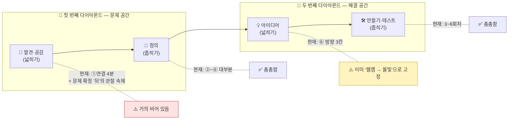
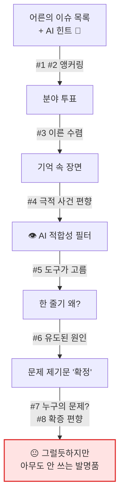
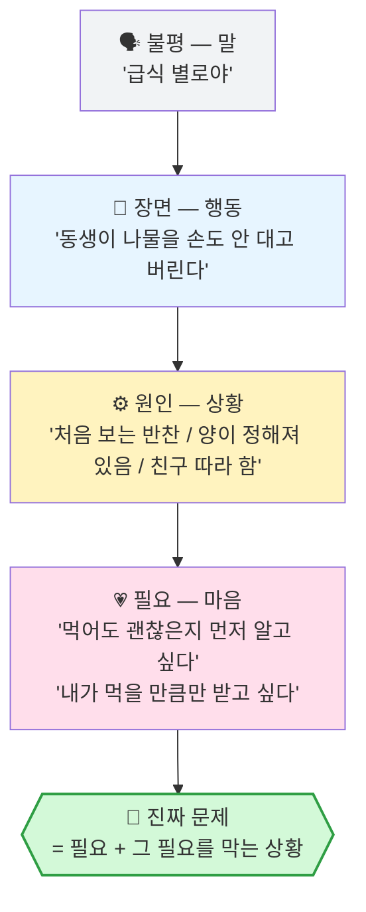
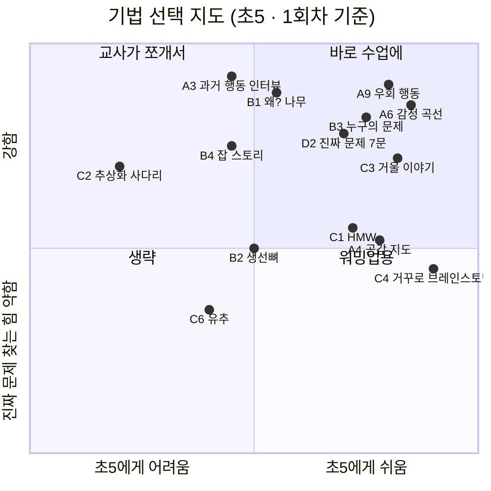
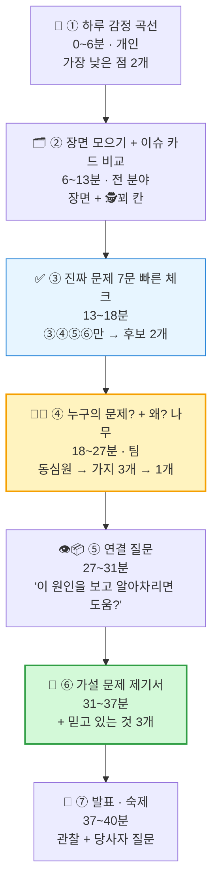
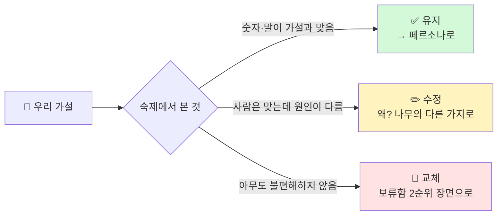

# 1회차 · 2교시 보강 — 디자인 씽킹으로 '진짜 문제' 먼저 찾기

> **무엇을 위한 문서인가** — [2교시 수업안](<(1회차-2교시)-실습_생활문제10_실험·문제점·페르소나.md>)을 디자인 씽킹 렌즈로 점검해 **① 진짜 문제를 놓치게 만드는 지점**을 찾고, **② 진짜 문제를 찾는 기법 24가지**를 초5·40분·A4 조건에서 검토한 뒤, **③ 수업에 넣을 조합**을 제안한다.
> **함께 볼 문서** — [미네르바 렌즈 — 문제 발견과 해결](<../아이디어/미네르바_렌즈_문제발견과_해결.md>) (`#rightproblem`, 5 Whys, 이해관계자 지도 등 사고 도구 쪽 설명)
> **이 문서는 교사용**이다. 특히 7절 「이슈 10가지 재분석」은 아이들에게 보여 주면 안 된다. (보여 주는 순간 아이들 생각이 거기서 멈춘다 — 앵커링)

---

## 0. 한 장 요약

| | 내용 |
|---|---|
| **진단** | 지금의 2교시는 문제를 **"고르는"** 수업이지 **"발견하는"** 수업이 아니다. 디자인 씽킹의 첫 단계인 **공감(현장에서 사람 보기)** 이 거의 없고, **정의(문장 만들기)** 부터 시작한다. |
| **진짜 문제를 가리는 3대 장치** | ① 어른이 만든 이슈 목록 + 🧭 AI 힌트 — **해결책이 문제보다 먼저** 들어 있다 ② 분야 투표가 장면 수집보다 먼저 — **너무 이른 수렴** ③ 👁️ '보고 구분' 필터가 원인 분석보다 먼저 — **도구(웹캠)가 문제를 고른다** |
| **처방 한 줄** | 문제 제기문을 **"결론"이 아니라 "가설"** 로 바꾸고, 공감 기법 2개 + 정의 기법 2개 + 검증 체크 1개를 넣고, 👁️ 필터를 **원인 뒤로** 옮긴다. |
| **추천 5종 세트** | 🌈 하루 감정 곡선 · 🕵️ 우회 행동 사냥 · 🌳 가지 치는 왜? · 🎯 누구의 문제? · ✅ 진짜 문제 7문 |
| **수업 뒤** | 1주 관찰 + **당사자에게 과거 행동 묻기**(Mom Test) → 2회차 시작에 가설을 **유지 / 수정 / 교체** 판정 |

---

## 1. 디자인 씽킹 지도 위에 현재 수업 올려 보기

### 1-1. 더블 다이아몬드 — "올바른 문제"를 찾고, 그다음 "문제를 올바르게" 푼다

### 1-2. 디자인 씽킹 5단계 × 현재 6회차

| DT 단계 | 핵심 질문 | 현재 설계에서 맡는 곳 | 상태 |
|---|---|---|:---:|
| **① 공감** Empathize | 그 사람은 **실제로** 무엇을 하고, 느끼고, 꾀를 쓰나? | 2교시 ①연결(기억), 관찰 숙제(문제 확정 **후**) | 🔴 |
| **② 정의** Define | 그 사람에게 **필요한 것**과 그걸 막는 **상황**은? | 2교시 ②~⑥ | 🟢 (단, 공감 없이 정의) |
| **③ 아이디어** Ideate | 풀 수 있는 방법이 **여러 개** 나왔나? | 2교시 ⑥ — 방향이 하나(AI)로 시작 | 🟡 |
| **④ 프로토타입** Prototype | 싸고 빠르게 만들어 보기 | 3~6회차 | 🟢 |
| **⑤ 테스트** Test | **사용자가** 써 보고 문제가 줄었나? | 6회차 검사 — 기준이 **시나리오**(우리가 쓴 것) | 🟡 |

> **⑤에 대한 메모** — 6회차 검사는 "시나리오대로 **만들었나**(검증, verification)"를 본다. 디자인 씽킹은 "그 사람의 **문제가 줄었나**(확인, validation)"도 본다. 2교시 ⑥의 **성공 기준**("5명 → 2명")이 바로 그 확인용 칸이니, 6회차에 이 숫자로 돌아오게 하면 두 가지가 모두 채워진다.

---

## 2. 시작 문제점 진단 — 진짜 문제를 놓치게 만드는 8가지 지점

| # | 지점 | 현재 설계 | 왜 진짜 문제를 가리나 | 수업에서 보일 증상 | 처방 |
|:---:|---|---|---|---|---|
| 1 | **어른이 만든 출발점** | 교사가 이슈 10가지 장면을 읽어 주고 별점 투표 | 어른이 **예상한** 아이의 불편이다. 아이들은 목록 안에서만 고른다 (앵커링) | 아이 장면이 카드 문장과 거의 같다 | 아이 장면을 **먼저** 꺼내고, 카드는 **"어른들도 이런 걸 봤대"** 비교용으로 뒤에 |
| 2 | **해결책이 먼저 들어 있음** | 카드마다 🧭 AI 연결 힌트, ⭐ 구현 적합도 | "망치를 든 사람에겐 모든 게 못으로 보인다." 교사 머릿속 ⭐가 발문으로 새어 나간다 | "이건 웹캠으로 되겠다"가 문제보다 먼저 나온다 | 2교시 동안 🧭·⭐ 칸은 **교사 메모에서도 접어 두기**. ⑥ 방향에서만 꺼냄 |
| 3 | **너무 이른 수렴** | ② 분야 투표(1개) → ③ 그 분야 안에서 장면 사냥 | 가장 센 장면이 **투표에서 진 분야**에 있을 수 있다. 발산이 좁은 칸 안에서만 일어난다 | 장면 12개가 비슷비슷하다 | 순서를 뒤집기: **전 분야 장면 먼저 → 묶기 → 분야는 결과로** |
| 4 | **기억에만 의존** | "쉬는 시간에 본 장면", "4장면 쓰기" | 기억은 **극적인 사건**을 먼저 꺼낸다(가용성 편향). 매일 반복되는 **작은 불편**이 진짜 문제일 때가 많다 | "넘어져서 피 났어요" 같은 1회성 장면 | **하루 감정 곡선**(A6)으로 시간 순서대로 훑기 |
| 5 | **도구가 문제를 고름** | ④ 필터에 👁️ "무엇과 무엇을 보고 구분?" | **겉 장면**으로 AI 적합성을 판단한다. ⑤에서 원인이 달라지면 그 점수는 무의미해진다 | 진짜 원인이 "누가 했는지 모름"(조율)인데 웹캠 쪽으로 억지 연결 | 👁️를 **⑤ 원인 뒤**로 옮기고, 탈락 기준이 아니라 **연결 질문**으로 |
| 6 | **한 줄기 왜?** | "왜?" 세 번, 한 줄 | 첫 "왜?"에서 원인은 보통 **여러 갈래**다. 예시 자체도 이미지 분류로 가는 원인에 **착지하도록** 짜여 있다 | 모든 팀의 진짜 원인이 "미리 볼 수 없어서"로 끝남 | 첫 "왜?"에서 **가지 2~3개**, 근거(본 것)가 있는 가지만 계속 |
| 7 | **"누구의" 문제인지 혼동** | 문장 틀 "[누가]는 불편하다" | 잔반은 **동생이 불편한 게 아니라** 급식실 선생님·지구가 불편하다. 불편을 느끼지 않는 사람에게 발명품은 쓰이지 않는다 | 페르소나는 동생인데, 동생은 그 발명품을 쓸 이유가 없음 | **누구의 문제?** 동심원(B3)으로 "불편을 느끼는 사람"과 "피해를 보는 사람" 구분 |
| 8 | **당사자 부재 + 확증 편향** | 문제 제기문 확정 → 그 뒤에 1주 관찰 | 답을 정하고 관찰하면 **맞는 증거만** 보인다. "2학년 동생"은 교실에 없다 | 관찰 숙제가 "역시 맞았다"로만 돌아옴 | 제기문 앞에 **"우리 가설:"**, 숙제에 **당사자 질문 2개**, 2회차에 **유지/수정/교체** 판정 |

### 2-1. 8가지를 한 그림으로

> 이 흐름이 **틀린 것은 아니다.** 6회차 안에 웹캠·마이크로비트까지 가려면 어느 정도 유도가 필요하다. 문제는 유도가 **문제 공간(첫 다이아몬드)** 에서 일어난다는 점이다. 유도는 **해결 공간(두 번째 다이아몬드)** 으로 미루면 된다. — "문제는 아이들 것, 도구 연결은 교사 몫."

---

## 3. '진짜 문제'란 무엇인가 — 판별 기준

### 3-1. 문제의 빙산

| 층 | 초5 말로 | 급식 예 | 이 층에서 멈추면 |
|---|---|---|---|
| 불평 | 짜증 난 말 | "급식 맛없어" | 풀 수 없음 (맛은 못 바꿈) |
| 증상 | 눈에 보이는 장면 | 반찬을 버린다 | "버리지 마" 캠페인 → 효과 없음 |
| 원인 | 그렇게 된 **상황** | 무슨 반찬인지 받기 전에 모름 | 원인이 여러 개면 **엉뚱한 것**을 풀 수 있음 |
| 필요 | 그 사람이 **진짜 원하는 것** | 먹어도 괜찮은지 먼저 알고 싶다 | ✅ 여기서 여러 해결책이 나온다 |
| 해결책 | 만들 물건 | 반찬 알려 주는 불빛 | ❌ 문제 칸에 이게 있으면 **문제가 없는 것** |

### 3-2. ✅ 진짜 문제 7문 — 초5용 체크리스트

| # | 질문 (아이 말) | 무엇을 거르나 | ⭕ 조건 |
|:---:|---|---|---|
| ① | **그 사람이 직접** "불편해"라고 말했어? | 내가 대신 불편해하는 문제 | 당사자에게 들음 |
| ② | **마지막으로** 그런 게 **언제**였어? | 상상·일반론 | 날짜·요일이 나온다 |
| ③ | 1주일에 **몇 번**? | 1회성 사건 | 2번 이상 |
| ④ | 그 사람이 **이미 쓰고 있는 꾀**가 있어? | 사실 안 불편한 문제 | 꾀가 있다 = 진짜 불편 (단, 꾀가 완벽하면 ❌) |
| ⑤ | 사람을 바꾸지 않고 **상황**을 바꿀 수 있어? | 사람 탓 | "게을러서"가 아님 |
| ⑥ | 문장에 **앱·로봇·AI·알림** 같은 단어가 없어? | 해결책을 문제로 착각 | 해결책 단어 0개 |
| ⑦ | 풀리면 **무엇이 몇에서 몇으로** 바뀌어? | 성공을 알 수 없는 문제 | 숫자 1개 |

> **판정** — ⭕ 5개 이상 → **진짜 문제 후보** · ①②가 ❌ → **가설로 보류**(관찰 숙제로 확인) · ⑥이 ❌ → 문장부터 다시

> **④가 가장 강력한 질문이다.** 사람들은 불편해도 말하지 않지만, **정말 불편하면 몰래 꾀를 쓴다**(요일 포스트잇, 알람 3개, 엄마에게 전화). 꾀가 있다는 건 ① 진짜 불편하고 ② 해결 의지가 있다는 증거이고, 그 꾀의 **빈틈**이 발명품 자리다.

---

## 4. 기법 검토 — 진짜 문제를 찾는 24가지

4개 묶음으로 나눈다. 🔎 **공감**(현장에서 사람 보기) → 🌳 **정의**(파고들기) → 🔄 **재구성**(다르게 보기) → ✅ **검증**(맞는지 확인).

**평가 기준** — 🎯 진짜 문제를 찾는 힘 / 🧒 초5 적합도 / ⏱️ 40분 수업 안에서 가능 / 📄 A4·펜만으로 가능

### 4-A. 🔎 공감 — "그 사람을 실제로 본다"

| # | 기법 (원래 이름) | 초5 버전 · 대사 | 어떻게 | 🎯 | 🧒 | ⏱️ | 📄 | 주의 |
|:---:|---|---|---|:---:|:---:|:---:|:---:|---|
| A1 | **AEIOU 관찰** (Doblin) | 🔭 "다섯 눈으로 보기" — **무엇을 해? 어디서? 누구랑? 무슨 물건? 누가?** | 한 장면을 5칸에 나눠 적기 | ★★★ | ★★☆ | 숙제 | ✅ | 수업 중엔 기억으로만 가능 → 숙제용 |
| A2 | **섀도잉** (그림자 따라가기) | 👣 "5분 몰래 탐정" | 급식 시간 동생 한 명을 5분 지켜보고 행동만 적기 | ★★★ | ★★☆ | 숙제 | ✅ | 사람 얼굴 사진 금지, 이름 대신 "동생 A" |
| A3 | **과거 행동 인터뷰** (The Mom Test) | 🎤 "지난번 이야기 해 줘" — "**마지막으로** ~한 게 언제야? 그때 **어떻게** 했어?" | 3질문 인터뷰 | ★★★ | ★★☆ | 숙제 | ✅ | **금지 질문**: "이런 거 있으면 쓸래?" (누구나 "응"이라고 함) |
| A4 | **공감 지도** (d.school) | 🧠 "말·생각·행동·마음 4칸" | 그 사람이 **말한 것 / 생각할 것 / 한 것 / 느낀 것** | ★★☆ | ★★★ | ✅ 5분 | ✅ | 관찰 없이 쓰면 **상상 지도**가 됨 — 2회차 페르소나와 연결 |
| A5 | **직접 겪어 보기** (몰입·바디스토밍) | 🧸 "그 사람 되어 보기" | 무릎 꿇고 2학년 눈높이로 식판 보기 / 한 손에 우유 들고 분리수거 | ★★★ | ★★★ | ✅ 3분 | ✅ | 재미있어서 놀이로 흐르기 쉬움 → "뭐가 **달라 보였어**?" 로 마무리 |
| A6 | **여정 지도** (간이: 하루 감정 곡선) | 🌈 "어제 하루 기분 그래프" | 가로축 = 어제 아침~잠, 세로축 = 기분. 선을 긋고 **가장 낮은 점 2개** = 장면 | ★★★ | ★★★ | ✅ 5분 | ✅ | 가족 갈등이 나올 수 있음 → "말하고 싶은 것만" |
| A7 | **사진 일기** (문화 탐침, Gaver) | 📸 "불편 사진 일기" | 1주일 동안 불편할 때마다 사진 1장 + 한 줄 | ★★★ | ★★☆ | 숙제 | ❌ 폰 | 5회차 **학습 데이터**로도 재사용 가능 — 일석이조 |
| A8 | **극단 사용자** (IDEO) | 🔥🧊 "제일 심한 친구 vs 전혀 안 그런 친구" | 둘에게 같은 질문 → **차이**가 원인 | ★★★ | ★★☆ | 숙제 | ✅ | 놀림 소재가 되지 않게 이름 대신 "A·B" |
| A9 | **우회 행동 사냥** (Workaround) | 🕵️ "몰래 쓰는 꾀 찾기" — "이게 불편해서 **대신 뭘 해?**" | 장면마다 "꾀" 칸 추가 | ★★★ | ★★★ | ✅ 3분 | ✅ | 없다고 하면 "엄마·선생님은 뭘 해?"로 확장 |

### 4-B. 🌳 정의 — "겉 불편 밑을 판다"

| # | 기법 | 초5 버전 · 대사 | 어떻게 | 🎯 | 🧒 | ⏱️ | 📄 | 주의 |
|:---:|---|---|---|:---:|:---:|:---:|:---:|---|
| B1 | **5 Whys** (도요타) — 가지치기형 | 🌳 "왜? 나무" | 첫 "왜?"에서 가지 2~3개 → **본 적 있는 가지만** 계속 | ★★★ | ★★☆ | ✅ 6분 | ✅ | 세 번째쯤 **사람 탓**이 나오면 "부지런해도 불편할까?" |
| B2 | **생선뼈 도표** (Ishikawa) | 🐟 "생선뼈 5개" — **사람·물건·장소·시간·규칙** | 머리 = 불편, 뼈마다 원인 1개씩 | ★★☆ | ★★☆ | ✅ 7분 | ✅ | 원인 **목록**은 넓지만 **깊이**는 얕음 → B1과 짝 |
| B3 | **이해관계자 지도** | 🎯 "누구의 문제? 동심원" — 가운데 **겪는 사람**, 둘째 원 **옆 사람**, 바깥 **정하는 사람** | 동심원 3개에 이름 쓰기 → "**불편을 느끼는** 사람에 ○" | ★★★ | ★★★ | ✅ 3분 | ✅ | 피해자 ≠ 불편 느끼는 사람일 때가 핵심 발견 |
| B4 | **잡 스토리** (JTBD, Christensen) | 🧩 "~할 때, ~하고 싶어, 그래야 ~" | "**학원 가기 전 현관에서**, **맞는 책을 들었는지 알고 싶어**, **그래야 선생님께 안 혼나**" | ★★★ | ★★☆ | ✅ 4분 | ✅ | 3번째 칸("그래야")이 **진짜 동기** — 여기서 문제가 바뀌기도 함 |
| B5 | **POV 문장** (d.school) | 📣 "[누구]는 [무엇]이 필요하다. 왜냐하면 [놀라운 이유]" | 필요는 **동사**로, 이유는 **"어? 그렇구나"** 할 만한 것으로 | ★★★ | ★★☆ | ✅ 4분 | ✅ | 현재 문장 틀과 거의 같음 — "놀라운 이유" 칸만 추가하면 됨 |
| B6 | **증상·원인·필요 3층 분류** | 🧊 "빙산 3층" | 포스트잇/장면을 3층에 나눠 붙이기 | ★★☆ | ★★★ | ✅ 4분 | ✅ | 3-1 빙산 그림 판서와 짝 |

### 4-C. 🔄 재구성 — "같은 문제를 다르게 본다"

| # | 기법 | 초5 버전 · 대사 | 어떻게 | 🎯 | 🧒 | ⏱️ | 📄 | 주의 |
|:---:|---|---|---|:---:|:---:|:---:|:---:|---|
| C1 | **HMW** (How Might We) | 🙋 "우리가 어떻게 하면 ~할 수 있을까?" | 진짜 원인을 질문으로 뒤집기. **너무 넓게**(환경을 지키려면?) / **너무 좁게**(빨간 불빛을 켜려면?) 둘 다 ❌ | ★★☆ | ★★★ | ✅ 3분 | ✅ | 해결책이 질문에 들어가면 좁은 것 |
| C2 | **추상화 사다리** | 🪜 "위로 왜? 아래로 어떻게?" | 문장 하나를 두고 **위로** "왜 그게 중요해?", **아래로** "그럼 어떻게?" | ★★★ | ★☆☆ | ✅ 5분 | ✅ | 초5엔 추상적 → 교사가 **두 칸만** 올리고 내리게 |
| C3 | **문제 재구성** (Reframing, Wedell-Wedellsborg) | 🪞 "엘리베이터 거울 이야기" | "엘리베이터가 느리다" → 사실은 "기다리는 게 **지루하다**" → 거울을 달자 불평이 줄었다. **"느린 게 문제야, 지루한 게 문제야?"** | ★★★ | ★★★ | ✅ 3분 | ✅ | 이야기 하나로 **"문제를 바꾸면 해결책이 싸진다"** 를 체감 |
| C4 | **거꾸로 브레인스토밍** | 🙃 "어떻게 하면 **더 나빠질까?**" | "잔반을 **더 많이** 만들려면?" → 목록을 뒤집으면 **원인 목록** | ★★☆ | ★★★ | ✅ 4분 | ✅ | 아이들이 가장 신나 함 → 워밍업으로 최적. 장난 방지: "진짜 일어날 것만" |
| C5 | **관점 바꾸기 역할극** | 🎭 "급식실 선생님이라면?" | 3명이 **겪는 사람 / 옆 사람 / 정하는 사람** 역할로 같은 장면을 한 줄씩 | ★★☆ | ★★★ | ✅ 4분 | ✅ | B3 동심원과 짝 |
| C6 | **유추** (Analogy) | 🔀 "다른 곳에서도 이런 일 있어?" | 가방 잘못 챙김 ↔ 비행기 조종사 **체크리스트** | ★★☆ | ★★☆ | 6회차 | ✅ | 해결 공간 기법 — 2교시엔 이름만 |

### 4-D. ✅ 검증 — "우리가 맞는지 확인한다"

| # | 기법 | 초5 버전 · 대사 | 어떻게 | 🎯 | 🧒 | ⏱️ | 📄 | 주의 |
|:---:|---|---|---|:---:|:---:|:---:|:---:|---|
| D1 | **가정 지도** (Assumption Mapping) | 🤔 "우리가 **믿고 있는** 것 3개" | "동생은 처음 보는 반찬이라 버린다(아직 확인 안 함)" → **확신 낮고 중요한 것**부터 확인 | ★★★ | ★★☆ | ✅ 3분 | ✅ | 2×2 표 대신 **3개만 적고 ☆ 하나** |
| D2 | **진짜 문제 7문** | ✅ 3-2절 | 체크 7개 | ★★★ | ★★★ | ✅ 4분 | ✅ | ①②는 수업 중 ❌가 정상 → 숙제로 |
| D3 | **숫자 세기** (Tally) | ✋ "바를 정(正) 세기" | 1주일 3번 관찰, 몇 명·몇 번 | ★★☆ | ★★★ | 숙제 | ✅ | 이미 수업안에 있음 — **가설 확정 전**으로 옮기는 게 핵심 |
| D4 | **당사자에게 읽어 주기** | 📢 "맞아? 아니야?" | 문제 제기문을 **겪는 사람에게** 읽어 주고 반응 기록 | ★★★ | ★★★ | 숙제 | ✅ | "맞아!"보다 **"그건 아니고…"** 가 더 값진 반응 |
| D5 | **사전 부검** (Pre-mortem) | 💀 "6회차에 실패했다면 왜?" | "완성했는데 동생이 안 썼다. 왜?" 3개 | ★★☆ | ★★☆ | 2회차 | ✅ | 해결책이 생긴 뒤에 쓰는 기법 |

### 4-E. 한눈에 비교 — 무엇을, 언제

> quadrantChart가 렌더되지 않는 뷰어라면 아래 표로 본다.

| 쓰는 곳 | 기법 | 이유 |
|---|---|---|
| **2교시 수업 안 (핵심)** | 🌈 A6 감정 곡선 · 🕵️ A9 우회 행동 · 🌳 B1 왜? 나무 · 🎯 B3 누구의 문제? · ✅ D2 진짜 문제 7문 | 쉽고, 강하고, A4만으로 되고, 각 3~6분 |
| **2교시 수업 안 (양념)** | 🪞 C3 거울 이야기(1분 이야기) · 🤔 D1 믿고 있는 것 3개 | "문제를 바꾸면 해결이 달라진다"를 체감 + 가설 의식 |
| **1주 숙제** | 🔭 A1 다섯 눈 관찰 · 🎤 A3 과거 행동 인터뷰 · ✋ D3 숫자 세기 · 📢 D4 읽어 주기 | 수업 중엔 당사자가 없다 → 현장에서 확인 |
| **2회차 여는 활동** | 🧠 A4 공감 지도 → 페르소나 · 🧩 B4 잡 스토리 · 🙋 C1 HMW | 숙제에서 가져온 사실로 채워야 상상이 안 됨 |
| **6회차 확장** | 🔀 C6 유추 · 💀 D5 사전 부검 | 해결 공간 기법 |
| **초5엔 생략/교사만** | 🪜 C2 추상화 사다리 · 🐟 B2 생선뼈(시간 부족 시) | 추상적이거나 B1과 겹침 |

---

## 5. 추천 적용안 — 2교시 40분에 넣기

### 5-1. 두 가지 선택지

| | **안 A — 최소 수정** (내일 바로) | **안 B — 흐름 재구성** (권장) |
|---|---|---|
| 바꾸는 양 | 문구·칸 몇 개 | 구간 순서 |
| 준비 부담 | 판서 2장 추가 | 판서 3장 + 흐름 연습 |
| 해결하는 진단 | #2 #5 #6 #7 #8 | #1~#8 전부 |

### 5-2. 안 A — 최소 수정 6가지 (시간표 그대로)

| # | 어디 | 지금 | 이렇게 |
|:---:|---|---|---|
| 1 | 1-2 이슈 카드 | 🧭 AI 힌트·⭐ 적합도가 옆에 있음 | **2교시 동안 접어 두기**. ⑥ 방향에서만 꺼냄 |
| 2 | ③ 장면 한 칸 | 누가·언제·어디서·무엇 4칸 | **5번째 칸 "그래서 대신 뭘 해? (꾀)"** 추가 (A9) |
| 3 | ④ 필터 | 🔍 진짜 · 👁️ 보고 구분 · 📦 증거 | 👁️ 자리에 **🕵️ 꾀가 있나?** — 👁️는 ⑥으로 이동 |
| 4 | ⑤ 왜? 세 번 | 한 줄 | 첫 "왜?"에서 **가지 2~3개** → "누가 **진짜 봤어?**" 로 가지 1개 선택 (B1) |
| 5 | ⑥ 문장 틀 | "[누가]는 … 불편하다." | 맨 앞에 **"우리 가설:"** + 끝에 **"우리가 틀렸다면 ___ 을 보게 될 것이다."** (D1) |
| 6 | ⑦ 관찰 숙제 | 3번 관찰, 몇 명·몇 번 | + **당사자 질문 2개** (6절 양식) + 2회차 첫 5분 **유지/수정/교체** 판정 |

### 5-3. 안 B — 흐름 재구성 (40분)

| 구간 | 시간 | 기법 | 하는 일 | A4 | 교사 발문 |
|:---:|:---:|---|---|---|---|
| ① 감정 곡선 | 0~6분 | A6 | 1교시 A4 뒷면 가로선 = 어제 아침 → 학교 → 학원 → 집 → 잠. 기분 선 긋기. **가장 낮은 점 2개**에 ★ | 1교시 A4 뒷면 | "어제 **몇 시에** 기분이 제일 떨어졌어? 그때 **뭐가** 있었어?" |
| ② 장면 + 카드 비교 | 6~13분 | A9 + 이슈 카드 | ★ 2개 + 추가 2개 = 1인 4장면(**누가·언제·어디서·무엇·꾀** 5칸). 이후 교사가 이슈 카드 **장면만** 읽어 주고, 겹치는 장면에 🔗 | 새 A4 8칸 | "그게 불편해서 **대신 뭘 했어?**" / "어른들도 비슷한 걸 봤대. 겹치는 거 있어?" |
| ③ 빠른 체크 | 13~18분 | D2 (③④⑤⑥) | 각자 장면 아래 칸에 ③반복 ④꾀 ⑤상황 탓 ⑥해결책 단어 없음 ⭕/❌ → 팀 **후보 2개** | 같은 8칸 아래 | "1주일에 **몇 번**? 사람 탓이야, 상황 탓이야?" |
| ④ 누구의 문제? + 왜? 나무 | 18~27분 | B3 + B1 | 후보 1개로: 동심원에 이름 3개 → **불편을 느끼는 사람 ○** → 그 사람 기준으로 왜? 가지 3개 → **본 적 있는 가지**만 두 번 더 | 팀 A4 상단 | "**누가 제일** 불편해? 그 사람이 **자기 입으로** 불편하다고 했어?" / "이 가지, **진짜 본** 사람?" |
| ⑤ 연결 질문 | 27~31분 | (👁️·📦) | **진짜 원인**을 두고: "누군가 **그 순간을 보고 알려 주면** 도움이 될까?" / "사진·숫자로 모을 수 있나?" → 안 되면 **후보 2번**으로 ④ 빠르게 재실행 또는 보류함 | 팀 A4 | "이 원인은 **무엇과 무엇을 구분**하면 풀려?" |
| ⑥ 가설 문제 제기서 | 31~37분 | B5 + D1 | 문장 틀 앞에 **"우리 가설:"** / 방향 3칸 / 성공 기준 / **우리가 믿고 있는 것 3개** 중 가장 불안한 것에 ☆ | 팀 A4 | "우리가 **아직 확인 안 한** 게 뭐야?" |
| ⑦ 발표·숙제 | 37~40분 | D4 예고 | 소리 내어 읽기 → ☆ 표시한 것 = **이번 주 숙제로 확인할 것** | — | "다음 주에 **틀렸다고** 밝혀져도 성공이에요. 그게 발명가의 일이에요." |

> **왜 ⑤를 뒤로?** 도구 연결은 여전히 한다(5·6회차로 가야 하므로). 다만 **겉 장면이 아닌 진짜 원인**에 대고 묻는다. 원인이 "누가 했는지 모름"(조율 문제)처럼 웹캠과 안 맞으면, 그 사실 자체가 좋은 배움이다 — 아이들이 **"AI가 필요 없는 문제도 있다"** 를 스스로 발견한다. (2교시 수업안 1-2절 "⭐이 낮은 주제를 골라도 막지 않는다"는 원칙과 같다.)

### 5-4. 판서 추가분 (A4 크게)

| 판서 | 내용 |
|---|---|
| 🧊 빙산 3층 | 불평 → 장면 → 원인 → **필요** (3-1절 그림) |
| ✅ 진짜 문제 7문 | 3-2절 표의 "질문 (아이 말)" 칸만 |
| 🪞 거울 이야기 | "엘리베이터가 느리다" vs "기다리는 게 지루하다" — 1분 이야기, ④ 시작 전에 |

---

## 6. 1주 숙제 양식 — 관찰 + 당사자에게 묻기 (A4 한 장)

### 6-1. 🔭 다섯 눈 관찰 (3번)

| | 1회 | 2회 | 3회 |
|---|:---:|:---:|:---:|
| 날짜·시간 | | | |
| **누가** (이름 대신 A·B) | | | |
| **무엇을 했나** (행동만, 내 생각 ❌) | | | |
| **어디서** | | | |
| **누구랑·무슨 물건** | | | |
| **몇 명 / 몇 번** | | | |
| **꾀** (대신 한 행동) | | | |
| 🤯 **예상과 달랐던 것** | | | |

### 6-2. 🎤 당사자에게 묻는 질문 — 과거 행동만

| 순서 | ✅ 이렇게 묻기 | ❌ 이렇게 묻지 않기 | 이유 |
|:---:|---|---|---|
| 1 | "**마지막으로** ○○한 게 언제야?" | "○○ 자주 해?" | "자주"는 기억이 부풀린다. 날짜는 사실이다 |
| 2 | "그때 **어떻게 했어?** 왜 그렇게 했어?" | "그거 불편하지?" | 유도 질문에는 누구나 "응" |
| 3 | "그걸 해결하려고 **해 본 게** 있어?" | "이런 거 만들면 쓸래?" | 미래 약속은 믿을 수 없다. **해 본 적 없으면** 사실 별로 안 불편한 것 |
| 4 | (선택) 우리 문제 제기문을 **읽어 주고**: "맞아, 아니야?" | — | **"그건 아니고…"** 뒤에 오는 말을 그대로 적기 |

### 6-3. 2회차 여는 5분 — 가설 판정

---

## 7. 🔒 교사용 — 이슈 10가지 재분석: 겉 불편 → 진짜 문제 가설

> **아이들에게 보여 주지 않는다.** 아이들이 막혔을 때 **질문 한 개**만 꺼내 쓰는 용도. 오른쪽 "진짜 문제 가설"은 **정답이 아니라 후보**이며, 관찰·인터뷰로 뒤집힐 수 있다.

| # | 겉 불편 | 🎯 누가 **실제로** 불편을 느끼나 | 🕵️ 이미 쓰는 꾀 | 진짜 문제 가설 (가지 여러 개) | 당사자 확인 질문 | 👁️ AI가 맞는 가지 / 안 맞는 가지 |
|:---:|---|---|---|---|---|---|
| ① | 급식 잔반 | 버리는 동생은 **별로 안 불편함**. 불편한 건 급식실 선생님·담임 | 친구에게 몰래 줌, "조금만 주세요" | (a) 받기 전에 무슨 반찬인지 모름 (b) **먹을 양을 스스로 못 정함** (c) 친구가 안 먹으면 따라 안 먹음 | "마지막으로 반찬 버린 날, **받을 때** 무슨 생각 했어?" | (a) ✅ 반찬 사진 구분 / (b) ❌ 배식 규칙 문제 / (c) ❌ 사회적 문제 |
| ② | 분리수거 헷갈림 | 버리는 사람 **본인**(헷갈림) + 당번 | 대충 일반쓰레기에 넣음, 친구 따라 넣음 | (a) **틀려도 아무도 바로 알려 주지 않음**(피드백 공백) (b) 헷갈리는 물건 몇 개만 늘 틀림 | "마지막으로 헷갈린 물건이 뭐였어? 그때 **어떻게** 했어?" | (a)(b) ✅ 물건 사진 구분 → 즉시 알림 — **가장 궁합 좋음** |
| ③ | 분실물 쌓임 | 잃어버린 친구보다 **담임**(치우는 사람) | 그냥 새로 삼, 부모님께 말 안 함 | (a) **잃어버린 걸 늦게 알아챔** (b) 찾으러 가는 게 창피·귀찮음 > 물건 값 | "마지막으로 잃어버린 물건, **언제 알았어?** 찾으러 갔어?" | (a) △ / (b) ❌ 마음·절차 문제 |
| ④ | 소음·부딪힘 | 조용히 쉬고 싶은 친구, 저학년 | 귀 막기, 복도 안 나가기 | (a) **자기 목소리 크기를 스스로 모름** (b) 모퉁이 너머 사각지대 | "시끄럽다고 느낀 마지막 순간, **누가** 제일 컸어? 그 사람은 알았을까?" | (a) ✅ 소리 크기 / (b) ✅ 사람 감지 — 단 **소리**는 5회차 웹캠과 다름 |
| ⑤ | 스마트폰 시간 약속 | 나 **와** 부모님 — **서로 불편한 게 다름** | 몰래 더 함, 화장실에서 함 | (a) 시간 감각 상실 (b) **끝내는 순간이 갑작스러움**(게임 중간에 끊김) (c) 규칙을 내가 안 정함(자율성) | "지난번 싸웠을 때, **몇 분 전에** 알았으면 괜찮았을 것 같아?" | (a)(b) △ 타이머로도 됨 / (c) ❌ 약속·대화 문제 — **AI 필요성 점검 필수** |
| ⑥ | 숙제 자세·집중 | 나 (단, 불편을 **그 순간엔** 못 느낌) | 엄마가 "허리 펴!" | (a) **나빠지는 순간을 스스로 모름** (b) 숙제가 지루해서 딴짓 | "어제 숙제할 때, 딴짓 **시작한 순간**을 기억해?" | (a) ✅ 자세 사진 구분 — 궁합 좋음 / (b) ❌ |
| ⑦ | 반려동물·식물 깜빡 | 가족 (특히 결국 챙기는 엄마) | 냉장고 메모, 단톡방 | (a) 비었는지 매번 확인이 귀찮음 (b) **누가 줬는지 가족끼리 모름**(겹치거나 빠짐 — 조율) | "지난번 물그릇 빈 걸 봤을 때, **누가 마지막으로** 줬는지 알았어?" | (a) ✅ 그릇 사진 / (b) ❌ **공유판**이 더 좋은 해결 |
| ⑧ | 학원 차 놓침 | 나, 기다리는 기사님 | 알람, 친구가 알려 줌 | (a) **놀이 몰입 중 시간 감각 상실** (b) 친구와 놀이를 끊기 어려움(사회적) | "지난번 늦었을 때, **알람은** 울렸어? 그때 왜 못 갔어?" | (a) △ 시계로 충분 / (b) ❌ — **AI 필요성 낮음을 아이들이 발견하게** |
| ⑨ | 영어 단어 지겨움 | 나 | 전날 몰아 외우기, 엄마가 불러 주기 | (a) **틀린 단어만 모아 볼 방법 없음** (b) 혼자 하면 지루함 | "지난 시험에서 틀린 단어, **다시 본 적** 있어?" | (a) △ 사물 사진 ↔ 단어 / (b) △ 게임화 |
| ⑩ | 요일별 가방·교재 | 나 (학원에서 혼날 때) | 요일 포스트잇, 엄마가 확인 | (a) **현관에서 확인하는 순간이 없음** (b) 요일마다 규칙이 달라 기억 부담 | "지난번 책 잘못 가져간 날, **언제** 가방 쌌어?" | (a) ✅ 교재 표지 구분 — 궁합 좋음 / (b) △ 체크리스트로도 됨 |

### 7-1. 10가지 밑에 흐르는 '진짜 문제'의 3가지 모양

진짜 문제 가설을 모아 보면 아이들의 생활 불편은 대부분 세 가지 모양 중 하나로 수렴한다.

| 모양 | 뜻 | 해당 가지 | AI의 '눈'과의 궁합 |
|---|---|---|:---:|
| **⏰ 알아차림 공백** | 몰라서가 아니라 **그 순간** 알아차리지 못한다 | ①a ③a ④a ⑥a ⑩a | ✅✅ 가장 좋음 — "보고 → 그 순간 알린다" |
| **🔁 피드백 공백** | 틀려도 **바로** 알려 주는 사람이 없어서 같은 실수가 반복된다 | ②a ⑨a | ✅✅ 좋음 — "보고 → 맞다/틀리다" |
| **🤝 조율·마음 공백** | 사람 사이 약속, 창피함, 결정권 문제 | ①b ③b ⑤c ⑦b ⑧b | ❌ AI보다 **대화·규칙·공유판** |

> **교사가 쥐고 있을 통찰** — 이 수업이 결국 5·6회차의 "웹캠으로 보고 → 마이크로비트로 알린다"로 가는 이유를 아이들 말로 하면 이렇다:
> **"우리 불편은 몰라서가 아니라, 그 순간 알아채지 못해서 생긴다. 그래서 대신 봐 주고 그 순간 알려 주는 게 필요하다."**
> 이 문장을 교사가 먼저 말하지 않고, ④ 왜? 나무의 끝에서 **아이들이 스스로 도달하게** 하는 것이 2교시의 진짜 목표다. 반대로 아이들 원인이 🤝 모양이면 — 그걸 발견한 것 자체를 크게 칭찬하고, 보류함에서 ⏰·🔁 모양 장면을 다시 꺼낸다.

---

## 8. 진짜 문제로 끌고 가는 교사 발문 모음

| 상황 | 발문 | 기법 |
|---|---|---|
| 장면이 흐릴 때 | "그 장면을 **사진으로 찍으면** 누가 찍혀?" | A1 |
| 불평만 나올 때 | "그 말 할 때 **바로 전에** 무슨 일이 있었어?" | A6 |
| 진짜인지 모를 때 | "**마지막으로** 그런 게 언제였어?" | A3 · D2② |
| 사실 안 불편한 것 같을 때 | "그게 불편해서 **대신 뭘 해?**" | A9 · D2④ |
| 사람 탓일 때 | "그 사람이 **아주 부지런해도** 불편할까?" | B1 |
| 누구 문제인지 섞일 때 | "이게 **없어지면 제일 좋아할** 사람은 누구야?" | B3 |
| 원인이 하나로만 나올 때 | "**다른 이유**로 그럴 수도 있을까? 두 개만 더." | B1 가지치기 |
| 해결책부터 말할 때 | "좋아! 그게 **없어서 지금 누가 곤란해?**" | D2⑥ |
| 문제가 너무 클 때 | "그중에 **우리 반에서** 이번 주에 볼 수 있는 건?" | C1 (좁히기) |
| 문제가 너무 작을 때 | "그게 풀리면 **왜 좋은데?**" | C1 · C2 (넓히기) |
| 확신에 차 있을 때 | "우리가 **아직 확인 안 한** 게 뭐야? **틀렸다면** 뭘 보게 될까?" | D1 |

---

## 9. 참고 — 기법의 출처

| 기법 | 출처 |
|---|---|
| 더블 다이아몬드 | UK Design Council (2005) |
| 공감 지도, POV 문장, HMW, 몰입 | Stanford d.school, *Bootcamp Bootleg* / IDEO *Design Kit* |
| AEIOU 관찰 | Doblin Group (Rick Robinson 외, 1991) |
| 문화 탐침(사진 일기) | Gaver, Dunne & Pacenti, *Cultural Probes* (1999) |
| 극단 사용자 | IDEO *Design Kit* — Extremes and Mainstreams |
| 5 Whys | 오노 다이이치, 도요타 생산 방식 |
| 생선뼈 도표 | 이시카와 가오루 |
| Jobs To Be Done / 잡 스토리 | Clayton Christensen, *Competing Against Luck* (2016) |
| 과거 행동 인터뷰 | Rob Fitzpatrick, *The Mom Test* (2013) |
| 문제 재구성(엘리베이터 거울) | Thomas Wedell-Wedellsborg, "Are You Solving the Right Problems?" *HBR* (2017) |
| 추상화 사다리 | S. I. Hayakawa → 디자인 씽킹 실무 도구로 확장 |
| 가정 지도 | David J. Bland, *Testing Business Ideas* (2019) |
| 사전 부검 | Gary Klein, *HBR* (2007) |
