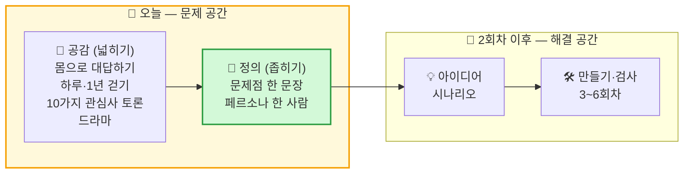
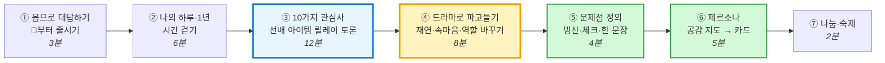
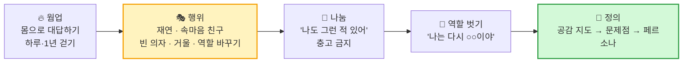
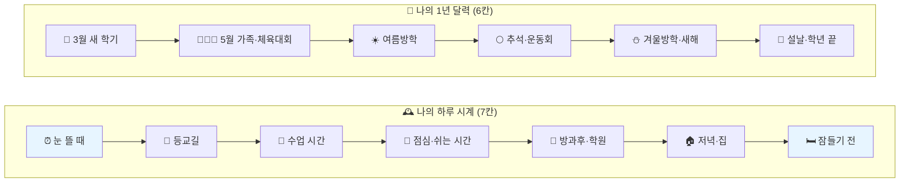
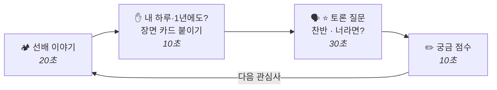
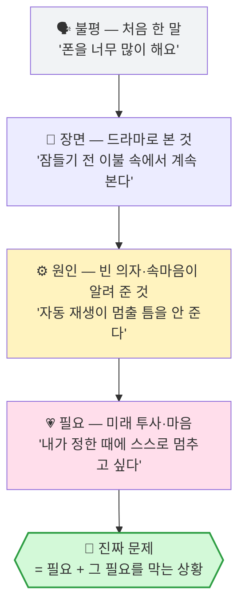
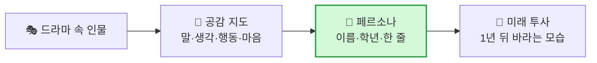
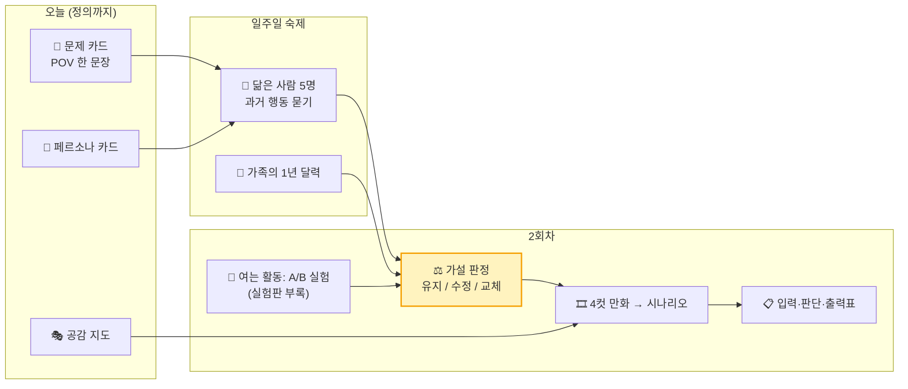

# 1회차 · 2교시 [디자인 씽킹 실습] — 나의 하루·1년을 무대에 올려, 문제점과 페르소나를 정의해요

> **대상** 초등 5학년 3명 · **시간** 40분 · **준비물** A4 용지, 펜, 교실 의자 1개(빈 의자)
> **이 시간의 목표는 딱 두 가지** — **① 문제점 한 문장** · **② 페르소나(그 문제를 겪는 딱 한 사람)**. 해결책(AI·발명품)은 **오늘 만들지 않습니다.**
> **방법** 좁은 주제를 먼저 주지 않고, **넓은 관심사 10가지**를 **LG AI 청소년 캠프 선배 아이템**으로 하나씩 열어 **토론**합니다. 그다음 **사이코드라마(심리극) 기법**으로 **나의 하루·나의 1년**을 몸으로 다시 겪으며 **내 문제**를 찾고, 드라마 속 인물을 **페르소나**로 굳힙니다.
> **오늘 가져갈 것** 개인 **장면 카드** 3장 + 팀 A4 한 장 — 앞면 **「우리 문제 카드」** / 뒷면 **「페르소나 카드」**

> **다른 2교시 문서와의 관계**
> - [실험판 2교시](<(1회차-2교시)-실습_생활문제10_실험·문제점·페르소나.md>) — 좁은 주제 10가지 + A/B 실험. 이 문서의 🔬 **좁혀 보기**와 **2회차 여는 활동**(실험)에서 그대로 씁니다.
> - [보강 문서](<(1회차-2교시-보강)-디자인씽킹_진짜문제_찾기_기법검토.md>) — 진짜 문제 찾기 기법 24가지와 진단. 이 문서는 그중 **하루 감정 곡선(→ 하루 시계 걷기)**, **우회 행동**, **누구의 문제?**, **진짜 문제 체크**, **공감 지도**를 **드라마 형식으로 몸으로 하게** 바꾼 실습판입니다.
> - 참조 — `docs/아이디어/LG_AI_청소년캠프_조사.md` · `docs/아이디어/청소년_AI창업_아이디어_사례집.md` · `docs/아이디어/아이템_30선.md`

---

## 0. 오늘 한눈에

### 0-1. 디자인 씽킹에서 오늘의 자리 — 첫 번째 다이아몬드만

> **왜 넓게 시작하나** — 처음부터 "급식 반찬", "가방 챙기기"처럼 **좁은 주제**를 주면, 그 주제가 자기 이야기가 아닌 아이는 **거기서 멈춥니다.** 📱 스마트폰, 💬 친구·마음, 👶 가족 같은 **넓은 관심사**에는 **누구에게나 자기 장면**이 있습니다. 선배 아이템은 "**이런 것도 문제가 되는구나**"를 보여 주는 사다리이고, 좁히는 일은 **드라마**가 합니다.

### 0-2. 40분 흐름

| 순서 | 시간 | 우리가 하는 일 | DT 단계 | 남는 것 | 넓게 ↔ 좁게 |
|:---:|:---:|---|:---:|---|:---:|
| ① 몸으로 대답하기 | 0~3분 | 질문에 따라 교실 이쪽~저쪽 **줄서기** (📱 스마트폰부터) | 공감 | 서로의 차이 | 🌍 |
| ② 나의 하루·1년 | 3~9분 | 바닥의 **하루 시계 7칸**·**1년 달력 6칸**을 걸으며 한 동작 + 한 문장 | 공감 | **장면 카드** 1인 3장 | 🌍 |
| ③ 10가지 관심사 토론 | 9~21분 | 관심사 10개를 **LG 선배 아이템**으로 열고 → 내 장면 붙이기 → **한 질문으로 토론** | 공감 | 관심사 **1개** + 주인공 | 🌍 → 🔍 |
| ④ 드라마로 파고들기 | 21~29분 | **재연 → 속마음 친구 → 빈 의자/거울 → 역할 바꾸기 → 나눔** | 공감 → 정의 | ⭐ 속마음 문장, **공감 지도** | 🔍 |
| ⑤ 문제점 정의 | 29~33분 | 빙산 3층 → **진짜 문제 체크 6** → **문제 한 문장** | 정의 | **우리 문제 카드** | 🎯 |
| ⑥ 페르소나 | 33~38분 | 공감 지도 → **딱 한 사람** → 1년 뒤 바라는 모습 | 정의 | **페르소나 카드** | 🎯 |
| ⑦ 나눔·숙제 | 38~40분 | "나도 그런 적 있어" + **역할 벗기** + 숙제 | — | 숙제 | — |

### 0-3. 오늘의 규칙 4가지 (판서 — 그대로 읽어 주기)

| # | 규칙 | 선생님이 하는 말 |
|:---:|---|---|
| 1 | **무대 위에서는 뭐든 괜찮아요** | "틀린 대답은 없어요. **말하기 싫으면 '패스'** 해도 돼요." |
| 2 | **해결책은 오늘 금지!** | "'로봇 만들자', '앱 만들자'는 **2회차에**. 오늘은 **누가, 왜 곤란한지**만 찾아요." |
| 3 | **나눔 시간엔 충고 금지** | "친구 장면을 보고 '그러면 안 되지'가 아니라 **'나도 그런 적 있어'** 만 말해요." |
| 4 | **따지는 건 선물이에요** | "'진짜야? 언제?' 하고 물으면 **고마워요** 하고 내 경험으로 대답해요." |

### 0-4. 역할 — 평소 역할 + 드라마 역할

| 평소 역할 | 하는 일 | 드라마에서는 | 대사 |
|---|---|---|---|
| ✍️ **기록 머리** | 장면 카드 모으기, 팀 카드 쓰기 | 🎥 **기록자** — 드라마의 **⭐ 속마음 문장**을 공감 지도에 받아 적기 | "방금 그 말, 적을게!" |
| 🔍 **조사 눈** | 토론에서 따지기, 손들기 **세기** | 🪞 **속마음 친구(더블)** · **거울** | "**진짜야? 왜 그랬어?**" |
| 🎨 **그림 손** | 페르소나 얼굴 그리기, 발표 | 🎭 **보조 배우** — 엄마·동생·스마트폰 역 | "나는 지금 엄마야!" |

> 🎬 **선생님 = 디렉터(연출)**. 장면을 열고, "**컷!**"으로 멈추고, 역할을 바꾸고, 끝나면 **역할을 벗겨** 줍니다. **주인공**은 장면을 꺼낸 아이 중 **자원자**가 맡습니다.

### 0-5. A4 준비

| A4 | 누가 | 어떻게 | 무엇을 쓰나 |
|---|---|---|---|
| **① 무대 카드** (교사 준비) | 교실 바닥 | A4 반 장씩 **하루 시계 7장 + 1년 달력 6장** | 칸 이름과 그림 (2-2절) |
| **② 장면 카드** | 각자 | A4 1장을 **8조각** | 한 조각에 장면 하나 — **누가 · 언제(칸 이름) · 무엇이 불편** |
| **③ 토론 점수표** | 각자 | 1교시 A4 **뒷면** | 관심사 1~10 + 궁금 점수 (0·1·2) |
| **④ 공감 지도** | 팀 1장 | 4칸 접기 | 드라마 속 인물의 **말 · 생각 · 행동 · 마음** |
| **⑤ 팀 카드** | 팀 1장 | 접지 않음 | **앞면** 우리 문제 카드 / **뒷면** 페르소나 카드 |

---

## 1. 10가지 큰 관심사 — LG AI 선배 아이템으로 여는 토론

> **쓰는 법 (한 관심사 ≈ 1분 10초)** — 🏕️ **선배 이야기**(20초) → "**내 하루·1년에도 있어?**" 손들기 + ②에서 쓴 장면 카드를 그 번호 자리에 붙이기(10초) → 🗣️ **⭐ 토론 질문 하나**로 찬반·"너라면?"(30초) → 궁금 점수(10초).
> **교사용 칸** — 📊 큰 그림 숫자, 🔍 숨은 문제점, 🔀 다른 각도, 👤 페르소나 후보는 **아이들이 막힐 때 하나씩만** 꺼냅니다. 먼저 다 보여 주면 아이들 생각이 거기서 멈춥니다.
> **출처와 말하는 법** — 선배 아이템은 `청소년_AI창업_아이디어_사례집.md`(1~3기 팀 아이템)와 `pdf/(AI)-LG_AI_Youth_Camp_2026_Blueprint.pdf`(선배 아이디어 소개, AI 요약 자료)를 **초5 눈높이로 풀어 쓴 이야기**입니다. 수상 여부·세부 기능은 공식 확인되지 않았으므로 "**이런 아이디어를 냈대요**"로 말해 주세요. 📊 숫자는 `아이템_30선.md`에 정리된 공공 통계 기준이며, 학부모 앞에서 인용할 때는 원출처를 한 번 더 확인하세요.

### 1-0. 한눈에 보는 10가지

| # | 관심사 | 큰 질문 | 🏕️ LG 선배 아이템 (기수) | 선배는 이렇게 풀었대요 (오늘은 **참고만**) | 📊 큰 그림 숫자 |
|:---:|---|---|---|---|---|
| 1 | 📱 **스마트폰·게임·영상** | 화면은 내 시간을 어떻게 가져갈까? | **쇼츠 중독 방지 AI** (기수 미상) | 시선을 보고 → 너무 오래면 → 화면 흑백 | 청소년 스마트폰 과의존 **43.0%** — 전체 평균의 약 2배 |
| 2 | 🔐 **개인정보·온라인 안전** | 나도 모르게 무엇이 새어 나갈까? | **앱 권한 위험도 판별** (3기) | 앱이 달라는 권한 → 위험 점수 | 권한 목록은 공개돼 있지만 **아무도 안 읽는다** |
| 3 | 📚 **공부·학교생활** | 배운 걸 왜 다시 못 찾고, 금방 잊을까? | **검색 이력 기반 맞춤 답변** (3기) | 예전 검색 기록 → 다시 꺼내 줌 | (숫자 대신 우리 반에서 세기) |
| 4 | 🍱 **먹는 것** | 매일 먹는 것, 누가 어떻게 정할까? | **점심 메뉴 추천 AI** (2기) | 먹은 기록·취향 → 오늘 메뉴 추천 | 경기도 학교 잔반 **연 6만 톤, 처리비 109억 원** |
| 5 | 🩹 **몸·건강·잠** | 내 몸의 신호를 나는 알아챌까? | **벌레 물린 자국 분석기** (1기) | 자국 사진 → 어떤 벌레 → 응급처치 | 여학생 수면 충족률 **16.9%** — 6명 중 1명만 "잘 잤다" |
| 6 | 👶 **가족·돌봄** | 말 못 하는 가족의 마음을 어떻게 알까? | **아기 울음소리 해석 AI** (2기) | 울음소리 → 배고픔·졸림·불편 | 55세 이상 키오스크 이용자 **약 60%가 불편** 경험 |
| 7 | 💬 **친구·마음·팀** | 마음은 왜 오해가 생길까? | **마음위 & 팀스타** — 공감·팀 갈등 중재 (기수 미상) | 대화·상황 → 갈등 신호 → 중재 | 청소년 **42.7%** 사이버폭력 경험, 중학생이 정점 |
| 8 | 🤝 **배려·함께 사는 사회** | 나에겐 쉬운 게 누구에겐 어려울까? | **시각장애인 표정 읽기** (1기) | 상대 얼굴 → 표정 → 소리로 | 다문화 학생 **전체의 4.0%** (약 20만 명) |
| 9 | 🚸 **우리 집·동네·이동** | 오가는 길과 우리 집은 안전할까? | **출입자 인식 외부인 판별** (1기) | 들어오는 사람 → 아는 사람? → 알림 | 보행 사망자의 **67%가 65세 이상** |
| 10 | 🌱 **자연·환경·돈** | 날씨·쓰레기·물가는 나와 무슨 상관? | **딸기 가격 예측 AI** (2기) | 날씨·지난 가격 → 다음 주 가격 | (숫자 대신 우리 반 분리수거함 세기) |
| ⭐ | 🎸 **보너스: 나만 아는 세계** | 내 취미·특별한 현장에만 있는 불편은? | (LG 조사 카탈로그 E1~E8) | 소리·동작·사진 → 판정 | 심사자가 "**이 학생이니까** 발견했겠다" 느끼는 자리 |

> **토론 순서** — 1번 📱부터. 스마트폰은 **모든 아이에게 장면이 있어** 입이 가장 먼저 풀립니다. 그다음은 장면 카드가 많이 붙은 순서로 가도 됩니다. ⭐ 보너스는 취미 이야기가 나온 아이가 있을 때만.

> **선배 아이템에서 읽히는 패턴** (사례집 정리) — ① 주제가 **작다**(딸기 가격, 벌레 자국) ② **반경 3m 안**(동생 울음, 내 폰, 급식) ③ AI는 결국 **이미지 구분 · 소리 구분 · 숫자 예측 · 추천** 넷 중 하나. 오늘 아이들에게는 ①②만 말해 줍니다. ③은 2회차 이후의 이야기입니다.

---

### 관심사 1. 📱 스마트폰·게임·영상 — "손 안의 화면은 내 시간을 어떻게 가져갈까?"

> 🏕️ **선배 이야기** — "쇼츠 하나만 보려다 1시간이 지난 적 있죠? LG 캠프의 한 형·누나 팀은 **눈이 화면을 얼마나 오래 보는지** AI가 알아채고, 너무 오래 보면 **화면을 흑백으로** 바꿔 재미를 줄이는 아이디어를 냈대요. 끄라고 **혼내는 대신** 스스로 멈추게 돕는 거죠."

| 항목 | 내용 |
|---|---|
| 🗣️ **⭐ 토론 질문** | **"화면이 갑자기 흑백이 되면 — 도움이 될까, 짜증 날까?"** (찬반) |
| 🗣️ 더 묻기 | 하루: "오늘 핸드폰을 **처음 켠 시각**, **마지막으로 끈 시각**은?" / 1년: "**방학**과 학기 중, 언제 더 많이 봐?" |
| 🌅 하루 장면 씨앗 | 알람 끄고 누운 채 쇼츠 / 숙제하다 **알림** / "한 판만 더" / 이불 속 |
| 📅 1년 장면 씨앗 | 방학 첫 주 / 명절 사촌들과 게임 / **새 폰이 생긴 날** |
| 🎭 추천 드라마 기법 | **빈 의자** — "내 스마트폰"에게 한마디 → **스마트폰이 되어** 대답 |
| 🔍 숨은 문제점 (교사용) | 시간 감각이 사라짐 / 끝내는 순간이 **갑작스러움** / 규칙을 **내가 안 정함** / 알림이 집중을 끊음 / **자동 재생**이 멈출 틈을 안 줌 |
| 🔀 다른 각도 (아이템 30선) | **알림 부검 일지** — 하루 알림 중 진짜 필요한 건 몇 %? / **인식-실제 격차** — "몇 시간 썼을 것 같아?" vs 실제 / **추천 피드 다양성** — 내 추천 영상은 얼마나 비슷한가 |
| 👤 페르소나 후보 | 잠들기 전 쇼츠를 못 멈추는 **5학년** / 게임 약속 때문에 매일 엄마와 다투는 **4학년** / 그 아이를 걱정하는 **엄마**(옆 사람) |
| ⚖️ 깊은 토론 거리 | 스스로 조절 vs 부모님 규칙 — **누가 정해야** 지키기 쉬울까? |
| 🔬 좁혀 보기 | 실험판 ⑤ 게임 시간 — 1분 맞히기 |

### 관심사 2. 🔐 개인정보·온라인 안전 — "나도 모르게 무엇이 새어 나갈까?"

> 🏕️ **선배 이야기** — "게임 앱을 깔 때 '연락처에 접근할게요', '위치를 볼게요' 창이 뜨죠? 그냥 '허용' 누르죠? 3기 형·누나 팀은 **앱이 달라는 권한**을 AI가 살펴보고 **얼마나 위험한지 점수**로 알려 주는 아이디어를 냈대요."

| 항목 | 내용 |
|---|---|
| 🗣️ **⭐ 토론 질문** | **"손전등 앱이 내 연락처를 달라고 하면 — 줘도 될까?"** |
| 🗣️ 더 묻기 | 하루: "오늘 '허용'을 몇 번 눌렀을까?" / 1년: "생일·여행 사진을 올릴 때 **뭐가 같이 찍혔을까?**" |
| 🌅 하루 장면 씨앗 | 새 앱 설치 / 단톡방에 사진 올리기 / 모르는 사람 친구 추가 |
| 📅 1년 장면 씨앗 | 새 학기 반 단톡방 / 여행 사진 / 이름표 달린 체육복 사진 |
| 🎭 추천 드라마 기법 | **역할 바꾸기** — "내 사진을 본 **모르는 사람**"이 되어 "이 사진으로 알 수 있는 것"을 말해 보기 |
| 🔍 숨은 문제점 | 권한 창을 **읽지 않음** / 사진 속 **이름표·택배 송장·학교** / 한 번 올리면 **지우기 어려움** |
| 🔀 다른 각도 | **앱 권한 번역기** — 권한 목록을 초등 말로 해석 / **디지털 발자국 자가진단** — 내 이름으로 남은 흔적 스스로 점검 / **AI 사용 라벨** — "AI가 만든 사진" 표시 / 삼성 주니어 SW 대상 **데이터텍티브**(사진 속 개인정보 자동 가리기) |
| 👤 페르소나 후보 | **새 폰을 처음 받은 4학년** / 반 단톡방에 사진을 자주 올리는 **5학년** |
| ⚖️ 깊은 토론 거리 | 편리함 vs 안전 — 편하려면 **어디까지** 보여 줘도 될까? |
| 🔬 좁혀 보기 | "우리 4명 중 권한 창을 **끝까지 읽어 본** 사람?" 손들기 세기 |

### 관심사 3. 📚 공부·학교생활 — "배운 걸 왜 다시 못 찾고, 금방 잊을까?"

> 🏕️ **선배 이야기** — "어제 숙제하다 찾은 설명, 오늘 다시 찾으려니 **어디서 봤는지 기억 안 나죠?** 3기 형·누나 팀은 **내가 예전에 검색한 기록**을 AI가 기억했다가 **다시 꺼내 주는** 아이디어를 냈대요."

| 항목 | 내용 |
|---|---|
| 🗣️ **⭐ 토론 질문** | **"AI가 내가 찾은 걸 전부 기억한다면 — 편할까, 좀 무서울까?"** |
| 🗣️ 더 묻기 | 하루: "오늘 '어? 이거 어디서 봤더라?' 한 적?" / 1년: "**시험 전날** 몰아서 한 적?" |
| 🌅 하루 장면 씨앗 | 단어 시험 / 준비물 빠뜨림 / 지우개 실종 / 모둠 과제 자료 찾기 / 숙제 시간 계산 실패 |
| 📅 1년 장면 씨앗 | 3월 새 교과서 / 단원평가 주간 / 학기말 분실물 상자 |
| 🎭 추천 드라마 기법 | **거울** — 친구가 "시험 전날 밤의 나"를 따라 해 보여 주면, 주인공은 밖에서 보고 한마디 |
| 🔍 숨은 문제점 | **틀린 것만 모아 볼 방법이 없음** / 기록이 흩어짐 / 요일마다 준비물이 다름 / 이름 없는 물건 / **예상한 시간보다 늘 오래 걸림** |
| 🔀 다른 각도 | **계획 오류 트래커** — 숙제 예상 시간 vs 실제 시간(보통 1.5배 이상) / **오답 유형 분류** — 계산 실수·개념·문제 잘못 읽기 / **학급 규칙 합의 도구** / **분실물 매칭**(LG 조사 A2) |
| 👤 페르소나 후보 | 단어를 몰아서 외우는 **5학년** / 지우개를 매주 잃어버리는 **3학년** / 학기말 분실물 상자를 치우는 **담임 선생님**(옆 사람) |
| ⚖️ 깊은 토론 거리 | AI가 대신 기억해 주면 **내 기억력은** 어떻게 될까? |
| 🔬 좁혀 보기 | 실험판 ⑨ 영어 단어 · ⑩ 가방 · ③ 분실물 |

### 관심사 4. 🍱 먹는 것 — "매일 먹는 것, 누가 어떻게 정할까?"

> 🏕️ **선배 이야기** — "'오늘 점심 뭐 먹지?' 어른들도 매일 고민해요. 2기 형·누나 팀은 **먹은 기록과 취향**을 AI가 보고 **오늘 맞는 메뉴를 추천**하는 아이디어를 냈대요. **가장 흔한 고민**도 좋은 주제가 될 수 있어요."

| 항목 | 내용 |
|---|---|
| 🗣️ **⭐ 토론 질문** | **"급식 반찬을 AI가 골라 준다면 — 좋아하는 것만 나올까, 몸에 좋은 것만 나올까?"** |
| 🗣️ 더 묻기 | 하루: "오늘 급식에서 **남긴 것**은? 왜?" / 1년: "**처음 먹어 보고** 좋아진 음식은?" |
| 🌅 하루 장면 씨앗 | 처음 보는 반찬 / "조금만 주세요" 말 못 함 / 편의점 간식 / 저녁 메뉴 다툼 |
| 📅 1년 장면 씨앗 | 명절 음식 / 여름 아이스크림 / 생일 외식 |
| 🎭 추천 드라마 기법 | **역할 바꾸기** — 주인공이 **급식실 선생님**이 되어 남은 반찬통을 보는 장면 |
| 🔍 숨은 문제점 | 받기 전에 **무슨 맛인지 모름** / 먹을 **양을 스스로 못 정함** / 버리는 양을 **아무도 세지 않음** |
| 🔀 다른 각도 | **급식 잔반 투표판** — 내일 메뉴 사전 투표 → 급식실에 넘길 데이터 / **배식량 사전 선택** — 많이·보통·적게 / **냉장고 유통기한**(LG 조사 B3) |
| 👤 페르소나 후보 | 처음 보는 반찬이 무서운 **2학년** / 매일 잔반통을 비우는 **급식실 선생님** |
| ⚖️ 깊은 토론 거리 | 잔반은 **누구의 문제**일까? 버리는 아이? 급식실? 지구? |
| 🔬 좁혀 보기 | 실험판 ① 급식 반찬 |

### 관심사 5. 🩹 몸·건강·잠 — "내 몸의 신호를 나는 알아챌까?"

> 🏕️ **선배 이야기** — "여름에 벌레 물리면 모기인지, 개미인지, 진드기인지 모르잖아요. 1기 형·누나 팀은 **물린 자국 사진**을 AI가 보고 **어떤 벌레인지 알아맞히고 처치법**을 알려 주는 아이디어를 냈대요. 우리가 **5회차에 웹캠으로 하는 것**과 같은 방법이에요!"

| 항목 | 내용 |
|---|---|
| 🗣️ **⭐ 토론 질문** | **"AI가 '괜찮아요'라고 하면 — 병원에 안 가도 될까?"** |
| 🗣️ 더 묻기 | 하루: "오늘 몸이 **불편했던** 순간? (목·눈·배·졸림)" / 1년: "**해마다** 겪는 것? (여름 벌레, 겨울 감기, 봄 비염)" |
| 🌅 하루 장면 씨앗 | 숙제하다 거북목 / 눈 뻐근 / 늦게 자서 아침에 못 일어남 / 물 안 마심 |
| 📅 1년 장면 씨앗 | 여름 벌레 물림 / 환절기 비염 / 미세먼지 / 시험 기간 잠 부족 |
| 🎭 추천 드라마 기법 | **거울** — 친구가 "숙제하는 내 자세"를 그대로 따라 하기 → "내가 저래?" |
| 🔍 숨은 문제점 | 나빠지는 **순간을 스스로 모름** / 누가 말해 줘야 앎 / 말해 주면 **잔소리** / **왜** 못 자는지 모름 |
| 🔀 다른 각도 | **수면 방해요인 로그** — 잠 '시간'이 아니라 '**원인**'(숙제·영상·걱정·소음) 기록 / **두통 요인 찾기**(LG 조사 D1) / **자세 알림**(D3) |
| 👤 페르소나 후보 | 숙제 1시간 뒤 목이 아픈 **6학년** / 밤마다 늦게 자는 **5학년** |
| ⚖️ 깊은 토론 거리 | AI 판단을 **얼마나 믿어도** 될까? 틀리면 **누가 책임**질까? |
| 🔬 좁혀 보기 | 실험판 ⑥ 숙제 자세 |

### 관심사 6. 👶 가족·돌봄 — "말 못 하는 가족의 마음을 어떻게 알까?"

> 🏕️ **선배 이야기** — "아기는 말을 못 해서 **울음**으로 말해요. 배고픈 건지, 졸린 건지 엄마도 헷갈려요. 2기 형·누나 팀은 **울음소리**를 AI가 듣고 **왜 우는지 알려 주는** 아이디어를 냈대요."

| 항목 | 내용 |
|---|---|
| 🗣️ **⭐ 토론 질문** | **"AI가 '배고파요'라고 알려 주면 — 엄마는 아기를 덜 보게 될까, 더 잘 보게 될까?"** |
| 🗣️ 더 묻기 | 하루: "오늘 가족 중 **누가 누구를 챙겼어?**" / 1년: "명절에 **할머니·할아버지**가 곤란해하신 순간?" |
| 🌅 하루 장면 씨앗 | 강아지 물그릇이 빔 / 화분이 마름 / 동생이 왜 우는지 모름 / 할머니 약 드셨는지 헷갈림 |
| 📅 1년 장면 씨앗 | 가족 여행 때 반려동물 / **할머니가 식당 키오스크 앞에서 멈칫** / 동생 입학 |
| 🎭 추천 드라마 기법 | **역할 바꾸기** — 주인공이 **말 못 하는 강아지·아기**, 또는 **키오스크 앞 할머니**가 되어 보기 |
| 🔍 숨은 문제점 | **누가 줬는지** 가족끼리 모름 / 매번 가서 봐야 함 / 할머니는 **뒤에 사람이 있어서 눈치** 보임 |
| 🔀 다른 각도 | **키오스크 연습장** — 불편 1순위가 "뒤에 사람이 있어서 눈치 보임" → 기술이 아니라 **시간 압박** 문제로 재정의 / **할머니 약 복용 확인**(LG 조사 B1) / **감시 아닌 안부 확인** / **보이지 않는 일 로그** — 가족 각자 "내 기여 %"를 물으면 합이 100을 넘는다 |
| 👤 페르소나 후보 | 강아지 밥 당번을 까먹는 **5학년** / 키오스크 앞에서 망설이는 **72세 할머니** / 동생을 돌보는 **엄마** |
| ⚖️ 깊은 토론 거리 | 기계가 대신 챙기면 **돌봄의 마음**은 어떻게 될까? |
| 🔬 좁혀 보기 | 실험판 ⑦ 반려동물·식물 |

### 관심사 7. 💬 친구·마음·팀 — "마음은 왜 오해가 생길까?"

> 🏕️ **선배 이야기** — "모둠 활동하다 싸운 적 있죠? 누구는 일을 안 하고, 누구는 혼자 다 하고. 형·누나들 중에는 **청소년의 공감 능력**을 키우고 **팀 프로젝트의 갈등을 중재**하는 AI를 생각한 팀도 있대요. LG 캠프는 **모르는 4명이 한 팀**이 되니까 직접 겪었겠죠?"

| 항목 | 내용 |
|---|---|
| 🗣️ **⭐ 토론 질문** | **"단톡방에서 'ㅇㅇ' 두 글자 — 화난 걸까, 괜찮은 걸까?"** |
| 🗣️ 더 묻기 | 하루: "오늘 친구 말을 **오해한** 적?" / 1년: "**새 학기 짝꿍**, **모둠 발표** 때 속상했던 일?" |
| 🌅 하루 장면 씨앗 | 단톡방 읽씹 / 내 말에만 아무도 대답 안 함 / 모둠 무임승차 / 놀이 규칙 다툼 |
| 📅 1년 장면 씨앗 | 3월 새 반 적응 / 체육대회 팀 나누기 / 학년 말 헤어짐 |
| 🎭 추천 드라마 기법 | **속마음 친구(더블)** — 주인공이 "괜찮아"라고 할 때 뒤에서 "**사실은** 서운했어" |
| 🔍 숨은 문제점 | 글자에는 **말투·표정이 없음** / **욕이 없는 따돌림**(대답 안 해 주기)은 아무도 못 봄 / 누가 얼마나 했는지 **아무도 모름** |
| 🔀 다른 각도 | **단톡방 소외 탐지** — 특정 친구 말 뒤 응답률로 **욕 없는 따돌림** 찾기 / **댓글 3초 지연** — 차단 대신 "얼굴 보고 할 수 있나요?" / **방관자 지지 버튼** / **모둠 기여도 3모드** — 같은 기록도 기준마다 공정이 달라짐 / 선배 아이디어 **렉터네이션**(마음이 힘든 사람을 위한 가상 공간 게임) |
| 👤 페르소나 후보 | 단톡방에서 대답을 못 받는 **5학년** / 모둠에서 혼자 다 하는 **6학년** |
| ⚖️ 깊은 토론 거리 | AI가 친구 싸움을 판정한다면 — **공평할까?** 마음을 **기계가 판단**해도 될까? |
| 🔬 좁혀 보기 | "같은 문장 **'알았어'** 를 네 가지 말투로 말해 보기 → 글자로만 보면 몇 명이 맞힐까?" 손들기 세기 |

### 관심사 8. 🤝 배려·함께 사는 사회 — "나에겐 쉬운 게 누구에겐 어려울까?"

> 🏕️ **선배 이야기** — "친구가 웃는지 찡그리는지, 우리는 **보면** 알죠. 그런데 **눈이 보이지 않는** 사람은 상대 표정을 알 수 없어요. 1기 형·누나 팀은 AI가 **상대의 표정을 읽고 소리로 알려 주는** 아이디어를 냈대요."

| 항목 | 내용 |
|---|---|
| 🗣️ **⭐ 토론 질문** | **"나에겐 쉬운데 누군가에겐 어려운 것 — 우리 학교에 뭐가 있을까?"** |
| 🗣️ 더 묻기 | 하루: "오늘 **도움이 필요했던** 순간, **도와준** 순간?" / 1년: "**깁스**했을 때, **외국에서** 말이 안 통했을 때?" |
| 🌅 하루 장면 씨앗 | 급식표 알레르기 표시를 못 읽는 외국인 친구 / 계단뿐인 길 / 손이 안 닿는 사물함 |
| 📅 1년 장면 씨앗 | 다리 다쳐 한 달 목발 / 해외여행 메뉴판 / 전학 온 친구의 첫 주 |
| 🎭 추천 드라마 기법 | **직접 되어 보기** — 눈 감고 교실 문까지 걷기, 한 손만 쓰고 가방 챙기기 (1분) |
| 🔍 숨은 문제점 | **겪어 보지 않으면** 불편한 줄 모름 / 안내가 **글자뿐** / 도와 달라고 **말하기 어려움** / 생활 한국어는 되는데 **교과서 말**(직각·이등변)이 어려움 |
| 🔀 다른 각도 | **교과 어휘 카드** — 번역기가 못 하는 **교과 한국어** / **가정통신문 다국어 변환** / **커브컷 지도** — 경사로는 휠체어뿐 아니라 유모차·캐리어도 쓴다 / **다문화 친구 급식 알레르기 리더**(LG 조사 A5) |
| 👤 페르소나 후보 | 한국에 온 지 1년 된 **4학년 다문화 친구** / 깁스한 **5학년** |
| ⚖️ 깊은 토론 거리 | "특별한 사람을 위한 발명"이 **모두에게** 좋아진 경우는? |
| 🔬 좁혀 보기 | "눈 감고 친구 목소리만 듣고 **기분 맞히기**" — 4명 중 몇 번 맞았나 세기 |

### 관심사 9. 🚸 우리 집·동네·이동 — "오가는 길과 우리 집은 안전할까?"

> 🏕️ **선배 이야기** — "아파트 현관, 학교 정문에 **모르는 사람**이 들어오면 어떡하죠? 1기 형·누나 팀은 카메라로 **들어오는 사람이 아는 사람인지** AI가 알아보는 아이디어를 냈대요. 그런데 이건 **얼굴을 찍는** 거라 꼭 토론이 필요한 주제예요."

| 항목 | 내용 |
|---|---|
| 🗣️ **⭐ 토론 질문** | **"안전을 위해 학교 정문에서 모든 사람 얼굴을 찍어도 될까?"** (안전 vs 사생활) |
| 🗣️ 더 묻기 | 하루: "오늘 등하굣길에 **멈칫**한 순간?" / 1년: "**장마**, **빙판**, **어두운 겨울 저녁** 길은?" |
| 🌅 하루 장면 씨앗 | 학원 차 놓침 / 복도 모퉁이 부딪힘 / 인도의 킥보드 / **신호가 짧은 횡단보도** / 층간소음 |
| 📅 1년 장면 씨앗 | 장마철 웅덩이 / 겨울 빙판 / 축제 인파 |
| 🎭 추천 드라마 기법 | **역할 바꾸기** — 주인공이 **운전자**, 또는 **횡단보도 앞 할아버지**가 되어 보기 |
| 🔍 숨은 문제점 | 모퉁이 너머가 **안 보임** / 신호가 **어르신 걸음에는 짧음** / 요일마다 학원 시간이 다름 / 놀 때는 **시계를 안 봄** |
| 🔀 다른 각도 | **건너기 어려운 횡단보도 지도** — 스톱워치로 신호 vs 실제 건너는 시간 / **인도 장애물 지도**(LG 조사 C1) / **야간 시인성 점검** — 어두운 옷은 운전자에게 얼마나 늦게 보이나 / **등하교 혼잡**(A6) |
| 👤 페르소나 후보 | 신호가 바뀔 때까지 다 못 건너는 **78세 할아버지** / 모퉁이에서 부딪힌 **1학년** |
| ⚖️ 깊은 토론 거리 | **CCTV가 많을수록** 좋은 동네일까? |
| 🔬 좁혀 보기 | 실험판 ⑧ 학원 차 · ④ 복도 모퉁이·소음 |

### 관심사 10. 🌱 자연·환경·돈 — "날씨·쓰레기·물가는 나와 무슨 상관?"

> 🏕️ **선배 이야기** — "딸기가 어떤 때는 비싸고 어떤 때는 싸죠? 2기 형·누나 팀은 **날씨와 지난 가격**을 AI가 보고 **다음 주 딸기 가격을 예측**하는 아이디어를 냈대요. 날씨가 우리 **간식값**까지 바꾸는 거예요!"

| 항목 | 내용 |
|---|---|
| 🗣️ **⭐ 토론 질문** | **"분리수거를 틀리는 건 — 몰라서일까, 귀찮아서일까?"** |
| 🗣️ 더 묻기 | 하루: "오늘 **버린 것** 중에 헷갈린 것?" / 1년: "**폭염·장마** 때 우리 집에서 바뀐 것? (에어컨·과일값)" |
| 🌅 하루 장면 씨앗 | 우유갑 분리수거 / 쓰다 만 학용품 / 용돈으로 산 간식이 비싸짐 / 비 오는 날 사라지는 우산 |
| 📅 1년 장면 씨앗 | 폭염·장마 / 명절 과일값 / 학년 말 대청소 쓰레기 |
| 🎭 추천 드라마 기법 | **빈 의자** — 의자에 "우리 반 분리수거함"을 앉히고, 주인공이 **분리수거함이 되어** 하루 동안 들어온 쓰레기 이야기 |
| 🔍 숨은 문제점 | **헷갈리는 물건만** 늘 틀림 / 틀려도 **바로 알려 주는 사람이 없음** / 알아도 **귀찮음** / 공용 물건은 **마지막에 누가 썼는지** 모름 |
| 🔀 다른 각도 | **동네 쓰레기 배출 오류 TOP5**(LG 조사 C5) / **우산 무단 사용**(A4) / **공용물 상태 기록판** — 익명일 때 vs 기록될 때 비교 |
| 👤 페르소나 후보 | 우유갑 앞에서 멈칫하는 **3학년** / 분리수거 당번 **5학년** |
| ⚖️ 깊은 토론 거리 | 환경을 지키려면 **불편을 참아야** 할까, **편하게** 지킬 방법이 있을까? |
| 🔬 좁혀 보기 | 실험판 ② 분리수거 |

### ⭐ 보너스. 🎸 나만 아는 세계 — "내 취미·특별한 현장에만 있는 불편은?"

> **언제 쓰나** — 토론 중에 "나 태권도 다니는데…", "우리 할머니 텃밭에…" 같은 **취미·특별한 현장** 이야기가 나오면 꺼냅니다. LG 캠프 조사 문서는 이 자리를 "**참신성이 폭발하는 지점**"이라고 부릅니다. 심사자가 "**이 학생이니까** 발견했겠다"고 느끼기 때문입니다.

| 현장 | 불편한 장면 (LG 조사 카탈로그 E1~E8) | 👤 페르소나 후보 |
|---|---|---|
| 🎺 밴드·합창 | 합주 전 **튜닝에 20분**, 파트 배정이 주관적 | 튜닝이 늘 늦는 **바이올린 5학년** |
| 🥋 태권도 | 관장님이 없으면 **품새가 틀린 걸 모름** | 승급 심사 앞둔 **4학년** |
| 🌿 텃밭 | 상추 잎이 **왜 노래지는지** 모름 | 텃밭 가꾸는 **할머니** |
| 🧱 레고·프라모델 | **부품 하나 찾는 데 10분** | 큰 레고를 조립하는 **동생** |
| ♟️ 보드게임 | 동생이 규칙을 몰라 **매번 짐** | 늘 지는 **2학년 동생** |
| 🗣️ 사투리·수어 | 할머니 사투리를 **동생이 못 알아들음** | 할머니와 통화하는 **1학년** |

---

## 2. 사이코드라마 기법 — "나의 하루·1년을 무대에 올린다"

### 2-0. 교사가 먼저 알아 둘 것

| 항목 | 내용 |
|---|---|
| **사이코드라마(심리극)란** | 정신과 의사 **J. L. 모레노**가 만든 집단 기법. 말로 설명하는 대신 **장면을 무대에서 다시 겪으며** 마음과 관계를 들여다본다 |
| **3단계 구조** | **① 웜업**(몸과 마음 풀기) → **② 행위**(주인공의 장면을 무대에서 재연) → **③ 나눔**(관객이 "나도 그런 적 있어"로 연결) |
| **등장 역할** | 🎬 **디렉터**(교사) · 🌟 **주인공**(장면을 꺼낸 아이) · 🎭 **보조자아**(엄마·동생·물건 역의 친구) · 👀 **관객**(나머지) |
| **디자인 씽킹과의 연결** | 드라마는 **공감** 단계를 몸으로 하는 방법입니다. **재연** = 관찰, **속마음 친구** = 공감 지도의 "생각·마음", **역할 바꾸기** = 이해관계자 지도("누구의 문제?"), **빈 의자** = 우회 행동과 숨은 감정, **미래 투사** = 페르소나의 "바라는 것" |
| **왜 초5에게 효과적인가** | "불편한 거 말해 봐"에는 **말로** 잘 대답하지 못합니다. 그러나 "**어제 잠들기 전으로 가 보자**" 하고 몸을 움직이면 장면이 **사진처럼** 떠오르고, 역할을 바꾸면 "**누구의** 문제인지"가 저절로 보입니다 |
| ⚠️ **한계** | 원래 사이코드라마는 **훈련받은 전문가가 하는 치료 기법**입니다. 이 수업은 치료가 아니라 **문제 발견**을 위해 기법만 **교육 연극(역할극) 수준으로 빌려** 씁니다. 깊은 감정·가족 갈등은 파고들지 않고, 장면은 **1분 이내**, 분위기는 **가볍게** (2-6 안전 수칙) |

### 2-1. 초5용 기법 10가지

| # | 원래 기법 | 초5 이름 | 디렉터 대사 | 무엇이 발견되나 | 쓰는 곳 |
|:---:|---|---|---|---|:---:|
| 1 | **스펙트로그램** (소시오메트리) | 🧍‍♂️🧍🧍‍♀️ **몸으로 대답하기** | "창가 = '전혀', 문 쪽 = '매일'. **핸드폰을 하루 1시간 넘게 본다!** 자기 자리에 서 보세요." | 같은 질문에도 **다른 자리** → 문제는 사람마다 다르다 | ① |
| 2 | **타임라인 워크** | 🕰️ **하루 시계 걷기 / 1년 달력 걷기** | "카드를 따라 걸어요. '**잠들기 전**'에 멈춰서, 그때 하는 **동작 하나**와 **한 문장**!" | 극적인 사건 대신 **매일 반복되는 작은 불편** | ② |
| 3 | **장면 재연** | 🎬 **그 순간 다시 보기** | "어제 그 장면으로 가 볼게. 어디야? 누가 있어? **30초만** 보여 줘." | 누가·언제·어디서가 **사진처럼** 선명해짐 | ④ |
| 4 | **보조자아** | 🎭 **친구가 그 사람 역** | "그림 손, 지금부터 **엄마** 역이야. 주인공이 알려 준 대로 말해 줘." | 장면 속 **다른 사람의 반응** | ④ |
| 5 | **이중자아(더블)** | 🪞 **속마음 친구** | "조사 눈, 주인공 **뒤에** 서서 **속마음**을 말해 줘. 맞으면 주인공이 따라 하고, 틀리면 '아니야'." | 겉말("괜찮아") 밑의 **진짜 마음** | ④ |
| 6 | **빈 의자** | 🪑 **물건에게 말하기** | "이 의자에 **네 스마트폰**이 앉아 있어. 한마디! … 이제 **스마트폰 자리**에 앉아서 대답해." | 물건·상황에 대한 **숨은 감정과 원인** | ④ |
| 7 | **역할 바꾸기** | 🔄 **그 사람 자리에 서 보기** | "이번엔 네가 **엄마** 자리에 서. 핸드폰 보는 너를 보면 무슨 생각이 들어?" | **누구의 문제인지** — 불편한 사람이 나인지, 옆 사람인지 | ④ |
| 8 | **거울** | 👀 **내 모습 밖에서 보기** | "주인공은 무대 밖으로. 친구가 **네 모습**을 따라 할게. 보고 한마디!" | **스스로 모르는 행동** (자세·목소리 크기) | ④ |
| 9 | **미래 투사** | 🔮 **1년 뒤 장면** | "1년 뒤, 이 문제가 **풀린** 날로 가 볼게. 뭐가 달라졌어? **기분이** 어때?" | **바라는 것** = 페르소나의 "진짜 바라는 것" | ⑥ |
| 10 | **나눔 + 역할 벗기** | 🤝 **나도 그런 적 있어** / 🧥 **털어 내기** | "충고 말고 '**나도 그런 적 있어**'만. … 어깨 털고 '**나는 다시 ○○이야!**'" | 공감 범위(나만? 우리 모두?) + 안전한 마무리 | ④ ⑦ |

### 2-2. 무대 만들기 — 바닥의 하루 시계와 1년 달력

> A4 반 장에 칸 이름과 그림을 크게 그려 **교실 바닥에 원(시계)과 줄(달력)** 로 놓습니다. 3명이 **천천히 걸어** 이동합니다.

### 2-3. 🕰️ 하루 시계 — 칸별 질문 (📱 스마트폰부터)

| 칸 | 디렉터 질문 | 흔히 나오는 장면 | 관심사 |
|---|---|---|:---:|
| ⏰ **눈 뜰 때** | "눈 뜨고 **제일 먼저 손에 잡는 건**? 알람? 핸드폰?" | 알람 끄고 쇼츠 → 늦잠 | 📱1 · 🩹5 |
| 🚶 **등교길** | "나갈 때 **빠뜨린 것**? 길에서 **멈칫**한 순간?" | 준비물, 킥보드, 짧은 신호 | 📚3 · 🚸9 |
| 📖 **수업 시간** | "수업 중 **속으로 '아, 짜증!'** 한 순간?" | 모둠 무임승차, 시끄러움, 까먹은 단어 | 💬7 · 📚3 |
| 🍱 **점심·쉬는 시간** | "식판 앞, 분리수거함 앞, 복도에서 **무슨 일**이?" | 처음 보는 반찬, 우유갑, 부딪힘 | 🍱4 · 🌱10 · 🚸9 |
| 🏢 **방과후·학원** | "학원 가기 **5분 전**의 나는 뭐 하고 있어?" | 학원 차 놓침, 책 잘못 챙김 | 🚸9 · 📚3 |
| 🏠 **저녁·집** | "집에서 **가족이랑 부딪히는** 순간은?" | 게임 약속, 강아지 밥, 동생 | 📱1 · 👶6 |
| 🛏️ **잠들기 전** | "불 끄고 **이불 속**에서 뭐 해? 그러고 **다음 날 아침**은?" | 쇼츠·단톡방, 늦게 잠 | 📱1 · 💬7 · 🔐2 · 🩹5 |

### 2-4. 📅 1년 달력 — 칸별 질문 ("해마다 돌아오는 불편")

| 칸 | 디렉터 질문 | 흔히 나오는 장면 | 관심사 |
|---|---|---|:---:|
| 🌸 **3월 새 학기** | "새 반, 새 단톡방 — **제일 어색했던** 순간?" | 새 짝꿍, 반 단톡방 초대, 새 교과서 | 💬7 · 🔐2 · 📚3 |
| 👨‍👩‍👧 **5월 가족·체육대회** | "가족 행사·체육대회 때 **속상했던** 일?" | 팀 나누기, 외식 키오스크 앞 할머니 | 💬7 · 👶6 |
| ☀️ **여름방학** | "방학 때 **하루가 어떻게 무너졌어?**" | 핸드폰 시간 폭발, 벌레 물림, 폭염 | 📱1 · 🩹5 · 🌱10 |
| 🌕 **추석·운동회** | "명절에 **친척·사촌**이랑 무슨 일이?" | 사촌과 게임, 명절 음식, 긴 이동 | 📱1 · 🍱4 · 🚸9 |
| ⛄ **겨울방학·새해** | "**새 폰**, 새 게임이 생긴 적 있어? 그 뒤엔?" | 앱 설치·권한, 감기 | 🔐2 · 📱1 · 🩹5 |
| 🧧 **설날·학년 끝** | "학년이 끝날 때 **남은 것·잃어버린 것**은?" | 분실물 상자, 대청소, 헤어짐 | 📚3 · 🌱10 · 💬7 |

> **장면 카드 쓰기** — 걷기가 끝나면 각자 **장면 카드 3장**(하루 2 + 1년 1)을 씁니다. 한 장에 **누가(나/동생…) · 언제(칸 이름) · 무엇이 불편**. ③ 토론에서 **관심사 번호 자리**에 붙입니다.

### 2-5. 드라마 한 판 예시 (④ 8분) — "잠들기 전의 도윤"

> ③ 토론에서 📱 관심사 1이 가장 높은 점수를 받았고, 도윤이가 주인공을 자원한 경우입니다.

| 단계 | 시간 | 디렉터(교사) | 무대 위 | 🎥 공감 지도에 적는 것 |
|---|:---:|---|---|---|
| 🎬 **재연** | 1분 | "어제 **잠들기 전**으로 가 볼게. 어디야? 몇 시야? 30초만 보여 줘." | 도윤이 이불 속에서 폰 보는 흉내. "한 개만 더…" | **행동**: 밤 11시, 침대, 쇼츠 |
| 🎭 **보조자아** | 포함 | "그림 손은 **엄마** 역. 도윤이가 알려 준 대로 방문을 열어 줘." | 엄마: "아직도 안 자?" / 도윤: "**이제** 끌 거야!" | **말**: "이제 끌 거야" |
| 🪞 **속마음 친구** | 1분 | "조사 눈, 도윤이 뒤에서 **속마음**을 말해 줘." | 더블: "사실 나도 **끄고 싶은데 멈출 수가 없어**." → 도윤: "…맞아." | **마음**: ⭐ 끄고 싶은데 멈출 수가 없다 |
| 🪑 **빈 의자** | 1분 | "의자에 **도윤이 폰**이 앉아 있어. 한마디!" → "이제 **폰 자리**에서 대답해." | 도윤→폰: "너 때문에 늦잠 자!" / 폰(도윤): "난 **다음 영상을 자동으로** 틀어 줄 뿐인데?" | **생각**: ⭐ 자동 재생이 멈출 틈을 안 준다 |
| 🔄 **역할 바꾸기** | 2분 | "이번엔 도윤이가 **엄마** 자리에 서. 폰 보는 도윤이(그림 손)를 봐." | 도윤(엄마): "**눈 나빠질까** 걱정되고, 내일 **못 일어날까** 봐 화나." | **옆 사람**: 엄마의 문제 = 걱정 |
| 🤝 **나눔 + 세기** | 1분 | "'**나도 그런 적 있어**'만! … 지난 1주일에 **몇 번**이었어?" | 그림 손: "나도 사촌 집에서." 조사 눈: "나는 게임이 그래." → **3명 모두, 1주일 평균 4번** | **근거**: 4명 중 3명, 주 4번 |
| 🧥 **역할 벗기** | 30초 | "어깨 털고, '나는 다시 도윤이야!'" | — | — |
| 📣 **발견 한 줄** | 1분 30초 | "오늘 찾은 **진짜 문제**를 한 문장으로? (해결책 단어 없이)" | "잠들기 전에 **멈추고 싶어도 멈출 틈이 없다**." | → ⑤ 문제 카드 |

> **드라마가 한 일 (교사용)** — 도윤이는 처음에 "폰을 많이 해요"(**불평**)라고만 했습니다. 드라마를 거치며 **① 속마음**(멈추고 싶다) **② 원인**(자동 재생이 틈을 안 준다) **③ 누구의 문제인지**(엄마는 걱정, 나는 멈출 틈이 없음) **④ 근거**(3명, 주 4번)가 나왔습니다. "왜? 나무", "누구의 문제?", "공감 지도"를 말 대신 **몸으로** 한 셈입니다.

### 2-6. ⚠️ 안전 수칙 (반드시)

| # | 수칙 | 이유 · 방법 |
|:---:|---|---|
| 1 | **자원자만 주인공** | 지목하지 않습니다. 아무도 없으면 **교사가 먼저** 가벼운 자기 장면을 보여 줍니다 |
| 2 | **"패스" 권리** | 어떤 질문이든 패스 가능. 이유를 묻지 않습니다 |
| 3 | **사람을 흉내 내지 말고 마음을 연기** | 실제 엄마·친구를 **우스꽝스럽게 흉내 내기 금지**. "엄마의 **말투**"가 아니라 "엄마의 **마음**" |
| 4 | **장면은 1분 이내, 가볍게** | 디렉터가 "**컷!**"으로 끊습니다. 감정이 커지면 즉시 멈추고 **관객 자리로** |
| 5 | **빈 의자는 물건 먼저** | 사람보다 **스마트폰·가방·분리수거함** 같은 **물건**을 앉혀 안전하게 |
| 6 | **나눔에서 충고·평가 금지** | "그러니까 네가 잘못했네" ❌ → "나도 그런 적 있어" ⭕ |
| 7 | **역할 벗기 필수** | 어깨 털기 + "나는 다시 ○○이야!" — 맡은 역할의 감정을 두고 나옵니다 |
| 8 | **민감한 이야기가 나오면 멈춤** | 가정 내 폭력·괴롭힘·건강 문제 등이 드러나면 **그 자리에서 다루지 않고** 다음 활동으로 넘긴 뒤, 수업 후 **개별로** 듣고 학교 절차(담임·상담교사)에 따릅니다 |
| 9 | **페르소나는 가짜 이름** | 드라마에 나온 실제 친구·가족 이름은 카드에 쓰지 않습니다 |

---

## 3. 수업 흐름 (40분)

### ① 몸으로 대답하기 · 0~3분 — "나는 여기!"

> "1교시에 **AI는 우리 반을 본 적이 없다**고 했죠? 오늘은 **우리의 하루와 1년**을 무대에 올려서, AI가 절대 모르는 **우리 문제**를 찾아요. 먼저 몸을 풀어요!"

1. **오늘의 규칙 4가지** 읽기 (30초)
2. **스펙트로그램** — 교실 한쪽 = "전혀", 반대쪽 = "매일". 질문 4개, 각 20초 (2분)

| 순서 | 질문 (📱부터 넓혀 가기) | 관심사 |
|:---:|---|:---:|
| 1 | "핸드폰이나 게임을 **하루 1시간 넘게** 한다!" | 📱1 |
| 2 | "친구 말 때문에 **속상했던** 적이 이번 주에 있다!" | 💬7 |
| 3 | "집에서 **누군가를 챙기는** 일(동생·강아지·화분·할머니)이 있다!" | 👶6 |
| 4 | "**버릴 때 헷갈리는** 물건이 있다!" | 🌱10 |

> **발문** — 선 자리가 다를 때 "왜 거기 섰어?" 한 명에게만. "같은 질문에도 **서는 자리가 다르죠?** 문제는 **사람마다** 달라요. 그래서 오늘 **딱 한 사람**을 찾을 거예요."

3. **역할** 정하기 (30초)

---

### ② 나의 하루·1년 시간 걷기 · 3~9분 — "그때 나는…"

| 시간 | 할 일 |
|:---:|---|
| 3~6분 (3분) | 🕰️ **하루 시계** 7칸 함께 걷기. 칸마다 디렉터 질문(2-3) → 한 명씩 돌아가며 **동작 하나 + 한 문장** |
| 6~7분 (1분) | 📅 **1년 달력** 6칸 빠르게 걷기. "이 칸에서 **해마다** 겪는 불편 있는 사람?" 손들기 |
| 7~9분 (2분) | 자리에서 **장면 카드 3장** 쓰기 (하루 2 + 1년 1) |

> **말하기 틀** — "**[칸 이름]** 에 나는 **[무엇을 하고 있고]**, **[무엇이]** 불편해."
> **교사 메모** — 칸당 20~25초로 **빠르게**. 멈춰서 길게 말하고 싶어 하면 "좋아! 그 장면은 **드라마 후보**로 찜!"

---

### ③ 10가지 관심사 릴레이 토론 · 9~21분 — "너라면? 나는 달라!"

| 시간 | 할 일 |
|:---:|---|
| 9~20분 (11분) | 관심사 1(📱)부터 10까지. 토론 첫마디는 **돌아가며** (A → B → C → A …) |
| 20~21분 (1분) | 점수 합계 + 붙은 장면 카드 수 → **드라마로 파고들 관심사 1개** + **주인공 자원자** |

#### 토론 말하기 틀 (판서)

| 상황 | 말하기 틀 |
|---|---|
| 내 생각 | "나는 **[찬성/반대]** 이야. 왜냐하면 **[내 경험]** 때문이야." |
| 다른 생각 | "나는 좀 달라. 나는 **[어떤 때]** 에 **[어땠어]**." |
| 따지기 | "그건 **너만** 그런 거 아니야? **언제** 그랬어?" |
| 연결 | "그거 **내 하루 시계 [칸]** 이랑 비슷해!" |

#### 궁금 점수 (1교시 A4 뒷면)

| 점수 | 뜻 |
|:---:|---|
| **2** | "나도 겪었어! 더 파고들고 싶어!" |
| **1** | "들어 본 적 있어. 좀 궁금해." |
| **0** | "나랑은 상관없는 것 같아." |

| 관심사 | 1 📱 | 2 🔐 | 3 📚 | 4 🍱 | 5 🩹 | 6 👶 | 7 💬 | 8 🤝 | 9 🚸 | 10 🌱 |
|---|:---:|:---:|:---:|:---:|:---:|:---:|:---:|:---:|:---:|:---:|
| 학생 A | | | | | | | | | | |
| 학생 B | | | | | | | | | | |
| 학생 C | | | | | | | | | | |
| **점수 합계** | | | | | | | | | | |
| **붙은 장면 카드** | | | | | | | | | | |

> **고르는 법** — 점수 합계 + 장면 카드 수가 **가장 많은 관심사**. 동점이면 **주인공을 하겠다는 사람이 있는 쪽**.
> **교사 메모** — 토론은 **결론을 내는 게 아니라 생각이 갈리는 걸 확인**하는 것입니다. "와, 둘이 생각이 다르네! 좋아요." 한마디면 충분합니다. 장면 카드가 **하나도 안 붙은** 관심사는 선배 이야기만 읽고 넘깁니다.
> **선배 아이템을 따라 하려 할 때** — "좋아! 그럼 **너의 하루**에서는 그게 **언제** 일어나?"로 돌려 **자기 장면**으로 가져옵니다. LG 캠프 심사 기준도 **"사회 문제의 참신성"** — 남이 한 것보다 **내가 본 것**입니다.

---

### ④ 드라마로 파고들기 · 21~29분 — "사실 나는…"

> 고른 관심사의 장면 카드 중 **주인공 자원자** 1명의 장면을 **2-5 예시 순서**로 진행합니다. 관심사 카드의 **🎭 추천 드라마 기법**을 우선 씁니다. ✍️ 기록 머리는 드라마 내내 **공감 지도**(팀 A4 ④)를 채웁니다.

| 순서 | 기법 | 시간 | 핵심 발문 | 공감 지도 칸 |
|:---:|---|:---:|---|---|
| 1 | 🎬 재연 (+ 🎭 보조자아) | 1분 | "어디야? 몇 시야? **누가** 있어? 30초만." | 👀 **행동** · 🗣️ **말** |
| 2 | 🪞 속마음 친구 | 1분 | "**사실은** 무슨 마음이었어?" | 💗 **마음** |
| 3 | 🪑 빈 의자 **또는** 👀 거울 | 1분 | "**물건**이 대답한다면?" / "밖에서 보니 **어때?**" | 💭 **생각** |
| 4 | 🔄 역할 바꾸기 | 2분 | "**그 사람** 자리에서 보면 누가 제일 불편해?" | 👥 **옆 사람** |
| 5 | 🤝 나눔 + ✋ 세기 | 1분 | "나도 그런 적 있는 사람?" "**지난 1주일에 몇 번?**" | 🔢 **근거** |
| 6 | 🧥 역할 벗기 | 30초 | "어깨 털고, 나는 다시 ○○이야!" | — |
| 7 | 📣 발견 한 줄 | 1분 30초 | "오늘 찾은 **진짜 문제**를 한 문장으로? **해결책 단어 없이!**" | → ⑤ |

#### 공감 지도 (팀 A4 ④ — 드라마 속 인물 기준)

| 🗣️ **말** — 입으로 한 말 | 💭 **생각** — 속으로 한 생각 |
|---|---|
| "이제 끌 거야!" | "다음 영상이 벌써 나오네…" |
| 👀 **행동** — 실제로 한 것 (지금 쓰는 **꾀** 포함) | 💗 **마음** — 느낀 기분 |
| 이불 속에서 쇼츠, 엄마가 문 열면 급히 끔, 알람 3개 | 끄고 싶은데 멈출 수 없어서 **답답함**, 아침엔 **후회** |
| 👥 **옆 사람** (역할 바꾸기) | 🔢 **근거** (나눔 + 세기) |
| 엄마: 눈 나빠질까 **걱정**, 못 일어날까 **화남** | 4명 중 **3명**, 1주일 평균 **4번** |

> **말과 마음이 다를 때가 보물** — "이제 끌 거야"(말) vs "멈출 수가 없어"(마음). 이 **틈**에 진짜 문제가 있습니다. (보강 문서 A4 공감 지도, 3-2 진짜 문제 체크 ④ "이미 쓰는 꾀")

---

### ⑤ 문제점 정의 · 29~33분 — "뭐가 진짜 문제야?"

#### 1단계 · 빙산 3층에 나눠 보기 (1분, 판서)

#### 2단계 · ✅ 진짜 문제 체크 6 (1분, 🔍 조사 눈이 묻기)

| # | 질문 (아이 말) | ⭕ 조건 | 도윤 예시 |
|:---:|---|---|:---:|
| ① | **그 사람이 직접** 불편하다고 했어? (드라마 속마음 포함) | 당사자의 말 | ⭕ |
| ② | **마지막으로** 언제였어? | 날짜·요일이 나온다 | ⭕ 어제 |
| ③ | 1주일에 **몇 번**? 우리 4명 중 **몇 명**? | 숫자 1개 | ⭕ 주 4번, 3명 |
| ④ | 그 사람이 **이미 쓰는 꾀**가 있어? | 꾀가 있다 = 진짜 불편 | ⭕ 알람 3개 |
| ⑤ | **사람 탓**이 아니라 **상황 탓**이야? | "게을러서"가 아님 | ⭕ 자동 재생 |
| ⑥ | 문장에 **앱·로봇·AI·알림** 같은 해결책 단어가 없어? | 0개 | ⭕ |

> **판정** — ⭕ 5개 이상이면 **진짜 문제 후보**. ①③이 ❌면 "**우리 가설**"로 표시하고 숙제로 확인합니다.

#### 3단계 · 「우리 문제 카드」 (팀 A4 ⑤ 앞면, 2분) — ✍️ 기록 머리

| 칸 | 질문 | 예시 (📱 도윤 드라마) |
|---|---|---|
| **① 관심사** | 10가지 중 몇 번? | 📱 1 스마트폰·게임·영상 |
| **② 어떤 장면?** | 누가, 언제(하루 시계·1년 달력 칸), 어디서? | 5학년이 🛏️ **잠들기 전** 이불 속에서 |
| **③ 뭐가 문제야?** ⭐ | **POV 한 문장**: "**[누구]** 는 **[언제]** **[무엇이 필요]** 하다. 왜냐하면 **[드라마에서 알게 된 원인]** 때문이다." | "5학년 하준이는 **잠들기 전에 스스로 멈추는 순간**이 필요하다. 왜냐하면 **다음 영상이 자동으로 나와서 멈출 틈이 없기** 때문이다." |
| **④ 속마음 (드라마)** | 🎭 ⭐ 문장 | "끄고 싶은데 멈출 수가 없어." |
| **⑤ 옆 사람은?** | 역할 바꾸기에서 본 다른 사람의 불편 | 엄마 — "눈 나빠질까 걱정" |
| **⑥ 근거** | 체크 ③의 숫자 (근거 사다리 몇 칸?) | 4명 중 3명, 1주일 평균 4번 (**3칸**) |
| **⑦ 더 확인할 것** | 아직 모르는 것 = 숙제 | 다른 반·어른도 그럴까? 게임도 그럴까? |

> **교사 메모** — ③에 "AI가 꺼 주는 앱"처럼 **해결책**이 들어가면 "좋은 아이디어! **2회차 방향 칸**에 아껴 두자. 오늘은 **하준이에게 무엇이 필요한지**만 써요." (규칙 2)

---

### ⑥ 페르소나 · 33~38분 — "이 문제를 겪는 딱 한 사람"

> "'**모두**가 불편해요'라고 하면 누구를 위해 만드는지 몰라요. 그래서 발명가는 **딱 한 사람**을 정해요. 오늘 우리는 그 사람을 **이미 만났어요.** 드라마에서 주인공이 **연기한 사람**, 역할 바꾸기에서 **서 본 사람** — 그 사람을 닮게 만들어요. 이름은 가짜로!"

#### 🔮 미래 투사 (1분) — 주인공이 1년 뒤로

> "1년 뒤, **이 문제가 풀린** 날의 하준이로 가 볼게. 잠들기 전이야. 뭐가 달라졌어? **기분이** 어때?" → 주인공 한 문장 → 역할 벗기

#### 「페르소나 카드」 (팀 A4 ⑤ 뒷면, 3분) — 🎨 그림 손 얼굴, ✍️ 기록 머리 칸

| 칸 | 질문 | 어디서 가져오나 | 예시 |
|---|---|---|---|
| **😊 얼굴 그림** | 크게! (표정, 들고 있는 물건) | 드라마 장면 | 이불 속 폰 불빛에 비친 얼굴 |
| **이름 · 학년** | 가짜 이름 | — | **하준 · 5학년** |
| **어떤 아이야?** | 한 줄 소개 (좋아하는 것 포함) | 장면 카드 | 영상 편집을 좋아함. 아침에 잘 못 일어남 |
| **언제·어디서 곤란해?** | 하루 시계·1년 달력 칸 | 문제 카드 ② | 🛏️ 잠들기 전 / ☀️ 방학엔 더 심함 |
| **지금 쓰는 꾀** | 이미 하고 있는 방법 | 공감 지도 👀 | 엄마가 문 열면 급히 끔, 알람 3개 |
| **💬 하는 말** | 입으로 하는 말 | 공감 지도 🗣️ | "이제 끌 거야!" |
| **💗 속마음** | 진짜 마음 | 공감 지도 💗 (더블) | "끄고 싶은데… 다음 영상이 벌써 나와." |
| **👥 옆 사람** | 이 사람 때문에 함께 곤란한 사람 | 공감 지도 👥 | 엄마 — 걱정돼서 매일 밤 문을 열어 봄 |
| **🔢 우리 근거** | 숫자 | 공감 지도 🔢 | 우리 4명 중 3명이 비슷, 주 4번 |
| **🔮 1년 뒤 바라는 모습** | 해결책이 아니라 **마음**으로 | 미래 투사 | "**내가 정한 때에** 스스로 끄고, 아침에 개운하게 일어나고 싶어요." |

#### 좋은 페르소나 vs 아쉬운 페르소나

| 😕 아쉬운 페르소나 | 왜? | 😀 이렇게 바꾸면 |
|---|---|---|
| "스마트폰을 많이 쓰는 **학생들**" | 한 사람이 아님 | "**하준 · 5학년** — 잠들기 전 쇼츠를 못 멈춤" |
| "**착하고 성실한** 아이" | 형용사뿐, 장면이 없음 | "강아지 밥 당번인데 **학원 다녀오면** 까먹음" |
| 바라는 것: "**AI가 꺼 줬으면**" | 해결책 | "**내가 정한 때에** 스스로 멈추고 싶다" (마음) |
| 드라마·장면과 **상관없는** 상상 인물 | 근거 없음 | 오늘 **드라마에서 만난 사람**을 닮게 |
| 실제 친구 **이름** 그대로 | 사생활 | **가짜 이름**, 특징만 닮게 |

#### 페르소나 소개 (1분) — 🎨 그림 손이 1인칭으로

> "안녕, 나는 **5학년 하준**이야. 나는 **잠들기 전에** 쇼츠를 보다가 **멈추고 싶어도 멈출 틈이 없어.** 엄마는 걱정하고 나는 아침마다 후회해. 내가 바라는 건 **내가 정한 때에 스스로 끄는 거**야!"

---

### ⑦ 나눔 · 숙제 · 38~40분 — "나도 그런 적 있어"

1. **나눔 한 바퀴** (30초) — "오늘 드라마를 보며 **나도 그런 적 있다** 싶었던 것 하나씩." 충고 금지.
2. **역할 벗기** (10초) — 모두 일어나 어깨 털기, "나는 다시 ○○이야!"
3. **3명 동의** (10초) — 문제 카드·페르소나에 **엄지 척**. 👎면 이유를 여백에.
4. **숙제 안내** (1분)

> "오늘 우리 문제는 아직 **4명의 이야기**예요. 숙제는 두 가지!
> ① **페르소나를 닮은 사람 5명에게 묻기** — '**마지막으로** 이런 적이 언제야? 그때 **어떻게** 했어?' 대답을 **그대로** 적어 와요. ('이런 거 있으면 쓸래?'는 묻지 않기!)
> ② **가족의 1년 달력** — 가족 한 명에게 '**1년 중 언제 제일 불편해?**' 물어보고 **그대로** 적어 와요. 다른 사람의 달력에는 **내가 몰랐던 문제**가 있어요."

| 숙제 ① 칸 | 1 | 2 | 3 | 4 | 5 |
|---|:---:|:---:|:---:|:---:|:---:|
| 누구? (이름 대신 "엄마", "친구 A") | | | | | |
| 몇 학년 / 어른? | | | | | |
| 마지막으로 언제? | | | | | |
| 그때 어떻게 했어? (꾀) | | | | | |
| 한 말 (그대로) | | | | | |
| 우리 문제와 **같다 / 다르다** | | | | | |

| 숙제 ② 가족의 1년 달력 | 누구에게? | 1년 중 언제? | 무엇이 불편? (그대로) | 관심사 번호 |
|---|---|---|---|:---:|
| | | | | |

> **안전·예의** — **아는 사람**에게만, 먼저 "질문 하나 해도 돼?" **허락**받기. 이름 대신 "친구 A", 사진은 **얼굴 없이**.

---

## 4. 좋은 문제 vs 아쉬운 문제 — LG 캠프 탈락 패턴으로 보기

> `LG_AI_청소년캠프_조사.md` 15-7 "피해야 할 아이템(탈락 패턴)"을 **문제 정의 단계**에 맞게 바꾼 표입니다. 아이들과 같이 봅니다.

| 탈락 패턴 | 😕 아쉬운 문제 | 왜? | 😀 이렇게 바꾸면 |
|---|---|---|---|
| **스케일 허풍** | "환경이 오염돼요" | 너무 커서 **우리 눈앞에** 없음 | "우리 반 분리수거함에 **우유갑이 일반쓰레기**로 자꾸 들어가요" |
| **남의 문제** | "아프리카 아이들이 물이 없어요" | 내가 **본 적도, 물어볼 사람도** 없음 | "우리 **할머니**가 식당 키오스크 앞에서 **뒷사람 눈치** 때문에 포기해요" |
| **기분만** | "학원 가기 싫어요" | 장면이 아님 | "**화요일**에 학원 차 시간을 **놀다가 놓쳐요**" |
| **사람 탓** | "친구들이 시끄러워요" | 사람을 바꿀 순 없음 | "얼마나 시끄러운지 **스스로 알 방법이 없어요**" |
| **해결책부터** | "숙제 대신 해 주는 AI 앱" | 문제가 없음 | "숙제 시간이 **예상보다 늘 두 배** 걸려서 잠이 늦어져요" |
| **이미 있는 것** | "번역 앱이 필요해요" | 이미 있음 | "다문화 친구가 **교과서의 '이등변'** 같은 말을 몰라요" |
| **들은 말** | "다들 그렇대요" | 사다리 1칸 | "우리 4명 중 **3명이 주 4번** 그랬어요" (3칸) |
| **윤리 위험** | "친구 얼굴을 몰래 찍어서…" | 초상권·동의 | 문제 정의 단계에서 **"찍어도 되나?"를 토론거리로** (관심사 9) |

---

## 5. 1년 뒤 LG 캠프 영상의 첫 두 문장 — 오늘 만든 것으로

> LG 캠프 지원 영상은 **"왜 그 문제를 발견했는지"** 로 시작해야 합니다. `LG_AI_청소년캠프_조사.md` 15-9 **"영상 한 문장 공식"** 중 **앞의 두 문장**이 바로 오늘의 **문제 카드 + 페르소나**입니다. (나머지 문장 — AI가 무엇을 판단하고 무엇을 알려 줄지 — 는 2회차 이후에 채웁니다.)

| 공식의 칸 | 오늘 어디서 | 예시 |
|---|---|---|
| "저는 **[현장]** 에서 **[구체적 사건]** 을 봤습니다." | 하루 시계 칸 + 드라마 재연 | "저는 **잠들기 전 제 방**에서, 끄고 싶은데 **다음 영상이 계속 나와서** 멈추지 못하는 저를 봤습니다." |
| "**[기간]** 동안 **[무엇을]** 세어 보니 **[숫자]** 였습니다." | 나눔 + 세기 → 숙제로 늘리기 | "친구 3명과 이야기해 보니 모두 **1주일에 4번쯤** 그랬고, 5명에게 더 물어보니 ○명이 같았습니다." |
| "이건 **[사용자]** 가 겪는 문제입니다." | 페르소나 | "**잠들기 전에 스스로 멈추고 싶은 5학년**, 그리고 **매일 밤 걱정하는 부모님**의 문제입니다." |

> **교사 메모** — 이 세 문장을 팀 카드 여백에 연필로 적어 두고 **사진**을 찍어 두세요. 1교시 A-7 D-365 로드맵의 **2027년 8월 대본 v1**에서 "1년 전 너는 이렇게 시작했어"로 다시 꺼냅니다. 사례집이 정리한 캠프 포스터 세션의 실제 질문 — "**이 주제를 잡은 이유는 무엇인가요?**" — 에 대한 답이 오늘 만들어집니다.

### 5-1. 문제·페르소나 자기 채점 (LG 아이템 채점표 10항목 중 오늘 해당하는 4개)

| # | 체크 | 확인 질문 | 오늘 |
|:---:|---|---|:---:|
| 1 | **당사자성** | 내가 직접 겪었거나 눈으로 본 장면을 말할 수 있는가? | ☐ |
| 2 | **숫자** | "몇 번 / 몇 명"을 하나라도 세어 봤는가? | ☐ |
| 6 | **사용자** | 이 문제를 겪는 사람이 **누구인지** 말할 수 있는가? (페르소나) | ☐ |
| 9 | **확장성** | 우리 반 밖(다른 반·동네·어른)에도 있을 것 같은가? (숙제로 확인) | ☐ |

> 나머지 6개(데이터 확보, AI 필연성, 입출력, 미존재성, 역할 연결, 3분 설명)는 **2회차 이후**의 체크입니다. 오늘 4개 중 **3개 이상**이면 충분합니다.

---

## 6. 막힐 때 대처표 (교사용)

| 상황 | 선생님 한마디 | 꺼낼 도구 |
|---|---|---|
| 스펙트로그램에서 모두 같은 자리 | "그럼 **조금이라도 더** 그런 사람은 한 발 앞으로!" | 질문 바꾸기 |
| 시간 걷기에서 말이 안 나옴 | "선생님 먼저! 나는 **잠들기 전에**…" (교사가 먼저 가벼운 장면) | 2-3 흔한 장면 |
| 장면 카드가 "그냥 싫어요" | "그 장면을 **사진으로 찍으면** 누가 찍혀? 몇 시야?" | 하루 시계 칸 |
| 토론이 한 사람만 말함 | "이번엔 **조사 눈**이 먼저!" / "반대쪽 생각인 사람?" | 말하기 틀 |
| 선배 아이템을 그대로 하겠다고 함 | "좋아! **너의 하루**에서는 그게 **언제**야?" | 장면 카드 |
| 주인공 자원자가 없음 | 교사가 주인공이 되어 **가벼운 자기 장면** 시범 → 다음 판에 아이 | 2-5 예시 |
| 드라마가 장난으로 흐름 | "**컷!** 관객 자리로. 이번엔 **속마음 친구**만 한마디씩." | 기법 5 |
| 감정이 커짐 / 민감한 이야기 | "**컷!** 여기서 멈출게. 고마워." → 역할 벗기 → 다음 활동 | 안전 수칙 8 |
| 문제 문장에 해결책이 들어감 | "좋은 아이디어! **2회차 칸**에 아껴 두자. 지금은 **무엇이 필요한지**만." | 규칙 2 |
| 페르소나가 "사람들" | "그중에 **딱 한 명**! 드라마에서 **누구**를 연기했지?" | 페르소나 표 |
| 바라는 것이 해결책 | "그게 생기면 하준이는 **어떤 기분**이 되고 싶어?" | 미래 투사 |

## 7. 관찰 포인트 (평가 대신 기록)

| 관찰 항목 | 🌱 시작 | 🌿 성장 | 🌳 도약 | A | B | C |
|---|---|---|---|:---:|:---:|:---:|
| 몸으로 대답하기·시간 걷기 | 따라만 함 | 동작 + 한 문장 | 친구 장면에 "나도" 연결 | | | |
| 관심사 토론 | 듣기만 | 내 경험으로 찬반 | "나는 좀 달라"로 다른 관점 | | | |
| 드라마 참여 | 관객 | 보조 배우·속마음 친구 | 역할 바꾸기에서 **다른 사람 입장**을 말함 | | | |
| 문제 정의 | 불평·해결책 | 장면 + 문제 한 문장 | 원인·근거까지 담은 **POV 문장** | | | |
| 페르소나 | "사람들" | 이름·학년·장면 | 말과 속마음이 다른 **진짜 같은 한 사람** | | | |

### 개별 피드백 한 문장 ("잘한 점 + 이유 + 다음 한 걸음")

| 상황 | 예시 |
|---|---|
| 역할 바꾸기를 잘한 학생 | "엄마 자리에서 '**걱정돼서 화가 나**'라고 말한 게 대단했어. 그래서 문제가 두 사람 것이라는 걸 알았어. 숙제로 진짜 엄마에게도 물어보자." |
| 속마음 친구를 잘한 학생 | "'사실은 멈추고 싶어'라는 말로 **진짜 문제**를 찾아 줬어. 다음엔 네 장면으로 주인공도 해 보자." |
| 토론에서 반대 의견을 낸 학생 | "'나는 좀 달라'라고 말해서 **생각이 넓어졌어.** 숙제에서도 우리랑 **다른** 대답을 찾아 와 줘." |

## 8. 교사 준비 체크리스트

| 구분 | 항목 | 확인 |
|---|---|:---:|
| 사전 | **무대 카드 13장** (하루 시계 7 + 1년 달력 6) — A4 반 장, 칸 이름과 그림 크게 | ☐ |
| 사전 | 10가지 관심사 **🏕️ 선배 이야기** 소리 내어 읽기 (각 20초) | ☐ |
| 사전 | 교사용 칸(📊·🔍·🔀·👤)에 **표시** — 아이들에게 먼저 보여 주지 않기 | ☐ |
| 사전 | **드라마 시범용 교사 장면** 1개 준비 (가벼운 것 — 예: "나도 잠들기 전에 뉴스를 계속 봐") | ☐ |
| 사전 | 2-6 **안전 수칙** 한 번 읽기, 민감한 이야기가 나올 때 연결할 **담임·상담 교사** 확인 | ☐ |
| 당일 | 교실 가운데 **빈 공간**(무대) + **의자 1개** | ☐ |
| 당일 | A4: 장면 카드용 3장, 공감 지도 1장, 팀 카드 1장, 숙제 3장, 여분 | ☐ |
| 당일 | 판서용: "오늘의 규칙 4가지", "토론 말하기 틀", "빙산 3층", "진짜 문제 체크 6" | ☐ |
| 사후 | 장면 카드 · 공감 지도 · 문제 카드 · 페르소나 카드 **사진** → 2회차 여는 활동 + **LG 포트폴리오 폴더** | ☐ |
| 사후 | 학생별 **개별 피드백 한 문장** 메모 | ☐ |

## 9. 2회차로 넘기는 것

| 오늘 | 2회차에서 | 달라질 수 있는 것 |
|---|---|---|
| 문제 카드 (4명의 이야기) | 숙제 5명 × 3 = **15명의 대답** + A/B 실험으로 다시 보기 | 결과가 **반대면?** 실패가 아니라 **증거가 일한 것** → 수정·교체 |
| 페르소나 (드라마 속 인물) | 진짜로 물어본 대답 추가 | 말풍선이 **진짜 말**로 바뀜 |
| 공감 지도 | 4컷 만화의 재료 | 1컷 = 오늘 재연한 장면 |
| 🔀 다른 각도·선배 아이템 | 해결 아이디어를 넓힐 때 참고 | 두 번째 다이아몬드에서 꺼냄 |

---

## 교사용 — 이 실습에 숨은 원리

| 실습 활동 | 숨은 원리 | 출처 |
|---|---|---|
| 넓은 관심사 → 드라마 → 한 문장 | **넓히고(발산) → 좁히기(수렴)** — 더블 다이아몬드의 첫 번째 다이아몬드 | UK Design Council, Double Diamond / PISA 2022 창의적 사고 (1교시 A-8) |
| 선배 아이템으로 토론 열기 | 예시가 사다리 역할(스캐폴딩), 단 **해결책은 참고만** | LG 캠프 1~3기 아이템 (사례집) |
| 몸으로 대답하기 · 시간 걷기 | 소시오메트리·타임라인 워크 — 기억 대신 **몸의 순서**로 장면 꺼내기 | J. L. Moreno, 사이코드라마 |
| 재연 · 속마음 친구 · 역할 바꾸기 | 공감 지도(말·생각·행동·마음) + 이해관계자("누구의 문제?") | Stanford d.school 공감 지도 / 보강 문서 B3 |
| 빈 의자 · 지금 쓰는 꾀 | 우회 행동이 **진짜 불편의 증거** | 보강 문서 A9, 진짜 문제 체크 ④ |
| POV 문장 | 사용자 + 필요(동사) + 통찰 | Stanford d.school POV |
| 미래 투사 → "바라는 것" | 해결책이 아니라 **바라는 상태**로 정의 | Jobs To Be Done — "그래야 ~" |
| 숙제: 과거 행동 묻기 | "쓸래?"가 아니라 "**마지막으로 언제?**" | Rob Fitzpatrick, *The Mom Test* |
| 1년 뒤 영상 첫 두 문장 | 문제·근거·사용자가 지원서의 출발점 | LG 캠프 조사 15-9 영상 한 문장 공식 |

## 참고 자료

| 종류 | 자료 | 사용 위치 |
|---|---|---|
| 저장소 | `docs/아이디어/청소년_AI창업_아이디어_사례집.md` — LG 캠프 1~3기 팀 아이템, 선배 아이템 패턴, 포스터 세션 질문 | 1, 5 |
| 저장소 | `docs/아이디어/LG_AI_청소년캠프_조사.md` — 아이템 카탈로그(A~E), 자기 채점표, 탈락 패턴, 영상 한 문장 공식 | 1, 4, 5 |
| 저장소 | `docs/아이디어/아이템_30선.md` — 관심사별 **📊 큰 그림 숫자**와 **🔀 다른 각도** (공공 통계 인용은 원출처 재확인) | 1 |
| 저장소 PDF | `pdf/(AI)-LG_AI_Youth_Camp_2026_Blueprint.pdf` — 선배 아이디어(쇼츠 중독 방지, 마음위·팀스타, 렉터네이션, 벌레 물린 자국), 심사위원 조언 (AI 요약 자료) | 1 |
| 저장소 | `(1회차-2교시)-실습_생활문제10_실험·문제점·페르소나.md` — 좁은 주제 10가지와 A/B 실험 (🔬 좁혀 보기, 2회차 여는 활동) | 1, 9 |
| 저장소 | `(1회차-2교시-보강)-디자인씽킹_진짜문제_찾기_기법검토.md` — 진짜 문제 체크, 공감 지도, 누구의 문제?, Mom Test | 3, 숨은 원리 |
| 저장소 | `(1회차-1교시)-AI시대2030_개발자인재상_제안서.md` — A-7 LG 캠프 D-365 로드맵 | 5 |
| 이론 | J. L. Moreno — 사이코드라마(심리극): 웜업·행위·나눔, 보조자아, 이중자아, 역할 바꾸기, 거울, 미래 투사, 소시오메트리 / 빈 의자는 게슈탈트 치료(F. Perls)에서 널리 알려져 심리극에서도 함께 쓰임 | 2 |
| 이론 | Stanford d.school — 공감 지도, POV / UK Design Council — 더블 다이아몬드 / Rob Fitzpatrick — *The Mom Test* | 0, 3 |
