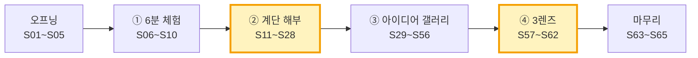
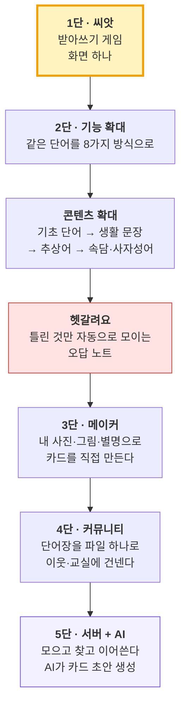
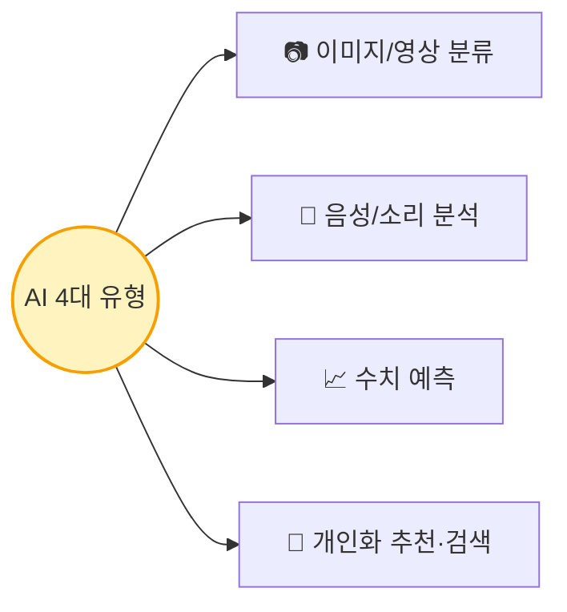
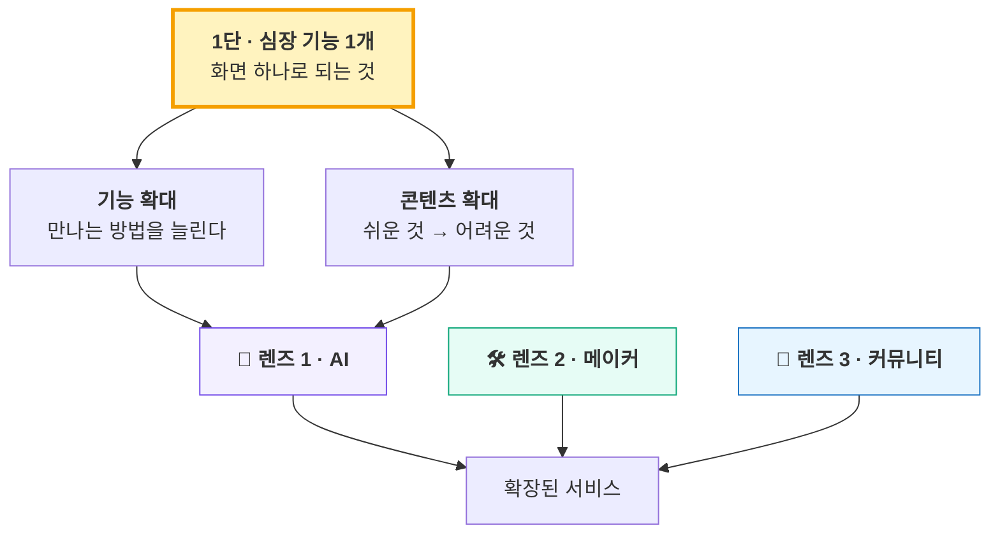

# 2일차 · 1교시 PPT — Gamma 슬라이드 설계서 (65장 · 40분)
## 「아이디어는 어떻게 커지는가 — 링고팡 해부 + 아이디어 갤러리」

> **원본 수업안** [(수업)-2일차_1교시_링고팡해부_아이디어갤러리.md](<(수업)-2일차_1교시_링고팡해부_아이디어갤러리.md>) — 6분 체험 → 계단 해부 → 아이디어 갤러리(63개) → 3렌즈
> **이어지는 수업안** [(수업)-2일차_2교시_워크시트_실습.md](<(수업)-2일차_2교시_워크시트_실습.md>) — 이 슬라이드의 도구(3렌즈·눈금 체크리스트·발상 공식)를 그대로 씁니다
> **짝 파일** `(2일차-1교시)-PPT_감마_붙여넣기용.md` — 이 설계서의 `<!--GAMMA-->` 블록만 `---`로 이어 붙인 파일 (Gamma에 그대로 붙여넣기)
> **성격** **보여주는 시간.** 교사가 시연·해부하고 자료를 깝니다. 학생 산출물은 포스트잇 3장 + 표시 몇 개뿐입니다.
> **수준** 초등 고학년~중등(11~15세). ① **쉬운 말**(어려운 말은 괄호로 한 번만) ② **한 장에 한 가지** ③ **도식(계단·비교·분기·매트릭스) 중심** ④ 말투 **"~해요"**

---

## 0. 사용 방법

### 0-1. Gamma에 넣는 순서

| 단계 | 할 일 |
|:---:|---|
| 1 | Gamma **새로 만들기 → 텍스트 붙여넣기(Paste in text)** |
| 2 | 짝 파일 **「(2일차-1교시)-PPT_감마_붙여넣기용.md」 전체 복사 → 붙여넣기** |
| 3 | 텍스트 처리 **"유지(Preserve)"**, 카드 나누기 **"---" 기준** → **65장** |
| 4 | 테마: 1일차와 같은 **흰 바탕 + 딥 네이비 제목 + 틸(청록)·코럴 포인트**. 단, 2일차는 **계단을 상징하는 머스터드 옐로**를 강조색으로 하나 더 씁니다 |
| 5 | 카드마다 **📐 레이아웃** 지시대로 Gamma 스마트 레이아웃(계단·단계·비교·그리드·타임라인)으로 변환 — **표는 도식으로 바꾸기 좋게** 짜 두었어요 |
| 6 | **🎨 이미지 프롬프트(영문)** 를 Gamma **AI 이미지 생성**에 붙여넣기 |
| 7 | **🗣️ 선생님 멘트**는 발표자 노트로 |

> **고칠 때** — 설계서의 `<!--GAMMA-->` ~ `<!--/GAMMA-->` 사이를 고친 뒤 붙여넣기용 파일도 같이 고쳐 주세요.

### 0-2. 이미지 프롬프트 공통 규칙

| 규칙 | 이유 |
|---|---|
| 모든 프롬프트 끝에 **`friendly flat vector illustration, clean infographic style, navy teal and coral palette with mustard yellow accent, soft shadows, white background, no text`** | 1일차와 같은 색으로 **시리즈 통일** + 2일차의 **계단 강조색(머스터드)** 추가 |
| 인물은 **`Korean students (age 13)`** | 2일차 대상은 초등 고학년~중등입니다 |
| **`no text`** 필수 | AI 그림은 한글·숫자를 깨뜨려요 → 글자는 **Gamma 텍스트**로 |
| 실제 앱 화면·회사 로고 금지 | 링고팡은 **실물 시연**으로 보여 주고, 슬라이드에는 **은유 그림**만 |
| 계단 파트는 **위로 올라가는 구도** 고정 | 슬라이드 12장 내내 같은 시각 언어 → "계단"이 몸에 남습니다 |

### 0-3. 전체 구성 — 65장 / 40분

| 파트 | 슬라이드 | 시간 | 성격 |
|---|:---:|:---:|---|
| 오프닝 — 오늘의 한 줄 | S01~S05 | 1분 | 판 깔기 |
| ① 링고팡 6분 체험 | S06~S10 | 6분 | **학생 활동** |
| ② 발전 계단 해부 | S11~S28 | 14분 | **오늘의 심장** |
| ③ 아이디어 갤러리 | S29~S56 | 14분 | 자료 깔기 |
| ④ 확장의 원리 · 3렌즈 | S57~S62 | 5분 | **도구 지급** |
| 마무리 · 2교시 예고 | S63~S65 | 1분 | 넘기기 |
| **합계** | **65장** | **40분** | |

> **⏱ 시간이 밀리면** — ③의 **영역 슬라이드(S45~S53)** 를 줄입니다. **④(S57~S62)는 절대 줄이지 마세요.** 2교시 실습이 통째로 그 표 위에서 돌아갑니다.

### 0-4. 이 시간의 종이·교구

| 교구 | 언제 | 무엇을 |
|---|---|---|
| **링고팡 체험 기기** 팀당 1대 | S07 | 6분만 |
| **포스트잇 3색** (노랑·파랑·분홍) | S08 | 재밌던 것 / 왜 이렇게? / 내가 바꾼다면 |
| **계단 A3 벽보** 1장 | S12부터 수업 내내 | 손가락으로 가리키며 진행 |
| **3렌즈 A4 포스터** 3장 | S58부터 2교시 내내 | 칠판 옆 부착 |
| **영역 카탈로그 인쇄본** 팀당 1부 | S38 배포 | 2교시 막힐 때만 꺼냄 |

---

# 오프닝 — 오늘의 한 줄 (S01~S05 · 1분)

## S01 · 표지 — 필수

<!--GAMMA-->
# 아이디어는 어떻게 커지는가

2일차 1교시 · 링고팡 해부 + 아이디어 갤러리

> 🪜 **"하나를 끝내면 힘이 생기고, 그 힘이 다음 계단을 보여준다."**
<!--/GAMMA-->

- **📐 레이아웃** — 좌측 큰 제목, 우측 이미지 55%
- **🎨 이미지 프롬프트**
  `A small glowing seed at the bottom of a wide staircase, each step above it slightly larger and brighter, a Korean student (age 13) standing on the first step looking upward with curiosity, the top steps fading into soft light, friendly flat vector illustration, clean infographic style, navy teal and coral palette with mustard yellow accent, soft shadows, white background, no text`
  (요약: 씨앗 하나에서 시작해 위로 넓어지는 계단, 첫 칸에 선 학생)
- **🗣️ 선생님 멘트** — "오늘은 **아이디어를 고르는 법**을 배우는 게 아니에요. **하나를 골라 키우는 법**을 배웁니다. 키우는 법을 알면 어떤 씨앗을 골라도 돼요."

---

## S02 · 어제까지 / 오늘 — 필수

<!--GAMMA-->
# 아직 아무것도 못 정했죠? **정상이에요**

| 어제(1일차) 한 것 | 오늘(2일차) 할 것 |
|---|---|
| 아이디어 회의 · 벤치마킹 | **하나를 골라 계단 놓기** |
| 아직 **확정 없음** | 1교시 **남의 계단** → 2교시 **내 계단** |

> 아이디어가 없어서 막히는 게 아니에요.
> **아이디어가 어떻게 커지는지를 본 적이 없어서** 막히는 거예요.
<!--/GAMMA-->

- **📐 레이아웃** — 좌우 비교 2단, 하단 강조 박스
- **🎨 이미지 프롬프트**
  `Left side shows scattered sticky notes floating in the air in disarray, right side shows the same notes stacked into a neat rising staircase, a Korean student (age 13) in the middle looking from one side to the other, friendly flat vector illustration, clean infographic style, navy teal and coral palette with mustard yellow accent, soft shadows, white background, no text`
  (요약: 흩어진 포스트잇 → 계단으로 쌓인 포스트잇, 가운데에서 바라보는 학생)
- **🗣️ 선생님 멘트** — "'뭐 만들지 모르겠어요'가 오늘 제일 많이 나올 말이에요. 괜찮아요. **길을 한 번 보면 여러분 아이디어에도 같은 길을 깔 수 있어요.**"

---

## S03 · 오늘 40분 지도 — 필수

<!--GAMMA-->
# 오늘 40분, 이렇게 갑니다

1. 🎮 **6분** — 링고팡 직접 해 보기
2. 🪜 **14분** — 그 앱의 **계단을 1단부터 5단까지 해부**
3. 🖼 **14분** — 또래가 상 받은 아이디어 **갤러리**
4. 🔍 **5분** — 키우는 도구 **렌즈 3개** 받아 가기

> 다음 시간(2교시)에 **여러분 계단을 직접 놓습니다.**
<!--/GAMMA-->

- **📐 레이아웃** — 가로 4단계 타임라인 (숫자 원 + 아이콘)
- **🎨 이미지 프롬프트**
  `Four connected station markers along a horizontal path: a game controller, a staircase, a picture frame gallery wall, and three magnifying lenses, a Korean student (age 13) walking along the path with a backpack, friendly flat vector illustration, clean infographic style, navy teal and coral palette with mustard yellow accent, soft shadows, white background, no text`
  (요약: 게임패드 → 계단 → 갤러리 액자 → 렌즈 3개로 이어지는 길)
- **🗣️ 선생님 멘트** — "1교시는 **보는 시간**이에요. 오늘 한 개도 안 만들어요. 대신 **눈이 바뀝니다.**"

---

## S04 · 칠판 3줄 — 필수

<!--GAMMA-->
# 오늘 칠판에 계속 붙어 있을 3줄

> 🪜 **하나가 되면 → 힘이 생기고 → 다음 계단이 보인다**

> 🔧 **손으로 먼저. 손이 아플 때 AI.**

> 🚫 **1단 없이 5단 없다**
<!--/GAMMA-->

- **📐 레이아웃** — 세로 3단 강조 박스 (각 줄 큰 글씨, 배경색 다르게)
- **🎨 이미지 프롬프트**
  `A classroom blackboard with three horizontal chalk-drawn banner strips, a small staircase icon on the first, a hand and a tiny robot on the second, a crossed-out tall tower on the third, friendly flat vector illustration, clean infographic style, navy teal and coral palette with mustard yellow accent, soft shadows, white background, no text`
  (요약: 칠판에 띠 3줄 — 계단 / 손과 로봇 / 금지된 높은 탑)
- **🗣️ 선생님 멘트** — "이 세 줄은 오늘 수업이 끝날 때까지 안 지웁니다. 수업 중에 제가 계속 손가락으로 가리킬 거예요."

---

## S05 · 오늘 안 하는 것 — 필수

<!--GAMMA-->
# 1교시에 **안 하는 것** 3가지

- 🚫 아이디어 **확정** → 2교시
- 🚫 **코딩** → 3~4교시
- 🚫 워크시트 **작성** → 2교시

> 지금 "이거 만들자!"가 떠오르면 **좋은 신호**예요.
> 그런데 **적어만 두고 아껴 두세요.**
<!--/GAMMA-->

- **📐 레이아웃** — 금지 아이콘 3개 가로 배치 + 하단 강조 박스
- **🎨 이미지 프롬프트**
  `Three items placed inside a soft glowing storage box with a pause symbol above it: a checkmark stamp, a laptop, and a worksheet, a Korean student (age 13) gently closing the lid, friendly flat vector illustration, clean infographic style, navy teal and coral palette with mustard yellow accent, soft shadows, white background, no text`
  (요약: 도장·노트북·워크시트를 상자에 넣고 뚜껑을 덮는 학생)
- **🗣️ 선생님 멘트** — "지금 떠오른 아이디어는 **2교시 연료**예요. 사라지지 않게 포스트잇에만 적어 두세요."

---

# ① 링고팡 6분 체험 (S06~S10 · 6분)

## S06 · 체험 규칙 — 필수

<!--GAMMA-->
# 지금부터 딱 **6분**, 직접 해 봅니다

- 📱 팀당 기기 **1대** — 돌려 가며
- ⏰ **6분 뒤 기기를 덮습니다** (알람 켤게요)
- 👀 재미보다 **"왜 이렇게 만들었을까"** 를 보세요

> 여러분은 지금 **사용자**가 아니라 **해부하러 온 사람**이에요.
<!--/GAMMA-->

- **📐 레이아웃** — 좌측 규칙 3줄, 우측 큰 타이머 이미지
- **🎨 이미지 프롬프트**
  `Three Korean students (age 13) sharing one tablet on a desk, a large six-minute timer floating beside them, one student holding a magnifying glass over the tablet screen instead of just playing, friendly flat vector illustration, clean infographic style, navy teal and coral palette with mustard yellow accent, soft shadows, white background, no text`
  (요약: 태블릿 하나를 셋이 보는데 한 명은 돋보기를 들고 있음)
- **🗣️ 선생님 멘트** — "6분은 짧아요. 일부러 짧게 했어요. **재밌어지기 직전에 끊을** 거예요. 그래야 '왜?'가 남아요."

---

## S07 · 6분 동선 — 필수

<!--GAMMA-->
# 6분 동선 — 이 순서대로만

| 시간 | 할 것 | 내용 |
|:---:|---|---|
| 0~2분 | **받아쓰기 게임** | 한글 시작 → 타이핑으로 단어 3개 |
| 2~4분 | **자모 게임 / 퍼즐** | 자음·모음 끌어다 글자 만들기 |
| 4~6분 | **메이커** | 내 카드 1장 만들기 (그림 + 내 별명) |

> 이 3개는 각각 **1단 · 2단 · 3단**이에요. 곧 알게 됩니다.
<!--/GAMMA-->

- **📐 레이아웃** — 가로 3구간 타임라인, 각 구간 아이콘 + 시간 배지
- **🎨 이미지 프롬프트**
  `A horizontal three-segment progress bar, each segment holding an icon: a keyboard with letter tiles, jigsaw puzzle pieces forming a shape, and a blank card with a pencil and a photo clip, friendly flat vector illustration, clean infographic style, navy teal and coral palette with mustard yellow accent, soft shadows, white background, no text`
  (요약: 3구간 진행바 — 키보드 / 퍼즐 조각 / 빈 카드와 연필)
- **🗣️ 선생님 멘트** — "순서를 정해 드리는 이유가 있어요. 이 셋이 **계단 1단·2단·3단**이거든요. 지금은 말 안 할게요."

---

## S08 · 포스트잇 3장 — 필수

<!--GAMMA-->
# 기기 덮고 **30초 안에** 포스트잇 3장

| 색 | 적을 것 |
|:---:|---|
| 🟨 **노랑** | 재밌었던 것 **딱 한 가지** |
| 🟦 **파랑** | **"이건 왜 이렇게 만들었을까?"** |
| 🟪 **분홍** | **"내가 만들면 여기를 바꾸겠다"** |

> 이 3장은 **버리지 마세요.** 오늘 1교시 내내 다시 씁니다.
<!--/GAMMA-->

- **📐 레이아웃** — 포스트잇 3장 카드 그리드 (색 구분 강하게)
- **🎨 이미지 프롬프트**
  `Three sticky notes in yellow, blue and pink lying on a desk next to a closed tablet, a pencil resting across them, a small stopwatch showing a short time beside the notes, friendly flat vector illustration, clean infographic style, navy teal and coral palette with mustard yellow accent, soft shadows, white background, no text`
  (요약: 덮은 태블릿 옆 노랑·파랑·분홍 포스트잇 3장과 초시계)
- **🗣️ 선생님 멘트** — "노랑은 **몇 단이었는지** 확인할 때, 파랑은 **제가 답해 드릴 때**, 분홍은 **'그건 몇 단 이야기일까'** 를 물을 때 씁니다."

---

## S09 · 파랑에 거의 항상 나오는 질문 3개 — 필수

<!--GAMMA-->
# 파랑 포스트잇에 꼭 나오는 3가지

- ❓ "왜 **캐릭터**가 없지?"
- ❓ "왜 **정답 보기**가 없지?"
- ❓ "왜 **공짜**지?"

> ### 놀라운 답 — **셋 다 일부러 그렇게 만든 거예요.**
> 이유는 계단을 해부하면서 하나씩 알려 드릴게요.
<!--/GAMMA-->

- **📐 레이아웃** — 물음표 카드 3장 가로 + 하단 반전 강조 박스
- **🎨 이미지 프롬프트**
  `Three large question mark cards standing in a row, behind them a single designer's blueprint sheet showing the same three marks circled deliberately with a red pen, friendly flat vector illustration, clean infographic style, navy teal and coral palette with mustard yellow accent, soft shadows, white background, no text`
  (요약: 물음표 카드 3장 뒤로, 그 셋이 빨간 펜으로 동그라미 쳐진 설계도)
- **🗣️ 선생님 멘트** — "'빠뜨린 것'처럼 보이는 게 사실 **가장 고민한 결정**인 경우가 많아요. 좋은 제품은 **뺀 것**으로 알아봅니다."

---

## S10 · 연결 — 필수

<!--GAMMA-->
# 지금 만진 건 **완성된 앱**이에요

## 처음부터 이렇게 컸을까요?

> ### 아니요. 처음엔 **화면 딱 하나**였어요.
> 지금부터 그 계단을 통째로 뜯어볼게요.
<!--/GAMMA-->

- **📐 레이아웃** — 중앙 대문짝 문구 1개, 배경 이미지 풀블리드
- **🎨 이미지 프롬프트**
  `A large complex tree with many branches on the right, and on the left the same tree shown as a single tiny sprout in a small pot, a dotted arrow connecting the sprout to the tree, friendly flat vector illustration, clean infographic style, navy teal and coral palette with mustard yellow accent, soft shadows, white background, no text`
  (요약: 큰 나무와, 점선 화살표로 이어진 작은 새싹 화분)
- **🗣️ 선생님 멘트** — (기기를 완전히 치운 뒤) "3만 개짜리 앱이에요. 그런데 **1단은 화면 하나**였어요. 그 길을 지금부터 봅니다."

---

# ② 링고팡 발전 계단 해부 (S11~S28 · 14분) — **오늘의 심장**

## S11 · 왜 남의 계단을 뜯어보나 — 필수

<!--GAMMA-->
# 왜 남의 계단을 **14분이나** 뜯어보나

> 여러분이 오늘 제일 많이 할 말 →
> ### 😵 **"뭐 만들지 모르겠어요"**

- 아이디어가 **없어서**가 아니에요
- 아이디어가 **어떻게 커지는지 본 적이 없어서**예요

> 길을 한 번 보면, **내 아이디어에도 같은 길을 깔 수 있어요.**
<!--/GAMMA-->

- **📐 레이아웃** — 상단 말풍선 강조, 하단 원인/진짜원인 2단 비교
- **🎨 이미지 프롬프트**
  `A Korean student (age 13) standing before a blank wall holding a single small idea note, while a transparent overlay shows a staircase path drawn onto that same wall, friendly flat vector illustration, clean infographic style, navy teal and coral palette with mustard yellow accent, soft shadows, white background, no text`
  (요약: 빈 벽 앞에 선 학생, 그 벽에 반투명 계단 길이 겹쳐 보임)
- **🗣️ 선생님 멘트** — (교사용 속마음) "학생이 기획에서 무너지는 지점은 **'내 아이디어가 작아서 부끄럽다'** 예요. **큰 서비스도 1단은 초라했다**는 걸 구체적 사실로 보여주면 그 부끄러움이 사라집니다. **오늘의 정서적 목표입니다.**"

---

## S12 · 계단 전체도 — 필수 ★핵심

<!--GAMMA-->
# 링고팡 발전 계단 — 전체도

| 칸 | 무엇 |
|:---:|---|
| **1단 · 씨앗** | 받아쓰기 게임 — **화면 하나** |
| **2단 · 기능 확대** | 같은 단어를 **8가지 방식**으로 |
| ↳ **콘텐츠 확대** | 기초 단어 → 문장 → 속담·사자성어 |
| ↳ **헷갈려요** | 틀린 것만 자동으로 모이는 오답 노트 |
| **3단 · 메이커** | 내 사진·그림·별명으로 카드를 직접 |
| **4단 · 커뮤니티** | 만든 단어장을 **파일 하나로** 이웃에게 |
| **5단 · 서버 + AI** | 모으고 찾고, **AI가 카드 초안 생성** |
<!--/GAMMA-->

- **📐 레이아웃** — **Gamma "단계(Steps)" 또는 계단형 레이아웃 필수.** 1단은 머스터드, 헷갈려요는 코럴, 5단은 보라 계열로 강조
- **🎨 이미지 프롬프트**
  `A seven-step ascending staircase seen from the side, the bottom step glowing warm yellow and very small, each step wider than the last, two small side landings branching off the middle steps, the top step tinted purple with a faint circuit pattern, friendly flat vector illustration, clean infographic style, navy teal and coral palette with mustard yellow accent, soft shadows, white background, no text`
  (요약: 7칸 계단, 1단은 작고 노랗게, 중간에 옆 갈래 2개, 꼭대기는 보라)
- **🗣️ 선생님 멘트** — "이 그림을 **A3로 크게 그려 교실 뒤에 붙여 두세요.** 오늘 남은 시간 내내 손가락으로 가리킵니다."
- **🗂 참고 원본 도식**

---

## S13 · 오늘의 문법 ㉮㉯㉰ — 필수 ★핵심

<!--GAMMA-->
# 한 칸마다 **세 문장**을 소리 내어 말합니다

- **㉮ 무엇이 됐나** — 결과
- **㉯ 그래서 무슨 힘이 생겼나** — 힘
- **㉰ 그 힘이 보여준 다음 칸** — 다음

> ### 이 세 줄이 **오늘 수업의 문법**이에요.
> 2교시에 여러분이 **똑같이 따라 씁니다.**
<!--/GAMMA-->

- **📐 레이아웃** — 세로 3단 화살표 체인 (㉮ → ㉯ → ㉰), 각 칸 큰 아이콘
- **🎨 이미지 프롬프트**
  `Three linked circular badges in a vertical chain, the first holding a finished small object, the second holding a battery charging up, the third holding a lantern lighting the next step of a staircase above, friendly flat vector illustration, clean infographic style, navy teal and coral palette with mustard yellow accent, soft shadows, white background, no text`
  (요약: 완성물 → 충전되는 배터리 → 위 계단을 비추는 등불, 세로 체인)
- **🗣️ 선생님 멘트** — "이 틀을 기억하세요. 앞으로 나올 7칸 전부 **이 세 문장으로만** 설명할 거예요. 반복이 지루해도 그대로 갑니다. **반복이 목적이에요.**"

---

## S14 · 1단 씨앗 — 본 장면 — 필수

<!--GAMMA-->
# 🪜 1단 · 씨앗 — 어떤 장면에서 시작했나

| 항목 | 내용 |
|---|---|
| **본 장면** | 좋은 학습지·앱을 **수십만 원어치** 샀는데, 몇 주 뒤 아이가 **배운 단어를 기억 못 한다** |
| **깎기 전 문제** | ❌ "한글 앱이 필요해" |
| **깎은 진짜 문제** | ⭕ **"보기 중에 고르면 몰라도 맞는다. 손으로 써야 진짜 안다"** |

> 아이디어는 **장면**에서 시작했어요. 회의에서 나온 게 아니에요.
<!--/GAMMA-->

- **📐 레이아웃** — 상단 장면 이미지, 하단 ❌/⭕ 2단 비교 박스
- **🎨 이미지 프롬프트**
  `A tall stack of workbooks and learning tablets on one side of a desk, and on the other side a child's notebook page with the same word forgotten and left blank, a parent figure looking at both with a puzzled expression, friendly flat vector illustration, clean infographic style, navy teal and coral palette with mustard yellow accent, soft shadows, white background, no text`
  (요약: 쌓인 학습지·태블릿 vs 빈칸으로 남은 공책, 난감한 부모)
- **🗣️ 선생님 멘트** — "'한글 앱이 필요해'는 **아직 문제가 아니에요.** 그건 해결책이죠. **깎아서 문장 하나로 만든 것**이 1단의 출발입니다."

---

## S15 · 1단 — '화면 하나'가 뭐였나 — 필수

<!--GAMMA-->
# '화면 하나'가 **구체적으로** 무엇이었나

1. 그림 없이 **"고양이"** 글자와 스피커 버튼만
2. 아이가 **고 · 양 · 이** 를 직접 친다
3. 맞으면 다음, 틀리면 **힌트 한 글자**

> ### 끝입니다.
> 점수판도, 로그인도, 캐릭터도 **없었습니다.**
<!--/GAMMA-->

- **📐 레이아웃** — 3단계 가로 스텝 + 하단 "없었던 것 3가지" 취소선 배지
- **🎨 이미지 프롬프트**
  `A single minimal app screen mockup in the center showing only a speaker icon and three empty letter boxes, surrounded by three greyed-out crossed circles representing a scoreboard, a login form and a cartoon mascot, friendly flat vector illustration, clean infographic style, navy teal and coral palette with mustard yellow accent, soft shadows, white background, no text`
  (요약: 스피커 아이콘과 빈 글자칸 3개만 있는 화면, 주변에 회색으로 지워진 점수판·로그인·캐릭터)
- **🗣️ 선생님 멘트** — "여러분이 2교시에 그릴 **1단도 딱 이 정도**입니다. 화면 한 장. **작아서 부끄러운 게 아니라, 작아야 끝납니다.**"

---

## S16 · 1단 — 왜 효과가 있었나 — 필수

<!--GAMMA-->
# 왜 이게 효과가 있었을까?

| 🔘 고르기 | ✍️ 직접 하기 |
|---|---|
| 보기 중에 고른다 | 직접 친다 |
| **몰라도 맞는다** | **알아야만 맞는다** |

> ### ✍️ 여러분 아이디어에서
> **'고르기'에 해당하는 건 뭐고, '직접 하기'에 해당하는 건 뭘까요?**

**㉮ 결과** 우리 집 아이가 **혼자 끝까지 갔다**
**㉯ 힘** *"어? 되네."* — **확신 1개**
**㉰ 다음 칸** 같은 게임만 하니 **3일 만에 질린다**
<!--/GAMMA-->

- **📐 레이아웃** — 좌우 비교 2단 + 하단 ㉮㉯㉰ 3칸 띠
- **🎨 이미지 프롬프트**
  `Left panel shows a hand tapping one of four multiple-choice buttons with eyes closed, right panel shows the same hand carefully writing letters into empty boxes, a small confident spark icon above the right panel, friendly flat vector illustration, clean infographic style, navy teal and coral palette with mustard yellow accent, soft shadows, white background, no text`
  (요약: 눈 감고 보기 고르는 손 vs 글자를 직접 쓰는 손, 오른쪽 위에 확신의 반짝임)
- **🗣️ 선생님 멘트** — "이게 아까 파랑 포스트잇 **'왜 정답 보기가 없지?'** 의 답이에요. **일부러 뺀 겁니다.**"

---

## S17 · 2단 기능 확대 — 필수 ★핵심

<!--GAMMA-->
# 🪜 2단 — 기능을 늘린 게 아니라
# **만나는 방법**을 늘렸다

- **왜 올라갔나** — 게임 하나로는 **반복이 지겹다.** 그런데 어휘는 반복해야 남는다
- **만든 것** — ① 낱말카드 ② 타이핑 ③ 자모 조합 ④ 쓰기(획순) ⑤ 주관식 퀴즈 ⑥ 낱말 퍼즐 ⑦ 톡 대화 ⑧ 메이커

> ### ⚠️ 기능 8개가 아니라, **같은 일 하나를 만나는 방법 8개**예요.
<!--/GAMMA-->

- **📐 레이아웃** — 중앙 원(단어 1개) → 바깥 8개 아이콘 방사형 (Gamma 순환/방사 레이아웃)
- **🎨 이미지 프롬프트**
  `One glowing word tile at the center of a circle, eight different small activity icons arranged evenly around it and all pointing inward: a flashcard, a keyboard, building blocks, a brush stroke, a quiz sheet, a crossword grid, a chat bubble, and a craft card, friendly flat vector illustration, clean infographic style, navy teal and coral palette with mustard yellow accent, soft shadows, white background, no text`
  (요약: 중앙 단어 타일 하나를 8가지 활동 아이콘이 둘러싸고 안쪽을 향함)
- **🗣️ 선생님 멘트** — "여기가 학생들이 제일 많이 헷갈리는 곳이에요. **'기능 추가'가 아니라 '만나는 방법 추가'.** 이 차이를 꼭 짚어 주세요."

---

## S18 · '고양이' 하루 8동선 + 5일 사이클 — 필수

<!--GAMMA-->
# '고양이' 한 단어가 하루에 만나는 8가지

본다 → 친다 → 조립한다 → 따라 그린다 → 답을 쓴다 → 찾아낸다 → 써먹는다 → 내가 만든다

## 숨은 설계 — **5일 사이클**

| 1~3일 | 4일 | 5일 |
|---|---|---|
| 연습 | 복습(퀴즈·퍼즐) | **응용(문장·말하기)** |

> 사람은 하루만 지나도 배운 것의 약 **60%를 잊습니다.**
> 핵심은 **5일차**예요 — ***"안다"와 "쓸 수 있다"는 다릅니다.***
<!--/GAMMA-->

- **📐 레이아웃** — 상단 8단계 가로 체인, 하단 5일 타임라인 (5일차만 머스터드 강조)
- **🎨 이미지 프롬프트**
  `A horizontal chain of eight small action icons flowing left to right, below it a five-day calendar strip where the last day is highlighted and shows a speech bubble, a faint downward curve behind representing forgetting, friendly flat vector illustration, clean infographic style, navy teal and coral palette with mustard yellow accent, soft shadows, white background, no text`
  (요약: 8동선 가로 체인 + 5일 달력 띠, 마지막 날 강조, 배경에 망각 곡선)
- **🗣️ 선생님 멘트** — "5일차가 없으면 앞 4일이 헛일이에요. **'응용'이 있어야 남습니다.**"

---

## S19 · 2단 — 우리 수업으로 번역 — 필수

<!--GAMMA-->
# 🎯 우리 수업으로 번역

> "사용자가 **같은 일을 또 하고 싶어지게** 하려면?
> **기능을 늘리지 말고, 만나는 방법을 늘리세요.**"

### 예) 기분 기록 앱

| 방법 1 | 방법 2 | 방법 3 | 방법 4 |
|---|---|---|---|
| 숫자로 | 색으로 | 얼굴 그림으로 | 주간 그래프로 |

> **네 가지 방법, 같은 하나의 일.**
<!--/GAMMA-->

- **📐 레이아웃** — 하단 4칸 카드 그리드, 상단 인용 강조 박스
- **🎨 이미지 프롬프트**
  `Four small cards side by side each showing a different way to record the same feeling: a number dial, a color swatch, a simple face drawing, and a weekly bar chart, all connected by a thin line to one single heart icon above them, friendly flat vector illustration, clean infographic style, navy teal and coral palette with mustard yellow accent, soft shadows, white background, no text`
  (요약: 같은 하나의 마음 아이콘에서 뻗어 나온 네 가지 기록 방식 카드)
- **🗣️ 선생님 멘트** — "2교시 실습에서 이 질문을 **그대로** 씁니다. 지금 예시를 잘 기억해 두세요."

---

## S20 · 콘텐츠 확대 — 쉬운 것 → 어려운 것 — 필수

<!--GAMMA-->
# 🪜 옆으로 뻗은 계단 — **콘텐츠 확대**

| 단계 | 한글 | 영어 |
|:---:|---|---|
| 0~1 | 자모·첫걸음 / 기본 단어 | ABC·파닉스 / My First Words |
| 2~3 | 생활 단어 → **생활 문장** | Daily Words → Sentences |
| 4~5 | **속담 · 사자성어** | Kids Talk → Everyday English |
| 6~7 | — | Travel Talk → Quotes & Proverbs |

> 결과 — 한글 15,000+ · 영어 20,000+ = **3만 개 이상**
> **㉯ 생긴 힘** = "이 앱 하나로 **4세부터 9세까지** 간다"는 범위
<!--/GAMMA-->

- **📐 레이아웃** — 좌→우로 올라가는 계단형 표 (난이도 축), 우측 상단에 3만 개 배지
- **🎨 이미지 프롬프트**
  `A gently rising ramp made of stacked word cards, the cards at the bottom small and simple, the cards at the top larger and denser, a counter badge at the top showing a large pile, friendly flat vector illustration, clean infographic style, navy teal and coral palette with mustard yellow accent, soft shadows, white background, no text`
  (요약: 단어 카드가 쌓여 만든 오르막, 아래는 단순 위는 빽빽)
- **🗣️ 선생님 멘트** — "기능이 아니라 **내용물**을 넓힌 거예요. 이것도 계단입니다. 다만 **위가 아니라 옆으로** 뻗었어요."

---

## S21 · 콘텐츠 확대 — 그림으로 못 그리는 말 — 필수

<!--GAMMA-->
# 대부분의 앱이 **멈추는 지점**

| 보통 앱 | 링고팡 |
|---|---|
| 사물 이름에서 끝 — 사과, 고양이 | 그림으로 **못 그리는 말**까지 |
| (그림으로 그릴 수 있으니까) | *"억울하다" "직각" "이등변"* |

> 교과서에서 아이를 무너뜨리는 건 **그림으로 못 그리는 말**이에요.
> 속담·사자성어는 외우게 하지 않고 **유래를 그림으로** 보여줍니다. **이야기가 붙으면 외워집니다.**

> ### 🎯 번역 — "여러분 아이디어에도 **쉬운 버전과 어려운 버전**이 있어요."
> 기분 기록 → 1단계 '좋다/나쁘다' → 2단계 '설렌다/서운하다/억울하다'
<!--/GAMMA-->

- **📐 레이아웃** — 좌우 비교 2단 + 하단 번역 강조 박스
- **🎨 이미지 프롬프트**
  `Left side shows three easily drawable objects: an apple, a cat, a car. Right side shows a blank picture frame with a question mark inside and a small story scroll beside it unrolling into a tiny scene, friendly flat vector illustration, clean infographic style, navy teal and coral palette with mustard yellow accent, soft shadows, white background, no text`
  (요약: 왼쪽 사과·고양이·자동차, 오른쪽 물음표 액자와 풀린 이야기 두루마리)
- **🗣️ 선생님 멘트** — "**㉰ 다음 칸** — 3만 개를 **다 반복하면 죽습니다.** 그래서 다음 칸이 나옵니다."

---

## S22 · 헷갈려요 — 앞 계단의 부작용 — 필수 ★핵심

<!--GAMMA-->
# 🪜 "헷갈려요" — **앞 계단의 부작용**이 낳은 발명

| 항목 | 내용 |
|---|---|
| **문제** | 대부분의 앱은 **전부를 처음부터** 반복 → **아는 것까지 또** 한다 |
| **만든 것** | 틀린 단어가 **자동으로 쌓임** → 힌트 → 두 번째 기회 → 목록 적립 → 다시 맞히면 **조용히 빠짐** |
| **㉮ 결과** | 아이가 **"내가 무엇을 모르는지"를 눈으로 본다** |
| **㉯ 힘** | 같은 앱인데 **아이마다 다른 목록** = 개인화 |
| **㉰ 다음 칸** | "이 단어는 **내 방식으로** 만들고 싶다" → 메이커 |
<!--/GAMMA-->

- **📐 레이아웃** — 좌측 문제/우측 해결 2단, 하단 ㉮㉯㉰ 띠
- **🎨 이미지 프롬프트**
  `A funnel where many word cards pour in from the top but only the ones marked with a small red cross fall into a separate labeled tray below, the correct ones drifting away, a student looking at the small tray with realization, friendly flat vector illustration, clean infographic style, navy teal and coral palette with mustard yellow accent, soft shadows, white background, no text`
  (요약: 깔때기에서 틀린 카드만 따로 떨어지는 쟁반, 그걸 보는 학생)
- **🗣️ 선생님 멘트** — "'헷갈려요'는 **회의에서 나온 게 아니에요.** 콘텐츠가 3만 개가 되니까 **어쩔 수 없이 생긴** 기능이에요."

---

## S23 · 오늘 가장 중요한 한 줄 — 필수 ★핵심

<!--GAMMA-->
# 🗣 오늘 가장 중요한 한 줄

> ### 좋은 기능은 **회의에서 나오지 않고,**
> ### **앞 계단의 부작용**에서 나옵니다.

## 🎯 번역 — 강력한 아이디어 씨앗

> "여러분 앱에서 **'틀린 것 · 못한 것 · 안 한 것'만 따로 모으면** 어떻게 될까요?"

| 준비물 앱 | 물 마시기 앱 | 영어 앱 |
|---|---|---|
| 자주 **빠뜨리는 것**만 | **못 채운 날**만 | 매번 **틀리는 단어**만 |
<!--/GAMMA-->

- **📐 레이아웃** — 상단 대문짝 인용 1줄, 하단 3칸 카드
- **🎨 이미지 프롬프트**
  `An empty meeting table with chairs on the left shown faded, and on the right a staircase where a crack in one step is being repaired and the repair itself becomes the next step upward, friendly flat vector illustration, clean infographic style, navy teal and coral palette with mustard yellow accent, soft shadows, white background, no text`
  (요약: 흐릿한 회의 탁자 vs 계단의 금을 고친 자리가 다음 칸이 되는 모습)
- **🗣️ 선생님 멘트** — "이 한 줄은 칠판에 적어 두세요. 2교시에 '기능 뭐 넣지?'로 막히는 팀에게 **이 질문 하나면** 풀립니다."

---

## S24 · 3단 메이커 — 뿜뿜 아빠 — 필수 ★핵심

<!--GAMMA-->
# 🪜 3단 · 메이커 — **쓰는 사람이 만드는 사람이 된다**

- **왜 올라갔나** — 회사가 아무리 많이 넣어도 **오늘 학습지에서 틀린 그 단어**는 없다
- **만든 것** — 내 사진 · 내 그림 · 내 문장 · 내 별명으로 카드 만들기

## 🫧 "뿜뿜 아빠" 이야기

아이가 아빠 사진을 찍어 카드에 넣고 이름을 **"뿜뿜 아빠"** 라고 붙였습니다.

> 교과서의 "아빠"는 며칠 뒤 잊습니다.
> **웃으면서 자기가 지은 "뿜뿜 아빠"는 안 잊습니다.**
> 이유 둘 — ① **내가 만든 것**이라서 ② **감정이 붙어서**
<!--/GAMMA-->

- **📐 레이아웃** — 상단 정의 2줄, 하단 스토리 카드 (사진 카드 이미지 크게)
- **🎨 이미지 프롬프트**
  `A handmade learning card held by a child's hands, the card contains a snapshot photo of a smiling adult and a hand-drawn doodle frame around it, beside it a plain printed textbook card looking dull by comparison, a small heart floating over the handmade one, friendly flat vector illustration, clean infographic style, navy teal and coral palette with mustard yellow accent, soft shadows, white background, no text`
  (요약: 손으로 만든 사진 카드 vs 밋밋한 교과서 카드, 손수 만든 쪽에 하트)
- **🗣️ 선생님 멘트** — "이 장면 하나가 제일 잘 먹힙니다. **꼭 소리 내어 이야기로** 들려주세요. 표로 읽으면 안 통합니다."

---

## S25 · 3단 — 왜 '글자'를 골랐나 — 필수

<!--GAMMA-->
# 왜 하필 **글자**를 재료로 골랐을까?

| 영상 · 캐릭터 | 글자 |
|---|---|
| 무거워서 **사용자가 못 만든다** | 카드 한 장이 **텍스트 몇 줄** |
| 회사만 만들 수 있다 | **아이도 만든다** |

> ### 🔑 그래서 질문 하나
> **"내가 고른 재료가, 나중에 사용자도 만들 수 있는 재료인가?"**

> 🎯 번역 — "우리 앱에서 사용자가 **자기 이름·자기 사진·자기 말**을 넣을 칸은 어디예요? **딱 한 칸만** 만든다면?"
<!--/GAMMA-->

- **📐 레이아웃** — 좌우 비교 2단 + 중앙 하단 열쇠 아이콘 질문 박스
- **🎨 이미지 프롬프트**
  `Left side shows a heavy film reel and a 3D character model marked with a heavy weight symbol, right side shows light paper text cards floating easily in a child's hand, a key icon glowing between the two sides, friendly flat vector illustration, clean infographic style, navy teal and coral palette with mustard yellow accent, soft shadows, white background, no text`
  (요약: 무거운 필름릴·3D 캐릭터 vs 가볍게 손에 든 텍스트 카드, 가운데 열쇠)
- **🗣️ 선생님 멘트** — "**㉯ 힘 = 애착.** 내가 만든 건 남에게 보여주고 싶어요. **㉰ 다음 칸 = 나눌 길을 만들자.**"

---

## S26 · 4단 커뮤니티 — 필수

<!--GAMMA-->
# 🪜 4단 · 커뮤니티 — **파일 하나로 옆집에**

- **만든 것** — 단어장을 **파일 하나로 내보내기** → 카톡·메일로 전달 → 받은 집에서 **바로 게임에 등장**, 수정도 가능
- **㉮ 결과** — **서버 없이도** 사람 손을 타고 콘텐츠가 흐른다
- **㉯ 힘** — 회사가 안 만든 주에도 **사용자끼리 오간다** = 문화의 시작
- **㉰ 다음 칸** — 오가는 게 많아지니 **어디 보관? 어떻게 찾지? 중복은?** → 서버
<!--/GAMMA-->

- **📐 레이아웃** — 가로 흐름 도식 (집 → 파일 → 집 → 집), 서버 아이콘은 회색 처리
- **🎨 이미지 프롬프트**
  `Three small houses in a row, a single document file passing from the first house to the second and third along a dotted path, no server or cloud icon anywhere, a greyed-out cloud with a question mark far above, friendly flat vector illustration, clean infographic style, navy teal and coral palette with mustard yellow accent, soft shadows, white background, no text`
  (요약: 집 세 채 사이로 파일 하나가 점선을 타고 전달됨, 위쪽 구름은 회색 물음표)
- **🗣️ 선생님 멘트** — "서버 없이 커뮤니티를 만든 거예요. **'커뮤니티 = 서버'가 아닙니다.** 2교시에 팀들이 꼭 헷갈리는 지점이에요."

---

## S27 · 4단 — 왜 '빈 종이'가 아니었나 — 필수

<!--GAMMA-->
# 왜 **빈 종이**가 아니라 **채워진 단어장**을 줬을까

| ❌ "만들어 보세요" | ⭕ 채워진 템플릿 배포 |
|---|---|
| **아무도 안 만든다** | **한 줄만 고치는 것**으로 시작 |
| | 잘 만든 건 **다음 달 공식 템플릿** |

> ### 🗣 학생에게 꼭 밝히세요
> "선생님도 지금 여러분한테 **채워진 걸 먼저 보여주고** 있는 거예요.
> 이게 링고팡이 쓴 방법이에요."
<!--/GAMMA-->

- **📐 레이아웃** — 좌우 비교 2단 + 하단 메타 강조 박스 (색 반전)
- **🎨 이미지 프롬프트**
  `Left shows a person staring at a completely blank sheet with no marks, right shows the same person confidently editing one line on an already-filled sheet with a pencil, an arrow showing the edited sheet becoming a new template stack, friendly flat vector illustration, clean infographic style, navy teal and coral palette with mustard yellow accent, soft shadows, white background, no text`
  (요약: 빈 종이 앞에서 굳은 사람 vs 채워진 종이 한 줄 고치는 사람, 그것이 새 템플릿이 됨)
- **🗣️ 선생님 멘트** — "이 슬라이드가 **오늘 3부(갤러리)의 예고편**이에요. 곧 63개 아이디어를 뿌릴 텐데, 그게 바로 **채워진 단어장**입니다."

---

## S28 · 5단 서버+AI — 왜 마지막인가 + 결론 — 필수 ★핵심

<!--GAMMA-->
# 🪜 5단 · 서버 + AI — **왜 AI가 맨 마지막인가**

> **"서버는 기능을 늘리려고 두는 게 아니라,
> 나눔을 관리해야 할 때 비로소 필요해진다."**

| 💰 돈 이야기 | |
|---|---|
| 서버 없음 | 사용자 1명이든 10만 명이든 **추가 비용 거의 0원** (월 10만 원대로 버팀) |
| 보통 앱 | 사람이 늘면 서버비도 늘어 **잘 될수록 손해** |
| **AI도 공짜 아님** | 그림 한 장, 문장 한 줄마다 **실제로 돈이 나갑니다** |

> ### 🚫 커뮤니티부터 → **빈 게시판**
> ### 🚫 서버부터 → **돈만 나감**
> ### 🚫 AI부터 → **뭘 자동화할지 모름**
> ## ✅ **1단 없이 5단 없다**
<!--/GAMMA-->

- **📐 레이아웃** — 상단 인용, 중단 3행 표, **하단 금지 3줄 + 결론 1줄을 대문짝으로** (이 슬라이드에서 가장 큰 글씨)
- **🎨 이미지 프롬프트**
  `Three toppling towers on the left each built starting from the top block and collapsing, and on the right one solid staircase built from the bottom up standing firm with a checkmark badge, coins falling out of the collapsing towers, friendly flat vector illustration, clean infographic style, navy teal and coral palette with mustard yellow accent, soft shadows, white background, no text`
  (요약: 위부터 쌓아 무너지는 탑 3개(동전이 쏟아짐) vs 아래부터 쌓아 굳건한 계단)
- **🗣️ 선생님 멘트** — "**1.5분 안에 끝내세요.** 여기서 시간을 쓰면 갤러리가 무너집니다. **'AI를 넣자는 말은 돈을 쓰자는 말'** 한 줄만 확실히 남기면 됩니다."

---

# ③ 아이디어 갤러리 (S29~S56 · 14분)

## S29 · 왜 지금 자료를 보여주나 — 필수

<!--GAMMA-->
# 왜 바로 이어서 **또래 작품**을 보여줄까

> 링고팡은 **어른이 5년에 걸쳐 키운 것**이에요.
> 이것만 보면 *"나는 저렇게 못 해"* 로 끝날 수 있어요.

## 그래서 목적은 딱 하나

> ### 📏 **"아, 이 정도 크기면 되는구나"** 라는 **눈금**을 얻는 것

- 베끼라는 게 **아닙니다**
- **빈 종이 앞의 공포**를 없애는 겁니다 — 링고팡의 **채워진 템플릿**과 똑같은 방법
<!--/GAMMA-->

- **📐 레이아웃** — 상단 경고 인용, 중앙 큰 자(ruler) 이미지, 하단 2줄
- **🎨 이미지 프롬프트**
  `A large measuring ruler lying horizontally, a small paper prototype placed on it showing a modest size, and beside it a towering finished product shown faded and far away, a student comparing the two calmly, friendly flat vector illustration, clean infographic style, navy teal and coral palette with mustard yellow accent, soft shadows, white background, no text`
  (요약: 큰 자 위에 놓인 작은 시제품, 멀리 흐릿하게 선 거대한 완성품, 비교하는 학생)
- **🗣️ 선생님 멘트** — "이 순서가 중요해요. **큰 것 → 또래 것.** 순서를 바꾸면 학생이 기가 죽습니다."

---

## S30 · 심사위원은 실제로 뭘 보나 — 필수

<!--GAMMA-->
# 심사위원은 실제로 **뭘 보나**

| 대회 | 최상위 배점 축 |
|---|---|
| **디미고 창업아이디어** | 문제발견 / 창의성 / 구체성 / **실행 흔적** / 사업화 — 동점이면 **실행 흔적 1순위** |
| **LG AI 청소년 캠프** | AI 관심 / **문제의 참신성** / 협업 / 열정 |
| **한국코드페어** | 사회현안 해결 + **소스코드·연구데이터 제출** |
<!--/GAMMA-->

- **📐 레이아웃** — 3행 비교 표, **굵게 표시된 축만 머스터드 하이라이트**
- **🎨 이미지 프롬프트**
  `Three judging scorecards fanned out on a table, on each one a different criterion row is highlighted with a marker, a magnifying glass hovering over the most-highlighted row, friendly flat vector illustration, clean infographic style, navy teal and coral palette with mustard yellow accent, soft shadows, white background, no text`
  (요약: 펼쳐진 심사표 3장, 각각 다른 항목이 형광펜으로 강조됨)
- **🗣️ 선생님 멘트** — "대회 이름은 몰라도 돼요. **공통으로 굵게 표시된 칸**만 보세요."

---

## S31 · 결론 — 실행 흔적이 점수 — 필수 ★핵심

<!--GAMMA-->
# 💡 결론 한 줄

> ## "아이디어의 **크기**가 아니라
> ## **'내가 직접 만들어봤다는 증거'**가 점수다."

### 그래서 오늘·내일 우리가 만드는 것이 전부 점수예요

| 오늘 그리는 종이 | 다음 시간 만드는 화면 | 친구 5명 피드백 |
|---|---|---|

> 아이디어만 멋있는 지원자는 **이걸 못 냅니다.**
> 우리는 **작동하는 화면 + 시연 영상 + 사용자 5명 피드백**을 **이틀 안에** 만들 수 있어요.
<!--/GAMMA-->

- **📐 레이아웃** — 대문짝 인용 + 하단 3칸 증거 카드
- **🎨 이미지 프롬프트**
  `A balance scale where one pan holds a large shiny but empty thought bubble and the other pan holds a small stack of real evidence: a hand-drawn paper sheet, a phone showing a simple screen, and five small feedback notes, the evidence side tipping down decisively, friendly flat vector illustration, clean infographic style, navy teal and coral palette with mustard yellow accent, soft shadows, white background, no text`
  (요약: 저울 — 크고 텅 빈 생각풍선 vs 종이·화면·피드백 쪽지 5장, 증거 쪽이 내려감)
- **🗣️ 선생님 멘트** — "'우리 아이디어 별론데요'라는 팀이 나오면 **이 슬라이드로 돌아오세요.** 점수는 아이디어가 아니라 **흔적**입니다."

---

## S32 · 또래의 실제 수상 아이템 — 필수

<!--GAMMA-->
# 또래가 **실제로 상 받은** 아이템

| 어디서 | 아이템 | 포인트 |
|---|---|---|
| LG AI 캠프 3기 | **앱 권한 위험도 판별** · **검색 이력 맞춤 답변** | 내 폰 안의 문제 |
| LG AI 캠프 2기 | **딸기 가격 예측** · **아기 울음소리 해석** · **점심 메뉴 추천** | 데이터 구하기 쉬운 주제 |
| LG AI 캠프 1기 | **벌레 물린 자국 인식** · **표정 읽어주는 보조** | 이미지 분류 **한 가지**로 끝 |
| 삼성 주니어 SW | **데이터텍티브** — SNS 사진 속 개인정보 자동 가림 | 디지털 안전 = 단골 수상 |
| 학생발명전시회 **대통령상** | **기름 걷는 국자** — *"아빠 뱃살이 걱정돼서"* | **동기가 개인적일수록 강하다** |
| 학생발명전시회 **대통령상** | **뚜껑 이탈 방지 맨홀** (중1) | 뉴스에서 본 사고 |
<!--/GAMMA-->

- **📐 레이아웃** — 6행 표를 **Gamma 카드 그리드 3×2** 로 변환 권장 (대통령상 2개는 코럴 테두리)
- **🎨 이미지 프롬프트**
  `A gallery wall with six simple framed exhibit cards, each frame containing a plain object icon: a phone permission shield, a strawberry price tag, a mosquito bite mark, a blurred photo, a kitchen ladle, and a manhole cover, friendly flat vector illustration, clean infographic style, navy teal and coral palette with mustard yellow accent, soft shadows, white background, no text`
  (요약: 액자 6개 갤러리 벽 — 권한 방패·딸기 가격표·물린 자국·흐린 사진·국자·맨홀 뚜껑)
- **🗣️ 선생님 멘트** — (반드시 소리 내어 읽기) "특히 **'아빠 뱃살'**. 이게 **대통령상**이에요. 웃기죠? 그런데 진짜예요."

---

## S33 · 여기서 짚을 3가지 — 필수 ★핵심

<!--GAMMA-->
# 🎯 여기서 반드시 짚을 3가지

1. **주제가 작다** — "기후 위기 해결"이 아니라 **딸기 가격 · 점심 메뉴 · 벌레 물린 자국**
2. **전부 반경 3미터다** — 동생 울음 · 급식 · 앱 권한 · 내 검색 기록 · 아빠 뱃살
3. **"기준"을 스스로 정했다** — 포스터 심사 질문이 이거였어요

> ❓ *"이 데이터는 어디서 구했죠?"*
> ❓ *"정상이 아니라는 **기준**은 무슨 근거죠?"*

> ➡️ **2교시 아이템 카드에 "판정 기준 한 문장"을 쓰는 이유가 정확히 이것입니다.**
<!--/GAMMA-->

- **📐 레이아웃** — 번호 3단 세로 + 하단 심사 질문 2개를 말풍선으로
- **🎨 이미지 프롬프트**
  `A small circle drawn on the floor around a student with a three-meter radius marker, everyday objects inside the circle glowing while a distant globe outside the circle is faded, two question-mark speech bubbles floating at the circle's edge, friendly flat vector illustration, clean infographic style, navy teal and coral palette with mustard yellow accent, soft shadows, white background, no text`
  (요약: 반경 3미터 원 안의 생활 사물은 빛나고 바깥의 지구본은 흐림, 물음표 말풍선 2개)
- **🗣️ 선생님 멘트** — "'기준'이 오늘 나오는 세 번째 단어예요. **1단 / 흔적 / 기준.** 이 셋만 가져가도 오늘은 성공입니다."

---

## S34 · AI 4대 유형 — 필수 ★핵심

<!--GAMMA-->
# AI는 결국 **네 가지**로 수렴해요

| 유형 | 만들 수 있는 예 |
|---|---|
| 📷 **이미지/영상 분류** | 벌레 물린 자국 · 표정 읽기 · 딥페이크 의심 체크 |
| 🎤 **음성/소리 분석** | 아기 울음 3분류 · 단톡방 소리 탐지 |
| 📈 **수치 예측** | 딸기 가격 · 급식 잔반량 · 버스 놓칠 확률 |
| 👤 **개인화 추천·검색** | 점심 메뉴 추천 · 검색 이력 맞춤 답변 |
<!--/GAMMA-->

- **📐 레이아웃** — **중앙 원 + 4방향 분기(Gamma 방사형)** 필수. 표 그대로 두지 말 것
- **🎨 이미지 프롬프트**
  `A central glowing hub with four branches radiating outward, each branch ending in an icon: a camera frame, a sound waveform, a rising line chart, and a person silhouette with a star, friendly flat vector illustration, clean infographic style, navy teal and coral palette with mustard yellow accent, soft shadows, white background, no text`
  (요약: 중앙 허브에서 4갈래 — 카메라·음파·꺾은선·별 붙은 사람)
- **🗣️ 선생님 멘트** — "AI가 어렵게 느껴지죠? **중학생이 실제로 만들 수 있는 건 이 네 가지뿐**이에요. 오히려 **선택지가 줄어서 편합니다.**"
- **🗂 참고 원본 도식**

---

## S35 · 주제 분야 TIER — 필수

<!--GAMMA-->
# 주제 분야 **TIER** — 안전한 순서

| TIER | 왜 이 등급인가 | 예 |
|---|---|---|
| 🥇 **1 · 디지털 안전·프라이버시** | 중등부 **상위 수상 단골**. 심사에서 가장 잘 먹힘 | 앱 권한 번역기 · SNS 개인정보 가림 · 단톡방 소외 온도계 |
| 🥈 **2 · 학교생활·교육** | 사용자가 **바로 옆에** 있어 테스트가 쉬움 | 급식 잔반 투표 · 수행평가 대시보드 |
| 🥉 **3 · 가족·돌봄·안전** | **개인적 동기**가 발표에서 진심으로 전달됨 | 키오스크 연습장 · 거북목 알림 |

> ❓ **"그럼 TIER 3은 나쁜 건가요?"**
> ➡️ 아니요. **대통령상이 TIER 3(아빠 뱃살)에서 나왔습니다.**
> TIER는 **안전한 순서**일 뿐, **잘 만든 것이 이깁니다.**
<!--/GAMMA-->

- **📐 레이아웃** — 시상대(포디움) 3단 도식 + 하단 반전 강조 박스
- **🎨 이미지 프롬프트**
  `A three-level podium with gold silver and bronze steps, a small trophy resting on the bronze step instead of the gold one, a surprised student pointing at it, friendly flat vector illustration, clean infographic style, navy teal and coral palette with mustard yellow accent, soft shadows, white background, no text`
  (요약: 금·은·동 시상대인데 트로피가 동메달 칸에 놓여 있고, 놀란 학생이 가리킴)
- **🗣️ 선생님 멘트** — "TIER를 알려주는 이유는 **고르라고**가 아니라 **막혔을 때 갈 곳**을 알려드리는 거예요."

---

## S36 · 눈금 체크리스트 3개 — 필수 ★핵심

<!--GAMMA-->
# 📏 아이템 '눈금' 체크리스트 **3개**
## (2교시에 그대로 씁니다 — 받아쓰세요)

| # | 질문 | 통과 기준 |
|:---:|---|---|
| ① | **내 주변 3m 이내의 '진짜' 문제인가?** | "기후 위기" ❌ / "우리 반 급식 잔반" ⭕ — **숫자로 셀 수 있어야** |
| ② | **AI가 아니면 안 되는 이유가 있는가?** | 단순 규칙(if-then)으로 되면 **AI 불필요.** 이미지·패턴·예측처럼 **배워야 하는 영역**이어야 |
| ③ | **데이터를 스스로 만들거나 구할 수 있는가?** | **2주 기록 / 30명 설문 / 공공 API** — 직접 증거 확보 가능해야 |
<!--/GAMMA-->

- **📐 레이아웃** — 체크박스 3줄 세로, 각 줄 큰 번호 배지 + ❌/⭕ 대비
- **🎨 이미지 프롬프트**
  `Three large checkbox cards stacked vertically, the first showing a small radius circle, the second showing a branching pattern beside a crossed-out simple switch, the third showing a notebook of tally marks and a survey sheet, a pencil ticking the first box, friendly flat vector illustration, clean infographic style, navy teal and coral palette with mustard yellow accent, soft shadows, white background, no text`
  (요약: 체크박스 카드 3장 — 반경 원 / 분기 패턴과 지워진 스위치 / 정(正)자 기록장과 설문지)
- **🗣️ 선생님 멘트** — "**받아쓰게 하세요.** 2교시 점수표가 정확히 이 세 칸입니다."

---

## S37 · ②번 질문과 링고팡 5단의 연결 — 필수 ★핵심

<!--GAMMA-->
# ⚠️ 여기서 **1교시 전체가 하나로 묶입니다**

> ②번을 보세요. **"AI가 아니면 안 되는 이유"** 를 물어요.
> 그런데 그 이유를 **어떻게 알까요?**

## 🔧 손으로 먼저 해봐야 압니다

- 링고팡이 AI를 **5단에 둔 이유**가 바로 이거예요
- 손으로 목록 20개를 만들어 본 사람만
  *"여기가 손이 제일 오래 걸리네, **여기를 AI로**"* 라고 말할 수 있어요

> ### 🚫 **AI부터 넣으면 ②번 질문에 답을 못 합니다.**
<!--/GAMMA-->

- **📐 레이아웃** — 상단 질문, 중앙 손→AI 화살표 도식, 하단 금지 강조
- **🎨 이미지 프롬프트**
  `A hand writing a long list by hand until the wrist shows a small ache mark at one specific row, and only at that row a small robot arm reaches in to take over, the rest of the list still handwritten, friendly flat vector illustration, clean infographic style, navy teal and coral palette with mustard yellow accent, soft shadows, white background, no text`
  (요약: 손으로 긴 목록을 쓰다 한 줄에서 손목이 아파지고, **그 줄에만** 로봇 팔이 들어옴)
- **🗣️ 선생님 멘트** — "이 슬라이드가 1교시의 **접착제**예요. 계단(②부)과 갤러리(③부)를 여기서 붙입니다."

---

## S38 · 카탈로그 여는 법 — 필수

<!--GAMMA-->
# 📂 이제 **63개 아이디어**를 펼칩니다 — 읽는 법

> **다 기억할 필요 없어요.** 목적은 소개가 아니라
> ### **"아, 이런 것도 되는구나"의 문이 9개 열리는 것**

| 표기 | 뜻 |
|---|---|
| **[1단] 심장 하나** | 오늘 종이에 그리고 다음 시간에 만들 **딱 그것.** 화면 3장 안 |
| **커지는 길** | 🛠 메이커 / 🤝 커뮤니티 / 🤖 AI 로 확장할 힌트 |
| 🥇🥈🥉 | 앞에서 본 **TIER** |
| ⭐ | 데이터 구하기가 **특히 쉬운 것** |

> 📖 읽는 방식 — **"이런 장면이 있었고 → 1단은 이것 하나고 → 나중에 이렇게 커진다."**
<!--/GAMMA-->

- **📐 레이아웃** — 상단 목적 인용, 하단 범례 표 (아이콘 크게)
- **🎨 이미지 프롬프트**
  `Nine small doors arranged in a three by three grid on a wall, a few of them slightly ajar with warm light spilling out, a student holding a printed booklet standing before them, friendly flat vector illustration, clean infographic style, navy teal and coral palette with mustard yellow accent, soft shadows, white background, no text`
  (요약: 3×3으로 배열된 문 9개, 몇 개는 빛이 새어 나오게 열려 있음)
- **🗣️ 선생님 멘트** — **(여기서 인쇄본 배포)** "영역 하나에 **40초**. 저는 **영역 이름 → 패턴 한 줄 → 아이디어 2~3개**만 읽고 넘어갑니다. 전부 읽으려 하지 마세요."

---

## S39 · 큰 주제 6개 (도식) — 필수 ★핵심

<!--GAMMA-->
# 🎯 먼저 — **"너는 무엇에 관심이 있니?"**

| 큰 주제 | 한 줄 |
|---|---|
| 💛 **감정·마음** | 내 마음·친구 관계를 **알아차리게** 한다 |
| 🎯 **맞춤형·개인화** | 사람마다 **다른 것**을 보여준다 |
| 🔒 **보안·프라이버시** | 모르고 당하는 걸 **번역**해 준다 |
| 🤝 **돌봄·접근성** | 못 하는 사람이 **혼자 하게** 한다 |
| 📈 **기록·예측** | 세어 보면 **보이지 않던 게** 보인다 |
| 🎨 **만들고 나누기** | 내가 만든 걸 **남에게 준다** |
<!--/GAMMA-->

- **📐 레이아웃** — **중앙 질문 원 + 6방향 분기.** 표 그대로 두지 말 것
- **🎨 이미지 프롬프트**
  `A central question mark circle with six branches radiating outward, each ending in a distinct icon: a heart, a target, a padlock, two clasped hands, a rising chart, and a craft palette, friendly flat vector illustration, clean infographic style, navy teal and coral palette with mustard yellow accent, soft shadows, white background, no text`
  (요약: 중앙 물음표에서 6갈래 — 하트·과녁·자물쇠·맞잡은 손·차트·팔레트)
- **🗣️ 선생님 멘트** — "63개를 그냥 쫙 보여주면 **고르기만 하다 끝나요.** 그래서 **관심사부터** 묻습니다. *'너 요즘 뭐에 관심 있어?'* 에 답할 수 있는 학생은 **아이디어도 고를 수 있어요.**"

---

## S40 · 큰 주제 6개 — 링고팡은 여기서 뭘 했나 — 필수

<!--GAMMA-->
# 각 주제가 **강한 이유** + 링고팡의 답

| 큰 주제 | 강한 이유 | 링고팡은 여기서 뭘 했나 |
|---|---|---|
| 💛 **감정·마음** | 또래가 가장 공감. 발표에 진심이 실림 | *"아이가 재미없어하면 그날 저녁에 고쳤다"* |
| 🎯 **맞춤형** | **AI 4대 유형 '추천·개인화'** 와 바로 연결 | **"헷갈려요"** — 아이마다 다른 목록 |
| 🔒 **보안** | 🥇 **TIER 1.** 중등부 대상이 몇 년째 여기서 | 사진·그림을 **기기 안에만** 저장 |
| 🤝 **돌봄** | 🥉 **대통령상이 나온 영역** | *"부모 없어도 혼자"* → **모든 화면 음성(TTS)** |
| 📈 **기록·예측** | 숫자가 나오면 심사 질문에 강함 | **5일 사이클** — 기록으로 복습 시점 결정 |
| 🎨 **만들고 나누기** | 🛠🤝가 **1단부터** 심장 | **메이커("뿜뿜 아빠") → 단어장 나눔** |

> ### 🗣 "지금부터 63개를 보여줄 건데, **6개 중 내 심장이 뛰는 거 하나**만 찍어 두세요."
<!--/GAMMA-->

- **📐 레이아웃** — 6행 표 → **Gamma 카드 그리드 3×2** 권장, 각 카드 상단에 이모지 대형
- **🎨 이미지 프롬프트**
  `Six small cards arranged in a grid, each card showing one icon on top and a tiny staircase drawn at its bottom edge, one card in the middle glowing brighter as if chosen, a hand about to touch it, friendly flat vector illustration, clean infographic style, navy teal and coral palette with mustard yellow accent, soft shadows, white background, no text`
  (요약: 카드 6장 그리드, 각 카드 아래에 작은 계단, 한 장만 빛나고 손이 다가감)
- **🗣️ 선생님 멘트** — "2교시 시작하자마자 **'우리 팀은 이 주제다'** 부터 정하고 들어갑니다."

---

## S41 · 생애주기 (도식) — 필수 ★핵심

<!--GAMMA-->
# ⏳ 그리고 — **"누구의, 인생 어느 지점 문제인가"**

| 시기 | 대표 불편 |
|---|---|
| 👶 **유아 4~7세** | 글자를 못 읽는다 · 혼자 못 한다 |
| 🎒 **초등 저 8~10세** | 혼자 하고 싶은데 **자꾸 혼난다** |
| 📚 **초등 고·중등 11~15세** ← **지금 나** | 시험 · 친구 · 용돈 · 폰 |
| 🧑‍🎓 **고등·청년** | 진로 · 시간 · 혼자 사는 법 |
| 🧑‍🍼 **중장년 부모** | 돌볼 사람이 많다 · **시간이 없다** |
| 🧓 **노년** | 작은 글씨 · 복잡한 화면 · **물어보기 민망함** |
<!--/GAMMA-->

- **📐 레이아웃** — **가로 타임라인 6단계.** '지금 나' 칸만 머스터드 + 굵은 테두리
- **🎨 이미지 프롬프트**
  `A horizontal life-stage timeline with six silhouettes growing from a small child to an elderly person, the third silhouette highlighted with a glowing circle and standing slightly forward, friendly flat vector illustration, clean infographic style, navy teal and coral palette with mustard yellow accent, soft shadows, white background, no text`
  (요약: 어린이→노인으로 이어지는 실루엣 6개, 세 번째만 빛나며 앞으로 나와 있음)
- **🗣️ 선생님 멘트** — "큰 주제가 **'무엇에'** 라면, 생애주기는 **'누구의'** 예요. 이 축이 빠지면 아이디어가 **'모두를 위한 앱'**이 돼요."

---

## S42 · 생애주기 → 설계 규칙 — 필수

<!--GAMMA-->
# 시기를 고르면 **설계 규칙**이 따라옵니다

| 시기 | 생기는 **설계 규칙** |
|---|---|
| 👶 유아 | **글자 대신 색·그림·소리.** 설명이 길면 탈락 |
| 🎒 초등 저 | **혼나지 않고 3초 안에.** 실패해도 되는 화면 |
| 📚 초등 고·중등 | **내가 사용자다.** 오늘 바로 테스트 가능 |
| 🧑‍🎓 고등·청년 | 내가 **아직 안 겪었다** → **인터뷰가 필요** |
| 🧑‍🍼 중장년 부모 | **1초 안에 끝나야** 한다. 한 화면 |
| 🧓 노년 | **버튼 3개 이하.** 되돌리기가 항상 있어야 |

> 링고팡이 강했던 이유 — **4~9세**라고 못 박았습니다.
> 그래서 *"글자를 못 읽는 네 살도 혼자"* 라는 기준이 나왔고, **모든 화면의 음성(TTS)**이 나왔어요.
<!--/GAMMA-->

- **📐 레이아웃** — 좌측 시기 / 우측 규칙 2단 매핑, 하단 링고팡 사례 박스
- **🎨 이미지 프롬프트**
  `Six phone screen mockups in a row, each designed differently: one with only large color blocks, one with a single big button, one dense with information, one with a microphone, one with a single tap area, and one with only three huge buttons, friendly flat vector illustration, clean infographic style, navy teal and coral palette with mustard yellow accent, soft shadows, white background, no text`
  (요약: 대상에 따라 전혀 다르게 생긴 화면 목업 6개)
- **🗣️ 선생님 멘트** — "**대상을 정하면 화면이 저절로 정해집니다.** 이게 생애주기를 고르는 진짜 이득이에요."

---

## S43 · 두 갈래 질문 + 흔한 실수 — 필수

<!--GAMMA-->
# 두 갈래 중 **하나만** 고르세요

| ① 내 생애주기에서 | ② 3미터 안, **다른** 생애주기에서 |
|---|---|
| *"지금 너의 처지에서 곤란한 건?"* | *"네 옆에 **너와 다른 시기**를 사는 사람은?"* |
| 시험·수행평가·용돈·단톡방 | 동생 8살 · 할머니 · 엄마 |
| **내가 곧 사용자** → 오늘 바로 확인 | **각도가 다르다** → 대통령상·링고팡이 전부 이쪽 |

> ### ⚠️ 자주 나오는 실수
> *"초등학생부터 어른까지 다 쓸 수 있어요!"*
> ➡️ 되물으세요 — **"그럼 글씨 크기는 누구한테 맞출 건가요?"**
> **'모두를 위한 앱'은 아무도 안 씁니다.**
<!--/GAMMA-->

- **📐 레이아웃** — 좌우 2갈래 분기 도식 + 하단 경고 박스 (코럴)
- **🎨 이미지 프롬프트**
  `A path splitting into two directions, the left path leading to a mirror reflecting a student, the right path leading to a younger sibling and an elderly grandparent standing nearby, a faded oversized crowd blocked off at the center with a barrier, friendly flat vector illustration, clean infographic style, navy teal and coral palette with mustard yellow accent, soft shadows, white background, no text`
  (요약: 두 갈래 길 — 거울 속 나 / 동생과 할머니, 가운데 '모두'로 가는 길은 막혀 있음)
- **🗣️ 선생님 멘트** — "둘 중 뭐가 더 좋냐고요? **둘 다 좋아요. 다만 하나로 정해야 합니다.**"

---

## S44 · 오늘의 발상 공식 — 필수 ★핵심

<!--GAMMA-->
# 📐 오늘의 발상 공식 (2교시 내내 씁니다)

> ## 🎯 큰 주제 × ⏳ 생애주기 × 📂 영역 = **우리 아이템**

| 예시 |
|---|
| 💛 감정 × 📚 중등(나) × 영역 1(학교) = *"발표 때 떨린 걸 **나만 아는 신호**로 기록하기"* |
| 🤝 돌봄 × 🧓 노년 × 영역 4(가족) = *"할머니용 **버튼 3개** 리모컨"* |
| 🎯 맞춤형 × 🎒 초등 저 × 영역 7(환경) = *"동생이 **제일 자주 틀리는 것만** 모아 보여주기"* |
<!--/GAMMA-->

- **📐 레이아웃** — 상단 공식을 **수식처럼 대문짝**, 하단 예시 3줄
- **🎨 이미지 프롬프트**
  `Three slot-machine style reels side by side, each reel showing a different icon category, and below them a single output card emerging from a slot, friendly flat vector illustration, clean infographic style, navy teal and coral palette with mustard yellow accent, soft shadows, white background, no text`
  (요약: 슬롯머신 릴 3개가 맞물려 아래로 결과 카드 한 장이 나옴)
- **🗣️ 선생님 멘트** — "**곱셈이에요.** 하나라도 비면 0이 됩니다. 칠판에 크게 적어 두고 2교시 내내 가리키세요."

---

## S45 · 영역 1 · 학교생활 — 필수

<!--GAMMA-->
# 📚 영역 1 · 학교생활 — 🥈 TIER 2 (**가장 안전한 시작점**)

> **공통 패턴** — 사용자가 **교실 안에** 있다. 오늘 만들어 오늘 5명에게 보여줄 수 있다.

| # | 아이디어 | **[1단] 심장 하나** | 커지는 길 |
|:---:|---|---|---|
| 1 | **준비물 알림판** ⭐ | 내일 시간표 선택 → 준비물 목록 | 🛠 우리 반 항목 추가 → 🤖 알림장 사진 인식 |
| 2 | **급식 잔반 투표판** ⭐ | 오늘 메뉴 👍/👎 → 막대그래프 | 🤝 다른 반 비교 → 🤖 다음 주 잔반 예측 |
| 3 | **분실물 한 줄 게시판** | **"주운 물건 + 장소"** 한 줄 등록 | 🤖 비슷한 분실물 자동 매칭 |
| 5 | **수행평가 D-day 카드** ⭐ | 과목·날짜 → **급한 순서대로 색깔** | 🤝 반 공용 일정으로 |
| 7 | **화장실 혼잡 표시** | 층 선택 + "지금 붐빔" 버튼 | 🤝 히트맵 → 🤖 시간대 예측 |
| 8 | **필기 3줄 요약 카드** | 오늘 배운 것 3줄 → 카드로 쌓기 | 🤖 사진에서 글자 추출 |

> *(전체 8개는 인쇄본 참고 — 4번 모둠 역할 룰렛 · 6번 자리 바꾸기 공정 뽑기)*
<!--/GAMMA-->

- **📐 레이아웃** — 표 유지 + 상단 패턴 인용 박스 (영역 슬라이드 9장 **동일 포맷 고정**)
- **🎨 이미지 프롬프트**
  `A classroom desk scene with small floating cards above it showing a timetable, a lunch tray with a thumbs icon, a lost-and-found box and a calendar with colored urgency dots, friendly flat vector illustration, clean infographic style, navy teal and coral palette with mustard yellow accent, soft shadows, white background, no text`
  (요약: 교실 책상 위로 시간표·급식판·분실물함·색깔 달력 카드가 떠 있음)
- **🗣️ 선생님 멘트** — **(40초)** "영역 이름 → 패턴 한 줄 → 아이디어 2~3개만. 넘어갑니다."

---

## S46 · 영역 2 · 공부·기억 — 필수

<!--GAMMA-->
# ✍️ 영역 2 · 공부·기억 — **링고팡 계열**

> **공통 패턴** — **"틀린 것만 모은다"** / **"같은 것을 여러 방법으로 만난다"** 이 둘 중 하나가 심장.

| # | 아이디어 | **[1단] 심장 하나** | 커지는 길 |
|:---:|---|---|---|
| 9 | **내 오답 노트** ⭐ | 틀린 문제 입력 → **자동으로 목록에 쌓임** | 🤝 친구와 오답 교환 → 🤖 비슷한 문제 추천 |
| 10 | **받아쓰기 연습기** | 듣고 → 타이핑 → 맞으면 다음 *(링고팡 1단 그대로)* | 🛠 내 단어장 → 🤝 파일 주고받기 |
| 11 | **5일 복습 달력** | 오늘 외운 것 → **4일 뒤 자동 재등장** | 🤖 내가 잘 잊는 요일 분석 |
| 12 | **교과 어려운 말 사전** | "직각·이등변·가정법"을 **그림 한 장**으로 | 🤝 반 공용 사전 |
| 13 | **내가 만드는 문제집** | 내가 문제 3개 내면 친구가 푼다 | 🛠 처음부터 메이커가 심장 |

> *(인쇄본에 14~16번: 단어 뒤집기 카드 · 암기 타이머 · 사자성어 유래 카드)*
<!--/GAMMA-->

- **📐 레이아웃** — S45와 동일 포맷
- **🎨 이미지 프롬프트**
  `A notebook where only the pages marked with small red crosses are being pulled out and collected into a separate neat stack, a five-day calendar strip beside it with one day circled, friendly flat vector illustration, clean infographic style, navy teal and coral palette with mustard yellow accent, soft shadows, white background, no text`
  (요약: 빨간 표시된 페이지만 뽑혀 따로 쌓이는 공책, 옆에 5일 달력)
- **🗣️ 선생님 멘트** — "9번 오답 노트는 **오늘 해부한 '헷갈려요' 그대로**예요. 원리를 그대로 쓰는 거죠."

---

## S47 · 영역 3 · 디지털 안전 — 필수 ★핵심

<!--GAMMA-->
# 🔒 영역 3 · 디지털 안전·프라이버시 — 🥇 **TIER 1**

> **공통 패턴** — **"어른도 잘 모르는 걸 우리가 번역해 준다."**

| # | 아이디어 | **[1단] 심장 하나** | 커지는 길 |
|:---:|---|---|---|
| 17 | **앱 권한 번역기** ⭐ | 권한 선택 → **"왜 위치정보가 필요한가"** 중학생 말로 한 줄 | 🤝 반 공용 번역 사전 → 🤖 자동 위험 점수 |
| 18 | **업로드 전 개인정보 검사기** | 체크리스트 5개 (명찰/학생증/문패/차량번호/위치) | 🤖 사진 자동 감지·흐림 |
| 19 | **낚시 링크 판별기** | URL 붙여넣기 → **오타 도메인·단축URL** 위험 점수 | 🛠 내가 규칙 추가 |
| 20 | **단톡방 소외 온도계** | 대화 붙여넣기 → **한 사람만 답 못 받은 횟수** | ⚠️ 실명 금지, 붙여넣기만 |
| 23 | **딥페이크 의심 체크리스트** | 손가락 개수·그림자 방향 **6개 항목** → 판정 | 🤖 이미지 자동 판별 |

> ### 🗣 "이 영역이 왜 강할까요? **여러분이 어른보다 잘 알기 때문**이에요."
<!--/GAMMA-->

- **📐 레이아웃** — S45와 동일 + 하단 교사 대사 강조 박스 (이 영역만 금메달 배지 크게)
- **🎨 이미지 프롬프트**
  `A large padlock icon in the center with a small translation bubble beside it converting a complex legal scroll into a single simple line, a student standing confidently in front while an adult figure behind looks puzzled, friendly flat vector illustration, clean infographic style, navy teal and coral palette with mustard yellow accent, soft shadows, white background, no text`
  (요약: 자물쇠와 번역 말풍선 — 복잡한 약관 두루마리가 한 줄로 변환, 학생은 자신만만 어른은 어리둥절)
- **🗣️ 선생님 멘트** — "앱 권한, 단톡방, 결제 유도 — **직접 겪는 사람이 만든 것**을 심사위원이 이깁니다."

---

## S48 · 영역 4 · 가족·돌봄 — 필수

<!--GAMMA-->
# 👨‍👩‍👧 영역 4 · 가족·돌봄 — 🥉 TIER 3 (**대통령상이 나온 영역**)

> **공통 패턴** — **동기가 개인적일수록 발표가 강해진다.**

| # | 아이디어 | **[1단] 심장 하나** | 커지는 길 |
|:---:|---|---|---|
| 24 | **할머니용 큰 버튼 리모컨** | **버튼 3개짜리 화면 하나** (채널·소리·끄기) | 🤝 다른 집에 설정 파일 전달 |
| 25 | **키오스크 연습장** ⭐ | **가짜 주문 화면**으로 연습, 틀려도 됨 | 🛠 우리 동네 가게 추가 → 🤝 복지관 전달 |
| 26 | **약 먹었나 확인판** | 아침·점심·저녁 **체크 3칸** | 🤖 약 봉투 사진 인식 |
| 28 | **부모님 말 번역기** | 요즘 말 ↔ 어른 말 **카드 20장** | 🤝 반 공용 사전 |
| 31 | **아기 울음 3분류** | ⚠️ **1단은 "울음 상황 기록표"부터** | 기록이 쌓여야 분류 가능 |

> ### ⚠️ 31번에서 꼭 짚기
> "아기 울음 AI 멋있죠? 그런데 **1단이 뭘까요? 울음 상황을 손으로 기록하는 표**입니다.
> 그게 없으면 **AI가 배울 게 없어요.** 여기서도 **1단이 먼저**입니다."
<!--/GAMMA-->

- **📐 레이아웃** — S45와 동일 + 하단 ⚠️ 경고 박스 (코럴)
- **🎨 이미지 프롬프트**
  `A simple remote with only three oversized buttons held by elderly hands, next to a practice kiosk screen with a friendly checkmark, and a paper tally sheet recording baby crying situations placed before a small robot that is waiting, friendly flat vector illustration, clean infographic style, navy teal and coral palette with mustard yellow accent, soft shadows, white background, no text`
  (요약: 버튼 3개 리모컨, 연습용 키오스크, 로봇 앞에 놓인 손기록 표)
- **🗣️ 선생님 멘트** — "31번은 **AI부터 떠올린 아이디어의 표본**이에요. 되돌리는 법을 여기서 보여 주세요."

---

## S49 · 영역 5 · 건강·안전 — 필수

<!--GAMMA-->
# 🏥 영역 5 · 건강·안전 — 🥉 TIER 3

> **공통 패턴** — **"숫자 하나로 판정"** 이 심장. **판정 기준 한 문장**이 명확해서 심사 질문에 강하다.

| # | 아이디어 | **[1단] 심장 하나** | 커지는 길 |
|:---:|---|---|---|
| 32 | **가방 무게 경고 계산기** ⭐ | 교과서 체크 → **체중의 10% 넘으면 빨간불** | 🤝 우리 반 평균 |
| 33 | **응급처치 3단계 카드** | "코피/화상/발목" → 카드 3장 + 타이머 | 🤝 학급 배포 |
| 34 | **오늘 뭐 입지 판정기** ⭐ | 기온 입력 → **겉옷 판정 한 줄** | 🤖 공공 API 자동 |
| 37 | **등굣길 위험 지점 기록** | **"지점 이름 + 이유"** 등록 | 🤝 반 전체 지도 → 학교 제출 |
| 39 | **벌레 물린 자국 안내** | 증상 3개 선택 → 대처법 카드 | 🤖 사진 분류 (**1단은 증상 체크부터**) |
<!--/GAMMA-->

- **📐 레이아웃** — S45와 동일
- **🎨 이미지 프롬프트**
  `A scale weighing a school backpack with a red warning light above it, beside it three emergency care cards with a timer, and a small map pin marking a road hazard, friendly flat vector illustration, clean infographic style, navy teal and coral palette with mustard yellow accent, soft shadows, white background, no text`
  (요약: 가방 무게 저울과 빨간 경고등, 응급처치 카드 3장, 위험 지점 핀)
- **🗣️ 선생님 멘트** — "이 영역은 **'몇 퍼센트 넘으면 빨간불'** 같은 문장이 있어서 심사에서 강해요. 바로 그게 **판정 기준**입니다."

---

## S50 · 영역 6 · 마음·관계 — 필수

<!--GAMMA-->
# 💛 영역 6 · 마음·관계

> **공통 패턴** — **"재는 것"이 아니라 "알아차리게 하는 것"** 이 심장.
> 감시가 아니라 **스스로와의 약속**으로 각도를 틀면 살아난다.

| # | 아이디어 | **[1단] 심장 하나** | 커지는 길 |
|:---:|---|---|---|
| 40 | **오늘 기분 온도계** ⭐ | 1~10 선택 → **달력에 색으로** 쌓임 | 🛠 감정 이름 내가 짓기 → 🤖 패턴 알려주기 |
| 41 | **고마움 쪽지함** | 익명 칭찬 한 줄 모으기 | 🤝 처음부터 커뮤니티가 심장 |
| 42 | **친구가 힘들 때 할 말 카드** | **"하면 안 되는 말 / 해도 되는 말"** 두 칸 | 🛠 우리 반 버전 추가 |
| 43 | **사과 문장 도우미** | 상황 6개 선택 → **사과 문장 초안** | 🤖 상황 입력하면 문장 생성 |
| 45 | **화 식히기 60초 타이머** | 숨쉬기 안내 **화면 하나** | 🛠 내 진정 방법 등록 |
<!--/GAMMA-->

- **📐 레이아웃** — S45와 동일
- **🎨 이미지 프롬프트**
  `A calendar grid filled with soft color swatches instead of numbers, beside it a small box collecting folded anonymous notes and a two-column card showing a crossed speech bubble and an approved speech bubble, friendly flat vector illustration, clean infographic style, navy teal and coral palette with mustard yellow accent, soft shadows, white background, no text`
  (요약: 숫자 대신 색으로 채워진 달력, 익명 쪽지함, 두 칸 말풍선 카드)
- **🗣️ 선생님 멘트** — "이 영역은 **각도**가 전부예요. '감시'로 만들면 아무도 안 씁니다. **'나만 아는 신호'**로 틀어 주세요."

---

## S51 · 영역 7 · 동네·환경 — 필수

<!--GAMMA-->
# 🌱 영역 7 · 동네·환경

> **공통 패턴** — **"거대한 환경"이 아니라 "내 손에 든 쓰레기 하나"** 로 좁혀야 산다.

| # | 아이디어 | **[1단] 심장 하나** | 커지는 길 |
|:---:|---|---|---|
| 47 | **분리배출 헷갈림 사전** ⭐ | 물건 선택 → **어느 통인지 색깔로 크게** | 🛠 우리 집 쓰레기 추가 → 🤖 사진 자동 판별 |
| 48 | **텀블러 사용 기록판** | 오늘 썼으면 **도장 1개** | 🤝 반 전체 누적 그래프 |
| 50 | **계단 없는 길 지도** | 우리 동네 경사로 위치 표시 | 🤝 반 전체가 제보 |
| 51 | **교복·책 물려주기 게시판** | **사이즈·학년만** 적는 한 줄 게시 | 🤝 커뮤니티가 심장 |
| 52 | **급식 잔반 리포트** | 일주일 기록 → 급식실 제출용 **한 장** | 🤖 다음 주 예측 |
<!--/GAMMA-->

- **📐 레이아웃** — S45와 동일
- **🎨 이미지 프롬프트**
  `A single piece of trash held in a hand above three color-coded bins with one bin glowing to indicate the answer, a faded globe icon crossed out in the corner, a stamp card with one stamp beside it, friendly flat vector illustration, clean infographic style, navy teal and coral palette with mustard yellow accent, soft shadows, white background, no text`
  (요약: 손에 든 쓰레기 하나와 색깔 통 3개(정답 통만 빛남), 구석의 지구본은 흐리게 지워짐)
- **🗣️ 선생님 멘트** — "'환경 보호 앱'은 **아이템이 아니에요.** '내가 어제 헷갈렸던 그 물건 하나'가 아이템입니다."

---

## S52 · 영역 8 · 예측·데이터 — 필수 ★핵심

<!--GAMMA-->
# 📈 영역 8 · 예측·데이터 — **숫자가 나오면 심사에서 강하다**

> **공통 패턴** — **2주만 기록하면 예측이 된다.**
> 심사 질문 *"이 데이터 어디서 구했죠?"* 에 → ***"제가 2주간 직접 셌습니다"*** 가 **최강의 답**이다.

| # | 아이디어 | **[1단] 심장 하나** | 커지는 길 |
|:---:|---|---|---|
| 53 | **딸기 가격 예측** *(LG캠프 실제)* | 가격을 2주 손으로 기록 → **꺾은선 그래프** | 🤖 다음 주 가격 예측 |
| 54 | **버스 놓칠 확률 계산기** | 나온 시각 입력 → 놓친 날/탄 날 기록 | 🤖 "지금 나가면 위험" 판정 |
| 56 | **용돈 새는 곳 찾기** | 지출 5개 분류 → 원그래프 | 🤖 다음 달 예상 |
| 57 | **점심 메뉴 추천** *(LG캠프 실제)* | 지난 메뉴 평점 기록 → 평점 높은 순 | 🤖 내 취향 학습 |
| 58 | **공부 시간 vs 점수 그래프** | 2주 기록 → 점 찍기 | 🤖 상관관계 한 줄 해석 |
<!--/GAMMA-->

- **📐 레이아웃** — S45와 동일 + 상단 인용을 **크게** (이 영역은 패턴 문장이 핵심)
- **🎨 이미지 프롬프트**
  `A handwritten two-week tally notebook on the left transforming into a clean line chart on the right, a judge figure nodding with an approval checkmark above the notebook rather than the chart, friendly flat vector illustration, clean infographic style, navy teal and coral palette with mustard yellow accent, soft shadows, white background, no text`
  (요약: 2주치 손기록 공책 → 깔끔한 꺾은선 그래프, 심사위원이 **공책 쪽**에 체크 표시)
- **🗣️ 선생님 멘트** — "이 영역의 진짜 무기는 그래프가 아니라 **'제가 직접 셌습니다'** 예요. 손기록이 곧 **실행 흔적**입니다."

---

## S53 · 영역 9 · 만들고 나누기 — 필수

<!--GAMMA-->
# 🎨 영역 9 · 만들고 나누기 — **1단이 곧 메이커**

> **공통 패턴** — 다른 영역은 3~4단에서 메이커·커뮤니티가 나오는데,
> **이 영역은 1단부터 메이커**다. 링고팡의 **"뿜뿜 아빠"** 가 이 계열.

| # | 아이디어 | **[1단] 심장 하나** | 커지는 길 |
|:---:|---|---|---|
| 59 | **나만의 낱말 카드 공장** | 그림 + 내 별명 → **카드 1장 완성** | 🤝 카드 파일로 친구에게 → 🤖 초안 생성 |
| 60 | **우리 반 밈 사전** | 우리 반에서만 쓰는 말 + 뜻 1개 등록 | 🤝 학년 사전으로 |
| 61 | **학급 문집 카드** | 한 사람당 카드 1장 | 🤝 모아서 문집 파일 |
| 62 | **우리 팀 규칙 카드** | 규칙 만들고 **파일로 내보내 다른 팀에** | 🤝 학급 공식 규칙으로 |
| 63 | **내 인생 타임라인 카드** | 내 사건 5개를 카드로 | 🤝 가족 타임라인 합치기 |
<!--/GAMMA-->

- **📐 레이아웃** — S45와 동일
- **🎨 이미지 프롬프트**
  `A small card-making workbench where a blank card is being decorated with a doodle and a nickname tag, finished cards flying off as paper planes toward other desks, friendly flat vector illustration, clean infographic style, navy teal and coral palette with mustard yellow accent, soft shadows, white background, no text`
  (요약: 카드 제작대에서 낙서와 별명표를 붙인 카드가 완성되어 종이비행기로 다른 책상에 날아감)
- **🗣️ 선생님 멘트** — "메이커를 **1단으로** 두는 게 가능하다는 걸 보여주는 영역이에요. 시간이 없으면 **이 슬라이드만은** 꼭 보여주세요."

---

## S54 · 아이템 고르는 공식 — 필수 ★핵심

<!--GAMMA-->
# ① 아이템 고르는 공식

> ## `[내가 실제로 겪은 불편]`
> ## `× [측정 가능한 데이터]`
> ## `× [AI 4대 유형 중 하나]`

> ### ⚠️ 세 칸 중 **하나라도 비면 아이템이 흔들립니다.**
> 2교시 점수표가 정확히 이 세 칸을 봅니다.
<!--/GAMMA-->

- **📐 레이아웃** — 3칸 곱셈 도식 (칸 하나가 비면 무너지는 시각 표현)
- **🎨 이미지 프롬프트**
  `Three interlocking gear wheels turning together, one gear shown missing and the whole mechanism halted with a small warning mark, friendly flat vector illustration, clean infographic style, navy teal and coral palette with mustard yellow accent, soft shadows, white background, no text`
  (요약: 맞물린 톱니 3개, 하나가 빠지면 전체가 멈추고 경고 표시)
- **🗣️ 선생님 멘트** — "S44의 발상 공식이 **'무엇을 만들까'** 라면, 이 공식은 **'이게 될까'** 를 보는 체다. 둘 다 칠판에 씁니다."

---

## S55 · 영역 섞기 — 필수

<!--GAMMA-->
# ② 영역 섞기 — **각도를 트는 가장 빠른 방법**

| 섞기 | 나오는 것 |
|---|---|
| 공부(2) × 틀린 것만 모으기 | **오답 노트** — 링고팡이 실제로 한 것 |
| 분리수거(7) × 메이커(9) | 우리 집 쓰레기를 **내가 등록**하는 사전 |
| 기분(6) × 예측(8) | 2주 기분 기록 → **내가 힘든 요일** 찾기 |
| 급식(1) × 예측(8) | 투표판 → **다음 주 잔반량 예측** |
| 할머니(4) × 디지털안전(3) | 키오스크 연습장 → **어른용 앱 권한 번역기** |

> ### 🗣 "표에 있는 걸 그대로 가져가도 좋아요.
> ### 그런데 **두 영역을 섞으면 그 순간 우리 것이 됩니다.**"
<!--/GAMMA-->

- **📐 레이아웃** — 좌측 두 아이콘 + 우측 결과 카드, 5행 반복
- **🎨 이미지 프롬프트**
  `Two differently colored paint drops merging into a new third color on a palette, repeated as a small series, with a fresh idea card emerging from each merge, friendly flat vector illustration, clean infographic style, navy teal and coral palette with mustard yellow accent, soft shadows, white background, no text`
  (요약: 두 색 물감이 섞여 새 색이 되고, 그때마다 새 아이디어 카드가 나옴)
- **🗣️ 선생님 멘트** — "**30초 시범**이면 충분해요. 즉석에서 학생이 부른 영역 두 개를 섞어 보여주면 더 좋습니다."

---

## S56 · "우리 반에서는 이게 이렇게 다르다" — 필수 ★핵심

<!--GAMMA-->
# ③ 반드시 붙일 **한 줄**

> ## ✍️ **"우리 반에서는 이게 이렇게 다르다."**

- 목록에서 마음에 드는 걸 **가져가도 됩니다**
- 단, **이 한 줄이 붙어야** 합니다

> **베끼는 걸 벌주지 않습니다.**
> 링고팡이 **채워진 템플릿 단어장**을 먼저 뿌린 것과 같아요.
> 사람들은 **받아서 한 줄 고치는 것**으로 시작했고, 그러다 **자기 걸 만들게** 됐습니다.
> ### 지금 이 카탈로그가 여러분의 **템플릿 단어장**입니다.
<!--/GAMMA-->

- **📐 레이아웃** — 대문짝 문장 1개 + 하단 설명 인용 블록
- **🎨 이미지 프롬프트**
  `A printed template sheet being handed from one person to another, the receiver adding a single handwritten line at the bottom, and that edited sheet then glowing as a new original, friendly flat vector illustration, clean infographic style, navy teal and coral palette with mustard yellow accent, soft shadows, white background, no text`
  (요약: 템플릿 종이를 건네받아 맨 아래 한 줄을 손으로 더하자 새 원본이 되어 빛남)
- **🗣️ 선생님 멘트** — **(갤러리 닫는 발문)** "여기 수상작 전부의 공통점이 뭘까요? *(전부 3미터 안 / 전부 장면이 있었다 / 전부 처음엔 작았다)* — 그리고 하나 더, **전부 1단이 있었어요.**"

---

# ④ 확장의 원리 — 3개의 렌즈 (S57~S62 · 5분) — **도구 지급**

## S57 · 확장 원리 전체도 — 필수 ★핵심

<!--GAMMA-->
# 오늘 본 모든 것을 **한 장으로**

| 층 | 내용 |
|---|---|
| **중심** | **1단 · 심장 기능 1개** — 화면 하나로 되는 것 |
| **먼저 넓히는 축 2개** | ⚙️ **기능 확대** (만나는 방법을 늘린다) · 📚 **콘텐츠 확대** (쉬운 것 → 어려운 것) |
| **끼우는 렌즈 3개** | 🤖 **AI** · 🛠 **메이커** · 🤝 **커뮤니티** |
<!--/GAMMA-->

- **📐 레이아웃** — **중앙 노란 원(1단) → 위로 2축 → 바깥 3렌즈** 동심원/방사형 도식 필수
- **🎨 이미지 프롬프트**
  `A glowing yellow core circle at the center, two arrows widening outward from it, and three distinct lens rings hovering around the outside, all converging into a larger shape at the edge, friendly flat vector illustration, clean infographic style, navy teal and coral palette with mustard yellow accent, soft shadows, white background, no text`
  (요약: 중앙의 노란 핵 → 바깥으로 넓어지는 2개 화살표 → 주위를 도는 렌즈 고리 3개)
- **🗣️ 선생님 멘트** — "**5분밖에 없습니다. 이 5분은 절대 줄이지 마세요.** 2교시 실습이 통째로 이 표 위에서 돌아갑니다."
- **🗂 참고 원본 도식**

---

## S58 · 3개의 렌즈 — 필수 ★핵심

<!--GAMMA-->
# 🔍 3개의 렌즈 — **이름을 부르며 씁니다**

| 렌즈 | 끼웠을 때 던지는 **질문** | 링고팡의 답 |
|---|---|---|
| 🤖 **AI** *자동으로 채운다* | **"여기서 손이 제일 오래 걸리는 곳은 어디야?"** | 카드 글·그림 초안을 AI가 생성 (**맨 마지막에**) |
| 🛠 **메이커** *내가 만들어 쓴다* | **"우리가 넣은 내용이 떨어지면 사용자가 채울 수 있어?"** | 내 사진·그림·별명으로 카드 ("뿜뿜 아빠") |
| 🤝 **커뮤니티** *주고받는다* | **"혼자 쓰는 것보다 둘이 쓰면 좋아지는 지점이 있어?"** | 단어장 파일 내보내기, 우수작은 공식 템플릿 |
<!--/GAMMA-->

- **📐 레이아웃** — 3열 카드 (렌즈별 색: AI=보라 / 메이커=초록 / 커뮤니티=파랑). **A4 3장으로 인쇄해 칠판 옆 부착**
- **🎨 이미지 프롬프트**
  `Three circular lenses lying side by side over the same small object, each lens revealing a different transformation of it: one showing an automated version, one showing a hand-crafted version, one showing multiple shared copies, friendly flat vector illustration, clean infographic style, navy teal and coral palette with mustard yellow accent, soft shadows, white background, no text`
  (요약: 같은 사물 위에 놓인 렌즈 3개, 각각 자동화·수제·공유된 모습으로 다르게 보임)
- **🗣️ 선생님 멘트** — "**질문 칸이 핵심입니다.** 2교시에 학생은 이 질문 3개를 그대로 받아 자기 아이디어에 적용합니다."

---

## S59 · 두 개의 확대 방향 — 필수

<!--GAMMA-->
# ⬌ 렌즈를 끼우기 **전에** 먼저 넓히는 축 2개

| 축 | 던지는 질문 | 링고팡의 답 |
|---|---|---|
| ⚙️ **기능 확대** *(기능 개수 ❌)* | **"같은 걸 또 하고 싶게 하려면 어떤 다른 모습이 필요해?"** | 받아쓰기 하나 → **8가지 게임** (5일 사이클) |
| 📚 **콘텐츠 확대** | **"우리 것의 초급판과 고급판은 뭐야?"** | 기초 단어 → 생활 문장 → 추상어 → **속담·사자성어** |
<!--/GAMMA-->

- **📐 레이아웃** — 좌우 2열 카드 + 각 축 아이콘 크게
- **🎨 이미지 프롬프트**
  `Left panel shows one object reflected in several different mirrors each showing a different form, right panel shows the same object in a size series from tiny and simple to large and detailed, friendly flat vector illustration, clean infographic style, navy teal and coral palette with mustard yellow accent, soft shadows, white background, no text`
  (요약: 왼쪽 — 하나의 사물이 여러 거울에 다른 모습으로 / 오른쪽 — 같은 사물의 단순→정교 크기 계열)
- **🗣️ 선생님 멘트** — "렌즈보다 **이 두 축이 먼저**예요. 축으로 넓힌 다음에 렌즈를 끼웁니다."

---

## S60 · 순서에 대한 정직한 안내 — 필수 ★핵심

<!--GAMMA-->
# ⚠️ **생각하는 순서**와 **만드는 순서**는 다릅니다

| 🧠 생각할 때 | 🔨 만들 때 |
|---|---|
| 세 렌즈를 **한꺼번에** 끼워 본다 | 링고팡처럼 **메이커 → 커뮤니티 → AI** |
| (2교시에 3칸을 동시에 채움) | (순서를 지킨다) |

> **이유 한 줄** — **"만들 사람이 없으면 나눌 게 없고, 손으로 해본 적이 없으면 뭘 자동화할지 모른다."**

> ### 그래서 오늘 정할 건 **1단 하나**, 적어 둘 건 **3렌즈 전부**
> ## 🗣 **만든 것은 1단, 말하는 것은 5단.**
<!--/GAMMA-->

- **📐 레이아웃** — 좌우 2단 + 하단 결론 2줄 대문짝 (마지막 줄이 가장 큼)
- **🎨 이미지 프롬프트**
  `Left side shows three lenses stacked together over a single sketch at once, right side shows the same three lenses arranged in a strict left-to-right build order along a staircase, friendly flat vector illustration, clean infographic style, navy teal and coral palette with mustard yellow accent, soft shadows, white background, no text`
  (요약: 왼쪽 — 렌즈 3개를 한꺼번에 겹쳐 봄 / 오른쪽 — 계단을 따라 순서대로 놓인 렌즈 3개)
- **🗣️ 선생님 멘트** — "**'만든 것은 1단, 말하는 것은 5단.'** 발표 대본의 원칙이기도 해요. 작게 만들고 크게 말합니다."

---

## S61 · 1분 확인 퀴즈 — 필수

<!--GAMMA-->
# ✋ 1분 확인 퀴즈 (손 들기)

1. 링고팡의 **1단**은?
2. 게임을 **8개로 늘린 이유**는?
3. **"헷갈려요"** 는 왜 생겼나?
4. **AI는 왜 마지막**인가?
<!--/GAMMA-->

- **📐 레이아웃** — 번호 4줄, 정답은 다음 슬라이드로 분리 (반드시 분리할 것)
- **🎨 이미지 프롬프트**
  `Four raised hands of students seen from behind in a classroom, four numbered question cards floating above them, friendly flat vector illustration, clean infographic style, navy teal and coral palette with mustard yellow accent, soft shadows, white background, no text`
  (요약: 뒤에서 본 교실, 손 든 학생 넷과 번호 붙은 질문 카드 4장)
- **🗣️ 선생님 멘트** — "정답을 바로 넘기지 마세요. **한 문제마다 학생 한 명**을 지목합니다."

---

## S62 · 퀴즈 정답 — 필수

<!--GAMMA-->
# ✅ 정답

1. **받아쓰기 화면 하나**
2. 기능을 늘린 게 아니라 **만나는 방법**을 늘려 반복을 놀이로
3. 콘텐츠가 **3만 개**가 되어 전부 반복이 불가능해져서 — **앞 계단의 부작용**
4. **손으로 먼저 해봐야 무엇을 자동화할지** 알기 때문. 그리고 **돈이 든다**
<!--/GAMMA-->

- **📐 레이아웃** — 번호 4줄, 체크 아이콘, 핵심어만 굵게
- **🎨 이미지 프롬프트**
  `Four checkmark badges in a vertical column, each with a tiny matching icon beside it: a single screen, eight small activity dots, a filtered tray, and a hand followed by a small robot, friendly flat vector illustration, clean infographic style, navy teal and coral palette with mustard yellow accent, soft shadows, white background, no text`
  (요약: 체크 배지 4개와 각각의 작은 아이콘 — 화면 하나 / 점 8개 / 걸러진 쟁반 / 손과 로봇)
- **🗣️ 선생님 멘트** — "4번을 틀리는 학생이 많아요. **가장 중요한 문제**이니 한 번 더 말해 주세요."

---

# 마무리 · 2교시 예고 (S63~S65 · 1분)

## S63 · 2교시 순서 — 필수

<!--GAMMA-->
# 2교시 — **여러분 아이디어에 똑같이 합니다**

### 📝 순서가 중요해요

1. 내 일상을 종이에 **다 적는다**
2. 그 위에서 **문제를 찾는다**
3. **그제야** 주제를 정한다
4. 그걸 쓸 **사람 한 명**
5. **렌즈 세 개**로 키우기
6. **1단 확정**

> ### 🚫 **주제부터 정하지 않습니다.**
> 주제부터 정하면 **머릿속의 멋있어 보이는 말**이 튀어나와요. 그건 여러분 생활이 아니에요.
<!--/GAMMA-->

- **📐 레이아웃** — 6단계 세로 스텝 + 하단 금지 강조 박스
- **🎨 이미지 프롬프트**
  `A sheet of paper being filled with many small daily-life sketches first, then a magnifying glass circling one of them, and only afterwards a title tag being attached, shown as three sequential stages, friendly flat vector illustration, clean infographic style, navy teal and coral palette with mustard yellow accent, soft shadows, white background, no text`
  (요약: 일상 스케치로 먼저 채운 종이 → 돋보기로 하나를 동그라미 → 그제야 제목표를 붙임)
- **🗣️ 선생님 멘트** — "'주제 먼저'가 학생들이 가장 많이 하는 실수예요. **순서만 지켜도 절반은 성공**입니다."

---

## S64 · 1교시에서 들고 갈 것 — 필수

<!--GAMMA-->
# 🎒 1교시에서 2교시로 **들고 갈 것**

| 들고 갈 것 | 2교시 어디에 쓰나 |
|---|---|
| 🎯 **큰 주제 6개** (마음에 둘 뿐) | 3단계에서 **좌표**로 읽어냄 |
| ⏳ **생애주기 6단계** | 3단계 좌표 · **페르소나** |
| 📂 **영역 카탈로그 인쇄본** | **일상 지도가 막힐 때만** 꺼냄 |
| 📏 **눈금 체크리스트 3개** | 점수표 **마지막 확인** |
| 🔍 **3렌즈 + 확대 두 방향** | 칸 ⑥⑦ **전체** |

> 📸 **모든 종이는 사진으로 찍어 두세요** — 심사에서 **"직접 했다"의 근거**가 됩니다.
<!--/GAMMA-->

- **📐 레이아웃** — 배낭 아이콘 + 5개 항목 체크리스트, 하단 카메라 강조 박스
- **🎨 이미지 프롬프트**
  `An open backpack with five labeled items being placed inside: a target card, a timeline strip, a printed booklet, a small ruler, and three lens rings, a phone camera icon photographing the papers beside it, friendly flat vector illustration, clean infographic style, navy teal and coral palette with mustard yellow accent, soft shadows, white background, no text`
  (요약: 다섯 가지 도구를 담는 배낭과, 옆에서 종이를 촬영하는 카메라 아이콘)
- **🗣️ 선생님 멘트** — "**사진 촬영**은 잊기 쉬워요. 쉬는 시간 전에 꼭 시키세요."

---

## S65 · 쉬는 시간 · 선택 미션 — 필수

<!--GAMMA-->
# 🔔 쉬는 시간 10분

### 쉬는 시간에 할 일
> **어제 하루를 아침부터 밤까지** 한 번 떠올려 보세요.
> **아이디어 말고, 그냥 하루요.**

### 🎁 선택 미션 — **오늘의 첫 사용자 조사**
> 복도에서 만난 사람 **1명**에게
> ### *"너도 이런 적 있어?"*
> 한 마디 받아 오기 → **받아 오면 이름을 적습니다**
<!--/GAMMA-->

- **📐 레이아웃** — 상단 쉬는 시간 안내, 하단 미션 카드 (선물 아이콘 강조)
- **🎨 이미지 프롬프트**
  `Two students talking briefly in a school hallway, one holding a small note and writing down the other's name, a warm clock showing a short break above them, friendly flat vector illustration, clean infographic style, navy teal and coral palette with mustard yellow accent, soft shadows, white background, no text`
  (요약: 복도에서 짧게 대화하며 상대 이름을 쪽지에 적는 두 학생, 위에 쉬는 시간 시계)
- **🗣️ 선생님 멘트** — "이 한 마디가 **오늘의 첫 사용자 조사**예요. 아까 봤죠? **실행 흔적이 점수**입니다."

---

# 부록 A. 교사용 즉답 카드 — 링고팡 팩트시트

> 슬라이드에 넣지 말고 **손에 들고 계세요.** 학생 질문이 나오면 바로 답합니다.

| 항목 | 사실 |
|---|---|
| 주소 | lingopang.com (웹) + Google Play |
| 콘텐츠 | 한글 15,000+ / 영어 20,000+ · **3만 개 이상** |
| 한글 단계 | 0 첫걸음 → 1 기본 단어 → 2 생활 단어 → 3 생활 문장 → 4 속담 → 5 사자성어 |
| 영어 단계 | 0 ABC → 1 My First Words → 2 Daily Words → 3 Sentences → 4 Kids Talk → 5 Everyday English → 6 Travel Talk → 7 Quotes & Proverbs |
| 학습 게임 | 낱말카드 · 타이핑 · 자모 조합 · 쓰기(획순) · 주관식 퀴즈 · 낱말 퍼즐 · 톡 대화 · 메이커 |
| 학습 사이클 | **5일 묶음** — 1~3일 연습 / 4일 복습 / 5일 응용 |
| 하루 분량 | **15분** (단어 수 3·5·8·10·15 선택) |
| 대상 | **4~9세** (누리과정 ~ 초등 3학년) |
| 정책 | 설치·가입·결제 없음 / 광고 기반 무료 / 개인 사진·그림은 **기기 안에만** |
| 위치 | 교재를 대체하지 않는 **보조 복습 도구** |
| 특징 기능 | **헷갈려요**(오답 자동 수집) / **메이커**(내 카드) / **모든 화면 음성(TTS)** |

### 학생 단골 질문 3개 (S09 파랑 포스트잇의 답)

| 질문 | 답 |
|---|---|
| "왜 **캐릭터**가 없어요?" | 그림으로 맞히면 글자를 안 보니까요. **일부러 뺐습니다** |
| "왜 **공짜**예요?" | **서버가 없어서** 사람이 늘어도 돈이 거의 안 듭니다. 광고로 충분해요 |
| "왜 **객관식**이 적어요?" | 보기 중에 고르면 **몰라도 맞습니다.** 그래서 조립·타이핑으로 |

---

# 부록 B. 준비물 체크리스트

- [ ] 링고팡 체험 기기 **팀당 1대** (6분만) · **포스트잇 3색**
- [ ] **링고팡 계단 A3 벽보 1장** (S12 도식을 손으로 크게)
- [ ] **3렌즈 A4 포스터 3장** (S58) — 🤖 AI · 🛠 메이커 · 🤝 커뮤니티 → **2교시 내내 칠판 옆 부착**
- [ ] **영역 카탈로그 인쇄본** 팀당 1부 (S45~S53 + 인쇄본 전용 63개 전체)
- [ ] 교사용 팩트시트(부록 A) 1부
- [ ] **[칠판 상시]** 3줄 (S04) + 발상 공식 (S44) + 아이템 공식 (S54)
- [ ] **[선택]** 수상작 8~10개 A4 카드 벽 부착 — 앱 권한 번역기 / 데이터텍티브 / 아기 울음 분류 / 딸기 가격 예측 / 기름 걷는 국자 / 맨홀 / 벌레 물린 자국 / 키오스크 연습장

---

# 부록 C. 시간이 밀릴 때 — 자르는 순서

| 순위 | 자를 슬라이드 | 이유 |
|:---:|---|---|
| 1 | **S49~S53** (영역 5~9) | 인쇄본에 다 있음. "6개 영역이 더 있다"만 알려주고 넘김 |
| 2 | **S21** (그림으로 못 그리는 말) | 콘텐츠 확대는 S20만으로도 전달됨 |
| 3 | **S42** (생애주기 설계 규칙) | S41 도식만으로 축은 전달됨 |
| 4 | **S55** (영역 섞기) | 2교시 도입에서 대신 시범 가능 |

> ### 🚫 **절대 자르면 안 되는 슬라이드**
> **S12·S13**(계단 전체도 + ㉮㉯㉰ 문법) · **S23**(부작용 한 줄) · **S28**(1단 없이 5단 없다)
> **S36**(눈금 3개) · **S37**(손 먼저 AI 나중) · **S44**(발상 공식) · **S57~S60**(3렌즈 전체)
> — 이 9장이 **2교시 실습의 도구 전부**입니다.
