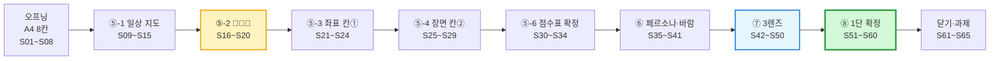
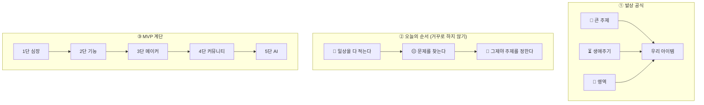

# 2회차 · 2교시 PPT — Gamma 슬라이드 설계서 (68장 · 초등고·중등 말판)

> **원본 수업안** [(수업)-2일차_2교시_워크시트_실습.md](<(수업)-2일차_2교시_워크시트_실습.md>) — 40분 흐름 · A4 8칸 워크시트 · 일상 지도 → 문제 찾기 → 아이템 확정 → 페르소나 → 3렌즈 → 1단 확정
> **앞 시간 수업안** [(수업)-2일차_1교시_링고팡해부_아이디어갤러리.md](<(수업)-2일차_1교시_링고팡해부_아이디어갤러리.md>) — 링고팡 해부 · 1단→5단 계단 · 큰 주제 6개 · 생애주기 · 9개 영역 카탈로그
> **짝 파일** [(2회차-2교시)-PPT_감마_붙여넣기용.md](<(2회차-2교시)-PPT_감마_붙여넣기용.md>) — 이 설계서의 `<!--GAMMA-->` 부분만 모아 `---`로 나눈 파일 (Gamma에 그대로 붙여 넣기)
> **수준** 초등 고학년 ~ 중학생. ① **한 장에 한 가지** ② **도식(표·단계·비교·계단·순환) 중심** ③ 어려운 말은 괄호로 한 번만 ("딱 한 사람(페르소나)", "최소 기능 제품(MVP)") ④ 말투는 **"~합니다 / ~해요"** 혼용 — 규칙은 "합니다", 설명은 "해요"
> **이 시간의 성격** 🖐 **손이 움직이는 시간.** 슬라이드는 **설명하는 도구가 아니라 타이머·칠판 대신**입니다. 교사는 슬라이드를 띄워 두고 **순회하며 질문만** 합니다.

---

## 0. 사용 방법

### 0-1. Gamma에 넣는 순서

| 단계 | 할 일 |
|:---:|---|
| 1 | Gamma **새로 만들기 → 텍스트 붙여넣기(Paste in text)** |
| 2 | 짝 파일 **「(2회차-2교시)-PPT_감마_붙여넣기용.md」 전체 복사 → 붙여넣기** |
| 3 | 텍스트 처리 **"유지(Preserve)"**, 카드 나누기 **"---" 기준** → **68장** |
| 4 | 테마: 1회차와 같은 **흰 바탕 + 딥 네이비 제목 + 틸(청록)·코럴 포인트** (시리즈 통일). 단, **2일차는 "종이·연필" 느낌**을 살려 **크라프트 종이색 강조 박스**를 한 가지 더 씁니다 |
| 5 | 카드마다 **📐 레이아웃** 지시대로 Gamma 스마트 레이아웃(단계·계단·비교·그리드·타임라인)으로 바꾸기 — **표는 도식으로 바꾸기 좋게** 짜 두었어요 |
| 6 | **🎨 이미지 프롬프트(영문)** 를 Gamma **AI 이미지 생성**에 붙여 넣기 |
| 7 | **🗣️ 선생님 멘트**는 발표자 노트로. **⏱ 타이머 슬라이드**(S12·S17·S22·S26·S31·S32·S36·S43·S51·S53·S59)는 실제로 화면에 띄워 두고 진행합니다 |

> **고칠 때** — 설계서의 `<!--GAMMA-->` ~ `<!--/GAMMA-->` 사이를 고친 뒤 붙여넣기용 파일도 같이 고쳐 주세요.
> **⭐선택** 표시 슬라이드는 **막히는 팀이 있을 때만** 꺼냅니다. 시간이 부족하면 건너뜁니다.

### 0-2. 이미지 프롬프트 공통 규칙

| 규칙 | 이유 |
|---|---|
| 모든 프롬프트 끝에 **`friendly flat vector illustration, clean infographic style, navy teal and coral palette, soft shadows, white background, no text`** | 1회차와 같은 색으로 **시리즈 통일** |
| 인물은 **`Korean middle school students (age 13-14)`** | 2일차 페르소나가 **"지금 나"(초등고·중등)** 입니다 |
| **`no text`** 필수 | AI 그림은 한글·숫자를 깨뜨려요 → 글자는 **Gamma 텍스트**로 |
| 2일차 전용 소재 — **`A4 paper folded into eight sections`, `marker pen`, `hand-drawn`, `no laptop, no screen`** | 오늘은 **컴퓨터를 쓰지 않는 시간**입니다. 그림에 노트북이 나오면 메시지가 깨집니다 |
| 실제 인물·회사 로고 금지 | 초상권·상표 문제 예방 |
| 계단·단계 그림은 **왼쪽 아래 → 오른쪽 위** 방향으로 | 1교시에서 배운 **1단→5단 계단**과 같은 방향으로 통일 |

### 0-3. 전체 구성 — 68장 / 40분

| 파트 | 슬라이드 | 시간 | 필수 | ⭐선택 |
|---|:---:|:---:|:---:|:---:|
| 오프닝 — 도구 3종 · A4 한 장 | S01~S08 | 2분 | 8 | 0 |
| 활동⑤-1 · 일상 지도 (개인) | S09~S16 | 5분 | 7 | 1 |
| 활동⑤-2 · 문제 찾기 😤😐💡 | S17~S21 | 3분 | 5 | 0 |
| 활동⑤-3 · 좌표 읽어내기 (칸①) | S22~S25 | 2분 | 4 | 0 |
| 활동⑤-4 · 장면으로 쓰기 (칸②) | S26~S30 | 2분 | 4 | 1 |
| 활동⑤-5·6 · 후보 3개 → 1개 확정 | S31~S34 | 6분 | 4 | 0 |
| 활동⑥ · 페르소나 · 바람 한 줄 (칸③④) | S35~S41 | 5분 | 6 | 1 |
| 활동⑦ · 3렌즈 (칸⑦) | S42~S50 | 9분 | 8 | 1 |
| 활동⑧ · 확대 · 1단 확정 (칸⑤⑥⑧) | S51~S60 | 5분 | 10 | 0 |
| 닫기 · 릴레이 · 과제 | S61~S65 | 1분 | 5 | 0 |
| 부록 — 교사용 예시·대사집 | S66~S68 | — | 0 | 3 |
| **합계** | **68장** | **40분** | **61** | **7** |

> **오늘의 하이라이트 2개** — ⑤-2 **😐 찾기**(금맥을 캐는 순간)와 ⑧ **1단 확정**(오늘의 결론). 다른 곳이 얕아도 이 두 곳은 반드시 통과합니다.
> **관통 예시 2팀** — 수업 내내 **A팀(동생 분리수거 · 8살 동생)** 과 **B팀(발표 떨림 기록판 · 중2 나 자신)** 두 팀을 계속 따라갑니다. 서로 **생애주기가 다른 두 사례**라서 어떤 팀이든 하나는 자기 것으로 느낍니다.

### 0-4. 학생이 쓰는 종이 (오늘은 A4와 네임펜뿐)

| 종이 | 언제 | 무엇을 |
|---|---|---|
| **개인 A4** (8칸 접기) | S12~S21 | 나의 일상 지도 + 😤😐💡 표시 |
| **팀 A4** (8칸 접기) | S07 배포 → S64 제출 | 칸 ①~⑧ 전부 |
| 팀 A4 **뒷면** | S57 | MVP 계단 1~5단 |
| **문장 틀 카드**(원본 부록 F) | 내내 | 책상에 펴 두고 빈칸 채우기 |

### 0-5. 도식 3종 — 이 수업의 뼈대

---

# 오프닝 — 도구 3종 · A4 한 장 (S01~S08 · 2분)

## S01 · 표지 — 필수

<!--GAMMA-->
# 내 아이템에 **계단을 놓는다**

2일차 2교시 · A4 한 장 워크시트 실습

> 오늘의 도구는 **A4와 네임펜뿐**입니다. 컴퓨터는 쓰지 않아요.
<!--/GAMMA-->

- **📐 레이아웃** — 좌측 큰 제목, 우측 이미지 50%
- **🎨 이미지 프롬프트**
  `Three Korean middle school students (age 13-14) sitting around a desk, one large A4 paper folded into eight sections placed at the exact center of the desk, each student holding a marker pen, six hands reaching toward the same paper, no laptop, no screen, focused and warm mood, friendly flat vector illustration, clean infographic style, navy teal and coral palette, soft shadows, white background, no text`
  (요약: 책상 한가운데 8칸 A4 한 장, 세 사람의 손이 함께 모인 장면)
- **🗣️ 선생님 멘트** — "1교시는 남의 작품을 해부했어요. 2교시는 **우리 것에 계단을 놓습니다.** 오늘 노트북은 덮어 두세요. **A4 한 장이 전부입니다.**"

---

## S02 · 1교시에서 가져온 도구 3종 — 필수

<!--GAMMA-->
# 1교시에서 가져온 **도구 3종**

| 도구 | 내용 |
|---|---|
| 🎯 **큰 주제 6개** | 💛 감정 · 🎯 맞춤형 · 🔒 보안 · 🤝 돌봄 · 📈 기록·예측 · 🎨 만들고 나누기 |
| ⏳ **생애주기 6단계** | 👶 유아 → 🎒 초등 저 → 📚 **초등고·중등(지금 나)** → 🧑‍🎓 청년 → 🧑‍🍼 중장년 → 🧓 노년 |
| 🔍 **3렌즈 + 2확대** | 🛠 메이커 · 🤝 커뮤니티 · 🤖 AI / ⚙️ 기능 확대 · 📚 콘텐츠 확대 |

> 이 세 가지를 **칠판에 붙여 두고** 40분을 갑니다
<!--/GAMMA-->

- **📐 레이아웃** — 3행 카드 그리드 (도구별 아이콘 크게)
- **🎨 이미지 프롬프트**
  `Three toolboxes lined up on a classroom board, the first filled with six colored heart and gear icons, the second showing a simple timeline of six human silhouettes from baby to elderly, the third holding three magnifying lenses, friendly flat vector illustration, clean infographic style, navy teal and coral palette, soft shadows, white background, no text`
  (요약: 칠판에 놓인 도구 상자 3개 — 주제·생애주기·렌즈)
- **🗣️ 선생님 멘트** — "오늘 새로 배우는 건 **하나도 없습니다.** 1교시 도구 세 개로 **우리 것을 만드는 시간**이에요."

---

## S03 · 오늘의 발상 공식 — 필수

<!--GAMMA-->
# 오늘의 발상 공식

## 🎯 큰 주제 × ⏳ 생애주기 × 📂 영역
## = **우리 아이템**

> 셋 중 **하나라도 비면** 아이템이 흐릿해집니다
> 🎯만 있으면 → "환경을 지키는 앱" (너무 큼)
> ⏳까지 있으면 → "**8살 동생**의 분리수거" (손에 잡힘)
<!--/GAMMA-->

- **📐 레이아웃** — 가운데 큰 곱셈 공식, 아래 비교 박스 2개
- **🎨 이미지 프롬프트**
  `Three transparent colored circles overlapping like a Venn diagram, a small glowing paper card sitting exactly in the overlapping center, a Korean middle school student (age 13) pointing at the center with a marker pen, friendly flat vector illustration, clean infographic style, navy teal and coral palette, soft shadows, white background, no text`
  (요약: 세 원이 겹치는 가운데에 놓인 아이템 카드)
- **🗣️ 선생님 멘트** — "**곱셈**이에요. 하나가 0이면 전체가 0입니다. 세 칸을 다 채워야 아이템이 됩니다."

---

## S04 · 1교시 결론 다시 한 줄 — 필수

<!--GAMMA-->
# 1교시 결론, 다시 한 줄

| 🚫 이렇게 시작하면 | 이렇게 됩니다 |
|---|---|
| 🤝 **커뮤니티부터** | 빈 게시판 |
| 🖥 **서버부터** | 돈만 나감 |
| 🤖 **AI부터** | 뭘 자동화할지 모름 |

> ✅ **1단 없이 5단 없다.**
> ## 손으로 먼저, 손이 아플 때 AI
<!--/GAMMA-->

- **📐 레이아웃** — 좌측 금지 3행 표, 우측 하단 큰 강조 문장
- **🎨 이미지 프롬프트**
  `A tall staircase with five steps, the top step glowing with a robot icon but the bottom step missing and collapsed, a student looking up at the broken first step with a worried expression, friendly flat vector illustration, clean infographic style, navy teal and coral palette, soft shadows, white background, no text`
  (요약: 1단이 무너진 5단 계단 — 5단에 로봇 아이콘)
- **🗣️ 선생님 멘트** — "오늘 가장 많이 나올 말이 **'AI 넣을래요'** 예요. 미리 답할게요. **오늘은 1단에 AI를 넣지 않습니다.**"

---

## S05 · 이 시간의 결과물 — 필수

<!--GAMMA-->
# 오늘 2교시의 약속

## 수업이 끝나면 각 팀은
## **A4 한 장을 완성해 책상 한가운데** 올려 둡니다

| 나오는 것 | 왜 |
|---|---|
| **A4 한 장 (8칸 전부)** | 3~4교시 바이브 코딩의 **설계도** |
| MVP 계단 (뒷면) | 발표의 **대본** |
| 사진 1장 | **직접 했다**는 증거 |

> 종이가 여러 장이면 **잃어버립니다.** 칸이 비면 **다음 시간에 못 씁니다.**
<!--/GAMMA-->

- **📐 레이아웃** — 상단 큰 약속 문장, 하단 3행 표
- **🎨 이미지 프롬프트**
  `One completed A4 paper folded into eight filled sections lying at the center of a wooden desk, a smartphone held above it taking a photo, three pairs of hands resting at the paper edges, warm classroom light, friendly flat vector illustration, clean infographic style, navy teal and coral palette, soft shadows, white background, no text`
  (요약: 완성된 8칸 A4를 위에서 사진 찍는 장면)
- **🗣️ 선생님 멘트** — "**한 장, 여덟 칸.** 오늘 성공의 기준은 이것 하나입니다."

---

## S06 · A4 8칸 지도 — 필수 ⭐이 슬라이드는 40분 내내 참고

<!--GAMMA-->
# A4를 세 번 접으면 **8칸**

| 칸 | 무엇을 | 언제 |
|:---:|---|:---:|
| **①** | 🎯 큰 주제 · ⏳ 생애주기 · 📂 영역 | ⑤-3 |
| **②** | 📷 우리가 본 장면 (누가·언제·어디서) | ⑤-4·6 |
| **③** | 👤 페르소나 (이름 있는 사람) | ⑥ |
| **④** | 💗 바람 한 줄 | ⑥ |
| **⑤** | 🪜 **1단 · 심장 하나** ← 가장 크게 | ⑧ |
| **⑥** | ⚙️📚 확대 두 방향 | ⑧ |
| **⑦** | 🛠🤝🤖 3렌즈 | ⑦ |
| **⑧** | ⚖️ 판정 기준 · 안 넣을 것 3가지 | ⑧ |

> **⑤번 칸이 제일 큽니다.** 이 칸 하나만 제대로 채워도 오늘은 성공이에요
<!--/GAMMA-->

- **📐 레이아웃** — **2×4 그리드 도식으로 반드시 변환** (표 → Gamma 그리드). ⑤번 칸은 두 칸 폭으로 크게, 코럴 배경
- **🎨 이미지 프롬프트**
  `A single A4 sheet folded into eight rectangles drawn from directly above, the fifth rectangle highlighted larger and glowing in coral color with a small staircase icon inside, other rectangles showing faint pencil placeholder lines, marker pen lying diagonally across the paper, friendly flat vector illustration, clean infographic style, navy teal and coral palette, soft shadows, white background, no text`
  (요약: 위에서 본 8칸 A4, ⑤번 칸만 크고 밝게)
- **🗣️ 선생님 멘트** — "칸을 **순서대로** 채웁니다. 건너뛰지 마세요. 시간이 모자라도 **빈칸으로 두지 말고 연필로라도** 채웁니다."
- **⚠️ 교사 준비** — 이 슬라이드는 **인쇄해서 칠판에 붙여** 두면 더 좋습니다. 학생이 지금 몇 번 칸인지 계속 확인합니다.

---

## S07 · 종이 규칙 4개 — 필수

<!--GAMMA-->
# 🖐 오늘의 종이 규칙 4개

| # | 규칙 | 왜 |
|:---:|---|---|
| ① | **종이는 책상 한가운데** | 한쪽에 있으면 **그 사람 것**이 됩니다 |
| ② | **펜은 돌려 쓴다** — 칸이 바뀌면 쓰는 사람도 | 한 명이 계속 쓰면 나머지는 **구경꾼** |
| ③ | **30초 혼자 생각 → 그다음 말하기** | 바로 말하면 **목소리 큰 사람 의견**만 남습니다 |
| ④ | **개인 A4는 각자, 팀 A4는 같이** | 일상은 내 것, 아이템은 우리 것 |
<!--/GAMMA-->

- **📐 레이아웃** — 4행 규칙 카드 (좌측 번호 원, 우측 이유)
- **🎨 이미지 프롬프트**
  `Top-down view of a desk with one A4 paper exactly in the center, three marker pens arranged in a circular rotation with curved arrows showing they pass from hand to hand, three students' hands equally distant from the paper, friendly flat vector illustration, clean infographic style, navy teal and coral palette, soft shadows, white background, no text`
  (요약: 가운데 종이와 시계 방향으로 돌아가는 펜 3자루)
- **🗣️ 선생님 멘트** — "규칙 ②가 오늘 제일 중요해요. **펜을 놓지 않는 사람이 있으면 제가 직접 뺏습니다.**"

---

## S08 · 40분 흐름 지도 — 필수

<!--GAMMA-->
# 오늘 40분 흐름

1. 📄 **워크시트 접기** — 2분
2. 📝 **일상 지도 → 문제 찾기 → 아이템 확정** — 18분 ← 가장 김
3. 👤 **페르소나 · 바람 한 줄** — 5분
4. 🔍 **3개의 렌즈** — 9분 ← 오늘의 핵심
5. 🪜 **확대 두 방향 · 1단 확정** — 5분
6. 🗣 **여섯 문장 릴레이 · 제출** — 1분

> 2번과 4번에서 **거의 다 결정**됩니다
<!--/GAMMA-->

- **📐 레이아웃** — 가로 타임라인 6정거장. 2번·4번 정거장 확대 강조
- **🎨 이미지 프롬프트**
  `A horizontal path with six round stations, each station marked with a simple icon (folded paper, pencil writing on a map, person portrait card, three magnifying lenses, staircase, speaking mouth), the second and fourth stations drawn noticeably larger, friendly flat vector illustration, clean infographic style, navy teal and coral palette, soft shadows, white background, no text`
  (요약: 6정거장 가로 타임라인, 2·4번이 더 큼)
- **🗣️ 선생님 멘트** — "설명은 여기까지. 이제부터 **제가 말하는 시간보다 여러분이 쓰는 시간이 훨씬 깁니다.**"

---

# 활동⑤-1 · 일상 지도 (S09~S15 · 개인 5분)

## S09 · 오늘 실습의 가장 중요한 순서 — 필수

<!--GAMMA-->
# 🔑 오늘의 순서, 이것만 기억하세요

## ① 내 일상을 **다 적는다**
## ② 그 위에서 **문제를 찾는다**
## ③ **그제야** 주제를 정한다

> 🚫 보통은 **거꾸로** 합니다 — "주제 정하자"부터
> 그러면 머릿속의 **멋있어 보이는 말**('환경', 'AI 챗봇')이 튀어나와요
> 그건 **여러분 생활이 아닙니다**
<!--/GAMMA-->

- **📐 레이아웃** — 3단계 세로 단계 도식 + 하단 금지 박스
- **🎨 이미지 프롬프트**
  `Two contrasting paths side by side: on the left a student pulling a shiny empty balloon labeled with a question mark out of their head, on the right a student spreading a large hand-written daily map on the desk and circling something on it with a marker, friendly flat vector illustration, clean infographic style, navy teal and coral palette, soft shadows, white background, no text`
  (요약: 왼쪽 머리에서 짜내기 / 오른쪽 종이 위에서 발견하기)
- **🗣️ 선생님 멘트** — "발명은 **머리에서 짜내는 게 아니라, 내 생활 위에서 발견하는 것**이에요. 그래서 오늘은 먼저 **여러분 하루를 종이에 다 펼칩니다.**"

---

## S10 · 왜 칸 ①을 나중에 채우나 — 필수

<!--GAMMA-->
# 왜 **칸 ①(주제)** 를 나중에 채우나

| 순서 | 무슨 일이 생기나 |
|---|---|
| 🚫 **주제 먼저** | 그 주제에 **억지로 생활을 끼워 맞춥니다** |
| ✅ **일상 먼저** | 칸 ①이 **"내가 적은 게 결국 무슨 주제였나"를 읽어내는 칸**이 됩니다 |

> ## 순서 하나로 결과물의 **진정성**이 달라집니다
<!--/GAMMA-->

- **📐 레이아웃** — 좌우 비교 2단 + 하단 강조 한 문장
- **🎨 이미지 프롬프트**
  `Left side: a large labeled box with a student forcing mismatched puzzle pieces into it. Right side: scattered puzzle pieces on a paper naturally forming a shape while a student draws a circle around them, friendly flat vector illustration, clean infographic style, navy teal and coral palette, soft shadows, white background, no text`
  (요약: 왼쪽 억지로 끼워 맞추기 / 오른쪽 모여서 저절로 모양이 됨)
- **🗣️ 선생님 멘트** — (교사용 속마음 슬라이드입니다. 학생에게는 **"주제는 정하는 게 아니라 읽어내는 거예요"** 한 줄만 말해도 충분합니다.)

---

## S11 · 활동⑤ 6단계 안내 — 필수

<!--GAMMA-->
# 활동⑤ — 18분을 **6단계**로 씁니다

| 단계 | 시간 | 하는 일 | 채우는 칸 |
|:---:|:---:|---|:---:|
| **1** | 5분 | 🗓 일상 지도 — 판단 없이 **다 적기** | 별지 A4 |
| **2** | 3분 | 😤😐💡 **문제 표시** — 기호만 | 별지 A4 |
| **3** | 2분 | 🎯⏳📂 **좌표 읽어내기** | **칸 ①** |
| **4** | 2분 | 📷 **장면으로 바꿔 쓰기** | **칸 ②** 초안 |
| **5** | 2분 | 팀에서 **후보 3개**로 | — |
| **6** | 4분 | 점수표로 **1개 확정** | **칸 ②** 확정 |
<!--/GAMMA-->

- **📐 레이아웃** — 6단계 타임라인(가로) 또는 단계 리스트. 시간 숫자를 크게
- **🎨 이미지 프롬프트**
  `Six ascending blocks like a bar chart, each block topped with a tiny icon (map, emoji face, compass, camera, three cards, scoreboard), a kitchen timer standing beside the blocks, friendly flat vector illustration, clean infographic style, navy teal and coral palette, soft shadows, white background, no text`
  (요약: 6개 단계 블록과 타이머)
- **🗣️ 선생님 멘트** — "18분에 여섯 단계예요. **한 단계가 끝나면 제가 끊습니다.** 미련 두지 말고 넘어가세요."

---

## S12 · ⏱ 1단계 지시 (5분 타이머 슬라이드) — 필수

<!--GAMMA-->
# ⏱ 1단계 · 🗓 나의 일상 지도 — **5분**

## 이 5분은 "아이디어 시간"이 아닙니다
## **"기억해 내는 시간"** 입니다

> 개인 A4를 **8칸**으로 접고, 칸마다 **내가 진짜로 보내는 시간**을 적습니다
> 좋고 나쁨은 **판단하지 않습니다.** 판단은 2단계에서 합니다
<!--/GAMMA-->

- **📐 레이아웃** — 화면 가득 큰 제목 + 타이머 느낌. **이 슬라이드를 5분 내내 띄워 둡니다**
- **🎨 이미지 프롬프트**
  `A single Korean middle school student (age 13) bent over an A4 paper folded into eight sections, writing quickly with a marker, a thought cloud above filled with tiny everyday icons (school desk, bus, dishes, notebook, game controller, chat bubble), a large analog timer in the corner, friendly flat vector illustration, clean infographic style, navy teal and coral palette, soft shadows, white background, no text`
  (요약: 8칸 종이에 빠르게 적는 학생, 머리 위 일상 아이콘 구름)
- **🗣️ 선생님 멘트** — "지금 아이디어를 생각하는 사람은 **틀린 걸 하고 있어요.** 그냥 **기억만** 하세요."

---

## S13 · 8개 영역 · 사냥 질문 — 필수

<!--GAMMA-->
# 일상 지도 8칸 — **사냥 질문**을 들으며 적어요

| 칸 | 영역 | 선생님이 읽어 주는 질문 |
|:---:|---|---|
| 1 | 🏫 **학교** | "오늘 학교에서 **멈칫한 순간**은?" |
| 2 | 📕 **학원·과외** | "학원에서 **제일 아깝게 흘러가는 시간**은?" |
| 3 | 🏠 **집** | "집에서 **누가 '아이참' 했지?**" |
| 4 | ✍️ **공부·기억** | "**분명히 했는데 기억 안 나는 것**은?" |
| 5 | 🎮 **놀기·취미** | "재밌는데 **끝나고 허무한 것**은?" |
| 6 | 👥 **친구·관계** | "**말 못 하고 넘어간 것**은?" |
| 7 | 🏕 **캠프·행사·대회** | "준비하면서 **제일 헤맨 것**은?" |
| 8 | 🤝 **봉사·동아리** | "도우려다 **오히려 막힌 것**은?" |
<!--/GAMMA-->

- **📐 레이아웃** — **2×4 아이콘 그리드로 변환**(8칸 종이와 같은 모양). 질문은 작은 글씨로 아이콘 아래
- **🎨 이미지 프롬프트**
  `A two by four grid of eight rounded cards, each card holding one simple icon: school building, textbook and clock, house, pencil and brain, game controller, two chat bubbles, tent, helping hands, friendly flat vector illustration, clean infographic style, navy teal and coral palette, soft shadows, white background, no text`
  (요약: 8개 영역 아이콘 2×4 그리드)
- **🗣️ 선생님 멘트** — "질문을 **제가 소리 내어 읽어 줍니다.** 30초마다 다음 칸으로 넘어갑니다. **받아쓰기처럼** 따라오세요."

---

## S14 · 일상 지도 규칙 3개 — 필수

<!--GAMMA-->
# 일상 지도 규칙 3개

| # | 규칙 | 구체적으로 |
|:---:|---|---|
| ① | 🚫 **판단 금지** | "이건 아이디어 안 될 것 같은데" — 지금은 **금지** |
| ② | ✅ **칸을 비우지 않기** | 칸당 **2~3개.** 안 해본 칸은 *"거의 안 함"* 이라고 쓰면 **그것도 정보** |
| ③ | 🔢 **시간을 같이 적기** | *"학원 대기 **20분**"*, *"영상 **2시간**"* |

> ③번이 핵심 — **숫자가 붙으면 2단계에서 문제가 훨씬 잘 보입니다**
<!--/GAMMA-->

- **📐 레이아웃** — 3행 규칙 카드. ③번만 코럴 강조
- **🎨 이미지 프롬프트**
  `Three stacked note cards, the top one crossed out with a judge gavel icon, the middle one showing a grid with no empty cells, the bottom one showing handwritten numbers with clock icons beside them, friendly flat vector illustration, clean infographic style, navy teal and coral palette, soft shadows, white background, no text`
  (요약: 판사봉 금지 / 빈칸 없는 격자 / 숫자와 시계)
- **🗣️ 선생님 멘트** — "**'20분'이라고 쓴 사람은 이미 문제를 찾은 거예요.** 숫자는 문제의 냄새예요."

---

## S15 · 채워진 일상 지도 예시 — 필수

<!--GAMMA-->
# ✍️ 채워진 일상 지도 — 이렇게 적어요

| 영역 | 적은 것 |
|---|---|
| 🏫 학교 | 발표 순서 기다리기 / 급식 줄 / 사물함 정리 / 수행평가 3개 겹침 |
| 📕 학원 | 셔틀 **20분** 기다림 / 단어 시험 / 숙제 사진 제출 / 오답노트 |
| 🏠 집 | 아침 준비물 챙기기 / 동생 분리수거 / 할머니 리모컨 / 설거지 |
| ✍️ 공부 | 암기했는데 다음 날 날아감 / 계획 세우고 안 지킴 / 틀린 문제 또 틀림 |
| 🎮 놀기 | 영상 **2시간** 순삭 / 게임 친구랑 시간 맞추기 / 그리다 만 것들 |
| 👥 친구 | 단톡방 읽씹 / 약속 장소 정하기 / 사과 못 한 일 |
| 🏕 캠프 | 짐 싸기 / 조 편성 / 공지가 흩어짐 |
| 🤝 봉사 | 확인증 어디서 받는지 모름 / 뭘 도울지 몰라 서 있었음 |

> 보세요. 아직 **아이디어는 하나도 없어요.** 그냥 **생활**이에요
<!--/GAMMA-->

- **📐 레이아웃** — 8행 표 유지(빽빽해도 괜찮음 — "다 적는다"를 눈으로 보여주는 슬라이드)
- **🎨 이미지 프롬프트**
  `An A4 paper densely covered with short handwritten lines in eight sections, no drawings, just many small text strokes suggesting a full list, a marker pen resting on top, viewed from directly above, friendly flat vector illustration, clean infographic style, navy teal and coral palette, soft shadows, white background, no text`
  (요약: 여덟 칸이 빽빽하게 채워진 A4를 위에서 본 모습)
- **🗣️ 선생님 멘트** — "그런데 이 종이 안에 **오늘 만들 것이 이미 다 들어 있습니다.** 이제 찾기만 하면 돼요."

---

## S16 · ⭐선택 · 막히는 학생에게

<!--GAMMA-->
# 🤔 하나도 안 떠오르면

## 어제 **아침 7시부터 밤 10시까지**
## **시간 순서대로** 따라가 보세요

| 따라갈 세 가지 |
|---|
| 👥 **누구**를 만났나 |
| 📍 **어디**에 있었나 |
| ✋ **무엇**을 했나 |

> 기억이 안 나는 게 아니라 **꺼내는 순서**를 모르는 것뿐이에요
<!--/GAMMA-->

- **📐 레이아웃** — 시계 타임라인 + 3개 질문 카드
- **🎨 이미지 프롬프트**
  `A horizontal clock timeline from morning to night with small icons placed along it (alarm, school gate, lunch tray, bus, desk lamp, bed), a student walking along the timeline with a marker in hand, friendly flat vector illustration, clean infographic style, navy teal and coral palette, soft shadows, white background, no text`
  (요약: 아침부터 밤까지 시계 타임라인을 걷는 학생)
- **🗣️ 선생님 멘트** — (이 슬라이드는 **순회 중 막힌 학생 옆에서만** 띄웁니다. 전체에게 보여 주면 모두가 이 방법만 씁니다.)

---
# 활동⑤-2 · 문제 찾기 😤😐💡 (S17~S21 · 개인 3분)

## S17 · ⏱ 2단계 지시 (3분 타이머 슬라이드) — 필수

<!--GAMMA-->
# ⏱ 2단계 · 😤😐💡 문제 찾기 — **3분**

## 🚫 **새로 쓰지 않습니다**
## 적은 것 위에 **기호 세 개**만 칩니다

| 기호 | 뜻 | 이게 왜 중요한가 |
|:---:|---|---|
| 😤 | **짜증 났다 · 불만이다** | 감정이 붙은 곳에 **진짜 문제**가 있습니다 |
| 😐 | **그냥 참고 있다 · 원래 그런 줄 안다** | ⭐ **여기가 금맥입니다** |
| 💡 | **내가 바꾸고 싶다** | 동기가 이미 있는 곳. 발표에서 **진심이 실립니다** |
<!--/GAMMA-->

- **📐 레이아웃** — 3열 이모지 카드(아주 크게) + 아래 설명. **3분 내내 띄워 둡니다**
- **🎨 이미지 프롬프트**
  `Three large simple emoji-style round faces in a row - one annoyed, one neutral flat expression, one with a light bulb above the head - each face sitting on top of a small handwritten note card, a marker pen drawing a mark on the middle card, friendly flat vector illustration, clean infographic style, navy teal and coral palette, soft shadows, white background, no text`
  (요약: 세 개의 큰 얼굴 기호와 그 아래 쪽지 카드)
- **🗣️ 선생님 멘트** — "문장을 다시 쓰는 사람은 **시간을 낭비하는 겁니다.** 기호만 치세요. **3분은 정말 짧아요.**"

---

## S18 · 😐가 금맥이다 — 필수 ⭐오늘의 갈림길

<!--GAMMA-->
# 😐 표시가 **제일 중요합니다**

| | 😤 짜증 | 😐 그냥 참는 것 |
|---|---|---|
| 누가 아나 | **누구나 압니다** | **아무도 문제라고 생각 안 합니다** |
| 지금 상태 | 이미 남들이 **만들고 있어요** | **아무도 안 만들었어요** |

> 링고팡이 발견한 게 뭐였죠?
> *"학습 앱은 **원래** 화면이 자동으로 넘어가는 거야"* — **다들 그냥 참고 있던 것**
> ## 😐 "원래 그런 줄 알았던 것"을 찾아내면 그게 **아무도 안 만든 아이템**입니다
<!--/GAMMA-->

- **📐 레이아웃** — 좌우 비교 2단 + 하단 큰 결론 박스(코럴)
- **🎨 이미지 프롬프트**
  `A cross-section of ground showing two layers: the shallow surface layer crowded with many small shovels digging together, and a deep layer with one glowing golden vein untouched, a single student digging toward the deep layer, friendly flat vector illustration, clean infographic style, navy teal and coral palette, soft shadows, white background, no text`
  (요약: 얕은 곳에 삽이 몰린 땅 / 깊은 곳의 손 안 댄 금맥)
- **🗣️ 선생님 멘트** — "😤 짜증은 앱스토어에 이미 열 개 있어요. **😐 를 찾으면 여러분이 1등입니다.**"

---

## S19 · 😐를 찾는 질문 하나 — 필수

<!--GAMMA-->
# 😐 를 찾는 방법 — **질문 하나**

## 🤔 "이거 **원래 이런 거** 맞아?
## 왜 **이렇게 하는 거지?**"

> ## 대답을 못 하면 → **그게 😐 입니다**

| 예 | 되물었을 때 |
|---|---|
| 학원 셔틀 20분 기다림 | *"원래 기다리는 거 아냐?"* → **금맥** 💰 |
| 틀린 문제 또 틀림 | *"원래 또 틀리는 거 아냐?"* → **금맥** 💰 |
<!--/GAMMA-->

- **📐 레이아웃** — 화면 가운데 큰 질문 한 문장, 아래 예시 2행
- **🎨 이미지 프롬프트**
  `A large question mark shaped like a key inserted into a small padlock attached to a plain everyday object (a bus stop sign), golden light leaking out of the opening lock, friendly flat vector illustration, clean infographic style, navy teal and coral palette, soft shadows, white background, no text`
  (요약: 물음표 모양 열쇠가 평범한 일상 사물의 자물쇠를 여는 장면)
- **🗣️ 선생님 멘트** — "이 질문 하나만 오늘 가져가세요. **'원래 이런 거 맞아?'** 이게 발명가의 질문입니다."

---

## S20 · 표시 예시 — 필수

<!--GAMMA-->
# ✍️ 앞 예시 지도에 표시하면

| 영역 | 표시 |
|---|---|
| 🏫 학교 | 발표 순서 기다리기 **😤** / 수행평가 3개 겹침 **😐** |
| 📕 학원 | 셔틀 20분 기다림 **😐** 💰 |
| 🏠 집 | 할머니 리모컨 **💡** / 동생 분리수거 **😤** |
| ✍️ 공부 | 틀린 문제 또 틀림 **😐** 💰 |
| 🎮 놀기 | 영상 2시간 순삭 **😐** |
| 👥 친구 | 사과 못 한 일 **💡** |
| 🤝 봉사 | 뭘 도와야 할지 몰라 서 있었음 **😐** |

> 💰 = 금맥 후보. **😐 가 이렇게 많이 나오는 게 정상입니다**
<!--/GAMMA-->

- **📐 레이아웃** — 7행 표. 💰 표시 행은 배경색 강조
- **🎨 이미지 프롬프트**
  `A handwritten list on paper with small emoji marks stamped beside several lines, two of the lines circled and marked with tiny gold coin icons, a marker pen mid-stroke, viewed from above, friendly flat vector illustration, clean infographic style, navy teal and coral palette, soft shadows, white background, no text`
  (요약: 이모지 표시가 찍힌 손글씨 목록, 금화 아이콘 2개)
- **🗣️ 선생님 멘트** — "😐 가 다섯 개 넘게 나온 사람 손 들어 보세요. (많습니다) **그게 여러분이 지금까지 그냥 참고 살았다는 증거예요.**"

---

## S21 · 동그라미 3개 — 필수

<!--GAMMA-->
# 표시한 것 중 **3개에 크게 동그라미**

## 조건은 딱 하나
## ✅ "내가 이걸 **계속 생각해도 안 지겨울** 것 같다"

> 🚫 관심 없는 문제로 만든 것은 **다음 시간에 손이 안 갑니다**
> 🚫 "이게 점수 잘 나올 것 같아서" — 이 이유로 고르면 **3교시에 후회합니다**
<!--/GAMMA-->

- **📐 레이아웃** — 가운데 큰 조건 문장 1개 + 하단 금지 2줄
- **🎨 이미지 프롬프트**
  `Three bold hand-drawn circles marked on a paper list, a small heart icon glowing inside each circle, other lines on the list left plain, friendly flat vector illustration, clean infographic style, navy teal and coral palette, soft shadows, white background, no text`
  (요약: 종이 목록 위 굵은 동그라미 3개, 그 안에 작은 하트)
- **🗣️ 선생님 멘트** — "**재미없는 걸 고른 팀은 3교시에 조용해집니다.** 지금 고르는 게 앞으로 세 시간을 결정해요."

---

# 활동⑤-3 · 좌표 읽어내기 (S22~S25 · 2분 · 칸①)

## S22 · ⏱ 3단계 지시 (2분) — 필수

<!--GAMMA-->
# ⏱ 3단계 · 🎯⏳📂 좌표 읽어내기 — **2분** → **칸 ①**

## 이제야 주제를 정합니다
## 정확히는 **정하는 게 아니라 읽어내는 것**

> "내가 동그라미 친 3개는 결국 **무슨 주제**였나?
> **누구의 어느 시기** 문제였나?"
<!--/GAMMA-->

- **📐 레이아웃** — 큰 제목 + 인용 질문 박스. **2분 타이머 슬라이드**
- **🎨 이미지 프롬프트**
  `Three circled handwritten notes floating upward from a paper and landing on a simple coordinate chart with three labeled axes, arrows going upward from the notes to the axes, friendly flat vector illustration, clean infographic style, navy teal and coral palette, soft shadows, white background, no text`
  (요약: 동그라미 친 쪽지가 위로 올라가 세 축 좌표에 꽂히는 장면)
- **🗣️ 선생님 멘트** — "화살표 방향이 **위로**예요. 생활에서 주제로 **거꾸로 올라갑니다.**"

---

## S23 · 세 축 읽어내는 질문 — 필수

<!--GAMMA-->
# 🎯 큰 주제 × ⏳ 생애주기 × 📂 영역

| 축 | 읽어내는 질문 | 보기 |
|---|---|---|
| 🎯 **큰 주제** | "동그라미 친 것들에 **공통으로 흐르는 게** 뭐지?" | 💛 감정 / 🎯 맞춤형 / 🔒 보안 / 🤝 돌봄 / 📈 기록·예측 / 🎨 만들고 나누기 |
| ⏳ **생애주기** | "이건 **누구의** 문제지? 나? 동생? 할머니?" | 👶 유아 / 🎒 초등 저 / 📚 **중등(나)** / 🧑‍🎓 청년 / 🧑‍🍼 중장년 / 🧓 노년 |
| 📂 **영역** | "일상 지도의 **몇 번 칸**에서 나왔지?" | 학교 / 학원 / 집 / 공부 / 놀기 / 친구 / 캠프 / 봉사 |
<!--/GAMMA-->

- **📐 레이아웃** — 3행 표 → **3열 카드 그리드로 변환** 권장 (축마다 색 다르게)
- **🎨 이미지 프롬프트**
  `Three vertical labeled columns side by side, the first column holding six small colored shape icons, the second showing six human silhouettes growing from baby to elderly, the third showing eight tiny place icons, one item in each column highlighted with a glowing ring, friendly flat vector illustration, clean infographic style, navy teal and coral palette, soft shadows, white background, no text`
  (요약: 세 개의 세로 열, 각 열에서 하나씩 빛나는 항목)
- **🗣️ 선생님 멘트** — "세 축에서 **하나씩만** 고릅니다. 두 개 고르고 싶으면 **아직 안 좁혀진 거예요.**"

---

## S24 · 좌표 읽어내기 예시 — 필수

<!--GAMMA-->
# ✍️ 좌표 읽어내기 — **일상에서 거꾸로 올라갑니다**

| 동그라미 친 것 | → 🎯 큰 주제 | → ⏳ 생애주기 | → 📂 영역 |
|---|---|---|---|
| 발표 순서 기다리며 심장 뜀 😤 | 💛 **감정·마음** | 📚 중등 = **나** | 🏫 학교 |
| 틀린 문제 또 틀림 😐 | 🎯 **맞춤형·개인화** | 📚 중등 = **나** | ✍️ 공부 |
| 셔틀 20분 기다림 😐 | 📈 **기록·예측** | 📚 중등 = **나** | 📕 학원 |
| 할머니 리모컨 💡 | 🤝 **돌봄·접근성** | 🧓 **노년** | 🏠 집 |
| 동아리 인수인계 안 됨 😐 | 🎨 **만들고 나누기** | 📚 중등 = **나** | 🤝 봉사·동아리 |

> **팀 합의 30초** — 세 명의 좌표를 비교해 **두 명 이상이 겹치는 좌표** 하나로
> 안 겹치면 → **"오늘 우리가 직접 만날 수 있는 사람"** 쪽을 택합니다
<!--/GAMMA-->

- **📐 레이아웃** — 5행 4열 표 유지. 화살표(→)가 보이게 구성
- **🎨 이미지 프롬프트**
  `Five handwritten note cards on the left, each connected by an arrow to three small labeled tags on the right, the arrows all pointing rightward and slightly upward, friendly flat vector illustration, clean infographic style, navy teal and coral palette, soft shadows, white background, no text`
  (요약: 왼쪽 쪽지 5장 → 오른쪽 태그 3종으로 이어지는 화살표)
- **🗣️ 선생님 멘트** — "같은 '기다림'인데 **누구의 기다림이냐**에 따라 주제가 달라져요. **⏳를 먼저 못 박으세요.**"

---

## S25 · 흔한 실수 — "다 쓸 수 있어요" — 필수

<!--GAMMA-->
# ⚠️ 여기서 가장 많이 나오는 말

## ❌ "초등학생부터 어른까지 **다** 쓸 수 있어요!"

> ### 되묻습니다 — **"그럼 글씨 크기는 누구한테 맞출 건가요?"**
> 답을 못 하면 생애주기를 **하나로** 좁혀야 합니다

| | 결과 |
|---|---|
| 🚫 **모두를 위한 앱** | **아무도 안 씁니다** |
| ✅ 링고팡 = **4~9세로 못 박음** | **이겼습니다** |
<!--/GAMMA-->

- **📐 레이아웃** — 상단 금지 문장 크게, 중단 되묻는 질문 박스, 하단 비교 2행
- **🎨 이미지 프롬프트**
  `One pair of eyeglasses lying between a tiny child-sized book with huge letters and an adult-sized book with tiny letters, the glasses unable to fit either, a question mark hovering above, friendly flat vector illustration, clean infographic style, navy teal and coral palette, soft shadows, white background, no text`
  (요약: 큰 글씨 책과 작은 글씨 책 사이에서 어느 쪽에도 못 맞는 안경 하나)
- **🗣️ 선생님 멘트** — "'다 쓸 수 있어요'는 **'아직 안 정했어요'와 같은 말**이에요. 심사에서 제일 먼저 깨집니다."

---

# 활동⑤-4 · 장면으로 쓰기 (S26~S30 · 2분 · 칸②)

## S26 · ⏱ 4단계 지시 — 명사 금지 — 필수

<!--GAMMA-->
# ⏱ 4단계 · 📷 장면으로 바꿔 쓰기 — **2분** → **칸 ②**

| ❌ 명사로 쓰면 (아무것도 안 떠오름) | ✅ 장면으로 쓰면 |
|---|---|
| 준비물 | "체육복을 또 안 가져와서 3반에 빌리러 갔다. 빌려준 애가 좀 싫어했다" |
| 급식 | "국을 앞사람이 건더기만 퍼가서 내 차례엔 국물만 남았다" |
| 발표 | "발표할 때 목소리가 떨려서 뒤에 애들이 '안 들려요' 했다" |
| 학원 대기 | "셔틀이 20분 늦어서 그냥 폰만 보다가 수업에 들어갔다" |

> ## 명사는 **상자**, 장면은 **상자를 연 것**
> 장면엔 반드시 **사람**이 있어야 합니다
<!--/GAMMA-->

- **📐 레이아웃** — 좌우 비교 2단(짧은 명사 / 긴 장면). 오른쪽 칸을 더 넓게
- **🎨 이미지 프롬프트**
  `Left side: four small closed cardboard boxes each with a plain label shape. Right side: one open box with a miniature classroom scene rising out of it - a student speaking, other students turning around - friendly flat vector illustration, clean infographic style, navy teal and coral palette, soft shadows, white background, no text`
  (요약: 왼쪽 닫힌 상자들 / 오른쪽 열린 상자에서 솟아오르는 교실 장면)
- **🗣️ 선생님 멘트** — "'급식'이라고 쓰면 아무것도 안 떠올라요. 장면으로 쓰면 **누가 있었는지, 몇 시였는지, 내가 무슨 표정이었는지**가 다 딸려 옵니다."

---

## S27 · 장면 문장 틀 5칸 — 필수

<!--GAMMA-->
# 🧩 장면 문장 틀 — **빈칸만 채우면 문장이 됩니다**

## "[누가]가 [언제·어디서] [무엇을 하다가],
## [무엇 때문에] [어떻게 됐다]."

| [누가] | [언제·어디서] | [무엇을 하다가] | [무엇 때문에] | [어떻게 됐다] |
|---|---|---|---|---|
| 내가 | 어제 국어 시간에 | 발표를 하다가 | 목소리가 떨려서 | 뒤에서 "안 들려요" 했다 |
| 동생(8살)이 | 저녁에 집에서 | 우유팩을 버리다가 | 어느 통인지 몰라서 | 아무 데나 넣고 도망갔다 |
| 할머니가 | 어제 저녁 거실에서 | 리모컨을 누르다가 | 버튼이 작아서 | 엉뚱한 채널을 켜고 나를 불렀다 |

> 한 번에 문장을 지으려 하지 말고 **칸을 하나씩** 채우세요
<!--/GAMMA-->

- **📐 레이아웃** — 5칸 가로 블록 도식(문장 조립 라인 느낌) + 예시 3행
- **🎨 이미지 프롬프트**
  `Five empty rectangular slots arranged horizontally like a train of cards, three small puzzle-shaped word tiles sliding into the first three slots from above, a completed sentence bar glowing beneath, friendly flat vector illustration, clean infographic style, navy teal and coral palette, soft shadows, white background, no text`
  (요약: 다섯 개의 빈 칸에 조각이 끼워지며 문장이 완성되는 도식)
- **🗣️ 선생님 멘트** — "**문장을 짓는 게 아니라 칸을 메우는 겁니다.** 다섯 칸만 채우면 저절로 문장이 돼요."

---

## S28 · 장면 예문 1~6 — 필수

<!--GAMMA-->
# ✍️ 장면 예문 ① — 학교 · 학원 · 집

| # | 영역 | 장면 문장 |
|:---:|---|---|
| 1 | 🏫 학교 | "내가 어제 국어 시간에 발표를 하다가, 목소리가 떨려서 뒤에 애들이 '안 들려요'라고 했다." |
| 2 | 🏫 학교 | "우리 반 애들이 급식 줄 뒤쪽에 서 있다가, 앞사람이 건더기만 다 퍼가서 국물만 받았다." |
| 3 | 🏫 학교 | "내가 지난주에 수행평가를 준비하다가, 세 과목 마감이 같은 주에 겹쳐서 하나를 아예 놓쳤다." |
| 4 | 📕 학원 | "내가 화요일마다 학원 셔틀을 기다리다가, 20분이 그냥 흘러서 폰만 보다 수업에 들어갔다." |
| 5 | 📕 학원 | "내가 단어 시험을 보다가, 매번 똑같은 단어에서 틀려서 또 다시 외워야 했다." |
| 6 | 🏠 집 | "동생(8살)이 저녁에 우유팩을 버리다가, 어느 통인지 몰라서 아무 데나 넣고 도망갔다." |

> 소리 내어 읽고 **마음에 드는 틀을 골라** 쓰세요
<!--/GAMMA-->

- **📐 레이아웃** — 6행 표. 글씨 크기 주의(한 장에 6줄이 한계)
- **🎨 이미지 프롬프트**
  `Six small comic-style scene panels arranged in a two by three grid, each showing a simple everyday school or home moment with one or two Korean middle school students, panels bordered like paper cards, friendly flat vector illustration, clean infographic style, navy teal and coral palette, soft shadows, white background, no text`
  (요약: 2×3 그리드의 장면 컷 6개)
- **🗣️ 선생님 멘트** — "**베껴도 됩니다.** 단어만 우리 것으로 바꾸면 그게 우리 문장이에요."

---

## S29 · 장면 예문 7~12 — 필수

<!--GAMMA-->
# ✍️ 장면 예문 ② — 집 · 공부 · 놀기 · 친구 · 캠프 · 봉사

| # | 영역 | 장면 문장 |
|:---:|---|---|
| 7 | 🏠 집 | "할머니가 어제 저녁 거실에서 리모컨을 누르다가, 버튼이 작아서 엉뚱한 채널을 켜고 나를 불렀다." |
| 8 | ✍️ 공부 | "내가 시험 전날 밤에 단어를 외우다가, 다음 날 아침에 절반이 날아가서 다시 처음부터 봤다." |
| 9 | 🎮 놀기 | "내가 자기 전에 영상을 하나만 보려다가, 자동 재생 때문에 두 시간이 지나 있었다." |
| 10 | 👥 친구 | "내가 단톡방에 질문을 올렸다가, 아무도 답을 안 해서 말을 걸기가 머쓱해졌다." |
| 11 | 🏕 캠프 | "내가 캠프 짐을 싸다가, 준비물 공지가 카톡·프린트·홈페이지에 흩어져 있어서 세 번을 확인했다." |
| 12 | 🤝 봉사 | "내가 봉사를 하러 갔다가, 확인증을 어디서 받는지 몰라서 두 번 헛걸음했다." |
<!--/GAMMA-->

- **📐 레이아웃** — S28과 같은 형식(연속감 유지)
- **🎨 이미지 프롬프트**
  `Six small comic-style scene panels arranged in a two by three grid, showing an elderly person with a remote control, a student memorizing at night, a phone auto-playing videos, a silent group chat bubble, a camping backpack, and a volunteer standing puzzled, friendly flat vector illustration, clean infographic style, navy teal and coral palette, soft shadows, white background, no text`
  (요약: 리모컨·암기·자동재생·빈 단톡방·짐 싸기·봉사 6컷)
- **🗣️ 선생님 멘트** — "12개 중에 **내 얘기 같은 게 하나는** 있을 거예요. 그걸 고쳐 쓰는 게 제일 빠릅니다."

---

## S30 · ⭐선택 · 문장이 안 나올 때 (교사 지원 3단계)

<!--GAMMA-->
# 문장이 도저히 안 나올 때 — **3단계**

| 단계 | 방법 |
|:---:|---|
| ① **말로 먼저** | 짝에게 **30초 말하고**, 친구가 **받아 적어 줍니다** |
| ② **그림으로 먼저** | 장면을 **3컷 만화**로 그린 뒤, 컷마다 한 줄씩 붙입니다 |
| ③ **예문 갈아끼우기** | 예문을 그대로 쓰고 **명사만** 우리 것으로 교체 |

> ## 글이 어려운 거지, **생각이 없는 게 아닙니다**
> '우유팩'을 '체육복'으로 바꾸면 그게 **우리 문장**이에요
<!--/GAMMA-->

- **📐 레이아웃** — 3단계 세로 단계 도식
- **🎨 이미지 프롬프트**
  `Three small vignettes stacked vertically: two students talking while one writes, a hand drawing three comic frames, and a hand replacing one word tile in a sentence strip with another tile, friendly flat vector illustration, clean infographic style, navy teal and coral palette, soft shadows, white background, no text`
  (요약: 말하기 → 그리기 → 단어 갈아끼우기 3단)
- **🗣️ 선생님 멘트** — **교사가 절대 하지 말 것 = 학생 대신 문장을 써 주는 것.** 대신 질문으로 빈칸을 가리켜 주세요 — *"누가?" "언제?" "그래서 어떻게 됐어?"*

---

# 활동⑤-5·6 · 후보 3개 → 1개 확정 (S31~S35 · 6분)

## S31 · ⏱ 5단계 · 팀 후보 3개 (2분) — 필수

<!--GAMMA-->
# ⏱ 5단계 · 팀 후보 **3개**로 모으기 — **2분**

1. 세 명의 일상 지도를 **책상에 펼칩니다**
2. **두 명 이상이 "나도 그랬어"** 하는 장면에 ○
3. 팀이 **가장 생생하게 말할 수 있는 3개**만 남깁니다

> 🚫 카탈로그에서 **고르지 마세요.** 칸 ①에 적은 **좌표와 같은 줄**만 봅니다
> 목록 아이디어를 그대로 쓰겠다면 → **"우리 반에서는 이게 뭐가 다른지 한 줄 붙이세요"**
<!--/GAMMA-->

- **📐 레이아웃** — 3단계 번호 리스트 + 하단 금지 박스
- **🎨 이ميージ 프롬프트** *(오타 무시 — 아래 정식 프롬프트 사용)*
- **🎨 이미지 프롬프트**
  `Three hand-written daily map papers spread open on one desk, overlapping slightly, three circles drawn across two different papers where the content matches, three cards pulled out to the side, friendly flat vector illustration, clean infographic style, navy teal and coral palette, soft shadows, white background, no text`
  (요약: 겹쳐 펼친 일상 지도 3장, 겹치는 곳에 동그라미)
- **🗣️ 선생님 멘트** — "**'나도 그랬어'가 두 명 이상**이면 그건 우리 반 문제예요. 한 명만 겪은 건 후보에서 빼세요."

---

## S32 · ⏱ 6단계 · 점수표 (4분) — 필수

<!--GAMMA-->
# ⏱ 6단계 · 점수표로 **1개 확정** — **4분**

| 기준 | 1점 | 2점 | 3점 |
|---|---|---|---|
| ① **사용자가 가까운가** | 본 적 없음 | 아는 사람 | **오늘 5명에게 보여줄 수 있음** |
| ② **내가 직접 겪었나** | 뉴스에서 봄 | 옆에서 봄 | **내 일상 지도에 있음** |
| ③ **생애주기가 하나로 좁혀지나** | "다 쓸 수 있어요" | 두 시기 | **한 시기로 못 박힘** |
| ④ **화면 3장으로 되나** | 기능 10개 | 5~6개 | 입력·처리·결과 3장 |
| ⑤ **판정 기준을 한 문장으로** | 못 함 | 애매 | "○○면 △△다"로 말 됨 |
| ⑥ **사용자가 만들 여지가 있나** | 전혀 | 조금 | **사용자가 내용을 채울 수 있음** |

> **18점 만점.** 후보 A·B·C에 각각 점수를 적습니다
> ## 감으로 고르면 **계속 흔들립니다**
<!--/GAMMA-->

- **📐 레이아웃** — 6행 채점표. A·B·C 빈 열을 **오른쪽에 3칸** 추가로 그려 두기
- **🎨 이미지 프롬프트**
  `A simple scorecard on paper with six criteria rows and three candidate columns, small hand-drawn tally numbers filling the cells, one column's total circled as the winner, a marker pen beside it, friendly flat vector illustration, clean infographic style, navy teal and coral palette, soft shadows, white background, no text`
  (요약: 6행 3열 채점표, 승자 열 합계에 동그라미)
- **🗣️ 선생님 멘트** — "**③번을 넣은 이유** — '모두를 위한 앱은 아무도 안 씁니다.' **⑥번을 넣은 이유** — 메이커로 갈 수 없는 아이템은 **3단에서 멈춥니다.**"

---

## S33 · 동점 처리 + 눈금 체크리스트 3 — 필수

<!--GAMMA-->
# 마지막 확인 **30초**

> **동점이면 ②(내가 직접 겪었나)가 높은 쪽.** 발표에서 이깁니다

| # | 1교시 눈금 체크리스트 | 못 하면 |
|:---:|---|---|
| ① | **3m 안인가?** (오늘 5명에게 보여줄 수 있나) | **아이템을 좁힙니다** |
| ② | **AI가 아니면 안 되는 이유가 있나?** | **지금 답 못 해도 정상.** 오늘은 1단에 AI 안 넣습니다 |
| ③ | **데이터를 스스로 구할 수 있나?** (2주 기록 / 30명 설문 / 공공 API) | **후보 2순위로 교체합니다** |
<!--/GAMMA-->

- **📐 레이아웃** — 상단 동점 규칙 박스 + 3행 체크리스트(체크박스 아이콘)
- **🎨 이미지 프롬프트**
  `A checklist card with three checkboxes, the first two checked with a marker and the third left empty with a small arrow pointing to a replacement card behind it, a measuring ruler lying diagonally, friendly flat vector illustration, clean infographic style, navy teal and coral palette, soft shadows, white background, no text`
  (요약: 체크박스 3개 중 하나가 비어 있고 교체 카드가 뒤에 있음)
- **🗣️ 선생님 멘트** — "②번에 답 못 해도 괜찮아요. **손으로 해봐야 알기 때문입니다.** 오늘 답하려 하지 마세요."

---

## S34 · 칸② 완성 문장 틀 — 필수

<!--GAMMA-->
# ✍️ 칸 ② 완성 문장 틀 — 이대로 베껴 쓰면 됩니다

## "**○○**(사람)는 **△△**할 때 **□□** 때문에 곤란하다.
## 지금은 **▽▽**로 버티지만 **●●**가 안 된다."

> **채워진 예 · B팀** (💛 감정 × 📚 중등 × 학교생활)
> "**나(중2)** 는 **발표할 때** **목소리가 떨려서** 곤란하다.
> 지금은 **참고 빨리 끝내는 걸로** 버티지만 **다음에 또 떨릴지 미리 알 수가** 없다."

> 🚫 교사 순회 대사 — "그건 **답**이야. 문제 문장에 **답을 넣지 마.**"
<!--/GAMMA-->

- **📐 레이아웃** — 상단 빈칸 틀(밑줄 강조), 하단 채워진 예시 박스(크라프트 배경)
- **🎨 이미지 프롬프트**
  `A sentence strip with four blank underlined slots at the top and the same strip below with handwriting filled into the slots, a small red cross beside a separate strip where a light bulb icon was inserted into a problem slot, friendly flat vector illustration, clean infographic style, navy teal and coral palette, soft shadows, white background, no text`
  (요약: 빈칸 문장 틀과 채워진 문장, 문제 칸에 해결책을 넣으면 ❌)
- **🗣️ 선생님 멘트** — "'~가 안 된다'로 끝나야 해요. **'~를 만들면 된다'로 끝나면 그건 답이지 문제가 아닙니다.**"

---
# 활동⑥ · 페르소나 · 바람 한 줄 (S35~S41 · 5분 · 칸③④)

## S35 · 왜 얼굴을 그리나 — 필수

<!--GAMMA-->
# 왜 **얼굴을 그리나** — "초등학생"이라고 쓰면 안 되나요?

| ❌ "초등학생을 위한 앱" | ✅ "옆 반 김서준" |
|---|---|
| 만들다 막힐 때 **물어볼 사람이 없어요** | **쉬는 시간에 가서 물어보면 돼요** |

> ## 페르소나는 상상 인물이 아니라
> ## **내 질문을 받아 줄 진짜 사람**입니다

> **링고팡이 본 덕** — 페르소나가 **개발자의 네 살·여섯 살 딸**이었습니다
> → *"저녁에 고치고 다음 날 아침에 반응 확인"*. **가까운 페르소나 = 빠른 수정**
<!--/GAMMA-->

- **📐 레이아웃** — 좌우 비교 2단 + 하단 링고팡 사례 박스
- **🎨 이미지 프롬프트**
  `Left: a faceless gray silhouette behind a locked door. Right: a clearly drawn friendly Korean elementary student standing next to a middle school student who is asking a question, a speech bubble arrow connecting them, friendly flat vector illustration, clean infographic style, navy teal and coral palette, soft shadows, white background, no text`
  (요약: 왼쪽 얼굴 없는 실루엣 / 오른쪽 바로 물어볼 수 있는 실제 사람)
- **🗣️ 선생님 멘트** — "그리고 **페르소나의 생애주기 = 칸 ①에서 정한 그 시기**여야 합니다. 어긋나면 **둘 중 하나를 고칩니다.**"

---

## S36 · 칸③ 페르소나 말풍선 6개 — 필수

<!--GAMMA-->
# ⏱ 칸 ③ · 페르소나 — **3분**

## A4에 **얼굴을 크게** 그리고 **말풍선 6개**

| 말풍선 | 무엇을 쓰나 |
|:---:|---|
| 1 | **이름 · 나이** (실제로 아는 사람!) |
| 2 | **입버릇 한 마디** |
| 3 | **언제 · 어디서** 곤란한가 |
| 4 | **지금은 어떻게 버티나** |
| 5 | **진짜 바라는 것 한 가지** |
| 6 | **우리 걸 쓰는 순간의 표정과 한 마디** |
<!--/GAMMA-->

- **📐 레이아웃** — **가운데 얼굴 원 + 방사형 말풍선 6개 도식으로 반드시 변환** (표 → Gamma 방사형/허브 레이아웃)
- **🎨 이미지 프롬프트**
  `A large hand-drawn circular face at the center of a paper with six empty speech bubbles radiating outward in a hub-and-spoke arrangement, a marker pen resting at the edge, friendly flat vector illustration, clean infographic style, navy teal and coral palette, soft shadows, white background, no text`
  (요약: 가운데 큰 얼굴, 방사형으로 뻗은 빈 말풍선 6개)
- **🗣️ 선생님 멘트** — "6번 말풍선이 제일 중요해요. **우리 걸 쓰는 순간에 이 사람이 뭐라고 말하나?** 그게 다음 칸이 됩니다."

---

## S37 · 페르소나 예시 2팀 — 필수

<!--GAMMA-->
# ✍️ 페르소나 예시 2개 — **생애주기가 다릅니다**

| 말풍선 | **A팀** 🎒 초등 저 | **B팀** 📚 중등(본인) |
|---|---|---|
| 이름·나이 | 박하윤 · **8살** (내 동생) | 김도윤 · **14살** (나 자신) |
| 입버릇 | *"이거 어디다 넣어?"* | *"아, 됐어 그냥"* |
| 언제·어디서 | 저녁마다 집에서 우유팩 버릴 때 | 국어 시간 발표 차례가 다가올 때 |
| 지금은 어떻게 | 아무 통에나 넣고 도망간다 | 목소리 작게, 빨리 읽고 앉는다 |
| 진짜 바라는 것 | **혼자서, 안 혼나고, 빨리** | **내가 언제 떨리는지 나만 알고 싶다** |
| 쓰는 순간 | *"아, 초록통!"* → **3초 만에** 넣고 뛴다 | 발표 끝나고 **3초 만에** 한 번 누른다 |
<!--/GAMMA-->

- **📐 레이아웃** — 좌우 2인 카드 비교(각각 얼굴 아이콘 + 6줄)
- **🎨 이미지 프롬프트**
  `Two portrait cards side by side, the left showing a young Korean child (age 8) holding a milk carton, the right showing a Korean middle school student (age 14) standing with a slightly tense posture, each card framed with six small empty bubble shapes around it, friendly flat vector illustration, clean infographic style, navy teal and coral palette, soft shadows, white background, no text`
  (요약: 8살 아이 카드 / 14살 학생 카드 나란히)
- **🗣️ 선생님 멘트** — "두 팀 다 **'3초 만에'** 가 적혀 있어요. 이런 게 나오면 **좋은 페르소나**입니다."

---

## S38 · 칸④ 바람 한 줄 = 오늘의 심장 — 필수

<!--GAMMA-->
# ⏱ 칸 ④ · **바람 한 줄** — **2분**

## 형식: "이 사람이 ________ 했으면 좋겠다."

> **링고팡의 답** — *"부모가 옆에 없어도 아이 혼자 끝까지 가면 좋겠다"* 한 줄
> 이 한 줄이 **모든 기능의 심판**이 됐습니다 → 실제로 **모든 화면에 음성(TTS)** 을 붙였습니다

> ## 🔨 바람 한 줄 = **기능을 자르는 칼**
> 이게 없으면 2교시 후반이 **전부 흔들립니다**
<!--/GAMMA-->

- **📐 레이아웃** — 가운데 큰 빈칸 문장 + 하단 강조 박스(코럴)
- **🎨 이미지 프롬프트**
  `A single glowing sentence ribbon shaped like a knife blade slicing through a stack of small feature cards, the cards above the blade falling away while three cards below stay neatly in place, friendly flat vector illustration, clean infographic style, navy teal and coral palette, soft shadows, white background, no text`
  (요약: 칼 모양 문장 리본이 기능 카드 뭉치를 자르는 도식)
- **🗣️ 선생님 멘트** — "A팀의 *'3초 만에'* 가 적히는 순간 **설명이 긴 화면은 전부 탈락**합니다. 한 줄이 기능을 자릅니다."

---

## S39 · 바람 한 줄 문장 틀 3개 — 필수

<!--GAMMA-->
# 🧩 바람 한 줄 문장 틀 **3가지** — 하나 골라 쓰세요

| # | 문장 틀 |
|:---:|---|
| ① | "**[사람]**이 **[무엇]**을 **[어떻게]** 할 수 있으면 좋겠다." |
| ② | "**[사람]**이 **[누구]** 없이도 **[무엇]**을 끝낼 수 있으면 좋겠다." ← **링고팡이 쓴 틀** |
| ③ | "**[사람]**이 **[무엇]** 때문에 **[어떤 기분]**을 안 느꼈으면 좋겠다." |

> ②번 틀이 가장 강합니다 — **"누구 없이도"** 가 들어가면 자동으로 **자립**이 목표가 됩니다
<!--/GAMMA-->

- **📐 레이아웃** — 3개 문장 카드 세로 배치. ②번만 강조
- **🎨 이미지 프롬프트**
  `Three horizontal sentence template cards stacked, the middle card lifted forward and glowing with a small key icon on its corner, friendly flat vector illustration, clean infographic style, navy teal and coral palette, soft shadows, white background, no text`
  (요약: 문장 틀 카드 3장 중 가운데가 앞으로 나와 빛남)
- **🗣️ 선생님 멘트** — "③번은 **감정 아이템**에 잘 맞아요. B팀이 ③번으로 썼습니다."

---

## S40 · 바람 한 줄 예문 10개 — 이 한 줄이 자른 것 — 필수

<!--GAMMA-->
# ✍️ 바람 한 줄 예문 — **한 줄이 무엇을 잘랐나**

| # | 바람 한 줄 | 이 한 줄이 **자른 것** |
|:---:|---|---|
| 1 | "아이가 **부모 없이도** 끝까지 갈 수 있으면" *(링고팡)* | 설명 긴 화면 전부 → **모든 화면에 음성** |
| 2 | "동생이 **혼나지 않고 3초 만에** 끝냈으면" | 로그인 · 긴 안내문 · 점수 경쟁 |
| 3 | "내가 **언제 떨리는지 나만** 알았으면" | 친구 공개 · 알림 · 랭킹 |
| 4 | "할머니가 **나를 부르지 않고도** 채널을 켰으면" | 버튼 4개 이상 · 메뉴 화면 |
| 5 | "내가 **또 틀릴 단어만** 골라 봤으면" | 전체 목록 처음부터 반복 |
| 6 | "학원 대기 20분이 **버려진 시간처럼 느껴지지** 않았으면" | 무거운 기능 — **20분 안에 끝나야 함** |
| 7 | "내가 **창피하지 않게** 도움을 요청했으면" | 실명 · 공개 게시판 |
| 8 | "후배가 **아무한테도 안 물어보고** 작년 걸 알았으면" | 선배에게 연락해야 하는 구조 |
| 9 | "**폰을 열자마자 3초 안에** 오늘 준비물을 알았으면" | 회원가입 · 로딩 · 첫 화면 광고 |
| 10 | "친구가 **내 기분을 묻지 않아도** 알아챘으면" | 긴 설문 · 글로 쓰게 하는 입력 |
<!--/GAMMA-->

- **📐 레이아웃** — 2열 표(왼쪽 바람 / 오른쪽 잘린 것). 오른쪽 열은 **취소선 느낌**의 색으로
- **🎨 이미지 프롬프트**
  `A two column layout drawn on paper: left column shows ten small glowing heart-shaped notes, right column shows the same number of small cards each crossed out with a single diagonal line, friendly flat vector illustration, clean infographic style, navy teal and coral palette, soft shadows, white background, no text`
  (요약: 왼쪽 하트 쪽지들 / 오른쪽 X표로 지워진 기능 카드들)
- **🗣️ 선생님 멘트** — "오른쪽 열을 보세요. **기획은 넣는 게 아니라 빼는 것**이에요. 바람 한 줄이 빼는 일을 대신 해 줍니다."

---

## S41 · ⭐선택 · 교사 시범 + 발문 3개

<!--GAMMA-->
# 🗣 선생님이 바로 시범 보일 것 — **30초**

> 팀의 바람 한 줄을 읽고 **그 자리에서 되묻습니다**
> ### **"그럼 ○○ 기능은 넣어도 돼요?"**
> 예) *"나만 알고 싶다"* → **"그럼 친구한테 자랑하는 기능은?"** → *"빼야죠!"*
> → **"봤죠? 한 줄이 기능을 잘랐어요."**

| # | 순회 발문 |
|:---:|---|
| 1 | "이 사람 이름이 뭐예요? **오늘 쉬는 시간에 물어볼 수 있어요?**" |
| 2 | "이 사람은 **이미** 어떻게든 해결하고 있죠? 그게 왜 부족해요?" |
| 3 | "이 사람은 우리 걸 **하루 중 언제** 열까요? 그때 손에 뭘 들고 있어요?" |
<!--/GAMMA-->

- **📐 레이아웃** — 상단 시범 대화 박스 + 하단 발문 3행
- **🎨 이미지 프롬프트**
  `A teacher figure standing beside a team desk holding a small card, a speech bubble with a question mark pointing at the team's paper, three students looking up, friendly flat vector illustration, clean infographic style, navy teal and coral palette, soft shadows, white background, no text`
  (요약: 팀 책상 옆에서 질문하는 교사)
- **🗣️ 선생님 멘트** — (이 슬라이드는 **교사용**입니다. 학생에게 띄우지 않아도 됩니다.)

---

# 활동⑦ · 3개의 렌즈 (S42~S50 · 9분 · 칸⑦) ← 오늘 실습의 핵심

## S42 · 활동⑦ 시작 — 판사 금지 — 필수

<!--GAMMA-->
# 지금부터 **아이템을 키웁니다**

## 규칙 하나 — **지금은 판사 금지, 전원 발명가**

| 🚫 금지 | ✅ 허용 |
|---|---|
| "에이~" | **"그리고 또!"** |

> 고르는 건 **마지막 활동 ⑧에서 몰아서** 합니다
> 지금 자르면 **자를 것도 없어집니다**
<!--/GAMMA-->

- **📐 레이아웃** — 큰 제목 + 좌우 2단 금지/허용 + 하단 한 줄
- **🎨 이미지 프롬프트**
  `A judge gavel placed inside a closed box on a shelf, while three Korean middle school students at a workbench pile up small idea blocks higher and higher, workshop tools hanging on the wall, friendly flat vector illustration, clean infographic style, navy teal and coral palette, soft shadows, white background, no text`
  (요약: 상자에 넣어 둔 판사봉 / 아이디어 블록을 쌓는 공방)
- **🗣️ 선생님 멘트** — "여긴 **법정이 아니라 공방**이에요. 9분 동안 **'에이~' 한 번도 안 나온 팀**이 제일 많이 얻어 갑니다."

---

## S43 · 렌즈 돌리기 방식 + A4 돌리기 — 필수

<!--GAMMA-->
# 🔁 한 렌즈당 **3분** · 렌즈가 바뀌면 **종이를 돌립니다**

1. 선생님이 렌즈 이름을 크게 외칩니다 — **"지금은 메이커 렌즈!"**
2. 팀은 **그 칸만** 채웁니다 (다른 칸 미리 채우기 **금지**)
3. 3분이 끝나면 팀 A4를 **시계 방향으로 한 칸** 돌립니다
4. 받은 사람은 **앞사람이 쓴 칸을 소리 내어 한 번 읽고** 시작합니다

> **왜 돌리나** — 같은 사람이 세 칸을 다 쓰면 **세 칸이 다 비슷해집니다**
> **손이 바뀌면 각도가 바뀝니다**
> 교사 신호: **"종이 돌려!"** — 이 한 마디로 교실 공기가 바뀝니다
<!--/GAMMA-->

- **📐 레이아웃** — 4단계 리스트 + **순환(사이클) 도식**으로 변환 권장
- **🎨 이미지 프롬프트**
  `A circular arrangement of three hands around one A4 paper with large curved arrows showing the paper rotating clockwise, three different colored marker pens, a small timer icon at the center, friendly flat vector illustration, clean infographic style, navy teal and coral palette, soft shadows, white background, no text`
  (요약: 시계 방향으로 도는 A4와 세 손, 가운데 타이머)
- **🗣️ 선생님 멘트** — "**'종이 돌려!'** 를 세 번 외칩니다. 안 돌리는 팀은 제가 직접 돌립니다."

---

## S44 · 3렌즈 + 몇 단에 넣나 — 필수

<!--GAMMA-->
# 🔍 3개의 렌즈 — 각 3분

| 렌즈 | 던지는 질문 | 이건 **몇 단**? |
|---|---|:---:|
| 🛠 **메이커** | "우리가 넣은 내용이 떨어지면 **사용자가 채울 수 있나?**" | **2~3단** |
| 🤝 **커뮤니티** | "혼자 쓰는 것보다 **둘이 쓰면 좋아지는 지점**은?" | **3~4단** |
| 🤖 **AI** | "여기서 **손이 제일 오래 걸리는 곳**은 어디?" | **5단** (거의 항상) |

> **왜 메이커부터인가**
> 메이커가 비면 커뮤니티에 **나눌 게 없고**, 손으로 해본 게 없으면 AI가 **뭘 자동화할지 모릅니다**
> ## 1교시 계단 그대로 — **메이커 → 커뮤니티 → AI**
<!--/GAMMA-->

- **📐 레이아웃** — 3행 표 → **왼쪽 아래에서 오른쪽 위로 오르는 3단 계단 도식**으로 변환
- **🎨 이미지 프롬프트**
  `Three ascending steps from lower left to upper right, the first step holding a hammer and wrench icon, the second holding two connected person icons, the third holding a small robot icon placed highest, a magnifying lens hovering over each step, friendly flat vector illustration, clean infographic style, navy teal and coral palette, soft shadows, white background, no text`
  (요약: 왼쪽 아래 → 오른쪽 위로 오르는 메이커·커뮤니티·AI 3단 계단)
- **🗣️ 선생님 멘트** — "AI 칸에 쓰는 것도 **좋습니다.** 단, 옆에 **'5단'** 이라고 꼭 적으세요. 오늘 만들 것이 아니라는 표시예요."

---

## S45 · 3렌즈 문장 틀 — 필수

<!--GAMMA-->
# 🧩 3렌즈 문장 틀 — 빈칸만 채우면 됩니다

| 렌즈 | 문장 틀 |
|---|---|
| 🛠 **메이커** | "사용자가 **[무엇]**을 **직접 만들어(추가해)** 쓸 수 있게 한다." |
| 🤝 **커뮤니티** | "만든 **[무엇]**을 **[누구]**에게 **[어떻게]** 건넨다." |
| 🤖 **AI** | "**[무엇]**을 손으로 하기 힘들어지면, AI가 **[무엇]**을 대신 채워 준다." |

> AI 문장 틀에 **"손으로 하기 힘들어지면"** 이 이미 들어 있습니다
> → 이 틀로 쓰면 **AI를 1단에 넣는 실수가 저절로 막힙니다**
<!--/GAMMA-->

- **📐 레이아웃** — 3개 문장 카드(렌즈 아이콘 + 빈칸 문장)
- **🎨 이미지 프롬프트**
  `Three sentence strips each with blank underlined slots, the first strip decorated with a small hammer icon, the second with two linked figures, the third with a robot icon and a tiny clock showing "later", friendly flat vector illustration, clean infographic style, navy teal and coral palette, soft shadows, white background, no text`
  (요약: 렌즈별 아이콘이 붙은 빈칸 문장 띠 3개)
- **🗣️ 선생님 멘트** — "세 문장이 **다 '~한다'로 끝납니다.** '~하면 좋겠다'가 아니에요. **하는 것**을 쓰세요."

---

## S46 · 3렌즈 예문 세트 ① — 필수

<!--GAMMA-->
# ✍️ 3렌즈 예문 ① — 분리수거 · 발표 떨림 · 오답 노트

| 아이템 | 🛠 메이커 | 🤝 커뮤니티 | 🤖 AI **(5단)** |
|---|---|---|---|
| **동생 분리수거** | "**우리 집에 자주 나오는 쓰레기**를 직접 목록에 추가" | "우리 반 목록을 **다른 집에 파일로** 건넨다" | "목록이 100개를 넘으면 **사진으로 자동 판별**" |
| **발표 떨림 기록** | "**자기 떨림 신호에 이름**을 직접 붙인다('목 잠김')" | "반 전체 **익명 평균**과 비교해서 본다" | "2주 기록이 쌓이면 **어떤 상황에서 더 떠는지** 알려준다" |
| **내 오답 노트** | "**자기만의 힌트**를 문제마다 직접 적는다" | "친구와 **오답 목록을 바꿔** 풀어 본다" | "틀린 유형을 보고 **비슷한 문제를 추천**" |

> 표를 그대로 베껴도 좋아요. **단어만 우리 것으로 바꾸면** 그게 우리 문장입니다
<!--/GAMMA-->

- **📐 레이아웃** — 3행 4열 표. AI 열에 **"5단" 배지**를 붙여 시각적으로 분리
- **🎨 이미지 프롬프트**
  `A three by three grid of small illustration tiles: hand adding items to a list, a paper file passing between two houses, a robot placed behind a dashed line labeled area, repeated in three rows with different everyday objects, friendly flat vector illustration, clean infographic style, navy teal and coral palette, soft shadows, white background, no text`
  (요약: 손으로 추가 / 파일 건네기 / 점선 뒤의 로봇 — 3행 반복)
- **🗣️ 선생님 멘트** — "AI 열이 전부 **'쌓이면', '넘으면'** 으로 시작해요. **쌓이기 전에는 AI가 할 일이 없습니다.**"

---

## S47 · 3렌즈 예문 세트 ② — 필수

<!--GAMMA-->
# ✍️ 3렌즈 예문 ② — 할머니 리모컨 · 동아리 · 학원 대기

| 아이템 | 🛠 메이커 | 🤝 커뮤니티 | 🤖 AI **(5단)** |
|---|---|---|---|
| **할머니 리모컨** | "손주가 **할머니가 보는 채널 3개**를 직접 등록" | "우리 집 설정을 **이웃집에 파일로** 건넨다" | "자주 누른 순서를 보고 **버튼 순서 자동 정렬**" |
| **동아리 인수인계** | "부원이 **올해 한 일 카드**를 직접 한 장씩 만든다" | "카드 묶음을 **다음 기수에 그대로** 물려준다" | "카드가 쌓이면 **연간 계획 초안**을 만들어 준다" |
| **학원 대기 20분** | "**20분 안에 할 일**을 직접 등록한다" | "같은 셔틀 친구와 **할 일 목록을 공유**" | "지각 기록으로 **오늘 몇 분 기다릴지 예측**" |
<!--/GAMMA-->

- **📐 레이아웃** — S46과 동일 형식(연속감)
- **🎨 이미지 프롬프트**
  `A three by three grid of small illustration tiles showing a remote control with three big buttons, a stack of activity cards passed to a younger group, and a short task list beside a bus stop, each row ending with a robot tile behind a dashed line, friendly flat vector illustration, clean infographic style, navy teal and coral palette, soft shadows, white background, no text`
  (요약: 리모컨·활동 카드·대기 할 일 목록 3행 그리드)
- **🗣️ 선생님 멘트** — "여섯 예문 중 **우리 아이템과 구조가 비슷한 줄**을 하나 찾으세요. 구조만 빌리면 됩니다."

---

## S48 · 시범 세트 2팀 — 필수

<!--GAMMA-->
# 📋 시범 세트 2팀 — 막히면 이걸 보세요

| 렌즈 | **A팀** 동생 분리수거 도우미 | **B팀** 발표 떨림 기록판 |
|---|---|---|
| 🛠 메이커 | 우리 집 쓰레기를 **내가 목록에 추가**("엄마 화장품 통") | **내 떨림 신호를 내가 이름 붙임**("목 잠김", "손 땀") |
| 🤝 커뮤니티 | 우리 반 목록을 **파일로 다른 집에**. 잘 만든 목록이 **학교 기본 목록** | 반 전체 **익명 평균**과 비교 — *"나만 떠는 게 아니었네"* |
| 🤖 AI | 사진 찍으면 **자동 판별** — 단, **목록 20개를 손으로 만든 뒤** | 기록 **2주치**로 "어떤 상황에서 더 떠는지" 알려주기 |
<!--/GAMMA-->

- **📐 레이아웃** — 좌우 2팀 비교 3행
- **🎨 이미지 프롬프트**
  `Two vertical team panels side by side, the left panel showing recycling bins and a hand-written list, the right panel showing a calendar colored with five shades and a simple bar comparison, each panel topped with three lens icons, friendly flat vector illustration, clean infographic style, navy teal and coral palette, soft shadows, white background, no text`
  (요약: 분리수거 팀 패널 / 떨림 달력 팀 패널 나란히)
- **🗣️ 선생님 멘트** — (막힌 팀에게 **칠판으로 통째 제공**해도 됩니다. 베끼게 하고 **단어만 바꾸라고** 하세요.)

---

## S49 · AI를 먼저 외치는 팀에게 — 필수

<!--GAMMA-->
# 🤖 "사진 찍으면 자동으로!" — 그건 **5단**이에요

> 5단을 먼저 만들면 **어떤 쓰레기가 헷갈리는지 아무도 몰라서
> 뭘 가르칠지도 모릅니다**

| 순서 | 무엇을 알게 되나 |
|---|---|
| **1단** 목록 20개를 손으로 만든다 | *"아, 우리 집은 **우유팩**이 제일 헷갈리는구나"* |
| **5단** 그제야 AI | ## 그게 **5단의 재료**입니다 |

> ## 손으로 만든 20개가 **AI의 교과서**입니다
<!--/GAMMA-->

- **📐 레이아웃** — 상단 금지 문장 + 2행 순서 표 + 하단 결론
- **🎨 이미지 프롬프트**
  `A robot standing in front of an empty bookshelf looking confused, beside it the same robot reading from a shelf filled with twenty hand-written cards, an arrow showing the progression from empty to filled, friendly flat vector illustration, clean infographic style, navy teal and coral palette, soft shadows, white background, no text`
  (요약: 빈 책장 앞의 로봇 / 손글씨 카드 20장이 꽂힌 책장을 읽는 로봇)
- **🗣️ 선생님 멘트** — "AI는 **재료가 없으면 아무것도 못 해요.** 그 재료를 오늘 여러분이 손으로 만듭니다."

---

## S50 · ⭐선택 · 렌즈를 끼워도 안 나올 때 (치트키)

<!--GAMMA-->
# 🗝 각도 트는 치트키 — 왼쪽을 오른쪽으로 바꿔 보세요

| 흔한 각도 | 살아나는 각도 |
|---|---|
| 차단한다 | **지연**시킨다 / 되돌아보게 한다 |
| 총량을 잰다 | **질**을 잰다 / **원인**을 잰다 |
| 점수를 알려준다 | **그다음에 뭘 할지**를 알려준다 |
| 어른이 감시한다 | **본인이 스스로와 약속**한다 |
| 전부 다시 시킨다 | **틀린 것만** 모은다 ← "헷갈려요" 원리 |
| 모두에게 같은 걸 준다 | **사람마다 다른 걸** 준다 ← 🎯 맞춤형 |
<!--/GAMMA-->

- **📐 레이아웃** — 좌우 2열 6행 변환 표. 화살표를 가운데에
- **🎨 이미지 프롬프트**
  `Six pairs of small icon tiles arranged in two columns with arrows pointing from left to right, left tiles drawn in muted gray and right tiles glowing in coral, a dial being turned at the top, friendly flat vector illustration, clean infographic style, navy teal and coral palette, soft shadows, white background, no text`
  (요약: 회색 왼쪽 타일 → 코럴 오른쪽 타일, 위에 각도 다이얼)
- **🗣️ 선생님 멘트** — "**'틀린 것만 모으기'** 는 어디에든 붙일 수 있는 **최강의 렌즈**예요. 링고팡의 '헷갈려요'가 바로 이거예요."

---

# 활동⑧ · 확대 · 1단 확정 (S51~S60 · 5분 · 칸⑤⑥⑧)

## S51 · 칸⑥ 두 방향으로 넓히기 — 필수

<!--GAMMA-->
# ⏱ 칸 ⑥ · 두 방향으로 넓히기 — **2분**

| 축 | 질문 | 링고팡의 답 |
|---|---|---|
| ⚙️ **기능 확대** | "같은 걸 **또 하고 싶게** 하려면 어떤 **다른 모습**이 필요해?" | 받아쓰기 하나 → **8가지 게임** |
| 📚 **콘텐츠 확대** | "우리 것의 **초급판 / 고급판**은 뭐야?" | 기초 단어 → 생활 문장 → 추상어 → 속담 |

> ⚠️ 기능 **개수** 늘리기 ❌ / **만나는 방법** 늘리기 ✅
<!--/GAMMA-->

- **📐 레이아웃** — 2행 비교 + 하단 경고 한 줄
- **🎨 이미지 프롬프트**
  `One object at the center shown three times around it in different shapes (a card, a dice, a stamp) connected by circular arrows, and separately a vertical ladder of four blocks growing from small to large, friendly flat vector illustration, clean infographic style, navy teal and coral palette, soft shadows, white background, no text`
  (요약: 같은 것의 여러 모습(순환) / 쉬움→어려움 4단 사다리)
- **🗣️ 선생님 멘트** — "기능 확대는 **가로**, 콘텐츠 확대는 **세로**예요. 둘은 다른 방향입니다."

---

## S52 · 확대 시범 2팀 — 필수

<!--GAMMA-->
# 📋 확대 시범 2팀

| 팀 | ⚙️ 기능 확대 | 📚 콘텐츠 확대 |
|---|---|---|
| **A팀** 분리수거 | 찾아보기 → 퀴즈 모드 → 도장 모으기 | 쉬운 것 20개 → **진짜 헷갈리는 것**(화장품 용기·아이스팩) |
| **B팀** 발표 떨림 | 숫자로 → 색으로 → 주간 그래프 | '떨림' 하나 → **'긴장·설렘·억울함'까지 정확한 감정 이름으로** |

> B팀의 콘텐츠 확대가 **링고팡과 똑같습니다**
> 링고팡: 기초 단어 → **추상어** / B팀: '떨림' → **'억울하다'**
<!--/GAMMA-->

- **📐 레이아웃** — 2행 2열 + 하단 통찰 박스
- **🎨 이미지 프롬프트**
  `Two rows of progression: the top row shows three small game-like icons growing in playfulness, the bottom row shows a color scale deepening from pale to rich with small emotion face icons, friendly flat vector illustration, clean infographic style, navy teal and coral palette, soft shadows, white background, no text`
  (요약: 위 행은 기능 3단 발전 / 아래 행은 색과 감정이 깊어지는 단계)
- **🗣️ 선생님 멘트** — "콘텐츠 확대를 못 쓰는 팀은 **아이템이 얕은 겁니다.** 고급판이 없으면 금방 질려요."

---

## S53 · ⏱ 칸⑤ 1단 확정 — 오늘의 결론 — 필수 ⭐가장 중요

<!--GAMMA-->
# ⏱ 칸 ⑤ · **1단 확정** — **2분** · 오늘의 결론

## 🪜 "________ 를 하면
## → ________ 가 보인다."

> 그 아래 **핵심 기술 한 줄**을 적습니다
> 예) *목록 20개 + 고르면 결과 색으로 표시*
> 예) *버튼 1개 + 날짜별 저장 + 달력 색칠*

> ## 딱 **한 문장**으로 못 박습니다
<!--/GAMMA-->

- **📐 레이아웃** — 화면 가득 큰 빈칸 문장 하나. **이 슬라이드를 2분 내내 띄워 둡니다**
- **🎨 이미지 프롬프트**
  `One single glowing first step of a staircase drawn very large at the bottom left, with a heart icon carved into it, the remaining four steps sketched faintly in dotted lines above, friendly flat vector illustration, clean infographic style, navy teal and coral palette, soft shadows, white background, no text`
  (요약: 아주 크게 그려진 1단(심장 아이콘) + 점선으로만 그려진 2~5단)
- **🗣️ 선생님 멘트** — "이 칸이 **A4에서 제일 큰 칸**이에요. 오늘 40분의 결론이 이 한 문장입니다."

---

## S54 · 1단 예문 ① — 필수

<!--GAMMA-->
# ✍️ 1단 예문 ① — 전부 같은 한 틀입니다

| # | 아이템 | 1단 문장 | 핵심 기술 한 줄 |
|:---:|---|---|---|
| 1 | 동생 분리수거 | "**물건 이름을 고르면** → **어느 통인지 색깔로 크게** 보인다" | 목록 20개 + 고르면 결과 표시 |
| 2 | 발표 떨림 기록 | "**발표 끝나고 버튼 하나를 누르면** → **달력에 색으로** 남는다" | 버튼 5단계 + 날짜 저장 + 달력 색칠 |
| 3 | 내 오답 노트 | "**틀린 문제를 넣으면** → **자주 틀리는 것만 모인 목록**이 보인다" | 입력 + 목록 저장 + 정답 시 삭제 |
| 4 | 준비물 알림판 | "**내일 시간표를 고르면** → **챙길 준비물 목록**이 보인다" | 과목–준비물 짝 20개 |
| 5 | 할머니 리모컨 | "**큰 버튼 3개 중 하나를 누르면** → **그 채널이 바로** 켜진다" | 버튼 3개 + 채널 저장 |
<!--/GAMMA-->

- **📐 레이아웃** — 5행 표. "→" 를 시각적으로 강조(화살표 아이콘)
- **🎨 이미지 프롬프트**
  `Five horizontal input-arrow-output diagrams stacked, each showing a simple tap or selection icon on the left, a bold arrow in the middle, and a colored result shape on the right, friendly flat vector illustration, clean infographic style, navy teal and coral palette, soft shadows, white background, no text`
  (요약: 입력 → 화살표 → 결과 도식 5줄)
- **🗣️ 선생님 멘트** — "왼쪽은 전부 **'누르면·고르면·넣으면'**, 오른쪽은 전부 **'보인다'** 예요. 이 두 가지만 지키세요."

---

## S55 · 1단 예문 ② — 필수

<!--GAMMA-->
# ✍️ 1단 예문 ②

| # | 아이템 | 1단 문장 | 핵심 기술 한 줄 |
|:---:|---|---|---|
| 6 | 학원 대기 20분 | "**대기 시작 버튼을 누르면** → **20분 안에 할 일 1개**가 보인다" | 할 일 목록 15개 + 랜덤 1개 |
| 7 | 급식 잔반 투표 | "**오늘 메뉴에 👍👎를 누르면** → **우리 반 선호도 막대**가 보인다" | 투표 저장 + 막대그래프 |
| 8 | 가방 무게 경고 | "**오늘 넣을 책을 체크하면** → **내 몸무게의 몇 %인지**가 보인다" | 무게표 + 나눗셈 + 색 경고 |
| 9 | 동아리 인수인계 | "**활동 카드 한 장을 쓰면** → **올해 기록이 한 줄씩** 쌓인다" | 카드 입력 + 목록 저장 |
| 10 | 기분 온도계 | "**1~10 중 하나를 누르면** → **이번 달 기분이 색 달력으로** 보인다" | 숫자 입력 + 날짜 저장 + 색칠 |
<!--/GAMMA-->

- **📐 레이아웃** — S54와 동일 형식
- **🎨 이미지 프롬프트**
  `Five more horizontal input-arrow-output diagrams stacked, showing a start button with a small task card, thumbs up and down with a bar chart, a backpack with a percentage gauge, one card joining a growing list, and a number pad with a colored calendar, friendly flat vector illustration, clean infographic style, navy teal and coral palette, soft shadows, white background, no text`
  (요약: 대기·투표·가방 무게·카드·기분 달력 입출력 도식 5줄)
- **🗣️ 선생님 멘트** — "핵심 기술 한 줄이 **전부 3~4개 부품**이에요. 그게 3교시에 **바이브 코딩으로 만들 분량**입니다."

---

## S56 · 1단 자가 점검 3개 — 필수

<!--GAMMA-->
# ⚠️ 1단 문장 자가 점검 **3개**

| # | 점검 질문 | 아니면 |
|:---:|---|---|
| ① | **누르는 것이 딱 하나인가?** | 두 개 이상이면 **아직 1단이 아닙니다** |
| ② | **결과가 "보인다"로 끝나는가?** | "자동으로 분석해 준다" → 그건 **5단** |
| ③ | **화면 3장 안에 들어가는가?** | 입력 → 처리 → 결과. 넘으면 **잘라냅니다** |
<!--/GAMMA-->

- **📐 레이아웃** — 3행 체크 표 + 각 행에 ✅/❌ 아이콘
- **🎨 이미지 프롬프트**
  `Three phone-shaped screen outlines in a row labeled by position (input, process, result) with simple shapes inside, a fourth screen outline outside the row crossed out with a diagonal line, friendly flat vector illustration, clean infographic style, navy teal and coral palette, soft shadows, white background, no text`
  (요약: 화면 3장 + 네 번째 화면은 X표)
- **🗣️ 선생님 멘트** — "②번이 제일 많이 걸려요. **'분석해 준다', '추천해 준다'** 가 들어가면 5단으로 옮기세요."

---

## S57 · MVP 계단 (뒷면) — 필수

<!--GAMMA-->
# 🪜 MVP 계단 — **워크시트 뒷면**에 옮겨 적기

| 단 | 링고팡은 | 넘어가는 조건 |
|:---:|---|---|
| **1단 · 심장** | 받아쓰기 화면 하나 | **내가 3일 연속 써봤다** |
| 2단 · ⚙️ 기능 확대 | 같은 단어를 8가지 방식으로 | 질리지 않고 또 하게 된다 |
| 2.5단 · 📚 콘텐츠 확대 | 기초 단어 → 속담·사자성어 | 넣을 내용이 모자라진다 |
| 3단 · 🛠 메이커 | 내 사진·별명으로 카드 만들기 | **친구가 자기 걸 만들었다** |
| 4단 · 🤝 커뮤니티 | 파일 하나로 옆집에 | 시키지 않아도 오간다 |
| 5단 · 🤖 AI·서버 | 보관·검색·초안 자동 생성 | **손으로 하기 힘들어졌다** |

> 가운데 열(**우리는**)은 **비워 둡니다** — 팀이 손으로 채웁니다
<!--/GAMMA-->

- **📐 레이아웃** — **왼쪽 아래 → 오른쪽 위 계단 도식으로 반드시 변환.** 1단만 색 채움, 2~5단은 점선
- **🎨 이미지 프롬프트**
  `A six step staircase rising from lower left to upper right, only the bottom step filled in solid coral with a heart icon, the upper steps drawn in dotted outlines holding faint icons of gears, books, tools, linked people and a robot, friendly flat vector illustration, clean infographic style, navy teal and coral palette, soft shadows, white background, no text`
  (요약: 1단만 채워진 6단 계단, 위는 점선)
- **🗣️ 선생님 멘트** — "오른쪽 열(**넘어가는 조건**)을 보세요. **조건이 만족돼야** 다음 단으로 갑니다. 그냥 올라가는 게 아니에요."

---

## S58 · 버리는 게 아니라 '보관' — 필수

<!--GAMMA-->
# 2~5단은 **버리는 게 아니라 '보관'** 입니다

> 발표에서 이렇게 씁니다
> ### *"저희는 오늘 **1단**을 만들었고, 다음엔 **2단**으로 이렇게 갑니다."*

| 점수가 나오는 곳 |
|---|
| ✅ **만든 것** (1단) |
| ✅ **갈 길이 보이는 것** (2~5단) |

> ## 만든 것은 **1단**, 말하는 것은 **5단**
<!--/GAMMA-->

- **📐 레이아웃** — 상단 발표 대사 인용, 하단 2행 + 큰 결론
- **🎨 이미지 프롬프트**
  `A student presenting beside a staircase drawing on an easel, pointing at the solid bottom step with one hand while the other hand gestures upward along the dotted upper steps, small audience silhouettes in front, friendly flat vector illustration, clean infographic style, navy teal and coral palette, soft shadows, white background, no text`
  (요약: 1단을 가리키며 위쪽 점선 계단을 설명하는 발표자)
- **🗣️ 선생님 멘트** — "기능 10개 쓴 팀, **버리지 마세요.** **2단에 보관**하세요. 발표에서 그게 점수가 됩니다."

---

## S59 · 칸⑧ 판정 기준 + 안 넣을 것 — 필수

<!--GAMMA-->
# ⏱ 칸 ⑧ · 판정 기준 + 안 넣을 것 — **1분**

| 칸 | 쓰는 법 | A팀 | B팀 |
|---|---|---|---|
| **판정 기준 한 문장** | "**○○이면 △△이다**" | "목록에 있는 물건이면 **그 통 색을 보여준다**" | "버튼 **4~5**를 누른 날이면 **'많이 떨린 날'**로 센다" |
| **안 넣을 것 3가지** | **빼는 게 기획입니다** | 로그인 / 사진 촬영 / 점수 경쟁 | 로그인 / 친구에게 공개 / 알림 푸시 |

> ## "안 넣을 것"을 못 쓰는 팀은 **아직 1단이 안 정해진 겁니다**
> 링고팡은 영상·캐릭터·객관식·회원가입을 **일부러 뺐습니다**
<!--/GAMMA-->

- **📐 레이아웃** — 2행 3열 + 하단 강조. "안 넣을 것" 행은 취소선 색
- **🎨 이미지 프롬프트**
  `A balance scale on the left weighing a small labeled condition card, and on the right three feature cards placed inside a closed drawer marked with a minus sign, friendly flat vector illustration, clean infographic style, navy teal and coral palette, soft shadows, white background, no text`
  (요약: 왼쪽 판정 저울 / 오른쪽 서랍에 넣어 둔 '안 넣을 것' 카드 3장)
- **🗣️ 선생님 멘트** — "**뺀 목록이 곧 '우리가 무엇을 만드는지'** 를 말해 줍니다. 세 개를 꼭 쓰세요."

---

## S60 · 판정 기준 예문 + 왜 숫자인가 — 필수

<!--GAMMA-->
# ✍️ 판정 기준 예문 — **숫자가 꼭 들어갑니다**

| # | 아이템 | 판정 기준 한 문장 |
|:---:|---|---|
| 1 | 발표 떨림 | "버튼 **4~5**를 누른 날이면 '많이 떨린 날'로 센다" |
| 2 | 오답 노트 | "**두 번 이상** 틀린 문제면 '내 약점'으로 분류한다" |
| 3 | 가방 무게 | "몸무게의 **10%** 를 넘으면 빨간색으로 경고한다" |
| 4 | 잔반 투표 | "👎가 전체의 **절반**을 넘으면 '인기 없는 메뉴'로 표시한다" |
| 5 | 기분 온도계 | "**3 이하가 이틀 연속**이면 '쉬어 가기' 카드를 띄운다" |
| 6 | 준비물 | "같은 준비물을 **3번 이상** 빠뜨렸으면 '자주 까먹는 것'에 올린다" |

> *"많이", "자주", "심하게"* 는 **사람마다 다릅니다**
> ## 숫자를 정하는 게 바로 여러분이 **'만든 것'** 입니다. 그건 **AI가 대신 못 정해 줘요**
<!--/GAMMA-->

- **📐 레이아웃** — 6행 표, 숫자 부분만 코럴 강조 + 하단 큰 결론 박스
- **🎨 이미지 프롬프트**
  `Six small gauge or threshold diagrams in a grid, each showing a marked line with a number position and a colored zone above it, a robot standing aside with empty hands, friendly flat vector illustration, clean infographic style, navy teal and coral palette, soft shadows, white background, no text`
  (요약: 기준선과 숫자가 표시된 게이지 6개, 옆에 손 빈 로봇)
- **🗣️ 선생님 멘트** — "심사에서 **'그 기준은 무슨 근거죠?'** 가 반드시 나옵니다. 이 칸이 **미리 준비한 답**입니다."

---

# 닫기 · 릴레이 · 과제 (S61~S65 · 1분)

## S61 · 여섯 문장 릴레이 — 필수

<!--GAMMA-->
# 🗣 여섯 문장 릴레이 — 번갈아 소리 내어 잇습니다

1. 우리 팀의 좌표는 🎯____ × ⏳____ × 📂____ 이다
2. 우리가 본 장면은 ____ 이다
3. ____(페르소나)가 ____ 했으면 좋겠다 ← **바람 한 줄**
4. **1단(심장)은 ____ 를 하면 ____ 가 보이는 것, 하나다**
5. 🛠 메이커로는 ____ 를, 🤝 커뮤니티로는 ____ 를 한다
6. 🤖 AI는 ____ 가 손으로 힘들어질 때 넣는다. **그래서 오늘은 안 넣는다**

> ## 막히는 문장이 곧 **빈칸**이고, 그게 **과제**입니다
<!--/GAMMA-->

- **📐 레이아웃** — 6줄 번호 리스트(글씨 크게). 4번만 강조
- **🎨 이미지 프롬프트**
  `Three Korean middle school students standing in a row passing a small baton shaped like a speech bubble from hand to hand, one paper held up in front of them, friendly flat vector illustration, clean infographic style, navy teal and coral palette, soft shadows, white background, no text`
  (요약: 말풍선 모양 배턴을 이어 받는 세 학생)
- **🗣️ 선생님 멘트** — "**말로 해봐야 빈 곳이 드러납니다.** 막힌 문장에 연필로 동그라미 쳐 두세요."

---

## S62 · 제출 — 사진 1장 — 필수

<!--GAMMA-->
# 📸 제출 — **A4를 책상 한가운데** 펼쳐 두고 사진 1장

## 팀원 **손이 함께 나오게** 찍습니다

| 왜 손이 나와야 하나 |
|---|
| **실행 흔적 증거** — 심사에서 *"직접 했다"* 의 근거가 됩니다 |
| 세 사람의 손 = **셋이 같이 만들었다**는 증거 |
<!--/GAMMA-->

- **📐 레이아웃** — 큰 사진 프레임 도식 + 이유 2행
- **🎨 이미지 프롬프트**
  `Top-down photo composition of one completed eight-section A4 paper with six hands resting around its edges, a smartphone frame outline suggesting the shot being taken, friendly flat vector illustration, clean infographic style, navy teal and coral palette, soft shadows, white background, no text`
  (요약: 위에서 본 완성 A4와 여섯 개의 손, 촬영 프레임)
- **🗣️ 선생님 멘트** — "사진을 **팀 단톡방에 바로 올리세요.** 3교시에 이걸 보면서 시작합니다."

---

## S63 · 수업 안 vs 과제 — 필수

<!--GAMMA-->
# 📌 수업 안에서 끝낼 것 vs 과제로 넘길 것

> **원칙** — 프로세스는 **수업 안에서 전부 경험**, 분량은 **과제로**

| 구분 | 내용 |
|---|---|
| ✅ **수업 안에서** | 칸 ①~⑧ **전부 한 줄씩** (연필로라도) |
| ✅ **수업 안에서** | **칸 ⑤(1단 심장)** 문장 확정 |
| ✅ **수업 안에서** | 여섯 문장 릴레이 1회 + 사진 촬영 |
| 📝 **과제 1** | **화면 3장 손그림** (입력 → 처리 → 결과) |
| 📝 **과제 2** | **사용자 3명에게 보여주고 한 마디씩** 받아 오기 |
| 📝 **과제 3** | 1단 데이터 **20건 손으로 채우기** |

> **한 바퀴를 돌아본 사람만 혼자 두 바퀴를 돌 수 있습니다.** 얕아도 괜찮아요
<!--/GAMMA-->

- **📐 레이아웃** — 상단 3행(초록 체크) / 하단 3행(노란 과제) 색 구분
- **🎨 이미지 프롬프트**
  `A divided panel: the left half shows a classroom clock with three checked boxes, the right half shows a house at night with three homework icons - three hand-drawn screens, three speech bubbles, and a list of twenty tally marks, friendly flat vector illustration, clean infographic style, navy teal and coral palette, soft shadows, white background, no text`
  (요약: 왼쪽 교실의 체크 3개 / 오른쪽 집에서 할 과제 3개)
- **🗣️ 선생님 멘트** — "칸이 **비어 있으면 다음 시간에 못 씁니다.** 얕아도 좋으니 **연필로라도** 채우세요."

---

## S64 · 과제 안내 대사 — 필수

<!--GAMMA-->
# 🏠 집에서 할 것 **세 가지**

1. ✏️ **화면 3장 그리기** (입력 → 처리 → 결과)
2. 🗣 **세 명에게 보여주고 한 마디 받기**
3. 📋 **우리 데이터 20건 손으로 채우기**

> 특히 ③번 — **손으로 20건 채워 보면**
> 다음 시간에 *"여기가 제일 손이 오래 걸리네"* 가 보여요
> ## 🤖 거기가 바로 **AI 자리**입니다
<!--/GAMMA-->

- **📐 레이아웃** — 3개 과제 카드 + 하단 강조 박스
- **🎨 이미지 프롬프트**
  `Three homework cards in a row: the first showing three hand-sketched phone screens, the second showing three small speech bubbles with different faces, the third showing a list of twenty hand-written rows with one row highlighted and a small robot icon pointing at it, friendly flat vector illustration, clean infographic style, navy teal and coral palette, soft shadows, white background, no text`
  (요약: 과제 3장 카드 — 세 번째 카드에서 로봇이 한 줄을 가리킴)
- **🗣️ 선생님 멘트** — "20건을 채우다 보면 **손이 아픈 지점**이 생깁니다. **손이 아픈 곳이 AI 자리예요.** 그게 오늘의 결론이었죠."

---

## S65 · 💬 오늘의 한 문장 — 필수

<!--GAMMA-->
# 💬 오늘의 한 문장

## 내 일상을 펼쳐 문제를 찾고,
## **딱 한 사람**의 **바람 한 줄**로
## **1단 하나**를 못 박았습니다

> **3교시 예고** 🖥️
> 이 A4 한 장을 들고 **바이브 코딩**으로 갑니다
> 오늘 적은 **칸 ⑤ 한 문장**이 그대로 **첫 화면**이 됩니다
<!--/GAMMA-->

- **📐 레이아웃** — 가운데 큰 결론 3줄 + 하단 예고 박스
- **🎨 이미지 프롬프트**
  `A completed eight-section A4 paper standing upright like a blueprint beside a closed laptop, a single glowing first staircase step drawn on the paper, morning light, friendly flat vector illustration, clean infographic style, navy teal and coral palette, soft shadows, white background, no text`
  (요약: 설계도처럼 세워진 완성 A4와 아직 닫힌 노트북)
- **🗣️ 선생님 멘트** — "노트북은 **3교시에 엽니다.** 그때 이 종이가 없는 팀은 **빈 화면만 보게 됩니다.**"

---

# 부록 슬라이드 — 교사용 (S66~S68 · ⭐전부 선택)

## S66 · ⭐선택 · 완성 예시 통째 1팀 (B팀)

<!--GAMMA-->
# 📋 완성 예시 · B팀 "발표 떨림 기록판"
### 💛 감정 × 📚 중등(본인) × 🏫 학교생활

| 칸 | 내용 |
|:---:|---|
| **①** | 🎯 감정·마음 / ⏳ 중등 = **나 자신** / 📂 학교생활 |
| **②** | "국어 발표 때 목소리가 떨려서 뒤에서 '안 들려요' 했다. 앉고 나서도 한참 심장이 뛰었다" |
| **③** | 김도윤 · 14살 (나 자신) · 입버릇 *"아, 됐어 그냥"* · 지금은 **작게, 빨리 읽고 앉는다** |
| **④** | **"내가 언제 떨리는지 나만 알고 싶다"** → **친구 공개·알림을 전부 뺐다** |
| **⑤** | **"발표 끝나고 버튼 하나를 누르면 → 오늘 떨림이 달력에 색으로 남는다"** 핵심 기술: 버튼 5단계 + 날짜별 저장 + 달력 색칠 |
| **⑥** | ⚙️ 숫자→색→주간 그래프 / 📚 '떨림' → **'긴장·설렘·억울함'** |
| **⑦** | 🛠 떨림 신호에 **이름 붙이기** · 🤝 반 **익명 평균** · 🤖 2주 기록 분석 **(5단)** |
| **⑧** | 판정: "버튼 **4~5**면 '많이 떨린 날'" / 안 넣을 것: **로그인 · 친구 공개 · 알림** |
<!--/GAMMA-->

- **📐 레이아웃** — 8행 표 → **2×4 그리드(A4 8칸과 같은 배치)로 변환하면 최고**
- **🎨 이미지 프롬프트**
  `A fully filled eight-section A4 worksheet viewed from above, the fifth section larger and highlighted, a small colored calendar sketch visible inside it, marker pen beside, friendly flat vector illustration, clean infographic style, navy teal and coral palette, soft shadows, white background, no text`
  (요약: 여덟 칸이 모두 채워진 완성 워크시트, ⑤번 칸 강조)
- **🗣️ 선생님 멘트** — **막힐 때 칸별로만 보여주세요.** 통째로 보여주면 베낍니다.
- **이 팀에서 배울 점 3가지** ① 바람 한 줄이 **기능을 잘랐다** ② 콘텐츠 확대가 **링고팡과 똑같다**('떨림'→'억울하다') ③ **AI가 5단에 있다** — 2주를 손으로 눌러 본 다음에야 물을 수 있다

---

## S67 · ⭐선택 · 완성 예시 요약 2팀

<!--GAMMA-->
# 📋 완성 예시 요약 — A팀 · B팀

| 단계 | **A팀** 동생 분리수거 | **B팀** 우리 반 준비물 까먹음 노트 |
|---|---|---|
| **장면** | "동생(8살)이 우유팩을 헹구지도 않고 종이통에 넣었다. 엄마가 '또!' 했고 동생은 도망갔다" | "체육복을 또 안 가져와서 3반에 빌리러 갔다. 빌려준 애가 좀 싫어했다" |
| **페르소나** | 박하윤 · 8살 · **"혼자서, 안 혼나고, 3초 만에"** | 나 자신 · 6학년 · **"자기 전에 5초 안에 확인하고 끝내기"** |
| **1단 심장** | **물건 이름을 고르면 → 어느 통인지 색깔로** (목록 20개) | **내일 시간표를 고르면 → 준비물 목록** (과목–준비물 짝 20개) |
| ⚙️ 기능 | 찾아보기 → 퀴즈 → 도장 모으기 | 목록 → 체크 → **못 챙긴 날만 달력에 색** |
| 🛠 메이커 | 우리 집 쓰레기를 **내가 추가** | 우리 반만 쓰는 준비물 **내가 추가**("리코더 청소솔") |
| 🤝 커뮤니티 | 우리 반 목록을 **다른 집에** | 우리 반 목록을 **다음 학년에 물려주기** |
| 🤖 AI **(5단)** | 사진 찍으면 자동 판별 | 알림장 사진 → 자동 목록 |

> **B팀에서 배울 점** — "못 챙긴 날만 달력에 색"은 링고팡의 **"헷갈려요"를 빌려온 것**
> ## **틀린 것만 모으기**는 어디에든 붙일 수 있는 **최강의 렌즈**예요
<!--/GAMMA-->

- **📐 레이아웃** — 좌우 2팀 비교 7행
- **🎨 이미지 프롬프트**
  `Two team panels side by side: left shows colored recycling bins with a hand-written list, right shows a timetable grid connected to a checklist and a calendar with a few colored days, friendly flat vector illustration, clean infographic style, navy teal and coral palette, soft shadows, white background, no text`
  (요약: 분리수거 팀 / 준비물 팀 패널 비교)
- **🗣️ 선생님 멘트** — **해당 칸만** 보여주세요. 전체를 보여주면 팀이 자기 것을 버립니다.

---

## S68 · ⭐선택 · 교사 개입 대사집

<!--GAMMA-->
# 🗣 상황별 **교사의 한 마디**

| 학생이 이러면 | 이렇게 말합니다 |
|---|---|
| "환경을 지키는 앱이요" | "환경을 반으로 자르면? 또 반으로? **네가 오늘 본 조각**은 어디야?" |
| "그건 이미 있어요" | "있는 건 베끼는 게 아니라 **빌리는** 거야. 링고팡도 오답 노트를 학교에서 빌려왔어" |
| 해결책부터 외침 | "잠깐, 그건 **답**이야. 문제 문장에 답을 넣지 않기" |
| 페르소나가 흐릿 | "그 사람 어제 저녁에 뭐 했을까? 모르면 아직 **그 사람을 모르는** 거야" |
| 서로 "에이~" | "판사봉 내려놔. 여긴 법정이 아니라 **공방**이야" |
| 기능 10개 | "버리지 말고 **2단에 보관**하자. 1단은 심장 하나" |
| **"AI 넣을래요"** | "링고팡은 AI를 **마지막**에 넣었어. **손으로 먼저, 손이 아플 때 AI.** 그리고 AI는 **돈이 나가**" |
| 커뮤니티부터 하려 함 | "만들 사람이 없는데 나눌 게 뭐가 있어? **빈 게시판**이 돼" |
| 팀 의견이 둘로 갈림 | "둘 다 **1단 한 줄씩** 써봐. 써보면 대개 한쪽이 접혀" |
| 아이디어가 작아서 부끄러워함 | "링고팡 1단이 뭐였지? **화면 하나.** 부끄러운 게 정상이야" |
<!--/GAMMA-->

- **📐 레이아웃** — 10행 2열 표 (교사용 — 글씨 작아도 됩니다)
- **🎨 이미지 프롬프트**
  `A teacher walking between desks with a small card deck in hand, several speech bubbles floating above different team tables, each bubble holding a different simple icon, friendly flat vector illustration, clean infographic style, navy teal and coral palette, soft shadows, white background, no text`
  (요약: 대사 카드를 들고 팀 사이를 순회하는 교사)
- **🗣️ 선생님 멘트** — (교사 주머니에 **인쇄해서 넣어 두는 슬라이드**입니다. 화면에 띄우지 않습니다.)

---

---

# 부록 · 교사 준비 체크리스트

## 준비물

| 준비물 | 수량 | 비고 |
|---|---|---|
| **A4 백지** | 팀당 1장 + **1인 1장** | 8칸 접기용 / 일상 지도용. **여분 넉넉히** |
| **문장 틀 카드**(원본 부록 F) | 팀당 1장 | 워크시트 **옆에 나란히** 두고 씁니다 |
| **네임펜** | 1인 1자루 | **색이 다르면 더 좋음** — 누가 썼는지 보입니다 |
| **타이머** | 1개 | **3분 단위로 렌즈 전환** |
| S06 · S44 · S57 슬라이드 **인쇄본** | 칠판용 | 8칸 지도 · 3렌즈 · MVP 계단 |
| 1교시 **영역별 카탈로그** 인쇄본 | 팀당 1부 | **막힐 때만** 꺼내기 |

## 산출물 체크리스트

- [ ] 개인 A4 일상 지도 8칸 — 빈칸 없이 + 😤😐💡 표시 (**팀원 수만큼**)
- [ ] 워크시트 칸 ① 좌표 — 🎯 × ⏳ × 📂
- [ ] 워크시트 칸 ② 장면 · 칸 ⑧ 판정 기준 · **안 할 것 3가지**
- [ ] 페르소나 — **실제 인물 이름** · **바람 한 줄**
- [ ] 3렌즈 — 🛠 · 🤝 · 🤖 **세 칸 모두**
- [ ] 확대 — ⚙️ 기능 · 📚 콘텐츠
- [ ] MVP 계단 — **1단(심장 + 핵심 기술 한 줄)** 확정 · 2~5단 보관
- [ ] 여섯 문장 릴레이 통과 (막힌 문장 기록 → 과제)
- [ ] 모든 종이 **사진 촬영**

## 시간이 밀릴 때 버리는 순서

| 순위 | 버릴 것 | 절대 못 버리는 것 |
|:---:|---|---|
| 1 | ⭐선택 슬라이드 전부 (S16·S30·S41·S50·S66~S68) | — |
| 2 | 1단 예문 ②(S55) · 장면 예문 ②(S29) | — |
| 3 | 칸 ⑥ 확대(S51·S52) → **과제로** | — |
| — | — | **S18(😐 금맥) · S32(점수표) · S38(바람 한 줄) · S53(1단 확정) · S61(릴레이)** |

> 이 다섯 장(**S18 · S32 · S38 · S53 · S61**)만 지키면 **2교시는 성공**입니다.
