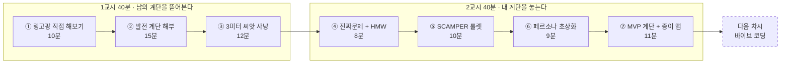
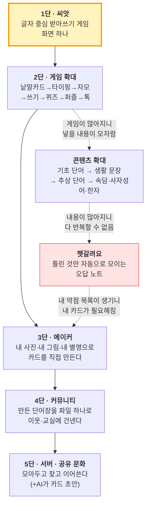

# 2일차 · 1~2교시 — 링고팡 해부 → 내 아이디어에 계단 놓기
## 분 단위 진행안 (교사 대사 포함) · 전 과정 A4·필기

> **수업 순서의 원칙** — **먼저 써보게 하고(10분), 그다음 어떻게 만들어졌는지 알려준다.**
> 안 써본 서비스의 개발 이야기는 남의 나라 이야기입니다. 손가락으로 만져 본 뒤에 들어야 "아, 이게 그거였구나"가 됩니다.
>
> **앞 시간까지** 1일차: 아이디어 회의 + 벤치마킹만. 아직 아무것도 못 정함 → 정상입니다.
> **오늘 배우는 것** 아이디어를 *고르는 법*이 아니라 **계단을 놓아 키우는 법**.

| 항목 | 내용 |
|---|---|
| **차시** | 1교시 40분 + 쉬는 시간 10분 + 2교시 40분 |
| **오늘의 한 줄** | **"하나를 끝내면, 다음 계단이 보인다."** |
| **교구** | A4 백지, 네임펜, 포스트잇 3색, 가위, 풀, 타이머 / **링고팡 체험용 기기 팀당 1대(1교시 10분만)** |
| **결과물 4종** | ① 링고팡 계단 해부표 ② 아이디어 씨앗 카드(HMW) ③ 페르소나 초상화 ④ MVP 계단 + 종이 앱 3장 |

---

# 0. 오늘의 전체 지도



**칠판 왼쪽에 수업 내내 고정으로 적어 둘 문장**

> ### 🪜 하나가 되면 → 힘이 생기고 → 다음 계단이 보인다

---

# 1교시 (40분)

## ⏱ 00:00–10:00 · 활동 ① 링고팡을 직접 해본다

> ### 🤔 왜 앱부터 만져보나요? — 학생에게 이렇게 말해 주세요
> "여러분이 지금부터 만들 건 **앱**이에요. 그런데 앱을 한 번도 '뜯어보지 않고' 만들면 어떻게 될까요?
> 요리를 한 번도 안 먹어보고 요리사가 되겠다는 거랑 같아요.
> **10분만 써보고, 그다음에 '이게 어떻게 이렇게 됐는지' 이야기를 들을 거예요.** 그 이야기가 오늘 여러분이 쓸 방법입니다."
>
> **교사용 이유(속마음)** — 체험 없이 개발 스토리를 들려주면 학생에게는 남의 회사 이야기로 끝납니다. 손가락으로 만진 기억이 있어야 "아, 내가 아까 친 그 받아쓰기가 1단이었구나"로 연결됩니다. **체험 → 해부** 순서가 오늘 수업의 성패를 가릅니다.

> 유일하게 기기를 쓰는 10분입니다. **팀당 1대, 2~3명이 번갈아** 씁니다. `lingopang.com` 접속 (설치·가입·결제 없음).

### ▸ 진행 (교사가 타이머로 구간을 끊어줍니다)

| 시간 | 미션 | 학생이 하는 일 |
|---|---|---|
| 0~4분 | **미션 1 — 받아쓰기 게임** | 한글 시작하기 → 2단계 타이핑으로 단어 3개 완성 |
| 4~7분 | **미션 2 — 자모 게임 / 퍼즐** | 자음·모음을 끌어다 글자 만들기, 낱말 퍼즐 1판 |
| 7~10분 | **미션 3 — 메이커** | 내 카드 1장 만들기 (그림 그리기 + 내 별명 붙이기) |

### ▸ 체험 직후 포스트잇 3장 (기기 덮고 30초 안에)

| 색 | 적을 것 |
|---|---|
| 노랑 | **"재밌었던 것 딱 한 가지"** |
| 파랑 | **"이건 왜 이렇게 만들었을까?" 싶은 것** |
| 분홍 | **"내가 만들면 여기를 바꾸겠다"** |

> **✍️ 실제로 이렇게 나옵니다 (교사가 미리 알고 있으면 좋은 답)**
> · 노랑: *"자모 끌어다 붙이는 거"* *"퍼즐에서 단어 찾을 때"* *"내 그림 그리는 거"*
> · 파랑: *"왜 캐릭터가 없지?"* *"왜 정답 보기가 없지?"* *"왜 공짜지?"* ← **이 세 질문이 전부 '일부러 그렇게 만든 것'입니다. 15분 해부 시간에 하나씩 답해 주면 학생이 놀랍니다.**
> · 분홍: *"소리를 더 크게"* *"친구랑 대결하기"* ← 분홍은 나중에 **"그건 몇 단 이야기일까?"**로 다시 씁니다.

> **교사 대사** — "지금 여러분이 만진 건 **완성된 앱**이에요. 그런데 이게 처음부터 이렇게 컸을까요?
> **아니요. 처음엔 화면 딱 하나였어요.** 받아쓰기 하나요. 지금부터 그 계단을 뜯어볼게요."

---

## ⏱ 10:00–25:00 · 활동 ② 링고팡 발전 계단 해부 (오늘의 핵심)


> ### 🤔 왜 남의 앱 계단을 15분이나 뜯어보나요?
> "여러분이 오늘 제일 많이 할 말이 뭔지 알아요? **'뭐 만들지 모르겠어요'**예요.
> 그건 아이디어가 없어서가 아니라, **아이디어가 어떻게 커지는지를 본 적이 없어서**예요.
> 링고팡은 3만 개 단어가 들어 있는 큰 앱인데, 처음엔 **화면 하나**였어요. 그 하나에서 여기까지 온 길을 지금 통째로 볼 거예요.
> 길을 한 번 보면, 여러분 아이디어에도 **같은 길을 깔 수 있어요.**"
>
> **교사용 이유** — 초등 5학년이 기획에서 무너지는 지점은 "작아서 부끄럽다"입니다. 큰 서비스도 1단은 초라했다는 걸 **구체적 사실로** 보여주면, 작게 시작하는 것에 대한 부끄러움이 사라집니다. 이게 오늘 수업의 정서적 목표입니다.
> **이 15분이 오늘 수업의 심장입니다.** 판서용으로 칠판에 계단을 그리면서, **한 칸씩** 올라갑니다.
> 매 칸마다 반드시 세 가지를 소리 내어 말합니다 — **㉮ 무엇이 됐나(결과) ㉯ 그래서 무슨 힘이 생겼나 ㉰ 그 힘이 보여준 다음 칸.**

### ▸ 계단 전체도 (교실 뒤 벽에 A3로 붙여 둘 것)



### ▸ 한 칸씩 · 교사 해설 스크립트

#### 🪜 1단 — 씨앗: "받아쓰기 하나"

| 항목 | 내용 |
|---|---|
| **본 장면** | 좋은 학습지·앱을 수십만 원어치 샀는데, 몇 주 뒤 아이가 배운 단어를 **기억 못 한다**. 복습 없이 다음 레슨으로 넘어가서 |
| **깎은 진짜 문제** | "한글 앱이 필요해"(X) → **"보기 중에 고르면 몰라도 맞는다. 손으로 써야 진짜 안다"**(O) |
| **만든 것 (딱 하나)** | 글자 중심 **받아쓰기 게임 화면 하나**. 그림으로 못 맞히게 하고, 음절을 직접 쳐야 넘어감 |
| ㉮ 결과 | 우리 집 아이가 **혼자 끝까지 갔다** |
| ㉯ 생긴 힘 | *"어? 되네."* — 이게 진짜 되는구나 하는 **확신 1개** |
| ㉰ 보인 다음 칸 | 근데 **같은 게임만 하니까 3일 만에 질린다** → 게임을 늘려야겠다 |

> **교사 대사** — "여기서 중요한 건 크기가 아니라 **끝냈다는 것**이에요. 화면 하나를 끝냈더니 '되네'가 생겼고, 그 '되네'가 다음 계단을 보여줬어요.
> 여러분도 오늘 정할 건 **1단 하나**입니다."

> **📌 구체적으로 '화면 하나'가 뭐였나** — 이렇게 설명해 주세요.
> ① 화면에 그림 없이 **"고양이"**라는 글자와 스피커 버튼만 나온다
> ② 아이가 **"고"**를 치고 **"양"**을 치고 **"이"**를 친다
> ③ 맞으면 다음 단어. 틀리면 힌트 한 글자.
> **끝입니다. 이게 전부였어요.** 점수판도, 로그인도, 캐릭터도 없었습니다.
>
> **그런데 왜 이게 효과가 있었나** — 보기에서 고르는 문제는 **몰라도 맞습니다.** 직접 쳐야 하는 문제는 **알아야만 맞습니다.**
> 링고팡이 발견한 한 줄: *"손으로 써야 진짜 안다."*
>
> **학생에게 되묻기** — "여러분 아이디어에서 '보기 중에 고르기'에 해당하는 건 뭐고, '직접 쓰기'에 해당하는 건 뭘까요?"

#### 🪜 2단 — 게임 확대: "같은 단어를 다른 방식으로 8번 만나게"

| 항목 | 내용 |
|---|---|
| 왜 올라갔나 | 하나의 게임만으론 **반복이 지겨움**. 그런데 어휘는 반복해야 남음 |
| 만든 것 | 1 낱말카드 → 2 타이핑 → 3 자모 조합 → 4 쓰기(획순 따라 그리기) → 5 주관식 퀴즈 → 6 낱말 퍼즐 → 7 톡 대화 → 8 메이커 |
| 숨은 설계 | **5일 사이클** — 1~3일 연습 / 4일 복습(퀴즈·퍼즐) / 5일 응용(문장·말하기) |
| ㉮ 결과 | 같은 단어를 만나도 **매번 새 놀이**가 됨. 두 딸이 "한 번만 더!"를 외침 |
| ㉯ 생긴 힘 | 아이가 **매일 연다** = 습관이 생김 |
| ㉰ 보인 다음 칸 | 게임이 8개가 되니 **넣을 단어가 모자란다** → 콘텐츠를 늘려야겠다 |

> **학생에게 줄 원리** — **"기능을 늘리는 게 아니라, 같은 것을 만나는 '방법'을 늘렸다."**
> (여러분 앱도 화면 10개 만들지 말고, **하나를 여러 방식으로** 만나게 해보세요.)

> **📌 '고양이' 한 단어가 하루에 만나는 8가지 방법 — 칠판에 순서대로 써 주세요**
> ① 카드로 **본다**(그림+소리) → ② 음절을 **친다**(타이핑) → ③ ㄱ+ㅗ+ㅇ+ㅑ+ㅇ+ㅇ+ㅣ를 **끌어다 조립한다**(자모)
> → ④ 엷은 글자를 **따라 그린다**(쓰기·획순) → ⑤ 그림 보고 **답을 쓴다**(주관식 퀴즈) → ⑥ 글자판에서 **찾아낸다**(퍼즐)
> → ⑦ 대화 빈칸에 **써먹는다**(톡) → ⑧ 내 고양이 사진으로 **카드를 만든다**(메이커)
>
> **왜 이렇게까지 하나** — 사람은 하루만 지나도 배운 것의 약 60%를 잊습니다. 그래서 링고팡은 **5일 묶음**으로 설계했습니다.
> 1~3일 연습 → 4일 복습(퀴즈·퍼즐) → **5일 응용(문장 만들기·말하기)**.
> 핵심은 마지막 5일차예요. *"안다"와 "쓸 수 있다"는 다르다* — 그래서 응용 날을 따로 뒀습니다.
>
> **🎯 우리 수업으로 번역** — "여러분 앱에서 **사용자가 같은 일을 다시 하고 싶어지게** 만드는 방법은 뭘까요?
> 기능을 늘리는 게 아니라 **만나는 방법**을 늘리는 겁니다. (예: 기분 기록 앱 → 숫자로 / 색으로 / 얼굴 그림으로 / 주간 그래프로)"

#### 🪜 콘텐츠 축 — 옆으로 뻗은 계단: "쉬운 것에서 어려운 것으로"

| 단계 | 한글 | 영어 |
|---|---|---|
| 0~1 | 자모·한글 첫걸음 / 기본 단어 | ABC 알파벳·파닉스 / My First Words |
| 2~3 | 생활 단어 → **생활 문장** | Daily Words → Sentences |
| 4~5 | **속담 · 사자성어** (추상 단어·한자) | Kids Talk → Everyday English |
| 6~7 | — | Travel Talk → Quotes & Proverbs |

> 결과: 한글 15,000+ · 영어 20,000+ · 합계 **3만 개 이상**, 누리과정·초등 교과 연계.
> ㉯ **생긴 힘** — "이 앱 하나로 4세부터 9세까지 간다"는 **범위**가 생김.
> ㉰ **보인 다음 칸** — 단어가 3만 개가 되니 **다 반복하면 죽는다**. 틀린 것만 다시 만나야 한다.

> **📌 왜 '쉬운 것 → 어려운 것' 순서가 그렇게 중요한가**
> 대부분의 유아 앱은 **사물 이름(사과, 고양이)에서 끝납니다.** 그림으로 보여줄 수 있으니까요.
> 그런데 교과서에서 아이를 무너뜨리는 건 **그림으로 못 그리는 말**입니다 — *"억울하다", "직각", "이등변", "가정법"*.
> 링고팡은 여기를 일부러 파고들었습니다: 생활 단어 → **생활 문장** → **추상 단어** → **속담·사자성어(한자)**.
> 속담·사자성어는 외우게 하지 않고 **유래를 그림 슬라이드로 보여줍니다.** 이야기가 붙으면 외워집니다.
>
> **🎯 우리 수업으로 번역** — "여러분 아이디어에도 **쉬운 버전과 어려운 버전**이 있어요.
> 예) 기분 기록 → 1단계 '좋다/나쁘다' → 2단계 '설렌다/서운하다/억울하다' 같은 **정확한 감정 단어**로.
> 처음엔 쉬운 것만. **어려운 건 계단 위 칸에 보관.**"

#### 🪜 헷갈려요 — 오답 노트 자동 생성 (콘텐츠가 커져서 생긴 발명)

| 항목 | 내용 |
|---|---|
| 문제 | 대부분의 앱은 **전부를 처음부터** 반복시킨다 → 아는 것까지 또 함 |
| 만든 것 | 틀린 단어가 **자동으로 "헷갈려요"에 쌓임**. 힌트 → 두 번째 기회 → 그래도 안 되면 목록 적립 → 다시 맞히면 목록에서 빠짐 |
| ㉮ 결과 | 아이가 **"내가 무엇을 모르는지"를 눈으로 본다** (메타인지) |
| ㉯ 생긴 힘 | 학습이 **개인화**됨 — 같은 앱인데 아이마다 다른 목록 |
| ㉰ 보인 다음 칸 | 내 약점 목록이 생기니 **"이 단어는 내 방식으로 만들고 싶다"** → 메이커 |

> **교사 대사(중요)** — "오답 노트는 처음부터 기획한 게 아니에요. **콘텐츠가 커져서 생긴 문제를 푸는 과정에서 태어났어요.**
> 좋은 기능은 회의에서 나오는 게 아니라 **앞 계단의 부작용에서** 나옵니다."

> **📌 "헷갈려요"가 실제로 어떻게 도나 — 4단계로 설명해 주세요**
> ① 아이가 "고양이"를 틀린다 → ② **힌트 한 글자**를 준다 → ③ 두 번째 기회에도 틀리면 **"헷갈려요" 목록에 자동 저장**
> → ④ 며칠 뒤 다시 나와서 맞히면 **목록에서 조용히 빠진다**
>
> **왜 이게 대단한가 — 학생에게 이렇게 말해 주세요**
> "대부분의 앱은 1번부터 100번까지 **전부 다시** 시켜요. 아는 것까지 또 하니까 지겹죠.
> 링고팡은 **내가 모르는 것만** 남겨요. 그러면 아이가 **'내가 뭘 모르는지'를 눈으로 보게 돼요.**
> 이게 공부에서 제일 중요한 능력이에요. 틀린 건 **벌**이 아니라 **지도**예요."
>
> **🎯 우리 수업으로 번역 (아주 강력한 아이디어 씨앗)** — "여러분 앱에서 **'틀린 것·못한 것·안 한 것'만 따로 모으면** 어떻게 될까요?
> 예) 준비물 앱 → 자주 빠뜨리는 준비물만 모으기 / 물 마시기 앱 → 못 채운 날만 모으기 / 영어 앱 → 매번 틀리는 단어만."

#### 🪜 3단 — 메이커: "쓰는 사람이 만드는 사람이 된다"

| 항목 | 내용 |
|---|---|
| 왜 올라갔나 | 회사가 아무리 많이 넣어도 **오늘 학습지에서 틀린 그 단어**는 없다 |
| 만든 것 | 내 사진·내 그림(배경 템플릿·스티커)·내 문장·내 별명으로 카드 만들기 |
| 유명한 예 | 교과서 속 "아빠"는 잊어도, 웃으며 만든 **"뿜뿜 아빠"**는 안 잊는다 |
| ㉮ 결과 | **콘텐츠가 무한**해짐 (사용자가 만드니까) |
| ㉯ 생긴 힘 | 사용자가 **애착**을 가짐 — 내가 만든 건 남에게 보여주고 싶다 |
| ㉰ 보인 다음 칸 | 보여주고 싶어졌으니 → **나눌 길**을 만들자 |

> 왜 링고팡은 **글자**를 골랐나 — 영상·캐릭터는 무거워서 사용자가 못 만듭니다. **글자는 카드 한 장이 텍스트 몇 줄**이라 아이도 만들 수 있습니다.
> → 학생 번역: **"내가 고를 재료가, 나중에 사용자가 만들 수 있는 재료인가?"**

> **📌 "뿜뿜 아빠" 이야기 — 이 한 장면이 오늘 제일 잘 먹힙니다**
> 아이가 아빠 사진을 직접 찍어 카드에 넣고, 이름을 **"뿜뿜 아빠"**라고 붙였습니다.
> 교과서에 있는 "아빠"는 며칠 뒤 잊어버립니다. 그런데 **웃으면서 자기가 지은 "뿜뿜 아빠"는 안 잊습니다.**
> 이유는 두 가지예요 — ① **내가 만든 것**이라서(내 것이니까) ② **감정이 붙어서**(웃었으니까).
>
> **🎯 우리 수업으로 번역 (질문 그대로 던지세요)**
> "우리 앱에서 사용자가 **자기 이름·자기 사진·자기 말**을 넣을 수 있는 칸은 어디예요? 딱 한 칸만 만들면 어디가 좋을까요?"
> 예) 응급처치 카드 → 우리 집 비상 연락처를 내가 넣기 / 기분 기록 → 감정 이름을 내가 지어 붙이기("찌뿌둥")

#### 🪜 4단 — 커뮤니티: "파일 하나로 옆집에"

| 항목 | 내용 |
|---|---|
| 만든 것 | 만든 단어장을 **파일 하나로 내보내기** → 카톡·메일로 전달 → 받은 집에서 바로 게임에 등장, 자기 말로 수정 가능 |
| 회사가 먼저 한 일 | **템플릿 단어장을 매주 배포**. "만들어 보세요"만 하면 아무도 안 만듦 → **채워진 걸 받아 한 줄만 고치게** |
| ㉮ 결과 | **서버 없이도** 사람 손을 타고 콘텐츠가 흐름 |
| ㉯ 생긴 힘 | 회사가 안 만든 주에도 **사용자끼리 오간다** = 문화의 시작 |
| ㉰ 보인 다음 칸 | 오가는 게 많아지니 **어디 보관? 어떻게 찾지? 중복은? 이상한 건 누가 걸러?** → 서버가 필요해짐 |

> **📌 왜 "빈 종이"를 주지 않고 "채워진 단어장"을 줬을까 — 오늘 수업에도 그대로 씁니다**
> 처음부터 "카드 만들어 보세요"라고 하면 **아무도 안 만듭니다.** (여러분도 백지 주면 멈추죠?)
> 그래서 회사가 매주 **완성된 템플릿 단어장**을 먼저 뿌렸습니다. 사람들은 그걸 받아 **한 줄만 고치는 것**으로 시작했고, 그러다 자기 걸 만들게 됐습니다.
> 잘 만든 단어장은 **다음 달 공식 템플릿**이 됐습니다.
>
> **교사에게** — 오늘 1교시에 사례 카드와 링고팡 체험을 먼저 보여준 이유가 정확히 이것입니다. **빈 종이 앞의 공포를 없애는 것.**
> 학생에게도 말해 주세요: "선생님도 지금 여러분한테 **채워진 걸 먼저 보여주고** 있는 거예요. 이게 링고팡이 쓴 방법이에요."

#### 🪜 5단 — 서버 · 공유 문화 (+AI)

| 항목 | 내용 |
|---|---|
| 왜 이제야 | **"서버는 기능을 늘리려고 두는 게 아니라, 나눔을 관리해야 할 때 비로소 필요해진다."** 사용자가 없는데 서버부터 만들면 돈만 나감 |
| 만들 것 | 보관·검색·중복 정리·안전 점검·기기 바꿔도 이어지는 기록 / **AI가 카드 초안(글·그림) 생성** |
| 왜 AI가 마지막 | 1단계에선 **일부러 AI를 안 넣음** — *"사람의 손으로 만드는 경험이 먼저 쌓여야 하기 때문"* |


> **📌 왜 서버를 5년 동안 안 만들었나 — 돈 이야기로 해주면 확 이해합니다**
> 서버가 없으면 사용자가 1명이든 10만 명이든 **추가로 드는 돈이 거의 0원**입니다.
> 그래서 링고팡은 도메인·앱 등록비 다 합쳐 **한 달 10만 원 정도**로 버텼고, 광고만으로 이익이 났습니다.
> 보통 앱은 사람이 늘면 서버비도 늘어서 **잘 될수록 손해**가 되기 쉬운데, 링고팡은 반대였습니다.
> 서버는 **"나눔이 많아져서 관리가 필요해질 때"** 비로소 만듭니다.
>
> **📌 AI도 공짜가 아니다** — AI는 그림 한 장, 문장 한 줄마다 **실제로 돈이 나갑니다.**
> 그래서 링고팡은 *공부 내용은 끝까지 무료, 돈 드는 AI 도구만 쓴 만큼 결제*로 설계했습니다.
> **학생에게** — "AI를 넣자는 말은 **돈을 쓰자는 말**이기도 해요. 손으로 해보고, 정말 손이 아플 때 넣는 겁니다."
> **칠판에 크게** — 🪜 **"1단 없이 5단 없다."**
> 커뮤니티부터 만들면 → **빈 게시판**. 서버부터 만들면 → **돈만 나감**. AI부터 넣으면 → **손으로 해본 적이 없어 뭘 자동화할지 모름**.

### ▸ 1분 확인 퀴즈 (구두, 손 들기)

1. 링고팡의 1단은? *(받아쓰기 게임 화면 하나)*
2. 게임을 8개로 늘린 이유는? *(같은 단어를 다른 방식으로 만나게 — 반복을 놀이로)*
3. "헷갈려요"는 왜 생겼나? *(콘텐츠가 3만 개가 되어 전부 반복이 불가능해져서)*
4. AI는 왜 마지막인가? *(손으로 먼저 해봐야 무엇을 자동화할지 알기 때문)*

---

## ⏱ 25:00–38:00 · 활동 ③ 3미터 씨앗 사냥

> ### 🤔 왜 '내 3미터 안'만 보라고 하나요?
> "'환경을 지키는 앱'을 만들면 멋있어 보이죠. 그런데 물어볼게요 — **그 앱을 쓸 사람을 오늘 만날 수 있어요?**
> 못 만나면 **되는지 안 되는지 확인할 방법이 없어요.** 확인 못 하면 고칠 수도 없고요.
> 반대로 '우리 학교 1학년 동생'은 **쉬는 시간에 가서 보여줄 수 있어요.** 그래서 3미터예요. 작아서가 아니라 **확인할 수 있어서**입니다."
>
> **📌 진짜 그런지 증거로 보여주기** — 상을 받은 발명품들도 전부 3미터 안이었습니다.
> · 대통령상: **"기름진 국 좋아하는 아빠 뱃살이 걱정돼서"** 만든 기름 걷는 국자
> · 아기 울음소리 3분류 AI — **내 동생이 왜 우는지 몰라서**
> · 딸기 가격 예측 AI — **딸기가 언제 싼지 몰라서**
> "'세계 평화'로 상 받은 사람은 없어요. **'우리 아빠 뱃살'로 대통령상을 받았어요.**"

### ▸ A4 세로 3칸 접기 — "나의 하루 지도" (개인 8분)

| 칸 | 시간대 | 교사가 읽어주는 사냥 질문 |
|---|---|---|
| 1 | 아침·등굣길 | "오늘 아침 누가 한숨 쉬었지? 나는 뭘 두고 왔지?" |
| 2 | 학교(수업·급식·쉬는 시간) | "줄 서다가, 발표하다가, 물건 빌리다가 — **멈칫한 순간**은?" |
| 3 | 방과 후·집 | "동생·부모님·할머니가 '아이참' 한 순간은?" |

> **규칙 — 명사 금지, 장면만.** "급식"(X) → "국을 앞사람이 다 퍼가서 내 차례엔 건더기가 없었다"(O). 장면엔 **반드시 사람**이 있어야 합니다.

> ### 🤔 왜 명사가 아니라 '장면'이어야 하나요?
> "'급식'이라고 쓰면 **아무것도 안 떠올라요.** 그런데 '국을 앞사람이 다 퍼가서 건더기가 없었다'라고 쓰면
> 그 순간 **누가 있었는지, 몇 시였는지, 내가 무슨 표정이었는지**가 다 딸려 와요.
> 발명은 그 딸려 오는 것들 속에 숨어 있어요. **명사는 상자예요. 장면은 상자를 연 거예요.**"
>
> **✍️ 채워진 하루 지도 예시 (칠판에 한 줄씩 보여주세요)**
>
> | 시간 | ❌ 이렇게 쓰면 안 됨 | ✅ 이렇게 써야 함 |
> |---|---|---|
> | 아침 | 준비물 | "체육복을 또 안 가져와서 3반에 빌리러 갔다. 빌려준 애가 좀 싫어했다" |
> | 학교 | 발표 | "발표할 때 목소리가 떨려서 뒤에 애들이 '안 들려요' 했다" |
> | 학교 | 급식 | "국을 앞사람이 건더기만 퍼가서 내 차례엔 국물만 남았다" |
> | 집 | 할머니 | "할머니가 리모컨 버튼이 작아서 다른 걸 눌러 놓고 나를 불렀다" |
> | 집 | 동생 | "동생이 우유팩을 헹구지 않고 그냥 종이통에 넣었다" |
> **막히는 학생에게** — 부록 C의 **바이브 코딩 아이디어 50**을 "기출문제"처럼 1분 훑게 합니다. 베끼라는 게 아니라 **"이 정도 크기면 되는구나"** 눈금을 얻기 위해서입니다.

### ▸ 팀 씨앗 고르기 (5분)
세 명의 하루 지도를 펼쳐 **두 명 이상이 "나도 봤어"** 하는 장면에 ○. 그중 가장 생생하게 말할 수 있는 **장면 1개** 선택.

## ⏱ 38:00–40:00 · 마무리
씨앗 장면을 팀별로 **한 문장씩** 소리 내어 발표. (아직 해결책 금지 — 장면만)

---

## 🔔 쉬는 시간 10분
> **선택 미션** — 복도에서 만난 사람 1명에게 우리 장면을 말하고 "너도 그런 적 있어?" 한 마디 받아 오기. 받아 오면 이름을 종이에 적습니다. **오늘의 첫 사용자 조사**입니다.

---

# 2교시 (40분)

## ⏱ 00:00–08:00 · 활동 ④ 진짜 문제 깎기 + HMW 문장

### ▸ "왜?" 사다리 5칸 (5분)

```
[5] 왜? → ______________________ ← 우리 손으로 바꿀 수 있는 가장 높은 칸에 ★
[4] 왜? → ______________________
[3] 왜? → ______________________
[2] 왜? → ______________________
[1] 장면: (씨앗 카드에서 그대로)
```

> **링고팡 시범 (칠판에 그대로 써 주세요)**
> 장면: 앱을 다 했는데 배운 단어를 말 못 한다 → 왜? 그림 보고 찍어서 → 왜? 그림이 정답 힌트라서 → 왜? 고르는 문제라서 → 왜? **손으로 써 볼 기회가 없어서** ★ ← 여기서 받아쓰기 게임이 나왔다
>
> 사다리 위로 갈수록 "사회가 나빠서" 같은 답이 나옵니다. 그건 **너무 올라간 것**. ★는 **우리 손이 닿는 가장 높은 칸**에 찍습니다.

### ▸ HMW 문장 (3분) — 문제를 문(門)으로

**"어떻게 하면 ______가 ______할 수 있을까?"**

| 나쁜 예 | 왜 | 좋은 예 |
|---|---|---|
| 어떻게 하면 환경을 지킬까? | 너무 넓음 | 어떻게 하면 **1학년 동생이 3초 안에** 맞는 통을 찾게 할까? |
| 어떻게 하면 분리수거 로봇을 만들까? | 답이 들어 있음 | (위와 동일 — 답 말고 **상황**) |

> 채점 기준 두 개: **① 사람이 있는가 ② 답이 없는가.**

> ### 🤔 왜 '어떻게 하면 ~할 수 있을까?'로 바꾸나요?
> "'동생이 분리수거를 못 한다'는 **불평**이에요. 불평 앞에서는 아무 생각도 안 나요.
> 그런데 '어떻게 하면 동생이 3초 안에 맞는 통을 찾을까?'는 **문**이에요. 문 앞에서는 손이 움직여요.
> 같은 내용인데 **문장 모양만 바꿨는데** 아이디어가 나오기 시작해요. 이게 진짜예요."
>
> **✍️ 문장 바꾸기 연습 3개 (같이 소리 내어 읽기)**
>
> | 불평 | → 문(HMW) |
> |---|---|
> | 체육복을 자꾸 까먹는다 | 어떻게 하면 **내가 자기 전에** 내일 준비물을 떠올릴 수 있을까? |
> | 할머니가 리모컨을 못 쓴다 | 어떻게 하면 **할머니가 버튼 3개만으로** 보고 싶은 채널을 켤 수 있을까? |
> | 국에 건더기가 없다 | 어떻게 하면 **급식 줄 뒤쪽 사람도** 건더기를 받을 수 있을까? |
>
> **✍️ 링고팡의 HMW는 이거였습니다** — *"어떻게 하면 여섯 살 아이가 **혼자서, 그림 힌트 없이** 단어를 익힐 수 있을까?"*
> → 답: 받아쓰기. → "못 읽는 네 살은?" → **모든 화면에 음성을 붙임.** HMW 한 줄이 기능을 다 결정했습니다.

**[결과물 ②] 아이디어 씨앗 카드** — 장면 그림 1컷 / ★칸 / HMW 문장 / 이 장면을 본 사람 이름

---

## ⏱ 08:00–18:00 · 활동 ⑤ SCAMPER 룰렛 — 양으로 승부하는 10분


> ### 🤔 왜 주사위를 굴리나요? 그냥 생각하면 안 되나요?
> "그냥 '아이디어 내봐' 하면 머릿속에 **제일 먼저 떠오른 하나**만 맴돌아요. 그리고 5분 뒤엔 조용해지죠.
> 주사위는 **억지로 다른 방향을 보게** 만들어요. '빼면?'이 나오면 싫어도 빼는 걸 생각해야 하니까요.
> 좋은 아이디어는 **많이 낸 것 중에서** 나와요. 처음부터 좋은 걸 내려고 하면 하나도 못 내요."
>
> **왜 '에이~' 금지인가** — 한 명이 "에이~" 하는 순간 **나머지가 입을 닫습니다.** 10분 동안은 평가를 미룹니다.
> 고르는 건 마지막 4분(Crazy 4 + 투표)에 몰아서 합니다. **내는 시간과 고르는 시간을 섞지 않는 것** — 이게 발상의 제1규칙입니다.
> 칠판에 규칙 한 줄: **"지금은 판사 금지, 전원 발명가."** ("에이~" 금지 / "그리고 또!"만 허용)
> 주사위(부록 D 전개도)를 **2분에 한 번** 굴려 총 4~5회전. 나온 아이디어는 포스트잇 1장에 1개.

| 면 | 렌즈 | 어린이 말 질문 | **링고팡에서 실제로 이렇게 나왔다** |
|---|---|---|---|
| **S** 바꾸기 | Substitute | "재료를 딴 걸로 바꾸면?" | 영상·캐릭터를 빼고 **글자와 소리**로 |
| **C** 합치기 | Combine | "딴 것과 붙이면?" | 받아쓰기 + **퍼즐·퀴즈·톡 대화** |
| **A** 빌리기 | Adapt | "다른 데서 잘되는 걸 빌리면?" | 학교의 **오답 노트** 문화를 빌려 "헷갈려요" |
| **M** 키우기/줄이기 | Magnify/Minify | "10배 크게? 10분의 1로?" | 하루 학습을 **15분으로** 줄임 / 어휘는 **3만 개로** 키움 |
| **P** 딴 데 쓰기 | Put to other use | "다른 사람·장소에서 쓰면?" | 아이 카드 도구를 **학습지 복습 도구**로 |
| **E/R** 빼기/뒤집기 | Eliminate/Reverse | "아예 빼면? 뒤집으면?" | 가입·결제를 **아예 뺌** / 소비자를 뒤집어 **제작자**로 |

> **막힌 팀 비상 카드 (칠판에 시범)** — "분리수거 통에 SCAMPER를 걸면?"
> 바꾸기: 통 대신 **입구 모양**으로 구분 / 합치기: 통 + **농구 골대** / 빌리기: 주차장 **빈자리 초록불** / 키우기: 통을 **교실 문 앞으로** / 딴 데 쓰기: 같은 원리를 **급식 잔반통**에 / 뒤집기: 사람이 통을 찾는 게 아니라 **통이 사람을 부른다**

### ▸ Crazy 4 (마지막 4분)
A4를 4칸 접어 **1칸 1분**, 최고 아이디어 1개를 **4가지 다른 모습**으로 그립니다. 잘 그리기 금지 — 못 그릴수록 설명하게 되고, 설명하다 아이디어가 자랍니다.
→ 포스트잇 투표(1인 2표)로 **팀 대표 아이디어 1개** 확정.

> ### 🤔 왜 1분 안에, 못 그려도 되게 하나요?
> "시간을 길게 주면 **예쁘게 그리려고** 해요. 그럼 머리가 멈춰요.
> 1분이면 예쁘게 못 그리니까 **설명을 하게 되고**, 설명하다가 아이디어가 자랍니다.
> 오늘 잘 그린 그림은 점수가 0점이에요. **네 칸을 다 채운 것**이 점수예요."

---

## ⏱ 18:00–27:00 · 활동 ⑥ 페르소나 초상화 (9분)

> ### 🤔 왜 얼굴을 그리나요? 그냥 '초등학생'이라고 쓰면 안 되나요?
> "'초등학생을 위한 앱'이라고 하면, 만들다가 막힐 때 **물어볼 사람이 없어요.**
> 그런데 '옆 반 김서준'이라고 하면, 막힐 때 **쉬는 시간에 가서 물어보면 돼요.**
> 페르소나는 상상 속 인물이 아니라 **내 질문을 받아 줄 진짜 사람**이에요."
>
> **📌 링고팡이 실제로 이 덕을 본 장면** — 페르소나가 **개발자의 네 살·여섯 살 딸**이었습니다.
> 그래서 *"아이가 재미없어하면 그날 저녁에 고치고, 다음 날 아침에 반응을 확인"* 할 수 있었습니다.
> 어떤 설문조사보다 빠르고 정직합니다. **가까운 페르소나 = 빠른 수정.**

A4 한가운데 **우리 발명품을 쓸 그 사람 얼굴**을 크게 그리고 말풍선 6개를 답니다.

```
        [이름 · 나이]                  [입버릇 한 마디]
               \                       /
                ●  ← 실제로 아는 사람!
               /                       \
  [언제·어디서 곤란한가]         [지금은 어떻게 버티나]
               \                       /
 [진짜 바라는 것 한 가지]   [우리 걸 쓰는 순간의 표정과 한 마디]
```

> **철칙 — 상상 인물 금지.** 링고팡의 페르소나는 개발자의 **네 살·여섯 살 두 딸**이었습니다. 그래서 *저녁에 고치면 다음 날 아침에 반응*이 왔습니다. "20대 직장인"이라 쓴 팀에게 → **"오늘 쉬는 시간에 물어볼 수 있는 사람으로 바꾸자."**
>
> **마지막 말풍선이 오늘의 심장입니다.** 링고팡의 답은 *"부모가 옆에 없어도 아이 혼자 끝까지 가면 좋겠다"* 한 줄이었고, 이 한 줄이 **모든 기능의 심판**이 됐습니다.
> → 실제로 이 심판 때문에 **모든 화면에 음성(TTS)을 붙였습니다.** 글자를 못 읽는 네 살도 혼자 할 수 있어야 하니까요.

> **✍️ 채워진 페르소나 초상화 예시 (칠판 시범 1분)**
>
> | 말풍선 | 내용 |
> |---|---|
> | 이름·나이 | **박하윤 · 8살 (우리 학교 2학년, 내 동생)** |
> | 입버릇 | *"이거 어디다 넣어?"* |
> | 언제·어디서 | 집에서 우유팩·과자봉지를 버릴 때, 저녁마다 |
> | 지금은 어떻게 버티나 | 아무 통에나 넣고 도망간다 / 엄마를 부른다 |
> | 진짜 바라는 것 | **혼자서, 안 혼나고, 빨리 끝내기** |
> | 우리 걸 쓰는 순간 | 화면 보고 *"아, 초록통!"* 하고 **3초 만에 넣고 뛰어간다** |
>
> **이 마지막 칸이 왜 중요한가** — "3초 만에"라고 적는 순간 **설명이 긴 화면은 전부 탈락**합니다.
> 페르소나의 바람 한 줄이 **기능을 자동으로 잘라줍니다.** 링고팡의 "혼자 끝까지"가 음성을 부른 것처럼요.

**[결과물 ③] 페르소나 초상화** — 말풍선 6개가 다 찬 A4

---

## ⏱ 27:00–38:00 · 활동 ⑦ 내 MVP 계단 세우기 + 종이 앱

> ### 🤔 왜 다 만들지 않고 1단만 만드나요? — 제일 설득이 필요한 부분입니다
> "기능 10개짜리를 만들면 **10개 다 어설프게 끝나요.** 그리고 어디가 잘못됐는지도 몰라요.
> 1개만 만들면 **그 1개가 되는지 안 되는지 확실히 알 수 있어요.** 되면 자신감이 생기고, 그 자신감으로 2단을 만들어요.
> 링고팡도 받아쓰기 하나로 **'어? 되네'** 하나를 얻었고, 그 하나가 나머지 전부를 데려왔어요."
>
> **📌 버리는 게 아니라 '보관'입니다** — 2~5단에 적은 건 발표 때 이렇게 씁니다:
> *"저희는 오늘 1단을 만들었고, 다음엔 2단으로 이렇게 갑니다."*
> 점수가 나오는 건 **만든 것(1단) + 갈 길이 보이는 것(2~5단)** 둘 다입니다. **만든 것은 1단, 말하는 것은 5단.**

### ▸ A4 계단 접기 (5분) — 링고팡 계단을 우리 것으로 복사

A4를 가로로 지그재그 4번 접어 세웁니다. **아래 칸일수록 넓게** (1단이 제일 큼 — "심장이 제일 커야 한다"를 종이가 말해 줍니다).

| 단 | 링고팡은 | 우리는 | 넘어가는 조건 (이게 되면 다음 칸) |
|---|---|---|---|
| **1단 · 심장** | 받아쓰기 게임 화면 하나 | | **내가 3일 연속 써봤다** |
| 2단 · 반복 | 같은 단어를 8가지 방식으로 | | 질리지 않고 또 하게 된다 |
| 3단 · 메이커 | 내 사진·별명으로 카드 만들기 | | **친구가 자기 걸 만들었다** |
| 4단 · 커뮤니티 | 파일 하나로 옆집에 | | 시키지 않아도 오간다 |
| 5단 · 서버·AI | 보관·검색·초안 자동 생성 | | **손으로 하기 힘들어졌다** |

> **1단 옆에 반드시 적을 것 — "핵심 기술 한 줄"** (예: *화면 하나 + 정답 비교 + 맞으면 다음*)

> **✍️ 채워진 MVP 계단 예시 — "동생 분리수거 도우미"**
>
> | 단 | 우리 것 | 넘어가는 조건 |
> |---|---|---|
> | **1단 · 심장** | **물건 이름을 고르면 → 어느 통인지 색깔로 크게 보여준다** (핵심 기술: 목록 20개 + 고르면 결과 표시) | 동생이 혼자 3번 써봤다 |
> | 2단 · 반복 | 퀴즈 모드 — "이건 어디?" 맞히기 | 동생이 또 하자고 한다 |
> | 3단 · 메이커 | 우리 집에 자주 나오는 쓰레기를 **내가 목록에 추가** | 동생이 자기 항목을 넣었다 |
> | 4단 · 커뮤니티 | 우리 반 목록을 **다른 집에 파일로 전달** | 시키지 않아도 오간다 |
> | 5단 · 서버·AI | 사진 찍으면 **자동 판별** | 목록을 손으로 넣기 벅차졌다 |
>
> **여기서 꼭 짚어주세요** — "사진 찍으면 자동으로 알려주는 거요!"라고 외친 팀에게:
> **"그건 5단이에요. 그런데 5단을 먼저 만들면, 어떤 쓰레기가 헷갈리는지 아무도 몰라서 뭘 가르칠지도 모릅니다.**
> 1단에서 목록 20개를 손으로 만들어 봐야 **'아, 우리 집은 우유팩이 제일 헷갈리는구나'**를 알게 돼요. 그게 5단의 재료입니다."
> 2~5단은 **버리는 게 아니라 위 칸에 보관**하는 것입니다. 발표의 "발전 가능성"은 여기서 나옵니다. **만든 것은 1단, 말하는 것은 5단.**

### ▸ 종이 앱 3장 (6분)
A4를 8등분해 폰 화면 카드 3장. **1단(심장)만** 그립니다.

| 화면 | 반드시 들어갈 것 |
|---|---|
| 1 · 입력 | 페르소나가 **처음 누르는 것 딱 1개** |
| 2 · 처리 | 기다리는 동안 보이는 것 |
| 3 · 결과 | 페르소나의 **"오!"가 터지는 장면** |

> ### 🤔 왜 종이에 그리나요? 컴퓨터로 하면 더 빠르지 않나요?
> "컴퓨터로 만들면 **고치기가 아까워져요.** 두 시간 걸려 만든 걸 누가 버리고 싶겠어요?
> 종이는 **1분 만에 다시 그릴 수 있어요.** 마음껏 버릴 수 있어야 좋은 게 나와요.
> 그리고 다음 시간에 AI한테 '좋은 앱 만들어줘'라고 하면 이상한 게 나와요. **이 종이 3장을 보여주며 설명하면** 정확한 게 나옵니다.
> 오늘 그린 3장이 **다음 시간의 설계도**예요."
>
> **✍️ 종이 앱 3장 예시 — "동생 분리수거 도우미"**
>
> | 화면 | 그림에 들어갈 것 | 말로 설명하면 |
> |---|---|---|
> | 1 · 입력 | 큰 네모 버튼 6개: 우유팩 / 과자봉지 / 페트병 / 종이 / 캔 / 모르겠음 | "동생이 손에 든 걸 누른다. **버튼은 크고 글자는 적게**" |
> | 2 · 처리 | 화면 가운데 큰 물음표 하나, 0.5초 | "생각하는 척. 없어도 되지만 **누른 게 먹혔다는 표시**" |
> | 3 · 결과 | 화면 전체가 **초록색**, 가운데 "종이류" 큰 글자 + 통 그림 | "멀리서도 보이게. **색깔이 답이다** — 글자를 못 읽어도 됨" |
>
> **여기서 배우는 것** — 3번 화면을 "색깔이 답"으로 정한 이유는 페르소나가 **8살**이고 **3초 안에 끝내고 싶어 하기** 때문입니다.
> 페르소나 → 화면 설계가 이렇게 **한 줄로 이어집니다.** 이게 기획입니다.

## ⏱ 38:00–40:00 · 닫기 — 다섯 문장 릴레이
세 명이 번갈아 이어 읽습니다. 막히는 문장이 숙제입니다.

1. 우리가 본 장면은 ______ 이다.
2. "왜?"를 다섯 번 물었더니 진짜 문제는 ______ 였다.
3. 어떻게 하면 ______가 ______할 수 있을까? 우리 답은 ______다.
4. **1단(심장)은 ______ 하나다.** 나머지는 계단 위에 보관했다.
5. ______(페르소나)가 결과 화면을 보고 "______"라고 말하면 성공이다.

---

# 부록 A. 링고팡 팩트시트 (교사용 · 질문 나올 때 즉답)

| 항목 | 사실 |
|---|---|
| 주소 | lingopang.com (웹) + Google Play 앱 |
| 콘텐츠 | 한글 15,000+ / 영어 20,000+ · **3만 개 이상** 단어·문장 |
| 한글 단계 | 0 한글 첫걸음 → 1 기본 단어 → 2 생활 단어 → 3 생활 문장 → 4 속담 → 5 사자성어 |
| 영어 단계 | Stage 0 ABC → 1 My First Words → 2 Daily Words → 3 Sentences → 4 Kids Talk → 5 Everyday English → 6 Travel Talk → 7 Quotes & Proverbs |
| 학습 게임 | 낱말카드 · 타이핑 · 자모 조합 · 쓰기(획순) · 주관식 퀴즈 · 낱말 퍼즐 · 톡 대화 · 메이커 |
| 학습 사이클 | **5일 묶음** — 1~3일 연습 / 4일 복습 / 5일 응용 |
| 하루 분량 | **15분** (단어 수 3·5·8·10·15 중 선택) |
| 대상 | 4~9세 (누리과정 ~ 초등 3학년 연계) |
| 정책 | 설치·가입·결제 없음 / 광고 기반 무료 / 개인 사진·그림은 **기기 안에만** |
| 위치 | 교재를 **대체하지 않는 보조 복습 도구** ("경쟁자가 아니라 보완재") |
| 특징 기능 | **헷갈려요** = 틀린 단어 자동 수집 오답 노트 / **메이커** = 내 사진·그림·별명 카드 / **모든 화면 음성(TTS)** |

### 학생이 자주 하는 질문 3개와 답
- **"왜 캐릭터가 없어요?"** → 그림으로 맞히면 글자를 안 보니까요. **일부러 뺐습니다.**
- **"왜 공짜예요?"** → 서버가 없어서 사람이 늘어도 돈이 거의 안 듭니다. 광고로 충분합니다. *(→ 5단에서 서버가 생기면 비용이 생기고, 그때 AI 기능만 유료가 됩니다)*
- **"왜 객관식이 적어요?"** → 보기 중에 고르면 **몰라도 맞습니다.** 그래서 조립·타이핑으로 만들었습니다.

---

# 부록 B. 교사용 개입 대사집

| 상황 | 교사의 한 마디 |
|---|---|
| "환경을 지키는 앱이요" | "환경을 반으로 자르면? 또 반으로? **네가 오늘 본 조각**은 어디야?" |
| "그건 이미 있어요" | "있는 건 베끼는 게 아니라 **빌리는** 거야. 링고팡도 오답 노트를 학교에서 빌려왔어." |
| 해결책부터 외침 | "잠깐, 그건 **답**이야. 문제 문장에 답을 넣지 않기 — 사다리부터." |
| 페르소나가 흐릿 | "그 사람 어제 저녁에 뭐 했을까? 모르면 아직 **신발을 안 신은** 거야." |
| 서로 "에이~" | "판사봉 내려놔. 여긴 법정이 아니라 **공방**이야. '그리고 또!'로만 받자." |
| 기능 10개 | "버리지 말고 **2단에 보관**하자. 1단은 심장 하나." |
| "AI 넣을래요" | "링고팡은 AI를 **마지막**에 넣었어. 손으로 먼저, 손이 아플 때 AI." |
| 팀 의견 둘로 갈림 | "둘 다 **종이 앱 3장** 그려봐. 그려보면 대개 한쪽이 접혀." |

---

# 부록 C. 바이브 코딩 아이디어 50 (초등 5학년판)
> 전부 **화면 3장 안에서** 시작할 수 있는 크기. 각 항목 뒤 `[1단]`은 **오늘 종이에 그릴 심장 하나**입니다.
> 사용법: 씨앗 사냥이 막힌 학생에게 **1분만** 훑게 하고, 반드시 **"우리 반 버전은 뭐가 다른가"** 한 줄을 붙이게 합니다.

### 1) 학교생활 (1~10)
| # | 아이디어 | `[1단]` 심장 하나 |
|---|---|---|
| 1 | 준비물 알림판 | 내일 시간표 입력 → 준비물 목록 뜨기 |
| 2 | 우리 반 분실물 게시판 | 사진 없이 **한 줄 설명 + 주운 장소**만 |
| 3 | 급식 잔반 투표판 | 오늘 메뉴에 👍/👎 → 막대 그래프 |
| 4 | 모둠 역할 룰렛 | 이름 넣고 돌리면 역할 배정 |
| 5 | 자리 바꾸기 공정 뽑기 | 조건(앞자리 희망) 넣고 뽑기 |
| 6 | 수행평가 D-day 카드 | 과목·날짜 입력 → 색으로 급한 순 |
| 7 | 우리 반 도서 추천 카드 | 읽은 책 + 한 줄평 → 카드로 쌓기 |
| 8 | 쉬는 시간 화장실 혼잡 표시 | 층 선택 → "지금 붐빔" 버튼 |
| 9 | 칠판 필기 요약 카드 | 오늘 배운 것 3줄 → 저장·복습 |
| 10 | 우리 반 규칙 투표기 | 규칙 제안 → 찬반 집계 |

### 2) 공부·기억 (11~18) — 링고팡 계열
| # | 아이디어 | `[1단]` 심장 하나 |
|---|---|---|
| 11 | 내 오답 노트 | 틀린 문제 입력 → **자동으로 "헷갈려요" 목록** |
| 12 | 받아쓰기 연습기 | 단어 듣고 → 타이핑 → 맞으면 다음 |
| 13 | 한자·사자성어 카드 | 뜻 먼저 보여주고 글자 맞히기 |
| 14 | 영어 단어 뒤집기 카드 | 카드 눌러 뒤집기, 아는 것만 빼기 |
| 15 | 5일 복습 달력 | 오늘 외운 것 → 4일 뒤 자동 재등장 |
| 16 | 내가 만드는 문제집 | 내가 문제 3개 내고 친구가 풀기 |
| 17 | 교과 어려운 말 사전 | "직각, 이등변" 같은 **학습 어휘**를 그림으로 |
| 18 | 암기 타이머 | 3분 외우기 → 1분 백지 쓰기 |

### 3) 가족·돌봄 (19~26)
| # | 아이디어 | `[1단]` 심장 하나 |
|---|---|---|
| 19 | 할머니용 큰 버튼 리모컨 | 버튼 3개짜리 화면 하나 |
| 20 | 약 먹었나 확인판 | 아침·점심·저녁 체크 3칸 |
| 21 | 집안일 포인트판 | 집안일 누르면 점수 쌓임 |
| 22 | 동생 심부름 카드 | 심부름 카드 뽑기 |
| 23 | 반려동물 밥·산책 기록 | 오늘 눌렀나만 표시 |
| 24 | 우리 가족 생일·기념일판 | 날짜 입력 → 다가오는 순 정렬 |
| 25 | 부모님 말 번역기 | 요즘 말 ↔ 어른 말 카드 |
| 26 | 키오스크 연습장 | 진짜와 비슷한 **가짜 주문 화면**으로 연습 |

### 4) 건강·안전 (27~34)
| # | 아이디어 | `[1단]` 심장 하나 |
|---|---|---|
| 27 | 가방 무게 경고기 | 물건 체크 → 예상 무게 표시 |
| 28 | 자세 알림 타이머 | 20분마다 "허리 펴기" |
| 29 | 응급처치 카드 | 코피·화상·삐끗 → 3단계 카드 |
| 30 | 물 마신 횟수 세기 | 컵 아이콘 8개 채우기 |
| 31 | 등굣길 위험 지점 기록 | 사진 없이 **지점 이름 + 이유** |
| 32 | 오늘 뭐 입지 판정기 | 기온 입력 → 겉옷 판정 한 줄 |
| 33 | 눈 휴식 20-20-20 | 20분마다 20초 먼 곳 보기 알림 |
| 34 | 우리 집 대피 경로 그리기 | 집 구조 그리고 경로 표시 |

### 5) 마음·관계 (35~41)
| # | 아이디어 | `[1단]` 심장 하나 |
|---|---|---|
| 35 | 오늘 기분 온도계 | 1~10 누르면 달력에 색으로 |
| 36 | 고마움 쪽지함 | 익명 칭찬 한 줄 모으기 |
| 37 | 친구가 힘들 때 할 말 카드 | 하면 안 되는 말 / 해도 되는 말 |
| 38 | 사과 문장 도우미 | 상황 고르면 사과 문장 초안 |
| 39 | 우리 반 걱정 상자 | 익명 걱정 → 반 전체 투표로 해결 |
| 40 | 단톡방 예절 퀴즈 | 실제 상황 → 어떻게 답할까 |
| 41 | 화 식히기 60초 타이머 | 숨쉬기 안내 화면 하나 |

### 6) 동네·환경 (42~46)
| # | 아이디어 | `[1단]` 심장 하나 |
|---|---|---|
| 42 | 분리배출 헷갈림 사전 | 물건 이름 입력 → 어느 통인지 |
| 43 | 우리 학교 나무 도감 | 나무 사진·이름·위치 카드 |
| 44 | 교복·책 물려주기 게시판 | 사이즈·학년만 적는 한 줄 게시 |
| 45 | 우리 동네 계단 없는 길 | 경사로 위치 표시 지도 |
| 46 | 텀블러 사용 기록판 | 오늘 썼으면 도장 1개 |

### 7) 만들고 나누기 — 메이커·커뮤니티 계열 (47~50)
| # | 아이디어 | `[1단]` 심장 하나 |
|---|---|---|
| 47 | 나만의 낱말 카드 공장 | 그림 + 내 별명 → 카드 1장 |
| 48 | 우리 반 밈 사전 | 우리 반에서만 쓰는 말 + 뜻 |
| 49 | 학급 문집 카드 | 한 사람당 카드 1장씩 모으기 |
| 50 | 우리 팀 규칙 카드 만들기 | 규칙 만들고 **파일로 내보내 다른 팀에 주기** |

> **고를 때 체크 4개** — ① 오늘 5명에게 보여줄 수 있나 ② 내가 겪었나 ③ **화면 3장**으로 되나 ④ 판정 기준을 한 문장으로 말할 수 있나 *("○○이면 △△이다")*

---

# 부록 D. 종이 도구 만들기 (수업 전 5분)
- **SCAMPER 주사위** — A4에 십자 전개도(한 칸 6cm), 여섯 면에 S/C/A/M/P/E·R. 시간 없으면 **쪽지 뽑기**로 대체.
- **MVP 계단** — A4 가로로 지그재그 4번 접기. **아래 칸일수록 넓게.**
- **링고팡 계단 A3 벽보** — 위 mermaid 계단도를 손으로 크게 그려 붙이기 (수업 내내 손가락으로 가리키며 씁니다).

# 부록 E. 준비물
- A4 백지 (1인 6장 이상) · 포스트잇 3색 · 네임펜 · 가위 · 풀 · 타이머
- 링고팡 체험 기기 팀당 1대 (1교시 10분만)
- 링고팡 계단 A3 벽보 1장 + 팩트시트(부록 A) 교사용 1부
- 부록 C(아이디어 50) 인쇄 — 팀당 1부, **막힐 때만** 꺼내기

# 부록 F. 산출물 체크리스트
- [ ] 링고팡 체험 포스트잇 3장 (재밌던 것 / 왜 이렇게? / 내가 바꾼다면)
- [ ] 아이디어 씨앗 카드 — 장면 · ★진짜 문제 · **HMW 문장**
- [ ] 페르소나 초상화 — 실제 인물 · 말풍선 6개
- [ ] **MVP 계단** — 1단(심장 + 핵심 기술 한 줄) · 2~5단 보관 · 단별 넘어가는 조건
- [ ] 종이 앱 3장 + 사진 촬영 (실행 흔적 증거)
- [ ] 다섯 문장 릴레이 통과

---

# 부록 G. 처음부터 끝까지 따라가는 완성 예시 2팀
> 교사가 **미리 읽어두면 수업 중 어떤 질문에도 예시로 답할 수 있습니다.**
> 학생에게는 **막힐 때만, 해당 칸만** 보여주세요. 통째로 주면 베낍니다.

## 예시 A팀 — "동생 분리수거 도우미"

| 단계 | 우리 팀이 쓴 것 |
|---|---|
| ③ **장면** | "저녁에 동생(8살)이 우유팩을 헹구지도 않고 종이통에 넣었다. 엄마가 '또!' 했고 동생은 도망갔다." |
| ④ **왜? 사다리** | 왜 아무 데나? → **몰라서** → 왜 몰라? → 통에 붙은 글씨를 못 읽어서 → 왜 안 물어봐? → 물어보면 **혼나서** → ★ **혼나지 않고 혼자 3초 안에 알 방법이 없다** |
| ④ **HMW** | 어떻게 하면 **8살 동생이 혼자, 3초 안에** 맞는 통을 고를 수 있을까? |
| ⑤ **SCAMPER** | **빼기**: 글씨를 빼고 색깔만 / **빌리기**: 신호등처럼 색으로 / **합치기**: 도장 모으기 / **뒤집기**: 사람이 통을 찾는 게 아니라 **통 색이 화면에 뜬다** |
| ⑥ **페르소나** | 박하윤 8살 · 입버릇 "이거 어디다 넣어?" · 바람 **"혼자서, 안 혼나고, 빨리"** |
| ⑦ **1단(심장)** | 물건 6개 중 하나를 누르면 → **화면 전체가 그 통 색으로** 바뀌고 큰 글자로 이름 |
| ⑦ **종이 앱** | 1 버튼 6개 / 2 물음표 0.5초 / 3 초록 화면 + "종이류" |
| 🪜 **계단 위 보관** | 2단 퀴즈 모드 · 3단 우리 집 쓰레기 직접 추가 · 4단 옆집에 목록 주기 · 5단 사진 자동 판별 |
| 🎤 **발표 다섯 문장** | "저희가 본 장면은 동생이 우유팩을 종이통에 넣은 것입니다. 진짜 문제는 **혼나지 않고 혼자 알 방법이 없다**는 것이었습니다. 저희는 **색깔 하나로** 알려줍니다. 1단은 버튼 6개짜리 화면 하나입니다. 하윤이가 '아, 초록통!' 하고 3초 만에 뛰어가면 성공입니다." |

## 예시 B팀 — "급식 건더기 예보"

| 단계 | 우리 팀이 쓴 것 |
|---|---|
| ③ **장면** | "줄 뒤쪽에 섰더니 국에 건더기가 하나도 없었다. 앞사람들이 다 퍼갔다. 그날 국을 남겼다." |
| ④ **왜? 사다리** | 왜 없었지? → 앞사람이 많이 퍼서 → 왜 많이 퍼? → 뒷사람 생각을 안 해서 → 왜 안 해? → **뒤에 몇 명 남았는지 안 보여서** → ★ **퍼는 사람에게 남은 사람 수가 안 보인다** |
| ④ **HMW** | 어떻게 하면 **국을 푸는 사람이** 뒤에 몇 명 남았는지 알 수 있을까? |
| ⑤ **SCAMPER** | **바꾸기**: 국자를 작은 걸로 / **키우기**: 남은 인원을 큰 화면에 / **빌리기**: 놀이공원 **대기 인원 표시** / **뒤집기**: 뒤에서 앞으로 신호 보내기 |
| ⑥ **페르소나** | 우리 반 급식 도우미 **김도윤(5학년)** · 바람 **"마지막 사람까지 똑같이 주고 싶다"** |
| ⑦ **1단(심장)** | 배식대 화면에 **"남은 사람 18명 / 국 남은 양 60%"** 딱 두 숫자 (도우미가 버튼으로 세는 방식) |
| ⑦ **종이 앱** | 1 "한 명 지나감" 버튼 / 2 숫자 줄어드는 화면 / 3 **"조금만 더 적게!" 빨간 경고** |
| 🪜 **계단 위 보관** | 2단 요일별 기록 · 3단 메뉴를 우리가 직접 등록 · 4단 다른 반과 비교 · 5단 급식실 제출용 리포트 자동 생성 |
| 🎤 **발표 다섯 문장** | "저희가 본 장면은 줄 뒤에서 국에 건더기가 없던 것입니다. 진짜 문제는 **푸는 사람에게 남은 인원이 안 보인다**는 것이었습니다. 저희는 **숫자 두 개**로 해결합니다. 1단은 버튼 하나와 숫자 두 개입니다. 도윤이가 '아, 좀 적게 떠야겠다' 하면 성공입니다." |

> **두 예시의 공통점을 학생에게 물어보세요** (정답이 오늘의 요약입니다)
> ① 둘 다 **내가 직접 겪은 장면**에서 나왔다
> ② 둘 다 진짜 문제가 **"~할 방법이 없다 / ~가 안 보인다"** 꼴이다
> ③ 둘 다 1단이 **화면 하나, 정보 두세 개**다
> ④ 둘 다 나머지는 **계단 위에 보관**했다

---

# 부록 H. 학생용 한 장 요약 (A4로 인쇄해 책상에 붙이기)

```
🪜 오늘의 여섯 걸음

1. 장면    내가 본 것을 "명사"가 아니라 "장면"으로 쓴다
           (X 급식  →  O 국에 건더기가 없었다)

2. 왜?     왜를 다섯 번 묻고, 내 손이 닿는 가장 높은 칸에 ★

3. HMW     "어떻게 하면 ___가 ___할 수 있을까?"
           (사람이 있어야 하고, 답이 들어가면 안 됨)

4. 많이    주사위를 굴려 아이디어를 쏟아낸다
           지금은 판사 금지! "에이~" 대신 "그리고 또!"

5. 사람    페르소나 얼굴을 그린다 — 오늘 물어볼 수 있는 진짜 사람
           마지막 말풍선: "이 사람이 뭐라고 말하면 성공인가?"

6. 1단     계단을 세우고 맨 아래 한 칸만 오늘 만든다
           나머지는 버리는 게 아니라 위 칸에 "보관"

❗ 오늘의 금지어
   "다 만들 거예요"  "AI로 자동으로 할 거예요"  "그건 이미 있어요"

💡 오늘의 주문
   하나가 되면 → 힘이 생기고 → 다음 계단이 보인다
```
