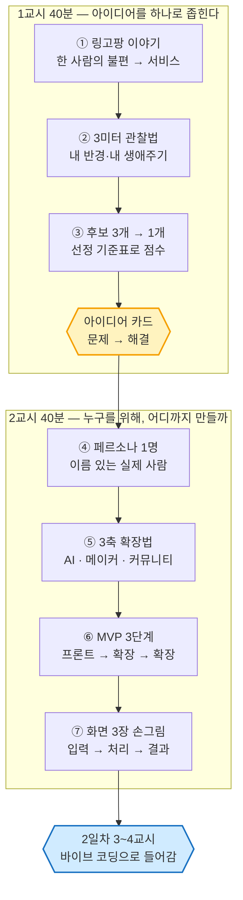
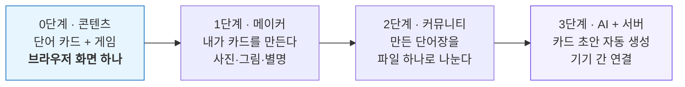
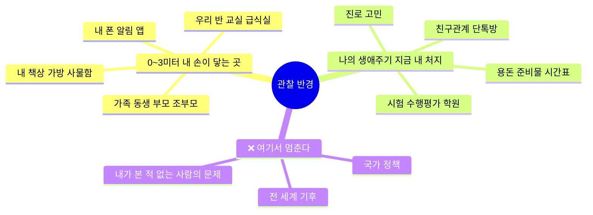
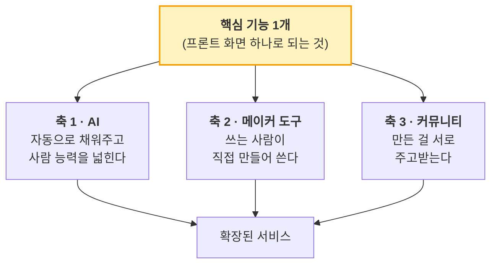
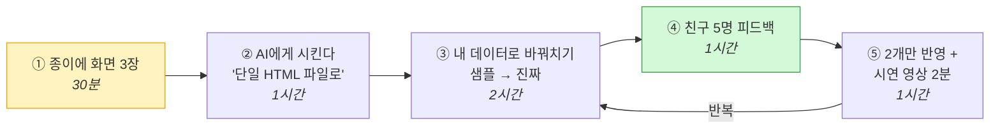

# 2일차 · 1~2교시 — 아이디어를 정하고, 사람과 MVP를 정한다

> **앞 시간까지** 1일차에는 아이디어 회의와 다른 팀·기존 서비스 벤치마킹만 했습니다. **아직 아무것도 정하지 않은 상태**입니다.
> **오늘 끝나면** 팀마다 ① 아이디어 1개(문제 → 해결) ② 페르소나 1명 ③ MVP 1단계 화면 3장이 종이에 남습니다.

| 항목 | 내용 |
|---|---|
| **차시** | 2일차 1교시 40분 + 2교시 40분 (쉬는 시간 10분) |
| **오늘의 한 줄** | **"아이디어는 고르는 게 아니라 좁히는 것이다."** |
| **교사 레퍼런스** | 링고팡(LingoPang) 개발 스토리 — 한 사람의 불편이 앱이 되고, 문화가 되기까지 |
| **오늘의 결과물** | 아이디어 카드 · 페르소나 카드 · MVP 3단계표 · 화면 3장 손그림 |
| **오늘 안 하는 것** | 코딩, 디자인 예쁘게 만들기, 기능 10개 나열하기 |

---

## 0. 오늘의 흐름 한눈에

---

# 1교시 (40분) — 아이디어를 하나로 좁힌다

## 여는 이야기 · 10분 — 링고팡은 이렇게 시작했다

> 교사는 **기능 설명이 아니라 순서**를 이야기합니다. 학생이 가져갈 것은 "좋은 앱이 있더라"가 아니라 **"이 순서로 하면 되는구나"** 입니다.

### ▸ 1단계 — 문제는 관찰에서 나왔다 (아이디어 회의에서 나오지 않았다)

| 장면 | 내용 |
|---|---|
| 관찰한 사람 | 네 살, 여섯 살 두 딸 (**반경 3미터 안**) |
| 관찰한 장면 | 학습 앱을 시켰는데 **화면이 저절로 넘어간다**. 아이는 그림만 보고 정답을 맞힌다 |
| 발견한 진짜 문제 | 다 하고 나면 "공부했다"는 **느낌은 남는데 배운 단어를 말하지 못한다** |
| 한 문장 정의 | **"글자를 읽는데 뜻을 모른다. 하고 있다는 착각이 진짜 학습의 자리를 차지한다."** |

> **학생에게 던질 질문** — "여기서 중요한 건 '한글 앱을 만들자'가 아니에요.
> **'화면이 저절로 넘어가서 생각이 멈춘다'**는 걸 발견한 겁니다. 문제를 이만큼 좁혀야 만들 게 보입니다."

### ▸ 2단계 — 해결을 네 개의 규칙으로 못 박았다

| # | 규칙 | 그래서 만든 것 |
|---|---|---|
| ① | **멈춘다** | 자동으로 넘어가는 화면을 전부 없앰. 답을 넣어야 다음으로 |
| ② | **그림이 아니라 글자를 보게 한다** | 캐릭터·영상 제거, 그림은 정답 단서가 되지 않게 |
| ③ | **고르지 말고 조립한다** | 자모 → 글자 → 낱말 → 문장. 타자로 직접 쳐야 통과 |
| ④ | **순서대로 올라간다** | 자모 → 기초 → 생활문장 → 추상어 → 속담 → 사자성어 |

> **핵심 지도** — 이 네 줄이 곧 **요구사항**입니다. 기능 목록이 아니라 **"우리는 무엇을 하지 않겠다"**가 절반입니다.
> (영상 안 쓴다 / 그림으로 못 맞히게 한다 / 객관식 안 쓴다)

### ▸ 3단계 — 처음엔 "프론트 하나"였다

링고팡은 처음부터 서버도, 로그인도, AI도 없었습니다.

| 단계 | 핵심 질문 | 이 단계를 넘어가는 조건 |
|---|---|---|
| 0 · 프론트 | "**혼자 써봐도 재미있나?**" | 내가 매일 쓰는가 |
| 1 · 메이커 | "**쓰는 사람이 직접 만들 수 있나?**" | 사용자가 자기 카드를 만드는가 |
| 2 · 커뮤니티 | "**만든 걸 남에게 주고 싶나?**" | 누가 시키지 않아도 오가는가 |
| 3 · AI | "**사람 손이 느려서 막히나?**" | 손으로 하다가 지칠 때 |

> **가장 중요한 지도 포인트** — 링고팡은 **AI를 1단계에서 일부러 넣지 않았습니다.**
> 이유: *"사람의 손으로 만드는 경험이 먼저 쌓여야 하기 때문."*
> → 학생에게: **"AI는 시작이 아니라 3번째 확장입니다. 오늘 여러분이 정할 건 0단계입니다."**

---

## 활동 1 · 15분 — 3미터 관찰법으로 후보 3개 뽑기

1일차에 아이디어가 안 정해진 이유는 대개 하나입니다. **범위가 너무 넓어서**입니다.
("환경 문제 해결", "학교를 좋게 만드는 앱" → 오늘 안에 못 만듭니다.)

### ▸ 관찰 반경 규칙

| 규칙 | 이유 |
|---|---|
| **① 반경 3미터** | 사용자가 오늘 당장 옆에 있다 → 테스트가 가능하다 |
| **② 내 생애주기** | 내가 지금 겪는 일이라 **발표에서 진심이 실린다** |
| **③ 관찰은 명사가 아니라 장면으로** | "급식"(X) → "급식 줄에서 앞사람이 다 가져가서 국이 없다"(O) |

> **참고** — 실제 수상작들도 전부 반경 3미터였습니다.
> *딸기 가격 / 점심 메뉴 / 아기 울음소리 / 벌레 물린 자국 / 앱 권한 / 검색 기록*
> 대통령상 받은 발명품이 **"아빠 뱃살이 걱정돼서 만든 기름 걷는 국자"** 였습니다.

### ▸ 관찰 기록지 (10분 · 개인별로 먼저 씁니다)

| # | 언제·어디서 | 누가 | 무엇 때문에 곤란했나 (장면으로) | 지금은 어떻게 버티나 |
|---|---|---|---|---|
| 1 | | | | |
| 2 | | | | |
| 3 | | | | |
| 4 | | | | |
| 5 | | | | |

> 막히면 **아이디어 50선**과 **문제 목록 자료**를 "기출문제"처럼 훑게 합니다.
> 베끼라는 게 아니라 **"아, 이 정도 크기면 되는구나"** 하는 눈금을 얻기 위해서입니다.
> 훑고 나서 반드시 한 줄 붙이게 하세요 — **"우리 반에서는 이게 이렇게 다르다."**

### ▸ 팀으로 모아 후보 3개 (5분)
개인 기록지를 펼쳐 놓고, 팀이 **"이건 내가 오늘 관찰할 수 있다"** 싶은 것 3개만 남깁니다.

---

## 활동 2 · 12분 — 후보 3개를 점수로 1개로 줄인다

감으로 고르면 계속 흔들립니다. **표로 고르면 다시 안 흔들립니다.**

### ▸ 선정 기준표 (각 항목 1~3점 · 총 18점)

| 기준 | 1점 | 2점 | 3점 | 후보 A | 후보 B | 후보 C |
|---|---|---|---|---|---|---|
| **① 사용자가 가까운가** | 본 적 없음 | 아는 사람 | 오늘 5명에게 보여줄 수 있음 | | | |
| **② 내가 직접 겪었나** | 뉴스에서 봄 | 옆에서 봄 | 내가 겪음 | | | |
| **③ 데이터를 구할 수 있나** | 못 구함 | 어렵게 | 내가 2주 기록/설문으로 만들 수 있음 | | | |
| **④ 판정 기준을 한 문장으로 말할 수 있나** | 못 함 | 애매 | "○○면 △△다"로 말 됨 | | | |
| **⑤ 화면 3장으로 줄일 수 있나** | 기능 10개 | 5~6개 | 입력·처리·결과 3장 | | | |
| **⑥ 흔하지 않은 각도인가** | 단순 챗봇·투두앱 | 비슷한 게 많음 | 각도가 다름 | | | |
| **합계** | | | | | | |

> **동점이면** ②번(내가 직접 겪었나)이 높은 쪽을 택합니다. 발표에서 이깁니다.

### ▸ 각도를 트는 치트키 — 흔한 주제도 이렇게 살린다

| 흔한 각도 | 살아나는 각도 |
|---|---|
| 차단한다 | **지연**시킨다 / 되돌아보게 한다 |
| 총량(시간)을 잰다 | **질**을 잰다 / **원인**을 잰다 |
| 점수를 알려준다 | **그다음에 뭘 할지**를 알려준다 |
| 어른이 감시한다 | **본인이 스스로와 약속**한다 |

---

## 정리 · 3분 — 아이디어 카드 (오늘의 첫 결과물)

**[결과물 ①] 아이디어 카드**

| 칸 | 무엇을 쓰나 | 우리 팀 |
|---|---|---|
| **문제 (장면)** | 누가, 언제, 어디서, 무엇 때문에 곤란한가 | |
| **지금의 방법** | 지금은 어떻게 버티고 있나 | |
| **왜 부족한가** | 그 방법의 빈칸 | |
| **해결 (한 줄)** | 우리는 무엇을 보여줘서 그 빈칸을 메우나 | |
| **하지 않을 것 3가지** | 우리가 일부러 안 넣는 기능 | |
| **판정 기준 한 문장** | "○○이면 △△이다" | |

> **완성 문장 틀**
> *"○○한 △△는 □□할 때 ◇◇해서 곤란하다. 지금은 ▽▽로 버티지만 ●●가 안 된다. 우리는 ■■를 보여줘서 해결한다."*
>
> *예) 링고팡 —* 여섯 살 아이는 학습 앱을 할 때 화면이 저절로 넘어가서 생각이 멈춘다. 지금은 그림 보고 정답을 찍지만 단어가 남지 않는다. 우리는 **답을 직접 조립해야만 넘어가는 화면**으로 해결한다.

---

## 🔔 쉬는 시간 10분

---

# 2교시 (40분) — 누구를 위해, 어디까지 만들까

## 활동 3 · 12분 — 페르소나 1명

### ▸ 페르소나는 상상 인물이 아닙니다

> 링고팡의 페르소나는 **대표의 두 딸**이었습니다. 그래서 *"아이가 재미없어하면 그날 저녁에 고치고 다음 날 아침에 반응을 확인"* 할 수 있었습니다.
> 페르소나를 실제 사람으로 잡으면 **오늘 물어볼 수 있습니다.** 상상 인물로 잡으면 발표 때 질문에 무너집니다.

**[결과물 ②] 페르소나 카드**

| 칸 | 내용 |
|---|---|
| **이름 · 나이(학년)** | (실제 아는 사람을 모델로. 별명 가능) |
| **한 줄 소개** | |
| **언제 · 어디서** 우리 문제를 겪나 | |
| **지금 하고 있는 방법** | |
| **그래서 무엇이 아쉬운가** | |
| **진짜로 원하는 것 한 가지** | |
| **이 사람이 우리 걸 어떻게 써줬으면 하나** (사용 바람) | |
| **하루 중 언제 열까 · 몇 분 쓸까** | |

> **핵심 발문 3개**
> 1. "이 사람 이름이 뭐예요? 오늘 쉬는 시간에 물어볼 수 있어요?"
> 2. "이 사람은 **이미** 어떻게든 해결하고 있죠? 그게 왜 부족한가요?"
> 3. "이 사람은 우리 앱을 **하루 중 언제** 열까요? 그 순간에 손에 뭘 들고 있나요?"

> **바람 한 줄 쓰기** — 링고팡의 바람은 *"부모가 옆에 없어도 아이 혼자 끝까지 가는 것"*이었습니다.
> 이 한 줄이 **모든 결정의 심판**이 됩니다. (설명이 길면 → 혼자 못 감 → 뺀다)

---

## 활동 4 · 13분 — 3축 확장법: 아이디어는 이렇게 키운다

> 아이디어가 "너무 작은데요?" 라는 말이 나올 때 꺼내는 카드입니다.
> **작게 시작해서 축으로 키웁니다. 처음부터 크게 잡지 않습니다.**

### ▸ 세 축이 뭘 하는가

| 축 | 한 줄 정의 | 붙이는 질문 | 링고팡의 예 |
|---|---|---|---|
| **① AI** | 사람이 하던 걸 **자동으로 채워주고, 못 하던 걸 하게 한다** | "여기서 손이 제일 오래 걸리는 곳은 어디?" | 카드 글과 그림을 AI가 초안으로 생성 (2단계에서야 도입) |
| **② 메이커 도구** | 정해진 걸 쓰는 게 아니라 **내가 만들어 쓴다** | "우리가 넣은 내용이 떨어지면 사용자가 채울 수 있나?" | 사진 찍어 넣기, 그림 그리기, 나만의 별명 붙이기 ("뿜뿜 아빠") |
| **③ 커뮤니티** | 만든 걸 **주고받고, 잘 만든 게 퍼진다** | "혼자 쓰는 것보다 둘이 쓰면 좋아지는 지점이 있나?" | 단어장을 파일 하나로 내보내 카톡으로 전달, 우수 단어장은 공식 템플릿 |

> **왜 이 순서인가** — 링고팡은 *"콘텐츠 → 문화 → 인프라 → 연합"* 순서로 쌓았습니다.
> 이유는 한 줄입니다: **"콘텐츠가 약하면 만들 사람이 없고, 만드는 사람이 없으면 공유할 게 없다."**
> → **커뮤니티를 먼저 만들면 빈 게시판이 됩니다.**

### ▸ 3축 확장 연습 (5분 · 팀 토의)

| 축 | 우리 아이디어에 붙이면? | 몇 단계에 넣을까 |
|---|---|---|
| AI |  | (1/2/3단계) |
| 메이커 도구 |  | |
| 커뮤니티 |  | |

> **연습 예시 — "급식 잔반 예측기"**
> · 0단계(프론트): 오늘 메뉴 입력 → 우리 반 예상 잔반량 표시
> · 메이커: **학생이 직접 메뉴 카드와 선호 항목을 만든다**
> · 커뮤니티: 우리 반 결과를 **다른 반과 비교**, 급식실에 제출할 리포트 공유
> · AI: 2주치 기록으로 **다음 주 잔반량 예측**
>
> **연습 예시 — "알림 부검 일지"**
> · 0단계: 오늘 받은 알림을 세 칸(필요했다/나중에도 됐다/필요 없었다)으로 분류
> · 메이커: 사용자가 **자기만의 분류 칸을 추가**
> · 커뮤니티: 반 전체 평균과 비교, **"우리 반이 제일 많이 끄는 알림" 순위**
> · AI: 알림 문구를 보고 **자동으로 칸을 추천**

---

## 활동 5 · 10분 — MVP 3단계표

### ▸ MVP = 이것만 있어도 페르소나가 "오, 되네" 하는 최소 덩어리

| 이건 MVP다 | 이건 MVP가 아니다 |
|---|---|
| 화면 3장 (입력 → 처리 → 결과) | 로그인·회원가입 |
| 내 폰·브라우저에 저장 | 서버, 데이터베이스 |
| 내가 손으로 넣은 데이터 20건 | 전국 데이터 연동 |
| 판정 기준 한 문장 | 정확도 99% |
| 예쁘지 않아도 **작동함** | 예쁜데 **안 눌림** |

**[결과물 ③] MVP 3단계표**

| 단계 | 이름 | 무엇이 되나 | **핵심 기술 (무엇으로 만드나)** | 다음 단계로 넘어가는 조건 |
|---|---|---|---|---|
| **1단계** | 프론트 하나 | 입력 → 결과가 화면에 뜬다 | HTML 한 파일 + JS / 브라우저 저장(localStorage) | **내가 3일 연속 써봤다** |
| **2단계** | 메이커 | 사용자가 직접 항목을 만들고 고친다 | 입력 폼 · 저장 · 내보내기(파일) | **친구 5명이 자기 걸 만들었다** |
| **3단계** | 커뮤니티 / AI | 주고받는다 · 자동으로 채운다 | 파일 공유 → (필요해지면) 서버 / AI 호출 | **손으로 하기 힘들어졌다** |

> **핵심 지도** — 3단계는 **오늘 안 만듭니다.** 다만 *"우리는 여기까지 갈 수 있다"*를 적어두면
> 발표의 '발전 가능성' 점수가 여기서 나옵니다. **만든 것은 1단계, 말하는 것은 3단계.**

> **비용 감각 한 줄** — 링고팡이 서버를 0단계에 안 둔 이유: **"서버는 기능을 늘리려고 두는 게 아니라, 나눔을 관리해야 할 때 비로소 필요해진다."**
> 사용자가 없는데 서버부터 만들면 **돈만 나가고 배우는 게 없습니다.**

---

## 활동 6 · 5분 — 화면 3장 손그림 + 바이브 코딩 준비

### ▸ 바이브 코딩 기획 프로세스 (오늘 이해하고, 다음 시간에 실행)

| 단계 | 하는 일 | 자주 하는 실수 |
|---|---|---|
| ① 손그림 | **입력 / 처리 / 결과** 딱 3장 | 화면을 8장 그린다 |
| ② AI에게 요청 | 화면 3장을 문장으로 설명 → 코드 생성 | "좋은 앱 만들어줘"라고 한다 |
| ③ 데이터 교체 | 샘플 데이터를 **내가 모은 진짜 데이터**로 | 샘플 그대로 제출 |
| ④ 피드백 | 친구 5명, 한 줄씩 | 안 물어보고 혼자 고친다 |
| ⑤ 반영·기록 | **2개만** 고치고 전/후 화면 저장 | 전부 고치다 못 끝낸다 |

> **반드시 지킬 것 두 가지**
> 1. **AI가 짜준 코드도 내가 설명할 수 있어야 한다.** 설명 못 하는 줄은 넣지 않습니다. (심사 질문: *"이 데이터 어디서 구했죠?" "정상이 아니라는 기준은 무슨 근거죠?"*)
> 2. **개선 전/후 화면과 손그림 초안 사진을 남긴다.** 이게 "직접 했다"는 증거입니다.

**[결과물 ④] 화면 3장 손그림**

| 화면 | 이름 | 무엇이 보이나 | 무엇을 누르나 |
|---|---|---|---|
| 1 | 입력 | | |
| 2 | 처리·중간 | | |
| 3 | 결과 | | |

---

## 닫는 활동 · 팀별 30초 발표

아래 다섯 문장을 **한 사람이 이어서 소리 내어** 읽습니다. 막히는 문장이 오늘의 숙제입니다.

1. 우리가 본 장면은 ______ 이다.
2. 그래서 ______ (페르소나)가 ______ 할 때 곤란하다.
3. 우리는 ______ 를 보여줘서 해결한다.
4. 1단계로는 화면 ______, ______, ______ 세 장만 만든다.
5. 나중에는 ______ (AI / 메이커 / 커뮤니티) 로 넓힐 수 있다.

---

# 부록 A. 교사용 — 자주 막히는 지점과 대응

| 막히는 지점 | 증상 | 대응 |
|---|---|---|
| 아이디어가 안 정해진다 | 계속 새 아이디어가 나온다 | **점수표로 끝냅니다.** "오늘 1교시 안에 1개"라고 시간을 못 박습니다 |
| 주제가 너무 크다 | "환경", "학교폭력 해결" | "**그중에 오늘 네가 본 장면 하나**만 말해봐" |
| 남의 아이디어를 그대로 | 50선에서 그대로 베낌 | 벌주지 말고 **"우리 반에서는 뭐가 다르지?"** 한 줄만 붙이게 |
| 기능이 10개 | 다 넣고 싶어함 | "1단계에 안 넣는 것"을 쓰게 합니다. 빼는 게 기획입니다 |
| AI부터 넣으려 한다 | "AI로 자동 판별할래요" | 링고팡 1단계 이야기. **"손으로 먼저 되는지 보고, 손이 느려질 때 AI"** |
| 페르소나가 상상 인물 | "20대 직장인" | "오늘 쉬는 시간에 물어볼 수 있는 사람으로 바꿔요" |
| 팀 의견이 갈린다 | 두 개가 남음 | 둘 다 화면 3장 손그림을 그리게 → 그려보면 대개 한쪽이 접힙니다 |

# 부록 B. 준비물

- 관찰 기록지 / 아이디어 카드 / 페르소나 카드 / MVP 3단계표 / 화면 3장 양식 (팀당 각 1부)
- 아이디어 참고 자료 인쇄본 — `바이브코딩_아이디어_50선`, `큰주제_문제목록_아이템찾기`, `청소년_AI창업_아이디어_사례집`
- 포스트잇 3색, 네임펜, A3 용지, 타이머
- 링고팡 화면 캡처 4~5장 (0단계 화면 / 카드 만들기 / 내보내기 / 단계 로드맵)

# 부록 C. 오늘의 산출물 체크리스트

- [ ] 아이디어 카드 — 문제(장면) · 해결 한 줄 · **안 할 것 3가지** · 판정 기준 한 문장
- [ ] 페르소나 카드 — 이름 있는 실제 사람 · 사용 바람 한 줄
- [ ] MVP 3단계표 — 1단계 핵심 기술 · 단계별 넘어가는 조건
- [ ] 화면 3장 손그림 (사진 촬영해 보관 — 실행 흔적 증거)
- [ ] 30초 발표 5문장 채움
