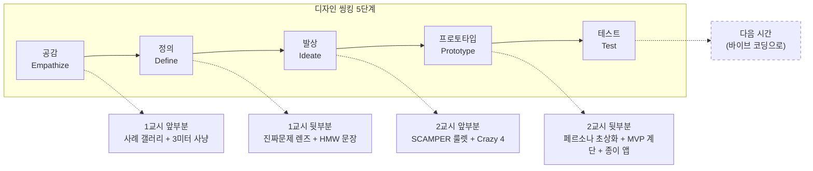

# 2일차 · 1~2교시 — 종이 위의 발명 공방
## 아이디어를 "정하는" 시간이 아니라, 아이디어를 "키우는 법"을 배우는 시간

> **컴퓨터를 켜지 않습니다.** 오늘의 도구는 A4 용지, 네임펜, 포스트잇, 가위뿐입니다.
> **앞 시간까지** — 1일차에는 아이디어 회의와 벤치마킹만 했고, 아직 아무것도 정하지 못했습니다. 괜찮습니다. 오늘 배우는 건 "고르는 법"이 아니라 **"키우는 법"**이기 때문입니다. 키우는 법을 알면 어떤 씨앗이든 고를 수 있게 됩니다.
> **오늘 끝나면** — 책상 위에 ① 아이디어 씨앗 카드 ② 페르소나 초상화 ③ MVP 계단 종이접기 ④ 종이 앱 프로토타입 이 남습니다. 전부 손으로 만든 것입니다.

| 항목 | 내용 |
|---|---|
| **차시** | 2일차 1교시 40분 + 쉬는 시간 10분 + 2교시 40분 |
| **오늘의 한 줄** | **"좋은 아이디어는 떠오르는 게 아니라, 렌즈를 바꿔 끼우면 보이는 것이다."** |
| **수업 방식** | 전 과정 A4·필기. 볼거리(실물 사례 카드)를 먼저 깔고 → 그 위에서 상상 |
| **방법론** | 디자인 씽킹(공감→정의→발상→시제품) 뼈대 + 미네르바식 사고 렌즈 + SCAMPER + Crazy 4 + 종이 프로토타이핑 |
| **교사 레퍼런스** | 링고팡 개발 스토리 (실물 화면 인쇄 카드로 제시) |
| **오늘 안 하는 것** | 코딩 · 검색 · 예쁘게 꾸미기 · "정답" 찾기 |

---

## 0. 오늘의 지도 — 디자인 씽킹의 앞쪽 절반을 종이로 걷는다



### 오늘 쓰는 사고 렌즈 4개 (미네르바식 — 이름을 불러가며 씁니다)

> 미네르바 대학은 생각의 기술마다 **이름표(#태그)**를 붙여 수업 내내 그 이름을 부릅니다.
> 우리도 렌즈 4개에 이름을 붙이고, 교실 벽에 A4로 크게 붙여 둡니다.
> 활동 중 교사는 **"지금 무슨 렌즈 꼈어?"** 하고 계속 묻습니다. 이름을 부르는 순간 기술이 됩니다.

| 렌즈 이름 (벽에 붙일 것) | 무엇을 보는 렌즈인가 | 부르는 질문 |
|---|---|---|
| 🔍 **#진짜문제** | 보이는 불편 뒤에 숨은 진짜 원인 | "그건 증상이야, 병이야?" |
| 🧩 **#쪼개기** | 큰 문제를 자를 수 있는 조각으로 | "이걸 반으로 자르면 뭐랑 뭐야?" |
| 🔄 **#빗대기** | 다른 세계의 해결책을 빌려오기 | "이거랑 닮은 게 어디 또 있지?" |
| 👟 **#신어보기** | 그 사람의 신발을 신고 하루 살기 | "그 사람 눈엔 이게 어떻게 보일까?" |

---

# 1교시 (40분) — 씨앗을 찾고, 진짜 문제로 깎는다
### (디자인 씽킹: 공감 → 정의)

## 활동 1 · 10분 — 볼거리 갤러리: "발명은 이렇게 태어났다"

> **먼저 보여주고, 그다음 상상하게 합니다.** 빈 종이 앞에서 "아이디어 내봐"는 어른에게도 고문입니다.
> 교실 네 벽에 **사례 카드 12장(A4, 부록 D 목록)**을 미리 붙여 둡니다. 학생들은 일어나서 갤러리처럼 돌아봅니다.

### ▸ 갤러리 산책 규칙 (7분)
1. 각자 **포스트잇 3장**을 들고 돕니다.
2. 카드마다 아래 두 줄이 쓰여 있습니다 — **"이 사람이 본 장면"** 과 **"그래서 만든 것"**.
3. 마음에 드는 카드 앞에 포스트잇을 붙이되, 반드시 **한 단어**를 적어 붙입니다: *"나도!"* / *"우리 집도!"* / *"어?"*

### ▸ 갤러리의 핵심 전시물 — 링고팡 4컷 이야기 (교사가 3분 해설)

벽 한 면은 링고팡 실물 화면 인쇄 4장에 이 설명을 답니다.

| 컷 | 장면 | 학생이 가져갈 것 |
|---|---|---|
| **1컷 · 본 것** | 엄마가 여섯 살 딸을 봤다. 학습 앱 화면이 저절로 넘어가고, 아이는 그림만 보고 찍는다 | 발명은 **회의실이 아니라 거실에서** 시작됐다 |
| **2컷 · 깎은 것** | "한글 앱이 필요해"(X) → **"화면이 저절로 넘어가서 생각이 멈춘다"**(O) | 🔍 #진짜문제 렌즈 — 증상이 아니라 병을 찾았다 |
| **3컷 · 처음 만든 것** | 서버도 AI도 없는 **화면 하나**. 답을 조립해야만 넘어가는 카드 | 첫 발명품은 항상 **부끄러울 만큼 작다** |
| **4컷 · 키운 것** | 사진 찍어 내 카드 만들기 → 단어장을 친구 집에 보내기 → AI가 초안 채워주기 | 작게 낳고, **렌즈를 바꿔 끼우며 키웠다** (2교시 예고) |

> **갤러리를 닫는 발문** — "12장 전부 공통점이 있어요. 뭘까요?"
> (기대 답: 전부 **자기 옆 3미터**에서 봤다 / 전부 **장면**이 있다 / 전부 처음엔 작았다)

---

## 활동 2 · 12분 — 씨앗 사냥: 3미터 × 하루 시간표

> 이제 빈 종이가 무섭지 않습니다. 방금 본 12장이 "이 정도 크기면 된다"는 눈금이 되었기 때문입니다.

### ▸ A4 한 장 접기 — "나의 하루 지도" (개인 · 7분)

A4를 **세로로 3칸** 접습니다. 칸마다 하루의 시간대를 적고, **그 시간에 내 3미터 안에서 곤란했던 장면**을 그림+한 줄로 채웁니다.

| 칸 | 시간대 | 사냥 질문 (교사가 소리 내어 읽어줌) |
|---|---|---|
| 1 | 아침 · 등굣길 | "오늘 아침 누가 한숨 쉬었지? 나는 뭘 두고 왔지?" |
| 2 | 학교 · 수업·급식·쉬는 시간 | "줄 서다가, 발표하다가, 물건 빌리다가 — 멈칫한 순간은?" |
| 3 | 방과 후 · 집 | "동생·부모님·할머니가 '아이참' 한 순간은?" |

> **규칙 하나** — 명사 금지, **장면만 허용.**
> "급식" (X) → "국을 앞 사람이 다 가져가서 내 차례엔 건더기가 없었다" (O)
> 장면에는 반드시 **사람**이 들어 있어야 합니다. (👟 #신어보기 렌즈의 재료가 됩니다)

### ▸ 팀 씨앗 고르기 (5분)

세 명의 하루 지도를 책상에 펼치고, **"세 명 중 두 명 이상이 '나도 봤어'라고 말하는 장면**"에 동그라미. 그중 팀이 가장 생생하게 말할 수 있는 **장면 1개**를 고릅니다.

> 못 고르겠으면 — 갤러리에서 "나도!" 포스트잇이 가장 많이 붙은 카드의 **우리 반 버전**으로 시작해도 됩니다. 베끼기가 아닙니다. **"우리 반에서는 뭐가 다른가"** 한 줄을 붙이는 순간 우리 것이 됩니다.

---

## 활동 3 · 15분 — 진짜 문제 깎기: "왜?" 사다리와 HMW 문장

### ▸ 🔍 #진짜문제 렌즈 — "왜?" 사다리 5칸 (7분)

A4를 가로로 놓고 사다리를 그립니다. 맨 아래 칸에 우리 장면을 적고, **"왜?"를 다섯 번** 물으며 위로 올라갑니다.

```
[5] 왜? → ______________________  ← 여기 어딘가에 진짜 문제가 있다
[4] 왜? → ______________________
[3] 왜? → ______________________
[2] 왜? → ______________________
[1] 장면: 동생이 재활용 쓰레기를 아무 통에나 넣었다
```

> **링고팡 시범 (교사가 칠판에)**
> 장면: 아이가 학습 앱을 다 했는데 배운 단어를 말 못 한다
> → 왜? 그림만 보고 찍어서 → 왜? 그림이 정답 힌트라서 → 왜? 화면이 알아서 넘어가서
> → 왜? **멈춰서 생각할 틈이 없어서** ← 링고팡은 여기를 골랐다
>
> **지도 요령** — 사다리 위로 갈수록 "사회가 나빠서" 같은 거대 답이 나옵니다. 그건 **너무 올라간 것**입니다.
> **"우리 손으로 바꿀 수 있는 가장 높은 칸"**에 별표를 치게 하세요. 그게 우리의 진짜 문제입니다.

### ▸ HMW 문장 만들기 (5분) — 문제를 문으로 바꾼다

별표 친 칸을 **"우리가 어떻게 하면 ~할 수 있을까?" (How Might We)** 문장으로 바꿉니다.

| 나쁜 예 | 왜 나쁜가 | 좋은 예 |
|---|---|---|
| 어떻게 하면 환경을 지킬까? | 너무 넓어서 문이 안 보임 | 어떻게 하면 **1학년 동생이 3초 안에** 맞는 통을 찾게 할까? |
| 어떻게 하면 분리수거 로봇을 만들까? | 답을 미리 정해버림 | (위와 동일 — **답이 아니라 상황**을 적는다) |

> HMW 문장의 채점 기준 두 개: **① 사람이 들어 있는가 ② 답이 안 들어 있는가.**

### ▸ 씨앗 카드 완성 (3분) — 1교시의 결과물

**[결과물 ①] 아이디어 씨앗 카드** (A4 절반)

| 칸 | 내용 |
|---|---|
| 우리가 본 장면 (그림 1컷 + 한 줄) | |
| "왜?" 사다리에서 별표 친 칸 | |
| **HMW 문장** — 어떻게 하면 ___가 ___할 수 있을까? | |
| 이 장면을 실제로 본 사람 (팀원 이름) | |

---

## 🔔 쉬는 시간 10분
> 쉬는 시간 미션(선택): 복도에서 만나는 사람 1명에게 우리 장면을 말하고 "너도 그런 적 있어?" 한 마디만 받아 오기. 받아 오면 씨앗 카드 뒷면에 이름을 적습니다. — 오늘 수업의 첫 사용자 조사입니다.

---

# 2교시 (40분) — 씨앗을 백 가지로 틔우고, 종이로 만든다
### (디자인 씽킹: 발상 → 프로토타입)

## 활동 4 · 12분 — SCAMPER 룰렛: 아이디어는 렌즈를 돌리면 쏟아진다

> 1교시가 "하나로 깎기"였다면, 지금부터 10분은 정반대입니다. **양으로 승부합니다.**
> 발상의 제1규칙을 칠판에 적어 둡니다 — **"지금은 판사 금지, 전원 발명가."** (남의 아이디어에 "에이~" 금지. "그리고 또!"만 허용)

### ▸ SCAMPER 주사위 (팀당 1개 · 부록 E 전개도로 미리 제작)

주사위 여섯 면에 여섯 렌즈가 적혀 있습니다. 굴려서 나온 렌즈로 HMW의 답을 냅니다. **2분에 1번씩 굴려 총 4~5회전**, 나온 아이디어는 전부 포스트잇 1장에 1개씩.

| 면 | 렌즈 | 어린이 말 질문 | 링고팡에서 실제 있었던 예 |
|---|---|---|---|
| **S** 바꾸기 | Substitute | "재료를 딴 걸로 바꾸면?" | 영상·캐릭터를 빼고 **글자와 소리**로 바꿈 |
| **C** 합치기 | Combine | "딴 것과 붙이면?" | 공부 + **게임 20종**을 붙임 |
| **A** 빌리기 | Adapt | "다른 데서 잘되는 걸 빌리면?" (🔄 #빗대기) | 오답노트라는 **학교 문화**를 앱에 빌려옴 ("헷갈려요") |
| **M** 키우기/줄이기 | Magnify/Minify | "10배 크게? 10분의 1로 작게?" | 하루 학습을 **15분으로 줄임** |
| **P** 딴 데 쓰기 | Put to other use | "다른 사람·장소에서 쓰면?" | 아이용 카드 도구를 **부모의 교재 복습 도구**로 |
| **E/R** 빼기/뒤집기 | Eliminate/Reverse | "아예 빼면? 순서를 뒤집으면?" | 회원가입·결제를 **아예 뺌** / 소비자를 뒤집어 **제작자**로 |

> **막힌 팀에게 주는 비상 카드** — "분리수거 통에 SCAMPER를 걸면?"
> 바꾸기: 통 대신 **입구 모양**으로 구분(병 모양 구멍엔 병만 들어감) / 합치기: 통+**농구 골대** / 빌리기: 주차장 **빈자리 불빛**을 빌려 "이 통이야" 불 켜기 / 뒤집기: 사람이 통을 찾는 게 아니라 **통이 사람을 부른다**
> — 이 한 세트를 칠판에 보여주면 교실 온도가 바뀝니다.

### ▸ Crazy 4 (4분) — 몸으로 밀어붙이는 마지막 스퍼트

A4를 4칸으로 접습니다. **1칸 1분, 총 4분.** 포스트잇에 쌓인 아이디어 중 각자 최고 1개를 골라, **4가지 다른 모습**으로 그립니다. (말풍선 1개 허용, 글은 최소)
잘 그리기 금지 — 못 그릴수록 설명을 하게 되고, 설명하다가 아이디어가 자랍니다.

---

## 활동 5 · 10분 — 페르소나 초상화: 발명품에 주인을 찾아준다

### ▸ 👟 #신어보기 렌즈 — A4 초상화 그리기

포스트잇 투표(1인 2표)로 **팀 대표 아이디어 1개**를 뽑은 뒤, A4 한가운데에 **우리 발명품을 쓸 그 사람 얼굴**을 크게 그리고 주변에 말풍선 6개를 답니다.

```
        [이름·나이]                    [입버릇 한 마디]
              \                        /
               ●  ← 얼굴 (실제 아는 사람!)
              /                        \
   [언제·어디서 곤란한가]        [지금은 어떻게 버티나]
              \                        /
  [진짜 바라는 것 한 가지]    [우리 발명품을 쓰는 순간의 표정과 한 마디]
```

> **페르소나의 철칙 — 상상 인물 금지.** 링고팡의 페르소나는 개발자의 **네 살, 여섯 살 두 딸**이었습니다. 그래서 저녁에 고치면 다음 날 아침 반응이 왔습니다. "20대 직장인"이라고 쓰는 팀에게: **"오늘 쉬는 시간에 물어볼 수 있는 사람으로 바꾸자."**
>
> **마지막 말풍선이 오늘의 심장입니다.** — "이 사람이 우리 걸 **어떻게 써줬으면** 하나?"
> 링고팡의 답은 *"부모가 옆에 없어도 아이 혼자 끝까지 가면 좋겠다"* 한 줄이었고, 이 한 줄이 이후 **모든 기능의 심판**이 됐습니다. (설명이 길어지는 기능 → 혼자 못 가 → 뺀다)

**[결과물 ②] 페르소나 초상화** — 말풍선 6개가 다 찬 A4 한 장

---

## 활동 6 · 10분 — MVP 계단 접기: 다 만들지 않는 용기

### ▸ A4 계단 접기 (부록 E) — 접으면 4단 계단이 서는 종이

계단의 **1단만 오늘의 약속**이고, 2~4단은 "언젠가의 꿈"입니다. 꿈을 버리라는 게 아니라 **꿈을 계단 위 칸에 보관**하는 것입니다.

| 단 | 이름 | 적을 것 | 링고팡의 계단 |
|---|---|---|---|
| **1단 (맨 아래·제일 크게)** | 심장 | **이것 하나만 되면 페르소나가 "오!" 하는 것** + 핵심 기술 한 줄 | 화면 하나: 답을 조립해야 넘어가는 카드 |
| 2단 | 손 | 쓰는 사람이 **직접 만들 수 있게** 하는 것 (메이커) | 사진 찍어 내 카드 만들기 ("뿜뿜 아빠") |
| 3단 | 다리 | 만든 걸 **주고받게** 하는 것 (커뮤니티) | 단어장 파일을 카톡으로 이웃에 |
| 4단 | 날개 | **자동으로** 채워주는 것 (AI) | 카드 초안을 AI가 생성 |

> **왜 AI가 꼭대기인가** — 링고팡은 AI를 일부러 마지막에 넣었습니다. *"사람 손으로 만드는 경험이 먼저 쌓여야 하기 때문."*
> 학생 버전으로 번역하면: **"손으로 먼저. 손이 아파질 때 AI."**
> 그리고 계단 뒷면에 크게: **"1단 없이 4단 없다."** (커뮤니티부터 만들면 빈 게시판, 서버부터 만들면 돈만 나간다)

**[결과물 ③] MVP 계단** — 책상 위에 세워 두고, 이후 모든 시간에 "지금 몇 단 얘기 중?"을 묻는 도구로 씁니다.

---

## 활동 7 · 8분 — 종이 앱 만들기: 오늘의 피날레

### ▸ 손안의 프로토타입

A4를 8등분으로 잘라 **폰 화면 크기 카드 3장**을 만듭니다. 계단 1단(심장)만을 **입력 → 처리 → 결과** 3화면으로 그립니다. 버튼은 네모, 글자는 큼직하게.

| 화면 | 이름 | 반드시 들어갈 것 |
|---|---|---|
| 1 | 입력 | 페르소나가 **처음 누르는 것 딱 1개** |
| 2 | 처리·중간 | 기다리는 동안 보이는 것 |
| 3 | 결과 | 페르소나의 **"오!"가 터지는 장면** |

### ▸ 종이 시연 (팀별 1분 × 3팀)

한 명이 페르소나 역(초상화의 그 사람이 되어 연기), 한 명이 **컴퓨터 역**(카드를 손가락으로 누르면 다음 카드로 바꿔치기), 한 명이 내레이션. 보는 팀은 박수 대신 **질문 1개**를 선물합니다.

> 이 3장이 다음 시간 바이브 코딩의 **설계도**가 됩니다. AI에게 "좋은 앱 만들어줘"가 아니라 **"이 3장을 화면으로 만들어줘"**라고 말할 수 있게 된 것 — 이게 오늘 종이로 수업한 진짜 이유입니다.

**[결과물 ④] 종이 앱 3장** (사진으로 찍어 보관 — "직접 했다"는 실행 흔적 증거)

---

## 닫는 의식 · 2분 — 다섯 문장 릴레이

팀원 세 명이 번갈아 소리 내어 잇습니다. 막히는 문장이 다음 시간 숙제입니다.

1. 우리가 본 장면은 ______ 이다.
2. "왜?"를 다섯 번 물었더니 진짜 문제는 ______ 였다.
3. 어떻게 하면 ______ 가 ______ 할 수 있을까? 우리 답은 ______ 다.
4. 1단(심장)은 ______ 하나다. 나머지는 계단 위에 보관했다.
5. ______ (페르소나 이름)가 결과 화면을 보고 "______"라고 말하면 성공이다.

---

# 부록 A. 교사용 — 렌즈별 개입 대사집

| 상황 | 끼워줄 렌즈 | 교사의 한 마디 |
|---|---|---|
| "환경을 지키는 앱이요" | 🧩 #쪼개기 | "환경을 반으로 자르면? 또 반으로? **네가 오늘 본 조각**은 어디야?" |
| "그건 이미 있어요" 하며 포기 | 🔄 #빗대기 | "있는 건 베끼는 게 아니라 **빌리는** 거야. 딴 세계에서 뭘 빌려올래?" |
| 해결책부터 외침 ("로봇 만들래요!") | 🔍 #진짜문제 | "잠깐, 그건 답이야. **문제 문장에 답을 넣지 않기** — 사다리 먼저." |
| 페르소나가 흐릿함 | 👟 #신어보기 | "그 사람 어제 저녁에 뭐 했을까? 모르면 — 아직 신발을 안 신은 거야." |
| 아이디어에 서로 "에이~" | (발상 규칙) | "판사봉 내려놔. 지금 법정 아니고 공방이야. '그리고 또!'로만 받자." |
| 다 넣고 싶어함 | (MVP 계단) | "좋아, 버리지 말고 **2단에 보관**하자. 1단은 심장 하나만." |

# 부록 B. 오늘의 방법론이 어디서 왔는가 (교사 배경지식 · 1분 컷)

| 오늘의 활동 | 원형 | 우리 수업식 번역 |
|---|---|---|
| 갤러리 산책 | 뮤지엄 워크 / 사례 기반 발상 | 빈 종이 공포를 없애는 "볼거리 먼저" |
| 왜? 사다리 | 도요타 5 Whys · 디자인 씽킹 Define | "증상 말고 병" — 우리 손 닿는 칸에 별표 |
| HMW 문장 | 스탠퍼드 d.school "How Might We" | 문제를 문(門)으로 바꾸는 문장틀 |
| 렌즈 이름 부르기 | 미네르바 대학 HC(사고 습관 태그) | #진짜문제 #쪼개기 #빗대기 #신어보기 |
| SCAMPER 주사위 | 오스본-에벌 SCAMPER 체크리스트 | 주사위로 강제 렌즈 교체 → 발상의 양 확보 |
| Crazy 4 | 구글 디자인 스프린트 Crazy 8s | 초등 40분 판형으로 8→4칸 축소 |
| 페르소나 초상화 | UX 페르소나 | 상상 금지 · "오늘 물어볼 수 있는 사람" |
| MVP 계단 | 린 스타트업 MVP + 링고팡 4단 로드맵 | "다 만들지 않는 용기" — 꿈은 위 칸에 보관 |
| 종이 앱 시연 | 페이퍼 프로토타이핑 (사람이 컴퓨터 역) | 다음 차시 바이브 코딩의 설계도 |

# 부록 C. 준비물

- **사례 카드 12장** (A4 · 부록 D에서 골라 인쇄, 링고팡 4컷 포함) — 교실 벽 부착용
- **렌즈 포스터 4장** (A4 크게: #진짜문제 #쪼개기 #빗대기 #신어보기)
- SCAMPER 주사위 전개도 (팀당 1) · A4 백지 넉넉히 · 포스트잇 3색 · 네임펜 · 가위 · 풀 · 타이머
- 씨앗 카드·초상화는 별도 양식 없이 **전부 백지 A4에 직접** 그립니다 (양식이 상상을 좁힙니다)

# 부록 D. 사례 카드 12장 목록 ("이 사람이 본 장면" → "만든 것")

1. 기름진 국을 좋아하는 **아빠 뱃살이 걱정**됐다 → 기름 걷는 국자 (대통령상)
2. 폭우 때 **맨홀 뚜껑이 튀어 오르는** 뉴스를 봤다 → 수압 이용 이탈 방지 맨홀 (중1)
3. 동생이 **왜 우는지** 아무도 몰랐다 → 아기 울음 3분류 AI
4. 급식에서 **같은 반찬이 매번 버려진다** → 잔반 예측 투표판
5. 할머니가 키오스크 앞에서 **뒷사람 눈치**를 봤다 → 키오스크 연습장
6. SNS에 올린 사진 속 **명찰이 그대로** 보였다 → 개인정보 자동 가림 앱 (대상)
7. 예전에 **검색했던 걸 다시 못 찾았다** → 검색 이력 도우미
8. 딸기가 **언제 싼지** 아무도 몰랐다 → 딸기 가격 예측 AI
9. 단톡방에서 한 명만 **계속 답을 못 받았다** → 소외 신호 온도계
10. 앱이 **왜 내 위치를** 요구하는지 몰랐다 → 앱 권한 번역기
11. 가방이 **너무 무거운데** 얼마나 무거운지 몰랐다 → 가방 무게 경고 계산기
12. **링고팡 4컷** — 화면이 저절로 넘어가는 학습 앱 → 멈춰서 조립하는 카드 한 화면 → 내가 만드는 카드 → 이웃과 나누는 단어장

# 부록 E. 종이 도구 제작법 (수업 전 5분)

**SCAMPER 주사위** — A4에 십자 전개도(한 칸 6cm)를 그려 S/C/A/M/P/E·R 여섯 면을 적고 접어 풀칠. 시간이 없으면 주사위 대신 **여섯 렌즈를 쪽지로 접어 뽑기**로 대체.

**MVP 계단** — A4를 가로로 놓고 지그재그 4번 접으면 세워지는 계단이 됩니다. 아래 단일수록 접는 폭을 넓게(1단이 제일 큼) — "심장이 제일 커야 한다"를 종이가 몸으로 말해 줍니다.

# 부록 F. 오늘의 산출물 체크리스트

- [ ] 아이디어 씨앗 카드 — 장면 그림 · 별표 친 진짜 문제 · **HMW 문장**
- [ ] 페르소나 초상화 — 실제 인물 · 말풍선 6개 (특히 "어떻게 써줬으면" 한 줄)
- [ ] MVP 계단 — 1단(심장+핵심 기술) 크게, 2~4단(메이커·커뮤니티·AI) 보관
- [ ] 종이 앱 3장 — 입력·처리·결과 + 1분 시연 완료
- [ ] 다섯 문장 릴레이 통과 (막힌 문장 기록)
