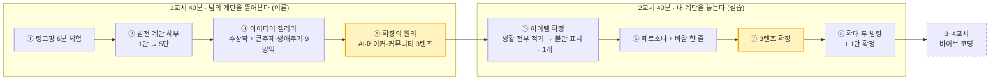
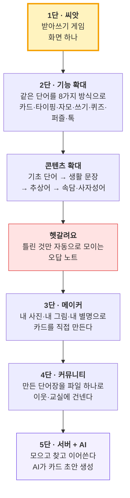
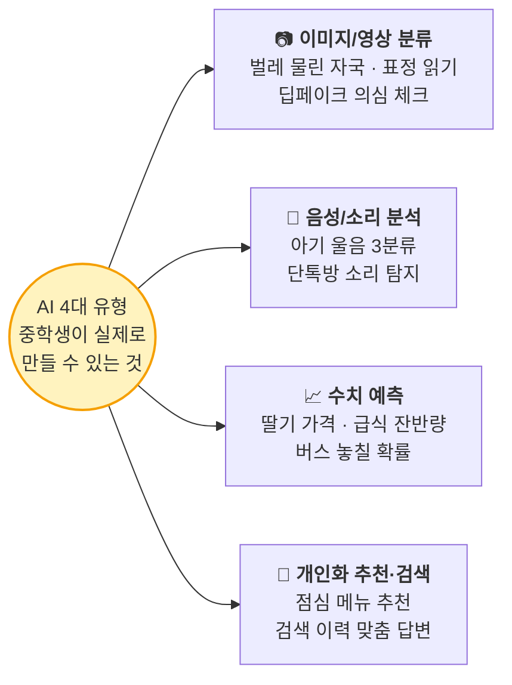
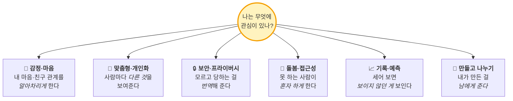
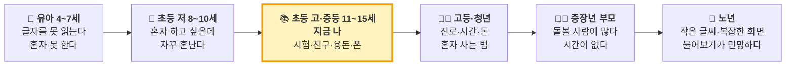
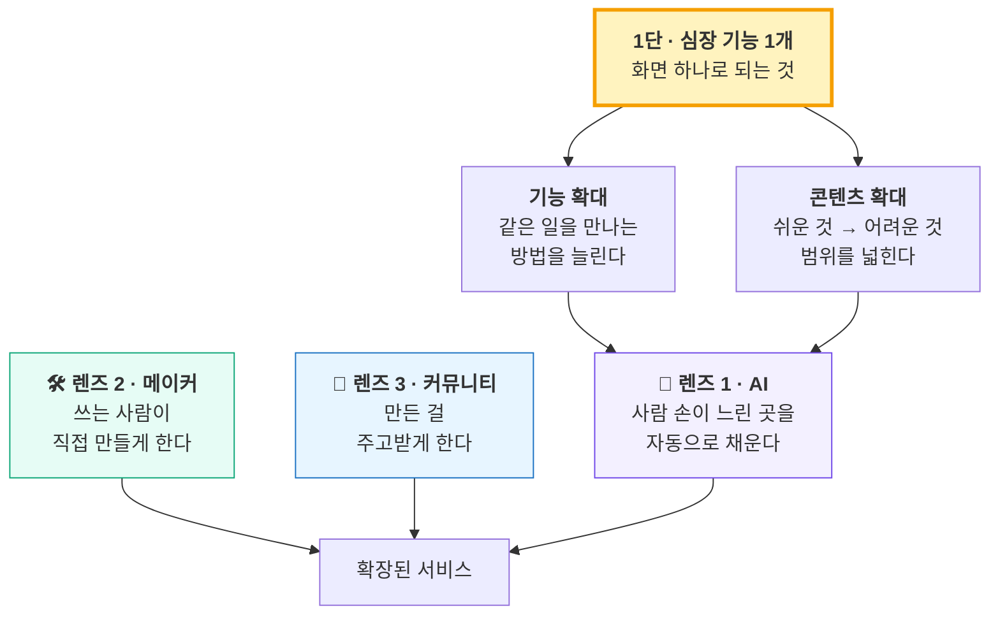

# 2일차 · **1교시** — 아이디어는 어떻게 커지는가 (링고팡 해부 + 아이디어 갤러리)
## 성격: **보여주는 시간** — 교사가 시연하고 해부하고 자료를 깝니다

> **오늘의 한 줄**
> ### 🪜 "하나를 끝내면 힘이 생기고, 그 힘이 다음 계단을 보여준다."

> **앞 시간까지** — 1일차: 아이디어 회의 + 벤치마킹만. 아직 아무것도 못 정했습니다. **정상입니다.**
> **이 시간에 배우는 것** — 아이디어를 *고르는 법*이 아니라, **하나를 골라 계단을 놓아 키우는 법.**
> 키우는 법을 알면 어떤 씨앗을 골라도 됩니다. 그래서 1교시에 **남의 계단(링고팡)을 통째로 뜯어보고**, 2교시에 **내 계단을 놓습니다.**
> **➡️ 이어지는 문서 —** `(수업)-2일차_2교시_워크시트_실습.md`

| 항목 | 내용 |
|---|---|
| **차시** | 2일차 **1교시 40분** (이론·시연) |
| **진행** | ① 링고팡 6분 체험 → ② 계단 해부 14분 → ③ 아이디어 갤러리 14분 → ④ 확장 원리 5분 → 예고 1분 |
| **교구** | **링고팡 체험 기기 팀당 1대(6분만)** · 포스트잇 3색 · 스크린(갤러리 자료) · A3 벽보 |
| **이 시간의 결과물** | 체험 포스트잇 3장 · 계단 해부 노트 · 눈금 체크리스트 3개 · **끌리는 큰 주제/영역 표시** |
| **이 시간에 안 하는 것** | 아이디어 확정 · 코딩 · 종이 워크시트 작성 (**전부 2교시**) |

---

## 0. 이틀째 전체 지도 (1·2교시가 어떻게 이어지나)



**칠판 왼쪽에 수업 내내 고정으로 적어 둘 세 줄**

> 🪜 하나가 되면 → 힘이 생기고 → 다음 계단이 보인다
> 🔧 **손으로 먼저. 손이 아플 때 AI.**
> 🚫 1단 없이 5단 없다

---

# 1교시 (40분) — 링고팡 해부: 아이디어는 이렇게 커진다
### 성격: 교사가 **보여주고 설명하는** 시간

## ⏱ 00:00–06:00 · 활동 ① 링고팡을 직접 6분 써본다

> **왜 앱부터 만져보나 — 학생에게 이렇게 말해 주세요**
> "여러분이 만들 건 **앱**이에요. 그런데 앱을 한 번도 뜯어보지 않고 만드는 건, 요리를 한 번도 안 먹어보고 요리사가 되겠다는 거예요.
> **6분만 써보고, 그다음에 '이게 어떻게 이렇게 됐는지' 이야기를 들을 거예요.** 그 이야기가 오늘 여러분이 쓸 방법입니다."

> 오늘 **기기를 쓰는 유일한 6분**입니다. 팀당 1대, 2~3명이 번갈아. `lingopang.com` (설치·가입·결제 없음)

| 시간 | 미션 | 학생이 하는 일 |
|---|---|---|
| 0~2분 | **받아쓰기 게임** | 한글 시작 → 타이핑으로 단어 3개 완성 |
| 2~4분 | **자모 게임 / 퍼즐** | 자음·모음 끌어다 글자 만들기, 낱말 퍼즐 1판 |
| 4~6분 | **메이커** | 내 카드 1장 만들기 (그림 + 내 별명 붙이기) |

### ▸ 체험 직후 포스트잇 3장 (기기 덮고 30초 안에)

| 색 | 적을 것 | 나중에 어디에 쓰나 |
|---|---|---|
| 노랑 | **"재밌었던 것 딱 한 가지"** | 활동 ②에서 "그게 몇 단이었나" 확인 |
| 파랑 | **"이건 왜 이렇게 만들었을까?"** | 활동 ②에서 교사가 하나씩 답해 줌 |
| 분홍 | **"내가 만들면 여기를 바꾸겠다"** | 활동 ④에서 **"그건 몇 단 이야기일까?"**로 재사용 |

> **교사가 미리 알고 있으면 좋은 답** — 파랑에는 거의 항상 이 셋이 나옵니다.
> *"왜 캐릭터가 없지?" "왜 정답 보기가 없지?" "왜 공짜지?"* → **셋 다 일부러 그렇게 만든 것**입니다. 활동 ② 해부에서 하나씩 답해 주면 학생이 놀랍니다.

> **연결 대사** — "지금 만진 건 **완성된 앱**이에요. 처음부터 이렇게 컸을까요?
> **아니요. 처음엔 화면 딱 하나였어요.** 지금부터 그 계단을 뜯어볼게요."

---

## ⏱ 06:00–20:00 · 활동 ② 링고팡 발전 계단 해부 (오늘의 심장)

> **왜 남의 계단을 14분이나 뜯어보나**
> "오늘 여러분이 제일 많이 할 말은 **'뭐 만들지 모르겠어요'**예요. 아이디어가 없어서가 아니라, **아이디어가 어떻게 커지는지를 본 적이 없어서**예요.
> 링고팡은 단어 3만 개짜리 큰 앱인데 처음엔 **화면 하나**였어요. 그 길을 통째로 볼 거예요. 길을 한 번 보면 **여러분 아이디어에도 같은 길을 깔 수 있어요.**"
>
> **교사용 속마음** — 초등·중등 학생이 기획에서 무너지는 지점은 "내 아이디어가 작아서 부끄럽다"입니다.
> 큰 서비스도 1단은 초라했다는 걸 **구체적 사실로** 보여주면 그 부끄러움이 사라집니다. **이게 오늘의 정서적 목표입니다.**

### ▸ 계단 전체도 (A3로 그려 교실 뒤 벽에 붙이고, 수업 내내 손가락으로 가리킵니다)



> **한 칸마다 반드시 세 가지를 소리 내어 말합니다**
> **㉮ 무엇이 됐나(결과) → ㉯ 그래서 무슨 힘이 생겼나 → ㉰ 그 힘이 보여준 다음 칸.**
> 이 세 줄이 오늘 수업의 문법입니다. 2교시 실습에서 학생이 똑같이 따라 씁니다.

---

### 🪜 1단 — 씨앗 : "받아쓰기 화면 하나" (3분)

| 항목 | 내용 |
|---|---|
| **본 장면** | 좋은 학습지·앱을 수십만 원어치 샀는데, 몇 주 뒤 아이가 **배운 단어를 기억 못 한다** |
| **깎은 진짜 문제** | "한글 앱이 필요해"(X) → **"보기 중에 고르면 몰라도 맞는다. 손으로 써야 진짜 안다"**(O) |
| **만든 것 (딱 하나)** | 글자 중심 **받아쓰기 화면 하나**. 그림 힌트 없이 음절을 직접 쳐야 넘어감 |
| ㉮ 결과 | 우리 집 아이가 **혼자 끝까지 갔다** |
| ㉯ 생긴 힘 | *"어? 되네."* — **확신 1개** |
| ㉰ 보인 다음 칸 | 같은 게임만 하니 **3일 만에 질린다** → 만나는 방법을 늘리자 |

> **'화면 하나'가 구체적으로 뭐였나 — 칠판에 3줄로**
> ① 그림 없이 **"고양이"** 글자와 스피커 버튼만 → ② 아이가 **고 · 양 · 이**를 직접 친다 → ③ 맞으면 다음, 틀리면 힌트 한 글자.
> **끝입니다.** 점수판도, 로그인도, 캐릭터도 없었습니다.
>
> **왜 효과가 있었나** — 보기에서 고르는 문제는 **몰라도 맞습니다.** 직접 치는 문제는 **알아야만 맞습니다.**
>
> **학생에게 되묻기** — "여러분 아이디어에서 **'고르기'에 해당하는 건 뭐고, '직접 하기'에 해당하는 건 뭘까요?**"

---

### 🪜 2단 — 기능 확대 : "기능을 늘린 게 아니라 **만나는 방법**을 늘렸다" (2.5분)

| 항목 | 내용 |
|---|---|
| 왜 올라갔나 | 게임 하나로는 **반복이 지겹다.** 그런데 어휘는 반복해야 남는다 |
| 만든 것 | ① 낱말카드 ② 타이핑 ③ 자모 조합 ④ 쓰기(획순) ⑤ 주관식 퀴즈 ⑥ 낱말 퍼즐 ⑦ 톡 대화 ⑧ 메이커 |
| 숨은 설계 | **5일 사이클** — 1~3일 연습 / 4일 복습(퀴즈·퍼즐) / 5일 **응용(문장·말하기)** |
| ㉮ 결과 | 같은 단어를 만나도 **매번 새 놀이**. "한 번만 더!"가 나옴 |
| ㉯ 생긴 힘 | 아이가 **매일 연다** = 습관 |
| ㉰ 보인 다음 칸 | 게임이 8개가 되니 **넣을 단어가 모자란다** → 콘텐츠를 늘리자 |

> **'고양이' 한 단어가 하루에 만나는 8가지 방법 (칠판에 순서대로)**
> 본다 → 친다 → 조립한다 → 따라 그린다 → 답을 쓴다 → 찾아낸다 → 써먹는다 → 내가 만든다
>
> **왜 이렇게까지 하나** — 사람은 하루만 지나도 배운 것의 약 60%를 잊습니다. 그래서 5일 묶음으로 설계했습니다.
> 핵심은 **5일차(응용)** 입니다. *"안다"와 "쓸 수 있다"는 다릅니다.*
>
> **🎯 우리 수업으로 번역 (2교시에 그대로 씁니다)**
> "여러분 앱에서 **사용자가 같은 일을 또 하고 싶어지게** 하려면? **기능을 늘리지 말고 만나는 방법을 늘리세요.**
> 예) 기분 기록 앱 → 숫자로 / 색으로 / 얼굴 그림으로 / 주간 그래프로 — 네 가지 방법, 같은 하나의 일."

---

### 🪜 콘텐츠 확대 — 옆으로 뻗은 계단 : "쉬운 것 → 어려운 것" (1.5분)

| 단계 | 한글 | 영어 |
|---|---|---|
| 0~1 | 자모·한글 첫걸음 / 기본 단어 | ABC·파닉스 / My First Words |
| 2~3 | 생활 단어 → **생활 문장** | Daily Words → Sentences |
| 4~5 | **속담 · 사자성어**(추상어·한자) | Kids Talk → Everyday English |
| 6~7 | — | Travel Talk → Quotes & Proverbs |

> 결과: 한글 15,000+ · 영어 20,000+ = **3만 개 이상.** ㉯ 생긴 힘 = **"이 앱 하나로 4세부터 9세까지 간다"는 범위.**
> ㉰ 보인 다음 칸 = 3만 개를 **다 반복하면 죽는다.** 틀린 것만 다시 만나야 한다.
>
> **왜 이 순서가 중요한가** — 대부분의 유아 앱은 **사물 이름(사과, 고양이)에서 끝납니다.** 그림으로 그릴 수 있으니까요.
> 그런데 교과서에서 아이를 무너뜨리는 건 **그림으로 못 그리는 말**입니다 — *"억울하다", "직각", "이등변".*
> 링고팡은 일부러 여기를 팠습니다. 속담·사자성어는 외우게 하지 않고 **유래를 그림으로** 보여줍니다. 이야기가 붙으면 외워집니다.
>
> **🎯 우리 수업으로 번역** — "여러분 아이디어에도 **쉬운 버전과 어려운 버전**이 있어요.
> 예) 기분 기록 → 1단계 '좋다/나쁘다' → 2단계 '설렌다/서운하다/억울하다'. **처음엔 쉬운 것만, 어려운 건 위 칸에 보관.**"

---

### 🪜 헷갈려요 — 앞 계단의 부작용이 낳은 발명 (2분)

| 항목 | 내용 |
|---|---|
| 문제 | 대부분의 앱은 **전부를 처음부터** 반복시킨다 → 아는 것까지 또 한다 |
| 만든 것 | 틀린 단어가 **자동으로 "헷갈려요"에 쌓임** → 힌트 → 두 번째 기회 → 목록 적립 → 다시 맞히면 조용히 빠짐 |
| ㉮ 결과 | 아이가 **"내가 무엇을 모르는지"를 눈으로 본다** (메타인지) |
| ㉯ 생긴 힘 | 같은 앱인데 **아이마다 다른 목록** = 개인화 |
| ㉰ 보인 다음 칸 | 내 약점 목록이 생기니 **"이 단어는 내 방식으로 만들고 싶다"** → 메이커 |

> **교사 대사 (오늘 가장 중요한 한 줄)**
> "오답 노트는 회의에서 나온 게 아니에요. **콘텐츠가 커져서 생긴 문제를 푸는 과정에서 태어났어요.**
> **좋은 기능은 회의에서 나오지 않고, 앞 계단의 부작용에서 나옵니다.**"
>
> **🎯 우리 수업으로 번역 (강력한 아이디어 씨앗)** — "여러분 앱에서 **'틀린 것·못한 것·안 한 것'만 따로 모으면** 어떻게 될까요?
> 준비물 앱 → 자주 빠뜨리는 것만 / 물 마시기 → 못 채운 날만 / 영어 → 매번 틀리는 단어만."

---

### 🪜 3단 — 메이커 : "쓰는 사람이 만드는 사람이 된다" (2분)

| 항목 | 내용 |
|---|---|
| 왜 올라갔나 | 회사가 아무리 많이 넣어도 **오늘 학습지에서 틀린 그 단어**는 없다 |
| 만든 것 | 내 사진 · 내 그림 · 내 문장 · 내 별명으로 카드 만들기 |
| ㉮ 결과 | **콘텐츠가 무한**해짐 (사용자가 만드니까) |
| ㉯ 생긴 힘 | **애착** — 내가 만든 건 남에게 보여주고 싶다 |
| ㉰ 보인 다음 칸 | 보여주고 싶어졌으니 → **나눌 길**을 만들자 |

> **"뿜뿜 아빠" 이야기 — 이 한 장면이 제일 잘 먹힙니다**
> 아이가 아빠 사진을 찍어 카드에 넣고 이름을 **"뿜뿜 아빠"**라고 붙였습니다.
> 교과서의 "아빠"는 며칠 뒤 잊습니다. **웃으면서 자기가 지은 "뿜뿜 아빠"는 안 잊습니다.**
> 이유 둘 — ① **내가 만든 것**이라서 ② **감정이 붙어서.**
>
> **왜 글자를 골랐나** — 영상·캐릭터는 무거워서 **사용자가 못 만듭니다.** 글자는 카드 한 장이 텍스트 몇 줄이라 아이도 만듭니다.
> → **"내가 고른 재료가, 나중에 사용자도 만들 수 있는 재료인가?"**
>
> **🎯 우리 수업으로 번역** — "우리 앱에서 사용자가 **자기 이름·자기 사진·자기 말**을 넣을 칸은 어디예요? **딱 한 칸만** 만든다면?"

---

### 🪜 4단 — 커뮤니티 : "파일 하나로 옆집에" (1.5분)

| 항목 | 내용 |
|---|---|
| 만든 것 | 만든 단어장을 **파일 하나로 내보내기** → 카톡·메일로 전달 → 받은 집에서 바로 게임에 등장, 수정 가능 |
| 회사가 먼저 한 일 | **채워진 템플릿 단어장을 매주 배포.** "만들어 보세요"만 하면 아무도 안 만듦 |
| ㉮ 결과 | **서버 없이도** 사람 손을 타고 콘텐츠가 흐름 |
| ㉯ 생긴 힘 | 회사가 안 만든 주에도 **사용자끼리 오간다** = 문화의 시작 |
| ㉰ 보인 다음 칸 | 오가는 게 많아지니 **어디 보관? 어떻게 찾지? 중복은?** → 서버가 필요해짐 |

> **왜 "빈 종이"가 아니라 "채워진 단어장"을 줬나 — 오늘 수업에도 그대로 씁니다**
> 처음부터 "만들어 보세요"라고 하면 **아무도 안 만듭니다.** 그래서 **완성된 템플릿**을 먼저 뿌렸고, 사람들은 **한 줄만 고치는 것**으로 시작했습니다.
> 잘 만든 단어장은 **다음 달 공식 템플릿**이 됐습니다.
> **학생에게** — "선생님도 지금 여러분한테 **채워진 걸 먼저 보여주고** 있는 거예요. 이게 링고팡이 쓴 방법이에요."

---

### 🪜 5단 — 서버 + AI : "왜 AI가 맨 마지막인가" (1.5분 · 반드시 시간 지킬 것)

| 항목 | 내용 |
|---|---|
| 왜 이제야 | **"서버는 기능을 늘리려고 두는 게 아니라, 나눔을 관리해야 할 때 비로소 필요해진다."** |
| 만든 것 | 보관·검색·중복 정리·기기 바꿔도 이어지는 기록 / **AI가 카드 초안(글·그림) 생성** |
| 왜 AI가 마지막 | 1단계에선 **일부러 AI를 안 넣음** — *"사람의 손으로 만드는 경험이 먼저 쌓여야 하기 때문"* |

> **돈 이야기로 하면 확 이해합니다**
> 서버가 없으면 사용자가 1명이든 10만 명이든 **추가 비용이 거의 0원.** 링고팡은 도메인·등록비 다 합쳐 **월 10만 원 정도**로 버텼고 광고만으로 이익이 났습니다.
> 보통 앱은 사람이 늘면 서버비도 늘어 **잘 될수록 손해**가 되기 쉬운데, 링고팡은 반대였습니다.
>
> **AI도 공짜가 아닙니다** — 그림 한 장, 문장 한 줄마다 **실제로 돈이 나갑니다.** 그래서 *공부 내용은 끝까지 무료, 돈 드는 AI 도구만 쓴 만큼 결제*로 설계했습니다.
> **학생에게** — "**AI를 넣자는 말은 돈을 쓰자는 말**이기도 해요. 손으로 해보고, 정말 손이 아플 때 넣는 겁니다."

> **칠판에 크게 · 오늘의 결론**
> 🚫 **커뮤니티부터** 만들면 → **빈 게시판**
> 🚫 **서버부터** 만들면 → **돈만 나감**
> 🚫 **AI부터** 넣으면 → **손으로 해본 적이 없어 뭘 자동화할지 모름**
> ✅ **1단 없이 5단 없다.**

---

## ⏱ 20:00–34:00 · 활동 ③ 아이디어 갤러리 — "또래는 **뭘로** 상을 받았나 / 우리는 **뭘 만들 수 있나**" (14분)

> **왜 여기서 자료를 보여주나 — 순서가 중요합니다**
> 링고팡은 **어른이 5년에 걸쳐 키운 것**입니다. 학생은 이걸 보고 *"나는 저렇게 못 해"*로 끝날 수 있습니다.
> 그래서 바로 이어서 **또래가 실제로 상 받은 아이템**을 보여줍니다. 목적은 딱 하나 —
> ### 📏 **"아, 이 정도 크기면 되는구나"는 눈금을 얻는 것.**
> 베끼라는 게 아닙니다. **빈 종이 앞의 공포를 없애는 것**입니다. (링고팡이 "채워진 템플릿 단어장"을 먼저 뿌린 것과 **똑같은 방법**입니다. 학생에게 이걸 밝혀 주세요.)

> **자료** — `청소년_AI창업_아이디어_사례집` · `바이브코딩_아이디어_50선` · **LG AI 캠프 아이템 선정 가이드 인포그래픽**(스크린에 띄우고 진행)

### ▸ 1) 심사위원은 실제로 뭘 보나 (1.5분 · 스크린)

| 대회 | 최상위 배점 축 |
|---|---|
| 디미고 창업아이디어 | 문제발견 / 창의성 / 구체성 / **실행 흔적** / 사업화 — **동점이면 실행 흔적 1순위** |
| LG AI 청소년 캠프 | AI 관심 / **문제의 참신성** / 협업 / 열정 |
| 한국코드페어 | 사회현안 해결 + **소스코드·연구데이터 제출** |

> ### 💡 결론 한 줄 (칠판에 크게)
> **"아이디어의 크기가 아니라 '내가 직접 만들어봤다는 증거'가 점수다."**
>
> **교사 대사** — "그래서 오늘 그리는 종이, 다음 시간에 만드는 화면, 친구 5명 피드백 — **그게 전부 점수예요.**
> 아이디어만 멋있는 지원자는 이걸 못 냅니다. 우리는 **작동하는 화면 + 시연 영상 + 사용자 5명 피드백**을 이틀 안에 만들 수 있어요."

### ▸ 2) 또래의 실제 수상 아이템 (2.5분 · 소리 내어 읽어주기)

| 어디서 | 아이템 | 무엇이 포인트였나 |
|---|---|---|
| LG AI 캠프 3기 | **앱 권한 위험도 판별** · **검색 이력 맞춤 답변** | 내 폰 안의 문제 |
| LG AI 캠프 2기 | **딸기 가격 예측** · **아기 울음소리 해석** · **점심 메뉴 추천** | 데이터 구하기 쉬운 주제 |
| LG AI 캠프 1기 | **벌레 물린 자국 인식** · **표정 읽어주는 의사소통 보조** | 이미지 분류 한 가지로 끝 |
| 삼성 주니어 SW 대상 | **데이터텍티브** — SNS 사진 속 개인정보 자동 가림 | 디지털 안전 계열 = 중등부 단골 수상 |
| 학생발명전시회 대통령상 | **기름 걷는 국자** — *"아빠 뱃살이 걱정돼서"* | **동기가 개인적일수록 강하다** |
| 학생발명전시회 대통령상 | **뚜껑 이탈 방지 맨홀** (중1) | 뉴스에서 본 사고 |

> ### 🎯 여기서 반드시 짚어줄 3가지
> **① 주제가 작다.** "기후 위기 해결"이 아니라 **딸기 가격 · 점심 메뉴 · 벌레 물린 자국**입니다.
> **② 전부 반경 3미터다.** 동생 울음 · 급식 · 앱 권한 · 내 검색 기록 · 아빠 뱃살.
> **③ "기준"을 스스로 정했다.** 포스터 심사 질문이 이거였습니다 —
> *"이 데이터는 어디서 구했죠?" "정상이 아니라는 기준은 무슨 근거죠?"*
> → **2교시 아이템 카드에 "판정 기준 한 문장"을 쓰는 이유가 정확히 이것입니다.**

### ▸ 3) AI는 결국 네 가지로 수렴한다 (1.5분 · 인포그래픽 그대로)



| 주제 분야 TIER | 왜 이 등급인가 | 예 |
|---|---|---|
| 🥇 **TIER 1 · 디지털 안전·프라이버시** | 중등부 **상위 수상의 단골**. 심사에서 가장 잘 먹힘 | 앱 권한 번역기 · SNS 사진 개인정보 가림 · 단톡방 소외 온도계 |
| 🥈 **TIER 2 · 학교생활·교육** | 사용자가 **바로 옆에** 있어 테스트가 쉬움 | 급식 잔반 투표 · 수행평가 대시보드 · 교과 어휘 카드 |
| 🥉 **TIER 3 · 가족·돌봄·안전** | **개인적 동기**가 발표에서 진심으로 전달됨 | 키오스크 연습장 · 거북목 알림 · 반려동물 이상행동 일지 |

> **"그럼 TIER 3은 나쁜 건가요?"** → 아닙니다. **대통령상이 TIER 3(아빠 뱃살)에서 나왔습니다.**
> TIER는 **안전한 순서**일 뿐, **잘 만든 것이 이깁니다.**

### ▸ 4) 아이템 '눈금' 체크리스트 3개 — 2교시에 그대로 씁니다 (1.5분)

| # | 질문 | 통과 기준 |
|---|---|---|
| ① | **내 주변 3m 이내의 '진짜' 문제인가?** | "기후 위기" ❌ / "우리 반 급식 잔반" ⭕ — 내가 직접 관찰하고 **숫자로 셀 수 있어야** 합니다 |
| ② | **AI가 아니면 안 되는 이유가 있는가?** | 단순 규칙(if-then)으로 되면 **AI가 필요 없습니다.** 이미지·패턴·예측처럼 **배워야 하는 영역**이어야 합니다 |
| ③ | **데이터를 스스로 만들거나 구할 수 있는가?** | **2주간의 기록 / 30명 설문 / 공공 API** — 직접 증거를 확보할 수 있는 아이템이 높은 점수 |

> ### ⚠️ 여기서 1교시 전체가 하나로 묶입니다 (꼭 말해 주세요)
> "②번 보세요. **'AI가 아니면 안 되는 이유'**를 물어요. 그런데 그 이유를 어떻게 알까요?
> **손으로 먼저 해봐야 압니다.** 링고팡이 AI를 5단에 둔 이유가 바로 이거예요.
> 손으로 목록 20개를 만들어 본 사람만 *'여기가 손이 제일 오래 걸리네, 여기를 AI로'*라고 말할 수 있어요.
> **AI부터 넣으면 ②번 질문에 답을 못 합니다.**"

### ▸ 5) **영역별 바이브 코딩 아이디어 카탈로그** — 9개 영역 한 바퀴 (6분 · 오늘 자료의 핵심)

> **이 6분을 어떻게 쓰나 (교사 진행법)**
> 영역 하나에 **40초씩**. 교사는 **영역 이름 → 공통 패턴 한 줄 → 아이디어 2~3개만 소리 내어** 읽고 넘어갑니다.
> **전부 읽으려 하지 마세요.** 목적은 소개가 아니라 **"아, 이런 것도 되는구나"의 문이 9개 열리는 것**입니다.
> 인쇄본은 팀당 1부씩 나눠 주고, **2교시 씨앗 사냥이 막힐 때만** 다시 꺼냅니다.
>
> **읽는 방식 (반드시 이 틀로)** — 표의 세 칸을 **한 호흡에** 읽습니다.
> ### 📖 **"이런 장면이 있었고 → 1단은 이것 하나고 → 나중에 이렇게 커진다."**
> 이게 오늘 1교시 내내 쓴 그 문법(㉮㉯㉰)입니다. 아이디어를 **계단째로** 보여주는 겁니다.

> **표 읽는 법**
> · **[1단] 심장 하나** = 오늘 종이에 그리고 다음 시간에 만들 **딱 그것.** 화면 3장 안에 들어갑니다.
> · **커지는 길** = 2교시에 3렌즈로 확장할 때 참고할 힌트. 🛠 메이커 / 🤝 커뮤니티 / 🤖 AI 로 표시.
> · 🥇🥈🥉 = 1교시에서 본 **TIER**. ⭐ = 데이터 구하기가 특히 쉬운 것.

---

#### 🎯 먼저 — **큰 주제 6개**: "너는 무엇에 관심이 있니?"

> **왜 큰 주제를 먼저 보여주나** — 63개 아이디어를 그냥 쫙 보여주면 학생은 **고르기만 하다 끝납니다.**
> 그래서 **관심사부터** 묻습니다. *"너 요즘 뭐에 관심 있어?"* 에 답할 수 있는 학생은 **아이디어도 고를 수 있습니다.**
> 2교시 첫 2분에 팀은 **이 6개 중 하나**를 먼저 고르고 시작합니다. 영역 9개는 그다음입니다.



| 큰 주제 | 이 주제의 **한 줄 질문** | 이 주제가 강한 이유 | 링고팡은 여기서 뭘 했나 | 관련 영역 |
|---|---|---|---|---|
| 💛 **감정·마음** | "이 사람은 **지금 무슨 기분**인지 본인도 모른다. 어떻게 보여줄까?" | 또래가 가장 공감한다. 발표에서 진심이 실린다 | *"아이가 재미없어하면 그날 저녁에 고쳤다"* — 감정을 신호로 썼다 | 6 · 1 |
| 🎯 **맞춤형·개인화** | "**사람마다 다른 것**을 보여주려면 무엇을 기억해야 할까?" | **AI 4대 유형 중 '추천·개인화'** 와 바로 연결된다 | **"헷갈려요"** — 같은 앱인데 **아이마다 다른 목록** | 2 · 8 |
| 🔒 **보안·프라이버시** | "**어른도 잘 모르는 것**을 우리가 어떻게 번역해 줄까?" | 🥇 **TIER 1.** 중등부 대상·최우수가 몇 년째 여기서 나온다 | 개인 사진·그림을 **기기 안에만** 저장 (서버에 안 보냄) | 3 |
| 🤝 **돌봄·접근성** | "이 사람이 **혼자 끝까지** 가려면 뭐가 있어야 할까?" | 🥉 대통령상이 나온 영역. 개인적 동기가 무기 | *"부모가 없어도 아이 혼자 끝까지"* → **모든 화면에 음성(TTS)** | 4 · 5 |
| 📈 **기록·예측** | "**2주만 세어 보면** 뭐가 보일까?" | 숫자가 나오면 심사 질문에 강하다 | **5일 사이클** — 언제 복습할지를 기록으로 정했다 | 8 · 1 |
| 🎨 **만들고 나누기** | "사용자가 **자기 것을 만들** 칸은 어디일까?" | 🛠 메이커·🤝 커뮤니티가 **1단부터** 심장이 된다 | **메이커("뿜뿜 아빠") → 단어장 나눔** | 9 · 2 |

> ### 🗣 교사 대사 (여기서 학생 마음이 정해집니다)
> "지금부터 63개를 보여줄 건데, **다 기억할 필요 없어요.**
> 대신 이 **6개 중에 내 심장이 뛰는 거 하나**만 찍어 두세요.
> 2교시 시작하자마자 **'우리 팀은 이 주제다'** 부터 정하고 들어갑니다. 주제가 정해지면 아이디어는 훨씬 쉽게 나옵니다."

> **큰 주제 × 영역 = 아이디어** — 이 곱셈이 오늘의 발상 공식입니다.
> 예) 💛 감정 × 영역 1(학교생활) = *"발표할 때 떨리는 걸 나만 아는 신호로 기록하기"*
> 예) 🎯 맞춤형 × 영역 7(환경) = *"우리 집에서 제일 자주 틀리는 분리수거만 모아 보여주기"*

---

#### ⏳ 그리고 — **생애주기로 본다** (관심사를 정했으면, 다음은 "누구의 인생 어느 지점인가")

> **큰 주제가 "무엇에 관심 있나"라면, 생애주기는 "누구의, 인생 어느 지점의 문제인가"입니다.**
> 이 축이 빠지면 아이디어가 **"모두를 위한 앱"**이 되고, 모두를 위한 앱은 **아무도 안 씁니다.**
> 링고팡이 강했던 이유가 정확히 이것입니다 — **4~9세**라고 못 박았습니다. 그래서 *"글자를 못 읽는 네 살도 혼자"* 라는 기준이 나왔고, **모든 화면의 음성(TTS)**이 나왔습니다.



| 생애주기 | 이 시기의 **대표 불편** | 이 시기를 고르면 생기는 **설계 규칙** | 이 카탈로그의 예 |
|---|---|---|---|
| 👶 **유아 4~7세** | 글자를 못 읽는다 · 혼자 끝까지 못 간다 | **글자 대신 색·그림·소리.** 설명이 길면 탈락 | 분리수거 도우미(47) · 낱말 카드 공장(59) |
| 🎒 **초등 저 8~10세** | 혼자 하고 싶은데 **틀리면 혼난다** | **혼나지 않고 3초 안에.** 실패해도 되는 화면 | 분리수거(47) · 심부름 카드(30) · 약 체크(26) |
| 📚 **초등 고·중등 11~15세<br/>← 지금 나** | 시험·수행평가 · 친구 관계 · 용돈 · 폰 | **내가 사용자다.** 오늘 바로 테스트 가능 | 영역 1·2·3·6 거의 전부 |
| 🧑‍🎓 **고등·청년** | 진로 · 시간 관리 · 처음 겪는 일들 | 내가 **아직 안 겪었다** → 인터뷰가 필요 | 용돈 새는 곳(56) · 공부시간 그래프(58) |
| 🧑‍🍼 **중장년 부모** | 돌볼 사람이 많고 **시간이 없다** | **1초 안에 끝나야** 한다. 한 화면 | 약 확인판(26) · 집안일 포인트(27) |
| 🧓 **노년** | 작은 글씨 · 복잡한 화면 · **물어보기 민망함** | **버튼 3개 이하.** 되돌리기가 항상 있어야 | 큰 버튼 리모컨(24) · 키오스크 연습장(25) |

> ### 🗣 학생에게 던지는 두 갈래 질문
> **① "내 생애주기에서 찾기"** — *"지금 너의 처지에서 곤란한 건 뭐야?"* (시험·수행평가·학원·용돈·준비물·단톡방·진로)
> → 장점: **내가 곧 사용자**라서 오늘 바로 확인할 수 있고, **발표에 진심이 실립니다.**
>
> **② "내 3미터 안, 다른 생애주기에서 찾기"** — *"네 옆에 있는 사람 중 **너와 다른 시기**를 사는 사람은 누구야?"* (동생 8살 · 할머니 · 엄마)
> → 장점: **각도가 다릅니다.** 대통령상 *"아빠 뱃살"*, 링고팡 *"여섯 살 딸"* 이 전부 이쪽입니다.
>
> **교사 대사** — "둘 중 뭐가 더 좋냐고요? **둘 다 좋아요. 다만 하나로 정해야 합니다.**
> **'모두를 위한 앱'은 아무도 안 씁니다.** 링고팡은 4~9세라고 못 박았기 때문에 **'네 살도 혼자 할 수 있게 음성을 넣자'**는 결정을 할 수 있었어요."

> **⚠️ 자주 나오는 실수** — *"초등학생부터 어른까지 다 쓸 수 있어요!"*
> → 되물으세요: **"그럼 글씨 크기는 누구한테 맞출 건가요?"** 답을 못 하면 생애주기를 하나로 좁혀야 합니다.

> **📐 오늘의 발상 공식 (칠판에 크게 · 2교시 내내 씁니다)**
> ### 🎯 **큰 주제 × ⏳ 생애주기 × 📂 영역 = 우리 아이템**
> 예) 💛 감정 × 📚 중등(나) × 영역 1(학교) = *"발표 때 떨린 걸 나만 아는 신호로 기록하기"*
> 예) 🤝 돌봄 × 🧓 노년 × 영역 4(가족) = *"할머니용 버튼 3개 리모컨"*
> 예) 🎯 맞춤형 × 🎒 초등 저 × 영역 7(환경) = *"동생이 제일 자주 틀리는 것만 모아 보여주기"*

---

#### 📚 영역 1 · 학교생활 — 🥈 TIER 2 (가장 안전한 시작점)
> **공통 패턴** — 사용자가 **교실 안에** 있다. 오늘 만들어 오늘 5명에게 보여줄 수 있다. 데이터는 **우리 반에서 직접 만든다.**

| # | 아이디어 | **[1단] 심장 하나** | 커지는 길 |
|---|---|---|---|
| 1 | **준비물 알림판** ⭐ | 내일 시간표를 고르면 → 준비물 목록이 뜬다 | 🛠 우리 반만 쓰는 준비물 추가 → 🤝 다음 학년에 물려주기 → 🤖 알림장 사진 자동 인식 |
| 2 | **급식 잔반 투표판** ⭐ | 오늘 메뉴에 👍/👎 → 막대그래프 | 🤝 다른 반과 비교 → 🤖 2주치로 **다음 주 잔반 예측** |
| 3 | **분실물 한 줄 게시판** | 사진 없이 **"주운 물건 + 장소"** 한 줄 등록 | 🛠 특징 태그 직접 만들기 → 🤖 비슷한 분실물 자동 매칭 |
| 4 | **모둠 역할 룰렛** | 이름 넣고 돌리면 역할 배정 | 🛠 우리 팀만의 역할 추가 → 🤝 다른 팀에 룰렛 파일 전달 |
| 5 | **수행평가 D-day 카드** ⭐ | 과목·날짜 입력 → **급한 순서대로 색깔** | 🛠 과목 직접 추가 → 🤝 반 공용 일정으로 |
| 6 | **자리 바꾸기 공정 뽑기** | 조건(앞자리 희망) 넣고 뽑기 | 🤝 결과를 반 전체가 확인 → 🤖 제약조건 자동 배치 |
| 7 | **화장실 혼잡 표시** | 층 고르고 "지금 붐빔" 버튼 | 🤝 반 전체가 같이 눌러 히트맵 → 🤖 시간대별 예측 |
| 8 | **칠판 필기 3줄 요약 카드** | 오늘 배운 것 3줄 입력 → 카드로 쌓기 | 🛠 내 그림 붙이기 → 🤝 반 공용 노트 → 🤖 사진 찍으면 글자 추출 |

---

#### ✍️ 영역 2 · 공부·기억 — **링고팡 계열** (오늘 배운 원리를 바로 쓰는 영역)
> **공통 패턴** — **"틀린 것만 모은다"** 와 **"같은 것을 여러 방법으로 만난다"** 이 둘 중 하나가 심장이다.

| # | 아이디어 | **[1단] 심장 하나** | 커지는 길 |
|---|---|---|---|
| 9 | **내 오답 노트** ⭐ | 틀린 문제 입력 → **자동으로 "헷갈려요" 목록**에 쌓임 | 🛠 내 힌트 직접 적기 → 🤝 친구와 오답 교환 → 🤖 비슷한 문제 추천 |
| 10 | **받아쓰기 연습기** | 단어 듣고 → 타이핑 → 맞으면 다음 *(링고팡 1단 그대로)* | 🛠 내 단어장 만들기 → 🤝 단어장 파일 주고받기 |
| 11 | **5일 복습 달력** | 오늘 외운 것 입력 → **4일 뒤 자동으로 다시 등장** | 🛠 내 주기 조절 → 🤖 내가 잘 잊는 요일 분석 |
| 12 | **교과 어려운 말 사전** | "직각·이등변·가정법" 같은 **학습 어휘**를 그림 한 장으로 | 🛠 내가 어려운 말 추가 → 🤝 반 공용 사전 |
| 13 | **내가 만드는 문제집** | 내가 문제 3개 내면 친구가 푼다 | 🛠 처음부터 메이커가 심장 → 🤝 문제집 교환 대회 |
| 14 | **영어 단어 뒤집기 카드** | 카드 눌러 뒤집기, **아는 것만 빼기** | 🤖 못 외우는 단어 자동 재등장 |
| 15 | **암기 타이머** | 3분 외우기 → 1분 백지 쓰기 → 몇 개 남았나 | 🤝 반 평균과 비교 |
| 16 | **한자·사자성어 유래 카드** | 뜻과 **유래 그림**을 먼저 보여주고 글자 맞히기 | 🛠 내가 유래 그림 그리기 → 🤝 카드 나눔 |

---

#### 🔒 영역 3 · 디지털 안전·프라이버시 — 🥇 **TIER 1 (수상 확률 최상위)**
> **공통 패턴** — **"어른도 잘 모르는 걸 우리가 번역해 준다."** 중등부 대상·최우수가 몇 년째 이 계열에서 나온다.

| # | 아이디어 | **[1단] 심장 하나** | 커지는 길 |
|---|---|---|---|
| 17 | **앱 권한 번역기** ⭐ | 권한 이름 고르면 → **"이 앱이 왜 위치정보가 필요한가"** 중학생 말로 한 줄 | 🛠 내가 번역문 고쳐 쓰기 → 🤝 반 공용 번역 사전 → 🤖 권한 목록 자동 위험 점수 |
| 18 | **업로드 전 개인정보 검사기** | 체크리스트 5개 (명찰 / 학생증 / 문패 / 차량번호 / 위치) 통과 확인 | 🤖 사진에서 자동 감지·흐림 *(삼성 대상 '데이터텍티브' 계열)* |
| 19 | **낚시 링크 판별기** | URL 붙여넣기 → **오타 도메인·단축URL** 규칙으로 위험 점수 | 🛠 내가 규칙 추가 → 🤝 신고 링크 공유 |
| 20 | **단톡방 소외 온도계** | 대화 붙여넣기 → **한 사람만 답을 못 받은 횟수** 세기 | 🤖 패턴 자동 탐지 *(주의: 실명 금지, 붙여넣기만)* |
| 21 | **비밀번호 습관 진단** | **입력 없이** 규칙 체크 (생일 포함? 이름 포함? 8자 미만?) | 🤝 반 전체 습관 통계 |
| 22 | **다크패턴 신고 갤러리** | 결제 유도 화면 유형 6가지 카드로 분류 | 🛠 내가 발견한 유형 추가 → 🤝 학교 공용 아카이브 |
| 23 | **딥페이크 의심 체크리스트** | 손가락 개수·그림자 방향 등 **6개 항목 체크** → 판정 | 🤖 이미지 자동 판별 |

> **교사 대사** — "이 영역이 왜 강할까요? **여러분이 어른보다 잘 알기 때문**이에요.
> 앱 권한, 단톡방, 결제 유도 — **직접 겪는 사람이 만든 것**을 심사위원이 이깁니다."

---

#### 👨‍👩‍👧 영역 4 · 가족·돌봄 — 🥉 TIER 3 (**대통령상이 나온 영역**)
> **공통 패턴** — **동기가 개인적일수록 발표가 강해진다.** *"아빠 뱃살이 걱정돼서"* 가 대통령상이었다.

| # | 아이디어 | **[1단] 심장 하나** | 커지는 길 |
|---|---|---|---|
| 24 | **할머니용 큰 버튼 리모컨** | **버튼 3개짜리 화면 하나** (채널·소리·끄기) | 🛠 할머니가 보는 채널로 내가 설정 → 🤝 다른 집에 설정 파일 전달 |
| 25 | **키오스크 연습장** ⭐ | 진짜와 비슷한 **가짜 주문 화면**으로 연습, 틀려도 됨 | 🛠 우리 동네 가게 화면 추가 → 🤝 복지관에 전달 |
| 26 | **약 먹었나 확인판** | 아침·점심·저녁 **체크 3칸** | 🛠 약 이름 내가 등록 → 🤖 약 봉투 사진 자동 인식 |
| 27 | **집안일 포인트판** | 집안일 누르면 점수 쌓임 → 용돈 환산 | 🛠 우리 집 집안일 목록 직접 만들기 → 🤝 가족끼리 순위 |
| 28 | **부모님 말 번역기** | 요즘 말 ↔ 어른 말 **카드 20장** | 🛠 우리 집 말 추가 → 🤝 반 공용 사전 |
| 29 | **반려동물 기록판** | 밥·산책·배변 **오늘 눌렀나만** 표시 | 🤖 평소와 다른 패턴 경고 |
| 30 | **동생 심부름 카드** | 심부름 카드 뽑기 → 완료 도장 | 🛠 우리 집 심부름 추가 |
| 31 | **아기 울음 3분류** | *(AI 필수 — 5단부터 시작하는 드문 예)* 소리 녹음 → 배고픔/졸림/불편 | ⚠️ **1단은 "울음 상황 기록표"부터.** 기록이 쌓여야 분류가 가능 |

> **31번에서 꼭 짚어주세요** — "아기 울음 AI 멋있죠? 그런데 **1단이 뭘까요?**
> **울음 상황을 손으로 기록하는 표**입니다. 그게 없으면 AI가 배울 게 없어요. **여기서도 1단이 먼저입니다.**"

---

#### 🏥 영역 5 · 건강·안전 — 🥉 TIER 3
> **공통 패턴** — **"숫자 하나로 판정"** 이 심장. 판정 기준 한 문장이 명확해서 심사 질문에 강하다.

| # | 아이디어 | **[1단] 심장 하나** | 커지는 길 |
|---|---|---|---|
| 32 | **가방 무게 경고 계산기** ⭐ | 교과서 체크 → **체중의 10% 넘으면 빨간불** | 🛠 내 물건 무게 등록 → 🤝 우리 반 평균 |
| 33 | **응급처치 3단계 카드** | "코피/화상/발목" 고르면 → 카드 3장 + 타이머 | 🛠 우리 집 비상 연락처 내가 넣기 → 🤝 학급 배포 |
| 34 | **오늘 뭐 입지 판정기** ⭐ | 기온 입력 → **겉옷 판정 한 줄** | 🤖 공공 API로 자동 |
| 35 | **자세 알림 타이머** | 20분마다 "허리 펴기" 화면 하나 | 🤖 웹캠으로 고개 각도 측정 |
| 36 | **눈 휴식 20-20-20** | 20분마다 20초 먼 곳 보기 안내 | 🤝 반 전체 동시 실행 |
| 37 | **등굣길 위험 지점 기록** | 사진 없이 **"지점 이름 + 이유"** 등록 | 🤝 반 전체 지도 → 학교에 제출 |
| 38 | **우리 집 대피 경로** | 집 구조 그리고 경로 표시 | 🛠 가족이 직접 그리기 |
| 39 | **벌레 물린 자국 안내** | *(LG캠프 실제 주제)* 증상 3개 고르면 → 대처법 카드 | 🤖 사진 분류 (**1단은 증상 체크부터**) |

---

#### 💛 영역 6 · 마음·관계
> **공통 패턴** — **"재는 것"이 아니라 "알아차리게 하는 것"** 이 심장. 감시가 아니라 **스스로와의 약속**으로 각도를 틀면 살아난다.

| # | 아이디어 | **[1단] 심장 하나** | 커지는 길 |
|---|---|---|---|
| 40 | **오늘 기분 온도계** ⭐ | 1~10 누르면 → **달력에 색으로** 쌓임 | 🛠 감정 이름 내가 짓기("찌뿌둥") → 🤝 반 평균과 비교 → 🤖 패턴 알려주기 |
| 41 | **고마움 쪽지함** | 익명 칭찬 한 줄 모으기 | 🤝 처음부터 커뮤니티가 심장 |
| 42 | **친구가 힘들 때 할 말 카드** | **"하면 안 되는 말 / 해도 되는 말"** 두 칸 카드 | 🛠 우리 반 버전 추가 → 🤝 카드 나눔 |
| 43 | **사과 문장 도우미** | 상황 6개 중 고르면 → **사과 문장 초안** | 🛠 내 말투로 고치기 → 🤖 상황 입력하면 문장 생성 |
| 44 | **우리 반 걱정 상자** | 익명 걱정 등록 → 반 투표로 해결책 | 🤝 커뮤니티가 심장 |
| 45 | **화 식히기 60초 타이머** | 숨쉬기 안내 화면 하나 | 🛠 내 진정 방법 등록 |
| 46 | **단톡방 예절 퀴즈** | 실제 상황 → **"나라면 어떻게 답할까"** 고르기 | 🛠 우리 반 실제 상황 추가 |

---

#### 🌱 영역 7 · 동네·환경
> **공통 패턴** — **"거대한 환경"이 아니라 "내 손에 든 쓰레기 하나"** 로 좁혀야 산다.

| # | 아이디어 | **[1단] 심장 하나** | 커지는 길 |
|---|---|---|---|
| 47 | **분리배출 헷갈림 사전** ⭐ | 물건 고르면 → **어느 통인지 색깔로 크게** | 🛠 우리 집 쓰레기 추가 → 🤝 반 목록 전달 → 🤖 사진 자동 판별 |
| 48 | **텀블러 사용 기록판** | 오늘 썼으면 **도장 1개** | 🤝 반 전체 누적 그래프 |
| 49 | **우리 학교 나무 도감** | 나무 이름·위치 카드 1장 | 🛠 내가 찍은 사진으로 카드 → 🤝 학교 공용 도감 |
| 50 | **계단 없는 길 지도** | 우리 동네 경사로 위치 표시 | 🤝 반 전체가 제보 |
| 51 | **교복·책 물려주기 게시판** | **사이즈·학년만** 적는 한 줄 게시 | 🤝 커뮤니티가 심장 |
| 52 | **급식 잔반 리포트** | 우리 반 일주일 잔반 기록 → 급식실 제출용 한 장 | 🤖 다음 주 예측 |

---

#### 📈 영역 8 · 예측·데이터 (**숫자가 나오면 심사에서 강하다**)
> **공통 패턴** — **2주만 기록하면 예측이 된다.** 심사 질문 *"이 데이터 어디서 구했죠?"* 에 **"제가 2주간 직접 셌습니다"** 가 최강의 답이다.

| # | 아이디어 | **[1단] 심장 하나** | 커지는 길 |
|---|---|---|---|
| 53 | **딸기 가격 예측** *(LG캠프 실제)* | 가격을 2주 손으로 기록 → **꺾은선 그래프** | 🤖 다음 주 가격 예측 |
| 54 | **버스 놓칠 확률 계산기** | 집에서 나온 시각 입력 → 놓친 날/탄 날 기록 | 🤖 "지금 나가면 위험" 판정 |
| 55 | **우리 반 지각 패턴** | 요일별 지각 수 세기 | 🤖 비 오는 날 상관관계 |
| 56 | **용돈 새는 곳 찾기** | 지출 5개 분류 → 원그래프 | 🛠 내 분류 칸 추가 → 🤖 다음 달 예상 |
| 57 | **점심 메뉴 추천** *(LG캠프 실제)* | 지난 메뉴 평점 기록 → 평점 높은 순 | 🤖 내 취향 학습 추천 |
| 58 | **공부 시간 vs 점수 그래프** | 공부 시간과 점수를 2주 기록 → 점 찍기 | 🤖 상관관계 한 줄 해석 |

---

#### 🎨 영역 9 · 만들고 나누기 — **메이커·커뮤니티가 처음부터 심장인 것**
> **공통 패턴** — 다른 영역은 3~4단에서 메이커·커뮤니티가 나오는데, **이 영역은 1단이 곧 메이커**다. 링고팡의 "뿜뿜 아빠"가 이 계열.

| # | 아이디어 | **[1단] 심장 하나** | 커지는 길 |
|---|---|---|---|
| 59 | **나만의 낱말 카드 공장** | 그림 + 내 별명 → **카드 1장 완성** | 🤝 카드 파일로 친구에게 → 🤖 초안 자동 생성 |
| 60 | **우리 반 밈 사전** | 우리 반에서만 쓰는 말 + 뜻 1개 등록 | 🤝 반 전체가 채움 → 학년 사전으로 |
| 61 | **학급 문집 카드** | 한 사람당 카드 1장 | 🤝 모아서 문집 파일 |
| 62 | **우리 팀 규칙 카드** | 규칙 만들고 **파일로 내보내 다른 팀에** | 🤝 잘 만든 규칙이 학급 공식 규칙 |
| 63 | **내 인생 타임라인 카드** | 내 사건 5개를 카드로 | 🤝 가족 타임라인 합치기 |

---

### ▸ 카탈로그를 닫는 3가지 도구

**① 아이템 고르는 공식 (칠판에 크게)**

```
[내가 실제로 겪은 불편]  ×  [측정 가능한 데이터]  ×  [AI 4대 유형 중 하나]
```

> 세 칸 중 **하나라도 비면 아이템이 흔들립니다.** 2교시 점수표가 정확히 이 세 칸을 봅니다.

**② 영역 섞기 — 각도를 트는 가장 빠른 방법 (30초 시범)**

| 섞기 | 나오는 것 |
|---|---|
| 공부(2) × 틀린 것만 모으기 | **오답 노트** — 링고팡이 실제로 한 것 |
| 분리수거(7) × 메이커(9) | 우리 집 쓰레기를 **내가 등록**하는 사전 |
| 기분(6) × 예측(8) | 2주 기분 기록 → **내가 힘든 요일** 찾기 |
| 급식(1) × 예측(8) | 투표판 → **다음 주 잔반량 예측** |
| 할머니(4) × 디지털 안전(3) | 키오스크 연습장 → **어른용 앱 권한 번역기** |

> **교사 대사** — "표에 있는 걸 그대로 가져가도 좋아요. 그런데 **두 영역을 섞으면 그 순간 우리 것이 됩니다.**"

**③ 반드시 붙일 한 줄 (가장 중요 — 베끼기를 우리 것으로 바꾸는 장치)**

> ### ✍️ **"우리 반에서는 이게 이렇게 다르다."**
>
> 목록에서 마음에 드는 걸 **가져가도 됩니다.** 단, 이 한 줄이 붙어야 합니다.
> **교사에게** — 베끼는 걸 벌주지 마세요. 링고팡이 **채워진 템플릿 단어장**을 먼저 뿌린 것과 같습니다.
> 사람들은 **받아서 한 줄 고치는 것**으로 시작했고, 그러다 자기 걸 만들게 됐습니다.
> 지금 이 카탈로그가 여러분의 **템플릿 단어장**입니다.

> **⏱ 시간이 부족하면** — 영역 1·2·3만 읽고 나머지는 **"인쇄본에 6개 영역이 더 있다"**고만 알려준 뒤 넘어갑니다.
> 다 읽는 것보다 **활동 ④(3렌즈 정리)를 온전히 하는 것**이 중요합니다.

> **갤러리를 닫는 발문** — "여기 있는 수상작 전부에 공통점이 하나 있어요. 뭘까요?"
> *(기대 답: 전부 **3미터 안**이었다 / 전부 **장면**이 있었다 / 전부 **처음엔 작았다**)*
> "그리고 하나 더 — **전부 1단이 있었어요.** 지금부터 그 1단을 어떻게 키우는지 정리하고, 2교시에 여러분 걸 만듭니다."

---

## ⏱ 34:00–39:00 · 활동 ④ 확장의 원리 — **3개의 렌즈**로 정리 (2교시 실습 예고)

> 여기가 1교시의 **결론**이자 2교시 실습의 **도구 지급** 시간입니다.
> 방금 본 링고팡 계단과 63개 아이디어를 **세 개의 렌즈 + 두 개의 확대 방향**으로 압축해 줍니다.
> **5분밖에 없습니다. 이 5분은 절대 줄이지 마세요** — 2교시 실습이 통째로 이 표 위에서 돌아갑니다.
> (앞 활동이 밀리면 활동 ③의 영역 소개를 줄이지, 여기를 줄이지 않습니다.)



### ▸ 3개의 렌즈 — 이름을 부르며 씁니다 (A4로 크게 인쇄해 칠판 옆에 부착)

| 렌즈 | 한 줄 정의 | **끼웠을 때 던지는 질문** | 링고팡의 답 |
|---|---|---|---|
| 🤖 **AI** | 사람이 하던 걸 **자동으로 채우고, 못 하던 걸 하게 한다** | "여기서 **손이 제일 오래 걸리는 곳**은 어디야?" | 카드 글·그림 초안을 AI가 생성 (**맨 마지막에** 도입) |
| 🛠 **메이커** | 정해진 걸 쓰는 게 아니라 **내가 만들어 쓴다** | "우리가 넣은 내용이 **떨어지면** 사용자가 채울 수 있어?" | 내 사진·그림·별명으로 카드 만들기 ("뿜뿜 아빠") |
| 🤝 **커뮤니티** | 만든 걸 **주고받고, 잘 만든 게 퍼진다** | "혼자 쓰는 것보다 **둘이 쓰면 좋아지는 지점**이 있어?" | 단어장을 파일 하나로 내보내 이웃에게, 우수작은 공식 템플릿 |

### ▸ 두 개의 확대 방향 — 렌즈를 끼우기 전에 먼저 넓히는 축

| 축 | 하는 일 | 던지는 질문 | 링고팡의 답 |
|---|---|---|---|
| ⚙️ **기능 확대** | 같은 일을 **만나는 방법**을 늘린다 (기능 개수 ❌) | "같은 걸 **또 하고 싶게** 하려면 어떤 다른 모습이 필요해?" | 받아쓰기 하나 → 8가지 게임 (5일 사이클) |
| 📚 **콘텐츠 확대** | **쉬운 것 → 어려운 것**으로 범위를 넓힌다 | "우리 것의 **초급판과 고급판**은 뭐야?" | 기초 단어 → 생활 문장 → 추상어 → 속담·사자성어 |

> ### ⚠️ 순서에 대한 정직한 안내 (교사가 꼭 짚어주세요)
> 세 렌즈를 **어느 것부터 만드느냐**와 **어느 것부터 생각하느냐**는 다릅니다.
> · **생각할 때는** 세 렌즈를 한꺼번에 끼워 봅니다 (2교시 실습에서 3칸을 동시에 채웁니다).
> · **만들 때는** 링고팡처럼 **메이커 → 커뮤니티 → AI** 순서입니다.
> 이유 한 줄 — **"만들 사람이 없으면 나눌 게 없고, 손으로 해본 적이 없으면 뭘 자동화할지 모른다."**
> 그래서 오늘 정할 건 **1단 하나**, 적어 둘 건 **3렌즈 전부**입니다. → **만든 것은 1단, 말하는 것은 5단.**

### ▸ 1분 확인 퀴즈 (구두 · 손 들기)

1. 링고팡의 1단은? *(받아쓰기 화면 하나)*
2. 게임을 8개로 늘린 이유는? *(기능을 늘린 게 아니라 **만나는 방법**을 늘려 반복을 놀이로)*
3. "헷갈려요"는 왜 생겼나? *(콘텐츠가 3만 개가 되어 전부 반복이 불가능해져서 — **앞 계단의 부작용**)*
4. AI는 왜 마지막인가? *(손으로 먼저 해봐야 **무엇을 자동화할지** 알기 때문. 그리고 돈이 든다)*

## ⏱ 39:00–40:00 · 2교시 예고

> "2교시에는 **여러분 아이디어에 똑같이 합니다.** 그런데 순서가 중요해요.
> ### 📝 **① 내 일상을 종이에 다 적는다 → ② 그 위에서 문제를 찾는다 → ③ 그제야 주제를 정한다**
> **주제부터 정하지 않습니다.** 주제부터 정하면 머릿속의 멋있어 보이는 말이 튀어나와요. 그건 여러분 생활이 아니에요.
> 그다음은 **④ 그걸 쓸 사람 한 명 → ⑤ 렌즈 세 개로 키우기 → ⑥ 1단 확정** 입니다.
> 쉬는 시간에 **어제 하루를 아침부터 밤까지 한 번 떠올려** 보세요. 아이디어 말고 **그냥 하루**요."

---

## 🔔 쉬는 시간 10분
> **선택 미션** — 복도에서 만난 사람 1명에게 "너도 이런 적 있어?" 한 마디 받아 오기. 받아 오면 이름을 적습니다. **오늘의 첫 사용자 조사**입니다.

---

# 1교시를 닫으며 — 2교시에 넘길 것

| 학생이 들고 가야 할 것 | 2교시 어디에 쓰이나 |
|---|---|
| **🎯 큰 주제 6개** (마음에 둘 뿐, **확정은 2교시 일상 지도 이후**) | 2교시 **3단계**에서 좌표로 읽어냄 → 칸 ① |
| **⏳ 생애주기 6단계** (내 시기 / 3m 안 다른 시기) | 2교시 **3단계** 좌표 · 페르소나 |
| **📂 영역 카탈로그 인쇄본** | 2교시 **일상 지도가 막힐 때만** 꺼냄 |
| **눈금 체크리스트 3개** | 2교시 점수표 마지막 확인 |
| **3렌즈 + 확대 두 방향** | 2교시 **칸 ⑥⑦** 전체 |

---

# 부록 A. 링고팡 팩트시트 (교사용 · 질문 나올 때 즉답)

| 항목 | 사실 |
|---|---|
| 주소 | lingopang.com (웹) + Google Play |
| 콘텐츠 | 한글 15,000+ / 영어 20,000+ · **3만 개 이상** |
| 한글 단계 | 0 첫걸음 → 1 기본 단어 → 2 생활 단어 → 3 생활 문장 → 4 속담 → 5 사자성어 |
| 영어 단계 | 0 ABC → 1 My First Words → 2 Daily Words → 3 Sentences → 4 Kids Talk → 5 Everyday English → 6 Travel Talk → 7 Quotes & Proverbs |
| 학습 게임 | 낱말카드 · 타이핑 · 자모 조합 · 쓰기(획순) · 주관식 퀴즈 · 낱말 퍼즐 · 톡 대화 · 메이커 |
| 학습 사이클 | **5일 묶음** — 1~3일 연습 / 4일 복습 / 5일 응용 |
| 하루 분량 | **15분** (단어 수 3·5·8·10·15 선택) |
| 대상 | 4~9세 (누리과정 ~ 초등 3학년) |
| 정책 | 설치·가입·결제 없음 / 광고 기반 무료 / 개인 사진·그림은 **기기 안에만** |
| 위치 | 교재를 대체하지 않는 **보조 복습 도구** ("경쟁자가 아니라 보완재") |
| 특징 기능 | **헷갈려요**(오답 자동 수집) / **메이커**(내 카드) / **모든 화면 음성(TTS)** |

### 학생이 자주 하는 질문 3개와 답
- **"왜 캐릭터가 없어요?"** → 그림으로 맞히면 글자를 안 보니까요. **일부러 뺐습니다.**
- **"왜 공짜예요?"** → 서버가 없어서 사람이 늘어도 돈이 거의 안 듭니다. 광고로 충분합니다.
- **"왜 객관식이 적어요?"** → 보기 중에 고르면 **몰라도 맞습니다.** 그래서 조립·타이핑으로 만들었습니다.

---

---

# 부록 B. 준비물
- 링고팡 체험 기기 **팀당 1대** (6분만) · 포스트잇 3색
- **링고팡 계단 A3 벽보 1장** (위 mermaid 계단도를 손으로 크게)
- **3렌즈 포스터 A4 3장** — 🤖 AI · 🛠 메이커 · 🤝 커뮤니티 (2교시 내내 칠판 옆 부착)
- 교사용 팩트시트(부록 A) 1부
- **[활동 ③ 갤러리용]** 스크린에 띄울 것 — **LG AI 캠프 아이템 선정 가이드 인포그래픽** (AI 4대 유형 · TIER 1~3 · 눈금 체크리스트 3개)
- **[활동 ③ 갤러리용]** 인쇄본 — **영역별 아이디어 카탈로그(활동 ③-5, 9개 영역 63개)** 팀당 1부 ← *2교시 씨앗 사냥이 막힐 때 다시 씀*
- **[활동 ③ 갤러리용]** 인쇄본 — `청소년_AI창업_아이디어_사례집`(교사용 1부) · `바이브코딩_아이디어_50선`(교사용 1부)
- **[칠판 상시]** 아이템 고르는 공식 — `[내가 겪은 불편] × [측정 가능한 데이터] × [AI 4대 유형]`
- **[선택]** 수상작 8~10개를 A4 카드로 뽑아 교실 벽에 부착 (앱 권한 번역기 / 데이터텍티브 / 아기 울음 분류 / 딸기 가격 예측 / 기름 걷는 국자 / 맨홀 / 벌레 물린 자국 / 키오스크 연습장)

---

# 부록 C. 1교시 산출물 체크리스트

- [ ] **1교시** 링고팡 체험 포스트잇 3장 (재밌던 것 / 왜 이렇게? / 내가 바꾼다면)
- [ ] **1교시** 계단 해부 노트 — 1단이 무엇이었나 · 왜 AI가 마지막인가
- [ ] **1교시** 눈금 체크리스트 3개 받아쓰기 (3m 안인가 / AI가 아니면 안 되는가 / 데이터를 구할 수 있는가)
- [ ] **1교시** 카탈로그 9개 영역 중 **끌리는 영역 2개**에 동그라미 + 눈에 든 아이디어 1개 + **"우리 반에서는 이게 이렇게 다르다"** 한 줄
- [ ] 모든 종이 **사진 촬영** (실행 흔적 증거 — 심사에서 "직접 했다"의 근거)
