# AI 발명 프로젝트 도식화 (Mermaid)
초등 5학년 · PRIMM 기반 · 6차시 — 커리큘럼 시각 자료

---

## 1. 전체 마인드맵

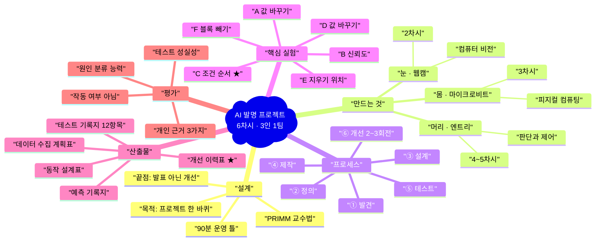

---

## 2. 발명 프로세스 — 반복하는 고리

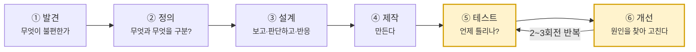

> 대부분의 수업은 ④에서 끝난다. 이 수업은 **⑤↔⑥ 구간에 6차시 중 2.5차시**를 쓴다.

---

## 3. PRIMM 5단계

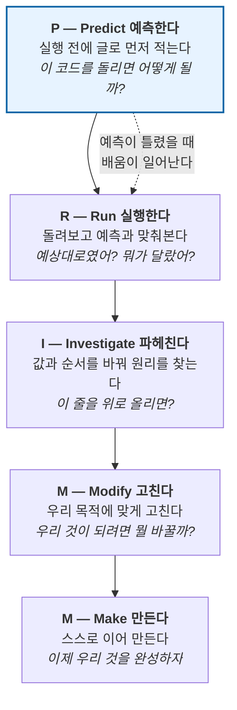

---

## 4. 시스템 구조 — 눈 · 머리 · 몸

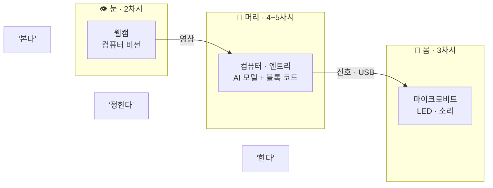

### 4-1. 컴퓨터 비전의 흐름

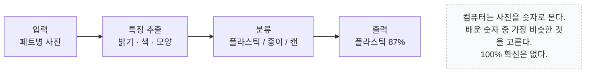

### 4-2. 피지컬 컴퓨팅의 흐름

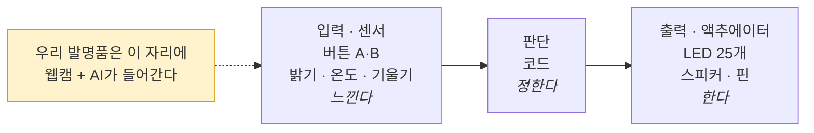

---

## 5. 6차시 전체 지도

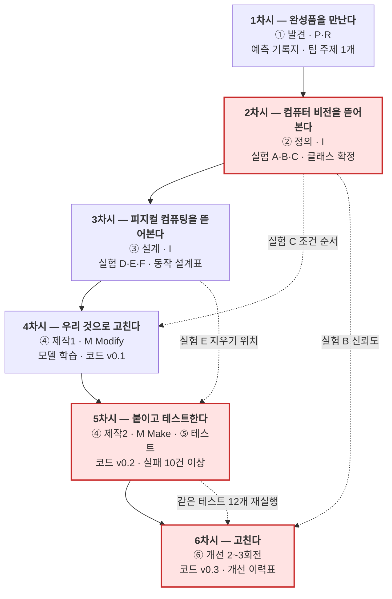

> 붉은 칸(2차시 실험 C · 5차시 테스트 12개 · 6차시 전체)은 **시간이 부족해도 절대 줄이지 않는다.**

---

## 6. 90분 운영 틀

```mermaid
gantt
    title 1차시 90분 구성 (모든 차시 공통 틀)
    dateFormat mm
    axisFormat %M분
    section 흐름
    여는 활동 10분      :a1, 00, 10m
    활동 1 · PRIMM 30분 :crit, a2, after a1, 30m
    쉬는 시간 10분      :a3, after a2, 10m
    활동 2 · 적용 30분  :crit, a4, after a3, 30m
    닫는 활동 10분      :a5, after a4, 10m
```

---

## 7. 발명품 동작 순서도 (3차시 산출물)

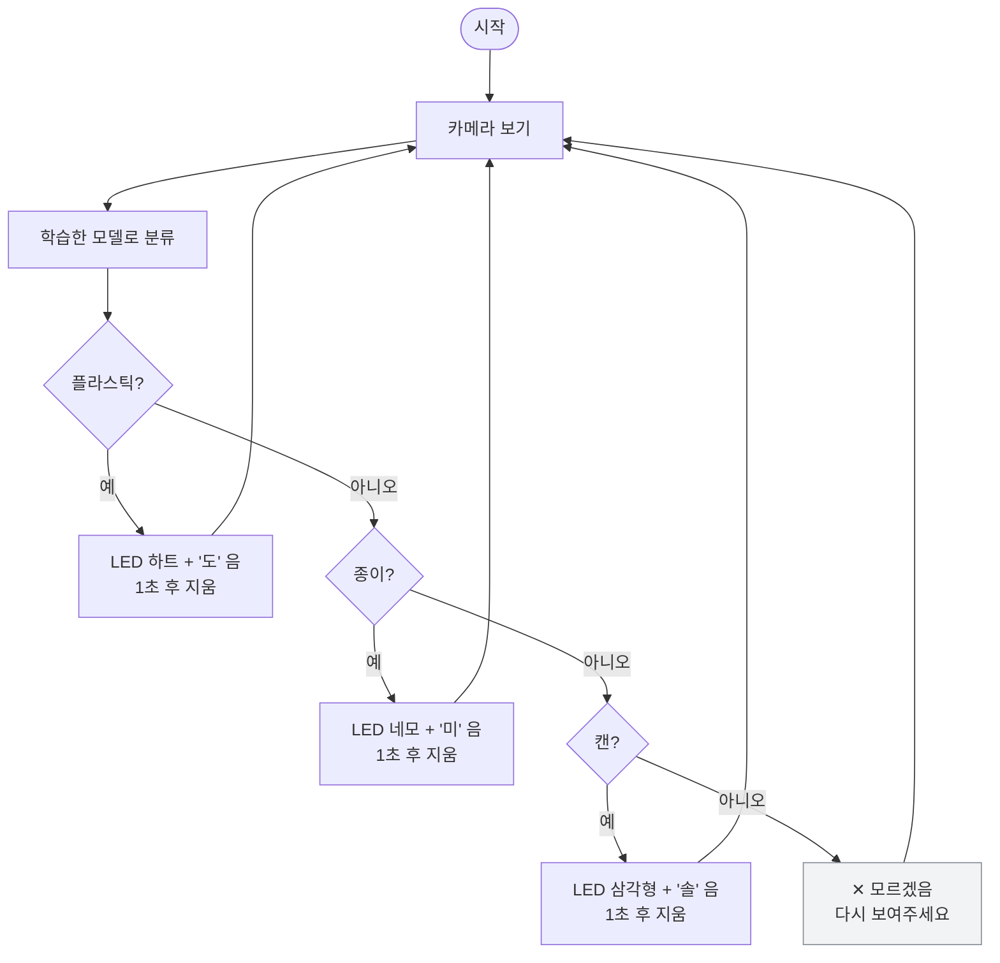

> **조건 순서 원칙** — 좁고 특별한 것이 위로, 넓고 일반적인 것이 아래로. '모르겠음'은 맨 아래.

---

## 8. 6차시 개선 루프

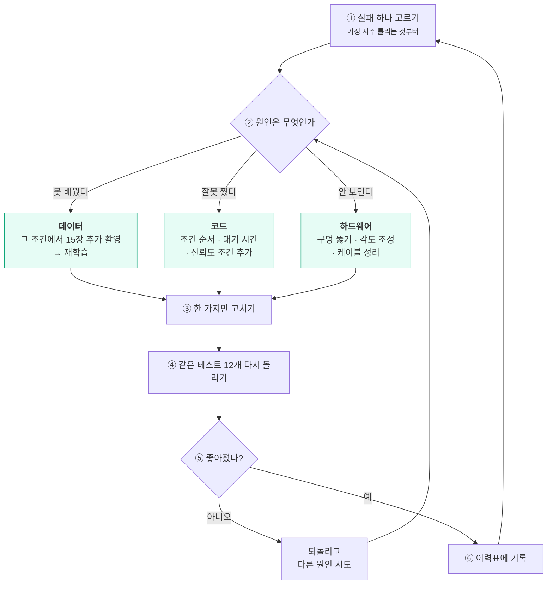

---

## 9. 증상 → 원인 분류

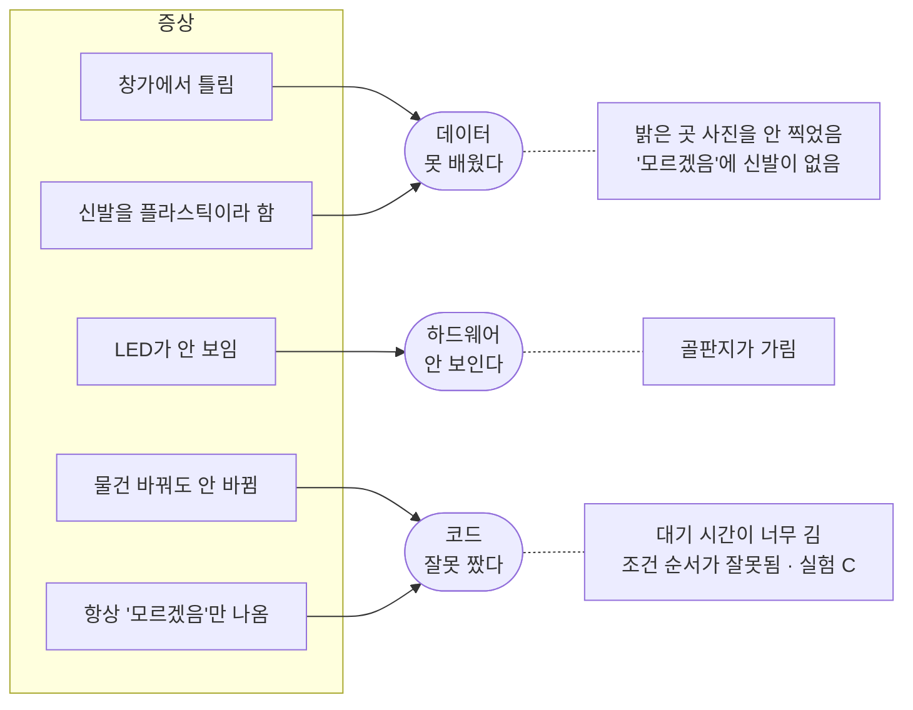

---

## 10. 3인 역할 로테이션

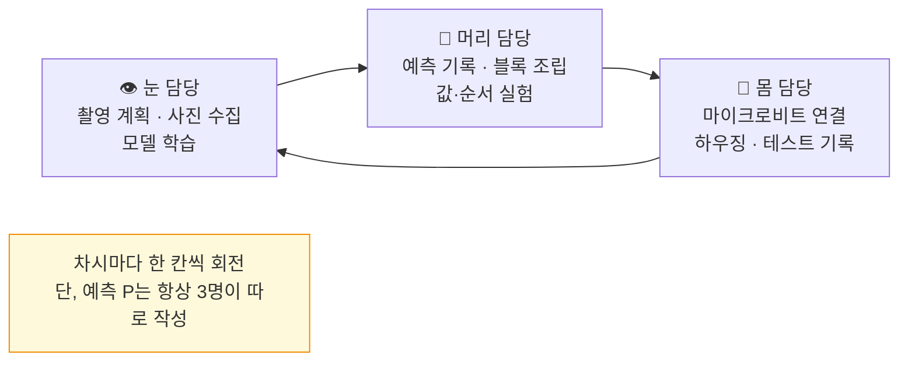

| | 1차시 | 2차시 | 3차시 | 4차시 | 5차시 | 6차시 |
|---|---|---|---|---|---|---|
| **A** | 눈 | 머리 | 몸 | 눈 | 머리 | 몸 |
| **B** | 머리 | 몸 | 눈 | 머리 | 몸 | 눈 |
| **C** | 몸 | 눈 | 머리 | 몸 | 눈 | 머리 |

---

## 11. 코드 진화 경로

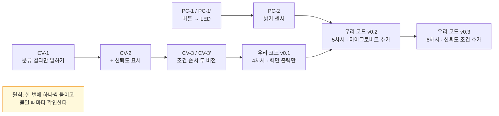

---

## 12. 교사 준비 체크 흐름

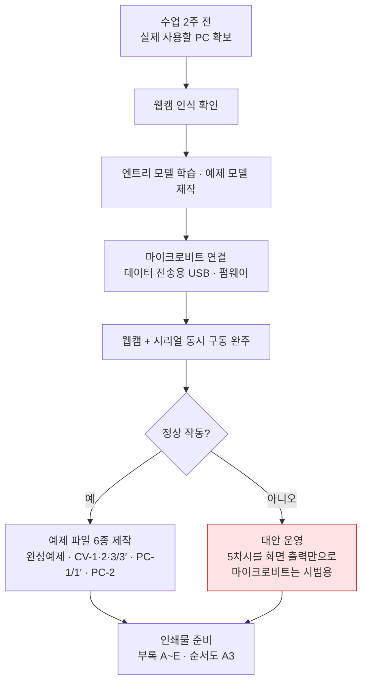
