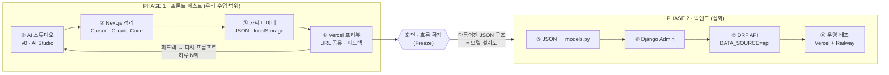
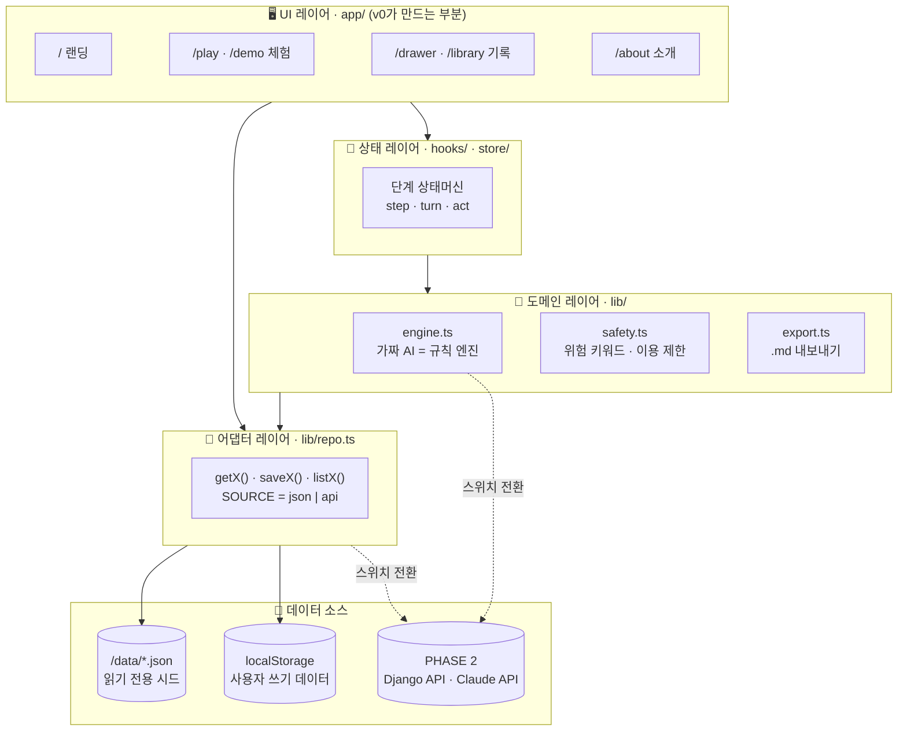
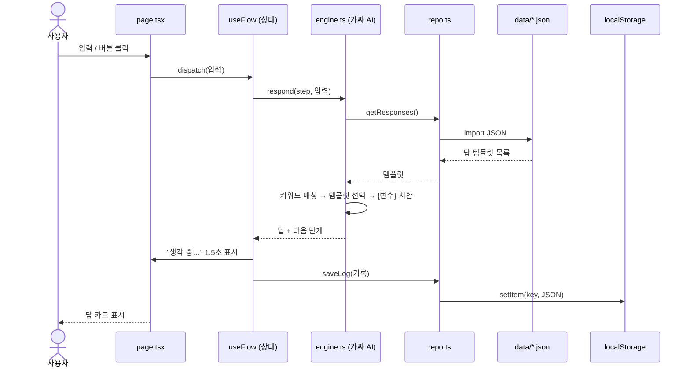
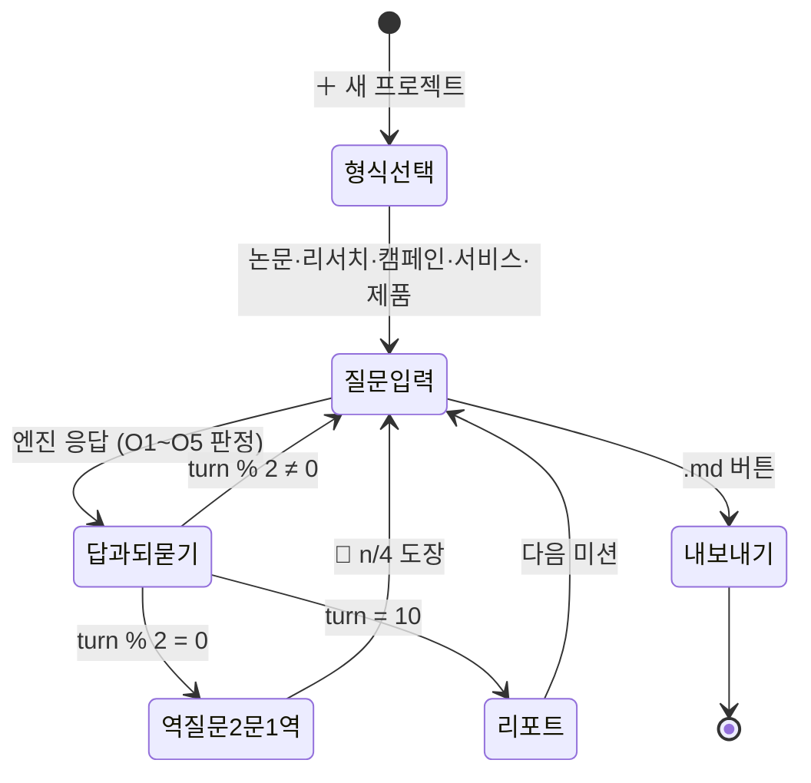
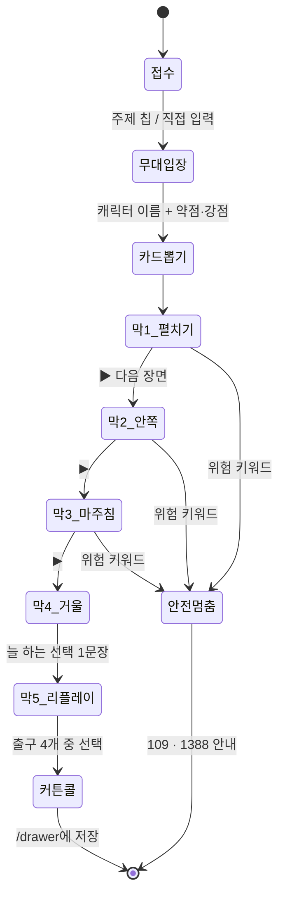
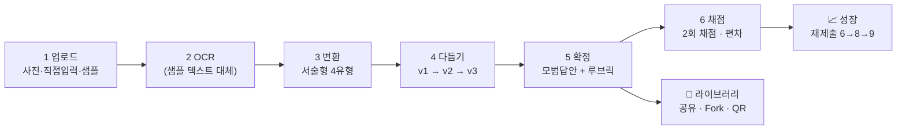
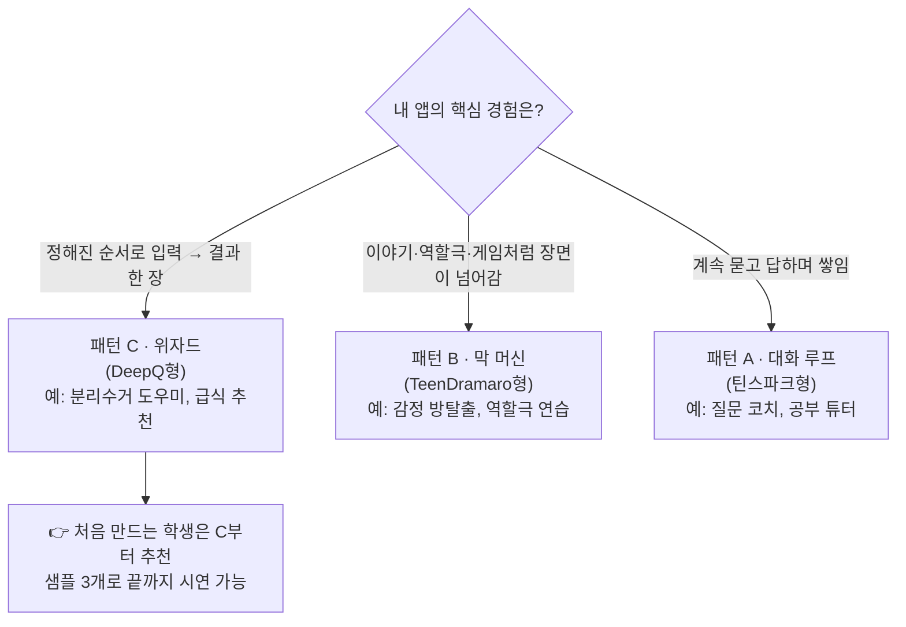
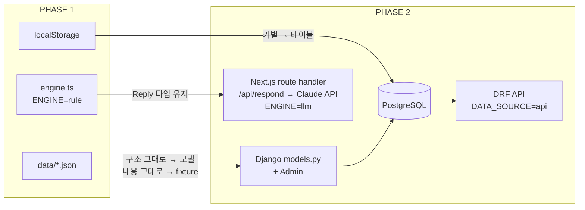
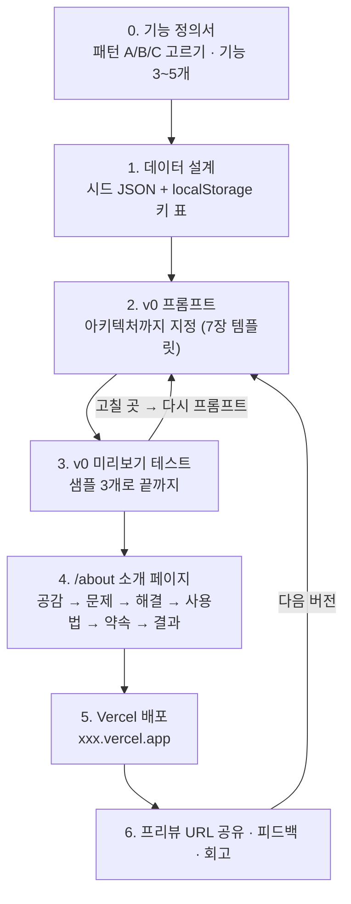

# (분석) v0 + Vercel "가짜로 돌아가는" AI 앱 3종 — 아키텍처 분석

> **목적**: 이미 배포된 예시 앱 3개를 아키텍처 관점에서 뜯어보고, 학생이 **v0 → Next.js → JSON 더미 + localStorage → Vercel** 만으로 "진짜처럼 돌아가는" AI 앱을 설계·제작하는 방법을 정리한다.
>
> **분석 대상**
>
> | # | 앱 | 주소 | 한 줄 정의 |
> |---|---|---|---|
> | 1 | 🔥 **틴스파크AI** (askback) | https://askback-omega.vercel.app/about | 답은 끝까지, 질문은 넓게 — 질문하는 법을 코칭하는 AI 기획 코치 |
> | 2 | 🎭 **TeenDramaro · 마음무대** | https://teen-dramaro.vercel.app/about | 타로 카드 × 사이코드라마 × AI 디렉터 — 캐릭터로 내 이야기를 연출 |
> | 3 | 🅠 **DeepQ · 딥큐** | https://deepq-omega.vercel.app/about | 객관식 사진 → 서술형 문제 + 루브릭 채점 + 공유 |
>
> **참조 아키텍처**: AI Maker Lab「바이브 코딩」 https://aimakerlab.com/why-project/vibe-coding (05 실무 워크플로우 · 07 서버 없이 테스트 · 08 Django 백엔드)
>
> ⚠️ 각 앱의 라우트·기능·데이터 방식은 공개 페이지(소개 문구, 화면, 네트워크 요청)에서 확인한 사실이고, **폴더 구조·localStorage 키·JSON 스키마·상태 이름은 그 기능을 재현하기 위한 설계안(추정)** 이다.

---

## 0. 한 장 요약

| 질문 | 답 |
|---|---|
| 세 앱의 공통 기술 | Next.js + Vercel 배포, **서버 0대 · 로그인 없음 · 실제 AI 호출 없음** |
| "AI처럼" 보이는 원리 | 미리 써 둔 **JSON 시나리오** + **규칙 함수(키워드·버튼 선택)** + **로딩 딜레이** |
| 사용자 데이터 저장 | 브라우저 **localStorage** (이 기기에만, 약 5MB) |
| 핵심 설계 원칙 | 화면은 데이터 출입구 **`lib/repo.ts`** 와 AI 출입구 **`lib/engine.ts`** 만 부른다 → 나중에 스위치 하나로 진짜 API·AI로 교체 |
| 우리 수업 범위 | 참조 아키텍처의 **PHASE 1 (프론트 퍼스트)** 까지 |
| 다음 단계(심화) | PHASE 2: JSON → Django 모델 + Admin, 규칙 엔진 → Claude API |

---

## 1. 큰 그림 — 2단계 파이프라인 (참조: AI Maker Lab)



| 구분 | PHASE 1 · 프론트 퍼스트 | PHASE 2 · 백엔드 |
|---|---|---|
| 기간 (참조 기준) | 1~2주, 하루 수 회 반복 | 3~5일, 확정된 화면 기준 |
| 데이터 | `/data/*.json` (읽기) + `localStorage` (쓰기) | PostgreSQL + Django 모델 |
| AI | 규칙 엔진 (가짜) | Claude API (서버에서 호출) |
| 배포 | Vercel 프리뷰 URL | Vercel(프론트) + Railway(백엔드) |
| 바뀌는 코드 | — | `repo.ts`, `engine.ts` 내부만 (**화면 코드 0줄**) |
| 세 예시 앱의 현재 위치 | ✅ 여기 | DeepQ STAGE 10이 "실제 서비스엔 Claude API + Supabase" 로 예고 |

> 💡 **왜 프론트 먼저?** 사용자는 API가 아니라 화면을 본다. 화면으로 먼저 검증하면 버릴 백엔드를 만들지 않는다. 그리고 테스트하며 다듬어진 JSON 구조가 그대로 DB 설계도가 된다.

---

## 2. 공통 레퍼런스 아키텍처 (세 앱의 뼈대)

### 2-1. 레이어 구조



| 레이어 | 위치 | 책임 | 누가 만드나 | PHASE 2에서 |
|---|---|---|---|---|
| UI | `app/**/page.tsx`, `components/` | 화면, 버튼, 애니메이션 | v0 (말로 생성) | 그대로 |
| 상태 | `hooks/useFlow.ts` | 지금 몇 단계인지, 다음 단계로 이동 | v0 / Cursor | 그대로 |
| 도메인 (가짜 AI) | `lib/engine.ts` | 입력 → 규칙 → JSON에서 답 고르기 | 학생 설계 + AI | **Claude API 호출로 교체** |
| 어댑터 | `lib/repo.ts` | 데이터 읽기/쓰기 단일 출입구 | AI (패턴 고정) | **fetch(API)로 교체** |
| 시드 데이터 | `data/*.json` | 샘플, 답 템플릿, 카드, 루브릭 | **학생이 직접 작성** | Django 초기 데이터(fixture) |
| 사용자 데이터 | `localStorage` | 기록, 진행도, 결과물 | 자동 | DB 테이블 |

### 2-2. 표준 폴더 구조

```text
my-app/
├─ app/
│  ├─ page.tsx              # / 랜딩: 한 줄 소개 + 시작 버튼
│  ├─ play/page.tsx         # 체험: 단계형 화면 (상태머신)
│  ├─ drawer/page.tsx       # 기록: localStorage 목록
│  ├─ examples/page.tsx     # 예시: 완성 사례 (선택)
│  └─ about/page.tsx        # 소개: STAGE 01~N 스크롤 스토리텔링
├─ components/              # v0가 만든 카드·버튼·진행바
├─ hooks/
│  └─ useFlow.ts            # 단계 상태머신
├─ lib/
│  ├─ repo.ts               # 🚪 데이터 출입구 (json | api)
│  ├─ engine.ts             # 🧠 가짜 AI 출입구 (rule | llm)
│  ├─ safety.ts             # 🚨 위험 키워드 · 이용 제한
│  └─ export.ts             # 📄 .md 내보내기
├─ data/
│  ├─ samples.json          # 샘플 입력 (빈 화면 금지용)
│  ├─ responses.json        # 답 템플릿
│  └─ ...                   # 앱별 (cards.json, rubrics.json ...)
└─ types/
   └─ index.ts              # JSON 스키마 = 타입 = 미래의 DB 모델
```

### 2-3. 데이터 2분류 원칙

| 구분 | 저장소 | 성격 | 예시 | 주의 |
|---|---|---|---|---|
| **읽기 데이터 (시드)** | `/data/*.json` | 모든 사용자가 같은 내용, 앱과 함께 배포 | 샘플 문제, 타로 카드, 답 템플릿, 루브릭 | 학생이 직접 써야 "내 앱"이 됨 |
| **쓰기 데이터 (사용자)** | `localStorage` | 사용자마다 다름, 이 브라우저에만 | 대화 기록, 진행도, 커튼콜, 즐겨찾기 | 비밀번호·실명·개인정보 저장 금지, 약 5MB |

### 2-4. 한 번의 요청이 흐르는 순서 (시퀀스)



### 2-5. 핵심 코드 ① — 데이터 출입구 `lib/repo.ts`

```ts
// 화면은 이 파일의 함수만 부른다. 나중에 SOURCE만 "api"로 바꾸면 끝.
const SOURCE = process.env.NEXT_PUBLIC_DATA_SOURCE ?? "json";
const API = process.env.NEXT_PUBLIC_API_URL;

// 읽기: 시드 데이터
export async function getSamples() {
  if (SOURCE === "api") return fetch(`${API}/api/samples/`).then(r => r.json());
  return (await import("@/data/samples.json")).default;
}

// 쓰기: 사용자 데이터 (localStorage)
const read = <T,>(key: string, fallback: T): T => {
  try { return JSON.parse(localStorage.getItem(key) ?? "") as T; } catch { return fallback; }
};
const write = (key: string, value: unknown) => {
  try { localStorage.setItem(key, JSON.stringify(value)); } catch {}
};

export function listProjects() { return read("app:projects", [] as Project[]); }
export function saveProject(p: Project) {
  const rest = listProjects().filter(x => x.id !== p.id);
  write("app:projects", [p, ...rest]);
}
```

### 2-6. 핵심 코드 ② — 가짜 AI 출입구 `lib/engine.ts`

```ts
// 지금은 규칙 엔진, PHASE 2에서는 같은 함수 이름으로 Claude API 호출.
const ENGINE = process.env.NEXT_PUBLIC_ENGINE ?? "rule";

export async function respond(input: string, ctx: Context): Promise<Reply> {
  if (ENGINE === "llm") {
    return fetch("/api/respond", { method: "POST", body: JSON.stringify({ input, ctx }) })
      .then(r => r.json());                       // API 키는 서버(route handler)에만
  }
  await new Promise(r => setTimeout(r, 1200));     // "생각 중…" 연출
  const rules = (await import("@/data/responses.json")).default;
  const hit = rules.find(r => r.keywords.some(k => input.includes(k)))
           ?? rules.find(r => r.id === "default")!;
  return { text: fill(hit.text, ctx), followUp: hit.followUp, next: hit.next };
}

const fill = (t: string, ctx: Context) => t.replace(/\{(\w+)\}/g, (_, k) => ctx[k] ?? "");
```

> 🔑 **설계 포인트**: `respond()`의 **입력·출력 모양(Reply 타입)을 처음부터 고정**하면, 안쪽이 규칙이든 LLM이든 화면은 모른다. 이것이 "가짜 → 진짜" 교체가 쉬운 이유다.

### 2-7. "진짜처럼" 보이게 하는 연출 레이어

| # | 기법 | 아키텍처상 위치 | 예시 앱 |
|---|---|---|---|
| 1 | 샘플로 바로 시작 (빈 화면 금지) | `data/samples.json` | DeepQ "🧪 샘플 문제로 바로 시작" |
| 2 | 자유입력 대신 칩·버튼 | UI → 입력 경우의 수 축소 → 규칙이 답을 미리 준비 가능 | TeenDramaro 4갈래, 틴스파크 여섯 축 |
| 3 | 생각하는 척 딜레이 | `engine.ts` `setTimeout` | DeepQ "⏱ 20초" |
| 4 | 고정 패턴 되묻기 | `responses.json`의 `followUp` 필드 | 틴스파크 "그 400은 어디서 왔어?" |
| 5 | 사용자 말 되돌려주기 (생성 없이) | `engine.ts`가 기록에서 문장만 모음 | TeenDramaro 4막 거울 |
| 6 | 정직한 데모 고지 | `layout.tsx` footer | DeepQ "규칙 기반 시뮬레이션 · localStorage" |

---

## 3. 앱별 아키텍처

### 3-1. 🔥 틴스파크AI — 패턴 A: **대화 루프 + 턴 카운터**

**한 줄**: 코드는 AI가 짜고, 그 앞의 "설계"는 학생이 하도록 질문을 코칭.
**확인된 사실**: 라우트 `/`, `/about`, `/demo` · "가입·비밀번호 없음 — 기록은 이 기기에 저장" · 기획서.md / 전체 기록.md 내보내기.

#### 라우트 맵

| 라우트 | 역할 | 데이터 |
|---|---|---|
| `/` | 앱 본체 (프로젝트 목록 + 대화) | localStorage |
| `/demo` | 예시 프로젝트 통으로 읽기 (계정 없이) | `examples.json` |
| `/about` | STAGE 01~11 소개 | 정적 |

#### 상태머신 (대화 루프)



#### 모듈 구성

| 모듈 | 역할 | 규칙 (가짜 AI) |
|---|---|---|
| `classifyOpenness()` | 질문을 O1~O5로 분류 | "짜줘/만들어줘"=O1 · 의문문+조건어("~하고 싶어","~일까")=O3 · "다른 방법"=O4 |
| `respond()` | 형식별 답 + 되묻기 | 형식 × 키워드 → 규칙카드/순서도/비교표 템플릿 + `followUp` |
| `widenAxis()` | 여섯 축 버튼 → 입력창 채우기 | 축별 문장 템플릿 (왜·맥락·제약·기준·검증·버릴 것) |
| `pickQuiz()` | 2문 1역 출제 | `quiz.json`에서 4관문(순서도·핵심·차별점·실패조건) 순서대로 |
| `buildReport()` | 10턴 리포트 8칸 | 기록 집계: O단계 분포, 질문 길이, 되묻기 응답 수 |
| `exportMd()` | 기획서.md · 전체 기록.md | 기록 → 마크다운 문자열 → Blob 다운로드 |

#### 데이터 설계

```jsonc
// data/formats.json — 형식마다 채울 칸 4개 + 질문 버튼
[{ "id": "product", "label": "제품 (하드웨어)",
   "slots": ["동작 시나리오", "부품 목록", "구조 스케치", "만드는 순서"],
   "buttons": ["센서값 기준 잡기", "실패하면?"] }]

// data/responses.json — 답 템플릿 + 되묻기
[{ "id": "sensor-threshold", "format": "product", "keywords": ["400", "센서"],
   "card": "흙 센서 < {threshold} → 펌프 3초",
   "followUp": "그 {threshold}은 어디서 왔어? 직접 재 본 적 있어?" }]
```

| localStorage 키 (설계안) | 값 |
|---|---|
| `ts:projects` | `[{ id, name, format, slots:{...}, createdAt }]` |
| `ts:log:{projectId}` | `[{ turn, role, text, openness, axis }]` |
| `ts:stamps:{projectId}` | `["flow","core"]` (4관문 중 통과한 것) |

#### 기능 정의서

| ID | 기능 | 입력 | 처리 (PHASE 1 가짜) | 출력 | 저장 | PHASE 2 교체 |
|---|---|---|---|---|---|---|
| T-01 | 형식 선택 | 5형식 중 1 | `formats.json` 로드 | 빈 체크칸 4개 | `ts:projects` | Project 모델 |
| T-02 | 질문 수준 진단 | 질문 문장 | 키워드 규칙 | O1~O5 배지 | `ts:log` | LLM 분류 |
| T-03 | 답 + 되묻기 | 질문 | 템플릿 매칭 + `followUp` | 답 카드 + 🙋 | `ts:log` | Claude API |
| T-04 | 2문 1역 | 2턴마다 자동 | `quiz.json` 순차 출제 | 5초/30초 카드, 🧩 n/4 | `ts:stamps` | LLM 출제 |
| T-05 | 여섯 축 | 축 버튼 | 문장 템플릿 | 넓힌 질문 | — | 그대로 |
| T-06 | 10문 리포트 | 10턴 도달 | 기록 집계 | 8칸 리포트 + 미션 | `ts:log` | 서버 집계 |
| T-07 | .md 내보내기 | 버튼 | 문자열 변환 | 파일 다운로드 | 파일 | 그대로 |

---

### 3-2. 🎭 TeenDramaro — 패턴 B: **시나리오 막(Act) 머신 + 안전 가드**

**한 줄**: 내가 만든 캐릭터를 무대에 올려, 늘 하던 선택을 찾고 다른 선택을 해 본다.
**확인된 사실**: 라우트 `/`, `/play`, `/drawer`, `/examples`, `/about` · "서버에 안 쌓고 이 기기 브라우저 안에만" · 한 판 25분, 하루 3번 · 위험 신호 시 109·1388·1577-0199 안내.

#### 라우트 맵

| 라우트 | 역할 | 데이터 |
|---|---|---|
| `/` | 랜딩 | 정적 |
| `/play` | 무대 (막 진행) | `acts.json`, `cards.json` + localStorage |
| `/drawer` | 카드 서랍장 (커튼콜 기록) | localStorage |
| `/examples` | 예시 무대 | `examples.json` |
| `/about` | STAGE 01~07 소개 | 정적 |

#### 상태머신 (1부 7단계 + 2부 2단계, 모든 단계에 안전 가드)



> 각 막 안에서는 턴 수 제한이 없다 ("10번을 가도 100번을 가도 순서는 그대로"). → **막(act) = 상태, 턴 = 막 안의 루프**. 다음 막으로 넘기는 건 항상 사용자 버튼.

#### 모듈 구성

| 모듈 | 역할 | 규칙 (가짜 AI) |
|---|---|---|
| `directorLine()` | 디렉터 질문 | `acts.json`의 막별 질문 배열을 순서대로, `{name}` 치환 |
| `branch()` | 조종간 4갈래 | 장면으로/마음으로/딴 데로/패스 → 막별 템플릿을 **입력창에 채움** (전송은 사용자) |
| `drawCard()` | 카드 뽑기 | `cards.json` 랜덤 1장 |
| `mirror()` | 4막 거울 | **사용자가 쓴 문장만** 기록에서 추출 (AI 생성 없음) |
| `replay()` | 5막 리플레이 | 출구(말로 받기·자리 뜨기·비틀기·원래대로) × 주제 → 상대 반응 템플릿 |
| `safety.check()` | 안전 가드 | 모든 입력에 위험 키워드 매칭 → 즉시 `안전멈춤` 상태 |
| `limits()` | 이용 제한 | 날짜별 판 수 카운트, 25분 타이머 |

#### 데이터 설계

```jsonc
// data/cards.json — 점이 아니라 말문 여는 소품
[{ "id": "moon", "name": "달", "emoji": "🌙", "keywords": ["불안", "예감", "안개"] }]

// data/acts.json — 막별 디렉터 질문
[{ "act": 1, "title": "펼치기",
   "lines": ["딱 한 장면만. 어디, 몇 시였어?",
             "손이 멈춘 자리. 거기서 {name}은(는) 실제로 뭐라고 쳤어?"],
   "branches": { "scene": "그때 화면에 뭐가 떠 있었어?", "heart": "그 순간 몸은 어디가 먼저 반응했어?" } }]

// data/safety.json — 위험 키워드 (교사·전문가 검토 필수)
{ "keywords": ["..."], "hotlines": [{ "name": "자살예방 상담전화", "tel": "109" },
                                    { "name": "청소년 상담", "tel": "1388" }] }
```

| localStorage 키 (설계안) | 값 |
|---|---|
| `td:session` | `{ act, topic, character:{name,weak,strong}, card, log:[...] }` (진행 중 한 판) |
| `td:drawer` | `[{ id, title, before, after, card, insights:[3], date }]` (커튼콜) |
| `td:usage` | `{ "2026-10-09": 2 }` (하루 3번 제한) |

#### 기능 정의서

| ID | 기능 | 입력 | 처리 (PHASE 1 가짜) | 출력 | 저장 | PHASE 2 교체 |
|---|---|---|---|---|---|---|
| D-01 | 접수 | 주제 칩 / 입력 | 주제별 시나리오 선택 | 디렉터 첫 대사 | `td:session` | LLM |
| D-02 | 캐릭터 | 이름 + 약점·강점 | `{name}` 치환 | 캐릭터 카드 | `td:session` | 그대로 |
| D-03 | 카드 뽑기 | 클릭 | 랜덤 | 카드 + 키워드 | `td:session` | 그대로 |
| D-04 | 막 진행 | 자유 입력 | 막별 질문 순차 | 디렉터 질문 | `td:session` | LLM (막 규칙은 시스템 프롬프트로) |
| D-05 | 조종간 | 4갈래 버튼 | 템플릿 → 입력창 | 수정 가능한 문장 | — | 그대로 |
| D-06 | 거울 | 4막 도달 | 사용자 문장만 추출 | 요약 + 수정칸 | `td:session` | LLM 요약 (지어내기 금지 규칙) |
| D-07 | 리플레이 | 출구 4개 중 1 | 반응 템플릿 | 상대 반응 | `td:session` | LLM |
| D-08 | 커튼콜 | 새 문장 + 제목 | 원래 문장 옆에 배치 | 커튼콜 카드 | `td:drawer` | DB |
| D-09 | 🚨 안전 멈춤 | 모든 입력 | 위험 키워드 매칭 | 상담전화 안내 | — | 키워드 + LLM 이중 감지 |
| D-10 | 이용 제한 | — | 날짜별 카운트 | 안내 | `td:usage` | 서버 |

> ⚠️ 마음·고민을 다루는 앱은 **데모라도 안전 가드(D-09)가 아키텍처 최상단**에 있어야 한다. 모든 입력이 엔진보다 먼저 `safety.check()`를 지나게 설계한다.

---

### 3-3. 🅠 DeepQ — 패턴 C: **위자드 파이프라인 + 버전 관리 + 채점 엔진**

**한 줄**: 객관식 사진 한 장 → 서술형 문제 + 루브릭 채점 + 공유.
**확인된 사실**: 라우트 `/`, `/problems`, `/library`, `/about` · `/` 는 6단계 위자드 · "생성·채점은 규칙 기반 시뮬레이션, 데이터는 localStorage" · OCR은 "데모: 샘플 텍스트로 대체" · 페이지 로딩 시 외부 API 요청 없음(폰트·이미지만).

#### 라우트 맵

| 라우트 | 역할 | 데이터 |
|---|---|---|
| `/` | Play — 6단계 위자드 (업로드→OCR→변환→다듬기→확정→채점) | `samples.json`, `templates.json` |
| `/problems` | 내가 만든 문제 목록 | localStorage |
| `/library` | 공유 라이브러리 · Fork | `library.json` + localStorage |
| `/about` | STAGE 01~10 소개 (PART 1~3) | 정적 |

#### 파이프라인 (위자드 6단계)



#### 공개된 가짜 ↔ 진짜 대응 (DeepQ STAGE 10 원문 기반)

| 역할 | 데모 (지금) | 실제 서비스 |
|---|---|---|
| 생성 | JSON 템플릿 | Claude API |
| 채점 | 키워드 규칙 | 루브릭 LLM 채점 |
| 저장 | localStorage | Supabase |
| OCR | 샘플 텍스트 | Vision API |

#### 모듈 구성

| 모듈 | 역할 | 규칙 (가짜 AI) |
|---|---|---|
| `ocr()` | 사진 → 텍스트 | 업로드 여부와 관계없이 선택된 샘플 텍스트 반환 |
| `convert()` | 객관식 → 서술형 4유형 | `templates.json[sampleId]`의 원리설명·비교분석·적용추론·비판평가 |
| `refine()` | 대화형 다듬기 | 명령 키워드("조건", "쉬운 말") → 미리 준비한 변형본, 버전 배열에 push |
| `grade()` | 루브릭 채점 | 항목별 키워드 포함 → 점수 |
| `gradeTwice()` | 편차 판정 | 규칙 2벌(엄격/관대) 결과 차이 ≥ 2 → 🟡 교사 확인 |
| `hint()` | 부분점수 피드백 | 0점 항목 → "근거 하나 더 쓰면 +2점" |
| `fork()` | 공유 문제 복제 | 객체 복사 + `forkedFrom` 필드 |

#### 데이터 설계

```jsonc
// data/samples.json
[{ "id": "sci-01", "subject": "과학", "grade": "중2", "title": "광합성에 필요한 요소",
   "text": "다음 중 광합성에 필요한 요소가 아닌 것은? ① 빛 ② 물 ③ 이산화탄소 ④ 산소 ⑤ 엽록체" }]

// data/templates.json — 샘플별 변환 결과 + 다듬기 변형 + 루브릭
{ "sci-01": {
    "converted": [{ "type": "원리 설명",
      "text": "식물을 빛이 없는 상자에 3일간 두었더니 잎이 시들었다. 그 이유를 광합성 과정과 연결하여 설명하시오." }],
    "refinements": { "조건": "…온도 25℃, 물은 매일 같은 양을 주었다…", "쉬운 말": "…" },
    "rubric": [
      { "name": "핵심 개념 이해", "max": 3, "keywords": ["광합성", "양분", "포도당"] },
      { "name": "논리적 풀이 과정", "max": 3, "keywords": ["때문에", "그래서", "따라서"] },
      { "name": "근거 제시", "max": 2, "keywords": ["빛", "에너지"] },
      { "name": "표현 · 완성도", "max": 2, "minLength": 30 } ] } }
```

| localStorage 키 (설계안) | 값 |
|---|---|
| `dq:problems` | `[{ id, sampleId, versions:[v1,v2,v3], confirmed, rubric, forkedFrom? }]` |
| `dq:submissions:{problemId}` | `[{ attempt, answer, scores:[...], total, flag:"green"|"yellow" }]` |
| `dq:library` | 내가 공유·Fork한 문제 id 목록 |

#### 기능 정의서

| ID | 기능 | 입력 | 처리 (PHASE 1 가짜) | 출력 | 저장 | PHASE 2 교체 |
|---|---|---|---|---|---|---|
| Q-01 | 업로드 | 사진 / 직접 입력 / 샘플 | 샘플 텍스트로 대체 | 문제 텍스트 | 세션 | Vision OCR |
| Q-02 | 변환 | 다음 버튼 | 템플릿 꺼내기 | 서술형 4유형 | `dq:problems` | Claude API |
| Q-03 | 다듬기 | "조건 추가해줘" 등 | 키워드 → 변형본 | v1·v2·v3 + 변경 표시 | `dq:problems` | Claude API |
| Q-04 | 확정 | 확정 버튼 | 루브릭 연결 | 문제+모범답안+루브릭 | `dq:problems` | DB |
| Q-05 | 채점 | 학생 답안 | 키워드 규칙 | 항목별 점수 + 근거 | `dq:submissions` | LLM 채점 |
| Q-06 | 2회 채점 | 자동 | 규칙 2벌 비교 | 🟢 / 🟡 | `dq:submissions` | LLM 2회 |
| Q-07 | 피드백 | — | 0점 항목 → 힌트 | "+2점" 문장 | — | LLM |
| Q-08 | 성장 기록 | 재제출 | 회차 누적 | 점수 그래프 | `dq:submissions` | DB |
| Q-09 | 공유 · Fork | 버튼 | 복사 + `forkedFrom` | Fork 트리 | `dq:library` | DB (다른 사용자와 실제 공유) |

> 💡 Q-09 "공유"는 localStorage만으로는 **다른 기기와 진짜 공유가 불가능**하다. 데모에서는 `library.json`에 "다른 선생님 문제"를 미리 넣어 두는 방식으로 흉내 낸다. → 이것이 PHASE 2(DB)가 필요한 대표적 이유.

---

## 4. 세 앱 아키텍처 비교

| 항목 | 틴스파크AI | TeenDramaro | DeepQ |
|---|---|---|---|
| **아키텍처 패턴** | A. 대화 루프 + 턴 카운터 | B. 시나리오 막 머신 + 안전 가드 | C. 위자드 파이프라인 + 버전 + 채점 |
| **상태 단위** | turn (2턴마다 역질문, 10턴마다 리포트) | act (1~5막 + 커튼콜) | step (1~6단계) |
| **다음 단계 결정** | 턴 수 자동 | 사용자 버튼 (▶ 다음 장면) | 사용자 버튼 (다음 →) |
| **가짜 AI 핵심** | 질문 분류 + 답 템플릿 + 되묻기 | 막별 질문 순차 + 사용자 문장 되돌려주기 | 템플릿 변환 + 키워드 채점 |
| **입력 방식** | 자유 입력 + 축 버튼 | 칩 + 자유 입력 + 4갈래 버튼 | 샘플 선택 + 명령 문장 + 답안 |
| **시드 JSON** | formats, responses, quiz | cards, acts, safety | samples, templates, library |
| **사용자 데이터** | 프로젝트 · 대화 로그 · 도장 | 진행 중 세션 · 서랍장 · 이용 횟수 | 문제(버전) · 제출 기록 |
| **결과물** | .md 파일 2종 | 커튼콜 카드 | 문제 + 루브릭 + 점수 그래프 |
| **특수 모듈** | export (.md) | safety, limits | gradeTwice, fork |
| **가짜 만들기 난이도** | ★★★ (자유 질문 대응 어려움) | ★★ (막 순서가 고정) | ★ (샘플 3개로 전체 시연) |
| **PHASE 2 필요성** | LLM 답변 품질 | LLM + 안전 이중화 | DB 공유 + LLM 채점 |

### 학생 아이디어 → 어떤 패턴으로?



---

## 5. PHASE 2 확장 경로 (심화 · 참고)



| PHASE 1 | → | PHASE 2 | 바꾸는 파일 |
|---|---|---|---|
| `data/samples.json` 구조 | → | `class Sample(models.Model)` | `models.py` (AI에게 "이 JSON 구조로 모델 만들어 줘") |
| `data/samples.json` 내용 | → | 초기 데이터 (loaddata) | fixture |
| 시드 수정 = JSON 직접 편집 | → | Django Admin에서 선생님이 수정 | `admin.py` 10줄 |
| `localStorage` 키 | → | 사용자별 테이블 + 로그인 | `models.py`, 인증 |
| `repo.ts` `import(json)` | → | `fetch(API)` | `.env` `DATA_SOURCE=api` |
| `engine.ts` 규칙 | → | 서버 route handler에서 Claude API 호출 | `.env` `ENGINE=llm` |
| 화면 코드 | → | **변경 없음** | — |

> 🔐 PHASE 2에서 가장 중요한 규칙: **AI API 키는 절대 프론트(브라우저) 코드에 넣지 않는다.** 반드시 서버(route handler / Django)에서만 호출한다.

---

## 6. 제작 단계 (PHASE 1 · 수업용)



| 단계 | 할 일 | 도구 | 산출물 | 역할 (참조: 4역할 순환) |
|---|---|---|---|---|
| 0 | 문제·페르소나·패턴·기능 정의 | 종이 · 워크시트 | 기능 정의서 표 | 🧭 기획자 |
| 1 | 시드 JSON 3개 + 저장 키 설계 | 종이 · Claude/ChatGPT | `data/*.json` 초안 | 🧭 기획자 |
| 2 | 화면 + 구조 생성 | v0 | `/`, `/play` | 🛠 실행자 |
| 3 | 흐름 테스트, 수정 | v0 미리보기 · 브라우저 개발자도구(Application → Local Storage) | 동작하는 데모 | 🔍 디버거 |
| 4 | 소개 페이지 | v0 | `/about` | 🛠 실행자 |
| 5 | 배포 | v0 → Vercel | 공개 URL | 🛠 실행자 |
| 6 | 피드백 · 회고 | 친구·선생님 | 개선 목록 | 🪞 성찰자 |

---

## 7. v0 프롬프트 템플릿 (아키텍처 지정형)

```text
[앱 이름] ○○○
[한 줄 정의] ○○○가 ○○○ 할 때, ○○○ 하도록 돕는 앱
[아키텍처 패턴] C. 위자드 파이프라인 (1단계 → 2단계 → 3단계 → 결과)

[라우트]
- /        : 한 줄 소개 + "시작하기" 버튼 + 샘플 3개 카드
- /play    : 단계형 화면, 상단에 진행바 (1/3, 2/3, 3/3)
- /drawer  : 내가 만든 결과 목록 (localStorage)
- /about   : 공감 → 문제 → 해결 → 사용법 → 약속 → 결과 순서의 스크롤 소개

[아키텍처 규칙 - 반드시 지켜 주세요]
1. 서버, 로그인, 실제 AI API는 쓰지 마세요.
2. 모든 데이터 읽기/쓰기는 lib/repo.ts 한 파일로만 하세요.
   - 읽기: data/samples.json, data/responses.json
   - 쓰기: localStorage (키: "myapp:results")
   - NEXT_PUBLIC_DATA_SOURCE 가 "api" 이면 fetch 하도록 분기만 만들어 두세요.
3. "AI 응답"은 lib/engine.ts 의 respond(input, ctx) 함수 하나로 만드세요.
   - responses.json 에서 keywords 가 입력에 포함된 항목을 고르고, 없으면 id "default".
   - 1.2초 "생각 중…" 로딩 후 결과를 보여 주세요.
   - 반환 모양: { text, followUp, next }
4. 화면 컴포넌트는 repo.ts 와 engine.ts 만 import 하세요.
5. localStorage 접근은 try/catch 로 감싸 주세요.
6. 하단에 "데모: 규칙 기반 시뮬레이션이며 데이터는 이 브라우저에만 저장됩니다" 표시.

[시드 데이터]
(1장 데이터 설계 표에서 만든 JSON 붙여넣기)

[기능 목록]
(기능 정의서 표 붙여넣기)

[디자인] 모바일 우선 · Pretendard 폰트 · 이모지 아이콘 · 큰 버튼
```

**수정 프롬프트 예시 (반복 단계)**

| 상황 | 프롬프트 |
|---|---|
| 답이 항상 똑같음 | "responses.json 에 '{키워드}' 항목을 추가하고 engine.ts 매칭이 동작하는지 확인해 줘" |
| 새로고침하면 사라짐 | "결과 저장을 repo.ts 의 saveResult 로 바꾸고 /drawer 에서 listResults 로 읽게 해 줘" |
| 화면이 데이터를 직접 읽음 | "page.tsx 에서 json 을 직접 import 하지 말고 repo.ts 를 거치게 고쳐 줘" |
| 빈 화면에서 막힘 | "첫 화면에 samples.json 샘플 3개를 카드로 보여 주고 누르면 바로 2단계로 가게 해 줘" |

---

## 8. 학생용 설계 양식

### 8-1. 기획 한 장

| 항목 | 작성 |
|---|---|
| 앱 이름 |  |
| 한 줄 정의 | ___가 ___ 할 때, ___ 하도록 돕는 앱 |
| 페르소나 |  |
| Before (지금의 불편) |  |
| After (앱을 쓴 뒤) |  |
| 아키텍처 패턴 | ☐ A 대화 루프  ☐ B 막 머신  ☐ C 위자드 |
| 일부러 안 만들 기능 1개 |  |

### 8-2. 상태(단계) 설계

```text
[상태1: ______] --(무엇을 하면)--> [상태2: ______] --(무엇을 하면)--> [상태3: ______] --> [결과: ______]
```

### 8-3. 기능 정의서

| ID | 기능 | 입력 | 처리 (가짜: JSON/규칙) | 출력 | 저장 키 | 나중에 진짜로 바꾼다면 |
|---|---|---|---|---|---|---|
| F-01 |  |  |  |  |  |  |
| F-02 |  |  |  |  |  |  |
| F-03 |  |  |  |  |  |  |

### 8-4. 데이터 설계

| 시드 JSON 파일 | 필드 | 샘플 개수 |
|---|---|---|
| `samples.json` |  | 3 |
| `responses.json` | id, keywords, text, followUp, next |  |

| localStorage 키 | 값 모양 | 언제 저장 |
|---|---|---|
| `myapp:results` | `[{ id, title, ..., date }]` |  |

### 8-5. 응답 규칙표 (가짜 AI 시나리오)

| # | 사용자가 넣을 입력 | 매칭 키워드 | 앱의 답 | 되묻기 | 다음 상태 |
|---|---|---|---|---|---|
| 1 |  |  |  |  |  |
| 2 |  |  |  |  |  |
| 3 |  |  |  |  |  |
| default | (그 외 모든 입력) | — | "조금 더 자세히 말해 줄래?" |  | 그대로 |

---

## 9. 아키텍처 점검표

### 9-1. 데모(PHASE 1) 완성 기준

| ✅ | 점검 항목 | 레이어 |
|---|---|---|
| ☐ | 화면 코드가 JSON·localStorage를 직접 만지지 않고 `repo.ts`만 부른다 | 어댑터 |
| ☐ | "AI 응답"이 `engine.ts`의 함수 하나에 모여 있고 반환 모양이 고정이다 | 도메인 |
| ☐ | 샘플 3개로 처음부터 끝까지 시연된다 (빈 화면 없음) | 시드 |
| ☐ | 매칭 안 되는 입력에도 `default` 답이 나온다 | 도메인 |
| ☐ | 새로고침해도 기록이 남는다 (개발자도구 → Application → Local Storage 확인) | 데이터 |
| ☐ | localStorage 접근이 try/catch로 감싸져 있다 (시크릿 창에서도 안 깨짐) | 어댑터 |
| ☐ | 비밀번호·실명·개인정보를 저장하지 않는다 | 데이터 |
| ☐ | 데모 고지 문구가 있다 | UI |
| ☐ | 고민·마음을 다루면 `safety.check()`가 엔진보다 먼저 실행된다 | 도메인 |
| ☐ | Vercel URL로 친구 휴대폰에서 열린다 | 배포 |

### 9-2. 데모 → 서비스로 가려면 AI에게 물어야 할 질문 (참조: "100번의 질문")

| 영역 | 질문 |
|---|---|
| 예외 처리 | 데이터가 0개일 때 화면은? 500자·이모지를 넣으면 깨지지 않아? |
| 보안 | API 키가 프론트 코드에 노출되지 않았어? 다른 사람 기록을 볼 수 있는 구멍은? |
| 저장 | localStorage 5MB를 넘으면? 브라우저 데이터를 지우면 사라지는 걸 사용자가 알아? |
| 사용성 | 모바일에서 버튼이 너무 작지 않아? 처음 보는 친구 5명이 설명 없이 쓸 수 있어? |
| 책임 | 이 코드가 왜 이렇게 동작하는지 내가 설명할 수 있어? |

> 🎯 **핵심 메시지**: 진짜 AI를 붙이는 건 나중 일이다. 지금은 **화면 · 상태 · 데이터 모양 · 출입구(repo/engine)** 를 설계하는 것이 발명이다. 잘 설계된 가짜는 스위치 하나로 진짜가 된다.
