# 3일차 · **1차시** — 바이브 코딩: 말로 지휘해서 화면을 만든다 (이론)
## 성격: **보여주는 시간** — 그림(단계도)으로 이해하고, 마지막 5분에 "주문서" 한 장을 씁니다

> **앞 시간(2일차)에 한 것** — A4 8칸 워크시트로 **우리 아이템**과 **1단(심장 하나)** 을 정했고, 과제로 **화면 3장 손그림 · 데이터 20건**을 만들어 왔습니다.
> **이 시간에 하는 것** — 그 종이를 **진짜 웹사이트로 바꾸는 방법**을 배웁니다. 코딩을 한 줄도 몰라도 됩니다.
> **다음 시간(2차시)** — `3일차_2차시_v0_프론트_실습.md` · v0로 실제 화면을 만들고 인터넷에 올립니다.
>
> **참고** — [AI Maker Lab · 왜 프로젝트인가](https://aimakerlab.com/why-project) / [바이브 코딩](https://aimakerlab.com/why-project/vibe-coding)

| 항목 | 내용 |
|---|---|
| **대상** | 초등 5학년 · 3인 1팀 |
| **시간** | 40분 (이론) |
| **준비물** | 2일차 A4 8칸 워크시트 · 화면 손그림 3장 · 데이터 20건 · 네임펜 |
| **핵심 비유** | 🍽️ **웹사이트 = 식당** (이 비유 하나로 1·2차시를 끝까지 갑니다) |
| **이 시간의 결과물** | **AI에게 줄 주문서(프롬프트) 1장** — 2차시에 그대로 v0에 붙여넣습니다 |

---

## 0. 한눈에 보는 1차시

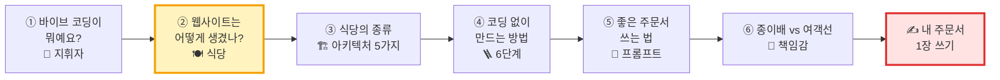

| 파트 | 시간 | 핵심 질문 | 핵심 비유 |
|---|:---:|---|---|
| 오프닝 | 2분 | "어제 그린 종이, 오늘 진짜로 열어볼까?" | 📄→🌐 |
| ① 바이브 코딩이란 | 8분 | 왜 이제는 코딩을 몰라도 만들 수 있나? 초등학생도 하나? | 🎼 오케스트라 지휘자 · 🏫 학교 사례 · 🏆 공모전 |
| ② 웹사이트의 구조 | 8분 | 화면 뒤에는 무엇이 숨어 있나? | 🍽️ 홀 · 주방 · 창고 · 웨이터 |
| ③ 아키텍처 5가지 | 6분 | 우리 아이템은 어떤 식당이 필요한가? | 🏗️ 전단지 → 진짜 식당 |
| ④ 코딩 없이 만드는 6단계 | 6분 | 오늘·내일 무엇을 순서대로 하나? | 🪜 계단 |
| ⑤ 좋은 주문서 | 4분 | AI에게 어떻게 말해야 잘 알아듣나? | 📝 식당 주문서 |
| ⑥ 종이배 vs 여객선 | 2분 | "돌아간다"와 "믿고 쓴다"는 다르다 | 🚢 |
| 닫기 · 주문서 쓰기 | 4분 | 내 아이템을 한 장으로 주문하기 | ✍️ |

> **⏱ 시간이 밀리면** — ③의 아키텍처 4·5번(외부 AI·앱 확장)을 "나중 이야기"로 1분에 넘깁니다. **②(식당 구조)와 ⑤(주문서)는 절대 줄이지 마세요.** 2차시 실습이 이 두 개 위에서 돌아갑니다.

---

## 오프닝 (2분) — "종이가 웹사이트가 된다"

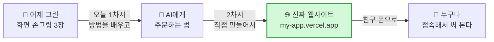

> **🗣️ 선생님 대사**
> "어제 여러분이 그린 손그림, 꺼내 볼까요? 이 종이가 **내일이 아니라 오늘** 진짜 웹사이트가 됩니다.
> 그리고 그 주소를 **엄마 폰, 친구 폰으로 열어볼 수** 있어요.
> 코딩을 몰라도 괜찮아요. 오늘 우리는 **코딩하는 사람**이 아니라 **지휘하는 사람**이 될 거예요."

---

# ① 바이브 코딩이란? (8분) — 🎼 "나는 지휘자, AI는 연주자"

## 1-1. 한 줄 정의

> ### 💬 **바이브 코딩 = AI에게 만들고 싶은 것을 말로 설명하고 → 결과를 보고 → 다시 다듬으며 완성하는 방법**

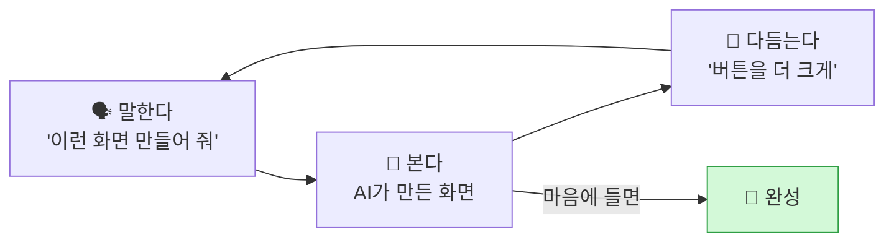

**왜 이름이 '바이브(vibe·느낌)'일까요?**
코드 한 줄 한 줄을 외우는 대신, **"이런 느낌으로!"** 라고 말하면 AI가 코드를 써 주기 때문이에요.

## 1-2. 비유 — 오케스트라 지휘자

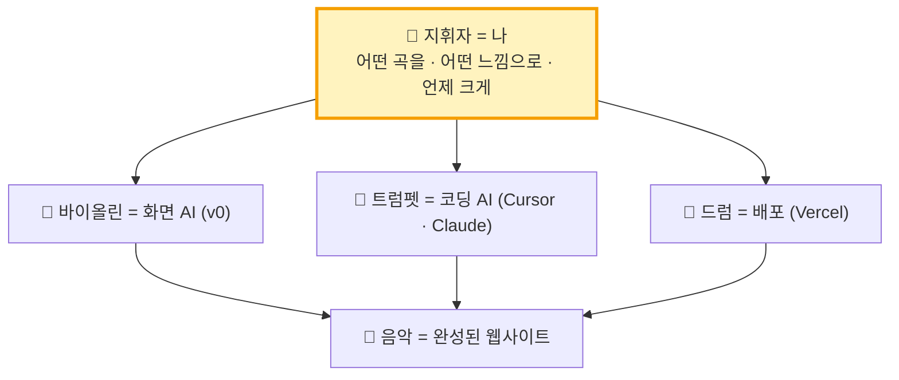

> **🗣️ 선생님 대사**
> "지휘자는 바이올린을 직접 켜지 않아요. 그래도 음악은 지휘자 것이죠?
> **무슨 곡을, 어떤 느낌으로 할지 정하는 사람**이니까요. 바이브 코딩에서 그게 바로 여러분이에요."

| | 🧑 사람(지휘자)이 하는 일 | 🤖 AI(연주자)가 하는 일 |
|---|---|---|
| 무엇을 | **무엇을 · 왜 · 누구를 위해** 만들지 정한다 | 코드를 쓴다 |
| 어떻게 | 원하는 모습을 **말로 설명**한다 | 화면을 그린다 |
| 확인 | **눌러 보고 이상한 걸 찾는다** | 고치라는 곳을 고친다 |
| 책임 | **"이거 써도 안전해?"를 판단**한다 | (책임은 못 진다) |

## 1-3. 왜 이제는 이렇게 만들까? — 옛날 방식 vs 바이브 코딩

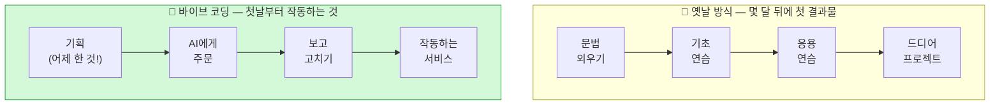

| | 옛날 방식 | 바이브 코딩 |
|---|---|---|
| 먼저 배우는 것 | 문법 (영어 단어 외우기처럼) | **문제 찾기 · 기획** |
| 남는 것 | 연습용 코드 | **친구가 쓸 수 있는 진짜 서비스** |
| 중요한 능력 | 많이 외운 사람 | **좋은 질문을 하는 사람** |

**⏱ 속도 비교 — 작은 서비스 하나 만들기**

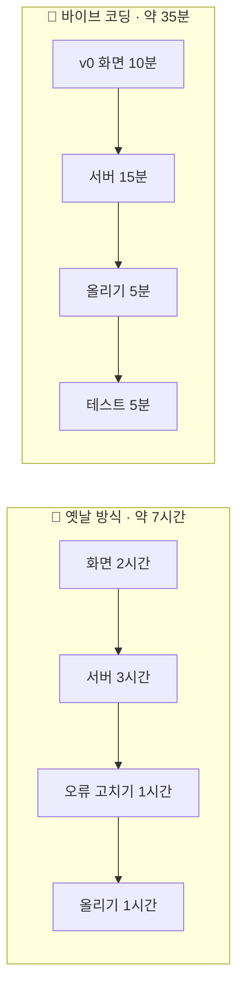

> **❓ 그럼 코딩 공부는 필요 없나요?** — 아니에요. 지휘자도 악기 소리를 **알아들어야** 틀린 음을 잡아내요.
> 오늘은 **코드를 쓰는 법**이 아니라 **코드가 어떻게 생겼는지 '알아보는 눈'** 을 키우는 첫날이에요.

## 1-4. 초등학생도 벌써 하고 있어요 — 학교 수업이 된 바이브 코딩 🏫

> **왜 이 이야기를 하나요?** — "이건 어른 개발자나 하는 거 아니에요?"라는 걱정을 없애기 위해서예요.
> 2026학년도에 **인천석암초등학교**는 바이브 코딩 강사를 공개 채용했어요. **4~6학년 정규수업**과 **동아리** 모두에서 운영해요. (학교 채용 공고, 2026. 9.)

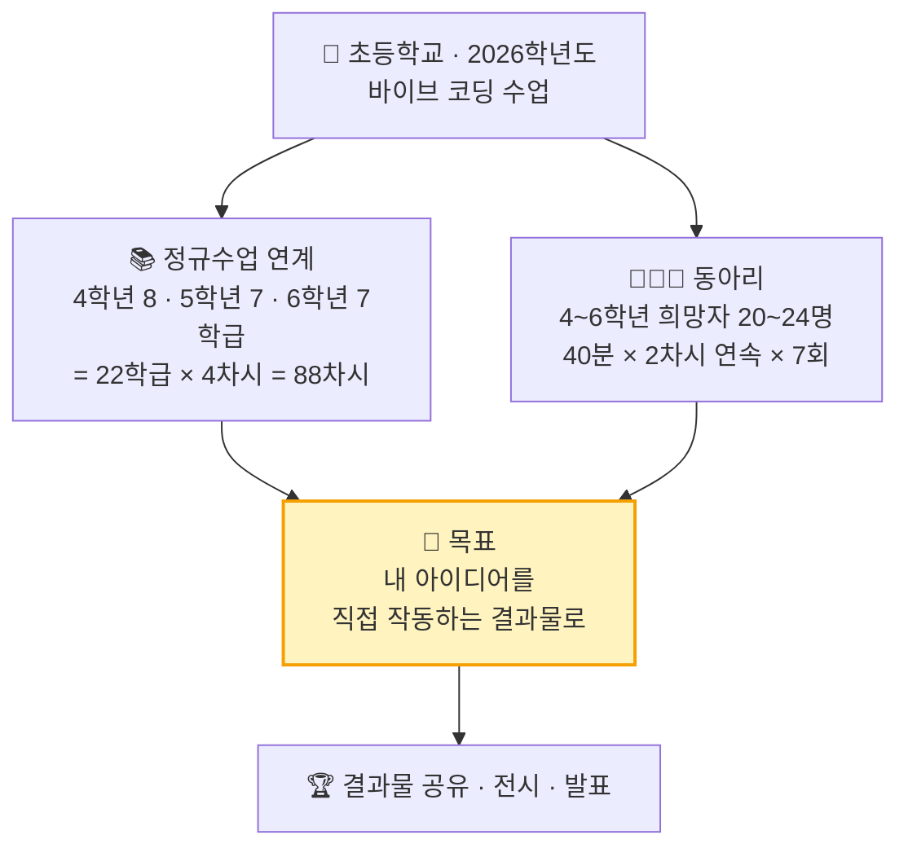

| 공고에 나온 것 | 우리 수업과의 연결 |
|---|---|
| 바이브 코딩 = **"AI에게 말로 설명하고 대화를 주고받으며 앱·웹·게임을 완성하는 코딩"** | 오늘 배운 정의와 같아요 → 🎼 지휘자 |
| 초점: **"초등학생이 자기 아이디어를 직접 작동하는 결과물로 만들어 보는 경험"** | 1~2일차 아이디어 → 3일차 **작동하는 웹사이트** |
| 동아리: **40분 × 2차시 연속** | 오늘 **1차시 이론 + 2차시 실습**과 같은 구성 |
| 학교가 **기기·네트워크·AI 도구 계정**을 준비 | 2차시 v0 계정은 **학교·선생님이 미리 준비**합니다 |
| 산출물 **공유·전시·발표** | 2차시 끝에 **배포 주소 + QR** → 공모전·발표회로 연결 |

> **🗣️ 선생님 대사**
> "여러분 또래 친구들이 **학교 수업 시간에** 이걸 하고 있어요. 4학년도 해요.
> 그러니까 오늘 여러분이 못 할 이유가 하나도 없어요."

## 1-5. 공모전까지 가는 길 🏆

> **왜 공모전이 연결되나요?** — 공모전 심사위원이 가장 좋아하는 건 **"진짜로 작동하는 것"** 과 **"사람들이 써 본 흔적"** 이에요. 바이브 코딩은 이 둘을 **며칠 만에** 만들게 해 줘요.

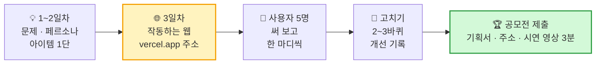

| 공모전에서 보는 것 | 우리가 이미 가진 것 |
|---|---|
| 🎯 문제를 잘 찾았나? | 1일차 문제 정의 · 페르소나 |
| 🧩 해결 방법이 새로운가? | 2일차 1단 심장 · 3렌즈 |
| ⚙️ **진짜로 작동하나?** | **3일차 배포 주소 (오늘!)** |
| 🙋 사람들이 써 봤나? | 사용자 5명 한 마디 · 개선 기록 |
| 🎤 잘 설명하나? | 시연 영상 3분: **문제 → 해결 → 반응** |

## 1-6. 한 프로젝트, 네 개의 모자 🎩

한 사람이 모자를 바꿔 쓰며 네 가지 역할을 **빙글빙글** 돌아요. 3인 1팀은 모자를 나눠 씁니다.

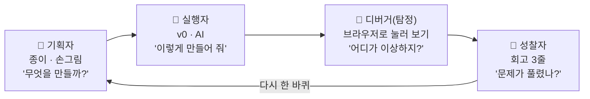

| 모자 | 비유 | 하는 일 | 2차시 담당 |
|---|---|---|---|
| 🎩 기획자 | 🗺️ 지도 그리는 사람 | 손그림·주문서를 들고 "이게 맞아?" 확인 | 팀원 A |
| 🎩 실행자 | ⌨️ 주문하는 사람 | v0에 주문서를 입력 | 팀원 B |
| 🎩 디버거 | 🕵️ 탐정 | 눌러 보고 이상한 곳을 찾아 적기 | 팀원 C |
| 🎩 성찰자 | 🪞 거울 | 셋이 함께 "처음 문제가 풀렸나?" 돌아보기 | 모두 |

> 2차시에는 **프롬프트 한 번마다 모자를 시계방향으로 돌립니다.** 키보드를 한 명이 독차지하지 않게요.

---

# ② 웹사이트는 어떻게 생겼나? (8분) — 🍽️ "웹사이트는 식당이다"

> **오늘의 심장 파트.** 이 비유 하나로 "프론트·서버·데이터베이스·API·배포"를 전부 설명합니다.

## 2-1. 식당 한 장 그림

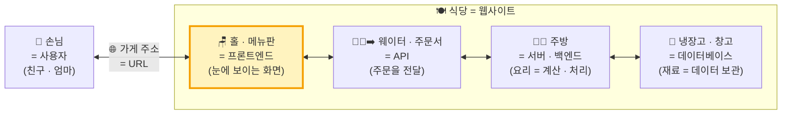

| 식당 | 웹사이트 용어 | 하는 일 | 오늘 만드나? |
|---|---|---|:---:|
| 🙋 손님 | **사용자** | 들어와서 메뉴를 보고 주문 | — |
| 🏠 가게 주소 | **URL** (주소) | `my-app.vercel.app` 처럼 찾아오는 길 | ✅ |
| 🏢 상가 건물 | **호스팅 (Vercel)** | 가게를 차릴 자리를 빌려줌 | ✅ |
| 🪑 홀 · 메뉴판 · 인테리어 | **프론트엔드** | 눈에 보이는 화면, 버튼, 색 | ✅ **오늘의 주인공** |
| 🍱 진열장 모형 음식 | **가짜 데이터 (JSON)** | 진짜 요리 전에 "이런 메뉴예요" 보여주기 | ✅ |
| 🗄️ 내 책상 서랍 | **localStorage** | 내 기기에만 잠깐 넣어 두는 메모 | ✅ |
| 🧑‍🍳 웨이터 · 주문서 | **API** | 홀과 주방 사이에서 주문 전달 | ⏭ 다음에 |
| 👨‍🍳 주방 | **서버 · 백엔드** | 요리(계산·저장·로그인 확인) | ⏭ 다음에 |
| 🧊 냉장고 · 창고 | **데이터베이스** | 모든 손님의 재료(데이터)를 보관 | ⏭ 다음에 |
| 🔐 주방 출입 금지 | **보안 · 권한** | 손님이 주방에 함부로 못 들어가게 | ⏭ 다음에 |

> **🗣️ 선생님 대사**
> "식당에 가면 손님은 **홀만** 봐요. 주방은 안 보이죠. 그런데 주방이 없으면 음식이 안 나와요.
> 웹사이트도 똑같아요. 우리가 보는 화면은 **홀**이고, 그 뒤에 **주방(서버)** 과 **냉장고(데이터베이스)** 가 숨어 있어요.
> **오늘은 홀부터 예쁘게 차립니다.** 주방은 나중에 지어도 돼요. 왜냐고요? 다음 장에서 볼게요."

## 2-2. 화면(프론트)은 무엇으로 만들어지나 — 🏠 집 짓기

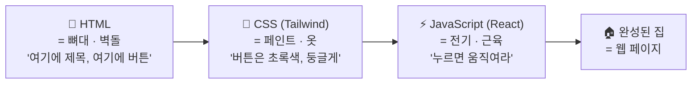

| 재료 | 비유 | 예시 | 누가 쓰나? |
|---|---|---|---|
| HTML | 🧱 집의 뼈대 | 제목, 글, 버튼, 사진 자리 | 🤖 AI |
| CSS · Tailwind | 🎨 페인트 · 옷 | 색깔, 크기, 둥근 모서리 | 🤖 AI |
| JavaScript · React | ⚡ 전기 · 스위치 | 버튼을 누르면 목록이 바뀜 | 🤖 AI |
| **설계도 · 주문서** | 📐 **건축주의 요청** | **"초록 버튼을 누르면 정답이 보여요"** | 🧑 **나!** |

> **핵심** — 벽돌·페인트·전기는 **AI(일꾼)** 가 합니다. 우리는 **건축주**예요. "어떤 집을 원하는지" 정확히 말하는 사람이 집을 잘 짓습니다.

## 2-3. 손님이 버튼을 누르면 무슨 일이? — 주문 한 번의 여행

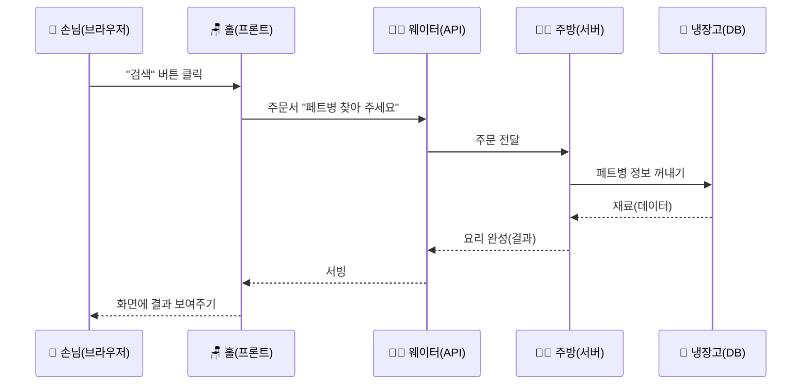

**오늘(프론트만)은 이 여행이 훨씬 짧아요** — 주방 대신 **진열장의 모형 음식**을 바로 보여줍니다.

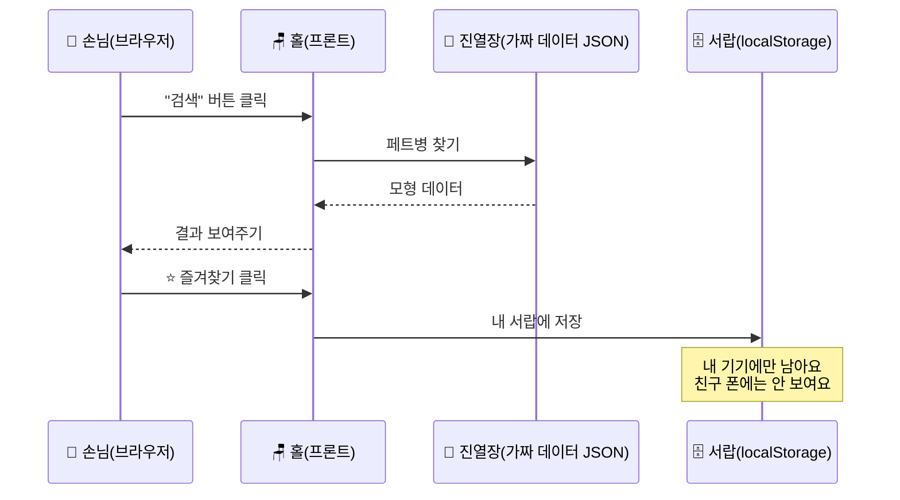

---

# ③ 식당의 종류 — 아키텍처 5가지 (6분) 🏗️

> **아키텍처(architecture)** = **건물 설계 방식.** 웹사이트도 "어떤 식당이냐"에 따라 필요한 방이 달라요.
> **왜 알아야 하나요?** — 떡볶이 포장마차에 대형 냉장 창고는 필요 없어요. **필요한 만큼만 지어야** 돈과 시간이 안 새요.

## 3-1. 다섯 가지 식당 한눈에

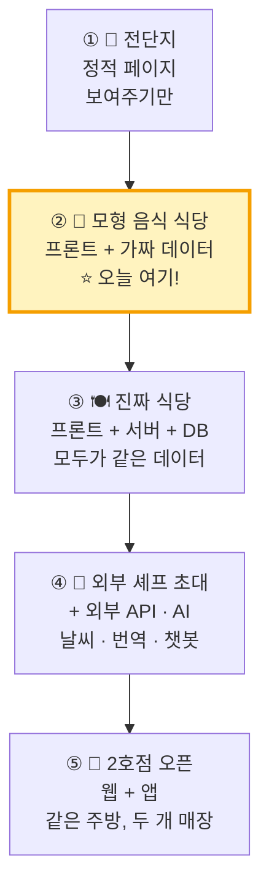

## 3-2. 한 장씩 자세히

### ① 📄 전단지 — 정적 페이지 (Static Page)

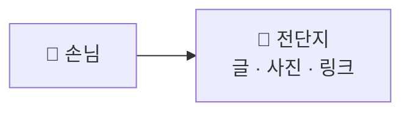

| 할 수 있는 것 | 할 수 없는 것 | 예시 |
|---|---|---|
| 읽기, 사진 보기, 링크 누르기 | 저장, 검색, 로그인 | 자기소개 페이지, 동아리 홍보 |

### ② 🍱 모형 음식 식당 — 프론트 + 가짜 데이터 ⭐ **오늘 만드는 것**

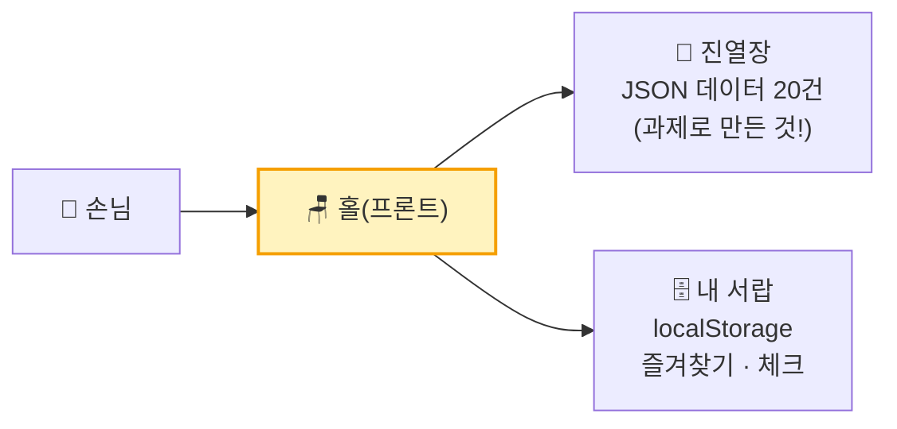

| 할 수 있는 것 | 할 수 없는 것 | 예시 |
|---|---|---|
| 목록 보기, **검색·필터**, 퀴즈, 계산기, **내 기기에 즐겨찾기 저장** | 다른 사람과 데이터 공유, 로그인 | 분리수거 도우미, 단어 퀴즈, 급식 메뉴 보기 |

**왜 오늘은 ②번부터?** — 3가지 이유

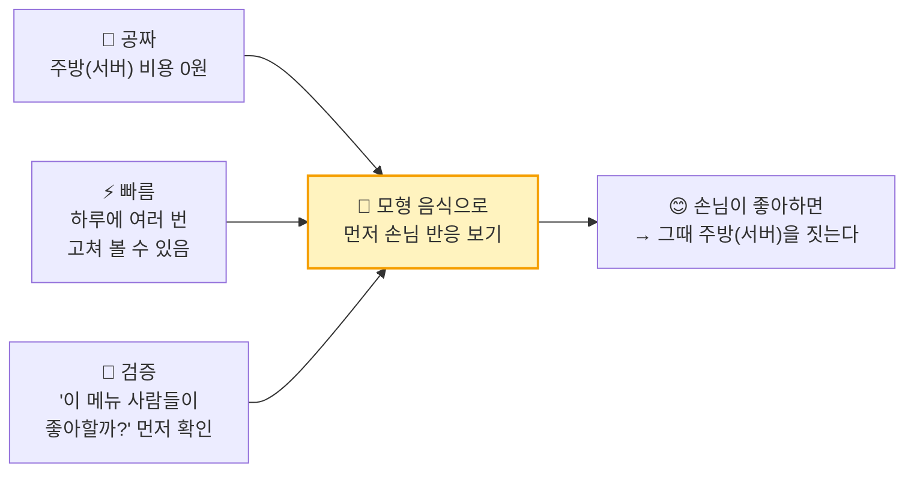

> **🗣️ 선생님 대사**
> "새 식당을 열 때, 주방부터 큰돈 들여 지으면 어떻게 될까요? 손님이 안 오면 망하죠.
> 똑똑한 사장님은 **모형 음식부터 진열**해서 '사람들이 이 메뉴 보고 들어오나?'를 먼저 봐요.
> 이걸 **프론트 퍼스트(화면 먼저)** 라고 해요. 오늘 우리가 하는 방법이에요."

### ③ 🍽️ 진짜 식당 — 프론트 + 서버 + 데이터베이스

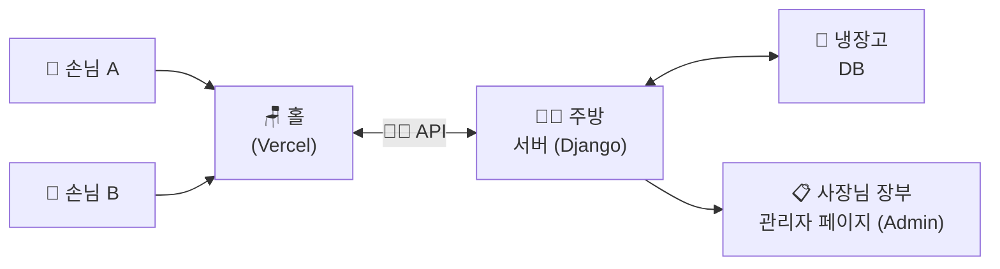

| 할 수 있는 것 | 언제 필요해요? | 예시 |
|---|---|---|
| 회원가입·로그인, 모두가 함께 보는 게시판, 랭킹 | **"내 데이터가 친구 폰에도 보여야 해!"** 할 때 | 반 투표, 학급 게시판, 점수 랭킹 |

> **💡 서랍(localStorage) vs 냉장고(DB)** — 서랍은 **내 책상에만** 있어요. 친구는 못 열어요. 냉장고는 **식당 모두가** 같이 써요.
> | | 🗄️ 서랍 (localStorage) | 🧊 냉장고 (데이터베이스) |
> |---|---|---|
> | 어디에? | 내 브라우저 안 | 식당(서버) 안 |
> | 누가 봐요? | **나만** | **모든 손님** |
> | 크기 | 작아요 (약 5MB) | 아주 커요 |
> | 넣으면 안 되는 것 | ❌ 비밀번호 · 이름 · 전화번호 | 지켜서 넣어야 함 |
> | 비용 | 0원 | 돈이 들 수 있음 |

### ④ 🛵 외부 셰프 초대 — 외부 API · AI 연결

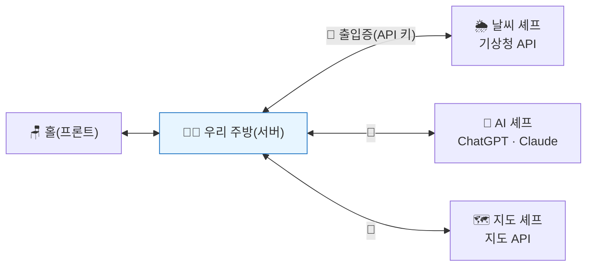

- 우리가 다 만들 필요 없이, **잘하는 외부 셰프에게 요리를 맡기는** 방식이에요.
- **🔑 출입증(API 키)은 절대 홀(프론트)에 두면 안 돼요!** 손님이 주워 가서 마음대로 쓰면 **요금 폭탄**이 나와요. → 반드시 **주방(서버) 금고**에 보관.

### ⑤ 🏬 2호점 오픈 — 웹에서 앱으로

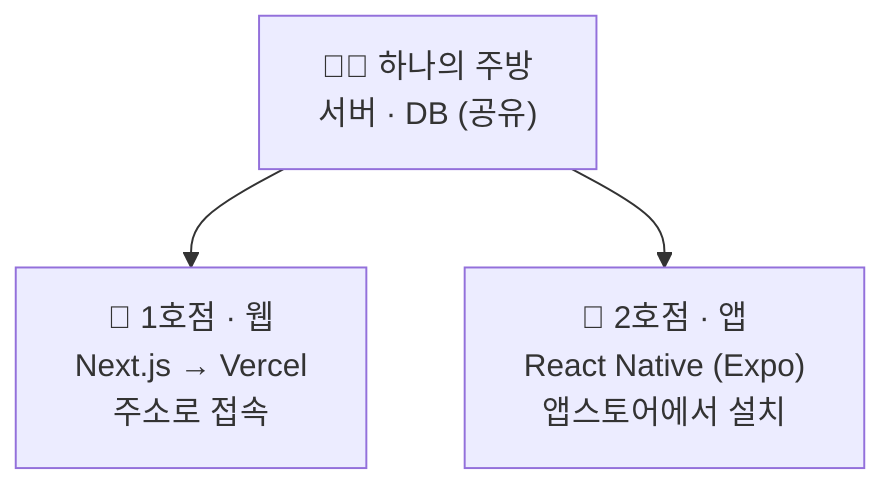

| | 🏪 웹 (1호점) | 📱 앱 (2호점) |
|---|---|---|
| 인테리어(태그) | `div` · `span` | `View` · `Text` |
| 서랍 | localStorage | AsyncStorage |
| 가게 위치 | Vercel 주소 | 앱스토어 |
| **주방 · 메뉴(데이터)** | **똑같이 공유!** | **똑같이 공유!** |

> **핵심** — 겉모습(인테리어)만 바뀌고 **주방과 메뉴는 그대로** 씁니다. 그래서 **처음에 데이터 모양(메뉴판)을 잘 정해 두는 것**이 중요해요.

## 3-3. 우리 아이템은 몇 번 식당? — 30초 판별 사다리

```mermaid
flowchart TD
    Q1{"글·사진만<br/>보여주면 끝?"} -->|"네"| A1["① 📄 전단지"]
    Q1 -->|"아니요"| Q2{"내 데이터가<br/>친구 폰에도<br/>보여야 해?"}
    Q2 -->|"아니요"| A2["② 🍱 모형 음식 식당<br/>⭐ 오늘 바로 가능"]
    Q2 -->|"네"| Q3{"날씨·AI 같은<br/>바깥 능력이<br/>필요해?"}
    Q3 -->|"아니요"| A3["③ 🍽️ 진짜 식당"]
    Q3 -->|"네"| A4["④ 🛵 외부 셰프"]
    A3 -.->|"오늘은 ②번 모양으로<br/>먼저 흉내 내기"| A2
    A4 -.->|"오늘은 ②번 모양으로<br/>먼저 흉내 내기"| A2
    style A2 fill:#fff3bf,stroke:#f59f00,stroke-width:3px
```

> **🗣️ 선생님 대사**
> "③번, ④번이 나와도 괜찮아요! **오늘은 전부 ②번처럼 먼저 만들어요.**
> 랭킹이 필요하면 가짜 랭킹 20개를 진열하고, AI 답변이 필요하면 **'AI가 이렇게 답했다'고 미리 써 둔 예시 답**을 보여주면 돼요.
> 이걸 **'흉내 내기(목업, mock-up)'** 라고 해요. 손님 반응을 보는 데는 이걸로 충분해요."

---

# ④ 코딩 없이 화면을 만드는 6단계 (6분) 🪜

> 참고 사이트의 **"프론트 퍼스트(Phase 1)"** 를 초등 버전 6계단으로 바꿨어요.

## 4-1. 전체 계단

```mermaid
flowchart LR
    S1["1️⃣ 손그림<br/>📄 종이<br/>(어제 과제)"] --> S2["2️⃣ 주문서<br/>📝 프롬프트<br/>(오늘 1차시)"]
    S2 --> S3["3️⃣ 화면 만들기<br/>🎨 v0<br/>(2차시)"]
    S3 --> S4["4️⃣ 모형 음식<br/>🍱 가짜 데이터<br/>(2차시)"]
    S4 --> S5["5️⃣ 탐정 놀이<br/>🕵️ 테스트·수정<br/>(2차시)"]
    S5 --> S6["6️⃣ 가게 오픈<br/>🌐 Vercel 배포<br/>(2차시)"]
    S6 -.->|"손님 의견 듣고<br/>다시 한 바퀴"| S2
    style S2 fill:#ffe3e3,stroke:#e03131,stroke-width:3px
```

## 4-2. 계단마다 "왜?"와 "무슨 기능?"

| 계단 | 하는 일 | **왜 필요해요?** (비유) | 도구 | 결과물 |
|---|---|---|---|---|
| 1️⃣ 손그림 | 화면 3장 그리기 (입력→처리→결과) | 🗺️ 지도 없이 출발하면 길을 잃어요 | 종이·펜 | 손그림 3장 |
| 2️⃣ 주문서 | 손그림을 **글로** 옮기기 | 📝 식당에서 "맛있는 거 주세요"하면 아무거나 나와요 | 종이 | 프롬프트 1장 |
| 3️⃣ 화면 | v0에 주문하고 화면 받기 | 🎨 인테리어 디자이너에게 도면 맡기기 | **v0** | 첫 화면 |
| 4️⃣ 모형 음식 | 데이터 20건 붙이기 | 🍱 빈 진열장은 손님이 안 들어와요 | v0 + JSON | 데이터가 보이는 화면 |
| 5️⃣ 탐정 놀이 | 눌러 보고 이상한 곳 고치기 | 🕵️ 개업 전 리허설 — 손님이 먼저 발견하면 창피해요 | 브라우저 | 고친 화면 |
| 6️⃣ 가게 오픈 | 인터넷 주소 만들기 | 🏠 주소가 없으면 아무도 못 찾아와요 | **Vercel** | `○○.vercel.app` |

## 4-3. 도구 지도 — 누가 무슨 일을 하나

```mermaid
flowchart LR
    subgraph PLAN["🗺️ 기획"]
        T1["종이 · 펜"]
        T2["ChatGPT · Claude<br/>(아이디어 상담)"]
    end
    subgraph MAKE["🎨 화면 만들기 (AI 스튜디오)"]
        T3["⭐ v0<br/>(오늘 쓸 것)"]
        T4["Bolt · Lovable<br/>Google AI Studio"]
    end
    subgraph CODE["🔧 코드 다듬기 (나중에)"]
        T5["Cursor · Claude Code"]
    end
    subgraph OPEN["🌐 가게 오픈"]
        T6["⭐ Vercel<br/>(오늘 쓸 것)"]
        T7["GitHub<br/>(코드 보관 창고)"]
    end
    PLAN --> MAKE --> OPEN
    MAKE -.-> CODE -.-> OPEN
    style T3 fill:#fff3bf,stroke:#f59f00,stroke-width:2px
    style T6 fill:#fff3bf,stroke:#f59f00,stroke-width:2px
```

**왜 v0 + Vercel인가요?**

| 이유 | 설명 (비유) |
|---|---|
| 🤝 한 회사 | v0와 Vercel은 같은 회사 제품 → **인테리어 업체와 건물주가 같아서** 버튼 하나로 가게 오픈 |
| 🖼️ 그림을 알아봐요 | **손그림 사진을 올리면** 그걸 보고 화면을 만들어요 |
| 👀 바로 보여요 | 왼쪽에 주문하면 오른쪽에 **바로 미리보기** |
| ⏪ 되돌리기 | 망쳐도 **이전 버전으로 돌아가기** 가능 (게임 세이브 포인트처럼) |
| 🏭 진짜 도구 | 현업 개발자들이 실제로 쓰는 Next.js · Tailwind 코드를 만들어요 |

## 4-4. 나중에 주방을 지을 때도 괜찮을까? — "통로 하나" 원칙

```mermaid
flowchart LR
    P["🪑 홀(화면)<br/>절대 안 바뀜"] --> R["🚪 통로 하나<br/>lib/repo.ts<br/>(데이터 가져오는 문)"]
    R -->|"지금"| J["🍱 진열장<br/>JSON 파일"]
    R -.->|"나중에<br/>스위치만 딸깍"| A["👨‍🍳 주방<br/>서버 API"]
    style R fill:#fff3bf,stroke:#f59f00,stroke-width:2px
```

> **비유** — 홀과 주방 사이에 **문을 딱 하나만** 만들어 둬요. 지금은 그 문 뒤에 진열장이 있고, 나중에 주방을 지으면 **문 뒤만 바꾸면** 돼요. **홀(화면) 코드는 한 줄도 안 고쳐요.**
> 2차시 프롬프트에 *"데이터는 한 곳에서만 불러오게 해 줘"* 라는 문장이 들어가는 이유예요.

---

# ⑤ 좋은 주문서 쓰는 법 (4분) 📝

## 5-1. 나쁜 주문 vs 좋은 주문

```mermaid
flowchart LR
    B["😵 '분리수거<br/>앱 만들어 줘'"] -->|"AI가 마음대로"| BR["🤷 내가 원한 것과<br/>전혀 다른 화면"]
    G["😎 '초등학생이 쓰레기 이름을<br/>검색하면 버리는 통 색깔과<br/>방법이 카드로 나오는 화면…'"] -->|"AI가 정확히"| GR["🎯 손그림과<br/>비슷한 화면"]
    style GR fill:#d3f9d8,stroke:#2f9e44
    style BR fill:#ffe3e3,stroke:#e03131
```

> **비유** — 식당에서 "밥 주세요"하면 **아무 밥**이 나와요. "**김치볶음밥, 계란 반숙, 덜 맵게**"라고 해야 원하는 게 나와요.

## 5-2. 주문서 5칸 공식 — **누·무·화·데·모**

```mermaid
flowchart TB
    N["👤 누가<br/>누가 쓰나요?<br/>(페르소나)"] --> M["🎯 무엇을<br/>무엇을 해결하나요?<br/>(1단 심장)"]
    M --> H["🖼️ 화면<br/>화면 몇 개, 순서는?<br/>(손그림 3장)"]
    H --> D["🍱 데이터<br/>어떤 정보가 보이나요?<br/>(데이터 20건)"]
    D --> MO["🎨 모양<br/>색 · 크기 · 느낌<br/>(바이브!)"]
    style M fill:#fff3bf,stroke:#f59f00,stroke-width:2px
```

| 칸 | 어제 워크시트 어디서 가져오나 | 예시 (분리수거 도우미) |
|---|---|---|
| 👤 누가 | 칸 ③ 페르소나 | 분리수거가 헷갈리는 **초등 5학년** |
| 🎯 무엇을 | 칸 ⑤ 1단 심장 | **쓰레기 이름을 검색하면 → 버리는 방법이 보인다** |
| 🖼️ 화면 | 손그림 3장 | ① 검색창 화면 ② 결과 카드 화면 ③ 즐겨찾기 화면 |
| 🍱 데이터 | 데이터 20건 | 이름 · 버리는 통(플라스틱/종이/캔/일반) · 방법 한 줄 |
| 🎨 모양 | 칸 ① 큰 주제 | 초록색, 큰 버튼, 둥근 카드, 이모지, **휴대폰에서 잘 보이게** |

## 5-3. 주문할 때 꼭 지킬 약속 4가지

```mermaid
flowchart LR
    R1["1️⃣ 한 번에<br/>한 가지만<br/>🍳 요리 하나씩"] --> R2["2️⃣ 구체적인<br/>숫자·색깔<br/>📏"]
    R2 --> R3["3️⃣ 결과를 보고<br/>'왜?'라고 다시 묻기<br/>🔁"]
    R3 --> R4["4️⃣ 개인정보·비밀번호<br/>절대 안 넣기<br/>🔒"]
```

| 약속 | 이유 (비유) |
|---|---|
| 1️⃣ 한 번에 한 가지 | 주방에 주문 10개를 한 번에 외치면 **하나는 꼭 빠져요.** 뭐가 잘못됐는지도 몰라요 |
| 2️⃣ 숫자·색깔로 | "크게" ❌ → "버튼 높이 두 배, 초록색" ✅ |
| 3️⃣ 다시 묻기 | **한 번에 완벽한 주문은 없어요.** 다시 묻는 게 실력이에요 |
| 4️⃣ 개인정보 금지 | 진짜 이름·전화번호·주소는 **가짜(예: 김민준 → '학생A')** 로 바꿔요 |

---

# ⑥ 종이배 vs 여객선 (2분) 🚢

```mermaid
flowchart LR
    subgraph DEMO["⛵ 종이배 = 데모"]
        D1["나만 탄다"]
        D2["질문 5~10번"]
        D3["'일단 떠요'"]
    end
    subgraph SERVICE["🚢 여객선 = 서비스"]
        S1["낯선 사람이 탄다"]
        S2["질문 100번 이상"]
        S3["'문제 생기면 고칩니다'"]
    end
    DEMO -->|"질문이 쌓일수록"| SERVICE
    style SERVICE fill:#d3f9d8,stroke:#2f9e44
```

> **핵심 문장** — **"돌아간다"** 와 **"사람들이 믿고 쓴다"** 는 달라요.
> 좋은 결과물은 **좋은 첫 질문**이 아니라 **포기하지 않은 백 번째 질문**에서 나와요.

**2차시 탐정 놀이에서 쓸 '초등 버전 질문 10개'** (참고 사이트의 100개 질문에서 골랐어요)

| 그룹 | 탐정 질문 |
|---|---|
| 😶 텅 빈 상황 | ① 검색 결과가 0개면 화면에 뭐라고 나와요? |
| 🤪 이상한 입력 | ② 이모지 😀나 아주 긴 글(100자)을 넣으면 깨지나요? ③ 아무것도 안 쓰고 버튼을 누르면? |
| 📱 휴대폰 | ④ 휴대폰에서 글씨가 너무 작지 않나요? ⑤ 버튼이 손가락으로 누르기 쉬운가요? |
| 🔄 새로고침 | ⑥ 즐겨찾기 하고 새로고침하면 남아 있나요? |
| 👵 누구나 | ⑦ 할머니도 처음 보고 쓸 수 있나요? ⑧ 색깔만으로 구분하지 않나요? (색약 친구) |
| 🔒 안전 | ⑨ 진짜 이름·전화번호가 들어가 있지 않나요? |
| 🎯 처음 문제 | ⑩ **페르소나의 문제가 정말 풀렸나요?** ← 가장 중요 |

---

# 닫기 (4분) — ✍️ 내 주문서 1장 쓰기

## 주문서 양식 (A4 뒷면 또는 별지, 팀당 1장)

```
┌─────────────────────────────────────────────────────┐
│ 📝 우리 팀 주문서 (프롬프트)        팀: _______     │
├─────────────────────────────────────────────────────┤
│ 🏗️ 우리 식당 번호 :  ① ② ③ ④ ⑤   → 오늘은 ②번으로 │
├─────────────────────────────────────────────────────┤
│ 👤 누가   : ___________________ 가 쓰는             │
│ 🎯 무엇을 : ___________________ 하면                │
│             → ___________________ 가 보이는 웹사이트 │
│ 🖼️ 화면   : ① __________ ② __________ ③ __________ │
│ 🍱 데이터 : 항목 이름 ___ / ___ / ___  (20건)       │
│ 🎨 모양   : 색 ___ · 느낌 ___ · 휴대폰에서 잘 보이게 │
├─────────────────────────────────────────────────────┤
│ 🚫 일부러 안 넣을 것 (어제 칸 ⑧) : ___ / ___ / ___ │
└─────────────────────────────────────────────────────┘
```

> **🗣️ 선생님 대사 (마무리 30초)**
> "오늘 여러분은 코드를 한 줄도 안 썼어요. 그런데 **가장 중요한 걸** 썼어요 — 바로 **주문서**예요.
> 다음 시간에 이 주문서를 v0에 그대로 넣으면, **AI 일꾼이 홀을 차려 줄 거예요.**
> 그리고 그 가게를 **진짜 인터넷 주소**로 열어서, 친구 폰으로 들어와 보게 할 거예요."

## 1차시 → 2차시 연결

```mermaid
flowchart LR
    A["📝 1차시 결과물<br/>주문서 1장"] --> B["⌨️ 2차시 시작<br/>v0에 붙여넣기"]
    C["📄 손그림 3장"] -->|"📷 사진 찍어 첨부"| B
    D["🍱 데이터 20건"] -->|"표로 붙여넣기"| B
    B --> E["🌐 우리 가게 주소"]
    style E fill:#d3f9d8,stroke:#2f9e44,stroke-width:2px
```

---

## 📎 부록 A. 용어 비유 사전 (교실 벽에 붙이기)

| 용어 | 🍽️ 식당 비유 | 한 줄 뜻 |
|---|---|---|
| 바이브 코딩 | 🎼 지휘하기 | 말로 설명해서 AI가 코드를 쓰게 하는 방법 |
| 프롬프트 | 📝 주문서 | AI에게 하는 부탁의 글 |
| 프론트엔드 | 🪑 홀 · 메뉴판 | 눈에 보이는 화면 |
| 백엔드 · 서버 | 👨‍🍳 주방 | 보이지 않는 곳에서 계산·저장 |
| 데이터베이스 | 🧊 냉장고 · 창고 | 데이터를 오래, 모두를 위해 보관 |
| API | 🧑‍🍳 웨이터 | 홀과 주방 사이 주문 전달자 |
| API 키 | 🔑 주방 출입증 | 잃어버리면 남이 마음대로 써요 (요금 폭탄) |
| JSON | 🍱 진열장 모형 · 장보기 목록 | 데이터를 적어 두는 정해진 모양 |
| localStorage | 🗄️ 내 책상 서랍 | 내 브라우저에만 저장 |
| 배포 | 🎊 가게 오픈 | 인터넷에 올려 누구나 들어오게 하기 |
| URL | 🏠 가게 주소 | 찾아오는 길 |
| 호스팅 (Vercel) | 🏢 상가 건물주 | 가게 자리를 빌려주는 곳 |
| 아키텍처 | 🏗️ 건물 설계도 | 어떤 방이 몇 개, 어떻게 이어지나 |
| 디버깅 | 🕵️ 탐정 놀이 | 이상한 곳 찾아 고치기 |
| MVP | 🍙 맛보기 메뉴 | 가장 중요한 기능 하나만 있는 첫 버전 |
| 버전 · 되돌리기 | 💾 게임 세이브 포인트 | 망치면 이전으로 돌아가기 |

## 📎 부록 B. 슬라이드 구성안 (Gamma용 · 약 26장)

| # | 제목 | 레이아웃 | 핵심 내용 |
|:---:|---|---|---|
| S01 | 종이가 웹사이트가 된다 | 표지 | 📄 → 🌐 |
| S02 | 오늘의 길 | 6단계 가로 흐름 | 0장 첫 단계도 |
| S03 | 바이브 코딩이란? | 큰 글씨 1문장 | 말한다→본다→다듬는다 |
| S04 | 나는 지휘자 | 중앙 + 4갈래 | 오케스트라 |
| S05 | 사람 vs AI 역할 | 2열 비교 | 1-2 표 |
| S06 | 옛날 방식 vs 바이브 코딩 | 2단 타임라인 | 몇 달 vs 첫날 |
| S07 | 7시간 vs 35분 | 막대 비교 | 속도 |
| S08a | 초등학생도 벌써 해요 | 학교 사례 도식 | 1-4 · 22학급 · 동아리 |
| S08b | 공모전까지 가는 길 | 5단계 흐름 | 1-5 |
| S08 | 네 개의 모자 | 순환 4칸 | 기획·실행·디버거·성찰 |
| S09 | **웹사이트 = 식당** | 큰 일러스트 | ⭐ 2-1 그림 |
| S10 | 식당 사전 | 표 → 아이콘 그리드 | 10개 용어 |
| S11 | 집 짓기: HTML·CSS·JS | 3단계 | 뼈대·페인트·전기 |
| S12 | 주문 한 번의 여행 | 시퀀스 | 손님→냉장고→손님 |
| S13 | 오늘은 짧은 여행 | 시퀀스 | 진열장·서랍 |
| S14 | 식당의 종류 5가지 | 계단 | 전단지→2호점 |
| S15 | ② 모형 음식 식당 ⭐ | 강조 | 오늘 만드는 것 |
| S16 | 왜 화면 먼저? | 3갈래 → 1 | 공짜·빠름·검증 |
| S17 | ③ 진짜 식당 · 서랍 vs 냉장고 | 2열 비교 | |
| S18 | ④ 외부 셰프 · ⑤ 2호점 | 2분할 | API 키 경고 |
| S19 | 우리는 몇 번 식당? | 판별 사다리 | 3-3 |
| S20 | 코딩 없이 6계단 | 계단 | 4-1 |
| S21 | 왜 v0 + Vercel? | 아이콘 5개 | 4-3 표 |
| S22 | 주문서 5칸 — 누·무·화·데·모 | 세로 5단 | 5-2 |
| S23 | 종이배 vs 여객선 | 2열 비교 | 탐정 질문 10개 |
| S24 | 내 주문서 쓰기 + 2차시 예고 | 양식 | 닫기 |

> **🎨 이미지 프롬프트 공통 꼬리말** — `friendly flat vector illustration, cozy restaurant metaphor, Korean elementary students (age 11), navy teal and coral palette with mustard yellow accent, white background, no text`
> - S09 예: `cross-section of a small friendly restaurant showing dining hall with menu board, waiter carrying order slip, kitchen with chef, big refrigerator in the back, customers at the door, ` + 꼬리말
> - S04 예: `a child conductor with a baton leading a small orchestra of cute robots playing violin trumpet and drums, ` + 꼬리말
