# 3일차 · **2차시** — v0로 우리 가게(홀)를 차리고 문을 연다 (실습)
## 성격: **손이 움직이는 시간** — 선생님은 설명을 줄이고, 학생이 주문하고 · 보고 · 고칩니다

> **앞 시간(1차시)에 한 것** — 🍽️ 웹사이트 = 식당 비유로 **프론트(홀) · 서버(주방) · DB(냉장고) · API(웨이터)** 를 배우고, **주문서(프롬프트) 1장**을 썼습니다.
> **이 시간에 하는 것** — 그 주문서를 **v0**에 넣어 화면을 만들고, **Vercel**로 가게 문을 열어 **진짜 인터넷 주소**를 받습니다.
> **⬅️ 앞 문서** — `3일차_1차시_바이브코딩_이론.md`

| 항목 | 내용 |
|---|---|
| **대상** | 초등 5학년 · 3인 1팀 |
| **시간** | 40분 (실습) — 1차시와 **연속 운영**(40분 + 쉬는 시간 + 40분) |
| **도구** | **v0** (화면 만드는 AI) + **Vercel** (가게 오픈) · 크롬 브라우저 · 팀당 노트북 1대 + 휴대폰 1대(확인용) |
| **가져올 것** | 1차시 **주문서 1장** · 2일차 **손그림 3장** · **데이터 20건** |
| **만드는 식당** | 🍱 **② 모형 음식 식당** = 프론트 + 가짜 데이터(JSON) + 내 서랍(localStorage) · **서버 없음** |
| **이 시간의 결과물** | ✅ 작동하는 화면 ✅ `○○.vercel.app` 주소 ✅ QR 코드 ✅ 회고 3줄 ✅ 공모전용 스크린샷 3장 |

---

## 0. 한눈에 보는 2차시

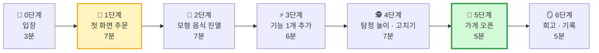

| 단계 | 시간 | 하는 일 | **왜 필요해요?** | 식당 비유 |
|---|:---:|---|---|---|
| 🔑 0 입장 | 0~3분 | v0 화면 둘러보기 | 도구를 모르면 주문도 못 해요 | 주방 견학 |
| 🎨 1 첫 화면 | 3~10분 | 손그림 사진 + 주문서 넣기 | 홀의 **뼈대**부터 세워요 | 인테리어 도면 맡기기 |
| 🍱 2 모형 음식 | 10~17분 | 데이터 20건 붙이기 | 빈 가게엔 손님이 안 와요 | 진열장 채우기 |
| ⚡ 3 기능 1개 | 17~23분 | 검색 · 필터 · 즐겨찾기 중 **딱 1개** | 1단 심장이 **뛰게** 만들어요 | 벨 누르면 직원이 와요 |
| 🕵️ 4 탐정 | 23~30분 | 눌러 보고 이상한 곳 고치기 | 손님보다 **먼저** 실수를 찾아요 | 개업 전 리허설 |
| 🎊 5 오픈 | 30~35분 | Publish → 주소 → QR | 주소가 없으면 아무도 못 와요 | 간판 달고 문 열기 |
| 🪞 6 회고 | 35~40분 | 회고 3줄 · 스크린샷 | 다음에 더 잘하려고 + 공모전 증거 | 오늘 장사 일기 |

> **⏱ 시간이 밀리면** — 3단계(기능 추가)를 **건너뛰고** 바로 4단계로 갑니다. **5단계(가게 오픈)는 절대 빼지 마세요.** 주소를 받아 친구 폰으로 열어 보는 순간이 이 수업의 하이라이트입니다.

---

## 🧰 수업 전 준비 (선생님용 · 전날까지)

> 학교 바이브 코딩 수업에서는 보통 **학교가 기기·네트워크·AI 도구 계정을 준비**하고, **강사가 수업 자료와 실습 예제를 준비**합니다. 아래 체크리스트를 그 기준으로 나눴어요.

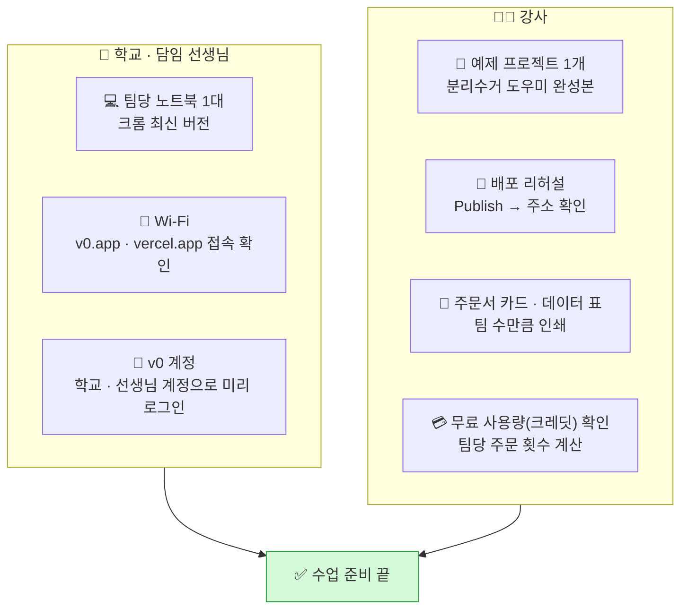

| # | 체크 | 왜 |
|:---:|---|---|
| 1 | ☐ **학생 개인 계정 대신 학교·선생님 계정** 사용 (서비스 이용 연령·약관 확인) | 초등학생이 직접 가입하지 않도록 · 개인정보 보호 |
| 2 | ☐ 수업 전 **모든 노트북에 로그인해 두기** | 로그인에 5분 쓰면 수업이 무너져요 |
| 3 | ☐ **무료 사용량(크레딧)** 확인 → 팀당 **주문 6~8번**으로 계획 | 한 번 주문할 때마다 사용량이 줄어요. 아껴 쓰는 것도 수업이에요 |
| 4 | ☐ 강사가 **예제 1개를 미리 만들고 Publish까지** 해 보기 | 화면 메뉴 이름·위치는 업데이트로 바뀔 수 있어요. **전날 실제 화면으로 확인** |
| 5 | ☐ 팀별 **데이터 20건을 미리 타이핑**(또는 표 사진 준비) | 초5는 20건 타이핑에 10분 이상 걸려요 |
| 6 | ☐ 데이터에 **진짜 이름·전화번호·주소 없는지** 확인 | 배포하면 **전 세계 누구나** 볼 수 있어요 |
| 7 | ☐ QR 코드 만들 방법 준비 (크롬 주소창 공유 → QR 생성) | 친구 폰으로 바로 열기 |

---

# 🔑 0단계 · 입장 (0~3분) — "AI 인테리어 사무실 둘러보기"

## 0-1. 오늘 쓰는 도구의 큰 그림

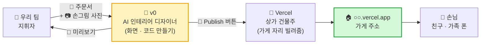

## 0-2. v0 화면은 세 부분이에요

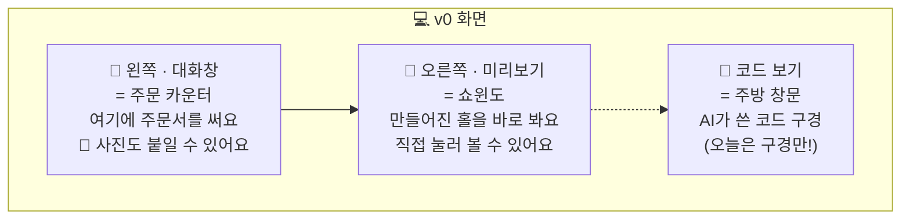

| 부분 | 비유 | 오늘 하는 일 |
|---|---|---|
| 💬 대화창 | 🧾 주문 카운터 | 주문서 붙여넣기, 📎 손그림 사진 첨부 |
| 👀 미리보기 | 🪟 쇼윈도 | 만들어진 화면을 **직접 눌러 보기** |
| 📂 코드 | 🔍 주방 창문 | **구경만** — "AI가 이렇게 많이 써 줬구나!" |
| ⏪ 버전 기록 | 💾 게임 세이브 포인트 | 망치면 **이전 버전으로 돌아가기** |
| 🎊 Publish(배포) 버튼 | 🎀 개업 테이프 커팅 | 5단계에서 딱 한 번 |

## 0-3. 팀 역할 — 모자 돌리기 🎩

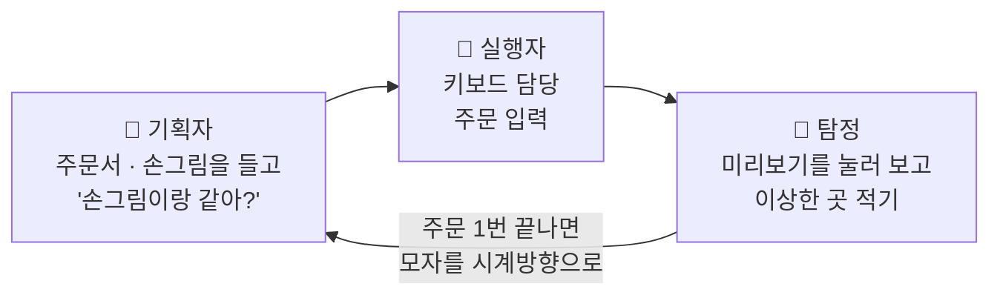

> **규칙 3가지**
> ① **주문 한 번마다** 모자를 돌립니다. 키보드를 한 명이 독차지하지 않아요.
> ② 실행자는 **소리 내어 읽으며** 입력합니다. 나머지 둘이 듣고 "잠깐!"을 외칠 수 있어요.
> ③ 탐정은 **포스트잇에 적기만** 하고, 고치는 주문은 다음 사람이 합니다.

---

# 🎨 1단계 · 첫 화면 주문 (3~10분) — "인테리어 도면 맡기기"

## 1-1. 왜 손그림 사진을 같이 보낼까?

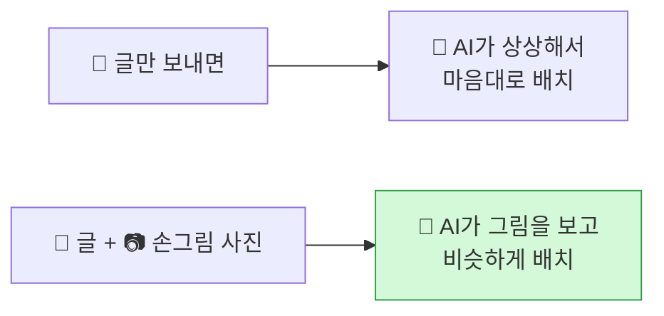

> **비유** — 미용실에서 "멋있게 잘라 주세요"보다 **사진 한 장 보여주는 게** 훨씬 정확하죠? AI도 같아요.

**📷 손그림 사진 잘 찍는 법** — ① 위에서 똑바로 ② 그림자 없이 밝게 ③ 3장을 **나란히 한 장에** ④ 글씨는 네임펜으로 진하게

## 1-2. 순서

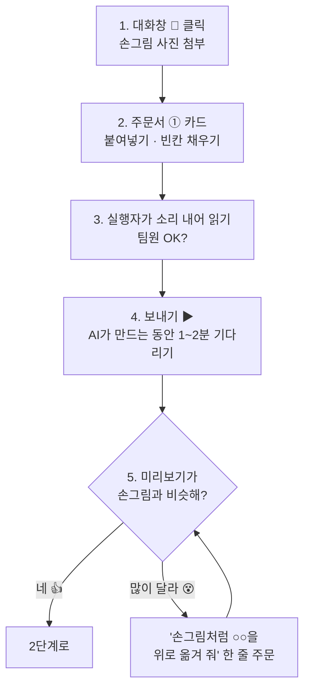

## 1-3. 📝 주문서 ① — 첫 화면 (복사해서 빈칸만 채우기)

```text
첨부한 손그림 사진 3장을 보고 웹사이트를 만들어 줘.

[누가] ________ 가 쓰는 웹사이트야.
[무엇을] ________ 하면 → ________ 가 보이는 게 핵심이야.
[화면] 화면은 3개야.
  ① ________ 화면
  ② ________ 화면
  ③ ________ 화면
[모양] ________ 색을 주로 쓰고, 버튼은 크고 둥글게, 이모지를 넣어 줘.
초등학생도 쉽게 쓸 수 있게 글씨는 크게, 휴대폰 화면에서 잘 보이게 해 줘.
[규칙] 아직 서버와 로그인은 만들지 마. 화면만 만들어 줘.
모든 글자는 한국어로 써 줘.
```

**✍️ 예시 — 분리수거 도우미**

```text
첨부한 손그림 사진 3장을 보고 웹사이트를 만들어 줘.

[누가] 분리수거가 헷갈리는 초등학교 5학년 학생이 쓰는 웹사이트야.
[무엇을] 쓰레기 이름을 검색하면 → 어느 통에 어떻게 버리는지가 보이는 게 핵심이야.
[화면] 화면은 3개야.
  ① 큰 검색창과 자주 찾는 쓰레기 버튼이 있는 첫 화면
  ② 버리는 통 색깔과 방법이 카드로 나오는 결과 화면
  ③ 내가 별표 한 쓰레기만 모아 보는 즐겨찾기 화면
[모양] 초록색을 주로 쓰고, 버튼은 크고 둥글게, 이모지를 넣어 줘.
초등학생도 쉽게 쓸 수 있게 글씨는 크게, 휴대폰 화면에서 잘 보이게 해 줘.
[규칙] 아직 서버와 로그인은 만들지 마. 화면만 만들어 줘.
모든 글자는 한국어로 써 줘.
```

> **❓ 왜 "[규칙] 서버와 로그인은 만들지 마"를 넣나요?**
> 1차시의 **② 모형 음식 식당**을 만들기 때문이에요. 이 말이 없으면 AI가 신이 나서 **주방(서버)·출입문(로그인)까지** 지으려고 해요. 그러면 복잡해지고, 사용량도 많이 써요.

> **🗣️ 선생님 대사** — "AI가 만드는 동안 **화면에 글씨가 막 흘러가죠?** 그게 AI가 쓰는 코드예요. 여러분이 쓴 몇 줄로 **수백 줄**이 나오고 있어요. 이게 지휘자의 힘이에요."

---

# 🍱 2단계 · 모형 음식 진열 (10~17분) — "빈 진열장 채우기"

## 2-1. 왜 우리 데이터 20건을 넣어야 할까?

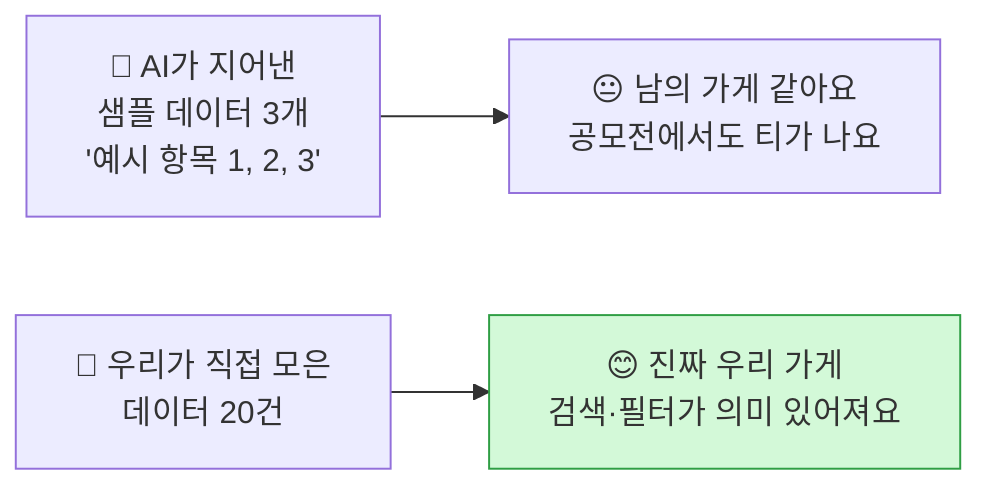

> **비유** — 식당 진열장에 **'음식 1, 음식 2'라고 쓴 빈 접시**를 놓으면 손님이 안 들어와요. **진짜 메뉴처럼 생긴 모형 음식 20개**가 있어야 "와, 먹어 보고 싶다!"가 나와요.

## 2-2. 데이터는 어떤 모양으로 저장될까? — 📋 표 → 🍱 JSON

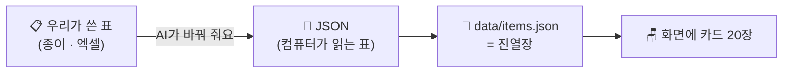

| 이름 | 통 | 방법 |
|---|---|---|
| 페트병 | 플라스틱 🟦 | 라벨 떼고, 찌그러뜨려요 |
| 우유팩 | 종이팩 🟨 | 씻어서 펼쳐 말려요 |
| … (20건) | … | … |

⬇ AI가 이렇게 바꿔 줘요 (**구경만** 해요)

```json
[
  { "id": 1, "name": "페트병", "bin": "플라스틱", "how": "라벨 떼고, 찌그러뜨려요" },
  { "id": 2, "name": "우유팩", "bin": "종이팩", "how": "씻어서 펼쳐 말려요" }
]
```

> **JSON 읽는 법 (1분)** — `{ }` 하나 = **모형 음식 하나(카드 한 장)** / `"name": "페트병"` = **이름표: 내용** / `[ ]` = **진열장 한 칸에 전부 담기**

## 2-3. 📝 주문서 ② — 데이터 붙이기

```text
아래 표의 데이터 20개를 data 폴더에 JSON 파일로 만들어서 화면에 보여 줘.
샘플 데이터는 지우고 이 데이터만 써 줘.
데이터는 한 곳(lib/repo.ts 같은 파일)에서만 불러오게 해 줘.
나중에 서버 API로 바꿀 때 화면 코드는 안 고쳐도 되게 해 줘.

항목: 이름 | ________ | ________
1. ____ | ____ | ____
2. ____ | ____ | ____
...
20. ____ | ____ | ____
```

> **💡 타이핑이 느리다면** — 데이터 표를 **📷 사진으로 찍어 첨부**하고 *"첨부한 표 사진의 데이터 20개를 JSON으로 만들어 화면에 보여 줘"* 라고 주문해도 돼요. 단, AI가 **잘못 읽은 글자가 없는지** 탐정이 꼭 확인해요.

> **❓ 왜 "한 곳에서만 불러오게"라고 하나요?** — 1차시 **"통로 하나" 원칙**이에요.

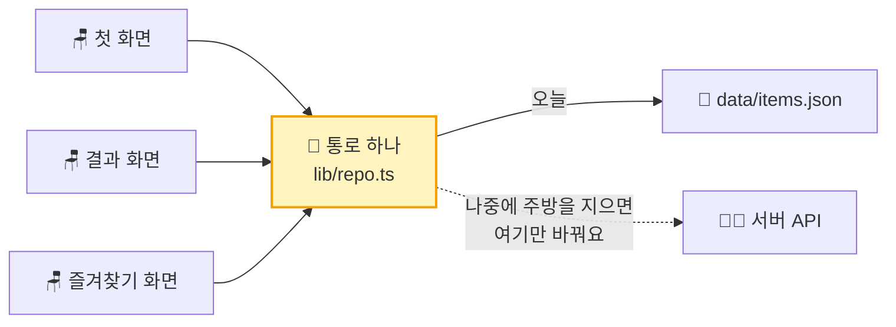

---

# ⚡ 3단계 · 기능 1개 추가 (17~23분) — "벨을 누르면 직원이 와요"

## 3-1. 왜 딱 1개만?

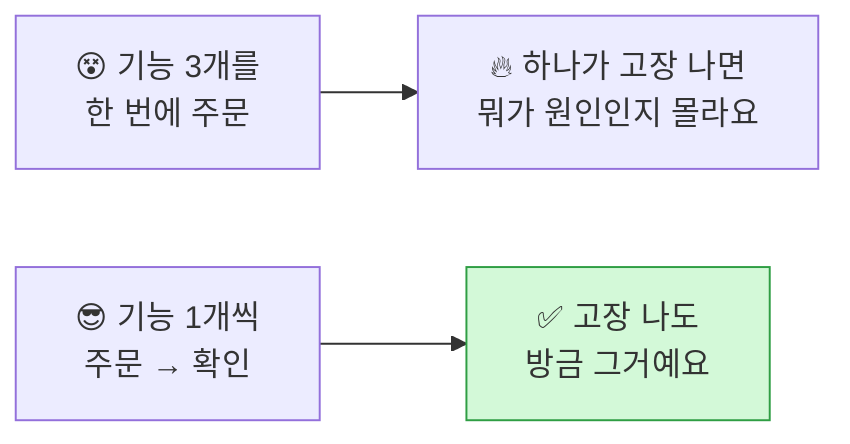

> **비유** — 요리사에게 "볶음밥, 짜장면, 탕수육 동시에!"라고 하면 하나는 꼭 타요. **하나 완성 → 맛보기 → 다음 요리.**

## 3-2. 우리 아이템엔 어떤 기능? — 고르기 사다리

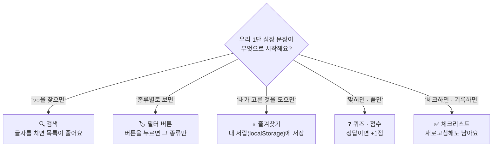

## 3-3. 기능별 주문서 카드 (하나만 골라 쓰기)

| 기능 | 📝 주문서 | 식당 비유 |
|---|---|---|
| 🔍 **검색** | `첫 화면 검색창에 글자를 입력하면, 이름에 그 글자가 들어간 카드만 바로 보여 줘. 결과가 0개면 "앗, 아직 없어요 🥲"라고 보여 줘.` | 메뉴판에서 손가락으로 찾기 |
| 🏷️ **필터** | `○○별로 필터 버튼을 만들어 줘(예: 플라스틱·종이·캔·일반). 버튼을 누르면 그 종류만 보이고, "전체" 버튼을 누르면 다시 다 보이게 해 줘.` | "매운 메뉴만 보여 주세요" |
| ⭐ **즐겨찾기** | `카드마다 ⭐ 버튼을 만들어 줘. 누르면 localStorage에 저장하고, 즐겨찾기 화면에서 모아 보여 줘. 새로고침해도 남아 있게 해 줘.` | 내 서랍에 단골 메뉴 쪽지 넣기 |
| ❓ **퀴즈** | `데이터에서 문제를 하나씩 랜덤으로 내고, 보기 3개 중 고르게 해 줘. 맞히면 🎉와 점수 +1, 틀리면 정답을 알려 줘. 10문제가 끝나면 점수를 보여 줘.` | 오늘의 메뉴 맞히기 게임 |
| ✅ **체크리스트** | `카드마다 체크 버튼을 만들어 줘. 체크한 상태를 localStorage에 저장해서 새로고침해도 남게 하고, 맨 위에 "20개 중 ○개 완료"를 보여 줘.` | 도장 쿠폰 찍기 |

## 3-4. 🗄️ 내 서랍(localStorage)은 어떻게 작동할까?

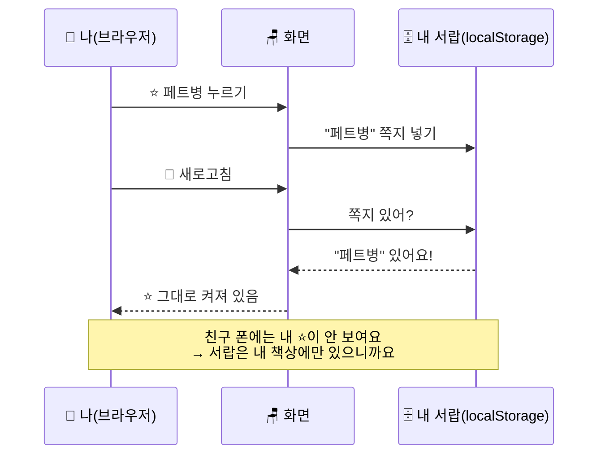

> **🔒 서랍에 넣으면 안 되는 것** — 비밀번호, 진짜 이름, 전화번호, 주소. **서랍은 잠금장치가 없어요.**
> **❓ 친구 폰에도 보이게 하고 싶다면?** → 그때가 바로 **③ 진짜 식당(서버 + 냉장고)** 을 지을 때예요. 오늘은 여기까지!

---

# 🕵️ 4단계 · 탐정 놀이 + 고치기 (23~30분) — "개업 전 리허설"

## 4-1. 왜 탐정 놀이를 할까?

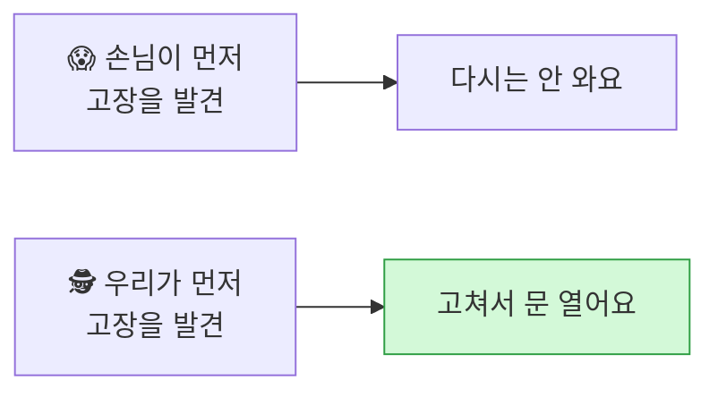

> **핵심** — AI는 **'돌아가는 것'** 까지 만들어 줘요. **'믿고 쓸 수 있는지'** 는 **사람(탐정)** 이 확인해요. ⛵ 종이배 → 🚢 여객선!

## 4-2. 탐정 순서 — 찾기 → 적기 → 하나만 고치기 → 다시 확인

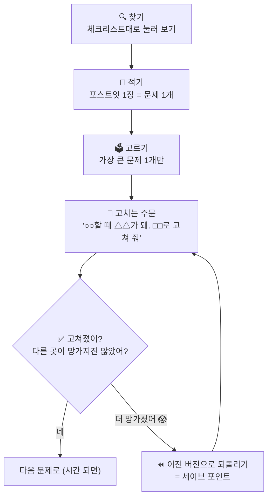

## 4-3. 🕵️ 탐정 체크리스트 (팀당 1장 · 7개만)

| # | 탐정 질문 | 해 보는 법 | O / X |
|:---:|---|---|:---:|
| 1 | 😶 결과가 **0개**면 뭐라고 나와요? | 검색창에 `ㅋㅋㅋ` 입력 | |
| 2 | 🤪 **이상한 입력**에 깨지지 않아요? | 이모지 😀 · 아주 긴 글 · 빈칸으로 버튼 누르기 | |
| 3 | 📱 **휴대폰**에서 잘 보여요? | 미리보기를 휴대폰 크기로 바꾸기 (또는 크롬 창을 좁게) | |
| 4 | 👆 버튼이 **손가락으로 누르기** 쉬워요? | 휴대폰 크기에서 손가락으로 가리켜 보기 | |
| 5 | 🔄 **새로고침**해도 ⭐·✅가 남아요? | 누르고 → 새로고침 | |
| 6 | 🔒 **진짜 개인정보**가 없어요? | 데이터 20건 훑어보기 | |
| 7 | 🎯 **페르소나의 문제가 풀렸어요?** | 페르소나인 척 처음부터 써 보기 | |

## 4-4. 고치는 주문의 공식 — **"○○할 때 △△가 돼. □□로 고쳐 줘"**

| 😵 나쁜 주문 | 😎 좋은 주문 |
|---|---|
| `이상해. 고쳐 줘.` | `검색 결과가 0개일 때 하얀 화면만 나와. "앗, 아직 없어요 🥲"라는 글과 처음으로 돌아가는 버튼을 보여 줘.` |
| `휴대폰에서 안 예뻐.` | `휴대폰 화면에서 카드가 옆으로 잘려. 휴대폰에서는 카드가 한 줄에 1개씩 보이게 해 줘.` |
| `별표가 안 돼.` | `⭐를 누르고 새로고침하면 별표가 사라져. localStorage에 저장해서 새로고침해도 남게 해 줘.` |

> **비유** — 병원에서 "아파요"보다 **"계단 내려갈 때 오른쪽 무릎이 아파요"** 라고 해야 의사가 정확히 고쳐 줘요.

## 4-5. 🆘 막혔을 때 대처표

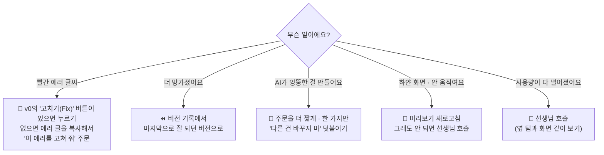

| 증상 | 비유 | 해결 주문 / 행동 |
|---|---|---|
| 빨간 에러 | 🔥 주방에서 연기 | 에러 문장 그대로 복사 → `이 에러를 고쳐 줘. 다른 부분은 바꾸지 마.` |
| 고쳤더니 다른 곳이 망가짐 | 🧱 벽 고치다 창문 깨짐 | ⏪ 되돌리기 → 주문을 더 **좁게** |
| 한국어가 영어로 바뀜 | 🌏 메뉴판이 외국어 | `화면의 모든 글자를 한국어로 바꿔 줘.` |
| 디자인이 갑자기 바뀜 | 🎨 인테리어가 통째로 바뀜 | `색과 배치는 그대로 두고 ○○만 바꿔 줘.` |
| 데이터가 샘플로 돌아감 | 🍱 진열장이 비었음 | `data 폴더의 JSON 20개만 쓰고 샘플 데이터는 쓰지 마.` |

---

# 🎊 5단계 · 가게 오픈 (30~35분) — "간판 달고 문 열기"

## 5-1. 배포(Deploy)가 뭐예요?

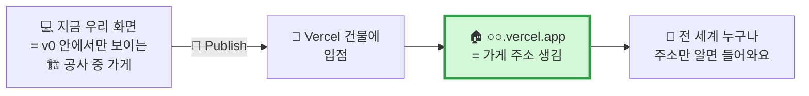

> **비유** — 지금까지는 **공사 중인 가게** 안에서 우리끼리 구경했어요. **Publish**를 누르면 **Vercel이라는 상가 건물**에 가게가 들어가고 **주소**가 생겨요. 이제 친구가 그 주소로 찾아올 수 있어요.

## 5-2. 순서

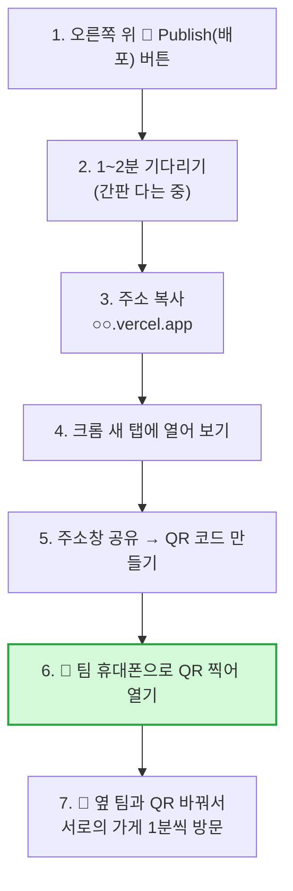

> **⚠️ 배포 전 마지막 확인 (선생님이 팀마다 10초씩)** — 🔒 탐정 체크 6번(개인정보 없음) ✅ 확인 후 Publish.
> 배포하면 **주소를 아는 누구나** 볼 수 있어요. 이게 **"책임"** 의 시작이에요.

> **💡 고치면 어떻게 돼요?** — v0에서 고친 뒤 **다시 Publish**하면 **같은 주소**의 가게가 새 모습으로 바뀌어요. (리모델링 후 재오픈)

## 5-3. 🔄 옆 팀 가게 방문 (1분) — 손님 카드

| 🙋 손님 카드 | 적기 |
|---|---|
| 👍 좋았던 점 1개 | |
| 🤔 헷갈렸던 점 1개 | |
| 💡 "이게 있으면 좋겠어요" 1개 | |

> 이 카드가 바로 **공모전의 "사용자 반응" 증거**예요. 사진 찍어 두세요.

---

# 🪞 6단계 · 회고와 기록 (35~40분) — "오늘의 장사 일기"

## 6-1. 왜 회고를 할까?

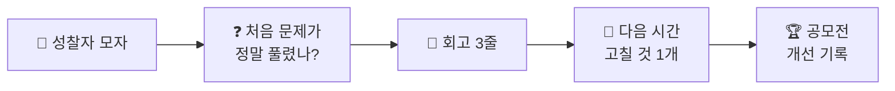

> **비유** — 장사를 마친 사장님이 **"오늘 뭐가 잘 팔렸지? 손님이 뭘 불편해했지?"** 를 적어야 내일 더 잘해요.

## 6-2. 회고 3줄 (팀당 1장)

```
┌──────────────────────────────────────────────────────┐
│ 🪞 오늘의 장사 일기            팀: ______           │
├──────────────────────────────────────────────────────┤
│ 🏠 우리 가게 주소 : https://________.vercel.app     │
├──────────────────────────────────────────────────────┤
│ ✅ 잘된 것   : ______________________________       │
│ 🕵️ 찾은 문제 : ______________________________       │
│ 🔁 다음에 고칠 것 1개 : ______________________       │
├──────────────────────────────────────────────────────┤
│ 🎯 페르소나의 문제가 풀렸나?  😀 많이 / 🙂 조금 / 😐 아직 │
│ 📝 오늘 AI에게 주문한 횟수 : ____ 번                 │
└──────────────────────────────────────────────────────┘
```

## 6-3. 🏆 공모전 증거 상자 — 오늘 꼭 남길 4가지

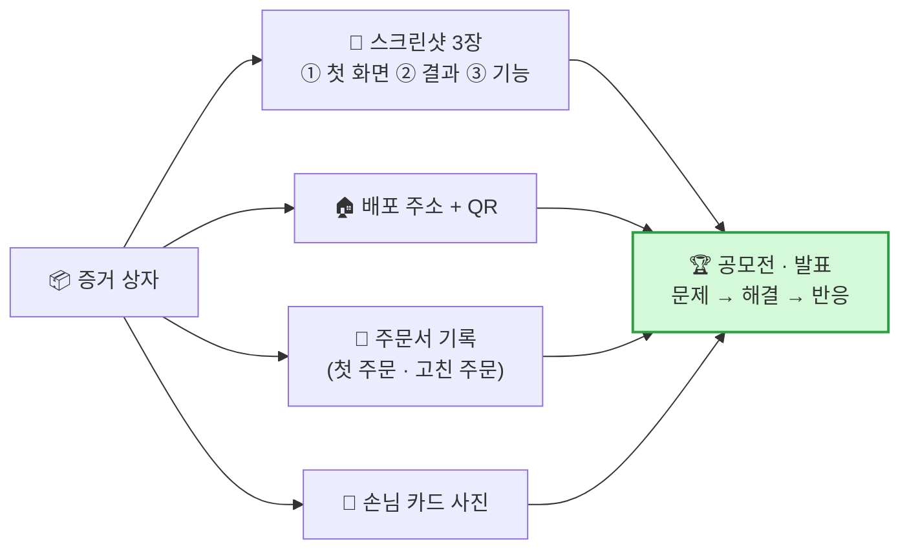

| 증거 | 왜 중요해요? |
|---|---|
| 📸 스크린샷 | 나중에 고치면 지금 모습이 사라져요. **"처음 → 나중" 비교**가 성장의 증거예요 |
| 🏠 주소 · QR | 심사위원이 **직접 눌러 볼 수** 있어요. "진짜 작동한다"의 가장 강한 증거 |
| 📝 주문서 기록 | **"내가 AI를 어떻게 지휘했는지"** 를 보여 줘요. 바이브 코딩의 핵심 실력 |
| 🙋 손님 카드 | "사람들이 써 봤다"는 증거. **반응 → 개선**으로 이어져요 |

> **🗣️ 선생님 대사 (마무리 30초)**
> "오늘 여러분은 코드를 한 줄도 직접 안 썼어요. 그런데 **진짜 인터넷 주소가 있는 가게**를 열었어요.
> 이게 바이브 코딩이에요. **여러분이 지휘자였고, AI가 연주자였어요.**
> 다음 시간엔 손님 5명의 의견을 듣고 **가게를 더 좋게 고쳐 볼 거예요.**"

---

## 📌 수업 안에서 끝낼 것 vs 과제

| 구분 | 내용 | 이유 |
|---|---|---|
| ✅ **수업 안에서 반드시** | 화면 + 데이터 20건 + **배포 주소** | 주소가 있어야 과제(사용자 테스트)를 할 수 있어요 |
| 📝 과제 1 | **사용자 5명**에게 주소를 보내고 손님 카드 받기 | 공모전 "사용자 반응" 증거 |
| 📝 과제 2 | 회고의 **"다음에 고칠 것"을 주문서로** 써 오기 | 다음 시간 첫 주문으로 바로 씁니다 |
| 📝 과제 3 (선택) | 데이터 **20건 → 40건** 늘리기 | 진열장이 풍성해질수록 검색·필터가 빛나요 |

---

## 🏗️ 부록 A. v0가 만든 가게 안을 들여다보면 — 프로젝트 구조

> 오늘은 **구경만** 합니다. "AI가 이렇게 방을 나눠 지었구나"를 알아보는 눈을 키워요. 📂 코드 보기에서 함께 찾아보세요.

```mermaid
flowchart TB
    ROOT["🏢 우리 가게 (프로젝트)"]
    ROOT --> APP["📂 app/<br/>🚪 방(페이지)들<br/>page.tsx = 정문(첫 화면)"]
    ROOT --> COMP["📂 components/<br/>🪑 가구(부품)<br/>카드 · 버튼 · 검색창"]
    ROOT --> DATA["📂 data/<br/>🍱 진열장<br/>items.json (20건)"]
    ROOT --> LIB["📂 lib/<br/>🚪 통로<br/>repo.ts (데이터 가져오는 문)"]
    ROOT --> PUB["📂 public/<br/>🖼️ 사진 창고<br/>이미지 · 아이콘"]
    APP --> COMP
    COMP --> LIB
    LIB --> DATA
    style DATA fill:#fff3bf,stroke:#f59f00
    style LIB fill:#fff3bf,stroke:#f59f00
```

| 폴더 · 파일 | 비유 | 하는 일 |
|---|---|---|
| `app/page.tsx` | 🚪 정문 | 주소로 들어오면 처음 보이는 화면 |
| `app/favorites/page.tsx` | 🚪 안쪽 방 | `주소/favorites` 로 가는 즐겨찾기 화면 |
| `components/` | 🪑 가구 | 여러 방에서 **같이 쓰는** 카드·버튼 (가구를 한 번 만들어 여러 방에 놓기) |
| `data/items.json` | 🍱 진열장 | 우리 데이터 20건 |
| `lib/repo.ts` | 🚪 통로 하나 | 화면이 데이터를 가져오는 **유일한 문** → 나중에 서버로 바꾸는 곳 |
| `public/` | 🖼️ 사진 창고 | 그림 파일 |
| `package.json` | 📋 재료 주문 목록 | 이 가게가 쓰는 도구(라이브러리) 목록 |

## 🏗️ 부록 B. 오늘 가게에서 → 진짜 식당까지 (앞으로의 지도)

```mermaid
flowchart LR
    T["🍱 오늘<br/>프론트 + JSON + 서랍<br/>(v0 · Vercel)"] --> N1["🔧 다음<br/>사용자 5명 피드백<br/>→ 고치기 2~3바퀴"]
    N1 --> N2["👨‍🍳 주방 짓기<br/>서버 · DB · 관리자 장부<br/>(Django · Supabase 등)"]
    N2 --> N3["🛵 외부 셰프<br/>AI · 날씨 · 지도 API<br/>🔑 키는 주방 금고에"]
    N3 --> N4["🏬 2호점<br/>휴대폰 앱<br/>(React Native)"]
    T -.->|"통로(repo.ts)만 바꾸면<br/>화면은 그대로"| N2
    style T fill:#fff3bf,stroke:#f59f00,stroke-width:3px
```

| 단계 | 언제 필요해요? | 무엇이 바뀌어요? |
|---|---|---|
| 🍱 오늘 | 손님 반응을 **먼저** 보고 싶을 때 | — |
| 👨‍🍳 주방 짓기 | **"친구 폰에도 내 데이터가 보여야 해!"** | 통로(`repo.ts`) 뒤만 진열장 → 주방으로 교체 |
| 🛵 외부 셰프 | **"AI가 진짜로 답하게 하고 싶어!"** | 주방이 외부 셰프를 부름 · **키는 절대 홀에 두지 않기** |
| 🏬 2호점 | **"앱스토어에 올리고 싶어!"** | 인테리어(태그·스타일)만 바뀌고 주방·메뉴는 그대로 |

## 🧾 부록 C. 아이템 유형별 주문서 ① 예시 (막힌 팀에게 건네기)

| 유형 | 예시 아이템 | 🎨 주문서 ① 핵심 문장 |
|---|---|---|
| 🔍 **찾기형** | 분리수거 도우미 · 우리 동네 놀이터 지도 | `○○ 이름을 검색하면 → △△ 정보가 카드로 나오는 웹사이트` |
| ❓ **퀴즈형** | 영어 단어 퀴즈 · 수도 맞히기 | `문제가 하나씩 나오고 → 맞히면 점수가 올라가는 웹사이트` |
| ✅ **기록형** | 독서 체크 · 물 마시기 기록 | `○○을 하면 체크하고 → 이번 주 몇 개 했는지 보이는 웹사이트` |
| 🎯 **추천형** | 오늘 뭐 입지 · 급식 메뉴 골라주기 | `기분 · 날씨 버튼을 누르면 → 어울리는 ○○를 추천해 주는 웹사이트 (추천 목록 20개 중에서)` |
| 💛 **마음형** | 감정 일기 · 칭찬 카드 | `오늘 기분 이모지를 고르면 → 응원 문장이 나오고 내 서랍에 기록되는 웹사이트` |

> **AI가 필요해 보이는 아이템(추천·마음형)도 오늘은 ②번 식당으로** — 진짜 AI 대신 **"AI가 했을 법한 답 20개"를 진열장에 미리 넣어 두고** 골라서 보여줘요. 손님 반응을 보는 데는 충분해요. (1차시 "흉내 내기")
